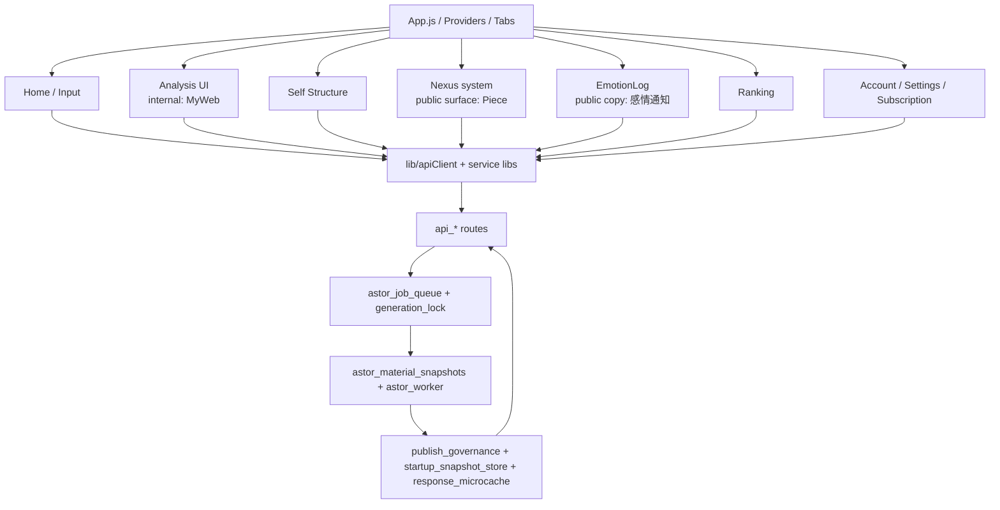

# 1. 1行定義

現行の Cocolon は、**App.js / Provider / Tab 導線** を入口に、  
**Input / Analysis(MyWeb) / Self Structure / Piece(Nexus) / EmotionLog / Ranking / Account/Settings** が並び、  
裏側で **mashos-api の route / snapshot / worker / publish governance / startup snapshot** が支える構造です。

# 2. 全体レイヤ図



# 3. いまの visible 名と internal 名

| 領域 | visible 名 | internal / canonical 名 | まず開くファイル |
|---|---|---|---|
| Home | Home | Input | `screens/InputScreen.js` |
| Analysis | Analysis | MyWeb | `screens/MyWebScreen.js` |
| Self Structure | 自己構造 | MyProfile / self-structure / structural | `screens/SelfStructureReportGenerateScreen.js` |
| Piece画面 | Piece | Nexus system / MyModel route legacy | `screens/MyModelEntryScreen.js`, `screens/NexusScreen.js` |
| ProfileCreate | ProfileCreate | MyModelCreate legacy | `screens/MyModelCreateScreen.js`, `api_mymodel_create.py` |
| EmotionGeneratedPiece | Piece作成 | emotion/reflection flow | `screens/InputScreen.js`, `api_emotion_reflection.py` |
| 感情通知 | 感情通知 / 感情ログ | EmotionLog / /emotion-log / legacy /friends | `screens/EmotionLogScreen.js`, `api_friends.py` |
| Settings | Settings | Settings stack | `screens/SettingsScreen.js` |

# 4. App.js が現在どう読めるか

## 4-1. visible tab label は新名称
```js
          tabBarLabel: ({ focused, color }) => {
            let label;
            switch (route.name) {
              case "Input": label = "Home"; break;
              case "MyWeb": label = "Analysis"; break;
              case "MyModel":
              case "MyProfile": label = "Piece"; break;
              case "RankingTop": label = "Ranking"; break;
              case "Settings": label = "Settings"; break;
              default: label = route.name;
```

この時点での事実は 2 つです。

- **表示名** は `Analysis / Piece / Settings`
- しかし **route 名** は `MyWeb / MyModel / MyProfile / Settings`

つまり、**表示名の整理は進んでいるが、内部 route/file 名の rename はまだ終わっていない**。

## 4-2. Piece 領域の入口は MyModelEntryScreen
```js
import React from "react";

import MyModelScreen from "./MyModelScreen";
import NexusScreen from "./NexusScreen";

export default function MyModelEntryScreen(props) {
  const hasLinkPayload = !!props?.linkPayload;

  if (hasLinkPayload) {
    return <MyModelScreen {...props} />;
  }

  return <NexusScreen {...props} />;
```

この時点での事実は次です。

- 通常遷移では `NexusScreen`
- `linkPayload` がある時だけ `MyModelScreen`

つまり、**Piece 領域の主入口は Nexus に寄っているが、旧 MyModel 名の fallback / legacy 面もまだ残っている**。

# 5. システム単位の読み方

## 5-1. Input / Home
主対象:
- `screens/InputScreen.js`
- `components/NoticeModal.js`
- `components/TodayQuestionCard.js`
- `components/EmotionReflectionPreviewModal.js`
- `lib/noticeApi.js`
- `lib/todayQuestionApi.js`
- `lib/emotionReflectionApi.js`

backend 側:
- `api_emotion_submit.py`
- `api_notice.py`
- `api_today_question.py`
- `api_input_summary.py`
- `api_global_summary.py`
- `api_emotion_reflection.py`

## 5-2. Analysis / MyWeb
主対象:
- `screens/MyWebScreen.js`
- `screens/MyWebContentFirstScreen.js`
- `screens/MyWebReportHistoryScreen.js`
- `screens/MyWebReportViewerScreen.js`
- `screens/MyWebHistoryScreen.js`
- `screens/DeepInsightScreen.js`

backend 側:
- `api_myweb_reports.py`
- `api_myweb_reads.py`
- `api_report_reads.py`
- `api_deep_insight.py`
- `publish_governance.py`
- `response_microcache.py`

## 5-3. Self Structure
主対象:
- `screens/SelfStructureReportGenerateScreen.js`
- `screens/SelfStructureReportHistoryScreen.js`
- `screens/SelfStructureReportViewerScreen.js`
- `components/selfStructure/SelfStructureDeepRenderer.js`

backend 側:
- `api_myprofile.py`
- `api_myprofile_reports_read.py`
- `astor_material_snapshots.py`
- `astor_worker.py`
- `analysis_engine/self_structure_engine/*`

## 5-4. Piece / Nexus
主対象:
- `screens/MyModelEntryScreen.js`
- `screens/NexusScreen.js`
- `screens/MyModelScreen.js`
- `screens/MyModelReflectionsScreen.js`
- `screens/MyModelReactionHistoryScreen.js`
- `lib/nexusApi.js`

backend 側:
- `api_nexus.py`
- `api_mymodel_qna.py`
- `generated_reflection_display.py`
- `astor_reflection_store.py`
- `astor_reflection_engine.py`

## 5-5. ProfileCreate
主対象:
- `screens/MyModelCreateScreen.js`
- `screens/AccountScreen.js`

backend 側:
- `api_mymodel_create.py`
- `mymodel_entitlements.py`
- `subscription.py`
- `subscription_store.py`

## 5-6. EmotionGeneratedPiece
主対象:
- `screens/InputScreen.js`
- `components/EmotionReflectionPreviewModal.js`
- `lib/emotionReflectionApi.js`

backend 側:
- `api_emotion_reflection.py`
- `emotion_reflection_generation_service.py`
- `emotion_reflection_store.py`
- `emotion_submit_service.py`
- `reflection_publish_entitlements.py`

## 5-7. EmotionLog / 感情通知
主対象:
- `screens/EmotionLogScreen.js`
- `screens/FollowListScreen.js`
- `screens/AccountScreen.js`

backend 側:
- `api_friends.py`
- `astor_friend_feed_store.py`
- `startup_snapshot_store.py`

## 5-8. startup / unread / bootstrap
主対象:
- `App.js`
- `UnreadContext.js`
- `components/UnreadBadge.js`

backend 側:
- `api_app_bootstrap.py`
- `startup_snapshot_store.py`
- `api_notice.py`
- `api_today_question.py`
- `api_report_reads.py`
- `api_global_summary.py`
- `response_microcache.py`

# 6. いまの重要コード断面

## 6-1. Analysis title はすでに新名称
```js
        onScroll={onTutorialScroll}
      >
        {/* パネルヘッダー：MyWeb */}
        <View style={styles.panelHeader}>
          <View ref={tutorialRefs?.titleRef} collapsable={false} style={styles.panelTitleRow}>
            <Text style={styles.panelTitle}>Analysis</Text>
            <CocolonPressable
              style={styles.guideButton}
              onPress={onOpenGuide}
              accessibilityLabel="Analysisのガイドを開く"
            >
              <Ionicons
                name="help-circle-outline"
                size={20}
                color={colors.TEXT_ON_LIGHT}
              />
            </CocolonPressable>
          </View>
```

## 6-2. ProfileCreate はすでに UI 名として使われている
```js
          <View style={styles.panelHeader}>
            <CocolonBackButton onPress={onBack} style={{ width: 72 }} />

            <Text style={styles.panelTitle}>ProfileCreate</Text>

            <View style={{ width: 72 }} />
          </View>

          {/* 説明 */}
          <View style={styles.introCard}>
            <Text style={styles.introTitle}>5つの問いに答えて、プロフィールを作成</Text>
            <Text style={styles.introText}>
              {introSubscriptionBenefit}{"\n"}
              Account 画面で編集される、固定的な自己紹介 / プロフィール資産です。{"\n"}
              他ユーザーには、回答済みの項目だけが表示されます。{"\n"}
              全てに答える必要はありません。{"\n"}
              「保存する」を押すと、答えた内容だけが更新されます。{"\n"}
              {introSecretToggleNote}
            </Text>
            <View style={styles.progressRow}>
              <Text style={styles.progressText}>
                回答済み：{answeredCount}/{totalQuestions}
              </Text>
            </View>
```

## 6-3. Input からは別系統の Piece 作成がある
```js

                  </View>
                ) : null}

                {!isTutorialMode ? (
                  <View style={styles.buttonWrapper}>
                    <CocolonButton
                      variant="secondary"
                      onPress={handlePreviewReflection}
                      disabled={!canPreviewReflection}
                      loading={reflectionPreviewLoading}
                      accessibilityLabel="Pieceを作成する"
                    >
                      Pieceを作成する
                    </CocolonButton>
                  </View>
                ) : null}

                <View
                  ref={okButtonRef}
                  collapsable={false}
                  style={styles.buttonWrapper}
                >
                  <CocolonButton
                    variant="primary"
                    onPress={handleOk}
```

# 7. 現時点で華恋が特に誤読しやすい点

1. **Analysis = MyWeb**  
   表示名と internal canonical が違う。

2. **Piece画面 = Nexus surface**  
   ただし route/file/API には `MyModel` が多数残る。

3. **ProfileCreate と EmotionGeneratedPiece は別物**  
   どちらも「Pieceっぽく」見えるが、入力起点も保存先の意味も違う。

4. **EmotionLog は /friends 互換を残す**  
   UI が新しくても backend 互換経路は旧名を維持する。

5. **MyWeb / Self Structure / Piece は画面だけ見ても足りない**  
   publish / worker / snapshot / unread を裏で持つ。

# 8. 最短の確認順

変更指示を受けたら、まず次の順で見る。

1. `03_Cocolon_命名体系.md`
2. `inventory/focus_map.yaml`
3. 該当 system の frontend 入口
4. 該当 client lib
5. 該当 backend api_*
6. 派生 state / publish / startup が絡むなら national system 側

# 9. inventory の使い方

- 全件一覧:  
  `inventory/Cocolon_inventory_full.csv`  
  `inventory/mashos-api_inventory_full.csv`

- 画面 / client lib と endpoint 対応:  
  `inventory/frontend_endpoint_map.csv`

- backend route 一覧:  
  `inventory/backend_route_inventory.csv`

- public API contract 一覧:  
  `inventory/public_api_registry.csv`

- worker job 一覧:  
  `inventory/worker_job_map.csv`
