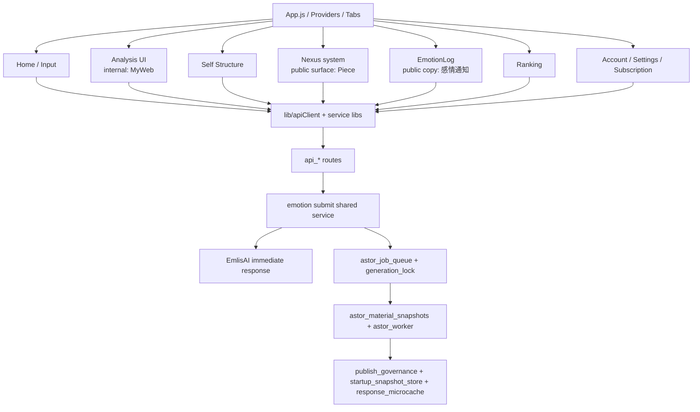

# 1. 1行定義

現行の Cocolon は、**App.js / Provider / Tab 導線** を入口に、  
**Input / Analysis(MyWeb) / Self Structure / Piece(Nexus) / EmotionLog / Ranking / Account/Settings** が並び、  
裏側で **mashos-api の route / snapshot / worker / publish governance / startup snapshot** が支える構造です。  

今回ここへ新しく入ったのが、**Input 直後返答を server-owned で返す EmlisAI immediate response path** です。

# 2. 全体レイヤ図

# 3. いまの visible 名と internal 名

| 領域 | visible 名 | internal / canonical 名 | まず開くファイル |
|---|---|---|---|
| Home | Home | Input | `screens/InputScreen.js` |
| Analysis | Analysis | MyWeb | `screens/MyWebScreen.js` |
| Self Structure | 自己構造 | MyProfile / self-structure / structural | `screens/SelfStructureReportGenerateScreen.js` |
| Piece画面 | Piece | Nexus system / MyModel route legacy | `screens/MyModelEntryScreen.js`, `screens/NexusScreen.js` |
| ProfileCreate | ProfileCreate | MyModelCreate legacy | `screens/MyModelCreateScreen.js`, `api_mymodel_create.py` |
| EmotionGeneratedPiece | Piece作成 | emotion/reflection flow | `screens/InputScreen.js`, `api_emotion_reflection.py` |
| 感情通知 | 感情通知 / 感情ログ | EmotionLog / /emotion-log / legacy /friends | `screens/EmotionLogScreen.js`, `api_friends.py` |
| Settings | Settings | Settings stack | `screens/SettingsScreen.js` |
| Emlis | Emlis | app-facing persona | `InputScreen.js` / subscription copy / EmlisAI reply |
| EmlisAI | EmlisAI | immediate response engine | `emotion_submit_service.py`, `emlis_ai_reply_service.py` |

# 4. App / surface 側の current fact

## 4-1. Input 直後返答の UI surface は既存導線を使う

EmlisAI は新しい画面を増やしていません。  
`InputScreen.js` は引き続き `input_feedback.comment_text` を受け取り、入力後モーダルで表示します。  

つまり、**UI の source of truth は変わらず、返答中身だけが server 側で EmlisAI に差し替わった**構造です。

## 4-2. Cocolon 側の repo-synced 変更は `lib/iap/iapRuntimeCatalog.js`

Cocolon 側で repo-synced に変わったのは、EmlisAI を plan feature として説明する課金 runtime copy です。  
Plus / Premium の差分 copy はこのファイルで normalize されます。  

したがって、EmlisAI の体験差分を触る時は backend だけ見ず、**`lib/iap/iapRuntimeCatalog.js` も確認**します。

# 5. システム単位の読み方

## 5-1. Input / Home
主対象:
- `screens/InputScreen.js`
- `components/NoticeModal.js`
- `components/TodayQuestionCard.js`
- `components/EmotionReflectionPreviewModal.js`
- `lib/noticeApi.js`
- `lib/todayQuestionApi.js`
- `lib/emotionReflectionApi.js`

backend 側:
- `api_emotion_submit.py`
- `emotion_submit_service.py`
- `api_notice.py`
- `api_today_question.py`
- `api_input_summary.py`
- `api_global_summary.py`
- `api_emotion_reflection.py`

## 5-2. EmlisAI immediate response
主対象:
- `emotion_submit_service.py`
- `api_emotion_submit.py`
- `api_emotion_reflection.py`
- `emlis_ai_capability.py`
- `emlis_ai_context_service.py`
- `emlis_ai_world_model_service.py`
- `emlis_ai_style_profile_service.py`
- `emlis_ai_reply_service.py`
- `emlis_ai_greeting_state_store.py`
- `emotion_history_search_service.py`
- `input_feedback_text_templates.py`（fallback）
- `api_subscription.py`
- `subscription_bootstrap_store.py`
- `lib/iap/iapRuntimeCatalog.js`

読み方の要点:
- route ではなく `emotion_submit_service.py` を source of truth として読む
- EmlisAI は immediate/synchronous path であり、worker family ではない
- tier 差分は capability と subscription copy をセットで見る

## 5-3. Analysis / MyWeb
主対象:
- `screens/MyWebScreen.js`
- `screens/MyWebContentFirstScreen.js`
- `screens/MyWebReportHistoryScreen.js`
- `screens/MyWebReportViewerScreen.js`
- `screens/MyWebHistoryScreen.js`
- `screens/DeepInsightScreen.js`

backend 側:
- `api_myweb_reports.py`
- `api_myweb_reads.py`
- `api_report_reads.py`
- `api_deep_insight.py`
- `publish_governance.py`
- `response_microcache.py`

## 5-4. Self Structure
主対象:
- `screens/SelfStructureReportGenerateScreen.js`
- `screens/SelfStructureReportHistoryScreen.js`
- `screens/SelfStructureReportViewerScreen.js`
- `components/selfStructure/SelfStructureDeepRenderer.js`

backend 側:
- `api_myprofile.py`
- `api_myprofile_reports_read.py`
- `astor_material_snapshots.py`
- `astor_worker.py`
- `analysis_engine/self_structure_engine/*`

## 5-5. Piece / Nexus
主対象:
- `screens/MyModelEntryScreen.js`
- `screens/NexusScreen.js`
- `screens/MyModelScreen.js`
- `screens/MyModelReflectionsScreen.js`
- `screens/MyModelReactionHistoryScreen.js`
- `lib/nexusApi.js`

backend 側:
- `api_nexus.py`
- `api_mymodel_qna.py`
- `generated_reflection_display.py`
- `astor_reflection_store.py`
- `astor_reflection_engine.py`

## 5-6. Account / Settings / Subscription
主対象:
- `screens/AccountScreen.js`
- `screens/SettingsScreen.js`
- `screens/SettingsAppSettingsScreen.js`
- `screens/SettingsOtherScreen.js`
- `screens/SubscriptionSelectScreen.js`
- `lib/subscriptionApi.js`
- `lib/iap/iapRuntimeCatalog.js`
- `lib/iap/iapService.js`

backend 側:
- `api_subscription.py`
- `subscription_bootstrap_store.py`
- `subscription.py`
- `subscription_store.py`
- `subscription_projection.py`

# 6. current implementation conclusion

今回の current repo では、EmlisAI は次の形で固定されています。

1. 入力保存は引き続き `emotion_submit_service.persist_emotion_submission()` に集約する
2. 保存直後に `render_emlis_ai_reply(...)` を呼ぶ
3. public response は `input_feedback.comment_text` を維持する
4. additive で `input_feedback.emlis_ai` meta を返す
5. `/emotion/reflection/publish` でも同じ shared service 由来の返答を使う
6. subscription bootstrap / IAP copy で Plus / Premium の EmlisAI 価値差分を見せる

# 7. いま特に誤読しやすい点

1. **EmlisAI は UI 機能ではなく backend 中枢差し替え**  
   InputScreen を見ても本体は分からない。

2. **EmlisAI は worker job ではない**  
   国家システムにいるが、ASTOR 非同期 path ではなく immediate path である。

3. **subscription copy と capability 決定は別**  
   plan 文言は `subscription_bootstrap_store.py` と `iapRuntimeCatalog.js`、  
   実際の tier capability は `emlis_ai_capability.py` と reply path が持つ。

4. **`input_feedback_text_templates.py` は fallback**  
   template を増やしても、本体改善にはならない。

# 8. 最短の確認順

EmlisAI を含む変更指示を受けたら、まず次の順で見ます。

1. `03_Cocolon_命名体系.md`
2. `07_Cocolon_最新スナップショット差分.md`
3. `inventory/focus_map.yaml`
4. `emotion_submit_service.py`
5. `emlis_ai_*` 群
6. `api_emotion_submit.py` / `api_emotion_reflection.py`
7. `api_subscription.py` / `subscription_bootstrap_store.py`
8. `lib/iap/iapRuntimeCatalog.js`
