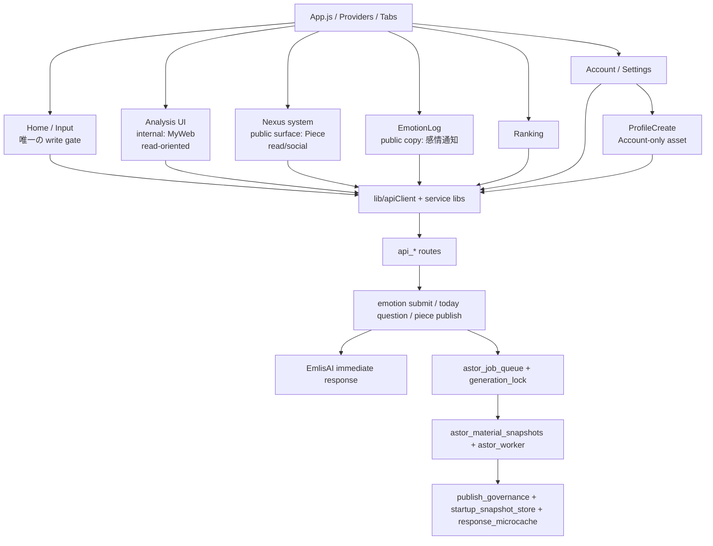

# 1. 1行定義

現行の Cocolon は、**Home を唯一の write gate** に置き、  
**Input / Today Question / Piece作成** をそこへ集約し、  
**Analysis(MyWeb) / Piece(Nexus) / EmotionLog / Ranking / Account/Settings** は主に read / social / account 管理の surface として並ぶ構造です。  
裏側では **mashos-api の route / EmlisAI / snapshot / worker / publish governance / startup snapshot** が支えます。

# 2. 全体レイヤ図

# 3. いまの visible 名と internal 名

| 領域 | visible 名 | internal / canonical 名 | まず開くファイル |
|---|---|---|---|
| Home | Home | Input | `screens/InputScreen.js` |
| Analysis | Analysis | MyWeb | `screens/MyWebScreen.js` |
| Piece画面 | Piece | Nexus system / MyModel route legacy | `screens/MyModelEntryScreen.js`, `screens/NexusScreen.js` |
| Piece単体 | Piece | emotion-generated reflection canonical / generated reflection canonical | `screens/InputScreen.js`, `api_emotion_reflection.py` |
| ProfileCreate | ProfileCreate | MyModelCreate legacy | `screens/MyModelCreateScreen.js`, `api_mymodel_create.py` |
| EmotionLog | 感情通知 | EmotionLog / legacy friends/feed | `screens/EmotionLogScreen.js`, `api_friends.py` |
| Ranking | Ranking | ranking_* / astor_ranking_* | `screens/RankingTopScreen.js`, `api_ranking.py` |
| Emlis | Emlis | app-facing persona | `InputScreen.js` / subscription copy / EmlisAI reply |
| EmlisAI | EmlisAI | immediate response engine | `emotion_submit_service.py`, `emlis_ai_reply_service.py` |
| DeepInsight | なし（current live flow から外した） | legacy file / helper / data 名 | `screens/DeepInsightScreen.js`, `api_deep_insight.py` は orphan cleanup 観点で確認 |

# 4. App / surface 側の current fact

## 4-1. Home が唯一の write gate

current live flow で primary write として扱うのは次だけです。

- `InputScreen.js` の感情入力
- `TodayQuestionCard.js` / Today Question 回答
- `EmotionReflectionPreviewModal.js` を経る Piece preview / publish

## 4-2. Piece 画面は read/social 面

`MyModelScreen.js` / `NexusScreen.js` は Piece 作成入口ではありません。  
current visible flow では、**Piece 作成は Home から行い、Piece 画面は閲覧・共鳴・発見の read/social 面**として読むこと。

tutorial mode の sandbox 導線は残る場合がありますが、通常運用の作成入口とは分けて読むこと。

## 4-3. ProfileCreate は Account 側でだけ開く

`App.js` では `ProfileCreate` を Root 側へ置き、`AccountScreen.js` から開く構造です。  
Piece 画面から `MyModelCreate` へ戻る current product flow は採用しません。

## 4-4. Analysis / MyWeb は read-oriented、DeepInsight は current live flow から外した

`MyWebScreen.js` は current route state として DeepInsight を持ちません。  
public registry / contract registry / app registration からも DeepInsight route は外れています。  
ただし physical file が repo snapshot に残る場合があるので、**live flow と orphan file を分けて読む**こと。

## 4-5. Piece count / ranking は key 名が legacy のまま

Account / Ranking では Piece 数を generated Piece として見せます。  
ただし current public shape は `mymodel_questions_total` / `questions_total` を維持しており、  
**visible semantics は新仕様、key 名は旧 canonical のまま**です。

# 5. システム単位の読み方

## 5-1. Input / Home
主対象:
- `screens/InputScreen.js`
- `components/NoticeModal.js`
- `components/TodayQuestionCard.js`
- `components/EmotionReflectionPreviewModal.js`
- `lib/noticeApi.js`
- `lib/todayQuestionApi.js`
- `lib/emotionReflectionApi.js`

backend 側:
- `api_emotion_submit.py`
- `emotion_submit_service.py`
- `api_notice.py`
- `api_today_question.py`
- `api_input_summary.py`
- `api_global_summary.py`
- `api_emotion_reflection.py`

## 5-2. EmlisAI immediate response
主対象:
- `emotion_submit_service.py`
- `api_emotion_submit.py`
- `api_emotion_reflection.py`
- `emlis_ai_capability.py`
- `emlis_ai_context_service.py`
- `emlis_ai_world_model_service.py`
- `emlis_ai_style_profile_service.py`
- `emlis_ai_reply_service.py`
- `emlis_ai_greeting_state_store.py`
- `emotion_history_search_service.py`
- `input_feedback_text_templates.py`（fallback）
- `api_subscription.py`
- `subscription_bootstrap_store.py`
- `lib/iap/iapRuntimeCatalog.js`

## 5-3. Analysis / MyWeb
主対象:
- `screens/MyWebScreen.js`
- `screens/MyWebContentFirstScreen.js`
- `screens/MyWebReportHistoryScreen.js`
- `screens/MyWebReportViewerScreen.js`
- `screens/MyWebHistoryScreen.js`

backend 側:
- `api_myweb_reports.py`
- `api_myweb_reads.py`
- `api_report_reads.py`
- `publish_governance.py`
- `response_microcache.py`

注意:
- DeepInsight は current live route / current visible flow から外した
- ただし orphan cleanup 観点では `screens/DeepInsightScreen.js` と `api_deep_insight.py` を確認対象から完全には消さない

## 5-4. Piece / Nexus
主対象:
- `screens/MyModelEntryScreen.js`
- `screens/MyModelScreen.js`
- `screens/NexusScreen.js`
- `screens/MyModelReflectionsScreen.js`
- `screens/MyModelReactionHistoryScreen.js`
- `lib/nexusApi.js`

backend 側:
- `api_nexus.py`
- `api_mymodel_qna.py`
- `generated_reflection_display.py`
- `astor_reflection_store.py`
- `astor_reflection_engine.py`

注意:
- current visible flow では `trending / holders` UI を閉じている
- ただし `/mymodel/qna/trending` と `/mymodel/qna/holders` の legacy public route は残る

## 5-5. ProfileCreate / Account asset
主対象:
- `screens/AccountScreen.js`
- `screens/MyModelCreateScreen.js`

backend 側:
- `api_mymodel_create.py`
- `mymodel_entitlements.py`

注意:
- Account 内の孤立プロフィール資産として読む
- Piece / ranking / self structure / premium reflection の材料として再接続しない

## 5-6. Account / Ranking / Piece count
主対象:
- `screens/AccountScreen.js`
- `screens/RankingTopScreen.js`
- `screens/MyModelQuestionsRankingScreen.js`

backend 側:
- `api_account_status.py`
- `astor_account_status_store.py`
- `astor_account_status_kernel.py`
- `api_ranking.py`
- `astor_ranking_kernel.py`

注意:
- current visible meaning は Piece count だが、response key は legacy `mymodel_questions_total` 系を維持する

# 6. current implementation conclusion

この session 後の current snapshot は次の理解で固定します。

1. Home が唯一の write gate
2. Piece = Input 起点の emotion-generated original reflection のみ
3. Piece 画面は read/social 面
4. ProfileCreate は Account-only asset
5. DeepInsight は current live flow から外した
6. Account / Ranking の Piece 数は generated Piece を指すが、legacy key を維持する
