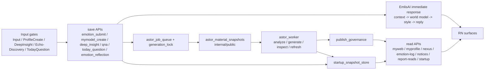

# 1. 1行定義

ここでいう国家システムは、**入力保存 API 群 + immediate response（EmlisAI） + material snapshot + job queue + worker + publish governance + startup snapshot + read-side API** をまとめた運用全体です。  
今回から、従来の非同期 derived-state path に加えて、**Input 直後に同期返答を返す EmlisAI path** が明示的に入っています。

# 2. 実行パイプライン

# 3. 入力窓口（current code fact）

| 入力窓口 | frontend | save API | 備考 |
|---|---|---|---|
| 感情入力 | `screens/InputScreen.js` | `api_emotion_submit.py` | Input の最上流。保存直後に EmlisAI immediate reply を返す |
| secret 切替 | `MyWebHistory` 系 / Input 周辺 | `api_emotion_secret.py` | public snapshot に直結 |
| ProfileCreate | `screens/MyModelCreateScreen.js` | `api_mymodel_create.py` | 固定プロフィール資産 |
| DeepInsight 入力 | `screens/DeepInsightScreen.js` | `api_deep_insight.py` | global 材料側へ入る |
| Piece 反応 | `screens/MyModelReflectionsScreen.js`, `screens/NexusScreen.js` | `api_mymodel_qna.py` | echoes / discoveries / view |
| Today Question | `components/TodayQuestionCard.js` | `api_today_question.py` | startup current でも使う |
| EmotionGeneratedPiece | `screens/InputScreen.js` | `api_emotion_reflection.py` | publish 時も shared save service 経由で EmlisAI を返す |

# 4. 今回追加された immediate response 中枢

| ファイル | 現在の役割 |
|---|---|
| `emotion_submit_service.py` | 入力保存と EmlisAI 呼び出しの単一注入点 |
| `emlis_ai_capability.py` | Free / Plus / Premium の capability 解決 |
| `emlis_ai_context_service.py` | current input / 履歴 / 集計 / Today Question / greeting state 収集 |
| `emlis_ai_world_model_service.py` | facts / hypotheses 構築 |
| `emlis_ai_style_profile_service.py` | 感性寄り / 理論寄りなどの style 判定 |
| `emlis_ai_reply_service.py` | immediate reply 生成中枢 |
| `emlis_ai_greeting_state_store.py` | 時間帯ごとの挨拶 state 管理 |
| `emotion_history_search_service.py` | 履歴検索の内部 helper |
| `input_feedback_text_templates.py` | fallback renderer |

# 5. EmlisAI の synchronous path（current code fact）

## 5-1. `emotion_submit_service.py` が immediate reply の source of truth

今回の実装では、入力後コメントは route ごとに別実装されず、  
**`persist_emotion_submission()` で `render_emlis_ai_reply(...)` を呼ぶ**構造に変わっています。

要点:
- route から comment を直接組み立てない
- shared save service が `input_feedback_comment` と `input_feedback_meta` を返す
- fallback 時のみ `input_feedback_text_templates.py` を使う

## 5-2. `/emotion/submit` と `/emotion/reflection/publish` は同じ返答中枢を使う

`api_emotion_submit.py` は shared service に寄せられ、  
`api_emotion_reflection.py` も publish 後に shared service の `input_feedback_comment / meta` を詰め直します。

要点:
- 通常入力と EmotionGeneratedPiece publish の返答品質を揃える
- 返答 path を二重化しない

## 5-3. EmlisAI は subscription runtime に依存する

EmlisAI の tier 差分は UI ではなく server 側 capability で決まります。  
一方、ユーザー向けの plan 訴求は `subscription_bootstrap_store.py` と `lib/iap/iapRuntimeCatalog.js` で行います。

したがって、EmlisAI は国家システムの中で
- `input_home`
- `account_settings`
をまたぐ cross-cutting system として読む必要があります。

# 6. EmlisAI の情報源仕様（current implementation 前提）

current repo の EmlisAI path が触ってよい情報源は、本人履歴由来に限定します。

使用対象:
- current input
- last input
- same-day recent inputs
- similar inputs
- input summary
- myweb home summary
- latest today question answer
- recent today question answers
- display_name
- greeting state / timezone

使わないもの:
- 外部知識
- global_summary を返答根拠に使うこと
- 他人データ
- ASTOR 非同期生成済み artifact 本文をそのまま immediate reply 根拠に使うこと

# 7. tier 差分（current implementation 前提）

| tier | current retrieval | continuity | style |
|---|---|---|---|
| Free | なし | off | base |
| Plus | 履歴 retrieval あり | basic | adaptive |
| Premium | より深い retrieval / partner continuity | advanced | personalized |

国家システム上の意味:
- Free は immediate response の present-only path
- Plus は retrieval-enabled immediate path
- Premium は partner-response immediate path

# 8. greeting-state の位置づけ

`emlis_ai_greeting_state_store.py` は worker ではなく immediate path の state です。  
この state は greeting のみを持つ軽量 state で、  
**material snapshot / publish governance / startup snapshot の派生 state とは別**です。

重要:
- Supabase に `emlis_ai_greeting_state` を前提とする
- repo と DB がズレやすいので、DDL と外部適用状態を同期管理する
- failure 時に immediate reply 全体を落とさないよう fallback を持つ

# 9. current code で特に見落としやすい点

1. **EmlisAI は ASTOR worker 系ではない**  
   だから `worker_job_map.csv` を見ても本体は出てこない。

2. **`comment_text` は public contract のまま残る**  
   additive で meta が増えても、surface 側の主役は `comment_text`。

3. **history retrieval の入口は route self-call ではない**  
   `emotion_history_search_service.py` などの内部 helper から取る。

4. **subscription copy と capability 実行は別責務**  
   copy は bootstrap / iap runtime、実行は reply path。

# 10. 修正時の最短判断

- Input 直後返答を変える  
  → `emotion_submit_service.py`, `emlis_ai_reply_service.py`, `emlis_ai_context_service.py`

- 履歴参照量を変える  
  → `emlis_ai_capability.py`, `emotion_history_search_service.py`, `api_input_summary.py`, `api_myweb_reads.py`, `today_question_store.py`

- plan 価値差分を変える  
  → `api_subscription.py`, `subscription_bootstrap_store.py`, `lib/iap/iapRuntimeCatalog.js`

- greeting を変える  
  → `emlis_ai_greeting_state_store.py`, DB table / DDL

- response shape を変える  
  → `API_CONTRACT_POLICY.md`, `api_contract_registry.py`, contract tests
