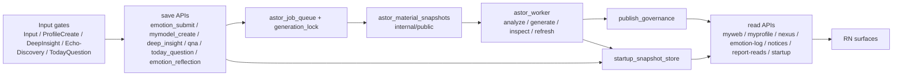

# 1. 1行定義

ここでいう国家システムは、**入力保存 API 群 + material snapshot + job queue + worker + publish governance + startup snapshot + read-side API** をまとめた運用全体です。  
backend だけでは終わらず、**RN surface まで含めて state の流れを固定する**ための資料です。

# 2. 実行パイプライン



# 3. 入力窓口（current code fact）

| 入力窓口 | frontend | save API | 備考 |
|---|---|---|---|
| 感情入力 | `screens/InputScreen.js` | `api_emotion_submit.py` | Input の最上流。ranking / account status / global summary / snapshot に波及 |
| secret 切替 | `MyWebHistory` 系 / Input 周辺 | `api_emotion_secret.py` | public snapshot に直結 |
| ProfileCreate | `screens/MyModelCreateScreen.js` | `api_mymodel_create.py` | 固定プロフィール資産 |
| DeepInsight 入力 | `screens/DeepInsightScreen.js` | `api_deep_insight.py` | global 材料側へ入る |
| Piece 反応 | `screens/MyModelReflectionsScreen.js`, `screens/NexusScreen.js` | `api_mymodel_qna.py` | echoes / discoveries / view |
| Today Question | `components/TodayQuestionCard.js` | `api_today_question.py` | startup current でも使う |
| EmotionGeneratedPiece | `screens/InputScreen.js` | `api_emotion_reflection.py` | current emotion から preview/publish |

# 4. 中央中枢ファイル

| ファイル | 現在の役割 |
|---|---|
| `ai/services/ai_inference/astor_job_queue.py` | DB job queue |
| `ai/services/ai_inference/generation_lock.py` | 同一 user / 対象の重複実行抑止 |
| `ai/services/ai_inference/astor_material_snapshots.py` | global / emotion_period internal/public snapshot |
| `ai/services/ai_inference/astor_worker.py` | snapshot / analyze / generate / inspect / refresh dispatch |
| `ai/services/ai_inference/publish_governance.py` | READY / visible content / retention / publish gating |
| `ai/services/ai_inference/startup_snapshot_store.py` | app startup 用軽量断面 |
| `ai/services/ai_inference/response_microcache.py` | short TTL cache |
| `ai/services/ai_inference/api_app_bootstrap.py` | `/app/bootstrap` / `/app/startup` read-side |
| `ai/services/ai_inference/api_contract_registry.py` | public API contract source of truth |

# 5. 現在の重要コード断面

## 5-1. emotion submit は入力保存後に downstream を起動する
```python
    *,
    user_id: str,
    emotion_details: List[Dict[str, Any]],
    created_at: str,
    avg_strength: Optional[float],
    memo: Optional[str],
    is_secret: bool,
    notify_friends: bool,
) -> None:
    # 1) 感情通知（EmotionLog 用タイムライン + Push）
    if notify_friends:
        try:
            await _notify_follow_viewers_about_emotion(
                owner_user_id=user_id,
                emotion_details=emotion_details,
                created_at=created_at,
            )
        except Exception as exc:
            logger.error("Failed to notify follow viewers about emotion (bg): %s", exc)

    # 2) ASTOR への感情インジェスト（失敗しても致命的ではない）
    try:
        astor_payload = AstorEmotionPayload(
            user_id=user_id,
            created_at=created_at,
            emotions=emotion_details,
            emotion_strength_avg=avg_strength if avg_strength is not None else 0.0,
            memo=memo,
            is_secret=bool(is_secret),
        )
        astor_req = AstorRequest(
            mode=AstorMode.EMOTION_INGEST,
            emotion=astor_payload,
        )
        try:
            astor_engine.handle(astor_req)
        except Exception as exc:
            logger.error("ASTOR EmotionIngest failed (bg): %s", exc)

        # 3) MyProfile 最新レポート（プレビュー）は重いので「別ワーカー」に委譲（Phase 6）
        #    - Supabase のジョブキュー( astor_jobs )へ enqueue
        #    - Worker 側が myprofile_reports(latest) を生成/更新する
        try:
            if ASTOR_WORKER_QUEUE_ENABLED:
                from astor_job_queue import enqueue_job as _enqueue_job

                await _enqueue_job(
                    job_key=f"myprofile_latest_refresh:{user_id}",
                    job_type="myprofile_latest_refresh_v1",
                    user_id=user_id,
                    payload={
                        "trigger": "emotion_submit",
                        "requested_at": created_at,
                    },
                    priority=50,
                )
                # 4) Central material snapshots (internal/public) are generated in worker (debounced)
                try:
                    if ASTOR_SNAPSHOT_ENQUEUE_ENABLED:
                        now_dt = datetime.now(timezone.utc).replace(microsecond=0)
                        delay = ASTOR_SELF_STRUCTURE_DEBOUNCE_SECONDS
                        run_after_iso = (now_dt + timedelta(seconds=delay)).isoformat().replace("+00:00", "Z")
                        await _enqueue_job(
                            job_key=f"snapshot:{user_id}:global:internal",
                            job_type="snapshot_generate_v1",
                            user_id=user_id,
                            payload={
                                "trigger": "emotion_submit",
                                "requested_at": created_at,
                                "scope": "global",
                                "debounce_seconds": delay,
                            },
                            priority=20,
                            run_after_iso=run_after_iso,
                        )
                except Exception as exc:
                    logger.error("Snapshot enqueue failed (bg): %s", exc)

                try:
                    await enqueue_ranking_board_refresh_many(
                        metric_keys=("emotions", "input_count", "input_length"),
                        user_id=user_id,
                        trigger="emotion_submit",
                        requested_at=created_at,
                        debounce=True,
                    )
                except Exception as exc:
                    logger.error("Ranking board enqueue failed (bg): %s", exc)

                try:
                    await enqueue_account_status_refresh(
                        target_user_id=user_id,
                        trigger="emotion_submit",
                        requested_at=created_at,
                        debounce=True,
```

要点:
- `notify_friends` が true なら social side も作る
- `myprofile_latest_refresh_v1` を enqueue
- `snapshot_generate_v1` を enqueue
- ranking / account status / global summary refresh も enqueue

## 5-2. secret toggle でも snapshot を即時更新する
```python
        # 3) ASTOR patterns の trigger 側も整合（ts で突合）
        # - created_at が指定されていればそれを優先
        # - なければ Supabase の返却行から拾う
        ts = (payload.created_at or updated_row.get("created_at") or "").strip()
        updated_triggers = 0
        if ts:
            try:
                # NOTE: /emotion/submit が使っている astor_engine インスタンスの
                # in-memory state を更新することで、次回の ingest/save で上書きされる事故を避ける。
                updated_triggers = astor_engine._patterns.update_triggers_secret_by_ts(  # type: ignore[attr-defined]
                    user_id=user_id,
                    ts=ts,
                    is_secret=bool(payload.is_secret),
                )
            except Exception as exc:
                logger.error("Failed to update ASTOR triggers secret flag: %s", exc)

        # 4) 0件更新（= 対象が無い or 所有者でない）を 404 扱いにする
        if not updated_row:
            raise HTTPException(status_code=404, detail="Emotion record not found")


        # 5) secret 切替は public_snapshot に直結するため、中央材料庁（snapshot）を即時更新する
        #    - privacy/safety の観点で「待たない」方針（emotion/submit のような長いデバウンスは不要）
        #    - job_key により自然に coalesce される（同一userの snapshot は1行に集約）
        if ASTOR_WORKER_QUEUE_ENABLED and ASTOR_SNAPSHOT_ENQUEUE_ENABLED:
            try:
                from astor_job_queue import enqueue_job as _enqueue_job

                now_iso = (
                    datetime.now(timezone.utc)
                    .replace(microsecond=0)
                    .isoformat()
                    .replace("+00:00", "Z")
                )
                await _enqueue_job(
                    job_key=f"snapshot:{user_id}:global:internal",
                    job_type="snapshot_generate_v1",
                    user_id=user_id,
                    payload={
                        "trigger": "emotion_secret",
                        "requested_at": now_iso,
                        "scope": "global",
                        "emotion_id": payload.emotion_id,
                        "emotion_created_at": ts or None,
                        "is_secret": bool(payload.is_secret),
                    },
                    priority=40,
                )
            except Exception as exc:
                # enqueue 失敗は API の成功/失敗を左右しない（best-effort）
                logger.error("Snapshot enqueue failed (emotion_secret): %s", exc)
        return EmotionSecretUpdateResponse(
            status="ok",
            id=updated_row.get("id", payload.emotion_id),
            is_secret=bool(payload.is_secret),
            updated_triggers=int(updated_triggers or 0),
        )
```

要点:
- `is_secret` 切替は public snapshot に直結
- そのため `snapshot_generate_v1` を即時 enqueue する

## 5-3. current emotion だけで動く別 Piece flow がある
```python
# -*- coding: utf-8 -*-
"""api_emotion_reflection.py

New Reflection flow driven by the current emotion input only.

Endpoints
---------
- POST /emotion/reflection/preview
- POST /emotion/reflection/publish
- POST /emotion/reflection/cancel
- GET  /emotion/reflection/quota
"""

from __future__ import annotations

```

store 側はこう保持する。
```python
# -*- coding: utf-8 -*-
"""emotion_reflection_store.py

Store helpers for the new emotion-generated Reflection flow.

Design
------
- Uses the same `mymodel_reflections` table family to keep read-side reuse viable.
- Draft preview rows are stored with:
    source_type = emotion_generated
    status      = draft
    is_active   = false
- Publish promotes the same row to ready + active WITHOUT archiving sibling rows.
"""

from __future__ import annotations

from datetime import datetime, timezone
from typing import Any, Dict, Optional, Sequence

from astor_reflection_store import (
    REFLECTIONS_TABLE,
    _sb_count,
    _sb_get_json,
    _sb_patch_json,
    _sb_post_json,
)
from generated_reflection_display import apply_generated_display_to_content_json
from reflection_publish_entitlements import get_current_month_window_jst

EMOTION_REFLECTION_SOURCE_TYPE = "emotion_generated"
EMOTION_REFLECTION_VERSION = "emotion_reflection.v1"


def _now_iso_z() -> str:
```

要点:
- これは **official repo 名ではないが、華恋用の補助用語では EmotionGeneratedPiece** と呼ぶ
- `source_type = emotion_generated`
- `status = draft -> ready`
- `mymodel_reflections` family を reuse している

## 5-4. startup snapshot は複数 section を束ねる
```python
from __future__ import annotations

import asyncio
import logging
import os
from datetime import datetime, timedelta, timezone
from typing import Any, Dict, Mapping, Optional

from response_microcache import build_cache_key, get_or_compute, invalidate_exact, invalidate_prefix

logger = logging.getLogger("startup_snapshot_store")


STARTUP_SNAPSHOT_ENABLED = (os.getenv("STARTUP_SNAPSHOT_ENABLED") or "true").strip().lower() in {"1", "true", "yes", "on"}
try:
    STARTUP_SNAPSHOT_CACHE_TTL_SECONDS = float(os.getenv("STARTUP_SNAPSHOT_CACHE_TTL_SECONDS", "25") or "25")
except Exception:
    STARTUP_SNAPSHOT_CACHE_TTL_SECONDS = 25.0
try:
    STARTUP_SNAPSHOT_REFRESH_THROTTLE_SECONDS = float(os.getenv("STARTUP_SNAPSHOT_REFRESH_THROTTLE_SECONDS", "20") or "20")
except Exception:
    STARTUP_SNAPSHOT_REFRESH_THROTTLE_SECONDS = 20.0
try:
    STARTUP_SNAPSHOT_SECTION_TIMEOUT_SECONDS = float(os.getenv("STARTUP_SNAPSHOT_SECTION_TIMEOUT_SECONDS", "12") or "12")
except Exception:
    STARTUP_SNAPSHOT_SECTION_TIMEOUT_SECONDS = 12.0

JST = timezone(timedelta(hours=9))
STARTUP_SNAPSHOT_SCHEMA_VERSION = "startup_snapshot.v1"
STARTUP_SNAPSHOT_SOURCE_VERSIONS: Dict[str, str] = {
    "schema": STARTUP_SNAPSHOT_SCHEMA_VERSION,
    "emotion_log_unread": "emotion_log.unread.v1",
    # Backward-compatible legacy alias for older clients.
    "friends_unread": "friends.unread.v1",
    "myweb_unread": "report_reads.myweb_unread.v1",
    "notices_current": "notices.current.v1",
    "today_question_light": "today_question.current.light.v1",
    "input_summary": "input.summary.v1",
    "global_summary": "global_summary.ready_first.v1",
```

現在の canonical section:
- `emotion_log_unread`
- `friends_unread`（legacy alias）
- `myweb_unread`
- `notices_current`
- `today_question_light`
- `input_summary`
- `global_summary`

# 6. worker job family

主要 job 一覧は `inventory/worker_job_map.csv` を見る。  
ここでは読みに必要な核だけ固定する。

| family | 起点 | 代表 job |
|---|---|---|
| snapshot | input / secret / myweb ensure | `snapshot_generate_v1` |
| emotion analysis | emotion_period snapshot | `analyze_emotion_structure_standard_v1`, `analyze_emotion_structure_deep_v1` |
| myweb report | emotion analysis / ensure | `generate_emotion_report_v2`, `inspect_emotion_report_v1` |
| self structure | global snapshot | `analyze_self_structure_standard_v1`, `analyze_self_structure_deep_v1`, `myprofile_latest_refresh_v1` |
| generated reflection | global public snapshot | `generate_premium_reflections_v1`, `inspect_reflection_v1` |
| refresh families | input / enqueue helpers | `refresh_ranking_board_v1`, `refresh_account_status_v1`, `refresh_friend_feed_v1`, `refresh_global_summary_v1` と各 inspect |

# 7. public API contract は国家システムの外壁

## 7-1. policy の核
```md
# Cocolon Public API Contract Policy

Policy version: `2026-03-20.mymodel-qna-unread-status.v1`

## Core rules

1. RN is display-only.
2. Existing requests are additive-only.
3. Existing responses are additive-only.
4. Breaking changes require a new endpoint or version.
5. The server absorbs compatibility for older builds.
6. Every public API response carries policy metadata headers.
7. Compatibility must be guarded by automated tests.
8. Deprecated public routes must declare their replacement route/version when one exists.

## Why this policy exists

This policy revision adds `/mymodel/qna/unread-status` so MyModel Home unread
aggregation stays server-owned across the viewer's accessible reflections, while existing
v1 routes remain additive-only and backward compatible.
```

要点:
- RN is display-only
- existing request/response are additive-only
- breaking change は新 endpoint/version
- compatibility は server 側で吸収
- response headers と tests で enforce する

## 7-2. だから route 変更は設計フェーズが必要
`/myweb/*`, `/mymodel/*`, `/friends/*`, `/emotion-log/*` などは  
**見た目の名称変更だけで勝手に変えない**。  
変えるなら contract policy と public registry と tests まで同時に触る。

# 8. RN 側の境界ルール

```python
#!/usr/bin/env python3
from __future__ import annotations

import os
import re
import sys
from pathlib import Path
from typing import Iterable, List, Sequence, Tuple

ROOT = Path(__file__).resolve().parents[1]
FORBIDDEN_PATTERNS: Sequence[Tuple[str, re.Pattern[str]]] = (
    ("supabase.from(", re.compile(r"\bsupabase\.from\s*\(")),
    ("supabase.rpc(", re.compile(r"\bsupabase\.rpc\s*\(")),
    ("supabase.channel(", re.compile(r"\bsupabase\.channel\s*\(")),
    ("raw fetch(", re.compile(r"(?<![\w$.])fetch\s*\(")),
)
SOURCE_SUFFIXES = {".js", ".jsx", ".ts", ".tsx"}
RN_ROOT_ENV_VARS = ("COCOLON_RN_ROOT", "RN_ROOT")


def _looks_like_rn_root(path: Path) -> bool:
    return (
        path.is_dir()
        and (path / "App.js").is_file()
        and (path / "lib").is_dir()
        and (path / "screens").is_dir()
    )


def _iter_candidate_rn_roots() -> Iterable[Path]:
    seen: set[str] = set()

    def _yield(path: Path) -> Iterable[Path]:
        try:
            resolved = path.resolve()
        except FileNotFoundError:
            resolved = path.absolute()
        key = str(resolved)
        if key in seen:
            return
        seen.add(key)
        yield path

    for env_name in RN_ROOT_ENV_VARS:
        value = os.environ.get(env_name)
        if value:
            yield from _yield(Path(value).expanduser())

    anchors = [ROOT, ROOT.parent, *ROOT.parents[:2]]
    candidate_names = ("cocolon-mvp", "RN(アプリ側)")
    for anchor in anchors:
        yield from _yield(anchor)
        for name in candidate_names:
            yield from _yield(anchor / name)
```

要点:
- RN surface では `supabase.from`, `supabase.rpc`, `supabase.channel`, raw `fetch()` を禁止
- 例外は `lib/apiClient.js`
- つまり frontend 改修でも data access 境界がある

# 9. Tutorial stability も rule file で持つ

```md
# Tutorial Stability Redesign

## 目的
実機ごとの画面サイズ差・Safe Area 差・スクロール途中の測定ズレ・透過穴タップの不安定さをまとめて解消し、チュートリアルのスポットライト位置と押下動作を安定させる。

## 根本原因
従来実装では、各画面ごとに以下が分散していた。

- `setTimeout(80)` 後に measure
- 必要なら `scrollTo({ animated: true })`
- `setTimeout(260)` 後に再 measure
- スポットライトの穴を通して下層 UI を直接押させる
- `windowHeight` や固定マージンで可視領域を推定する

この方式では、以下の差異でズレが発生しやすい。

- 実機性能差によるアニメーション完了タイミングの差
- Safe Area / 画面高さ / フォントスケール差
- ScrollView の慣性や途中フレームでの測定
- オーバーレイと下層 UI の z-order / hit area の差
- composite component と native view の測定差

## 新アーキテクチャ

### 1. 共通測定レイヤーへ統一
`components/TutorialOverlay.js` に、以下の共通機能を集約した。

- `waitForTutorialFrames(frameCount)`
- `measureTutorialTarget(targetRef, rootRef, options)`
- `buildTutorialViewport(...)`
- `syncTutorialSpotlightTarget(...)`

```

要点:
- `TutorialOverlay` に共通測定 / 再測定 / proxy press を集約
- screen 個別の `setTimeout` 調整で直さない
- tutorial step 変更時はこの rule を先に見る

# 10. いま国家システム改修で特に見落としやすい点

1. **API ensure / cron / worker が混在**  
   とくに MyWeb は API ensure と worker が同時にいる。片側だけ見ない。

2. **publish_governance を通って初めて visible**  
   生成されたから見えるわけではない。

3. **startup snapshot が独立した read-side**  
   badge / popup / light summary を変える時は startup 経路も見る。

4. **EmotionGeneratedPiece は Input と Piece storage を跨ぐ**  
   Input 側だけでも、Piece 側だけでも完結しない。

# 11. 修正時の最短判断

- public route / response を触る  
  → contract policy / public registry / tests を確認
- derived / generated / published content を触る  
  → `astor_material_snapshots.py`, `astor_worker.py`, `publish_governance.py` を確認
- unread / startup / popup を触る  
  → `api_app_bootstrap.py`, `startup_snapshot_store.py`, `App.js` を確認
- Input から Piece を作る導線を触る  
  → `api_emotion_reflection.py` と `emotion_reflection_store.py` を確認
