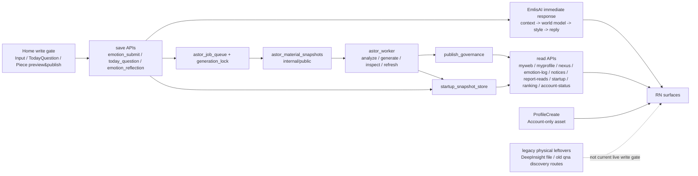

# 1. 1行定義

ここでいう国家システムは、**Home 起点の保存 API 群 + immediate response（EmlisAI） + material snapshot + job queue + worker + publish governance + startup snapshot + read-side API** をまとめた運用全体です。  
current snapshot では、**ProfileCreate と DeepInsight を live write gate から外し、Home を唯一の primary write gate として扱う**ことが重要です。

# 2. 実行パイプライン

# 3. 入力窓口（current operational reading）

| 入力窓口 | frontend | save API | 国家システム上の位置づけ |
|---|---|---|---|
| 感情入力 | `screens/InputScreen.js` | `api_emotion_submit.py` | Home write gate の最上流。保存直後に EmlisAI immediate reply を返す |
| Today Question | `components/TodayQuestionCard.js` | `api_today_question.py` | Home write gate に含める |
| Piece preview / publish | `screens/InputScreen.js`, `components/EmotionReflectionPreviewModal.js` | `api_emotion_reflection.py` | current input だけから作る Piece。publish 時も shared save service 経由 |
| ProfileCreate | `screens/MyModelCreateScreen.js` | `api_mymodel_create.py` | Account-only asset。国家システムの primary write gate には入れない |
| DeepInsight | current visible flow なし | `api_deep_insight.py` legacy file may remain | current live route registration / visible flow から外した |

# 4. current snapshot での国家システムの読み方

## 4-1. `emotion_submit_service.py` が immediate reply の source of truth

current snapshot の入力後コメントは route ごとに別実装されず、  
**`persist_emotion_submission()` で `render_emlis_ai_reply(...)` を呼ぶ**構造です。

## 4-2. Piece は Home / current input からしか作らない

`api_emotion_reflection.py` は current input ベースで preview / publish を行います。  
publish 後の input_feedback も shared save service へ寄せて読むこと。

## 4-3. ProfileCreate は国家システム材料として再接続しない

この session の設計では、ProfileCreate は **固定プロフィール資産** です。  
self structure / premium reflection / ranking / question discovery の材料として戻さないこと。

注意:
- internal canonical には `MyModelCreate` が残る
- response key / route canonical / storage canonical が旧名のままでも、意味を Piece や国家システム材料へ戻さない

## 4-4. DeepInsight は current live flow から外したが、repo residue は残りうる

DeepInsight については次を分けて読むこと。

- live route registration / public registry / current visible flow: 外した
- physical file / helper / data / table cleanup: 後続 cleanup の対象として残りうる

**「file がある」ことと「current live system で使っている」ことを同一視しない**こと。

## 4-5. legacy qna discovery route は visible flow と切り分ける

`/mymodel/qna/trending` と `/mymodel/qna/holders` は legacy public route として残る場合があります。  
ただし current frontend visible flow ではこれを使わず、  
**generated Piece の read path は Nexus / qna_list 側へ寄せて読む**こと。

## 4-6. Piece count / ranking は key と意味を分ける

Account / Ranking の current visible meaning は Piece count ですが、  
public shape / board payload / legacy kernel には `mymodel_questions_total` / `questions_total` が残ります。  
したがって、

- key 名
- visible meaning
- DB / RPC / projection の計算根拠

を分けて確認します。

# 5. EmlisAI と国家システムの関係

EmlisAI は current snapshot でも以下のままです。

- route ではなく `emotion_submit_service.py` を source of truth にして読む
- worker family ではなく immediate/synchronous path として扱う
- tier 差分は capability と subscription copy をセットで見る
- `comment_text` public contract を壊さない

# 6. current code で特に誤読しやすい点

1. **ProfileCreate file / route canonical が残っていても、国家システム材料へ戻したわけではない**
2. **DeepInsight file / helper / table token が残っていても、current live route とは限らない**
3. **`mymodel_questions_total` は key 名として残っていても、visible semantics は Piece count**
4. **`/mymodel/qna/trending` と `/holders` は public route が残っていても current visible flow では使っていない**
5. **EmlisAI は worker job ではなく immediate response**

# 7. 修正時の最短判断

- Home write gate を変える  
  → `InputScreen.js`, `api_emotion_submit.py`, `api_today_question.py`, `api_emotion_reflection.py`, `emotion_submit_service.py`

- Piece を変える  
  → `InputScreen.js`, `EmotionReflectionPreviewModal.js`, `api_emotion_reflection.py`, `reflection_publish_entitlements.py`, `api_nexus.py`, `api_mymodel_qna.py`

- ProfileCreate を変える  
  → `AccountScreen.js`, `MyModelCreateScreen.js`, `api_mymodel_create.py`, `mymodel_entitlements.py`

- DeepInsight residue を cleanup する  
  → `MyWebScreen.js`, `App.js`, `api_contract_registry.py`, `PUBLIC_API_REGISTRY.md`, `screens/DeepInsightScreen.js`, `api_deep_insight.py`

- Piece count / ranking を変える  
  → `AccountScreen.js`, `RankingTopScreen.js`, `MyModelQuestionsRankingScreen.js`, `api_account_status.py`, `api_ranking.py`, `astor_account_status_store.py`, `astor_ranking_kernel.py`
