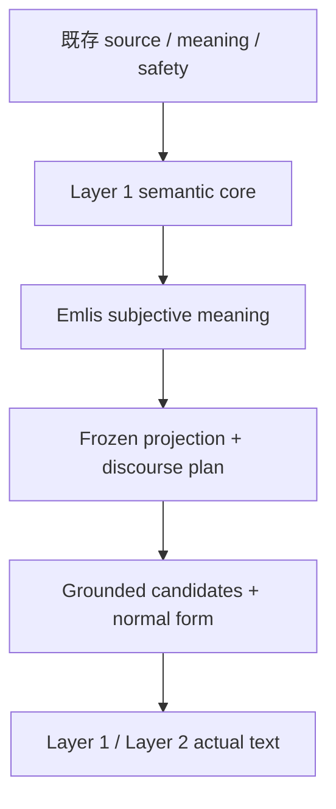

# Cocolon CMEE Stage 1 追加修正
# Ultra華恋 Final Technical Body and Pro/Ultra Joint Recommendation

## 0. Ultra技術結論

現行Stage 1の意味・根拠・安全境界は捨てない。文章品質不足の主因は、その後段にある次の結合である。

```text
Reception actから固定claim列を作る
  -> contribution / claim exact1をsentence exact1へ変える
  -> Layer 2先頭へEmlisを固定する
  -> response objectを抽象anaphoraへ縮める
  -> operatorからpredicate / connectiveを一意に引く
  -> 同一骨格の語彙差max2を作る
  -> S9はprimaryを優先して選ぶだけ
```

したがって、Proレビューの全6指摘を反映した上で採用を推奨する技術routeは次である。

> **既存のsource-bound semantic substrateとprojection sole-owner境界を保持し、projection v2をfreezeする前に、Emlisがこの入力の何をどう感じ、どう考え、何を大切にし、どの関係姿勢を取るかをnested内容命題として形成する。その後段のsole final surface ownerを、入力ごとのmeaning arc、談話進行、複数対象の具体表現、統合・分割・順序・終点を扱うproviderlessな`Grounded Discourse Composer`へ置換し、同じproduction-candidate codeによる早期actual Japanese viabilityをfull state / trace完成前に確認する。**

これはmicrogrammarの語彙追加ではない。現在の`contribution / claim = sentence`という所有関係を外し、同じfrozen semantic projectionから、Emlisの入力固有の主観命題、全文の焦点、既知から新情報への進行、始点、文負荷、指示対象の継続、文数、Emlis明示位置、終点を決め直す。

今回providerless routeを第一選択にする理由は、actualで確認できた直接原因がCMEE private Stage 1内の談話計画・表層構成contractにあり、現在のsource / meaning資産だけでその原因を除去できるためである。provider、network、privacy、継続費用を先に増やす必要はない。

providerless Route Aは唯一の許可routeである。実装の早期に、tension、temporal change、help-seeking、unfinishedの既知exact4とprivate withheld exact4を、最終実装に残る同一planner / composer / normalizer / rankerで実文まで通す。そこでidiomatic Japaneseのceiling、入力固有lexicalizationの不成立、typed軸で説明できないrule増殖、same-family集中などを観測した時は§7.5で分類する。`ROUTE_LEVEL_CEILING`ならfull schema / trace / regressionの残りへ進まず停止し、`COMMON_DEFECT`なら§13の共通counter内だけ一般修正する。ceilingまたはreturn上限到達後も外部AI、外部composer、provider routeへは移らない。

```text
PRO_REVIEW = CONSUMED_EXACTLY_ONCE
PRO_REVIEW_VERDICT = CHANGES_REQUIRED
ULTRA_FINAL_VERDICT = CANDIDATE_CORRECTED
ULTRA_FINAL_TECHNICAL_BODY = COMPLETE
PRIMARY_OUTCOME = METHOD_OR_PRODUCT_DECISION_CANDIDATE
JOINT_RECOMMENDATION = PROVIDERLESS_GROUNDED_DISCOURSE_COMPOSER_ROUTE_A_ONLY
IMMEDIATE_MASH_QUESTION = NONE
IMPLEMENTATION_AUTHORITY = NOT_GRANTED
CURRENT_CANONICAL_CONTRACT_EFFECT = 0
```

### 0.1 Proレビュー disposition

review対象は、初版`COCOLON_CMEE_STAGE1_ADDITIONAL_CORRECTION_ULTRA_INITIAL_TECHNICAL_DESIGN_20260824`、SHA-256 `4002bf04f182f64f4a389aa98abae3b4aebd2fe59305f1f0fb1b2b4c68154167`、94,109 bytes / 1,635 linesである。reviewは`COCOLON_CMEE_STAGE1_ADDITIONAL_CORRECTION_PRO_REVIEW_20260824`、添付SHA-256 `55330e24c991d9b9109a74bc59c1a928fce51ce4e6efa01271a06c298fdefa3c`であり、`CHANGES_REQUIRED / BLOCKER 0 / MAJOR 4 / MINOR 2 / ADOPT_AFTER_CORRECTION=true`だった。

| Review ID | Disposition | 本final bodyでの修正 | Boundary |
|---|---|---|---|
| `PRO-MAJOR-01` | `ACCEPT` | request-local `EmlisSubjectiveMeaningPlan`と内容を持つ`SubjectivePropositionV2`を追加し、target / relation / appraisal / value / stanceをsurface前に形成する。job、affect label、genericな「気にかかる」だけはinvalid | current source / meaning owner KEEP、new semantic authority 0 |
| `PRO-MAJOR-02` | `ACCEPT` | final language coreを先に完成させたproduction verticalで、既知exact4 + withheld exact4のactual Japaneseをfull state / trace完成前に読む | 別prototype / Gate / credit / Mash中間確認 0 |
| `PRO-MAJOR-03` | `ACCEPT` | stable signatureより前にtyped談話選好を置き、局所修正max1を廃止する。代わりにexact6 phaseの`normalize_to_normal_form()` exact1 callとidempotence / defect exact0を要求する | S8-private、shared S9 effect 0、numeric quality score 0 |
| `PRO-MAJOR-04` | `ACCEPT` | construction keyを文法・意味構造だけに限定し、raw text / case family / regex result / fixture similarityを禁止する。public-safe nonbinding walkthrough exact4とprivate withheld pre-screenを追加する | finished sentence bank 0、runtime case-ID effect 0 |
| `PRO-MINOR-01` | `ACCEPT` | rule proliferation、lexicalization failure、idiomatic ceiling、same-family concentrationを観測対象に追加し、§7.5で`COMMON_DEFECT | ROUTE_LEVEL_CEILING`に原因分類する | ceilingまたはreturn上限時はRoute A terminal STOP。外部route authority 0 |
| `PRO-MINOR-02` | `ACCEPT` | `COMMON_DEFECT_RETURN_MAX=2`をcost / decision boundaryとして固定する。上限到達時は低品質candidateを受け入れずMashへfresh判断を戻す | quality ceiling 0、automatic progression 0 |

このreviewは同じstable initial identityへの原則一回reviewとしてconsumeする。本final bodyはreviewの要求を狭めず実装可能なcontractへしたもので、新しいproduct scope、provider、public boundaryを追加していない。したがって、fresh material changeがない限り二回目のPro design reviewは要求しない。

### 0.2 Ultra華恋の追加意見

Ultraとして、Pro修正に加えて次を推奨する。

1. **sourceがmaterial thoughtを支える時だけ、content-bearing thoughtを最低exact1要求する。** projectionが`APPRAISAL | MATERIAL_VALUE | RELATIONAL_POSITION`を具体target / admitted relationへbindできる時は、そのいずれかexact1以上を要求する。一方、source-supported thoughtがなく、具体elicitorを持つaffect-onlyがminimum honest setなら正常に許可する。generic thoughtを数合わせで作ることは許可しない。
2. **早期actualは最初の不可逆な技術判断点に置く。** current upstreamには一般的な日本語lemma / POS / case-frameがなく、現v2はsource-shape regexと個別語彙に強く依存する。anti-template境界を守ったまま自然なlexicalizationが成立するかは、型とtraceを完成させる前に実文で確かめる方が、工数と商品リスクの両方に対して合理的である。
3. **recompositionをretry loopにしない。** 本案は全文をexact6 phaseで一度normal formへ写すpure functionとし、同じ関数の二度目でtyped planだけでなくsurface / derivation / duty / suppression / seedを含むcanonical normalized bytesが変わらないことを必須にする。これで「一回」を品質上限ではなくnormalization identityに変える。
4. **Route Aのlanguage ceilingをfailureとして正直に扱う。** typed profileまで同値なのに、どちらが自然な日本語かをstable IDでしか選べない場合、語彙assetを増やして隠さずRoute A terminal STOPとする。低品質を受け入れず、外部AIまたは外部composerへ切り替えない。
5. **withheldを小さなhuman pre-screenに留める。** exact4はformal exact8の分母、numeric score、Product evidenceではない。隠しfixture bankを育てると新しいoverfit ownerになるため、body、expected text、case patchをGitHubへ保存しない。

---

## 1. Fresh baselineと資料identity

### 1.1 GitHub current working refs

2026-08-24 JSTにread-onlyで確認したcurrent refsは次である。

| Repository / context | Current ref | State |
|---|---|---|
| `MassyuRed/Cocolon` Draft PR #30 | `c0fb407e88aea5b8ba52aa25c9532adc0ff3a539` | Draft / open / unmerged |
| `MassyuRed/mashos-api` Draft PR #3 | `b7865574ebe08c801f6a2c779daf9148159cf8b0` | Draft / open / unmerged |
| Cocolon System Context Draft PR #37 | `d5de2bd8945544a44b4ef3d10136010f88ce23ad` | Draft / open / unmerged |

System Contextは`Cocolon_前提資料/system_context/00_read_first.md`を探索・影響把握の入口として使用した。原本、current source、product canonical、Mash判断の代替にはしていない。今回System Contextを生成・更新する必要はない。

### 1.2 主な設計入力

- 添付`Cocolon_CMEE_Stage1_AdditionalCorrection_ProDesignPolicy_MashPro_20260824(1).md`
- 添付Proレビュー`テキスト(9).txt`
- review対象`Cocolon_CMEE_Stage1_AdditionalCorrection_UltraInitialTechnicalDesign_20260824.md`
- `Cocolon_前提資料/work_attitude_rules_for_karen/00_read_first.txt`
- `Cocolon_前提資料/work_attitude_rules_for_karen/CURRENT_RULES.md`
- `09_work_start_checklist.txt`
- `99_integrated_paste_each_time.txt`
- `18_chat_work_environment_selection_rule_2026_08_06.txt`
- `13_forbidden_reasking_existing_design_and_design_term_escape.txt`
- `17_continuous_durable_work_recording_and_emergency_handoff.txt`
- `14_cocolon_continuous_work_recording_and_emergency_handoff.md`
- `11_cocolon_area_specific_do_not_break.txt`
- 恒久incident資料
- `current_structure/00_three_core_and_cmee_read_first.md`
- `current_structure/01_emlis_ai_current_structure.md`
- `current_structure/04_cmee_current_structure.md`
- `designs/cmee/v1/00_read_first.md`
- `designs/cmee/v1/01_shared_kernel_and_runtime_contracts.md`
- `designs/cmee/v1/02_emlis_v1a_detailed_design.md`
- `designs/cmee/v1/05_json_schema_and_versioning.md`
- `designs/cmee/v1/06_implementation_order_migration_and_verification.md`
- `designs/cmee/v1/karen_derived/00_read_first.md`
- `designs/cmee/v1/karen_derived/01_emlis_observation_and_reception.md`
- `Cocolon_CMEE_Stage1_ProUltra_KarenDerivedFunctional_FinalTechnicalDesign_20260822.md`
- PR #3 actual runtime / tests / runner

### 1.3 Current statusの扱い

現行v2のmachine結果や過去の華恋pre-screenを改ざんしない。これらは当時のhistorical factとして残す。一方、Mashによる新しいactual本文判断「なお文章品質が不足する」は、v2を商品品質上十分とする以前の見立てを上書きする。

```text
CURRENT_MICROGRAMMAR = cocolon.emlis.stage1.microgrammar.v2
CURRENT_MACHINE_GREEN = HISTORICAL_TRUE
CURRENT_PRODUCT_ACCEPTANCE = FALSE
CURRENT_CANDIDATE_READY = FALSE
CURRENT_PRODUCT_CREDIT = 0
CURRENT_AUTOMATIC_PROGRESSION = FALSE
```

### 1.4 Canonical owner precedence

| Concern | Current owner / routing reference | Authority class |
|---|---|---|
| P1–P8、M1–M7、Layer 1 / 2、V1–V9、最低商品品質 | `karen_derived/01_emlis_observation_and_reception.md` | `CANONICAL_OWNER` |
| shared S0–S10、S8 candidate protocol、S9 hard validity / selection | `01_shared_kernel_and_runtime_contracts.md` | `CANONICAL_OWNER` |
| Emlis Stage 1 technical detail | `02_emlis_v1a_detailed_design.md` | `CANONICAL_OWNER` |
| private schema、identity、version | `05_json_schema_and_versioning.md` | `CANONICAL_OWNER` |
| implementation order、migration、verification | `06_implementation_order_migration_and_verification.md` | `CANONICAL_OWNER` |
| current route / owner map | `current_structure/01`、`04` | `ROUTING_MAP_NONAUTHORITY` |
| search / working-lineage navigation | System Context PR #37 entry only | `NAVIGATION_ONLY__PR37_WORKING_LINEAGE` |

PR #37はPR #37 working lineage上のactive / frozen navigation entryであり、operator actual proof、Product credit、Technical creditを作らない。

添付Pro方針はMashのcurrent意見を含む新しいproduct / functional change inputである。ただし本書作成時点ではPR #30 canonical bytesを変更していない。したがって本書の各変更は次の状態である。

```text
CURRENT_CANONICAL = PR30 HEAD AS READ
PROPOSED_SUPERSESSION = LEVEL3_FINAL_CANDIDATE_INPUT
CANONICAL_ACTIVATION = 0
RUNTIME_ACTIVATION = 0
```

---

## 2. Authority、scope、非目的

### 2.1 今回この設計が所有するもの

- current failureのtechnical root cause。
- KEEP / SUBORDINATE / REPLACE判断。
- Stage 1 private final composition ownerの置換方式。
- private schema / state / traceの必要delta。
- final proposed exact changed paths。
- verificationとactual proofまでの順序。
- fresh工数、費用、technical STOP。
- 現時点の質問有無と、条件付きLEVEL_3質問。

### 2.2 今回変更しないもの

- public callable `MeaningExperienceEngine.generate(GenerationRequest) -> EngineOutcome` exact1。
- `EngineOutcome`の公開結果family。
- production owner、production route、public serializer。
- API、DB、RN、persistence、subscription。
- Stage 2 question、Layer 3、Piece、Analysis、Premium runtime。
- source admission、history admission、separate safety。
- Mash Product Readの最終authority。

### 2.3 Authority boundary

本書はProレビューを反映したfinal technical candidateである。実装開始、PR変更、commit、push、merge、Product PASS、次Stageへの進行を許可しない。

Pro華恋の原則一回reviewは完了し、本書で全指摘をexact dispositionした。`ADOPT_AFTER_CORRECTION=true`のPro推奨と、Ultraが修正版を技術的に採用する判断が同じrouteへ収束するため、`PRO/ULTRA_JOINT_RECOMMENDATION`を形成する。ただしこれはMash approval、implementation authority、GitHub write authorityではない。

実装は、そのfinal bodyに対するMashの明示的なLEVEL_3 approvalが成立し、かつGitHub writeのexact identity / path / effectが同じapprovalまたは別の明示authorityへ結び付いた場合だけ、一つのbounded Stage 1 correctionとして行う。

```text
stable initial technical candidate
  -> Pro single product-route review: CHANGES_REQUIRED
  -> Ultra exact disposition + corrected final technical body: COMPLETE
  -> Mash explicit LEVEL_3 approval
  -> implementation Step 0
```

現在は`GITHUB_WRITE_APPROVAL=NOT_GRANTED`、`GITHUB_EFFECT=0`である。

---

## 3. Actual codeから確定したroot cause

### 3.1 因果表

| Actual symptom | Current symbol / contract | Current behavior | User-visible consequence |
|---|---|---|---|
| Layer 2の8/8が`Emlisは、`で開始 | `topic_speaker_policy.layer2_explicit_speaker_placement`、`_subjective_surface_contract()` | Layer 2 index 0を常にexplicit speakerにする | identityが全件共通opening templateになる |
| Layer 2の17/17が`その願い / 負荷 / 変化 / 問い / ためらい`等 | `_reference_mode_for_claim()`、`_anaphoric_surface()` | 既出または一意なら`anaphoric_first`を優先し、semantic categoryを抽象名詞へexact mappingする | 入力固有の対象と複合関係が本文から消える |
| 同じ対象への近い二文 | `_claim_recipe()` | Reception actごとにATTENTION / AFFECT / VALUE / STANCEの固定列を作る | mode名は違っても会話上の仕事が近い文を足す |
| Layer 2 exact1が出ない | `plan_layer2_subjectivity()` | claim数を`2 <= n <= 4`へ固定する | 正直な反応が一つでも偽の二文目を作る |
| 一意味一文の固定 | `_realize_stage1_variant()`、`_accept_sentence()` | ordered refを順番どおり一件ずつ実現し、`basis_anchor_refs` exact1を要求する | merge / split / reorder / multi-object responseが構造的にできない |
| L1も意味labelの整列に見える | `_candidate_rows()`、`_selected_contribution_candidates()`、`plan_layer1_observation()`、operator table | `_candidate_rows()`がrequired / relation-firstでsortし、optionalを狭く選び、contribution exact1をsentence exact1へ変換する | whole-input arcより登録frameが文章順を決める |
| max2でも構成差がない | `_variant_delta()`、variant policy | 最初のpredicateまたはconnective slot exact1だけを変更する | 同じfocus、順序、文数、speaker、objectの語彙差に留まる |
| actual S9が文章を組み直さない | `select_stage1_realization_candidate()` | hard-valid memberを集め、`min(valid, key=_candidate_variant_id)`を返す | primaryがvalidなら常にprimaryで、naturalnessを改善しない |
| actual S8 stateが構成差を作らない | `EmlisUtteranceState` | coverage、exact semantic key、surface digestを管理する | stateは正しさを記録するが、文の仕事や全文構成を変更しない |
| value familyへ集中 | `_claim_recipe(protect_retained_intention)` | direction + burden / tensionでV2 / V8とagency stanceをvisible claimへ昇格する | 「選ぶ余地」「急いで決めない」が固定closing化する |

### 3.2 8/8 openingの直接原因

`_subjective_surface_contract()`は、Layer 2の最初のclaimなら意味内容に関係なく`explicit_speaker = true`とする。その後にobjectを置くため、全件が次の同一順序になる。

```text
[optional connective]
  + Emlis + は + 、
  + abstract / short response object
  + case particle
  + registered predicate
  + 。
```

Emlis speaker identityは正しい。誤っているのは、identityを第一文の第一slotへ固定したことにある。

### 3.3 17/17 abstract anaphoraの直接原因

`_reference_mode_for_claim()`は、同じobjectが既出、またはtyped anaphoraが曖昧でない場合に`anaphoric_first`を選ぶ。`_anaphoric_surface()`は実際の対象句ではなく、operator / modalityから「その願い」「その負荷」等を返す。

さらに`_subjective_object_ref()`はresponse objectを原則node exact1へ縮める。このため、例えば「続けたい方向と限界が近い感覚」のような複数refからなる関係をLayer 2の一つの具体対象として表せない。

### 3.4 operator / predicate / connective / depthの集中

current v2では、semantic operatorからpredicate family、connective family、case particle、nominalizerがほぼ一意に決まる。Reception actからclaim recipeも固定されるため、異なる入力が同じoperator列へ入ると同じ文骨格へ収束する。

depthは本来、distinct material contributionの記述である。しかしcurrent realizationではclaim countとsentence countが1:1であり、Layer 2 plannerが最低二件を要求する。結果としてdepthが内容の深さではなく文数ノルマとして働く。

### 3.5 max2とS9が効かなかった理由

alternateは同じprojection、同じclaim列、同じsentence orderのまま、最初に見つかった一つのpredicateまたはconnectiveを変更するだけである。多くのcaseでは変更slotがLayer 1で消費され、問題のLayer 2はprimaryと同文になる。

S9は新しい構成を作らない。hard-valid候補の中から`min(valid, key=_candidate_variant_id)`でprimaryを返す。そのためfunctional P8の「全文再読」という名前はあっても、actual S9 responsibilityはvalidationとselectionであり、全文構成の修正責任を持っていない。

### 3.6 原因ではないため保持できるもの

次は今回のtemplate集中の原因ではない。

- `compile_stage1_response()` exact1 facade。
- one immutable semantic projectionへのbinding。
- no legacy fallback、fail-closed。
- source / evidence / role / owner / safety / unknownの境界。
- Layer 1 / Layer 2のvisible section分離。

これらは保持できる。

---

## 4. KEEP / SUBORDINATE / REPLACE

### 4.1 Pro方針が要求したexact8判断

| Target | Decision | Technical reason | Proposed contract（effect 0） |
|---|---|---|---|
| finite microgrammarをsole final surface ownerにする方式 | **REPLACE** | finite tableがfocus、case frame、opening、endingの上限を所有し、actual固定骨格を直接生んだ | final ownerをwhole-artifact discourse composerへ移す |
| operatorからpredicateへのexact mapping | **SUBORDINATE** | operatorは意味境界として必要だが、predicate / 文順を一意に決めると構成が固定される | operatorはeligible clause functionと禁止変換を拘束し、surfaceを単独決定しない |
| abstract anaphoric surface | **REPLACE** | input-specific objectをsemantic category名で隠した | first mentionはgrounded explicit / composite expression、anaphoraは既出かつ一意な場合だけ |
| Layer 2 first self-reference配置 | **REPLACE** | 8/8 fixed openingの直接原因 | speaker ownerは常にEmlis、visible `Emlis`はambiguity解消に必要な最小回数 |
| same projectionからmax2 variant | **REPLACE** | 語彙slot exact1の差で、構成差がない | same parent ExperiencePlan / semantic projectionからexact5 seed tupleがmaterialに異なるcomposition layoutsをbounded生成 |
| P8をS9 select-onlyだけで実現する方式 | **REPLACE** | 全文を見てもmerge / split / reorderできない | Emlis-private S8内にidempotent whole-artifact normal formを置く。shared S9のhard validity / selection責任はKEEP |
| depth classとsentence floor | **SUBORDINATE** | depth metadataは有用だが、sentence floor化がpaddingを生んだ | depth classはKEEP、minimum sentence countとの結合はREPLACE |
| V1–V9のsurface eligibility | **SUBORDINATE** | value policy自体は必要だが固定visible sentence化した | canonical policyをKEEPし、current claim-basis-local suppression + per-act visibility decision functionsを分離。returned visible refsだけをclaim化 |

### 4.2 追加の判断

| Target | Decision | Boundary |
|---|---|---|
| source / evidence binding | **KEEP** | 全visible content unitからcanonical source / subjective ownerへ到達可能 |
| actor / experiencer / time / negation / modality | **KEEP** | merge / split後も各roleを保持し、反転しない |
| `InterpretationCandidatePool` / `EmlisMeaningField` | **KEEP** | whole-input semantic substrateとして使用 |
| `PlannedObservationContribution` / `EmlisSubjectiveClaim` | **KEEP + SUBORDINATE** | material unitとして保持するが、finished sentenceとの1:1対応を外す |
| Reception act | **SUBORDINATE** | visible sentence recipeではなく、Emlis response responsibilityの候補元 |
| `EmlisUtteranceState` | **SUBORDINATE** | coverage atomicityを保持し、multi-anchor / grouping / reorderへ対応 |
| direct quote / full replay prohibition | **KEEP** | concrete expressionを許すが、入力全文の再掲をしない |
| source-shape regexからfull sentence frameを選ぶ方式 | **REPLACE** | exact8類似caseのtemplate bank化を防ぐ |
| shared S9 stage responsibility / envelope / stable selection | **KEEP** | select-only、generation / recomposition 0、candidate exact1..2、primary / alternate position、stable variant-ID selectionを維持 |
| Emlis-private S9 hard-valid predicate v1 | **REPLACE** | anchor exact1、ordered ref exact一致、旧microgrammar bytes、`_variant_delta()`へ結合しておりnew structural unitを全rejectするため、v2 duty / derivation validatorへ置換 |
| `compile_stage1_response()` sole facade exact1 | **KEEP** | caller側へ第二planner、retry、fallbackを作らない |

### 4.3 Currentからproposedへのmutation authority

| Mutation | Current owner /保持 | Proposed delta | Operation / authority |
|---|---|---|---|
| final surface owner | `02 / 05`のv2 microgrammar | microgrammarをlow-level construction assetへ降格し、Emlis-private S8 composerをsole ownerにする | `PROPOSED_ONLY`; Mash current design request + Pro policy。canonical / runtime effect 0 |
| candidate meaning identity | `01_shared`のsame meaning / plan | same parent `ExperiencePlan`とsame semantic projectionを保持し、Emlis-private composition layoutだけを変える | `PROPOSED_ONLY`; shared semantic contract KEEP |
| S8 | `01_shared` realization | typed layout、draft、exact1 normal-form call、typed preference ranking、final candidate生成をEmlis-private S8内で行う | `PROPOSED_ONLY`; Stage 1 core-owned realization delta |
| S9 | `01_shared` hard validity / fidelity selection | shared S9のstage責任、envelope、stable selectionをKEEPし、`02 / 05`所有のEmlis-private hard-valid predicateだけをv2 schemaへ置換。新generation / recomposition 0 | shared contract effect 0、private validator effect proposed |
| P8 functional meaning | `karen_derived/01` whole-artifact reread | P8を「S8 typed normal form + discourse rank + S9 hard-valid selection」の一続きとして改定する | `PROPOSED_ONLY`; Mash approvalが必要 |
| private trace / schema | `05`とactual validators | multi-duty / multi-anchor / derivation-aware v2へ | `PROPOSED_ONLY`; public schema effect 0 |

本表の`REPLACE`はUltraの技術提案であり、既に有効なcurrent contractを表さない。

---

## 5. Route A only

### 5.1 Route A — Providerless Grounded Discourse Composer（唯一の許可route）

同じrequestでfreeze済みの`AdmittedTextSource + GroundedMeaningGraph + GroundedObservationPlan + EmlisStage1Projection + parent ExperiencePlan`を入力にし、次の五責任だけをnew private routeへ置く。別source admission、別graph構築、raw textからの第二meaning解析は行わない。

1. current contribution / relation / Reception / V1–V9から、Emlisのinput-specific subjective contentをsurface前に形成する。
2. 入力全体のmeaning arcと焦点を決める。
3. Layer 1 / Layer 2で必要な談話jobを選び、統合・分割・順序を決める。
4. source-boundな具体対象句とEmlis subjective expressionを構成する。
5. 全文をexact6 phaseのnormal formへ写し、typed discourse preferenceでrankする。

provider、network、new dependency、per-request外部費用は0である。request-local、deterministic、fail-closedを維持する。

### 5.3 Route C — microgrammar v3拡張（不採用）

predicate、connective、anaphora、source-shape regex、variant数を増やすだけの方式である。currentの直接原因を維持したままtemplate bankを大きくするため不採用とする。

### 5.4 Route D — 新quality checker / scoreで選ぶ（不採用）

文章生成中核を変えず、重複率、template率、naturalness score等を追加する方式である。本文を直接良くせず、新authorityを増やすため不採用とする。

---

## 6. New final composition architecture



この流れは新しいparallel engineではない。projection builderはcurrent source / Layer 1 semantic coreからsubjective contentを作ってから`EmlisStage1Projection` v2 identityをfinalizeする。その後、existing CMEEのEmlis-private S8 composition ownerを置換し、shared S9はhard validity / selectionとして維持する。

### 6.1 Logical component exact4

| Component | Input | Responsibility | Does not own |
|---|---|---|---|
| `EmlisSubjectiveMeaningPlanner` | same frozen source / graph / grounded plan / Layer 1 contributions / Reception / V1–V9 | request-localなaffect、input-specific appraisal、value application、relational positionをsurface前に形成する | new user fact、persistent Emlis state、finished sentence |
| `Stage1DiscoursePlanner` | same frozen source / graph / grounded plan / projection / parent plan | request-local view、arc、required duties、sentence grouping、order、speaker placement | 新semantic owner、finished sentence |
| `GroundedJapaneseComposer` | typed composition layout + same frozen inputs | concrete referring expression、ClausePlan、surface derivation、polite Japanese | source外cause / personality、Product PASS |
| `WholeArtifactNormalizer` | typed draft plan | exact6 phaseのnormal-form計算、typed defect exact0、idempotent plan | raw text parsing、runtime quality score、retry loop |

input projectionはpure functionで作り、`DiscourseInputAdapter`という新component / identityを置かない。pure viewは既存contribution / claim / relation IDを直接参照し、semantic factsを複製しない。

このexact4の実装は、v2 nested proposition contractを`contracts.py`、planner / composer / normalizer / rankerを`emlis_stage1_composition.py` exact1へ置く。空moduleや将来用frameworkではなく、同じimplementation unitでearly actualとfinal actualを作るEmlis-private sole composition ownerである。`EmlisSubjectiveMeaningPlan`は`EmlisStage1Projection.subjective_claims`を作るまでのrequest-local viewであり、parallel canonical artifact、第二meaning owner、public serializationではない。

earlyとfinalの「同じproduction code」はcall graph名だけで判定しない。次のbody-free identityをStep 2完了時にfreezeする。

```text
ordered_payloads = (
  ("ai/services/ai_inference/cocolon_meaning_experience_engine/emlis_stage1_composition.py",
   raw UTF-8 working-file bytes),
  ("ai/services/ai_inference/cocolon_meaning_experience_engine/contracts.py",
   raw UTF-8 working-file bytes),
  ("ai/services/ai_inference/cocolon_meaning_experience_engine/emlis_stage1_response.py",
   raw UTF-8 working-file bytes),
  ("ai/services/ai_inference/cocolon_meaning_experience_engine/emlis_v1a.py",
   raw UTF-8 working-file bytes),
  ("ai/services/ai_inference/emlis_ai_grounded_observation_plan.py",
   raw UTF-8 working-file bytes),
  ("ai/services/ai_inference/cocolon_text_generation_core/composer.py",
   raw UTF-8 working-file bytes),
  ("ai/services/ai_inference/cocolon_text_generation_core/adapters/emlis_observation_composer.py",
   raw UTF-8 working-file bytes),
  ("language_core_contract_manifest",
   canonical JSON bytes of the transitive product-causal contract closure:
   parent EmlisSubjectiveClaim target-key fields and
   SubjectiveBasisBinding / SourceQualifierBinding / PolicyBasisBinding /
   EmlisAffectContent / EmlisAppraisalContent / EmlisRelationalPosition /
   RowRefFreeValueApplication / RowRefFreeMaterialValueContent /
   RowRefFreeSubjectivePropositionV2 / SubjectiveClaimDraft /
   MaterialValueContent / ValueApplication / Stage1PolicyFeatureVector / PolicyApplicationSeed /
   PolicyApplicationRow / SubjectivePropositionV2 / EmlisStage1Projection v2 /
   Stage1SubjectivePlanningInputs / Stage1SurfaceCompositionInputs /
   EmlisSubjectiveMeaningPlan /
   SubjectiveResponsibilityRow / SubjectiveOpportunityRow / SubjectiveFacetSuppressionRow /
   Stage1DiscourseArcView / ArcDependencyRow /
   CompositionDutyView / DutySuppressionRow / ClaimSuppressionRow /
   DiscourseReferenceStateRow / ClauseIntent /
   ClauseSourceBindingCoverage / ClauseScalarConstraintRow /
   ScalarSurfaceCoverageKey / ScalarSurfaceRealizationRow /
   ClauseSubjectBinding / ClauseArgumentSlotBinding /
   ClausePlan / ResponseObjectExpression / SurfacePartPlan / SurfaceProjectionContext /
   response-v2 ClauseFrame / RealizedSentenceUnit /
   LayoutPreferenceSeed / DutyGroupRow / EmlisCompositionLayout /
   CorrectableDefectRow / DraftArtifact / NormalizedDraftArtifact / SealedCompositionPlan /
   SealedUnitPlanRow / RankableNormalizedMember / ArtifactCompositionCandidate /
   DiscoursePreferenceProfile / ProfileEvidenceRow /
   GrammaticalShapeKey / SurfaceDerivation / RealizedSurfaceBindingV2 /
   EmlisStage1PositiveTraceExtensionV2;
   every field, cardinality, closed enum value, default, conditional constraint,
   logical version, and content-kind -> mode/operator/modality derivation row),
  ("construction_registry", canonical JSON bytes of all ConstructionSpec entries),
  ("emlis_expression_assets", canonical JSON bytes of all expression asset entries),
  ("response_object_reference_assets",
   canonical JSON bytes of all EXPLICIT / COMPOSITE / ANAPHORIC rules and eligibility),
  ("functional_surface_assets",
   canonical JSON bytes of all relation / connective / qualifier morphology entries,
   all scalar-axis realization rules including FUSED -> OVERT -> UNMARKED precedence,
   same-mode exact1 compatibility, fused / unmarked-default eligibility,
   realization_target_slot_ref typed-union namespace / mode constraints,
   and all registered functional slot refs including PREDICATE_HEAD),
  ("participant_lexeme_assets",
   canonical JSON bytes of all registered participant role / surface / eligibility entries),
  ("structural_surface_assets",
   canonical JSON bytes of all registered whitespace / punctuation rule entries),
  ("policy_and_enum_manifest",
   canonical JSON bytes of V1–V9 decision IDs/table + POLICY_BEHAVIOR_DIGEST,
   Stage1PolicyFeatureVector fields / extractor rules / pure decision tables,
   projection-preimage, subjective/source-qualifier/policy-basis refs, policy target-key / row-ID,
   subjective responsibility/opportunity, arc dependency/arc, composition-duty,
   reference-state, clause-scalar-constraint, response-object-expression and profile-evidence ref versions,
   ordered preimages, unit/group mapping, generation order and validator rules,
   subjective-responsibility/specificity/facet-suppression, arc-dependency, sentence-job,
   duty-suppression, response-object-mode, predicate-kind,
   relation-operator, source-argument-role, clause-argument-role,
   qualifier-lookup-scope exact2,
   semantic-clause-kind, subjective-predication-kind, predicate-valency,
   clause-scalar-constraint-owner-kind exact2, clause-scalar-axis exact3,
   scalar-surface-realization-mode exact4,
   grammatical-role-assignment-rule, syntactic-orientation, speaker-requirement,
   subject-origin-kind, subject-realization-mode, zero-subject-eligibility derivation,
   active-referent-establishment-kind exact4, speaker-resolution-status exact2,
   project_direct_argument_bindings sole direct-binding table and relation R/D role separation,
   registered functional slot PREDICATE_HEAD, project_predicate_head_owner total table,
   project_explicit_subject_surface_owner total table, and zero-subject predicate retention,
   SurfaceDerivation exact8 kinds, SurfaceBindingKind exact8 values,
   reference-state transition and terminal-duty derivation rule),
  ("normal_form_and_profile_manifest",
   canonical JSON bytes of CMEE_STAGE1_NORMAL_FORM_VERSION/exact6 phases/CorrectableDefectKind exact8 + full row/order,
   exact5 closed LayoutPreferenceSeed content/projectors,
   exact8 profile fields/rule kinds/evidence preimages/total projector rules,
   Stage A exact-member key bytes/digest collision rule,
   Stage B visible-equivalence key/member-rank key/whole-object representative rule),
)

LANGUAGE_CORE_IDENTITY = sha256(
  b"COCOLON_CMEE_STAGE1_LANGUAGE_CORE_IDENTITY_V1\x00"
  + concat(for each ordered payload:
      uint64_be(path_byte_length) + path_utf8
      + uint64_be(payload_byte_length) + payload_bytes)
)
```

manifest JSONは§7.3と同じcanonical JSON規則を使う。file bytesはsource slice / AST / bytecodeでなくmodule whole-file bytesであり、改行を含め変換しない。new manifest exporter / planner / composer / normalizer / rankerは`emlis_stage1_composition.py`へ置く。composition外でsurface、basis、qualifier、acceptance、identity、shared selectionを変え得るdependencyは、上記whole-file payload exact6（`contracts.py`、`emlis_stage1_response.py`、`emlis_v1a.py`、grounded observation plan、shared composer、observation adapter）にclosed allowlist化する。ここにはactual `_candidate_for_contribution()` / `_qualifier_value()`とcontracts validatorsを含む。early / final call graphがallowlist外のproduct-causal callableへ到達したら`LANGUAGE_CORE_DEPENDENCY_SCOPE_STOP`であり、暗黙にhash対象を増やさない。Step 4のtrace-only変更でもlisted whole-file bytesまたはmanifestが変われば、安全側にearly identityを失効させfresh Step 3を再実行する。

`POLICY_BEHAVIOR_DIGEST`はraw-text fixtureでなく、atomic cutover後のsole pure policy decision functionsをtyped finite feature matrixへ実行したcanonical output tableのSHA-256である。equivalent familyを一つのbitへ潰さない。base conditionは次のexact12で、さらに`actual_output_retention_required` boolean exact1を独立入力にする。suppressionはexact13全`2^13 = 8,192`組、visibilityは`material_unknown`を除くexact11 + retention exact1、すなわちexact12全`2^12 = 4,096`組 × current Reception act exact7 = 28,672組を列挙する。

```text
Stage1PolicyFeatureVector
PRESENT_BURDEN
PRESENT_RESIDUE
OBSERVE_BURDEN
PRESERVE_RESIDUE
PRESENT_DIRECTION
PRESENT_CHANGE
PRESENT_ACTUAL_OUTPUT
COEXISTS_WITH
TENSION_WITH
PRESENT_UNFINISHED
PRESERVE_UNFINISHED
material_unknown  # suppression only
actual_output_retention_required  # current retention exact2: REQUIRED iff true, OPTIONAL iff false
```

independent atomの全組を架空のvalidator-valid contributionへ写さない。proposed `extract_stage1_policy_feature_vector(validated contributions, material_unknown_refs)`が、actual contributionの連動したoperator / contribution-kind / relation / retentionから上記exact13 boolean vectorをpure deriveする。例えば一つのvalidated burden contributionが`PRESENT_BURDEN`と`OBSERVE_BURDEN`の両bitを立ててもよく、`PRESENT_ACTUAL_OUTPUT`と`actual_output_retention_required`はactual retention exact2を保つ。

同じatomic cutoverで`contracts.py`内のcurrent public wrapper / private visibility callableは、同fileのextractor→`stage1_policy_suppression_codes_from_features()`または`stage1_policy_visible_refs_from_features()`へexact1回delegateするsole runtime decision pathへする。downstream composition moduleへの逆importは作らない。旧contribution直接判定と新feature判定をparallel ownerにせず、cutover前current callableとのreachable-input byte equalityをfixture / mutationで証明して旧branchを除く。`stage1_subjective_forbidden_promotions()`はgeneric prefix + suppression codesを従来順で返す。

digestはvalidated contributionを捏造せず、typed feature vector domainを直接全列挙する。suppression rowはexact13 input + code tuple、visibility rowはmaterial-unknownを除くexact12 input + act-ref + visible-ref tupleを持つ。bit位置、false/true order、act order、output tuple order、extractor rule table、pure decision tableをmanifestでfreezeする。unreachable vectorもclosed decision domainとしてdefinedであり、production extractorのrangeとは別に扱う。これによりone-sided drift、`hold_help_seeking`のREQUIRED check削除、OPTIONAL誤許可を検出できる。early / final packetでfresh再計算し、manifest expected digestと一致しなければidentity mismatch / STOPとする。

early packetとfinal packetはこのidentityがbyte-exact一致しなければならない。early後にidentity対象のbytesまたはobservable behaviorを変更した場合、以前のearly observationをhistorical invalidatedとして保持し、new activationの`EARLY_PRE_RUN_STATUS=NOT_RUN`からだけfresh Step 3を行う。completed old attempt自体を`NOT_RUN`へ改名しない。viability専用実装、early-only flag、fixture branch、後付けlanguage coreは許可しない。

#### 6.1.1 Runtime import / staged adapter seam

`emlis_stage1_composition.py`からcurrent private helperを使うために`emlis_stage1_response.py`へ逆importしてはならない。また、final subjective claims / basis / policy rowsを作るcallへ、それらを含むfinal projectionを先に要求しない。seamをpre-projectionとpost-projectionのexact2 stageへ分ける。

```text
QualifierLookupScope =
  DIRECT_UNQUALIFIED
  | RELATION_SOURCE_BINDING

Stage1SubjectivePlanningInputs       # phase A; final subjective outputを含まない
  admitted_source                   AdmittedTextSource exact1, full immutable bytes/spans
  grounded_graph                    GroundedMeaningGraph exact1
  grounded_plan                     GroundedObservationPlan exact1
  parent_plan                       ExperiencePlan exact1
  projection_preimage_ref           exact1
  interpretation_candidate_rows     1..N
  meaning_field                     exact1
  observation_contribution_rows     1..N
  retained_reception_act_rows       1..N
  material_unknown_refs             0..N
  observation_depth_class           exact1
  temperature_class                 exact1
  reception_style_policy_ref        exact1
  emlis_value_policy_ref             exact1
  contribution_to_candidate_ref_map 1..N
  resolved_grounded_frame_by_candidate_ref 1..N
    # full admitted source closureのdirect / relation-endpoint grounded candidate Dをexact-cover
  relation_endpoint_grounded_candidate_ref_by_binding_key 0..N
    # key=(relation_candidate_ref R, source_argument_role, source_semantic_ref)
    # value=endpoint direct grounded candidate_ref D; RとDを同一視しない
  qualifier_value_by_candidate_scope_axis_key 3..N
    # key=(candidate_ref, qualifier_scope,
    #      source_argument_role 0..1, source_semantic_ref 0..1, axis)
    # DIRECT_UNQUALIFIED: role/ref exact0; current helper role=None
    # RELATION_SOURCE_BINDING: role/ref exact1; current helper role=source_argument_role
    # axis exact3 = POLARITY | MODALITY | TIME_SCOPE; one scalar value per axis
  construction_registry_snapshot     exact1
  expression_asset_registry_snapshot exact1
  response_object_registry_snapshot  exact1
  functional_asset_registry_snapshot exact1
  participant_asset_registry_snapshot exact1
  structural_asset_registry_snapshot exact1
  profile_rule_registry_snapshot      exact1

Stage1SurfaceCompositionInputs       # phase B; projection seal後
  admitted_source                   same exact1 object / identity
  grounded_graph                    same exact1 object / identity
  grounded_plan                     same exact1 object / identity
  parent_plan                       same exact1 object / identity
  projection                        final EmlisStage1Projection v2 exact1
  resolved_grounded_frame_by_candidate_ref same immutable map exact1
  relation_endpoint_grounded_candidate_ref_by_binding_key same immutable map exact1
  qualifier_value_by_candidate_scope_axis_key same immutable exact3-axis map
  addressee_deictic_context          boolean exact1
    # sole adapter derives from typed current-request participant context; caller choice 0
  section_speaker_owner_ref          0..1
    # CMEE_STAGE1_EMLIS_OWNER_REF exact1 iff projection has Stage 1 L2 section ownership
  construction_registry_snapshot     same exact1
  expression_asset_registry_snapshot same exact1
  response_object_registry_snapshot  same exact1
  functional_asset_registry_snapshot same exact1
  participant_asset_registry_snapshot same exact1
  structural_asset_registry_snapshot same exact1
  profile_rule_registry_snapshot      same exact1
```

sole call sequenceは次である。

```text
emlis_stage1_response.py::build_subjective_planning_inputs(...)
  -> Stage1SubjectivePlanningInputs
emlis_stage1_composition.py::project_subjective_meaning_plan(phase_A)
  -> EmlisSubjectiveMeaningPlan including claim/basis/qualifier/policy full rows
emlis_stage1_response.py::seal_stage1_projection(phase_A, meaning_plan)
  -> final EmlisStage1Projection v2
emlis_stage1_response.py::build_surface_composition_inputs(phase_A, final_projection)
  -> Stage1SurfaceCompositionInputs
emlis_stage1_composition.py::compose_stage1_from_projection(phase_B)
  -> internal candidates / selected candidate
```

phase Aでは未生成projectionをcurrent helperへ渡さない。`resolve_candidate_for_contribution(candidate_rows, contribution)`をcurrent `_candidate_for_contribution(projection, contribution)`本体からpure抽出し、current wrapperは`projection.interpretation_candidates`を渡して同じpure lookupへdelegateする。phase A builderは各unique upstream contributionにつきnew pure lookup exact1回を呼び、同じcandidate ref bytesをfreezeする。

ArgumentBindingのownerも混ぜない。current `_candidate_from_direct(graph, node, meta)`がcandidate生成前から持つ`source_semantic_ref=_node_ref(node.node_id)`と`GroundedSemanticFrame`からPRIMARY / optional EXPERIENCER rowsを作る部分を、pure `project_direct_argument_bindings(source_semantic_ref: str, grounded_frame: GroundedSemanticFrame)`へ抽出し、current constructorとcomposition validatorのsole ruleとして共有する。constructorはupstream-only二引数でcandidate pool作成時に返り値を`EmlisInterpretationCandidate.argument_bindings`へexact転記する。後段はcandidateのPRIMARY binding / node lineageからsame source semantic refとD frameを解決してfresh resultをcandidate rowsへbyte-exact比較し、candidateより後に作られる`PlannedObservationContribution`をprojector入力にしない。`GroundedSemanticFrame`自体にArgumentBinding fieldがあるとは扱わない。relation wrapper RのLEFT / RIGHT等のbindingはR candidateが所有し、endpoint DのPRIMARY / optional EXPERIENCER bindingとは別domainである。

actual `_qualifier_value(candidate, axis, role=...)`はone axisだけを返し、direct candidate（`relation_operator=NO_RELATION_CLAIM`）のcurrent qualifier storageはunprefixedなので`role=None`、relation candidateだけrole-prefixedなので`role=source_argument_role`で呼ぶ。builderはdirect candidate refごとに`DIRECT_UNQUALIFIED` exact3をexact1回ずつ、relationのunique `(relation_candidate_ref, source_argument_role, source_semantic_ref)`ごとに`RELATION_SOURCE_BINDING` exact3をexact1回ずつ呼ぶ。総call数は`3 × unique direct candidate refs + 3 × unique relation source-binding keys`である。direct keyはrole/ref exact0、relation keyは両方exact1、全keyはscope / qualifier-owner candidate / role / semantic ref / axis順のimmutable mapへfreezeする。direct candidateへrole付きlookup、relation candidateへ`role=None`、endpoint direct candidate Dやfinal basis refをrelation qualifier keyへ使うことは0である。

relation endpointについては、relation basisのordered binding closureから`(R, role, semantic_ref) -> D`をpure resolveした`relation_endpoint_grounded_candidate_ref_by_binding_key`を別mapへfreezeする。Rはrole-prefixed qualifierのowner、Dはendpoint `GroundedSemanticFrame`のownerであり、同じRが複数endpoint keyに現れることはrequired、各keyのDはown endpointへexact1である。`resolved_grounded_frame_by_candidate_ref`はfull admitted source closureに含まれるdirect Dと全relation endpoint D（OPTIONAL duty由来も含む）をexact-coverし、Rを一つのframeへ偽装しない。intentごとのprojectorはこのfull-domain mapからown reachable subsetだけを使い、full closure内だが当該visible intentで未使用のkeyをforeign extraとしてrejectしない。full closure外key、binding mapのmissing / duplicate / endpoint swapはrejectする。

`material_unknown_refs`はmeaning fieldのcurrent typed unknown ownersからfresh exact転記し、caller subsetを許さない。`SourceQualifierBinding`を作る時、direct bindingはcandidateのsame `DIRECT_UNQUALIFIED` exact3 tupleを各selected basis bindingへdeterministicに展開し、relation bindingはown `RELATION_SOURCE_BINDING` tupleを使う。これによりdirectでmissing qualifierを起こさず、relation endpoint scalarも潰さない。policy decision outputはphase Aの入力に置かず、pre-policy slot materialization後にcomposition側が`contracts.py`のsole pure policy functionsを呼んで生成する。

phase B builderはphase Aのsource / graph / grounded / parent / registries、full-domain grounded-frame map、relation-endpoint binding map、qualifier mapがidentity・full canonical bytesとも同じであること、final projectionのpreimageがphase Aと一致すること、projection claims、responsibility / opportunity / facet-suppression、basis / qualifier / policy full rowsがmeaning plan outputをexact-coverすることをfresh検証する。`addressee_deictic_context`はcurrent typed request participant relationだけから、`section_speaker_owner_ref`はfinal projectionのL2 section existence + `CMEE_STAGE1_EMLIS_OWNER_REF`からtotal deriveし、caller値を受けない。composition moduleへprivate callable、resolver object、callback、response module instance、mutable mapを渡さない。literal source span、arc owner、parent constraintはphase Bのimmutable full inputsだけで検証し、late global lookupを行わない。

import directionは次で閉じる。

```text
contracts.py / grounded observation types / shared low-level composer
  -> imported by emlis_stage1_composition.py

emlis_stage1_response.py facade
  -> builds phase A
  -> calls composition subjective projector
  -> seals projection and builds phase B
  -> calls composition surface pipeline

emlis_stage1_composition.py -> emlis_stage1_response.py import = 0
contracts.py -> response / composition import = 0
```

compositionからfacadeへのreverse callback、late lookup、module global cache、private helper re-exportは0とする。fresh interpreter import-graph test、phase A/B full identity test、callback field 0、adapter map mutation不可、candidate lookup spy count=`unique contributions`、qualifier spy count=`3 × unique direct candidate refs + 3 × unique relation source-binding keys`、phase Aにfinal claim / basis / policy outputが存在しないことを検証する。これを満たせなければ`STAGE1_COMPOSITION_IMPORT_SEAM_STOP`であり、循環をSTOP名で隠して実装しない。

### 6.2 MeaningArc

MeaningArcはcase family名ではなく、frozen meaning graph内のmaterial pathである。新しいsemantic graphや第二meaning ownerではない。実装上はcurrent `EmlisMeaningField`、all material contributions、admitted relations、final subjective claimsをone-wayに投影するrequest-local `Stage1DiscourseArcView`として扱う。

```text
ArcDependencyKind =
  ADMITTED_RELATION_DIRECTION
  | SOURCE_DEPENDENCY_ORDER
  | GROUNDED_BEFORE_SUBJECTIVE
  | SUBJECTIVE_CONTENT_DEPENDENCY
  | UNFINISHED_TERMINAL

ArcDependencyRow
  arc_dependency_ref         exact1
  predecessor_owner_ref      exact1
  successor_owner_ref        exact1
  dependency_kind            ArcDependencyKind exact1
  source_relation_ref        0..1  # exact1 iff ADMITTED_RELATION_DIRECTION

Stage1DiscourseArcView
  arc_ref                    exact1
  projection_ref
  nucleus_owner_refs         1..N
  supporting_owner_refs      0..N
  admitted_relation_refs     0..N
  dependency_rows            Tuple[ArcDependencyRow, ...] 1..N
  root_owner_refs            1..N
  unresolved_or_residue_refs 0..N
  terminal_owner_refs        1..N
  layer2_response_target_refs 1..N
```

sole constructorは`project_stage1_discourse_arc(phase_B_inputs)`であり、stored full arcをfresh resultへcanonical byte-exact比較する。projection内のcanonical owner / relation以外を引数に取らず、optional subset、opening、terminal、edgeをcallerに選ばせない。

投影規則は次である。

1. `nucleus_owner_refs`はretained material L1 contribution refsの全件をprojection orderで持つ。
2. `admitted_relation_refs`はprojectionがadmitしたdirect relationのうち、ordered endpointsがnucleus / supporting ownerへexactに解決する全件である。candidate別subsetは0。
3. `supporting_owner_refs`はadmitted relationを完成するendpointでnucleusに未収載のowner、およびfinal subjective claimの具体basisを完成するmaterial ownerだけのcanonical unionである。depth paddingは入れない。
4. relation direction、upstreamがtypedに持つsource dependency、各subjective claimの全basis owner→claimを上表のrowへexact1ずつ写す。claim間は、同じresponsibility / overlapping basisについてAFFECTまたはAPPRAISAL→MATERIAL_VALUEまたはRELATIONAL_POSITIONというclosed content dependencyだけを写し、unrelated claimsへ順序を作らない。raw source adjacency、case、surface順からedgeを追加しない。
5. `unresolved_or_residue_refs`はprojection-owned residue、unfinished、open-question semantic ownersのcanonical unionである。V9だけの`MATERIAL_UNKNOWN` policy ownerはsubjective basis / arc nodeへ昇格させず、このfieldへ入れない。各refについて、そのrefをbasis / response targetへ持ち、`EmlisRelationalPosition.closure=OPEN`または`commitment=STAY_WITH | HOLD_OPEN`のselected claimをterminal closure ownerとしてprojectする。matching closure claimがexact1でなければarc invalidである。同じunresolved refを共有する他subjective claims→terminal closure claimへ`UNFINISHED_TERMINAL` edgeを追加し、closure claimをsurface endingより前に消費できないようにする。
6. `root_owner_refs`はmaterial subgraphのin-degree 0 owner全件である。`terminal_owner_refs`はunresolved / residueがあればStep 5のterminal closure claim refsのcanonical union、なければout-degree 0 material owner全件である。いずれもprojection order、1..Nであり、layout seedはこのeligible setから選ぶ。`layer2_response_target_refs`はfinal SubjectiveProposition primary + boundary target refsのcanonical unionである。
7. dependency cycle、foreign endpoint、同じtyped edgeのduplicate、root / terminal empty、relation endpoint欠落、unresolved ownerからown terminal closure claimへ到達不能、terminal closure claimのout-degree非0はarc invalidである。

各`arc_dependency_ref`と`arc_ref`は§8.8 preimageから再計算する。`SealedCompositionPlan.discourse_arc`がfull arc exact1を保持し、profile evidenceはbare edge tupleでなく`arc_dependency_ref`だけをowner refにする。これによりarcを変更して全下流IDを再hashしても、same final projectionからのfresh projector比較でrejectする。

meaning preservation規則は次である。

1. required meaningとrequired relationを全て保持する。
2. relationを選ぶ場合は両endpointを保持する。
3. temporal / action-changeの方向を変えない。
4. tension / coexistenceの片方を「本心」へ昇格させない。
5. residue / unfinished / questionは解決済みの結果へ変えない。
6. openingは「relation-first固定」ではなく、root owner、typed dependency、material change / unresolved endから決める。
7. `OPTIONAL`は§6.3 exact3 suppression classifierに該当するrowだけで、visible採用しない。whole-input relationを完成するownerはmaterial / REQUIREDとしてarcへ入り、depth paddingと区別する。

同じinputにmaterialな開始点が二つある場合だけ、別composition layout候補を作る。

### 6.3 CompositionDutyView

既存contribution / subjective claimが全文内で果たす仕事を示すrequest-local viewである。canonical artifactでも第二semantic ownerでもなく、same projectionから常に再導出できる。

```text
CompositionDutyView
  duty_ref
  projection_ref                 exact1
  layer                         LAYER_1 | LAYER_2
  sentence_job
  basis_projection_refs         1..N
  relation_refs                 0..1
  response_object_refs          0..N
  retention                     REQUIRED | OPTIONAL
```

`duty_ref`はanchor文字列へ`move:`を付けるlegacy `_move_ref(anchor_ref)`ではない。§8.8のtyped preimageから再計算する。同じsemantic ownerを別job / relation / retentionで使うdistinct dutyはdistinct refとなり、同じexact duty contentは入力順に依存せず同一refとなる。`basis_projection_refs`はprojection canonical order、relation / response object refsはrole-preserving canonical orderでfreezeする。

speaker、user fact effect、polarity、modality、time、forbidden promotionはviewへ複製せず、`basis_projection_refs`からcurrent canonical objectsへlookupする。lookup結果が一意でなければplan invalidである。

入力arc全体の`admitted_relation_refs`は0..Nでよいが、directly realized relationごとにdistinct dutyへ正規化する。一つのduty / visible unitが直接realizeするrelationは0..1であり、required-duty exact-coverはこの正規化後のduty setに対して行う。endpointは同じdutyの`basis_projection_refs=1..N`として保持する。

`sentence_job`は完成文templateではない。会話上の仕事を区別する。

| Layer | Example job | Product meaning |
|---|---|---|
| L1 | `OBSERVE_CENTER` | 入力の中心を暫定観測する |
| L1 | `RELATE_COEXISTING_OR_TENSION` | 両方を消さず関係を示す |
| L1 | `TRACE_CHANGE_OR_SEQUENCE` | 行動、出来事、変化の順を示す |
| L1 | `PRESERVE_RESIDUE_OR_UNFINISHED` | 残り、問い、未完了を閉じない |
| L2 | `FEEL_TOWARD_OBJECT` | Emlisが何にどう心を動かされたか |
| L2 | `CONSIDER_MATERIAL_MEANING` | 感情の言い換えではない考え |
| L2 | `TAKE_MATERIAL_POSITION` | materialな場合だけ価値 / 境界を示す |
| L2 | `STAY_WITH_UNFINISHED` | 解決や行動指示へせず関係姿勢を示す |

job IDはsurface phraseを一意に決めない。

`sentence_job`のallowlistは上表のexact8、すなわちL1 exact4 + L2 exact4で閉じる。実装中に第9のjob、alias、fixture専用jobが必要になった場合は値を追加せず`ANTI_TEMPLATE_ENUM_SCOPE_STOP`とする。relation kind / roleもapproved preimageのcanonical enum identityへfreezeし、同義aliasでcase分岐をlaunderしない。

full duty universeとrequired / visible / suppressedの境界もcallerから渡さない。次のexact3 projectorだけをownerにする。

```text
DutySuppressionReason =
  NONMATERIAL_OPTIONAL
  | DUPLICATE_SEMANTIC_COVERAGE
  | ABSORBED_INTO_VISIBLE_OWNER

DutySuppressionRow
  duty_ref                         exact1
  reason                           DutySuppressionReason exact1
  absorbed_by_duty_ref             0..1

ClaimSuppressionRow
  subjective_claim_ref             exact1
  reason                           DutySuppressionReason exact1
  absorbed_by_subjective_claim_ref 0..1
```

`NONMATERIAL_OPTIONAL`だけは`absorbed_by_*_ref=exact0`、他exact2 reasonは同じprojection内のvisible ownerへ`exact1`である。`UNSUPPORTED_BY_BASIS`や`FORBIDDEN_PROMOTION`をsuppression reasonにしない。その状態はprojection / policy formationのinvalidityであり、表示から隠して通してはならない。

```text
project_composition_duties(phase_B_inputs, arc) -> Tuple[CompositionDutyView, ...]
project_required_duty_refs(full_duty_rows, phase_B_inputs) -> Tuple[duty_ref, ...]
project_visibility_partition(
  full_duty_rows, required_duty_refs, ordered_clause_plans, phase_B_inputs
) -> (visible_duty_refs, DutySuppressionRows, ClaimSuppressionRows)
```

`project_composition_duties()`は`projection=phase_B_inputs.projection`のcanonical orderを基準に、次のclosed precedenceでrowを作り、§8.8のrefでsemantic duplicateをdedupeする。三projectorともprojectionを別引数に取らず、same phase B以外のregistry / source closureを読まない。

| Source owner | Sole sentence job projection |
|---|---|
| admitted direct `COEXISTS_WITH | TENSION_WITH` relation | relationごとに`RELATE_COEXISTING_OR_TENSION` exact1。ordered endpointsをbasis / response objectへ、relationを`relation_refs exact1`へ置く |
| admitted direct `TEMPORALLY_PRECEDES | ACTION_PRECEDES_CHANGE | SOURCE_EXPLICIT_CAUSE` relation | relationごとに`TRACE_CHANGE_OR_SEQUENCE` exact1。同じくordered endpointsとrelation exact1を保持 |
| relation rowで未coverのL1 residue / unfinished / unresolved contribution | `PRESERVE_RESIDUE_OR_UNFINISHED` exact1 |
| 上記で未coverのmaterial L1 contribution | `OBSERVE_CENTER` exact1 |
| L2 `AFFECT` proposition | `FEEL_TOWARD_OBJECT` exact1 |
| L2 `APPRAISAL` proposition | `CONSIDER_MATERIAL_MEANING` exact1 |
| L2 `MATERIAL_VALUE` proposition | `TAKE_MATERIAL_POSITION` exact1 |
| L2 `RELATIONAL_POSITION` proposition | positionがunfinished / open / noncollapse boundaryなら`STAY_WITH_UNFINISHED`、それ以外は`TAKE_MATERIAL_POSITION` exact1 |

projectionにadmit済みだがmateriality=falseのOPTIONAL L1 ownerは、predicate / relation kindに対応する上表L1 jobへaudit rowとしてexact1投影し、直後のclassifierで必ず`NONMATERIAL_OPTIONAL`へ送る。final subjective claim setは§6.9.2 responsibility projectorを通るためnonmaterial L2 claimを含めない。ATTENTION-onlyやadmission外ownerはaudit rowにも入れない。

一つのownerが上表の同じ行へ二度入らず、direct relation endpointはrelation dutyにabsorbedされるため同じjobのstandalone L1 dutyを重ねない。ただし同じbasisがmaterialに異なるjobを担う場合はdistinct dutyとして残す。ATTENTION-only、generic empathy、depth paddingはfull dutyを生成しない。

`classify_optional_suppression(duty_row_without_retention, all_rows, phase_B_inputs)`をretentionより先に一度だけ実行する。まずcanonical source retention、admitted relation、unresolved material、retained Reception act responsibility、material-visible valueのsole carrierを`intrinsically_unsuppressible`へmarkする。materiality=falseなら`NONMATERIAL_OPTIONAL`、同じjob / owner closure / scalar / relation / response targetのduplicate groupではphase-B projection canonical owner orderのkeeper exact1以外を`DUPLICATE_SEMANTIC_COVERAGE`、responsibilityを失わず同じscalarのintrinsically-unsuppressible ownerへstrict semantic subsetとして統合できる時だけ`ABSORBED_INTO_VISIBLE_OWNER`を返す。それ以外はexact0である。keeper選択とabsorbed targetはretention結果を読まないため循環しない。`retention=OPTIONAL` iffこのclassifierがexact3 reasonの一つを返し、`REQUIRED` iff exact0である。

`project_required_duty_refs()`は上記fresh rowsの`retention=REQUIRED`をprojection orderで全件返す。subset選択、candidate別変更、normalizerによるrequired解除は0である。`project_visibility_partition()`ではordered ClausePlansのcanonical unionが`visible_duty_refs == required_duty_refs`とbyte-exact一致し、OPTIONAL dutyをvisible alternateにしない。`suppressed_duty_rows`は全OPTIONAL rowsをexact-coverし、先に得たreason / absorbed targetをexact転記する。classifier exact0なのにOPTIONAL、reasonを持たないOPTIONAL、OPTIONALをplanへ入れる状態はinvalidである。`suppressed_claim_rows`も、own L2 dutiesが全てOPTIONALのprojection-owned claimだけをexact-coverする。required dutyを持つclaim、material responsibilityのsole carrier、foreign / circular absorbed targetはsuppression不可である。stored full duty rows、required=visible refs、両suppression row tupleは三projectorのfresh canonical bytesとexact一致しなければならない。

### 6.4 Layer 1 planning

currentの`interpretation candidate exact1 -> contribution exact1 -> sentence exact1`を次へ変える。

```text
interpretation candidates
  -> connected meaning arc
  -> material composition duties
  -> sentence groups
  -> surface
```

Layer 1のsentence groupは、一件または複数のcomposition dutyを持てる。逆に、複数dutyを統合したdraftがactor ambiguityや異なるtime scopeを生む場合は、dutyを重複させず二つのsentence groupへ分割できる。

主なgrouping rule:

- 同じactor / time / relation内で相補的な二対象は、全ClauseFrameのdirect relation unionが同一exact0/1の場合だけ一文へ統合可能。
- polarity / modalityが異なり、統合すると片方が反転して見える場合は分割する。
- temporal directionを持つ場合はsource-admitted orderを保持する。
- unknownはnormal observationへ統合しない。
- relation labelを名詞化して置くだけのsurfaceを作らない。
- `今`、`一方で`、`そして`をdefault opening / bridgeにしない。

### 6.5 Layer 2 subjective planning

`_claim_recipe()`をvisible claim列とsubjective contentのownerから外す。Reception actは、許可されるfacetとresponse responsibilityを提示するだけにする。current `SubjectiveMode / SubjectiveOperator / AffectCategory / AffectIntensity / StanceOperator`はeligibility constraintとしてKEEPするが、それらのlabelだけではpropositionを成立させない。

```text
Reception act
  -> eligible affect / appraisal / value / stance facets
  -> concrete basis role + target set + admitted relation
  -> input-specific subjective proposition content
  -> minimum honest frozen meaning set
  -> subjective discourse jobs
  -> sentence grouping
```

選択規則:

1. visible claimは、projection-owned rowへ解決する具体的な`basis_binding_refs 1..N`と、discriminated `content_kind = AFFECT | APPRAISAL | MATERIAL_VALUE | RELATIONAL_POSITION`のexact1を持つ。
2. projectionがmaterial appraisal / visible value / relational positionを具体basisへbindできる時だけ、そのcontent-bearing thought propositionを少なくともexact1置く。supportがなく、concrete elicitorを持つaffect-onlyがminimum honest setなら許可する。`ATTENTION`、affect category、generic operatorだけで架空のthoughtを作らない。
3. `PERSONAL_APPRAISAL`は`appraisal_content exact1`、affectは`elicitor_bindings 1..N`、value / stanceは`protected_bindings / target_bindings 1..N`を要求する。「気にかかる」「大切」「尊重する」だけの内容はinvalidである。
4. ATTENTIONは独立文を必須にしない。focus selectionまたはFEEL / APPRAISEへ吸収し、ATTENTION-onlyをrequired visible dutyへ数えない。
5. 同じtarget setへの複数facetが利用者へ同じEmlis-specific deltaしか返さない場合、意味形成段階で一方を抑制する。materialに異なるfacetはdistinct propositionのまま保持し、surface側の一つのsubjective discourse job / sentenceへgroupできる。複数facetを一つのpropositionへ混在させない。
6. affectとappraisalが異なるcontentを持つ場合だけ別propositionまたは別jobにする。userの感情強度をEmlisのaffect intensityへコピーしない。
7. V1–V9は、row / claim IDをまだ持たない各`SubjectiveClaimDraft`へのbasis-local `stage1_subjective_forbidden_promotions()` exact1 callと、retained Reception actごとの`_stage1_material_visible_value_refs()` exact1 callを分離してdeterministicに決める。前者のregistered suppression suffixからclaim-local SUPPRESSION seed、後者が返したprincipleからvisible MATERIAL_VALUE claim用VISIBILITY seedを作る。同じprincipleの両seed併存を許し、片方で他方をoverrideしない。ID生成は両decision outputをfreezeした後だけ行う。
8. normative value authorityはapproved canonical V1–V9であり、runtime visibility decisionは7のper-act current function resultだけに従う。returned principleについて、具体対象 / 関係へbindしたcontentを作れる場合だけ`MATERIAL_VALUE` propositionにする。返されたのに具体bindingを作れない場合はdispositionをsuppressionへoverrideせずplan invalid / STOPとする。principle labelだけのclosingは禁止する。
9. retained Reception act exact1ごとにclaim exact1またはvisible sentence exact1を要求しない。一つのproposition / moveが複数act responsibilityをcoverできる。
10. final subjective claimは1..4 distinct contentとし、全layout候補は同じfrozen subjective claim ID setを共有する。candidate rankでEmlisの考え自体を入れ替えない。
11. Layer 2 visible unit exact1を正常に許可する。depthはsemantic claim-poolの深さ、visible unit countはlayout cardinalityとして分離する。
12. evaluator / feeling holderは常にEmlisで、userやsource nodeはattitudeのobjectにだけなる。Layer 2 assertion modalityをsource fact modalityと分離し、currentのgenericな`modality="fact"`をappraisalへ付けない。

`speaker_owner=EMLIS`、`epistemic_scope=REQUEST_LOCAL_EMLIS_SUBJECTIVITY`、`user_fact_effect=0`は全Layer 2 claim / moveで維持する。

### 6.6 ResponseObjectExpression

response object exact1 nodeを廃止し、複数refを一つの具体対象として表せるようにする。

```text
ResponseObjectExpression
  response_object_expression_ref exact1
  clause_plan_ref             exact1
  unit_ref                    exact1
  basis_semantic_refs        1..N
  relation_refs              0..1
  source_anchor_refs         1..N
  scalar_constraint_rows     Tuple[ClauseScalarConstraintRow, ...] 1..N
  polarity_constraint        0..1
  modality_constraint        0..1
  time_scope_constraint      0..1
  expression_mode            EXPLICIT | COMPOSITE | ANAPHORIC
  antecedent_unit_ref        0..1
```

選択順:

1. first mentionは`EXPLICIT`または`COMPOSITE`。
2. 二対象の関係へ反応する場合は、両endpointとdirect relation exact0/1を含む`COMPOSITE`。複数relationを直接表す必要がある場合はdistinct duty / visible unitへ分ける。
3. `ANAPHORIC`は、同じresponse objectが直前までに具体表示され、候補antecedentがexact1の場合だけ。
4. 「その願い」「その負荷」等のsemantic category名をfirst mentionへ使わない。
5. source全文replayはしない。意味を識別する最小のsource-bound clause / phraseだけを使う。
6. current quote 16 grapheme上限はliteral quote policyとして保持できるが、composite referring expressionの長さ上限として流用しない。

source由来phraseを自然な句へ変える処理は、source span、semantic role、対応するfull `ClauseScalarConstraintRow`を入力にする。exact8の文字列、fixture ID、case名、完成文regex、clause-level scalarだけを入力にしない。

これはlinearization中だけの一時値ではない。`project_response_object_expression(plan, intent, owning_unit_row, canonical_plan_to_unit_map, ordered_prior_expression_rows, phase_B_inputs)`をsole projectorとし、projectionはphase Bからだけ解決する。object slotまたはendpoint pairを持つplan、およびMONADIC source subjectが`EXPLICIT`のplanにrow exact1を返す。MONADIC subjectが`ZERO`、subject N/A以外のpure structural clauseにはexact0である。plan→unit mapはsealed unit rowsからfresh exact1に導出し、rowの`unit_ref`へ転記する。`basis_semantic_refs`はplanのPRIMARY、SECONDARY、ordered endpoint、またはexplicit monadic subject closureから、`source_anchor_refs`はphase-B projection-owned basis rowsから導出する。`scalar_constraint_rows`はそのbasis setへ対応するplan rowsをsame owner orderでexact-coverし、三aggregateはそのsubsetへ`project_uniform_scalar()`を再実行した値である。first surface mentionは`EXPLICIT`または`COMPOSITE`、二ownerまたはdirect relationを一つの対象として指す時はCOMPOSITE、ANAPHORICは同じ`(basis_semantic_refs, relation_refs, full scalar_constraint_rows)`をstrictly priorのEXPLICIT / COMPOSITE rowが具体表示済みで、そのown `unit_ref`がantecedentとしてuniqueな場合だけである。ZERO monadicのimplicit referentはantecedent concrete-display creditを作らない。mode、owning unit、antecedent、scalar aggregateをcaller、surface string、regexから選ばない。

row refは§8.8のtyped preimageで計算し、`SealedCompositionPlan.response_object_expression_rows`へclause plan orderで保持する。plan→row required domainをexact-coverし、ANAPHORIC antecedentは同sealed plan内のstrictly prior concrete rowへ解決する。normalizer phase 4は同projectorをfinal orderに対して再実行するだけで、rowをraw textから復元しない。§8.6の`project_surface_part_plans()`は各rowをactual response-object part exact1..Nへ投影し、EXPLICIT / COMPOSITE / ANAPHORICのmode別derivationを検証する。seal後のframe / surface owner projectionとcandidate identityもこのfull row tupleを読むため、expression mode、antecedent、object scalarをtrace前に失わない。

### 6.7 Emlisのvisible placement

- private ownerは常にEmlis。
- explicit first-personを使う時は`Emlis`だけを使う。
- Layer 2第一文の文頭へ固定しない。
- section headingと前後文でspeakerが一意なら省略できる。
- 明示する場合、具体対象をfrontingした後、主節、またはcounterposition部分へ置ける。
- visible `Emlis`はspeaker ambiguityを解消するために必要な最小回数とする。0..1をhard capにせず、二回以上なら各mentionに異なるambiguity解消理由を要求する。

これはrandom placementではない。speaker ambiguityとdiscourse focusから決める。

### 6.8 Grounded Japanese composition

current microgrammarのうち、次だけをlow-level assetとして再利用または再構成する。

- 助詞と格の整合。
- polite auxiliary / inflection。
- punctuation、quote boundary。
- polarity / modality / timeを反転させない規則。
- zero-subjectの一意解決条件。

次は再利用しない。

- operator -> finished predicate exact1。
- relation -> connective exact1。
- Layer 2 first speaker slot。
- semantic category -> abstract anaphor exact1。
- source-shape regex -> finished sentence frame。
- primary / alternate lexical flip。

composerはtyped clause / phrase combinatorを使う。

```text
Grounded expression
  + relation-preserving clause composition
  + subjective job realization
  + discourse placement
  + polite inflection
  = sentence
```

sentence skeletonをcaseごとに登録しない。自然さの差はsynonym randomizationではなく、meaning arc、grouping、order、response target、speaker placementから生む。

内部表現は完成文ではなく、次のrecursive clause treeとする。

```text
SurfaceClauseTree
  leaf:
    grounded expression
    Emlis subjective proposition

  admitted semantic relation:
    coordinate          # COEXISTS_WITH
    contrast            # TENSION_WITH
    temporal            # TEMPORALLY_PRECEDES | ACTION_PRECEDES_CHANGE
    explicit cause      # SOURCE_EXPLICIT_CAUSE

  nonsemantic wrapper:
    source qualifier placement
    subjective closure / leave-unfinished placement

  placement:
    topic / focus
    explicit / zero subject
    connective required / omitted
```

admitted semantic relation nodeはcurrent admitted relationだけを受け取り、子の順序、polarity、modality、timeを保持したままlinearizeする。一つのrelation nodeからfinished sentenceをlookupせず、leafとrelationを再帰的に組み立てる。qualifier / closure wrapperは新しいsemantic relationをassertせず、既存`SourceQualifierBinding`またはsubjective content / terminal dutyだけへbindし、独立`ClauseIntent`を作らない。

各semantic leaf / admitted-relation nodeをseal前に次のrequest-local `ClausePlan`へ落とす。relation nodeをleaf predicateへ偽装せず、同じplan型のdiscriminated intentでsealする。nonsemantic wrapperはchild planのqualifier / closure / connective constraintとしてsealし、第二meaning nodeにしない。

```text
ClausePlan
  clause_plan_ref
  clause_intent_ref           exact1
  covered_duty_refs          1..N
  sentence_job_ref           exact1
  construction_id           exact1
  syntactic_orientation      REFERENT_FIRST | GROUNDED_ACTOR_SUBJECT
    | EMLIS_SUBJECT | EVENT_FIRST | RELATION_FIRST
  clause_argument_slot_bindings ClauseArgumentSlotBinding 1..N
    # canonical byte-equal to ClauseIntent.clause_argument_slot_bindings
  object_refs                0..N
  relation_refs              0..1
  scalar_constraint_rows     Tuple[ClauseScalarConstraintRow, ...] 1..N
  polarity_constraint        0..1
  modality_constraint        0..1
  time_scope_constraint      0..1
  connective_requirement     REQUIRED | OPTIONAL | FORBIDDEN
  terminal_duty_ref           0..1  # exact1 iff unique terminal clause plan; existing covered duty only
```

construction lookup前のsemantic / grammatical intentは次へfreezeする。

```text
PredicateValency =
  MONADIC_ARGUMENT
  | DYADIC_ACTOR_TARGET
  | TRIADIC_ACTOR_TARGET_BOUNDARY
  | DYADIC_RELATION_ENDPOINTS

SemanticClauseKind =
  GROUNDED_PREDICATE
  | SUBJECTIVE_PREDICATE
  | ADMITTED_RELATION

ClauseArgumentRole =
  SUBJECT
  | PRIMARY_OBJECT
  | SECONDARY_OBJECT
  | LEFT_ENDPOINT | RIGHT_ENDPOINT
  | BEFORE_EVENT | AFTER_EVENT
  | ACTION_EVENT | CHANGE_EVENT
  | CAUSE_EVENT | EFFECT_EVENT

ClauseSourceBindingCoverage
  qualifier_candidate_ref            exact1
    # directはD、relation endpointはrole-prefixed qualifier owner R
  grounded_frame_candidate_ref       exact1
    # directはsame D、relation endpointはown endpoint direct candidate D
  source_argument_role               current ArgumentRole exact1
  source_semantic_ref                 exact1
  disposition                        SURFACE_ARGUMENT | SEMANTIC_OWNER_ONLY
  clause_argument_role                0..1  # exact1 iff SURFACE_ARGUMENT

ClauseScalarConstraintOwnerKind =
  SOURCE_BINDING
  | SUBJECTIVE_BASIS

ClauseScalarConstraintRow
  clause_scalar_constraint_ref       exact1
  owner_kind                         ClauseScalarConstraintOwnerKind exact1
  qualifier_candidate_ref            0..1  # exact1 iff SOURCE_BINDING
  grounded_frame_candidate_ref       0..1  # exact1 iff SOURCE_BINDING
  source_argument_role               0..1  # exact1 iff SOURCE_BINDING
  source_semantic_ref                 0..1  # exact1 iff SOURCE_BINDING
  subjective_basis_binding_ref        0..1  # exact1 iff SUBJECTIVE_BASIS
  clause_argument_role                0..1  # exact1 iff this owner is a surface argument slot
  qualifier_refs                     Tuple[str, ...] 0..N
  polarity                           exact1
  modality                           exact1
  time_scope                         exact1
  # SOURCE_BINDING: candidate refs / role / semantic ref exact1, subjective ref exact0
  # SUBJECTIVE_BASIS: subjective ref exact1, source-side exact4 fields exact0
  # clause_argument_role exact1 iff corresponding owner is a surface argument

ClauseScalarAxis =
  POLARITY | MODALITY | TIME_SCOPE

ScalarSurfaceRealizationMode =
  OVERT_FUNCTIONAL_PART
  | FUSED_IN_REGISTERED_PART
  | UNMARKED_DEFAULT
  | SEMANTIC_PROVENANCE_ONLY

ScalarSurfaceCoverageKey
  clause_plan_ref                    exact1
  clause_scalar_constraint_ref       exact1
  scalar_axis                        ClauseScalarAxis exact1

ScalarSurfaceRealizationRow
  coverage_key                       ScalarSurfaceCoverageKey exact1
  realization_mode                  ScalarSurfaceRealizationMode exact1
  registered_realization_rule_ref    exact1
  target_clause_slot_ref              Optional[ClauseArgumentRole | RegisteredFunctionalSlotRef]
    # OVERT: registered QUALIFIER_FUNCTIONAL slot exact1
    # FUSED: PREDICATE_HEADまたはsource-derived partのClauseArgumentRole exact1
    # UNMARKED / SEMANTIC_PROVENANCE_ONLY: exact0
    # OVERT / FUSEDはselected registered construction/asset rule
    # UNMARKEDはaxis/valueに対するregistered default rule
    # SEMANTIC_PROVENANCE_ONLYはsource-disposition projection rule

ClauseSubjectBinding
  origin_kind                        SOURCE_ARGUMENT | GROUNDED_ACTOR | EMLIS_OWNER
  source_argument_role               0..1  # exact1 iff SOURCE_ARGUMENT
  source_semantic_ref                 0..1  # exact1 iff SOURCE_ARGUMENT
  grounded_actor_value                0..1  # exact1 iff GROUNDED_ACTOR
  grounded_actor_owner_ref            0..1  # exact1 iff GROUNDED_ACTOR; source anchor or participant role
  participant_role_ref                0..1  # current_user iff actor uses participant asset
  emlis_owner_ref                     0..1  # exact1 iff EMLIS_OWNER
  explicit_expression_owner_ref       0..1  # exact1 iff EXPLICIT
  realization_mode                   EXPLICIT | ZERO

ClauseArgumentSlotBinding
  clause_argument_role                ClauseArgumentRole exact1
  subject_owner_binding               ClauseSubjectBinding 0..1
    # exact1 iff role=SUBJECT; canonical byte-equal to ClauseIntent.subject_binding
  semantic_refs                       0..N
    # exact0 iff role=SUBJECT; otherwise 1..N, and one object/endpoint slot may be composite

ActiveReferentEstablishmentKind =
  NONE
  | ADMITTED_SOURCE
  | IMMEDIATELY_PRIOR_VISIBLE_CLAUSE
  | CARRIED_FORWARD

SpeakerResolutionStatus =
  UNIQUE
  | NONUNIQUE  # compatible speaker owner count is 0 or >=2

DiscourseReferenceStateRow
  reference_state_ref                 exact1
  projection_ref                      exact1
  prior_clause_plan_ref               0..1
  active_referent_refs                0..1
  active_referent_establishment_kind  ActiveReferentEstablishmentKind exact1
  immediately_prior_subject_owner_ref 0..1  # resolved typed subject owner atom
  competing_subject_owner_refs        0..N  # source semantic refs also act as typed owner atoms
  addressee_deictic_context           boolean exact1
  active_speaker_kind                 GROUNDED_NARRATION | EMLIS
  active_speaker_owner_ref            0..1  # exact1 iff EMLIS
  section_speaker_owner_ref           0..1
  competing_speaker_owner_refs        0..N
  speaker_resolution_status           SpeakerResolutionStatus exact1
  established_by_refs                 1..N  # source candidate refs or prior clause plan refs

ClauseIntent
  clause_intent_ref
  reference_state_ref                 exact1
  sentence_job_ref                    exact1
  semantic_clause_kind                SemanticClauseKind exact1
  grounded_candidate_ref              0..1  # EmlisInterpretationCandidate.candidate_id
    # exact1 iff GROUNDED_PREDICATE
  subjective_claim_ref                0..1  # EmlisSubjectiveClaim.subjective_claim_id
    # exact1 iff SUBJECTIVE_PREDICATE; nested proposition derives through this claim
  admitted_relation_candidate_ref     0..1  # exact1 iff ADMITTED_RELATION
  admitted_relation_basis_ref         0..1  # exact1 iff ADMITTED_RELATION
  grounded_predicate_kind             0..1  # exact1 iff GROUNDED_PREDICATE; current exact14
  subjective_predication_kind         0..1  # exact1 iff SUBJECTIVE_PREDICATE; proposed exact5
  grammatical_role_assignment_rule    exact1  # closed exact4 below
  source_binding_coverage_rows         0..N
  scalar_constraint_rows               1..N
  subject_binding                      0..1  # exact1 iff SUBJECT role is required
  clause_argument_slot_bindings        1..N
  required_clause_argument_roles_and_cardinalities 1..N
  relation_operator                   current exact1
    # non-NO exact1 iff ADMITTED_RELATION; otherwise NO_RELATION_CLAIM
  predicate_valency                   PredicateValency exact1
  polarity_constraint                  0..1  # exact1 iff all scalar rows agree on polarity
  modality_constraint                  0..1  # exact1 iff all scalar rows agree on modality
  time_scope_constraint                0..1  # exact1 iff all scalar rows agree on time scope
  syntactic_orientation
  speaker_requirement                 GROUNDED_NARRATION
    | EMLIS_EXPLICIT_REQUIRED | EMLIS_ZERO_ALLOWED
  zero_subject_eligibility            boolean exact1; pure derived, not a choice axis
```

`ClauseIntent`は`Stage1DiscoursePlanner`がconstruction / expression asset lookup前に作る。current semantic `ArgumentRole`は意味roleであり、`PRIMARY`を常にobject、`EXPERIENCER`を常にsubjectへ写さない。代わりに、raw text / asset / case IDを入力にしない次の`GrammaticalRoleAssignmentRule` exact4から、source bindingのsurface roleとsemantic-owner-only dispositionを同時に決める。

| Rule | Eligibility | Surface grammatical bindings | Source binding coverage | Resulting valency |
|---|---|---|---|---|
| `DIRECT_REFERENT_SUBJECT` | `GROUNDED_PREDICATE`、NO_RELATION、PRIMARY exact1、resolved `GroundedSemanticFrame.actor` exact0 | `ClauseSubjectBinding(SOURCE_ARGUMENT, PRIMARY)`→SUBJECT | PRIMARY=`SURFACE_ARGUMENT`、optional EXPERIENCER=`SEMANTIC_OWNER_ONLY` | `MONADIC_ARGUMENT` |
| `GROUNDED_ACTOR_TARGET` | `GROUNDED_PREDICATE`、NO_RELATION、resolved `GroundedSemanticFrame.actor` exact1 + PRIMARY exact1。actor ownerがsource anchorまたはregistered participantへbind可能 | `ClauseSubjectBinding(GROUNDED_ACTOR)`→SUBJECT、PRIMARY→PRIMARY_OBJECT | PRIMARY=`SURFACE_ARGUMENT`、optional EXPERIENCER=`SEMANTIC_OWNER_ONLY`。actorをsource bindingへ偽装しない | `DYADIC_ACTOR_TARGET` |
| `EMLIS_TARGET_OR_BOUNDARY` | `SUBJECTIVE_PREDICATE`、primary target set exact1、boundary set 0..1 | `ClauseSubjectBinding(EMLIS_OWNER)`→SUBJECT、primary set→PRIMARY_OBJECT、boundary set→SECONDARY_OBJECT | source coverage rows exact0。subjective target / basisは`SubjectiveBasisBinding`側で別exact-cover | slot数により`DYADIC_ACTOR_TARGET | TRIADIC_ACTOR_TARGET_BOUNDARY` |
| `ADMITTED_RELATION_ENDPOINT_PAIR` | `ADMITTED_RELATION` | LEFT/RIGHT、BEFORE/AFTER、ACTION/CHANGE、CAUSE/EFFECTを対応endpoint pairへ写す | relation candidateの全source argument bindingsを`SURFACE_ARGUMENT` | `DYADIC_RELATION_ENDPOINTS` |

`source_binding_coverage_rows`の各rowはsource `(qualifier_candidate_ref, grounded_frame_candidate_ref, role, semantic_ref)` exact1、`SURFACE_ARGUMENT | SEMANTIC_OWNER_ONLY` exact1、surface時だけ`ClauseArgumentRole` exact1を持つ。GROUNDED_PREDICATEでは両candidate refがsame direct candidate Dであり、`project_direct_argument_bindings(D PRIMARY source_semantic_ref, frame[D])`とbyte-exactな`D.argument_bindings`をexact-coverする。ADMITTED_RELATIONでは`R.argument_bindings`のordered endpoint bindingごとに`qualifier_candidate_ref=R`、`grounded_frame_candidate_ref=relation_endpoint_grounded_candidate_ref_by_binding_key[(R, R-role, semantic_ref)]`を使う。coverageがexact-coverするのはRのLEFT / RIGHT等のbindingであり、D frameはendpoint metadata validation、D direct bindingは別のpure projectorで検証する。同じRを全endpoint rowへ保持することは正しく、Dは各endpoint frame ownerである。SUBJECTIVE_PREDICATEではrows exact0とする。frameにArgumentBindingを仮定する、R-roleをDのPRIMARY / EXPERIENCER roleとして流用する、Rをgrounded-frame mapへ引く、Dをrole-prefixed qualifier keyへ使う、R/Dの一方だけを`source_candidate_ref`へoverloadする、同じbindingの重複、uncovered binding、endpoint swap、owner-only bindingのargument surface出力、表にないPRIMARY/EXPERIENCER変換をrejectする。

scalarをclause単位のsingle valueへ先に潰さない。`project_clause_scalar_constraint_rows(semantic_owner, source_binding_coverage_rows, phase_B_inputs)`を`project_clause_intent()`内のsole projectorとし、branch別に次を返す。

- GROUNDED_PREDICATEはcoverage rowを`grounded_frame_candidate_ref=D`のactual direct candidate `D.argument_bindings`へexact1解決し、そのfull tupleを`project_direct_argument_bindings(D PRIMARY source_semantic_ref, frame[D])`へbyte-exact比較する。`qualifier_candidate_ref == grounded_frame_candidate_ref == D`を要求し、phase-B `(D, DIRECT_UNQUALIFIED, role exact0, semantic ref exact0, axis)` tuple exact3を各coverage rowへdeterministicに展開し、matching current required-qualifier refs 0..Nとともに`SOURCE_BINDING` row exact1を作る。direct candidateへrole付きlookupを再実行しない。
- ADMITTED_RELATIONは各coverage rowをactual `R.argument_bindings`のsame `(R-role, semantic_ref)`へexact1解決し、`qualifier_candidate_ref=R`と`grounded_frame_candidate_ref=D_endpoint`を別々に検証する。Dはendpoint frame metadataだけへ解決し、qualifierはphase-B `(R, RELATION_SOURCE_BINDING, R-role, semantic_ref, axis)` tuple exact3から取得して両refを保持する`SOURCE_BINDING` rowを作る。LEFT / RIGHT、BEFORE / AFTER、ACTION / CHANGE、CAUSE / EFFECTのR-role orderを保持し、D direct PRIMARY / EXPERIENCER bindingsをこのcoverageへ混ぜず、Rをframe candidate、Dをqualifier candidate、role=None value、first endpoint scalarのいずれかへcollapseしない。
- SUBJECTIVE_PREDICATEはfinal claimが参照する`SubjectiveBasisBinding`をclaim content orderでexact-coverし、各basisをcoverする`SourceQualifierBinding` exact1から`SUBJECTIVE_BASIS` rowを作る。target-set projectorでsurface argumentへなるbasisだけ`clause_argument_role` exact1、それ以外はexact0である。

`scalar_constraint_rows`は上記owner domainをmissing / duplicateなくexact-coverし、SOURCE_BINDINGはrelation endpoint orderまたはcandidate ArgumentBinding order、SUBJECTIVE_BASISはclaim content orderでcanonicalizeする。各rowの`clause_scalar_constraint_ref`は§8.8のupstream-only preimageで計算し、SOURCE_BINDINGではR/D/role/refの全部、SUBJECTIVE_BASISではbasis refをbindする。同じqualifier refs / scalar値でもroleまたはDが異なるrowは別refであり、dedupeしない。`project_uniform_scalar(rows, axis)`は全rowのaxis valueがbyte-equalな時だけそのvalue exact1、異なる時はexact0を返し、`polarity_constraint / modality_constraint / time_scope_constraint`はこの互換aggregateをexact転記する。aggregate exact0は情報欠落でなく「per-owner rowsを読む必要あり」を表す。construction / response object / frame / surfaceは常にfull rowsをauthorityにし、first / worst / majority / relation wrapper scalarへcollapseしない。

role ruleはorientationより先に、次のdisjoint priorityでexact1にする。(1) ADMITTED_RELATION→`ADMITTED_RELATION_ENDPOINT_PAIR`、(2) SUBJECTIVE_PREDICATE→`EMLIS_TARGET_OR_BOUNDARY`、(3) GROUNDED_PREDICATEかつresolved / surface-bindable actor exact1→`GROUNDED_ACTOR_TARGET`、(4) GROUNDED_PREDICATEかつactor exact0→`DIRECT_REFERENT_SUBJECT`。actor fieldはあるがownerをsurface-bindできない時は(4)へfallbackせずcandidate invalidである。role tableはorientationを一切読まず、その後に§7.3 tableがrole + typed dependencyだけからorientationを導出する。joint fixed pointやcaller-provided initial orientationは0である。

`subject_binding`はrequired roleにSUBJECTがある時だけexact1、relation endpoint branchではexact0である。SOURCE_ARGUMENTはcoverage上同じbindingがSUBJECT、GROUNDED_ACTORはresolved frame actor valueと`grounded_actor_owner_ref` exact1、EMLIS_OWNERはcurrent typed Emlis ownerへbindする。grounded actor ownerはsource actor anchorまたは`CURRENT_USER_ADDRESSEE` participant roleで、participantの場合は`participant_role_ref`とexact一致する。actual `realization_mode`はhidden candidate axisにせず、`ZERO` iff `zero_subject_eligibility=true`、それ以外は`EXPLICIT`へpure deriveする。ZEROでもorigin owner refは保持し、`explicit_expression_owner_ref`だけexact0とする。EXPLICITはsource anchor / participant role / Emlis ownerのいずれかへ`explicit_expression_owner_ref` exact1で到達でき、origin owner refと一致しなければcandidate invalidである。actor stringをsource ArgumentBindingやclaimへ偽装しない。

`clause_argument_slot_bindings`はrequired role setをexact-coverする。SUBJECT rowだけが`subject_owner_binding` exact1と`semantic_refs` exact0を持ち、そのnested bindingは`ClauseIntent.subject_binding`とcanonical byte-exact一致する。これにより`GROUNDED_ACTOR`、participant role、`EMLIS_OWNER`をsource semantic refへ偽装しない。SUBJECT以外のrowは`subject_owner_binding` exact0、`semantic_refs 1..N`である。PRIMARY_OBJECTはprimary target set exact1（semantic refs 1..N）、SECONDARY_OBJECTはdistinct boundary target set 0..1（semantic refs 1..N）である。valency cardinalityはsemantic ref数ではなくgrammatical slot数を数える。primary / boundaryの二setを超える場合、distinct duty / clauseへsplitできなければplan invalidであり、第3 object roleを追加しない。

非SUBJECT `semantic_refs`のowner projectionもfree入力にしない。

| Branch | canonical slot owner projection |
|---|---|
| `GROUNDED_PREDICATE` | `source_binding_coverage_rows`の`SURFACE_ARGUMENT`かつnon-SUBJECT rowsを`clause_argument_role`別にgroupし、ref先candidateのcurrent ArgumentBinding orderを保った`source_semantic_ref` tupleとexact一致 |
| `ADMITTED_RELATION` | 同じgroupingをapproved endpoint pairへ行い、ordered relation endpoint ArgumentBindingsとroleごとにexact一致 |
| `SUBJECTIVE_PREDICATE` | `PRIMARY_OBJECT`はnested claimのprimary target set、optional `SECONDARY_OBJECT`はdistinct boundary target setと、各setのcanonical typed orderでexact一致。source coverageはexact0 |

SURFACE_ARGUMENTのSUBJECT rowはnested `subject_owner_binding`へだけ写し、slot `semantic_refs`へ重複しない。role-group外ref、owner tupleの欠落 / 重複 / 並べ替え、別claim / candidateの同形refへの差替えは、全IDを再hashしてもrejectする。

GROUNDED_PREDICATEはactual `EmlisInterpretationCandidate.candidate_id`を`grounded_candidate_ref`へ持ち、ref先candidateとcurrent grounded planからnested `GroundedSemanticFrame`をpure resolveする。frame自体に架空のIDを足さない。SUBJECTIVE_PREDICATEはouter `EmlisSubjectiveClaim.subjective_claim_id`を`subjective_claim_ref`へ持ち、nested `SubjectivePropositionV2`はそのclaimからresolveする。nested propositionへ架空IDを足さない。ADMITTED_RELATIONはactual candidate ID、non-NO `relation_operator`、`relation_basis_refs exact1`、ordered endpoint ArgumentBindingsを使う。`admitted_relation_candidate_ref`はそのcandidate ID、`admitted_relation_basis_ref`はcurrent projectionでadmit済みのsingle relation basis refであり、単一`GroundedSemanticFrame`へ偽装しない。各branchはown ref fieldだけexact1、他二branch refs exact0である。predicate branchではrelation refs exact0、operator=`NO_RELATION_CLAIM`である。

valencyはraw text、asset ID、construction IDから選ばず、次のclosed role-set ruleでexact1にする。

```text
MONADIC_ARGUMENT = {SUBJECT exact1}
DYADIC_ACTOR_TARGET = {SUBJECT exact1, PRIMARY_OBJECT exact1}
TRIADIC_ACTOR_TARGET_BOUNDARY =
  {SUBJECT exact1, PRIMARY_OBJECT exact1, SECONDARY_OBJECT exact1}
DYADIC_RELATION_ENDPOINTS = exactly one of:
  {LEFT_ENDPOINT exact1, RIGHT_ENDPOINT exact1}
  {BEFORE_EVENT exact1, AFTER_EVENT exact1}
  {ACTION_EVENT exact1, CHANGE_EVENT exact1}
  {CAUSE_EVENT exact1, EFFECT_EVENT exact1}
```

0 role、上表外role set、relationとendpoint pair不一致、二つのvalencyへ該当する状態はplan invalidである。expression assetは`compatible_predicate_valencies 1..N`を宣言するだけで、`ClauseIntent.predicate_valency`やshape keyを決めない。

`SubjectivePredicationKind`は`AFFECT | APPRAISAL | MATERIAL_VALUE | RELATIONAL_STANCE | BOUNDED_COUNTERPOSITION` exact5で閉じる。§6.9.1のdiscriminant tableから、AFFECT / APPRAISAL / MATERIAL_VALUEは同名、RELATIONAL_POSITION + STANCEはRELATIONAL_STANCE、RELATIONAL_POSITION + BOUNDED_COUNTERPOSITIONはBOUNDED_COUNTERPOSITIONへpure deriveする。`SemanticClauseKind` exact3のうち、GROUNDED_PREDICATEは`grounded_candidate_ref` + grounded kindだけexact1、SUBJECTIVE_PREDICATEは`subjective_claim_ref` + subjective kindだけexact1、ADMITTED_RELATIONはrelation candidate / basis refs exact1かつ両predicate kind exact0である。二つ以上のbranch ref/kind field、branch必須field欠落、relation candidateをgrounded frameとして渡す、nested frame/propositionへ架空IDを作る状態をrejectする。

`speaker_requirement`はexact3で、L1のGROUNDED_PREDICATE / ADMITTED_RELATIONは`GROUNDED_NARRATION`、L2はtyped speaker ambiguityが残る場合`EMLIS_EXPLICIT_REQUIRED`、一意にEmlisへ解決する場合だけ`EMLIS_ZERO_ALLOWED`とする。これはsubject role assignmentとは別の発話owner制約である。`zero_subject_eligibility`はfree enumでなく、role ruleとspeaker kind別の次のexact ruleからpure deriveするbooleanである。

```text
if SUBJECT is absent from required_clause_argument_roles_and_cardinalities:
  false  # subject omissionではなくsubject slot N/A; endpoint rolesだけをrealize
elif grammatical_role_assignment_rule == DIRECT_REFERENT_SUBJECT:
  true iff PRIMARY == active_referent_refs[0],
           active_referent_establishment_kind is ADMITTED_SOURCE
             or IMMEDIATELY_PRIOR_VISIBLE_CLAUSE,
           and competing_subject_owner_refs is exact0
elif speaker_requirement == GROUNDED_NARRATION:
  true iff bound grounded actor / experiencer is unique,
           competing_subject_owner_refs is exact0, and
           (actor_ref == current_user and addressee_deictic_context=true
            or actor_ref == immediately_prior_subject_owner_ref)
elif speaker_requirement == EMLIS_ZERO_ALLOWED:
  true iff speaker_resolution_status == UNIQUE,
           competing_speaker_owner_refs is exact0,
           and (Emlis == section_speaker_owner_ref
                or Emlis == active_speaker_owner_ref),
           Emlis is the unique subject compatible with the current subjective predicate,
           and active_speaker_owner_ref can equal Emlis only when the immediately prior
           visible clause established Emlis as speaker
elif speaker_requirement == EMLIS_EXPLICIT_REQUIRED:
  false
```

上記の`active referent / speaker`とcompetitorはすべて対応するfresh `DiscourseReferenceStateRow`だけを読む。source / prior clauseをその場で再解釈せず、state row自体を§8.8 preimageとtransitionから再計算する。

これによりfirst L1でもtyped `current_user` addressee-deixisまたはadmitted sourceのunique active referentから安全にzeroを許し、prior visible subjectを捏造しない。L2のEmlis省略とはownerを分ける。`SUBJECT`をrequired roleに持つvalencyだけ、eligibilityがfalseならそのsubjectを明示する。`DYADIC_RELATION_ENDPOINTS`は`SUBJECT`を持たないため、zero subjectではなくsubject N/Aであり、falseでも禁止roleの`SUBJECT`を追加しない。`speaker_requirement=GROUNDED_NARRATION`は発話owner制約として維持するが、endpoint-only surfaceへspeaker slotを作らない。明示grounded actorはsource-bound actor phraseまたは下記`REGISTERED_PARTICIPANT_LEXEME`へbindできる時だけcandidate validである。`terminal_style` / terminal stringはschemaに置かない。final unit内でlayout terminal dutyをcoverするordered ClausePlan exact1だけが、そのown `covered_duty_refs`内のexisting `CompositionDutyView.duty_ref`を`terminal_duty_ref`へ持つ。他のplanは同じfinal unit内でもexact0である。ending selectionはそのdutyのexact8 sentence job + bound SubjectiveProposition content / closureからderiveし、case-specific terminal familyやfree terminal tokenを選べない。

one L1 `ClausePlan`が直接realizeするrelationは0..1に限定する。入力全体が複数relationを持つ場合は、`Stage1DiscourseArcView`が複数duty / clause planへ分ける。これによりcurrent common-guard seamのsingular relation contractを同じStage 1 scope内で維持する。

construction eligibilityは、次のtyped keyでfiniteに閉じる。

```text
GrammaticalShapeKey
  sentence_job
  required_clause_argument_roles_and_cardinalities
  semantic_clause_kind                 exact3
  grounded_predicate_kind              0..1 iff GROUNDED_PREDICATE
  subjective_predication_kind           0..1 iff SUBJECTIVE_PREDICATE
  grammatical_role_assignment_rule     exact1
  predicate_valency
  admitted_relation_kind_and_direction  0..1 iff ADMITTED_RELATION
  scalar_shape_rows                    1..N
    # scalar constraint rowsからowner refs / qualifier refsを除き、
    # owner kind + source/clause roles + polarity/modality/timeをsame orderで保持
  syntactic_orientation
  subject_origin_kind                0..1 iff SUBJECT role exists
  subject_realization_mode            0..1 iff SUBJECT role exists
  zero_subject_eligibility           bool

GrammaticalShapeKey
  -> eligible construction IDs 1..N
```

`eligible_constructions()`の引数型にraw source、normalized input、evidence text、resolver、regex result、case / fixture / exact8 ID、source phrase family、semantic-domain keyword、input hashを持たせない。同じ`GrammaticalShapeKey`でraw bytesだけを変えた時、eligible construction setはbyte-exactに同じでなければならない。

field ownerは次で固定する。

- `sentence_job`は§6.3 exact8 allowlistを`CompositionDutyView`が所有する。
- GROUNDED_PREDICATEの`grounded_predicate_kind`はapproved preimageの`GroundedSemanticFrame.predicate_kind` exact inventory、`event | state | reaction | wish | constraint | action | change | self_evaluation | value | uncertainty | conclusion | other_explicit | refusal | feeling`だけである。SUBJECTIVE_PREDICATEは§6.9.1からderived `subjective_predication_kind` exact5だけ、ADMITTED_RELATIONは両predicate kind exact0を使う。
- `predicate_valency`はsource fieldでもasset outputでもなく、lookup前の`ClauseIntent`とclosed role-assignment tableだけが所有するproposed exact4 enum、`MONADIC_ARGUMENT | DYADIC_ACTOR_TARGET | TRIADIC_ACTOR_TARGET_BOUNDARY | DYADIC_RELATION_ENDPOINTS`である。construction / expression assetはcompatible valueだけを宣言する。
- admitted relation operatorはcurrent `RelationOperator` exact6、`NO_RELATION_CLAIM | COEXISTS_WITH | TENSION_WITH | TEMPORALLY_PRECEDES | ACTION_PRECEDES_CHANGE | SOURCE_EXPLICIT_CAUSE`、source semantic roleはcurrent `ArgumentRole` exact10、`PRIMARY | EXPERIENCER | LEFT | RIGHT | BEFORE | AFTER | ACTION | CHANGE | CAUSE | EFFECT`で閉じる。construction keyのgrammatical roleは上記proposed `ClauseArgumentRole` exact11だけで、closed assignment table外aliasを作らない。`SOURCE_EXPLICIT_CAUSE`はordered `CAUSE_EVENT / EFFECT_EVENT` pairへ写す。directionはoperator + ordered role bindingからderiveする。
- `scalar_shape_rows`は`ClauseScalarConstraintRow`全件から`clause_scalar_constraint_ref / qualifier_candidate_ref / grounded_frame_candidate_ref / source_semantic_ref / subjective_basis_binding_ref / qualifier_refs`を除き、owner kind、source argument-role shape、clause role、polarity / modality / timeをorder-preservingに残すtyped tupleである。aggregate exact1/0、owner identity、raw text、qualifier surfaceを読まず、constructionは各roleのscalarを保持できるshapeにだけeligibleとなる。endpoint別scalarを同一にしないと使えないconstructionはheterogeneous relationへ非eligibleである。
- `zero_subject_eligibility`は上記exact boolean ruleからpure deriveし、source textやcase IDから選ばない。`subject_origin_kind / subject_realization_mode`は`ClauseSubjectBinding`からexact転記し、modeは`ZERO iff eligibility=true; else EXPLICIT`のexact1 ruleである。relation subject N/Aでは両field exact0。同じtyped context / seedからmode違いの候補を作らず、implicit第6軸にしない。

照応状態をcallerのhidden valueにしない。`project_discourse_reference_state(phase_B_inputs, ordered_prior_intent_plan_pairs)`がcurrent clause直前の`DiscourseReferenceStateRow`を返すsole projectorである。first rowでは、final projectionのmaterial L1 owner候補がexact1なら`active_referent_refs`へ置き`ADMITTED_SOURCE`、0件ならactive exact0 / `NONE`、複数ならactive exact0 / 全件を`competing_subject_owner_refs`へ置き`NONE`とする。`immediately_prior_subject_owner_ref`はexact0である。`addressee_deictic_context`と`section_speaker_owner_ref`はphase Bのsame-name frozen typed fieldsをexact転記し、caller boolean / owner refを受けない。section ownerは`CMEE_STAGE1_EMLIS_OWNER_REF`以外を許さない。compatible speaker owner closureがexact1なら`UNIQUE`、0件または2件以上なら`NONUNIQUE`とし、2件以上の場合だけfull `competing_speaker_owner_refs`、0件なら同tuple exact0とする。first active speakerはGROUNDED_NARRATION / owner exact0である。

以後は、直前intentのsemantic `subject_binding`からsurface modeに依存せず`immediately_prior_subject_owner_ref`を0..1へ解決する。直前planのPRIMARY / SECONDARY / endpoint slot semantic refsをrole順でactive候補へし、exact1ならactive + `IMMEDIATELY_PRIOR_VISIBLE_CLAUSE`、2件以上ならactive exact0 / full competing + `NONE`へ置く。object候補が0なら直前subject owner exact1をactive + `IMMEDIATELY_PRIOR_VISIBLE_CLAUSE`へ置き、それもなければ以前のactiveを、intervening competing subject owner exact0の時だけ`CARRIED_FORWARD`として保持する。prior intentがSUBJECTIVE_PREDICATEならactive speaker=EMLIS + typed owner exact1、それ以外はGROUNDED_NARRATION + owner exact0へ更新するため、`active_speaker_owner_ref=Emlis`はimmediately prior subjective clauseの証拠にしかならない。speaker candidate closureを毎row freshに解決し、exact1なら`UNIQUE`、0件または2件以上なら`NONUNIQUE`、2件以上だけfull competing speaker tupleとする。`established_by_refs`はfirstならsource candidate refs、以後はstrictly prior plan refである。

stateはsurface text、seedの自由field、caller booleanを読まない。state refは§8.8 preimageから再計算し、`SealedCompositionPlan.reference_state_rows`がclause plan orderでintent exact1件につきrow exact1を保持する。各rowの`prior_clause_plan_ref`はstrictly previous plan（firstだけexact0）、active / competing subject、active / competing speakerはそれぞれdisjointである。establishment kindとcardinalityの不一致、CARRIED_FORWARDなのにintervening competitorがある状態、addressee context注入、foreign section speaker、行の欠落 / 並べ替えをrejectする。これによりZERO / EXPLICITを変えるためにsame projectionへ別stateを注入できない。

`ClauseIntent`のsole constructorは`project_clause_intent(covered_duty_rows, phase_B_inputs, fresh_arc, layout_preference_seed, fresh_reference_state_row)`である。separate projection、resolved frame、dependency subset、caller booleanを引数に取らない。内部で`projection=phase_B_inputs.projection`をexact1使用し、`fresh_arc`は`project_stage1_discourse_arc(phase_B_inputs)`のfull bytes、seedはsame arc / duty universeからのeligible memberとbyte-exactでなければならない。one intentへ渡すdutiesは1..N、same layer、same sentence jobで、basis / relation / response-object refsは各rowのcanonical unionを使う。`reference_state_ref`はfresh row exact転記であり、branchは次のexact ruleで決める。

| Duty closure | `SemanticClauseKind` / semantic owner |
|---|---|
| L1、direct relation exact1 | `ADMITTED_RELATION`; projection内でそのrelation basisとordered endpoint owner closureへ一意に解決するactual candidate exact1 |
| L1、direct relation exact0 | `GROUNDED_PREDICATE`; duty basis owner closureへ一意に解決するactual interpretation candidate exact1 |
| L2 | `SUBJECTIVE_PREDICATE`; duty basis owner closureへ一意に解決するfinal subjective claim exact1。focal relationはnested propositionから解決し、relation predicateへ偽装しない |

`intent_duty_coverage(intent, phase_B_inputs)`は、phase-B projectionへresolvedしたcandidate / relation / claimに対してexact duty-owner `basis_projection_refs`、direct or focal `relation_refs 0..1`、およびvisible response-object refsをpure返す。response-object refsはobject slotsがあればPRIMARY→SECONDARY、MONADIC source subjectならそのsource ref、relation branchならordered endpointsである。このtripleは入力duty rowsの各canonical unionとbyte-exact一致しなければならない。owner closureが0件 / 複数、同jobのforeign duty、basisだけ一致してrelation / objectが違う状態をrejectする。

branch決定後、GROUNDED_PREDICATEはdirect candidate Dを`phase_B_inputs.resolved_grounded_frame_by_candidate_ref[D]`へexact1解決する。ADMITTED_RELATIONはrelation basisのordered `(R, role, semantic_ref)`ごとに`relation_endpoint_grounded_candidate_ref_by_binding_key`からDを解決し、Dだけをgrounded-frame mapへ、Rだけをrelation-scope qualifier mapへ使う。SUBJECTIVE_PREDICATEはprojection-owned final claim + basis / qualifier rowsへ解決する。両mapはphase Aのfull admitted source closureをexact-coverし、intent projectorはown dutyからreachableなsubsetをexact使用する。full closure内のOPTIONAL / current intent未使用keyは許容するが、full closure外frame、R/D owner逆転、missing endpoint mappingを許さない。これらのactor / owner / predicate、full per-owner scalar rows、またはsubjective claim fieldsから、上記role assignment、source coverage、subject binding、slot-owner table、valency、fresh arc + seedに対する§7.3 exact orientation、speaker requirement、zero eligibilityを全導出し、最後に§8.8のintent refを計算する。orientationをplanner引数やseedの第6軸として受けない。stored full `ClauseIntent`はこのfresh resultとcanonical byte-exact比較する。intent IDと全下流IDを再hashしてもforeign frame / endpoint scalarを注入したり、duty Aでduty Bのmeaningをcreditできない。

`ClausePlan`のsole constructorは`project_clause_plan(intent, covered_duty_rows, ordered_prior_duty_refs, applicable_dependency_edges, layout_preference_seed, phase_B_inputs)`とし、stored planを同関数のfresh resultへcanonical byte-exact比較する。construction / expression / functional registryはphase B snapshotsからだけ読む。prior duties / dependency edgesとseedはsame frozen layoutのtyped full rowsだけで、surface textを含まない。`terminal_duty_ref`はbool / caller choiceを受けず、own `covered_duty_refs`が`layout_preference_seed.terminal_duty_ref`を含むplan exact1だけへpure deriveする。layout validityはそのplanをfinal ordered unitへ置き、全planのduty exact-coverにより該当planをglobal exact1にする。

| `ClausePlan` field | sole derivation |
|---|---|
| `clause_intent_ref` | input intentのrecomputed ref |
| `covered_duty_refs` | layoutがこのclauseへ割り当てたduty rowsのcanonical layout-duty order。全rowのlayer / sentence jobがintentと一致 |
| `sentence_job_ref` | `intent.sentence_job_ref` exact転記 |
| `construction_id` | same intentの`GrammaticalShapeKey`に対するeligible setを§6.8のcompatibility + stable construction ID total orderへ通したunique first。chosen memberを外部入力にしない |
| `syntactic_orientation` | `intent.syntactic_orientation` exact転記 |
| `clause_argument_slot_bindings` | intentのfull tupleとcanonical byte-exact一致 |
| `object_refs` | `PRIMARY_OBJECT`、次にoptional `SECONDARY_OBJECT` slotのsemantic refsをrole-preserving canonical順で連結。SUBJECT / endpoint refsは含めない |
| `relation_refs` | `ADMITTED_RELATION`なら`(intent.admitted_relation_basis_ref,)` exact1、それ以外exact0 |
| `scalar_constraint_rows` | intent full rowsのcanonical exact転記。relation endpoint orderを保持 |
| polarity / modality / time aggregate | intentのcorresponding 0..1 compatibility aggregateをexact転記。construction / surface authorityには使わない |
| `connective_requirement` | `derive_connective_requirement(intent, ordered_prior_duty_refs, applicable_dependency_edges, ConstructionSpec)`のexact1 result。dependency edge / admitted relation / registered combinatorだけを入力にし、raw text / selected surfaceは0 |
| `terminal_duty_ref` | own covered dutiesにlayout seed terminal dutyが含まれる時だけそのref exact1。それ以外はfinal unit内の別planを含めexact0 |
| `clause_plan_ref` | 上記全stored fieldから§8.8で最後に計算 |

`derive_connective_requirement`は、(1) admitted relation / dependencyをconstruction内で無標示にするとdirectionまたはrelation kindが一意でない時`REQUIRED`、(2) relationをconstruction内のpredicate / particleで既にrealizeする時、またはapplicable relation / dependency edgeが0件の時`FORBIDDEN`、(3) edgeがtyped orderだけで一意だがregistered overt connectiveも同じmeaningを保つ時だけ`OPTIONAL`とする。この順でexact1に決め、二条件へ同時該当、relation非該当のOPTIONAL、requiredなのにcompatible connective asset 0件はplan invalidである。

foreign duty / job / owner ref、object / relation ref差替え、intentと異なるscalar constraint、eligibleでも別shape用construction、terminalでないdutyは、plan IDを再hashしてもrejectする。validatorはintent owner rows→slot projection→shape key→construction eligibility→plan projection→plan IDの順で再計算する。

nominalization可否はshape keyへ入れない。construction選択後のregistered morphology compatibilityとして検証し、不適合candidateをinvalidにする。新しいupstream typeや一般形態素情報がなければ判定できない場合は、値を推測せず`UPSTREAM_MORPHOSYNTAX_SCOPE_STOP`とする。meaning-preservingな語彙paraphraseでもpredicate kind / valency / syntactic shapeが変われば別keyになり得る。保証するのは、**同じtyped `GrammaticalShapeKey`ならeligible construction ID setがexact一致すること**である。

finite construction grammar自体は許可する。禁止するのは、fixture / case / raw exact textから完成文を引くことと、operator exact1がpredicate・connective・文順・文数を全て決めることである。`ConstructionSpec`はargument slot、role order、valency、particle / auxiliary、relation combinator、inflection orderだけを所有し、grounded content word、source-domain noun、case固有句、opening、finished connective chain、terminal、finished clause / sentenceを所有しない。

registry validatorは次のfieldまたは同等内容をrejectする。

```text
case_id
case_family
fixture_id
exact8_id
raw_text
raw_pattern
source_regex
semantic_keyword
expected_text
finished_surface
finished_clause
finished_sentence
```

一般morphology用regexを使う場合も、用途をPOS / inflection formの判定だけに限定する。regex hitはconstruction ID、grouping、opening、order、speaker placement、endingを変更できず、semantic keywordやfixture phraseを含めない。

source phraseと合成surfaceのprovenanceは、structural tokenを含む各final surface partへ次の`SurfaceDerivation`を持たせる。

```text
SurfaceDerivation
  derivation_kind =
    LITERAL_SUBSPAN
    | NORMALIZED_INFLECTION
    | COMPOSITIONAL_JOIN
    | REGISTERED_EMLIS_LEXEME
    | REGISTERED_PARTICIPANT_LEXEME
    | REGISTERED_STRUCTURAL_ASSET
    | PROJECTED_RESPONSE_OBJECT
    | PROJECTED_FUNCTIONAL_ASSET
  source_or_claim_refs       0..N
  emlis_owner_ref            0..1
  relation_or_clause_plan_refs 0..N
  qualifier_refs             0..N
  response_object_expression_ref 0..1
  antecedent_unit_ref        0..1
  participant_role_ref       0..1
  evidence_refs              0..N
  rule_ref                   exact1
  input_scalar_ranges        0..N
```

kind別cardinalityはexactに次である。

| derivation kind | owner refs | evidence / input ranges | rule |
|---|---|---|---|
| `LITERAL_SUBSPAN` | `source_or_claim_refs 1..N`、他owner exact0 | `evidence_refs 1..N`、`input_scalar_ranges 1..N` | registered literal-span rule exact1 |
| `NORMALIZED_INFLECTION` | `source_or_claim_refs 1..N`、他owner exact0 | `evidence_refs 1..N`、`input_scalar_ranges 1..N` | registered inflection rule exact1 |
| `COMPOSITIONAL_JOIN` | `source_or_claim_refs 2..N`、他owner exact0 | `evidence_refs 1..N`、`input_scalar_ranges 2..N` | registered join rule exact1 |
| `REGISTERED_EMLIS_LEXEME` | exactly one of: `emlis_owner_ref=CMEE_STAGE1_EMLIS_OWNER_REF` exact1、またはclaim refsとして`source_or_claim_refs 1..N`; 他owner exact0 | evidence / ranges exact0 | registered Emlis asset rule exact1 |
| `REGISTERED_PARTICIPANT_LEXEME` | `participant_role_ref=CURRENT_USER_ADDRESSEE` exact1、他owner exact0 | evidence / ranges exact0 | approved polite participant asset rule exact1 |
| `REGISTERED_STRUCTURAL_ASSET` | 全semantic / participant owner refs exact0 | evidence / ranges exact0 | registered whitespace / punctuation rule exact1 |
| `PROJECTED_RESPONSE_OBJECT` | `response_object_expression_ref exact1`、`source_or_claim_refs`=expression basis refs 1..N、`relation_or_clause_plan_refs`=expression relation refs 0..1、Emlis / qualifier / participant exact0。ANAPHORICだけ`antecedent_unit_ref exact1`、他mode exact0 | EXPLICIT=`evidence/ranges 1..N`、COMPOSITE=`evidence 1..N / ranges 2..N`、ANAPHORIC=両exact0 | expression mode compatibleなregistered explicit / join / anaphor rule exact1 |
| `PROJECTED_FUNCTIONAL_ASSET` | exactly one of `relation_or_clause_plan_refs 1..N` or `qualifier_refs 1..N`; 他owner exact0 | evidence / ranges exact0 | registered relation/connectiveまたはqualifier morphology asset exact1 |

source-derived exact3 kindとPROJECTED_RESPONSE_OBJECTのEXPLICIT / COMPOSITE evidence / scalar rangesはphase B `AdmittedTextSource` bytesへfresh一致し、順序、欠落、foreign spanをrejectする。ANAPHORICはstrictly prior concrete expression row / unitとregistered referential assetへ一致する。`PROJECTED_FUNCTIONAL_ASSET`はrelation / qualifier owner familyを混ぜず、own plan / frameからreachableでなければならない。`FUSED_IN_REGISTERED_PART`のscalar lineageは`SurfaceDerivation.qualifier_refs`へ混入せず、outer `SurfacePartPlan / RealizedSurfaceBindingV2.scalar_surface_coverage_keys`からframeのscalar row / registered realization ruleへ解決する。FUSED targetはbase binding kindを問わないregistered `PREDICATE_HEAD`、またはsource-derived non-response argumentだけで、PROJECTED_RESPONSE_OBJECT / PARTICIPANT / non-predicate relation・connective partへcoverage keyを置かない。participant assetは明示SUBJECTが必要でsource-bound actor phraseがない場合だけeligibleで、topic、grouping、endingを決めず、finished phrase / clause bankへ展開しない。structural assetもmeaning、topic、grouping、endingのownerにならない。Emlisの固有名表示はtyped Emlis owner、subjective predicate assetはown claim refsへbindする。

source phrase処理:

1. `AdmittedTextSource`のevidence spanを解決し、`grounded_plan.nuclei`から対象`GroundedSemanticNucleus`をIDで引いて、その`surface_anchor_ids`と`semantic_frame.target_anchor_ids`を使う。
2. terminal punctuationとpure relation markerをcontent anchorから分離する。
3. predicate kindと、`ClauseIntent.scalar_constraint_rows`から§6.8規則で導出した`GrammaticalShapeKey.scalar_shape_rows`のper-owner polarity / modality / time scopeを全件保持できるregistered inflectionだけを候補にする。
4. transformationがないsource formを推測変形しない。意味を識別する短いliteral clauseとして保持するか、そのcandidateをinvalidにする。
5. response objectはEXPLICIT / COMPOSITE / ANAPHORICを`PROJECTED_RESPONSE_OBJECT`でexpression rowへbindする。COMPOSITEは複数anchorとadmitted relation、ANAPHORICはstrictly prior concrete row / unitを保持し、各source rangeを失わない。

Emlis expression assetの各entryは、finished sentenceではなく次を持つ。

```text
expression_family_id
eligible sentence jobs
eligible subjective content facets
compatible predicate valencies
required target slot
single predicate head
allowed auxiliary chain
allowed syntactic orientations
polarity / modality compatibility
inflection rule refs
```

entryはgrounded noun、case固有phrase、opening / connective / terminal combination、full sentenceを持てない。predicate headとtarget argument slotを直交させ、subjective proposition contentをlexeme inventoryで置換しない。

response-object registry entryは`reference_rule_id / expression_mode / owner_cardinality / relation_compatibility / antecedent_required / allowed_case_slots / referential_head_or_join_operator / inflection_rule_refs`だけを持つ。ANAPHORIC headはgeneric referential lexemeであってcase / fixture phraseを持たず、unique antecedent projectorが成立する時だけeligibleである。

functional morphology entryは`functional_rule_id / RELATION|QUALIFIER / compatible typed operator or qualifier / allowed_clause_slot_ref / realization_mode / realization_target_slot_ref / morpheme order`だけを持ち、opening、finished clause、terminalを持たない。QUALIFIER + `OVERT_FUNCTIONAL_PART` entryの`realization_target_slot_ref`はfunctional snapshotのregistered `QUALIFIER_FUNCTIONAL` slot exact1、allowed slotとcompatibleでなければならない。FUSED ruleはfunctional morphology entryへ混在させずConstructionSpec内のtyped `fused_scalar_realization_rules`が所有し、各rowはcompatible axis/value/role shapeと`realization_target_slot_ref=PREDICATE_HEAD | ClauseArgumentRole` exact1を持つ。UNMARKED default ruleはfunctional snapshotの別typed tableでtarget exact0、SEMANTIC_PROVENANCE_ONLY ruleはsource-disposition tableでtarget exact0である。wrong namespace、同じref bytesをClauseArgumentRole / RegisteredFunctionalSlotRefの両方へ登録するcollision、modeとtarget union branchの不一致をrejectする。

同じfunctional snapshotはmorphology entriesと別namespaceでversioned `RegisteredFunctionalSlotRef`を持ち、そのclosed setに`PREDICATE_HEAD` exact1とQUALIFIER_FUNCTIONAL slots 1..Nを含む。`ScalarSurfaceRealizationRow.target_clause_slot_ref`は`Optional[ClauseArgumentRole | RegisteredFunctionalSlotRef]`のdiscriminated unionで、OVERTはQUALIFIER_FUNCTIONAL namespace、FUSEDはPREDICATE_HEADまたはsource-derived partのClauseArgumentRole、他modeはexact0である。slot declarationはsurface string / construction choiceを持たず、§8.6 branch-owner / scalar-target tableのslot identityにだけ使う。両registryとも§6.1 identity payloadと`project_surface_part_plans()`のsole inputである。

選択順は、subjective content compatibility、valency exact、full scalar-shape preservation、syntactic orientation fit、stable construction / asset IDである。`DiscoursePreferenceProfile`はphase 6のfinal linearize後に導出するため、expression asset選択の入力にしない。これによりexpression選択とprofile評価の循環を作らない。random、input hash、case IDをtie-breakに使わない。

same-family反復はlexeme差で隠さず、planning / normalizationのduplicate-job signalとしてmerge / suppressへ戻す。materialに異なるjobが同じfamilyを必要とする場合は再使用を許す。unrelated inputで同familyへ集中することはhuman-readの症状であり、approved軸内の一般原因へ戻せるなら`COMMON_DEFECT`、case / phrase-family rule、new enum / asset family、typed preference外selectorが必要なら`ROUTE_LEVEL_CEILING`とする。症状単独でRoute A ceilingにしない。

linearization order:

1. grounded arguments / response objectを作る。
2. relation constructionとargument orderを固定する。
3. `ClauseIntent`のsemantic predication kind / valencyにcompatibleなlexemeを選ぶ。
4. full scalar rowsをowner / role別registered ruleで反映し、heterogeneous endpoint scalarをclause aggregateへ潰さない。
5. topic / focus / speaker placementを適用する。
6. requiredな場合だけconnectiveを置く。
7. polite terminalとpunctuationを付ける。
8. full scalar provenanceとhard invariantsを検証する。

### 6.9 Emlisの感情・考えの形成

Emlisの主観は、Reception actからclaim labelや完成文を引かず、既存`EmlisSubjectiveClaim.asserted_subjective_proposition`のnested contentをprivate v2化して作る。claim外にparallel `SubjectiveMeaningArtifact`を作らない。

#### 6.9.1 Exact logical fields

```text
EmlisSubjectiveMeaningPlan              # request-local view, not artifact
  projection_preimage_ref              exact1
  subjective_claim_rows                1..4
  thought_support_status               SUPPORTED | NOT_SUPPORTED
  content_bearing_thought_claim_refs    0..N
    # 1..N iff SUPPORTED; exact0 iff NOT_SUPPORTED
  retained_reception_act_refs           1..N
  subjective_responsibility_rows        1..N
  subjective_opportunity_rows           1..N
  responsibility_coverage_rows          1..N
    responsibility_ref                 exact1
    reception_act_refs                 1..N
    covered_by_claim_refs              1..N
  subjective_basis_binding_rows         1..N
  source_qualifier_binding_rows          1..N
  policy_basis_binding_rows              0..N
  policy_application_rows               0..N
  subjective_facet_suppression_rows     Tuple[SubjectiveFacetSuppressionRow, ...] 0..N

EmlisSubjectiveClaim                    # current parent type v2 delta
  subjective_responsibility_refs        1..N
  selected_subjective_opportunity_key   exact1
  asserted_subjective_proposition       SubjectivePropositionV2 exact1

SubjectiveBasisBinding
  projection_preimage_ref          exact1
  binding_ref                      exact1
  contribution_ref                 exact1
  semantic_ref                     exact1
  role                             exact1
    ELICITOR | APPRAISED_OBJECT
    | RELATION_LEFT | RELATION_RIGHT
    | ACTION | CHANGE | BEFORE | AFTER
    | RESIDUE | UNFINISHED | CHOICE_TARGET

SourceQualifierBinding
  projection_preimage_ref          exact1
  source_qualifier_binding_ref      exact1
  basis_binding_ref                exact1
  source_candidate_ref             exact1
  source_argument_role             0..1  # exact1 iff role-qualified current contribution
  canonical_qualifier_codes        exact3  # polarity / modality / time_scope owner codes
  polarity                         exact1
  modality                         exact1
  time_scope                       exact1

PolicyBasisBinding
  projection_preimage_ref          exact1
  binding_ref                      exact1
  owner_kind                       CONTRIBUTION | MATERIAL_UNKNOWN
  owner_ref                        exact1
  role                             exact1
    BURDEN_OR_RESIDUE | DIRECTION | CHANGE_OR_ACTUAL_OUTPUT
    | COEXISTENCE_OR_TENSION | UNFINISHED
    | VISIBILITY_ACT_BASIS | MATERIAL_UNKNOWN

EmlisAffectContent
  category                         exact1
  intensity                        exact1
  elicitor_bindings                1..N

EmlisAppraisalContent
  dimension                        exact1
    MATERIAL_WEIGHT | RELATIONAL_NONCOLLAPSE
    | BOUNDED_CHANGE | UNFINISHED_OPENNESS | AGENCY_BOUNDARY
  operation                        exact1
    RECEIVE_AS_MATERIAL | PRESERVE_BOTH_ENDPOINTS
    | RECOGNIZE_AS_BOUNDED | LEAVE_UNFINISHED | RESPECT_CHOICE
  appraised_bindings               1..N
  focal_relation_ref               0..1
  protected_bindings               0..N
  basis_contribution_refs          1..N

RowRefFreeValueApplication        # request-local pre-ID view
  principle_ref                    exact1
  material_risk                    exact1
  policy_basis_binding_refs        1..N
  protected_subjective_binding_refs 1..N

RowRefFreeMaterialValueContent     # request-local pre-ID view
  value_applications               Tuple[RowRefFreeValueApplication, ...] 1..N
    # canonical principle order; principle_ref unique
  target_bindings                  1..N
    # all applications' protected refs canonical unionとbyte-exact
  boundary_bindings                exact0

RowRefFreeSubjectivePropositionV2  # request-local pre-ID view
  all SubjectivePropositionV2 fields/cardinalities/derived discriminants
  material_value_content           0..1 RowRefFreeMaterialValueContent
    # exact1 iff MATERIAL_VALUE; sole difference is absence of policy row / claim refs

SubjectiveClaimDraft               # immutable after forbidden wrapper; pre target-key/row/claim IDs
  draft_handle                     exact1
    # in-memory alias of selected_subjective_opportunity_key; hash/trace/persistence excluded
  projection_preimage_ref          exact1
  claim_schema_version             exact1
  claim_domain                     exact1
  owner_ref                        exact1
  speaker_owner                    exact EMLIS
  parent_duty_ref                  exact1
  subjective_responsibility_refs   1..N
  selected_subjective_opportunity_key exact1
  basis_observation_contribution_refs 1..N
  basis_semantic_refs              1..N
  source_reception_act_refs        1..N
  value_principle_refs             0..N
  forbidden_promotions             1..N
  user_fact_effect                 exact0
  row_ref_free_proposition         RowRefFreeSubjectivePropositionV2 exact1

PolicyApplicationSeed              # request-local pre-ID tuple; never trace/persist
  affected_claim_draft_handle      exact1
  application_kind                SUPPRESSION | VISIBILITY
  principle_ref                    exact1
  material_risk                    exact1
  policy_basis_binding_refs         1..N
  material_risk_evidence_refs       1..N
  protected_subjective_binding_refs 0..N
  source_reception_act_ref          0..1
  act_basis_contribution_refs       0..N
  disposition                      SUPPRESSION_ONLY | MATERIAL_VISIBLE

PolicyApplicationRow
  policy_application_row_ref         exact1
  affected_claim_policy_target_key   exact1
  application_kind                SUPPRESSION | VISIBILITY
  principle_ref                    exact1
  material_risk                    exact1
    MINIMIZATION | WISH_TO_OBLIGATION | NO_RESULT_TO_NO_VALUE
    | SINGLE_EVENT_TO_IDENTITY | BOUNDED_CHANGE_TO_UNIVERSAL_SOLUTION
    | ONE_SIDE_TO_TRUE_SELF | POSSIBILITY_TO_FACT
    | REMOVE_USER_AGENCY | UNKNOWN_TO_FALSE_UNDERSTANDING
  policy_basis_binding_refs         1..N
  material_risk_evidence_refs       1..N
  protected_subjective_binding_refs 0..N
  affected_claim_ref                exact1
  source_reception_act_ref          0..1  # exact1 iff VISIBILITY
  act_basis_contribution_refs       0..N  # 1..N iff VISIBILITY
  disposition                      SUPPRESSION_ONLY | MATERIAL_VISIBLE
  visible_claim_ref                0..1  # exact1 iff MATERIAL_VISIBLE

ValueApplication                   # MATERIAL_VALUE proposition content only
  principle_ref                    exact1
  material_risk                    exact1
  policy_application_row_refs       1..N  # matching VISIBILITY rows
  policy_basis_binding_refs         1..N
  protected_subjective_binding_refs 1..N

MaterialValueContent
  value_applications               1..N  # canonical principle order, unique principle_ref
  target_bindings                 1..N  # SubjectiveBasisBinding refs
  boundary_bindings               exact0  # value policy protected unionはprimary targetだけ

EmlisRelationalPosition
  relational_position_kind         STANCE | BOUNDED_COUNTERPOSITION
  stance_operator                  exact1
  target_bindings                  1..N
  boundary_bindings                0..N
  commitment                       exact1
    AFFIRM_SOURCE_BOUND_DIRECTION | STAY_WITH | HOLD_OPEN | WELCOME_BOUNDED_CHANGE
    | PROTECT_AGENCY | DECLINE_PROMOTION
  closure                          NONE | BOUNDED | OPEN

SubjectivePropositionV2
  schema_version                   exact1
  content_kind                     exact1
    AFFECT | APPRAISAL | MATERIAL_VALUE | RELATIONAL_POSITION
  subjective_mode                  exact1, derived from content_kind
  subjective_operator              exact1
    # derived from content_kind; not independently selected
  target_contribution_refs         1..N
  primary_target_refs              1..N
  boundary_target_refs             0..N  # one optional set; refs within the set are 1..N
  response_object_refs             1..N
  basis_binding_refs                1..N
  source_qualifier_binding_refs      1..N  # exact-one qualifier row per basis ref
  focal_relation_ref               0..1
  affect_content                   0..1
  appraisal_content                0..1
  material_value_content            0..1  # MaterialValueContent
  relational_position             0..1
  referenced_actor_refs            0..N
  referenced_experiencer_refs      0..N
  addressee_role                   exact1
  assertion_modality               exact1
    EMLIS_FEELING | EMLIS_APPRAISAL | EMLIS_VALUE_POSITION
    | EMLIS_RELATIONAL_INTENTION | EMLIS_BOUNDED_REFUSAL
    # derived by the exact table below
  epistemic_scope                  REQUEST_LOCAL_EMLIS_SUBJECTIVITY
```

`SubjectivePropositionV2`はdiscriminated unionであり、`content_kind`に対応するcontent fieldだけexact1、残りexact0とする。affect + appraisal + position等を同じpropositionへ混在させない。複数propositionはsurfaceの一つのsubjective discourse jobへgroupできる。derivationは次のexact tableであり、独立choiceにしない。

parent claimの`subjective_responsibility_refs`はselected opportunity rowの同fieldとbyte-exact、`selected_subjective_opportunity_key`はprojection-owned opportunity full row exact1へ解決し、そのrowの`content_kind / content`はpolicy row refsを除くnested propositionのrow-ref-free semantic contentとexact一致する。claim IDはcurrent parent fieldsにこのexact2 lineageとnested proposition全fieldを加えたbytesをhashする。responsibility / opportunity keyをclaimから外す、別selected rowへ差し替える、row-ref-free contentとfinal contentを違わせる状態はrejectする。

content内の`elicitor_bindings / appraised_bindings / protected_bindings / target_bindings`はembedded objectでなく、すべて`SubjectiveBasisBinding.binding_ref`である。`basis_binding_refs`はcontentが使う全subjective basis refsのcanonical union、`source_qualifier_binding_refs`は各basis refをexact1回coverするqualifier row refsのsame basis orderである。missing / duplicate / unreferenced row、別projection preimageのrow、nested objectによるparallel ownerをrejectする。

`project_subjective_target_sets(content_kind, content, projection_basis_rows)`は次のexact tableでsemantic refsをresolveする。

| content | primary binding refs | optional boundary binding refs |
|---|---|---|
| AFFECT | `elicitor_bindings` | exact0 |
| APPRAISAL | `appraised_bindings` | `protected_bindings - appraised_bindings` |
| MATERIAL_VALUE | `MaterialValueContent.target_bindings` | exact0 |
| RELATIONAL_POSITION | `EmlisRelationalPosition.target_bindings` | `EmlisRelationalPosition.boundary_bindings` |

各binding tupleをprojection-owned rowの`semantic_ref`へsame orderで解決し、dedupe後のprimaryを`primary_target_refs`、optional boundaryを`boundary_target_refs`へexact転記する。両setはdisjointで、boundary fieldはexact0または1..Nのone set、`response_object_refs = primary_target_refs + boundary_target_refs`、`target_contribution_refs`は両setのbinding rowsが指すcontribution refsのcanonical unionである。`BOUNDED_COUNTERPOSITION`はboundary 1..N、`STANCE`はboundary exact0を要求する。他contentへのfree repartition、same refの両set所属、response objectだけの差替えは全ID再hash時もrejectする。

cross-owner fieldも別々のlocal validatorへ任せない。`project_subjective_cross_owner_fields(content_kind, content, basis_rows, qualifier_rows, policy_rows, grounded_frame_map, admitted_relations)`をsole projectorとし、次を同時に返す。

| Parent / nested field | Sole projection |
|---|---|
| `basis_binding_refs` | matching contentが参照するelicitor / appraised / protected / target / boundary binding refsのfirst-occurrence canonical union |
| `source_qualifier_binding_refs` | basis refs各exact1をcoverするprojection-owned qualifier row refsのsame order |
| MATERIAL_VALUE `target_bindings` |全`ValueApplication.protected_subjective_binding_refs`のcanonical union。各application refsはsubset、unionはbyte-exact一致 |
| MATERIAL_VALUE `boundary_bindings` | exact0。boundary / counterpositionはRELATIONAL_POSITIONだけが所有 |
| parent `focal_relation_ref` | APPRAISALはnested `appraisal_content.focal_relation_ref` exact転記。MATERIAL_VALUE / RELATIONAL_POSITIONはprimary+boundary ordered owner setを結ぶadmitted relationがuniqueならそのref、なければexact0。AFFECTはexact0 |
| `referenced_actor_refs` | basis contributionからresolved grounded frameのactor owner refsをprojection orderでcanonical union |
| `referenced_experiencer_refs` | same source candidatesのcurrent `EXPERIENCER` ArgumentBinding refsのcanonical union |
| `addressee_role` | requestのregistered participant owner `USER` exact1。actor / experiencer refから推測変更しない |

RELATIONAL_POSITION + BOUNDED_COUNTERPOSITIONはprimary / boundaryを結ぶadmitted relation exact1、STANCEはrelation 0..1を許す。APPRAISAL nested / parent focal relation不一致、ValueApplication protected=Aなのにtarget=B、foreign actor / experiencer、別addresseeへの変更は、claimと全下流IDを再hashしてもfresh full-field projector比較でrejectする。

| Discriminant | Parent `subjective_mode` | Nested `subjective_operator` | `assertion_modality` |
|---|---|---|---|
| `AFFECT` | `AFFECTIVE_RESPONSE` | `FEEL_TOWARD` | `EMLIS_FEELING` |
| `APPRAISAL` | `PERSONAL_APPRAISAL` | `APPRAISE_AS_MATERIAL` | `EMLIS_APPRAISAL` |
| `MATERIAL_VALUE` | `VALUE_POSITION` | `PROTECT_VALUE_BOUNDARY` | `EMLIS_VALUE_POSITION` |
| `RELATIONAL_POSITION` + `relational_position_kind=STANCE` | `RELATIONAL_STANCE` | `TAKE_RELATIONAL_STANCE` | `EMLIS_RELATIONAL_INTENTION` |
| `RELATIONAL_POSITION` + `relational_position_kind=BOUNDED_COUNTERPOSITION` | `BOUNDED_COUNTERPOSITION` | `COUNTER_SPECIFIC_PROMOTION` | `EMLIS_BOUNDED_REFUSAL` |

`relational_position_kind`は`commitment=DECLINE_PROMOTION` iff `BOUNDED_COUNTERPOSITION`、それ以外 iff `STANCE`とする。table外 combination、mode / operator / modalityの独立変更、`schema_version`不一致はrejectする。

`EmlisSubjectiveClaim`のcurrent parent duty、`speaker_owner`、claim domain、basis contribution / semantic refs、Reception act refs、`user_fact_effect`、forbidden promotions、identity lineageはKEEPする。MATERIAL_VALUE claim exact1は`MaterialValueContent.value_applications 1..N`を持ち、複数のvisible principleをone claimへcanonical principle orderでまとめられる。**claim単位**のcurrent `value_principle_refs`は、`PolicyApplicationRow.application_kind=VISIBILITY and visible_claim_ref==this claim ID`のprinciple refsのcanonical union、かつnested applicationsのprinciple refs unionとexact一致させる。sentence / positive traceのvalue refsは、そのunitがgroupしたclaim refsのclaim-local unionである。SUPPRESSION rowは`affected_claim_ref` exact1でclaim-local `forbidden_promotions`へ対応し、positive visible value refへ混ぜない。ただし同じprincipleにclaim-local SUPPRESSION rowとact-specific VISIBILITY rowの両方がある場合、suppression protectionを維持したままvisible claimにも現れてよい。全policy applicationをrequest-localで監査するための`policy_application_rows`はprivate plan fieldであり、positive traceのvisible value fieldを再定義しない。`subjective_claim_id` preimageは`schema_version`を含むnested `SubjectivePropositionV2`全fieldを含む。

#### 6.9.2 Formation algorithm

```text
existing observation contributions + Reception moves + V1–V9
  -> bind Reception moves to concrete existing contributions
  -> derive row-ref-free basis / qualifier / policy-basis descriptors
  -> run per-act material visibility
  -> derive responsibilities and all input-specific opportunities
  -> select unique minimum-honest opportunity subset 1..4
  -> materialize selected basis rows and pre-ID claim slots
  -> run per-selected-slot forbidden-promotions wrapper
  -> freeze immutable SubjectiveClaimDraft rows
  -> build policy target keys / row IDs / final claim IDs
  -> derive concrete relational position / closure
  -> exact-cover nonselected generic / duplicate / nonmaterial facets
  -> create discourse layout candidates
```

`project_subjective_meaning_plan(phase_A)`がdraft slot生成からfinal claim / basis / qualifier / policy full rowsまでのsole total projectorである。`SubjectiveClaimDraft`、opportunity row、policy seedを外部引数に取らず、同じphase Aからfresh再実行したfull `EmlisSubjectiveMeaningPlan`と、facadeがsealしたfinal projectionの対応rowsをcanonical byte-exact比較する。

```text
SubjectiveResponsibilityKind =
  AFFECTIVE_RESPONSE | MATERIAL_APPRAISAL | POLICY_VISIBLE_VALUE | RELATIONAL_POSITION

SubjectiveResponsibilityRow
  responsibility_ref             exact1
  responsibility_kind            exact1
  owner_component_refs           1..N
  retained_reception_act_refs     1..N

SubjectiveOpportunityRow          # pre-ID, projector-local full row
  opportunity_key                 exact1, row-ref-free semantic key
  responsibility_refs             1..N
  content_kind                    exact1
  content                         matching discriminated content exact1
    # AFFECT / APPRAISAL / RELATIONAL_POSITIONは既存content型
    # MATERIAL_VALUEだけRowRefFreeMaterialValueContent; row/claim refs exact0
  specificity_key                 RELATION_BOUND_MULTI_ROLE | MULTI_ROLE | SINGLE_ROLE

SubjectiveFacetSuppressionReason =
  NONMATERIAL | DUPLICATE | ABSORBED_ATTENTION

SubjectiveFacetSuppressionRow
  suppressed_opportunity_key      exact1
  reason                          SubjectiveFacetSuppressionReason exact1
  absorbed_by_selected_opportunity_key 0..1
    # exact0 iff NONMATERIAL; exact1 iff DUPLICATE | ABSORBED_ATTENTION
```

pre-IDからfinal contentへのsole projectorsは次である。

```text
project_row_ref_free_value_content(
  selected_opportunity, frozen_visibility_output,
  selected_subjective_basis_rows, selected_policy_basis_rows,
) -> RowRefFreeMaterialValueContent

project_subjective_claim_draft(
  selected_opportunity, responsibility_rows, parent_lineage,
  selected_basis_rows, selected_qualifier_rows,
  frozen_visibility_output, forbidden_output,
) -> SubjectiveClaimDraft

project_policy_target_key(draft) -> affected_claim_policy_target_key
  # draft_handle excluded; row_ref_free_propositionをtotal hash

project_final_value_content(
  row_ref_free_content, matching_policy_application_rows,
) -> MaterialValueContent

project_final_subjective_proposition(
  draft.row_ref_free_proposition, policy_application_rows,
) -> SubjectivePropositionV2
```

最後exact2 projectorはMATERIAL_VALUE以外をbyte-exact転記し、MATERIAL_VALUEではmatching VISIBILITY rows全件のrefsだけを各applicationへ挿入する。row-ref-free型はrequest-local preimage viewで、projection外artifact、trace、public serialization、persistenceを作らない。

closed algorithmは次である。

0. phase A upstream rows / `projection_preimage_ref`をvalidateしてfreezeし、final / partial projectionを作らない。
1. contribution→candidate / grounded-frameとaxis exact3 qualifierを解決する。全eligible basis componentからrow-ref-free basis descriptorsを作り、`SubjectiveBasisBinding / SourceQualifierBinding / PolicyBasisBinding`のacyclic refsを計算可能にする。まだfinal retained row subsetを決めない。
2. retained Reception actをact-ref順にcurrent visibility functionへ各exact1回渡し、`visible_refs_by_act`をfreezeする。final claim / row IDは読まない。
3. retained acts、material contributions、admitted relations、Step 2 frozen visibilityから`SubjectiveResponsibilityRow`全件を作る。affectがact responsibilityならAFFECTIVE_RESPONSE、material evaluationがsource-supportedならMATERIAL_APPRAISAL、nonempty visibility outputならPOLICY_VISIBLE_VALUE、unfinished / agency / bounded counterpositionならRELATIONAL_POSITIONである。generic ATTENTION / depthはresponsibilityを作らない。
4. §6.9.1のcontent生成表を全eligible basis componentへ適用し、各responsibilityをcoverできるrow/claim-ID-free `SubjectiveOpportunityRow`を完全列挙する。AFFECTはconcrete elicitor、APPRAISALはexact dimension / operation、MATERIAL_VALUEはStep 2 matching outputからprojectした`RowRefFreeMaterialValueContent`、RELATIONAL_POSITIONはexact commitment / closureを持つ。case、surface、final claim IDを読まない。same `(content_kind, operation/category/commitment, focal relation, per-basis qualifier tuple)`はcompatible targetsをcanonical unionし、semantic key / responsibility coverage duplicateをdedupe、strict coverage superset + same content deltaだけをdominateする。
5. remaining opportunity rowsのsubset size 1..4を完全列挙し、全responsibilityを1回以上cover、`thought_support_status=SUPPORTED`ならAPPRAISAL / MATERIAL_VALUE / RELATIONAL_POSITIONを1件以上、NOT_SUPPORTEDならそれら0件、各nonempty policy visibility outputをmatching MATERIAL_VALUEでexact-coverするsubsetだけをvalidにする。valid subsetを`(semantic redundancy count, claim count, negative sorted typed-specificity vector)`でlexicographic比較する。specificityは`admitted relation + ordered endpoints > multiple role-bound owners > single role-bound owner`。responsibility kind、projection owner order、raw text、opportunity key hash、allocation orderをtie-breakへ使わない。同tupleでmaterial contentが異なれば`SUBJECTIVE_MEANING_NONUNIQUE_STOP`である。
6. nonselected opportunitiesを`SubjectiveFacetSuppressionRow`でexact-coverする。same responsibility / semantic deltaだけ`DUPLICATE`、selected rowがsame operation/category/commitment・qualifier・focal relationのstrict coverage supersetだけ`ABSORBED_ATTENTION`、unique responsibility / semantic delta exact0だけ`NONMATERIAL`とする。後exact2はselected target key exact1、NONMATERIALはexact0。material distinct / unique responsibility / policy-visible rowを隠さない。valid subset 0、grouping後5件以上不可避は`SUBJECTIVE_CLAIM_BUDGET_STOP`である。
7. selected subsetが参照するbasis / qualifier / policy-basis rowsだけをfinal retained full rowsへmaterializeし、row-ref-free selected claim slotsを作る。unbindable nonempty visibility outputはSTOPする。
8. selected slotごとにcurrent forbidden-promotions wrapperをexact1回呼び、outputをfreezeしてimmutable `SubjectiveClaimDraft`を作る。wrapper前のmutable slotをこの型名で呼ばない。
9. draft→`PolicyApplicationSeed`→target key→canonical sort→policy row refs→final ValueApplication / SubjectivePropositionV2→final claim ID→post-claim affected / visible refsの順を§8.8 exact0..9へ写す。responsibility coverageとfull `EmlisSubjectiveMeaningPlan`を完成し、facadeは変更せずfinal projectionへsealした後にだけ`subjective_depth_class`をderiveする。

これにより、同じburdenへappraisal onlyとappraisal + affectの両方がschema-validでも、required responsibility universeとclosed subset orderのfresh result exact1だけが通る。planner名だけをsole ownerと呼ばず、opportunity generation、selection、suppression、final row bytesまでtestする。

形成規則:

1. raw textを再parseして新meaningを作らない。target / role / relationはcurrent contribution、meaning field、admitted edgeからだけ取る。relation-specific appraisalはadmitted relation exact1がなければineligibleである。各`SubjectiveBasisBinding`を`SourceQualifierBinding`がexact1でcoverし、`source_candidate_ref`をcurrent candidate pure lookup resultへ、`canonical_qualifier_codes`とscalar値をphase-A frozen qualifier mapへexact一致させる。directはsame candidateの`DIRECT_UNQUALIFIED` tupleをbasisへ展開し、relationはown `RELATION_SOURCE_BINDING` tupleを使う。複数targetのqualifierをproposition-level scalarへ潰さない。
2. `TENSION_WITH / COEXISTS_WITH`と両endpointから`RELATIONAL_NONCOLLAPSE / PRESERVE_BOTH_ENDPOINTS`を形成できる。
3. burden / residueから`MATERIAL_WEIGHT / RECEIVE_AS_MATERIAL`、action-before-changeまたはsource-bounded changeから`BOUNDED_CHANGE / RECOGNIZE_AS_BOUNDED`、admitted unfinished / residue contributionから`UNFINISHED_OPENNESS / LEAVE_UNFINISHED`、direction / help-seekingとchoice boundaryから`AGENCY_BOUNDARY / RESPECT_CHOICE`を形成できる。material unknown自体はappraised user state / semantic contributionへ変換せず、`PolicyBasisBinding(owner_kind=MATERIAL_UNKNOWN)`としてV9 constraintだけに使う。
4. 2–3はfinished sentence mappingではない。実際のtarget role binding、relation、protected contentを持つEmlis evaluation propositionである。
5. affectはcurrent Reception mapping上eligibleなcategoryから選ぶが、concrete elicitorとmaterialityを必須とする。
6. relational positionは「どのsource-bound directionへ賛同するか」「何へ留まるか」「何を開いたままにするか」「何をboundedに受け取るか」「誰の選択を守るか」までbindする。賛同はuser obligation、future guarantee、true-self選択へ昇格させない。
7. `thought_support_status=SUPPORTED`は、上記typed appraisal opportunity、current material-visible value predicate、またはconcrete targetへbindしたeligible relational positionの少なくとも一つが存在する時だけである。その場合はthought claim 1..Nを必須とする。いずれもない時は`NOT_SUPPORTED`で、concrete elicitorを持つaffect-onlyを許可する。
8. Layer 1のtarget / relationを再述しただけでEmlis-specific deltaが空のclaimはrejectする。`NOT_SUPPORTED`をgeneric thoughtで埋めることも`GENERIC_SUBJECTIVE_CONTENT_STOP`とする。
9. semantic keyはcontent kind、operation、role-bound refs、per-basis qualifiers、focal relation、visible value content、closureまで含む。全layout候補は同じclaim IDsを参照する。

#### 6.9.3 V1–V9 application basis

| Principle | Current suppression-code condition / canonical policy basis | Forbidden transformation / protected content | Current per-Reception-act visibility function |
|---|---|---|---|
| V1 | `PRESENT_BURDEN` / `PRESENT_RESIDUE`、または`OBSERVE_BURDEN` / `PRESERVE_RESIDUE` contribution | minimization禁止 | V1 iff act=`bounded_counter_self_denial` |
| V2 | `PRESENT_DIRECTION` contribution | wish / directionをobligationへしない | V2 iff act=`protect_retained_intention` and direction + burden-or-tension |
| V3 | `PRESENT_UNFINISHED`または`PRESERVE_UNFINISHED` contribution | no resultをno valueへしない | never visible |
| V4 | `PRESENT_CHANGE`または`PRESENT_ACTUAL_OUTPUT` contribution | eventをuser identity / whole-personへしない | never visible |
| V5 | `PRESENT_CHANGE`または`PRESENT_ACTUAL_OUTPUT` contribution | one change / outputをuniversal remedy / future guaranteeへしない | never visible |
| V6 | `COEXISTS_WITH`または`TENSION_WITH` relation contribution | one endpointをonly true selfへせず両endpointを保護する | never visible |
| V7 | `PRESENT_UNFINISHED`または`PRESERVE_UNFINISHED` contribution | possibilityをfactへしない | never visible |
| V8 | suppression rowは`PRESENT_DIRECTION` contribution。visibility rowはact-bound contributions | Emlis conclusionをuser obligationへせずagencyを残す | V8 iff act=`bounded_counter_self_denial`; or qualifying `protect_retained_intention`; or `hold_help_seeking` with required `PRESENT_ACTUAL_OUTPUT` |
| V9 | `PRESENT_UNFINISHED` / `PRESERVE_UNFINISHED` contribution、またはcanonical material-unknown ref | false understanding / premature closureを作らない | never visible |

V1–V9の意味・禁止変換のnormative authorityは§1.4のapproved canonical `karen_derived/01`である。current callablesのobservable behaviorをactual baselineとしてKEEPし、normative ownerを置換しない。proposed runtimeでは同じpublic wrapper / private visibility entrypointをsole pathのまま保ち、その内部だけを§6.1のfeature extractor + pure decisionへatomic refactorする。次のcaller contractとoutput bytesはexactにKEEPする。

```text
pre_policy_slots = freeze row/claim-ID-free subjective semantics:
  all non-value content + eligible MATERIAL_VALUE opportunities,
  with basis descriptors but without forbidden_promotions / policy row refs / claim IDs

for each retained Reception act in canonical act-ref order:
  act_contributions = exact canonical contribution subset bound to that act
  visible_refs_by_act[act_ref] = current _stage1_material_visible_value_refs(
    reception_act=act code,
    contributions=act_contributions,
  )  # exact1 call per act

responsibility_rows + opportunity_rows = total projection from
  pre_policy_slots + visible_refs_by_act + frozen upstream rows
selected_opportunities = unique closed subset result 1..4
selected_claim_slots = materialize selected row-ref-free propositions:
  keep selected non-value content;
  keep selected MATERIAL_VALUE iff returned principles bind to concrete target/protected refs;
  empty visible slot disappears before selection, unbindable nonempty output is plan invalid

for each selected_claim_slot in selected opportunity-key order
    (decision is order-independent; no final claim ID is read):
  claim_basis_contributions = exact slot.basis_observation_contribution_refs lookup
  forbidden = current stage1_subjective_forbidden_promotions(
    claim_basis_contributions,
    material_unknown_refs=phase_A.material_unknown_refs,
  )  # wrapper exact1 call per selected slot; extractor + sole feature decision exact1
  require forbidden prefix == current CMEE_STAGE1_SUBJECTIVE_FORBIDDEN_PROMOTIONS
  suppression_codes_by_opportunity[selected_opportunity_key] = canonical registered codes parsed from
    the remaining exact `value-policy-suppression:{code}` suffix entries
  reject unknown / duplicate / misordered suffix; do not call any suppression decision separately
  claim_draft = project_subjective_claim_draft(slot, ..., forbidden)
    # immutable SubjectiveClaimDraftをここで初めて作る

policy_application_seeds = bind the two frozen decision-output maps to
  concrete draft bindings/evidence, without target key / row ID / claim ID
row_ref_free_claim_projections = exact SubjectiveClaimDraft.row_ref_free_proposition rows
final_claim_projections = insert matching policy row refs with sole final projectors
artifact_suppression_codes = canonical union(suppression_codes_by_opportunity values)
  # derived audit union only; no second global decision call
```

`affected_claim_draft_handle`はrequest-localなpointer-equivalentであり、hash / trace / persistenceへ出さない。seed生成後は、SUPPRESSIONで`source_reception_act_ref=exact0`、`act_basis_contribution_refs=exact0`、`disposition=SUPPRESSION_ONLY`、VISIBILITYで両act fields 1..N / exact1かつ`disposition=MATERIAL_VISIBLE`を検証する。具体bindingを作れないvisible outputはseedを落とさずplan invalidにする。以後のcanonical順とID生成は§8.8だけが所有する。

各claim-local suppression codeは`application_kind=SUPPRESSION`、`affected_claim_ref=そのclaim exact1`、`source_reception_act_ref=exact0`、`disposition=SUPPRESSION_ONLY`のrowを作る。各returned visible refは`application_kind=VISIBILITY`、`affected_claim_ref=visible_claim_ref exact1`、`source_reception_act_ref=exact1`、`act_basis_contribution_refs`がcall inputとexact一致、`protected_subjective_binding_refs 1..N`、`disposition=MATERIAL_VISIBLE`のrowを作る。VISIBILITY resultを再解釈せず、returned principleだけ`MaterialValueContent`へ置く。同じprincipleのSUPPRESSION rowとVISIBILITY rowは併存できる。条件false row、evidence-less row、act / contribution permutationで変わるcanonical union、disposition overrideをrejectする。

各`ValueApplication`の`policy_application_row_refs`は、`application_kind=VISIBILITY`、同じ`principle_ref`、`visible_claim_ref=owning MATERIAL_VALUE claim ID`を満たす全rowのcanonical `(source_reception_act_ref, policy_application_row_ref)` order exact1..Nである。`material_risk`は全matching rowとexact同値、`policy_basis_binding_refs`と`protected_subjective_binding_refs`はmatching rowsの各fieldのcanonical unionとexact一致させる。protected union exact0、reachableだがmatching row外のbasisへ差し替え、row refの一部欠落 / 余分をrejectする。`policy_application_row_ref`のacyclic preimageは§8.8が所有し、参照先claim IDを直接hashしない。

final projection v2の`policy_basis_binding_rows`は全`PolicyApplicationRow.policy_basis_binding_refs`のcanonical unionをexact-coverし、`policy_application_rows`は全claim-local SUPPRESSION / VISIBILITY rowsとexact一致する。ValueApplication、claim forbidden promotions、projection row tableのどれか一方だけの欠落 / 余分、foreign basis ref、同内容別ref、reachableだが未参照rowをrejectする。meaning-planの構築rowを捨てた後も、final projection exact1から全basis / policy rowsをresolveしてbottom-up再検証できる。

#### 6.9.4 No unsupported user fact

- `speaker_owner=EMLIS`、`epistemic_scope=REQUEST_LOCAL_EMLIS_SUBJECTIVITY`、`user_fact_effect=0` exact。
- basis / focal relation / protected refsはprojection contribution / semantic / relation basisのreachable subset exact。
- new node / edge / cause / personality / diagnosis / other intent / future guarantee exact0。
- Emlis appraisal predicateは上記allowed subjective operationだけ。user / nodeへ新しいstate predicateを付けない。
- source polarity / modality / timeはbasisごとの`SourceQualifierBinding`、Emlis assertion modalityは§6.9.1 discriminant table derived fieldとして分離する。
- material unknownはV9 `PolicyBasisBinding`にだけ使い、unknownの中身を知った、感じた、評価した、または`SubjectiveBasisBinding` contributionにしたことにしない。`LEAVE_UNFINISHED`には別のadmitted unfinished / residue contributionが必要である。
- approved canonical V1–V9 meaningをnormative ownerとして、current `stage1_subjective_forbidden_promotions()`のactual unionとruntime decision behaviorを維持し、nested facet tamperにも同じowner checksを適用する。
- claim-local `value_principle_refs`はそのclaimへbindしたVISIBILITY rowsだけ。SUPPRESSION-only rowはforbidden-promotion ownerだけに現れる。同じprincipleが別SUPPRESSION rowとVISIBILITY rowの両方を持つ場合は両ownerへ各々の意味で現れる。

#### 6.9.5 Surface handoff

```text
frozen SubjectivePropositionV2 set
  -> compatible propositionsをsubjective discourse jobへgroup
  -> discourse focusに合うsyntactic orientationを選ぶ
  -> valency-compatibleなEmlis expressionをlinearize
```

boundedなEmlis lexeme / valency asset自体は必要である。しかし、それは`operator -> predicate exact1`のsole ownerではない。`subjective content facet + sentence job + target arity + syntactic orientation`へ適合する低水準部品として使い、target set、Emlisの考え、文順、文数、speaker位置、closingを決めない。

同一artifact内で同じexpression familyを続ける必要がなければ、後続jobをmergeまたは抑制する。別lexemeへのrandom置換でdistinctnessを作らない。

### 6.10 Worked structural trace exact2

次は実装時のexpected textではなく、同一mechanismが異なる骨格を作れるかを確認するbody-free structural traceである。`SX-*`はhuman comparator上のcase identityに限り、runtime入力へ渡さない。

#### Trace A — SX-02 direction / near-limit tension

```text
frozen projection:
  direction contribution
  near-limit burden contribution
  admitted tension relation

Stage1DiscourseArcView:
  opening_job = RELATE_COEXISTING_OR_TENSION
  opening_basis = [direction, burden]
  terminal = unresolved tension

Layer 1 duties:
  one relation duty covers both endpoints
  -> one relation-integrated ClausePlan

Layer 2 eligible facet / jobs:
  ATTENTION facet(target=[direction, burden])
  sentence job FEEL_TOWARD_OBJECT(target=[direction, burden])
  sentence job CONSIDER_MATERIAL_MEANING(target=[direction, burden])

minimum honest selection:
  ATTENTION is absorbed into focus
  concrete noncollapse APPRAISAL is required because the admitted tension supports thought
  AFFECT is retained only if it adds a distinct material response;
  retained affect and appraisal remain distinct propositions but may share one discourse job

response object:
  COMPOSITE(direction + tension relation + burden)

visible structure, not text:
  L1 [two-endpoint tension observation]
  L2 [composite referent first] -> [concrete Emlis affect] or [source-supported thought]
```

#### Trace B — SX-08 action / bounded change

```text
frozen projection:
  fatigue/context contribution
  walk action contribution
  later bounded calm/change contribution
  admitted action-before-change relation
  V5 non-generalization policy

Stage1DiscourseArcView:
  opening_job = TRACE_CHANGE_OR_SEQUENCE
  opening_basis = [action, change]
  dependency = action before change
  terminal = bounded one-time change

Layer 1 duties:
  one temporal ClausePlan with action then change
  fatigue/context remains support, not a second generic opening

Layer 2 eligible jobs:
  FEEL_TOWARD_OBJECT(target=[action, change])
  CONSIDER_MATERIAL_MEANING(target=[bounded change])

policy:
  V4 / V5 are active SUPPRESSION_ONLY rows for PRESENT_CHANGE;
  neither becomes visible

minimum honest selection:
  bounded-change APPRAISAL is required because action-before-change supports thought
  duplicate AFFECT is suppressed unless it adds a distinct concrete response
  no automatic second value sentence

response object:
  COMPOSITE(action + temporal relation + bounded change)

visible structure, not text:
  L1 [event/action first] -> [bounded subsequent change]
  L2 [bounded change response] without fixed agency closing
```

Trace Aはtension-integrated opening、Trace Bはtemporal event openingになる。差はlexeme variationではなく、admitted relation、opening basis、job grouping、terminalから生じる。

### 6.11 Public-safe nonbinding walkthrough exact4

次は、同一mechanismが異なるopening、grouping、subjective order、Emlis位置、endingを作れることを人が検討するためのsynthetic walkthroughである。実装expected text、fixture、test oracle、construction entry、Product promiseではなく、runtimeへcase IDを渡さない。引用文をそのままcode / canonical expected bodyへ登録してはならない。

#### Walkthrough A — tension / noncollapse

```text
synthetic input:
  続けたい気持ちはある。でも、もうかなり無理をしている気もする。

typed arc:
  direction + burden-feeling + TENSION_WITH
subjective propositions:
  APPRAISAL = RELATIONAL_NONCOLLAPSE / PRESERVE_BOTH_ENDPOINTS
  RELATIONAL_POSITION = BOUNDED_COUNTERPOSITION / DECLINE_PROMOTION
  protected = direction + burden-feeling
  # distinct propositions grouped into the illustrated L2
layout:
  paired objects first -> relation-integrated L1
  concrete noncollapse appraisal -> Emlis mid-clause -> open terminal

illustrative Japanese only:
  L1: 続けたい気持ちと、無理を重ねている感覚が、どちらも消えずに並んでいます。
  L2: 無理をしている感覚を小さくして続けたい側だけを前へ出すことを、Emlisは選びたくありません。
```

#### Walkthrough B — temporal bounded change

```text
synthetic input:
  散歩に出たら、少し落ち着いた。ただ、いつもそうなるとは思っていない。

typed arc:
  action -> later bounded change + non-generalization qualifier
subjective content:
  BOUNDED_CHANGE / RECOGNIZE_AS_BOUNDED
  V4 / V5 = SUPPRESSION_ONLY
layout:
  event first -> change -> source-bounded qualification
  source attribution in L1 -> Emlis bounded appraisal in L2 -> no repeated policy wording

illustrative Japanese only:
  L1: 散歩に出たあとに少し落ち着いたのは今回のことで、それをいつもの結果だとは考えていないことも書かれています。
  L2: Emlisは、少し落ち着いたことを、今回あった一つの変化として受け取ります。
```

#### Walkthrough C — help-seeking / hesitation

```text
synthetic input:
  相談したい。でも、迷惑かもしれないと思うと切り出せない。

typed arc:
  help-seeking direction + hesitation + coexistence/tension
subjective propositions:
  APPRAISAL = RELATIONAL_NONCOLLAPSE / PRESERVE_BOTH_ENDPOINTS
  RELATIONAL_POSITION = STANCE / STAY_WITH(target=hesitation)
  RELATIONAL_POSITION = STANCE / PROTECT_AGENCY(target=help-seeking direction)
  # distinct propositions; one propositionへfacetを混在させない
layout:
  direction first -> hesitation as blocking relation -> L1
  Emlis at L2 opening -> paired-object appraisal -> no advice terminal

illustrative Japanese only:
  L1: 相談したい動きはあるのに、迷惑かもしれないというためらいがあって、切り出せずにいます。
  L2-1: 相談したい動きだけを答えとして取り出すと、切り出せなさを形づくっているためらいが置き去りになります。
  L2-2: Emlisは、その二つを急いで一つの結論にしません。
```

#### Walkthrough D — residue / unfinished

```text
synthetic input:
  仕事の話はした。でも、まだ気持ちが残っていて、どうしたいかは分からない。

typed arc:
  event -> residue + unresolved next position
subjective propositions:
  APPRAISAL = UNFINISHED_OPENNESS / LEAVE_UNFINISHED
  RELATIONAL_POSITION = STANCE / HOLD_OPEN(target=residue + unresolved position)
  # distinct propositions; one subjective discourse jobへgroup可能
layout:
  completed event first -> remaining feeling -> unknown terminal
  residue / unfinished object first -> Emlis near terminal -> open closure

illustrative Japanese only:
  L1: 仕事の話をしたあとにも気持ちは残り、次にどうしたいかはまだ分からないままです。
  L2: 話せたことだけで終わりにせず、まだ残っている気持ちと、どうしたいか分からない今を、Emlisは急いで閉じたくありません。
```

4件の差はfinished sentence bankではなく、typed arc、subjective proposition、information flow、speaker placement、terminal dutyから説明できる。actual implementationがこの説明を使わずraw input bytesから同じ形をlookupするならinvalidである。

---

## 7. Candidate generationとwhole-artifact normalization

### 7.1 Candidate identity

shared `ExperiencePlan` exact1とfrozen semantic projection exact1は全候補で同じにする。その内側で、異なる`EmlisCompositionLayout`をEmlis-private S8 request-local viewとして作る。これはshared planを増やさず、same meaning / plan invariantを保持したまま、surfaceの焦点、grouping、順序、speaker placementを変える。

候補を別物と認めるsignatureは次である。

```text
composition_signature =
  opening duty + its basis closure
  + layer1 ordered duty-group rows
  + layer2 ordered duty-group rows and response target sets
  + subjective progression duty refs
  + explicit Emlis position
  + ordered ResponseObjectExpression modes / antecedents
  + terminal duty
```

predicateやconnective一語だけが違い、上記typed structureが同じ候補は同一`composition_signature`へ分類する。ただしsignature一致だけではmemberをdropしない。実体のcollapseは§7.2 Stage Aのfull exact-member bytes、可視同等代表の選択はStage Bのfull visible-equivalence key + rank keyだけが行う。

### 7.2 Candidate budget

Emlis-private S8のinternal layout poolをcurrent exact2へ固定しない。一方、shared `RealizationCandidateSet`のcurrent envelope exact1..2、primary / alternate position、stable variant IDは変更しない。品質上限を外す対象はS8内部の構成探索であり、shared S9 protocolではない。

```text
closed layout-seed dimensions with constraint filtering:
  opening duty choices               1..2
  Layer 1 duty partitions            1..2
  Layer 2 duty partitions            1..2
  subjective duty topological orders 1..2
  terminal duty choices              1..2

admission:
  same parent ExperiencePlan / same semantic projection
  same frozen subjective_claim_id set resolving the nested SubjectivePropositionV2 set
  all required duties covered
  exact5 seed tuple satisfies all typed source / dependency / duty / relation constraints
  composition_signature duplicate is not dropped at admission; Stage A / Bだけがmemberをreduce
  lexical-only difference excluded

INTERNAL_LAYOUT_CAP = 2 * 2 * 2 * 2 * 2 = EXACT32
```

この「各dimension max2」はcurrent input contractの既成事実ではなく、本設計が提案するEmlis-private candidate budgetである。seed生成は各dimensionのfinite eligible setを**cross-product前に完全列挙**する。openingは全material opening duty、L1 / L2 groupingはrequired duty setの全eligible ordered partition、progressionはdependency DAGを満たすL2 dutyの全material topological order、terminalは全material terminal dutyを列挙してsemantic identityでdedupeする。0件はplan invalid、1件はcanonicalのみ、2件はcanonical + material alternate、dedupe後も3件以上必要なら先頭2件へ切らず`CANDIDATE_BUDGET_INSUFFICIENT_STOP`とする。

各dimensionは相互に完全独立とは仮定しない。有限cross-product後にsource / dependency / duty / relation constraintsでinvalid combinationをfilterするため、exact32はvalid candidate数ではなく**生成前の上限**である。speaker placement、reference mode、connective、construction ID、synonymは独立dimensionにせず、各seed + normal formから一意にderiveする。特にsubject realizationは§6.8の`ZERO iff eligibility=true; else EXPLICIT`でexact1にする。同じseedとnormal formからmaterialなspeaker / reference choiceが2件以上残り一意導出できない場合も、暗黙の第6軸やstable-ID選択を作らず`CANDIDATE_BUDGET_INSUFFICIENT_STOP`とする。無意味なcross-product、random、synonym count、input hashから候補数を増やさない。

exact32はexact8 fixture数から決めた値ではない。提案するexact5 dimensionそれぞれをmax2へ閉じるbudgetの直積から導出する。meaning上alternateがなければpoolは縮み、constraint filtering後のvalid countは0..32になる。重複排除は下記のexact two-stage reducerだけを使い、text-only、hash-only、first-seen representativeを禁止する。32件目を超えるmaterial構造が必要ならquality上位を推測せずSTOPする。

**Stage A: trace-exact reduction（profile / candidate ID前）**

```text
exact_member_key_bytes = canonical JSON UTF-8 bytes of (
  projection_ref,
  canonical composition_signature,
  canonical_normalized_bytes,
)
exact_member_key_digest = sha256(exact_member_key_bytes)
```

digestはindexにだけ使い、equalityは必ずfull `exact_member_key_bytes`で比較する。同じdigestに異なるfull bytesが入れば`CANDIDATE_EXACT_KEY_COLLISION_STOP`、full bytesがbyte-identicalな時だけ一件へcollapseする。byte-identical object間にrepresentative selectionはなく、同じcanonical bytes objectを一件保持するだけである。keyがfull normalized bytesを含むため全product-causal contentは同一で、field merge / ref union / enumeration-order / first-seen差は生じない。composition signatureだけ、textだけ、coverageだけが同じmemberはStage Aで落とさない。

Stage A survivor全件についてprofile、profile evidence、candidate ID、`RankableNormalizedMember`をtotal projectionし、§7.4のrank keyを計算する。その後にだけ次のStage Bを行う。

**Stage B: visible-equivalence class reduction（profile / rank key後、variant割当て前）**

```text
visible_equivalence_key_bytes = canonical JSON UTF-8 bytes of (
  projection_ref,
  for each sealed unit in unit order: (
    derive_unit_layer(unit_row, full CompositionDutyView rows),
    concat(SurfacePartPlan.surface_text in part_index order),
    unit_row.covered_duty_refs,
    unit_row.sentence_job_refs,
    derive_basis_anchor_refs(unit_row, ordered ClausePlans, phase_B_inputs),
  ),
)

member_rank_key = (
  canonical DiscoursePreferenceProfile lexicographic key,
  canonical composition_signature,
)
```

`derive_unit_layer`はown covered dutiesが同じlayer exact1であることを、`derive_basis_anchor_refs`は後段`project_realized_sentence_unit()`が使うlayer-typed basis-anchor ruleと同じsole projectorであることを要求する。visible keyのequalityはfull bytesで比較し、同一class内のwinnerは`member_rank_key`最小exact1とする。同じ最小rank keyを持つmemberが複数あり、full canonical `RankableNormalizedMember` bytesが異なる場合はcandidate IDや生成順で選ばず`DEDUPE_REPRESENTATIVE_NONUNIQUE_STOP`とする。winner objectをfieldごとに合成せず、そのwhole immutable memberを保持する。

Stage B winnerだけを同じ`member_rank_key`でglobal sortする。異なるvisible-equivalence classのwinner間で同じ`member_rank_key`が一組でも残れば、全winnerのtotal orderをtyped preferenceで一意に決められないため、visible bytes、candidate ID、digest、seed enumeration orderで並べず`GLOBAL_RANK_NONUNIQUE_STOP`とする。total order成立後のrank 1、materialに異なるrank 2だけをshared候補へ進める。同じvisible textでもlayer / duty coverage / jobs / basis anchorsのいずれかが異なれば別classなので誤dedupeしない。candidate ID、digest、seed enumeration orderはrank / representative tie-breakerではない。

resource envelopeは次で固定する。

```text
internal layouts resident per request       <= 32
visible units per layout                    <= 9  # L1 1..5 + L2 1..4
normal-form calls per layout                = 1
normal-form ordered phases per call         = 6
shared emitted candidates                   = 1..2
external calls / network calls              = 0
retry calls / random branches               = 0
request-local persistence after selection   = 0
```

new composerのactual latency / memoryはMash approval後のfull regressionで、このfrozen algorithmic envelopeがcurrent disabled request / runner process内で成立するかを測定する。超過時はcapを黙って縮めず`CANDIDATE_RESOURCE_ENVELOPE_STOP`としてLEVEL_3 decisionへ戻す。各dimensionの完全列挙でmaterial seed valueがmax2を超える、またはexact5 finite cross-productがexact32を超える場合も、stable IDで切り捨てず`CANDIDATE_BUDGET_INSUFFICIENT_STOP`とする。candidate budgetを商品要件より優先しない。

### 7.3 Whole-artifact normal form

whole-artifact normalizationはEmlis-private S8内で行い、shared S9へgeneration責任を移さない。raw Japaneseを再parseまたは文字列置換で直接編集しない。

candidateごとのlifecycle:

```text
LayoutPreferenceSeed
  opening_duty_ref                  exact1
  layer1_group_rows                 Tuple[DutyGroupRow, ...] 1..N
  layer2_group_rows                 Tuple[DutyGroupRow, ...] 1..N
  subjective_progression_duty_refs  1..N
  terminal_duty_ref                 exact1

DutyGroupRow
  ordered_duty_refs                 1..N

EmlisCompositionLayout
  discourse_arc_ref                 exact1
  layout_preference_seed            exact1
  visible_duty_refs                 1..N  # byte-equal required_duty_refs
  ordered_unit_group_rows           2..9  # layer1 rows then layer2 rows

CorrectableDefectKind =
  NONMATERIAL_OR_DUPLICATE_DUTY
  | INCOMPATIBLE_SENTENCE_LOAD
  | DEPENDENCY_OR_INFORMATION_ORDER
  | UNRESOLVED_OR_DISTANT_REFERENT
  | TOPIC_OR_SPEAKER_PLACEMENT
  | RELATION_OR_CONNECTIVE_FIT
  | SUBJECTIVE_SEQUENCE_FIT
  | TERMINAL_FIT

CorrectableDefectRow
  defect_kind                         CorrectableDefectKind exact1
  defect_owner_refs                   Tuple[str, ...] 1..N
    # arc-dependency / duty / unit / clause-plan / response-object / qualifier / terminal refsだけ

NormalizableDraftArtifact = DraftArtifact | NormalizedDraftArtifact

DraftArtifact
  projection_ref                       exact1
  discourse_arc                       Stage1DiscourseArcView exact1
  layout_preference_seed              LayoutPreferenceSeed exact1
  composition_duty_rows               Tuple[CompositionDutyView, ...] 1..N
  full_duty_refs                       Tuple[str, ...] 1..N
  required_duty_refs                   Tuple[str, ...] 1..N
  suppressed_duty_rows                 Tuple[DutySuppressionRow, ...] 0..N  # provisional/incomplete allowed
  suppressed_claim_rows                Tuple[ClaimSuppressionRow, ...] 0..N  # provisional/incomplete allowed
  reference_state_rows                 Tuple[DiscourseReferenceStateRow, ...] 1..N
  clause_intent_rows                   Tuple[ClauseIntent, ...] 1..N
  clause_plan_rows                     Tuple[ClausePlan, ...] 1..N
  unit_plan_rows                       Tuple[SealedUnitPlanRow, ...] 2..9
  response_object_expression_rows      Tuple[ResponseObjectExpression, ...] 0..N
  clause_frame_rows_by_unit            Tuple[Tuple[ClauseFrame, ...], ...] 2..9
  surface_part_plan_rows_by_unit       Tuple[Tuple[SurfacePartPlan, ...], ...] 2..9
  realized_surface_binding_rows_by_unit Tuple[Tuple[RealizedSurfaceBindingV2, ...], ...] 2..9
  correctable_defect_rows              Tuple[CorrectableDefectRow, ...] 0..N

NormalizedDraftArtifact
  all DraftArtifact fields with the same types/order
  normal_form_version                  CMEE_STAGE1_NORMAL_FORM_VERSION exact1
  normal_form_applied                  exact true
  suppressed_duty_rows                 exact-cover all OPTIONAL duties
  suppressed_claim_rows                exact-cover all fully-suppressed claims
  correctable_defect_rows              exact0

normalize_to_normal_form(
  artifact: NormalizableDraftArtifact,
  seed: LayoutPreferenceSeed,
  phase_B_inputs: Stage1SurfaceCompositionInputs,
) -> NormalizedDraftArtifact

EmlisCompositionLayout
  -> provisional reference-state / ClauseIntent / ClausePlan / unit-plan /
     response-object / ClauseFrame / SurfacePartPlan / bindingをlayout orderでdraft linearize exact1
  -> typed DraftArtifactとして全文planを読む
  -> normalize_to_normal_form(DraftArtifact, same_seed, same_phase_B_inputs) exact1 call
     1. optional / nonmaterial / duplicate dutyをtyped suppressionへ写す
     2. actor / full per-owner scalar rows / relation / loadを満たすseed-constrained clause merge-split
     3. dependency DAGを満たすseed-constrained information order
     4. final orderからreference mode / antecedentを再計算
     5. topic / speaker / connective / terminalを再配置
     6. whole-artifact expression selection + final linearize
  -> full scalar provenance / duty coverage / hard invariant
  -> SealedCompositionPlan + canonical_normalized_bytesを形成
  -> Stage A trace-exact duplicate reduction
  -> profile evidence / profile / candidate identityをtotal projection
  -> RankableNormalizedMemberとしてseal（current RealizedSentenceUnitはまだ作らない）
  -> Stage B visible-equivalence reduction -> global rank
```

normalizer entryで入力closureをexact検証する。`artifact.projection_ref == stage1_projection_artifact_ref(phase_B_inputs.projection)`、`seed`は`artifact.layout_preference_seed`とcanonical byte-equal、`artifact.discourse_arc`はsame phase Bからfresh projectionしたarc、artifact内のduty / state / intent / plan / unit / response / frame / part / binding rowsはphase Bのsource / graph / grounded plan / parent lineage / full-domain grounded-frame map / relation-endpoint R→D map / qualifier map / registry snapshotsから再投影可能でなければならない。Draft schemaはsource / graph / parent / registry identityを複製保持しない。それらのsole closure ownerはrequired引数`phase_B_inputs`であり、artifactに存在しないidentity fieldを比較したり、別引数で補ったりしない。phase 1–6はこのphase Bだけからsuppression、reference state、intent、plan、response object、frame + scalar surface realization rows、part、bindingを同じ順でfresh再投影する。global、callback、late helper lookup、artifact内の既生成surface textをsemantic inputとして読む経路は0である。projection / three maps / registryの差替え、seedだけ同値のforeign phase B、stored textを根拠にした修正をentryでrejectする。

`LayoutPreferenceSeed`はprofile名、enum label、opaque scoreを一切持たない。L1 / L2 group rowsはそれぞれfull fresh `required_duty_refs`の同layer subsetを重複なくexact partitionし、group / member順はarc dependencyに適合する。`subjective_progression_duty_refs`はL2 required dutyをexact-coverするtopological orderで、group rowsから全件へ到達する。eligible opening dutiesはbasis owner closureがfresh arc `root_owner_refs`と交差し、required predecessor 0のrows、eligible terminal dutiesはbasis closureが`terminal_owner_refs`と交差し、required successor 0のrowsである。opening / terminalは各eligible setのmember exact1で、full duty universe外のfree style / stringを指せない。stored seedは`project_layout_seed()`が同一projection / arc / duty universeから完全列挙したeligible exact5 content tupleのmemberでなければならない。

`project_emlis_composition_layout(fresh_arc, full_duty_rows, required_duty_refs, eligible_seed)`はlayout viewのsole projectorである。`visible_duty_refs=required_duty_refs`、ordered unit groups=`seed.layer1_group_rows + seed.layer2_group_rows`とし、各groupはdependency / layer / 1..9 boundを検証する。layout viewへ追加subset、speaker / reference / construction fieldを持たせず、stored draft viewを使用する間はfresh full bytesとexact比較する。seal時は同内容が`discourse_arc / layout_preference_seed / unit_plan_rows`へlosslessに移り、draft viewだけを破棄する。

syntactic orientation、subject mode、construction、expression asset、connectiveは第6軸にしない。orientationは`ClauseIntent`のsemantic branchから次でpure deriveする。

| Intent branch | Sole orientation |
|---|---|
| `ADMITTED_RELATION` | `RELATION_FIRST` |
| `GROUNDED_PREDICATE` + role rule `GROUNDED_ACTOR_TARGET` | `GROUNDED_ACTOR_SUBJECT` |
| `SUBJECTIVE_PREDICATE` | `EMLIS_SUBJECT`。surfaceでZEROでもsemantic orientationは変えない |
| `GROUNDED_PREDICATE` + `DIRECT_REFERENT_SUBJECT` | typed dependencyがevent openingを要求する時だけ`EVENT_FIRST`、それ以外`REFERENT_FIRST` |

同じintent / seedで表の二行へ該当、または同じ行で二orientationが残る場合はcandidate追加で逃がさずplan invalidである。subject modeはzero eligibility、construction / assetはregistered compatibility + stable ID、connectiveはtyped relation / dependencyからそれぞれexact1に導出する。したがってexact5 seed content以外のhidden axis、profile alias、raw text tie-breakは0である。

phase 2のmerge-splitは、seedが既に選んだvisible unit partition内でClausePlan / clause treeを統合・分割するだけで、unit間のduty移動、unit追加・削除、seed group変更をしない。visible sentence partition自体を変える必要がある形はこのcandidateをrejectし、別の完全列挙済みseed candidateが担う。後phaseは前phaseが確定したgroup / order / ownershipを変更できない。phase 4–6でphase 1–3の変更が必要になったcandidateはnormal form不成立としてrejectし、同じ関数を暗黙に再実行しない。

phase 2–3は全候補を一つのcanonical partition / orderへ潰さない。入力seedが許すmaterial grouping / progressionを保持したままhard defectだけを修正する。defect修正に別seedが必要ならseedを書き換えずcandidateをrejectする。`NormalizedDraftArtifact`は、visible dutiesだけでなく、full original duty universe、typed suppression rows、同じseed、typed plan、surface partsを保持する。

correctable defect typeは上記`CorrectableDefectKind` exact8である。rowはkind、対応するsealed owner refsのfull tupleを持ち、raw text断片、case、free reasonを持たない。同じkind / owner tupleはdedupeし、kind order→owner ref orderでcanonicalizeする。

idempotence比較はtyped planだけに限定しない。

```text
canonical_normalized_bytes(a) = canonical JSON UTF-8 bytes of:
  CMEE_STAGE1_NORMAL_FORM_VERSION
  + full Stage1DiscourseArcView / ArcDependencyRows
  + layout_preference_seed
  + full CompositionDutyView rows / duty refs
  + required_duty_refs
  + suppressed_duty_rows / suppressed_claim_rows
  + typed plan / DiscourseReferenceState / ClauseIntent / ClausePlan / unit plan rows
  + ordered full ResponseObjectExpression rows
  + ordered response-v2 ClauseFrame rows
  + ordered full SurfacePartPlans and final text digest
  + complete RealizedSurfaceBindingV2 rows including SurfaceDerivation
  + correctable_defect_rows

canonical_normalized_bytes(N(N(x, seed, phase_B), seed, phase_B))
  == canonical_normalized_bytes(N(x, seed, phase_B))
```

canonical JSONはobject key lexicographic、array order preserved、UTF-8、NFC、余分な空白0とする。初回`DraftArtifact -> NormalizedDraftArtifact`のphase 1はsuppression rowsを生成できるため、draftとnormalized outputのsuppression identity一致を要求しない。要求するのはfirst normalized outputとsecond normalized output間のfull duty universe / suppression / seed / phase B identity / surface / derivation exact一致である。異なるseedを第二引数へ渡すこと、別phase B inputへ交換すること、normalizer内でseed / projection / registryを交換することをrejectする。idempotenceとdefect exact0をmachine testで証明できなければ`RECOMPOSITION_NORMAL_FORM_UNPROVEN_STOP`とする。「一回」はproduction candidate lifecycleでの適用回数であり、idempotence testが同じpure functionを再評価することとは別である。

draftはnoncanonicalで、artifact ID、positive trace、`EmlisUtteranceState`を持たない。stateはnormal-form後のfinal typed planとsealed unitsのrequired duty coverageだけをatomicに所有する。

対象:

- 同じfocus / same jobの反復を削除する。
- 同じtargetへの相補的jobを一文へmergeする。
- actor、polarity、timeが曖昧になる複文をsplitする。
- relation dependencyに反する順序をreorderする。
- first mentionのabstract anaphoraをexplicit / compositeへ戻す。
- relation-specificでない不要なconnectiveを削除する。
- Emlis明示位置をspeaker ambiguityのない位置へ動かす。
- value closingがmaterialでなければ抑制する。

normalizationはfrozen meaning、subjective proposition IDs、owner、polarity、modality、time、unknown、safetyを変更しない。新しいmeaning、new claim、new source、random variationを作らない。

### 7.4 S8 private rankingとshared S9 selection

Emlis-private S8は、normal-form後のinternal layout poolをtyped `DiscoursePreferenceProfile`でrankする。raw-text naturalness score、weighted sum、Product Gateは作らない。

```text
DiscoursePreferenceProfile
  information_flow_fit          ARC_ALIGNED | PERMITTED
  concrete_before_abstract_fit  ARC_ALIGNED | PERMITTED | NOT_APPLICABLE
  sentence_load_fit             ARC_ALIGNED | PERMITTED
  topic_transition_fit          ARC_ALIGNED | PERMITTED
  referent_continuity_fit       ARC_ALIGNED | PERMITTED
  relation_realization_fit      ARC_ALIGNED | PERMITTED
  subjective_sequence_fit       ARC_ALIGNED | PERMITTED
  terminal_fit                  ARC_ALIGNED | PERMITTED
  profile_evidence_rows         Tuple[ProfileEvidenceRow, ...] 8..N

ProfileEvidenceField =
  INFORMATION_FLOW | CONCRETE_BEFORE_ABSTRACT | SENTENCE_LOAD | TOPIC_TRANSITION
  | REFERENT_CONTINUITY | RELATION_REALIZATION | SUBJECTIVE_SEQUENCE | TERMINAL

ProfileEvidenceRuleKind =
  ARC_DEPENDENCY | CONCRETE_INTRODUCTION | PREDICATION_LOAD | TOPIC_STATE
  | REFERENT_STATE | RELATION_REALIZATION | SUBJECTIVE_DEPENDENCY | TERMINAL_DUTY

ProfileEvidenceRow
  profile_evidence_ref          exact1
  profile_field                 ProfileEvidenceField exact1
  rule_kind                     matching ProfileEvidenceRuleKind exact1
  evidence_owner_refs           1..N
  preferred_form_ref            exact1
  observed_form_ref             exact1
  result                        ARC_ALIGNED | PERMITTED | NOT_APPLICABLE
```

Proレビューの`具体性 / specificity`は独立した第9 fieldにせず、`CONCRETE_BEFORE_ABSTRACT`で具体ownerを抽象評価より先に導入できているか、`REFERENT_CONTINUITY`で`ResponseObjectExpression`の`EXPLICIT | COMPOSITE | ANAPHORIC`が言及状態に適合するか、という二つの非重複evidenceへ分解する。抽象語を先に置き、近さだけで代名詞を許すcandidateはこの両方を同時に満たせない。

`DEFECT`はprofile valueにせず7.3のnormal-form defectとしてcandidate invalidにする。各fieldは表面形式そのものを固定順序へ置かず、pool共通のfrozen arc / duty / antecedent stateから「このcontextでpreferredな形式」を先にderiveし、candidateの一致を`ARC_ALIGNED | PERMITTED`へ正規化する。比較ordinalは次のexact tableへfreezeし、数値weighted scoreへ変換しない。

| Field | Best to least-preferred valid category |
|---|---|
| information flow | `ARC_ALIGNED < PERMITTED` |
| concrete before abstract | `ARC_ALIGNED < PERMITTED`; `NOT_APPLICABLE`は比較keyから除外 |
| sentence load | `ARC_ALIGNED < PERMITTED` |
| topic transition | `ARC_ALIGNED < PERMITTED` |
| referent continuity | `ARC_ALIGNED < PERMITTED` |
| relation realization | `ARC_ALIGNED < PERMITTED` |
| subjective sequence | `ARC_ALIGNED < PERMITTED` |
| terminal | `ARC_ALIGNED < PERMITTED` |

applicability maskと各fieldのpreferred-form ruleはcandidateごとでなく同じfrozen arc / duty setからpool全体にexact1回deriveする。concrete-before-abstractが非該当なら全candidateが`NOT_APPLICABLE`で、そのdimensionをlexicographic keyへ入れない。一部candidateだけ`NOT_APPLICABLE`になる状態、またはcandidateを見た後にpreferred formを変える状態はprofile derivation defectとしてrejectする。

profile導出規則:

- information flowは原則known / introduced objectからnew appraisalへ進める。ただしtemporal dependencyやmaterial eventがopeningを要求する場合はevent-firstをpreferred formとし、一致candidateを`ARC_ALIGNED`にする。
- concrete-before-abstractは、Emlis appraisalの対象が未導入なら具体object / relationを先に置く。すでに一意なら`NOT_APPLICABLE`を許す。
- sentence loadはone visible unitにindependent predication max2。paired endpointsをone admitted relationで結ぶ時はdense relation unitをpreferredにでき、actor / time / polarity switchがある時はsplitをpreferredにする。
- topic transitionはarcにshift dutyがなければcontinuous、licensed shiftがあればそのshift、antecedent / actor ambiguityが残る場合はexplicit resetをpreferredにする。したがってlicensed shiftやrequired resetがcontinuousへ常に負けない。raw connectiveの多さで補わない。
- referentはfirst / ambiguous mentionならexplicit / composite reset、直前にunique antecedentがあればunique-near anaphor、same clauseで一意ならdirectをpreferredにできる。first mention abstract anaphoraを許さない。
- contrast、temporal、coexistence、qualificationを同一connective familyへ潰さない。typed `connective_requirement=REQUIRED`ならrelation-specific、`FORBIDDEN`またはordered clausesだけで一意かつOPTIONALならvalid unmarkedをpreferredにできる。
- subjective sequenceは原則elicitor / object、affectまたはappraisal、material value / stanceのdependency順である。affect-firstはaffectがarc focusの場合だけ`ARC_ALIGNED`にする。
- terminalはbounded change、unfinished、noncollapse、position等のmaterial terminal dutyに一致し、generic agency / empathy closingを置かない。

`profile_evidence_rows`はfield順、同field内owner ref順にcanonicalizeし、exact8 fieldを各1..N rowでexact-coverする。`rule_kind`は上の同位置fieldとone-to-oneで、別kindを流用しない。`evidence_owner_refs`はrecomputed `ArcDependencyRow.arc_dependency_ref`、duty ref、unit ref、ResponseObjectExpression ref、ClausePlan ref、terminal duty refだけを持つ。ClauseFrameはown IDを捏造せず`clause_plan_ref`からfresh resolveする。raw edge tuple、raw sentence、case ID、fixture、candidate ID、profile result自身をownerにしない。`preferred_form_ref`はpool共通のfrozen inputからderiveしたregistered typed outcome、`observed_form_ref`はmemberのsealed rowsからderiveしたtyped outcomeである。非該当fieldは両refをregistered `NOT_APPLICABLE_FORM`へし、resultもNOT_APPLICABLEにする。一部memberだけ非該当はinvalidである。

```text
derive_discourse_preference_profile(
  arc, full_duty_rows, required_duty_refs, layout_seed,
  response_object_expression_rows, clause_plan_rows, clause_frame_rows,
  surface_part_plan_rows_by_unit, realized_surface_binding_rows_by_unit,
  phase_B_inputs,
) -> DiscoursePreferenceProfile
```

これはprofileとevidenceのsole projectorである。まずcandidate非依存のapplicability / preferred form exact8をarc・dutyから一回導出し、次にrankable normalized memberのsealed plan / frame / part / binding rowsからobserved formを計算し、byte-equalならARC_ALIGNED、hard-validだがalternate permitted formならPERMITTED、非該当ならNOT_APPLICABLEとする。surface自己申告、weighted score、resultのcaller入力は0である。各`profile_evidence_ref`は§8.8のpreimageから再計算し、stored full rowsとexact比較する。profileのexact8 fit fieldも対応evidence rowsのcanonical resultから再集約し、一行でもresultが違う、missing / duplicate field、preferred form drift、candidateを見てpreferred formを変更した状態をrejectする。

field reducerはexactに次である。fieldごとのrowsをowner ref順へcanonicalizeした後、全rowが`ARC_ALIGNED`ならtop-level field=`ARC_ALIGNED`、一件以上`PERMITTED`かつ残りが`ARC_ALIGNED | PERMITTED`なら`PERMITTED`である。`NOT_APPLICABLE`はpool-global applicabilityがfalseの`CONCRETE_BEFORE_ABSTRACT`だけ全row同値で許し、その時だけtop-level=`NOT_APPLICABLE`とする。NAとapplicable resultの混在、他exact7 fieldのNA、0 rowはinvalidである。したがってmixed aligned/permittedはworst valid rowへ集約し、first / best / row orderでrankが変わらない。

候補選択は次のlexicographic ruleを使う。

1. hard source / owner / safety / unknown validity。
2. required meaning / relation / response responsibilityのcoverage。
3. forbidden promotion 0。
4. normal-form correctable defect exact0。
5. Stage A survivorの`DiscoursePreferenceProfile`を上記field順にlexicographic比較。
6. §7.2 Stage Bで同じfull visible-equivalence keyのclass winnerを`(profile key, stable composition signature)`最小exact1に確定する。
7. Stage B winnerを同じ`(profile key, stable composition signature)`でglobal sortし、異なるclass間の同rank keyを`GLOBAL_RANK_NONUNIQUE_STOP`にする。

1–4はrankではなくadmission gateで、どれか一つでも不成立のmemberを比較対象へ残さない。stable composition signatureはhard validity / coverage / promotion / normal formが成立し、profileも同値の時だけ使う。class内でprofile + signatureまで同値なのにfull member bytesが異なれば`DEDUPE_REPRESENTATIVE_NONUNIQUE_STOP`であり、candidate IDやiteration orderへ逃がさない。typed profileが同値なのにidiomaticity差をstable signatureでしか選べない状態がset-levelで続くならRoute Aのlanguage ceilingであり、asset追加で隠さない。読まれた感、心地よさ、Emlisらしさ、Product PASSはhuman ownerに残す。

S8はStage B後のrank 1をcurrent `01-primary`、visible-equivalence keyが異なるnonduplicate rank 2がある場合だけそれを`02-alternate`へ割り当て、current型のshared `RealizationCandidateSet` exact1..2へ`sentence_units`だけをprojectする。rank 3以降はS8内部比較のために存在し、shared boundaryへ出さない。internal候補をexact2で打ち切らないため、old max2 lexical-only quality ceilingには戻らない。

shared S9はselect-only責任、shared envelope exact1..2、primary / alternate position、`min(valid, key=_candidate_variant_id)` stable selectionをKEEPし、new generation / recomposition / product-intent comparator exact0とする。したがってshared S9 contract effectは0である。

一方、actual S9内のEmlis-private hard-valid predicateはv2へREPLACEする。これはshared responsibility変更ではなく、new private schemaを検証可能にする同一Stage 1 deltaである。

- `_validate_candidate_set_envelope()`はemitted member 1..2を許可し、countを旧`_variant_delta(projection)`から導出しない。
- `_validate_realization_candidate()`はmulti-anchor、sealed required-duty coverage、response-v2へatomic更新した既存`ClauseFrame`、`RealizedSurfaceBindingV2 / SurfaceDerivation`、Layer 1 relation union、speaker / reference policyを検証する。parallel `ClauseFrameV2`型は作らない。
- 旧`_observation_surface_contract()` / `_subjective_surface_contract()`を再実行してold microgrammar surface bytes / slot inventoryとの一致を要求しない。
- lexical alternate target ownerとしての`_variant_delta()`はactive pathからretireする。
- selectorはrequest-local `shared_variant_id -> ArtifactCompositionCandidate` validation contextを受け取り、tamperされたsealed plan / derivation / unit identityをrejectする。global registry、persistence、第二ownerは作らない。

S9が選んだvariant IDをsealed candidate exact1へ照合し、unitsとsealed planのidentity一致を再検証する。

valid candidateが0、S8 normalization後もhard invalid、またはS9 resultとsealed candidateを一意に照合できなければ`UNAVAILABLE`とする。旧microgrammar、legacy surface、generic empathyへのfallbackは0である。

### 7.5 Set-level template concentrationの扱い

runtimeに新scanner、template score、dashboardを作らない。

unchanged exact8とprivate withheld exact4のactual本文をPro華恋がpairwise / set-levelで読み、共通opening、構文、接続、closing、value / appraisal / construction familyの集中を検出する。withheldはformal exact8 denominator、numeric score、Product evidenceではない。共通不良があれば、case別patchではなく次のいずれかへ戻す。

- `EmlisSubjectiveMeaningPlanner`
- `Stage1DiscoursePlanner`
- `ResponseObjectExpression`
- `GroundedJapaneseComposer`
- `WholeArtifactNormalizer`

同じ原因へ戻れず、finished sentence追加、raw-text selector、case family、rule / asset proliferationでしか直せない場合はtechnical STOPとする。

source phrase seam、same-family concentration、硬いtopic構造という症状名だけでSTOP / returnを決めない。approved exact axes内のgeneric causeへ戻してunrelated inputsも同時に改善できる場合は`COMMON_DEFECT`、新しいcase / phrase-family rule、enum / axis / asset family、またはtyped preference外のhuman naturalness selectorが必要な場合は`ROUTE_LEVEL_CEILING`である。Proが返すbody-free result exact1だけを§13のhuman transition inputにし、runtime symptom scannerを第二ownerにしない。

---

## 8. Private contract delta

### 8.1 最小logical schema

request-localでserializationしないviews:

```text
Stage1SubjectivePlanningInputs
Stage1SurfaceCompositionInputs
QualifierLookupScope
EmlisSubjectiveMeaningPlan
SubjectiveClaimDraft
RowRefFreeValueApplication
RowRefFreeMaterialValueContent
RowRefFreeSubjectivePropositionV2
SubjectiveResponsibilityRow
SubjectiveOpportunityRow
SubjectiveFacetSuppressionRow
Stage1PolicyFeatureVector
PolicyApplicationSeed
Stage1DiscourseArcView
ArcDependencyRow
CompositionDutyView
EmlisCompositionLayout
DiscourseReferenceStateRow
ActiveReferentEstablishmentKind
SpeakerResolutionStatus
ClauseIntent
ClauseSourceBindingCoverage
ClauseScalarConstraintOwnerKind
ClauseScalarConstraintRow
ClauseScalarAxis
ScalarSurfaceRealizationMode
ScalarSurfaceCoverageKey
ScalarSurfaceRealizationRow
ClauseSubjectBinding
ClauseArgumentSlotBinding
GrammaticalShapeKey
RegisteredFunctionalSlotRef
ClausePlan
SurfaceProjectionContext
CorrectableDefectRow
DraftArtifact
DiscoursePreferenceProfile
ProfileEvidenceRow
RankableNormalizedMember
```

draftだけをnoncanonicalとして捨てる。seal後、traceまで必要な最小構成情報はrequest-local final objectとして保持する。private v2側で追加または変更するtypes:

```text
SubjectiveBasisBinding
SourceQualifierBinding
PolicyBasisBinding
PolicyApplicationRow
EmlisAffectContent
EmlisAppraisalContent
ValueApplication
MaterialValueContent
EmlisRelationalPosition
SubjectivePropositionV2
LayoutPreferenceSeed
DutyGroupRow
DutySuppressionRow
ClaimSuppressionRow
ResponseObjectExpression
SurfacePartPlan
NormalizedDraftArtifact
SealedCompositionPlan
ArtifactCompositionCandidate
ClauseFrame  # existing private response type atomically updated under response schema v2
SurfaceDerivation
RealizedSurfaceBindingV2
```

request-local viewsとsealed planはcurrent semantic ownersから導出し、新しいmeaning authority、public serialization、persistenceを作らない。`SubjectivePropositionV2`はcurrent `EmlisSubjectiveClaim`のnested private contentである。sealed planは選択後も同じrequest内でvisible line、positive trace、duty / layout validationへ使い、ephemeral layoutを先に捨てて後からraw textから復元しない。exact fields、serialization boundary、version IDsは本書6.9、7、8.4、8.8でfreezeする。implementation開始時に新しい設計判断を追加しない。

### 8.2 `EmlisStage1Projection`

保持:

- interpretation candidates。
- meaning field。
- observation contributions。
- subjective claims。
- owner / value / style refs。
- depth classes。

変更:

- `projection_preimage_ref`を§8.8のfrozen upstream-only preimageからexact1で保持する。subjective claim / basis / policy row / final projection IDは入力へ含めず、arbitrary saltやrequest-local handleを許さない。
- `ordered_observation_refs` / `ordered_subjective_refs`をfinished sentence orderとして扱わない。
- canonical semantic orderとfinal discourse orderを分離する。
- final orderはrequest-local `EmlisCompositionLayout`が所有する。
- parent `ExperiencePlan`とsemantic projectionはexact1のまま、複数surface layoutを許可する。
- `subjective_claims`は6.9の`SubjectivePropositionV2`をnestedに持ち、layout生成前に1..4のfrozen exact setとする。
- `subjective_responsibility_rows 1..N`、`subjective_opportunity_rows 1..N`、`subjective_facet_suppression_rows 0..N`をplanning provenanceのfull rowsとして持つ。opportunity rowsは全eligible setをkey昇順でexact-coverし、claimsのunique selected keysがselected subsetをone-to-one exact-cover、suppression rowsが残るnonselected keysをexact-coverする。両partitionのoverlap / gapは0である。semantic ownerはclaims / current sourceのままで、これらをpublic artifactまたは第二meaning authorityにしない。
- `subjective_basis_binding_rows 1..N`、`source_qualifier_binding_rows 1..N`、`policy_basis_binding_rows 0..N`、`policy_application_rows 0..N`をprojection v2のsole full-row ownerとして追加する。全rowはref昇順、同じ`projection_preimage_ref`で、claims / ValueApplications / PolicyApplicationRowsからreachableなrefsをexact-coverし、missing / duplicate / unreferenced rowをrejectする。
- `emlis_microgrammar_policy_ref`を`composition_policy_ref`と`low_level_grammar_policy_ref`へ分離する。

projection ID / `stage1_projection_artifact_ref()`は、policyのexact0..9生成完了後のsubjective claims、responsibility / opportunity / facet-suppression provenance、basis / qualifier / policy full rowsをcanonical bytesで含む。basis rowsとopportunity keyはfinal projection IDでなく`projection_preimage_ref`をhashするため循環しない。private semantic identityが変わるためversion bumpが必要である。

### 8.3 `RealizedSentenceUnit`

`basis_anchor_refs`は既にTuple型である。新field追加より、current validatorの`len(...) == 1`制約を外して再利用する方が小さい。

新しい不変条件:

- `basis_anchor_refs`は1..N。
- Layer 1 unitはone or more observation contribution refsを持つ。
- Layer 2 unitはone or more subjective claim refsを持つ。
- Layer 1 / Layer 2 refsを同一unitへ混ぜない。
- `move_ref`はcomposition move group identityを指す。
- 各`ClauseFrame.move_ref`はgroup memberのcomposition dutyを指し、unit-level groupから全memberへ到達できる。
- merge後も各basis refからsource / subjective ownerへ到達できる。
- splitしたunitは異なるcomposition dutyを消費し、同じrequired dutyを二重に数えない。
- unit-level `move_ref`からlayoutの`covered_duty_refs`とordered unique `sentence_job_refs 1..N`へ一意に到達する。

既存`ClauseFrame`を`CMEE_STAGE1_RESPONSE_SCHEMA_VERSION=v2`と同時に次へatomic更新する。`ClauseFrameV2`というparallel型、legacyとのdual-read / dual-writeは作らない。

```text
ClauseFrame  # private response-v2 exact shape
  move_ref                           exact1
  clause_plan_ref                    exact1
  discourse_relation                 exact1
  topic_refs                         Tuple[str, ...] 0..N
  predicate_operator                 exact1
  object_refs                        Tuple[str, ...] 0..N
  clause_argument_slot_bindings      Tuple[ClauseArgumentSlotBinding, ...] 1..N
  scalar_constraint_rows             Tuple[ClauseScalarConstraintRow, ...] 1..N
  scalar_surface_realization_rows    Tuple[ScalarSurfaceRealizationRow, ...] 3..N
    # count == 3 * len(scalar_constraint_rows)
  qualifier_refs                     Tuple[str, ...] 0..N
  relation_refs                      Tuple[str, ...] 0..1
  polarity_constraint                0..1
  modality_constraint                0..1
  time_scope_constraint              0..1
  subject_binding                    ClauseSubjectBinding 0..1
    # exact1 iff referenced ClauseIntent requires SUBJECT; otherwise exact0
  actor_refs                         Tuple[str, ...] 0..N  # derived compatibility view only
  experiencer_refs                   Tuple[str, ...] 0..N  # derived compatibility view only
  addressee_role                     USER | NONE          # pure derived
  epistemic_marker_refs              Tuple[str, ...] 0..N
  speaker_marker                     0..1
  connective_requirement             REQUIRED | OPTIONAL | FORBIDDEN
  reception_style_policy_ref         exact1
  terminal_duty_ref                  0..1

RealizedSentenceUnit.clause_frames             Tuple[ClauseFrame, ...] 1..N
RealizedSentenceUnit.realized_surface_bindings Tuple[RealizedSurfaceBindingV2, ...] 1..N
```

各visible unitのordered `ClauseFrame`と対応する`SealedUnitPlanRow`のordered `ClausePlan`はone-to-one / same orderである。frameはsole `project_clause_frame(plan, intent, phase_B_inputs)`で作り、projectionと全registry snapshotをphase Bから解決してstored full frameをfresh resultへcanonical byte-exact比較する。scalar fusion targetをresponse-object partへ広げないため、unit-order依存の`ResponseObjectExpression`をframe projectorへ先渡ししない。

| `ClauseFrame` field | sole derivation |
|---|---|
| `move_ref` | planのcanonical `covered_duty_refs`先頭。§8.8のmember duty refで、unit group refではない |
| `clause_plan_ref` | recomputed plan ref exact転記 |
| `discourse_relation` | tagged `intent.relation_operator`。predicate branchは`NO_RELATION_CLAIM`、relation branchはnon-NO exact1 |
| `topic_refs` | subjectがEXPLICITなら`explicit_expression_owner_ref` exact1 tuple、ZEROまたはsubject N/Aならexact0 |
| `predicate_operator` | GROUNDED=`GROUNDED:<resolved frame predicate_kind>`、SUBJECTIVE=`SUBJECTIVE:<derived SubjectivePredicationKind>`、RELATION=`RELATION:<relation_operator>`のclosed tagged value |
| `object_refs` | `plan.object_refs` exact転記 |
| `clause_argument_slot_bindings` | `plan.clause_argument_slot_bindings` full tuple exact転記 |
| `scalar_constraint_rows` | `plan.scalar_constraint_rows` full tuple exact転記。relation endpoint / subjective basis orderを保持 |
| `scalar_surface_realization_rows` | `project_scalar_surface_realization_rows(plan, intent, selected ConstructionSpec, phase_B_inputs)`のfull result。各scalar row × `ClauseScalarAxis` exact3をcoverage keyでexact-cover |
| `qualifier_refs` | full scalar rowsの`qualifier_refs`をrow orderでfirst-occurrence union。grounded / relationはmatching current required qualifiers、subjectiveはprojection-owned `SourceQualifierBinding.source_qualifier_binding_ref`をexact-cover |
| `relation_refs` | `plan.relation_refs` exact転記 |
| polarity / modality / time aggregate | planのcorresponding 0..1 compatibility aggregate exact転記 |
| `subject_binding` | intent subject binding full object exact転記。subject N/Aだけexact0 |
| `actor_refs` | subject origin owner ref tuple。SOURCE_ARGUMENTはsource semantic ref、GROUNDED_ACTORはgrounded actor owner ref、EMLIS_OWNERはEmlis owner ref。subject N/Aはexact0 |
| `experiencer_refs` | SUBJECTIVE_PREDICATEはnested `SubjectivePropositionV2.referenced_experiencer_refs`をexact転記。GROUNDEDはD coverageの`source_argument_role=EXPERIENCER` refs。ADMITTED_RELATIONはexact0であり、R endpoint roleをDのEXPERIENCERへ読み替えたり、endpoint direct-binding domainをrelation frameへ暗黙追加しない。Emlis ownerも代入しない |
| `addressee_role` | SUBJECTIVE_PREDICATEはnested `SubjectivePropositionV2.addressee_role`をexact転記。grounded actor subjectが`participant_role_ref=CURRENT_USER_ADDRESSEE`なら`USER`、その他のGROUNDED / ADMITTED_RELATIONは`NONE` |
| `epistemic_marker_refs` | `scalar_surface_realization_rows`の`scalar_axis=MODALITY`かつOVERT / FUSED rowsからregistered marker asset refsをcoverage-key orderでfirst-occurrence union。UNMARKED / SEMANTIC_PROVENANCE_ONLYは追加せず、一markerが複数rowをcoverしても重複しない |
| `speaker_marker` | EXPLICIT EMLIS subjectの時だけregistered Emlis lexeme asset ref exact1、otherwise exact0 |
| `connective_requirement` | plan value exact転記 |
| `reception_style_policy_ref` | parent projectionのcurrent policy ref exact転記 |
| `terminal_duty_ref` | plan value exact転記 |

`project_scalar_surface_realization_rows()`は各full scalar rowのexact3 axisをrow order→axis orderで列挙し、coverage keyへrecomputed `clause_plan_ref`も入れて別planの同じscalar refを混同しない。unit-order依存のresponse expression / mode / antecedentを読まず、FUSED targetをselected ConstructionSpecが所有する`PREDICATE_HEAD`またはsource-derived non-response argument partだけに閉じる。`RESPONSE_OBJECT_REFERENCE` partへのFUSED、response-object assetをframe projectorから先読みする状態はinvalidである。`clause_argument_role exact0`のrowはexact3すべて`SEMANTIC_PROVENANCE_ONLY`とする。exact1のrowは、axis/valueとselected ConstructionSpec、functional assetsに対して次のclosed precedenceを一度だけ適用する。

1. compatible fused ruleを列挙し、allowed target slotが`PREDICATE_HEAD`またはsource-derived non-response argumentであるrow exact1なら`FUSED_IN_REGISTERED_PART` + same target slot。2件以上なら`SCALAR_SURFACE_REALIZATION_NONUNIQUE_STOP`。
2. fused exact0の場合だけ、qualifier refs 1..Nを持ちregistered qualifier-functional target slotを宣言するcompatible functional ruleを列挙し、exact1なら`OVERT_FUNCTIONAL_PART` + same target slot。2件以上ならsame STOP。
3. 上二mode exact0の場合だけ、axis/valueに対するregistered unmarked-default ruleがexact1なら`UNMARKED_DEFAULT`。2件以上ならsame STOP。
4. 三modeすべてexact0ならcandidate invalid。

これによりfused / overt / unmarkedが同時eligibleでもprecedenceでexact1となり、同一mode内のregistry orderやstable IDで曖昧さを隠さない。OVERT / FUSEDはselected ruleのregistered target slotをrowへexact転記し、UNMARKED / SEMANTIC_PROVENANCE_ONLYはtarget exact0である。qualifier ref exact0のnondefault valueをOVERTへせず、FUSED exact1へ解決できなければcandidate invalidである。caller、raw text、case ID、完成文scan、first qualifier refでmodeを決めない。同じsurface morphemeが複数ownerの同値scalarを担う時は一つのpartが複数coverage keyを保持できるため、SEMANTIC_OWNER_ONLY rowのduplicate morphologyを強制しない。

`resolve_qualifier_refs`、scalar surface decision、marker derivationはraw text、selected surface、case IDを読まない。frameの全fieldについてfresh projectionとの差分をrejectし、unit IDを含め全下流IDを再hashしたforeign owner / marker / policy / topic / operator / scalar-row / realization-mode swapも通さない。`actor_refs / experiencer_refs / addressee_role`は上表のtyped subject / source / nested propositionからの互換projectionに限り、別ownerではない。SUBJECT slotへactor string、participant role、Emlis ownerをsemantic refとして捏造せず、Emlis speakerをsource experiencerやUSER addresseeの代用にしない。

`RealizedSentenceUnit`もconstructor任せにせず、`project_realized_sentence_unit(unit_index, sealed_plan, prior_realized_unit, shared_variant_id, phase_B_inputs)`をsole total projectorにする。callerからduty / plan / intent / frame / part / response rowのsubsetを受け取らず、`unit_index`に対応する`SealedUnitPlanRow`、full duty / intent / plan / response-object / surface-part rowsを`sealed_plan`から解決し、phase Bのsame projection / registry snapshotsでframeをfresh再投影する。そのrowsからfresh `SurfaceProjectionContext`を構築してbindingを同じpre-seal projectorで再投影する。

| `RealizedSentenceUnit` field | Sole derivation |
|---|---|
| `projection_ref` | final projection ref exact転記 |
| `layer` | unit covered duty rowsが全て同じlayerであることを確認し、そのexact1 value |
| `move_ref` | recomputed `SealedUnitPlanRow.unit_ref` exact転記 |
| `clause_frames` | ordered plans / intentsから`project_clause_frame()`したfull rowsとsame order |
| `text` | own sealed `SurfacePartPlan`をpart index順にconcatしたexact bytes |
| `basis_anchor_refs` | covered dutiesのlayer ownerをprojection orderでcanonical union。L1はobservation contribution refs、L2はsubjective claim refsで1..N。support semantic refsやforeign reachable ownerを代入しない |
| `realized_surface_bindings` | own sealed partsとtextから§8.6 projectorが返すfull tuple |
| `discourse_link_to_prior_sentence` | first unit exact0、それ以外はimmediately prior projected unitのrecomputed `unit_id` exact1 |
| `composition_variant_id` | emitted candidateの`shared_variant_id` exact転記 |
| `unit_id` | response-v2 current typed canonical JSON identityで上記全fieldから最後に計算 |

unit plan / surface part / frame / bindingのcount / order / refをexact比較し、stored full `RealizedSentenceUnit`をfresh resultへbyte-exact比較する。別reachable contribution / claimをbasis anchorへ差し替える、prior linkを飛ばす、textとpartsをco-tamperする、variantだけ変えて全IDを再hashする状態をrejectする。

current singular `topic_ref / object_ref`は上記`topic_refs / object_refs`へ置換し、各cardinalityは0..Nとする。`argument_bindings`は`clause_argument_slot_bindings`へ置換し、current `terminal_style`は削除してexisting covered dutyだけを指す`terminal_duty_ref`へ置換する。constructionごとのrequired minimumはconstruction eligibilityで別に検証する。one ClausePlan / ClauseFrameが直接扱うrelationは0..1である。Layer 1のone visible `RealizedSentenceUnit`について、全`ClauseFrame.relation_refs`とvisible binding relation refsのunionも0..1とする。複数relation arcはdistinct duty / ClausePlan / visible unitへ分ける。

multi-anchorは`len(basis_anchor_refs) == 1`を外すだけでは成立しない。次を同じmigrationで更新する。

- `emlis_stage1_response.py`: `_move_ref`、`_realized_unit`、`_accept_sentence`、candidate envelope / validation、state transition。
- `contracts.py`: sentence-unit identity、trace spine、ordered-ref / count validators。
- `emlis_v1a.py`: `_stage1_line_for_unit`、`_trace_for_lines`、positive trace validation、visible line / binding projection。
- candidate runner: structural trace validation。
- contract / vertical tests: line count、anchor、zip-exact、owner / version expectations。

### 8.4 Internal rankable member、emitted candidateとshared envelope

shared `RealizationCandidateSet`のcurrent shape、candidate exact1..2、primary / alternate位置、variant-ID selectionはKEEPする。構成identityはS8-private objectで保持し、shared型へ新fieldを足さない。

```text
SealedCompositionPlan
  projection_ref                    exact1
  composition_layout_id             exact1
  discourse_arc                    Stage1DiscourseArcView exact1
  layout_preference_seed            exact1
  composition_duty_rows            Tuple[CompositionDutyView, ...] 1..N
  full_duty_refs                    1..N
  required_duty_refs               1..N
  suppressed_duty_rows             0..N  # duty ref + typed reason
  suppressed_claim_rows            0..N  # claim ref + typed reason
  clause_intent_rows               Tuple[ClauseIntent, ...] 1..N
  clause_plan_rows                 Tuple[ClausePlan, ...] 1..N
  reference_state_rows             Tuple[DiscourseReferenceStateRow, ...] 1..N
  response_object_expression_rows Tuple[ResponseObjectExpression, ...] 0..N
  unit_plan_rows                    Tuple[SealedUnitPlanRow, ...] 2..9
  surface_part_plan_rows_by_unit   Tuple[Tuple[SurfacePartPlan, ...], ...] 2..9

SealedUnitPlanRow
  unit_ref                          exact1
  covered_duty_refs                 Tuple[str, ...] 1..N
  sentence_job_refs                 Tuple[str, ...] 1..N  # ordered first-occurrence unique across clause plans
  clause_plan_refs                  Tuple[str, ...] 1..N

RankableNormalizedMember             # S8 internal, current response unitなし
  candidate_id
  projection_ref
  composition_signature
  sealed_plan                       exact1
  clause_frame_rows_by_unit         Tuple[Tuple[ClauseFrame, ...], ...] 2..9
  realized_surface_binding_rows_by_unit Tuple[Tuple[RealizedSurfaceBindingV2, ...], ...] 2..9
  normal_form_version               CMEE_STAGE1_NORMAL_FORM_VERSION exact1
  normal_form_applied               exact true
  correctable_defect_rows           exact0
  discourse_preference_profile      exact1
  canonical_normalized_bytes_sha256 exact1

ArtifactCompositionCandidate         # S8 rank後のemitted exact1..2だけ
  candidate_id                      rankable memberからexact転記
  projection_ref
  composition_signature
  shared_variant_id                 exact1
  sealed_plan                       exact1
  sentence_units                    Tuple[RealizedSentenceUnit, ...] 2..9
  normal_form_version               CMEE_STAGE1_NORMAL_FORM_VERSION exact1
  normal_form_applied               exact true
  correctable_defect_rows           exact0 after normalization
  discourse_preference_profile      exact1

shared RealizationCandidateSet      # current shape unchanged
  projection_ref
  candidates: Tuple[Tuple[RealizedSentenceUnit, ...], ...]  # outer exact1..2; each 2..9
```

`composition_duty_rows`は`full_duty_refs`をref昇順でexact-coverし、各rowの`projection_ref`をcandidate projectionへ照合して`duty_ref`を§8.8から再計算する。`clause_intent_rows / clause_plan_rows`もref昇順のcanonical full rowsであり、`unit_plan_rows.clause_plan_refs`からreachableなplanと、そのplanからreachableなintentをexact-coverする。unreferenced row、duplicate ref、missing refはinvalidである。これによりdraftを破棄した後も、duty / frame / plan / intentのbottom-up ID再計算とsubject / slot binding照合をsealed candidateだけから実行できる。

`discourse_arc`はsame phase B inputからfresh `project_stage1_discourse_arc()`したfull bytes exact1である。`reference_state_rows`はclause plan orderでintentをexact-coverし、各intentの`reference_state_ref`とsame rowを指す。`surface_part_plan_rows_by_unit`はunit plan rowsとsame count / order、inner tuple 1..Nで、各partのunit ref / contiguous index / plan refがown unitをexact-coverする。draft破棄後もarc→duty→layout seed / unit grouping→state→intent→plan→unit→response object→frame→surface part→fresh SurfaceProjectionContext→binding→realized unitをcandidateだけとphase B frozen inputからbottom-up再投影できる。

`response_object_expression_rows`はunit / clause plan orderで、§6.6 projectorのrequired domain（object slot、endpoint pair、またはEXPLICIT monadic subjectを持つplan）をexact-coverする。ZERO monadic planにはrow exact0で、implicit referentをconcrete antecedentへ数えない。rowの`clause_plan_ref / unit_ref`はsame sealed plan mapへ、ANAPHORIC antecedentはstrictly prior unitのconcrete row exact1へ解決する。structural-only / ZERO-monadic planへのextra row、required planのmissing / duplicate row、foreign antecedent、full rowを捨ててmode refだけ残す状態はinvalidである。

各`SealedUnitPlanRow`について、`covered_duty_refs`はordered ClausePlansの`covered_duty_refs`をplan orderで連結したexact tuple、`sentence_job_refs`は各plan / intentのjobをfirst occurrence orderでdedupeしたexact tupleである。同一dutyを二planへ重複させず、unit rowのmissing / extra duty、job欠落 / 余分 / 並べ替えをrejectする。異なる相補jobを一文へmergeする時は各jobをown ClausePlanとして同unitへ置き、singular unit jobへcollapseしない。candidate全unit rowsのcovered dutiesはrequired dutiesをexact-coverする。

S8はStage A後のinternal `RankableNormalizedMember 1..32`をprofile + stable composition signatureでrankし、§7.2 Stage B visible-equivalence reducerへ通す。class winner exact1をwhole immutable memberとして保持し、winner間のrank 1とvisible-equivalence keyが異なるmaterial alternate 0..1だけへcurrent `01-primary | 02-alternate` shared variant IDを割り当てる。その後に初めて§8.3 total projectorでvariant入り`RealizedSentenceUnit`を作り、winner member fieldsをexact転記した`ArtifactCompositionCandidate`をsealする。rank 3以降にcurrent response unit / shared variantを作らない。同じrequest内の`shared_variant_id -> ArtifactCompositionCandidate` mapをselection完了まで保持する。

private facadeは次へatomic cutoverする。

```text
compile_stage1_response(...)
  -> (EmlisStage1Projection,
      selected ArtifactCompositionCandidate,
      selected_stage1_artifact_ref)
```

S9が返したselected unitsのvariant IDと全unit identityをmapへexact照合し、選択されたsealed candidateだけを返す。`selected_stage1_artifact_ref`はselection後に§8.8 preimageから別値としてexact1回計算し、candidateへ書き戻さず、facade return metadataとpositive traceへ同値転記する。`emlis_v1a`は`selected_candidate.sentence_units`でvisible lineを作り、`selected_candidate.sealed_plan`でtrace / duty / layoutを検証する。これによりdraftを捨てても、seal後の構成情報はpositive traceまで失われない。

internal layout pool capはexact32でfreezeする。empty / invalid internal memberはshared候補として保持しない。profile前はfull trace-exact bytesが同一のmemberだけをStage Aでcollapseし、final visible text / layer / duty / job / basis-anchorが同一のmemberはprofile後にStage B rank-key reducerで代表exact1へする。text + coverageだけのrank前dedupe、hash-only equality、field merge、first-seen winnerは0である。

### 8.5 `EmlisUtteranceState`

保持:

- request-local、nonpersistent。
- atomic update。
- realized / remaining / suppressed。
- normalized exact repetition防止。

変更:

- anchor exact1からmove group 1..Nへ。
- ordered ref consumptionからrequired duty set consumptionへ。
- `last_focus_refs`はsemantic / response target setを持つ。
- sentence countはcoverage countと分離する。
- merge / split / reorder後のcoverageをatomicに再計算する。

stateは文章を一文ずつ固定するownerではなく、normal-form後も意味義務が失われていないことを保証する。

§6.8の`DiscourseReferenceStateRow`はclause直前のreferent / speakerをpure deriveするplanning snapshot、ここでいう`EmlisUtteranceState`はselected artifactのduty consumptionをatomic管理するexecution stateであり、相互に代用しない。

draft / pre-normalizationではstateを更新しない。final layoutは`required_duty_refs`を持ち、各sentence groupは`covered_duty_refs`を持つ。required dutyはfinal candidate全体でexact-cover / no-overlapとし、support refsの再利用はcoverageへ数えない。

subjective claim poolとvisible required dutyを分ける。抑制するclaimは`ClaimSuppressionRow(subjective_claim_ref, reason, absorbed_by_subjective_claim_ref)`として`suppressed_claim_rows`へ残し、retained Reception act responsibilityがどのvisible dutyでcoverされたかをexact検証する。

### 8.6 Surface binding

current `RealizedSemanticBinding`のfull scalar exact-coverは弱めない。意味を変え得るfunctional tokenをunboundにせず、private v2でbinding kindを分ける。

```text
SurfacePartPlan  # pre-output-range; full row is sealed
  unit_ref                            exact1
  part_index                         int >= 0, contiguous within unit
  surface_text                         1..N Unicode scalars
  clause_plan_ref                      exact1
  binding_kind                         SurfaceBindingKind exact1
  source_semantic_refs                 Tuple[str, ...] 0..N
  subjective_claim_refs                Tuple[str, ...] 0..N
  emlis_owner_ref                      0..1
  relation_or_clause_plan_refs          Tuple[str, ...] 0..N
  qualifier_refs                       Tuple[str, ...] 0..N
  scalar_surface_coverage_keys          Tuple[ScalarSurfaceCoverageKey, ...] 0..N
  response_object_expression_ref        0..1
  participant_role_ref                 0..1
  structural_rule_ref                  0..1
  clause_slot_ref                      exact1
  surface_derivation                   SurfaceDerivation exact1

SurfaceProjectionContext  # request-local derived closure; stored identity / IDなし
  unit_plan_row                        SealedUnitPlanRow exact1
  ordered_clause_intent_rows           Tuple[ClauseIntent, ...] 1..N
  ordered_clause_plan_rows             Tuple[ClausePlan, ...] 1..N
  ordered_response_object_rows         Tuple[ResponseObjectExpression, ...] 0..N
  ordered_clause_frame_rows            Tuple[ClauseFrame, ...] 1..N
  ordered_surface_part_plan_rows       Tuple[SurfacePartPlan, ...] 1..N

SurfaceBindingKind =
  SOURCE_SEMANTIC
  | SUBJECTIVE_CLAIM
  | EMLIS_OWNER
  | RELATION_FUNCTIONAL
  | QUALIFIER_FUNCTIONAL
  | RESPONSE_OBJECT_REFERENCE
  | PARTICIPANT_ROLE
  | PURE_STRUCTURAL

RegisteredFunctionalSlotRef
  PREDICATE_HEAD                         # versioned exact1 entry
  QUALIFIER_FUNCTIONAL:<functional_rule_id>  # one per OVERT qualifier rule
  RELATION_FUNCTIONAL:<functional_rule_id>   # one per relation/connective rule
  # canonical namespace prefixによりClauseArgumentRole bytesとdisjoint

RealizedSurfaceBindingV2
  unit_ref                            exact1
  clause_plan_ref                     exact1
  binding_kind                         SurfaceBindingKind exact1
  source_semantic_refs                 Tuple[str, ...] 0..N
  subjective_claim_refs                Tuple[str, ...] 0..N
  emlis_owner_ref                      0..1
  relation_or_clause_plan_refs          Tuple[str, ...] 0..N
  qualifier_refs                       Tuple[str, ...] 0..N
  scalar_surface_coverage_keys          Tuple[ScalarSurfaceCoverageKey, ...] 0..N
  response_object_expression_ref        0..1
  participant_role_ref                 0..1
  structural_rule_ref                  0..1
  clause_slot_ref                      exact1
    # ClauseArgumentRole or registered functional/structural slot ref
  surface_scalar_start                 int >= 0
  surface_scalar_end                   int > start
  surface_span_sha256                  exact1
  surface_derivation                   SurfaceDerivation exact1
```

owner discriminantはexactに次である。`scalar_surface_coverage_keys`はowner fieldではなく、下記ownerへ追加するtyped scalar-realization evidenceである。

| `binding_kind` | exact nonempty owner | 他owner fields | required derivation |
|---|---|---|---|
| `SOURCE_SEMANTIC` | `source_semantic_refs 1..N` | exact0 | literal / inflection / join |
| `SUBJECTIVE_CLAIM` | `subjective_claim_refs 1..N` | exact0 | Emlis lexeme / inflection / join with claim refs |
| `EMLIS_OWNER` | `emlis_owner_ref=CMEE_STAGE1_EMLIS_OWNER_REF` exact1 | exact0 | `REGISTERED_EMLIS_LEXEME` with Emlis owner |
| `RELATION_FUNCTIONAL` | `relation_or_clause_plan_refs 1..N` | exact0 | `PROJECTED_FUNCTIONAL_ASSET`、relation / own plan refsを含む |
| `QUALIFIER_FUNCTIONAL` | `qualifier_refs 1..N` | exact0 | `PROJECTED_FUNCTIONAL_ASSET`、qualifier ownerと一致。対応OVERT coverage key 1..N |
| `RESPONSE_OBJECT_REFERENCE` | `response_object_expression_ref exact1` | binding側の他owner exact0 | `PROJECTED_RESPONSE_OBJECT`; nested derivationがbasis / relation / antecedent ownerを保持 |
| `PARTICIPANT_ROLE` | `participant_role_ref=CURRENT_USER_ADDRESSEE` exact1 | exact0 | `REGISTERED_PARTICIPANT_LEXEME` |
| `PURE_STRUCTURAL` | `structural_rule_ref` exact1 | exact0 | `REGISTERED_STRUCTURAL_ASSET` |

`surface_span_sha256`はfinal UTF-8 textの該当Unicode scalar rangeからfresh計算する。`clause_slot_ref`はargument rangeでは対応`ClauseArgumentRole`、predicate headではregistered `PREDICATE_HEAD`、relation / qualifier / structural rangeではlanguage-core manifestに登録したfunctional slot refであり、free stringではない。participant / response-object rangeは、それがrealizeする対応argument roleを使う。`SurfaceDerivation`のexact8 owner union / participant / rule refとbinding discriminantをfresh照合し、relation / qualifier / response-object rangeはreferenced sealed rowから到達できなければinvalidである。

`surface_text`をtrusted inputにしない。sole `project_surface_part_plans(unit_row, ordered_plans, ordered_intents, ordered_response_object_rows, ordered_frames, phase_B_inputs)`がphase Bのregistered construction / expression / inflection / functional / structural snapshotsを適用してordered full partsを生成する。

各`ClausePlan`はsubject modeと無関係にregistered `PREDICATE_HEAD` partをexact1持つ。sole `project_predicate_head_owner(plan, intent, phase_B_inputs)`は、まず`plan.clause_intent_ref == recomputed intent.clause_intent_ref`を検証し、次のtotal tableからbinding discriminantとowner fieldsを返す。同じplanで0件 / 2件、別branchのowner kind、free predicate slotをrejectする。

| `ClauseIntent.semantic_clause_kind` | predicate-head `binding_kind` | exact owner |
|---|---|---|
| `GROUNDED_PREDICATE` | `SOURCE_SEMANTIC` | phase-B actual direct candidate Dのfull `argument_bindings`を`ClauseIntent.source_binding_coverage_rows`がexact-coverし、同tupleがfresh `project_direct_argument_bindings(D PRIMARY source_semantic_ref, frame[D])`と一致することを確認する。`disposition=SURFACE_ARGUMENT` rowsだけの`source_semantic_ref`をsame orderでfirst-occurrence unionした1..N。`SEMANTIC_OWNER_ONLY` refはpredicate partへ出さない |
| `SUBJECTIVE_PREDICATE` | `SUBJECTIVE_CLAIM` | `subjective_claim_ref` exact1 |
| `ADMITTED_RELATION` | `RELATION_FUNCTIONAL` | admitted relation basis ref + own clause plan refのregistered functional owner tuple |

全branchで`clause_slot_ref=PREDICATE_HEAD`、`surface_text`はregistered construction / expressionから非空に導出する。GROUNDED branchは`ClauseArgumentSlotBinding.semantic_refs`をowner sourceにしないため、DIRECT_REFERENT_SUBJECT + ZEROでもPRIMARYのsource semantic refをcoverage rowから一意に保持できる。このpredicate provenanceに同じsource refが現れてもSUBJECT surface partの複製ではない。`subject_binding.realization_mode=ZERO`が消すのは`SUBJECT` partだけであり、predicate head、object / endpoint、qualifier、terminal partは同じexact-cover ruleを維持する。ZERO planでpredicate headも消す、述語をPURE_STRUCTURALへ偽装する、coverage外subject ownerをpredicate ownerへ追加する、またはpredicate partをSUBJECT partとしてcreditする状態はinvalidである。

EXPLICIT SUBJECTはsole `project_explicit_subject_surface_owner(plan, intent, matching_response_object_rows, phase_B_inputs)`の次のclosed tableへ従う。ZERO / subject N/Aはowner result exact0、EXPLICITは一行だけ該当し、contiguous SUBJECT parts 1..Nがsame discriminated ownerへbindする。

| `ClauseSubjectBinding` branch | subject `binding_kind` | exact owner / derivation |
|---|---|---|
| `SOURCE_ARGUMENT` | `RESPONSE_OBJECT_REFERENCE` | same planのEXPLICIT-monadic `ResponseObjectExpression` exact1。nested source binding / scalar rowsを保持する`PROJECTED_RESPONSE_OBJECT` |
| `GROUNDED_ACTOR` + source actor anchor | `SOURCE_SEMANTIC` | `source_semantic_refs=(grounded_actor_owner_ref,)`、registered literal / inflection。participant ref exact0 |
| `GROUNDED_ACTOR` + `CURRENT_USER_ADDRESSEE` | `PARTICIPANT_ROLE` | `participant_role_ref=CURRENT_USER_ADDRESSEE`、registered participant lexeme |
| `EMLIS_OWNER` | `EMLIS_OWNER` | `emlis_owner_ref=CMEE_STAGE1_EMLIS_OWNER_REF`、registered Emlis lexeme |

全branchでnested `subject_binding`、`explicit_expression_owner_ref`、source / participant / Emlis ownerをcanonical byte-exact比較する。grounded actor source anchorをPARTICIPANTへ変える、SOURCE_ARGUMENT subjectをbare SOURCE partにしてfull response expressionを失う、Emlisをparticipantへ偽装する状態はinvalidである。

- unitのordered planごとに、required grammatical slotをexact-coverする。SUBJECTはEXPLICITなら上表のownerを持つcontiguous part 1..N、ZERO / subject N/Aならexact0。PRIMARY / SECONDARY / endpoint slotは対応semantic owner part exact1以上で、response-object rowがあるslotはその`RESPONSE_OBJECT_REFERENCE` partsが同じcoverageを担い別partを重ねない。foreign / omitted / extra role 0。
- response-object rowを持つplanは、同row refへbindするcontiguous `RESPONSE_OBJECT_REFERENCE` parts 1..Nを持つ。EXPLICITはown source ranges、COMPOSITEは全basis + relation、ANAPHORICはregistered anaphor asset + strictly prior unique antecedentをmode別にexact検証する。rowのないplanにresponse partを置かない。
- registered `PREDICATE_HEAD` exact1、required connective exact1 / forbidden exact0、optional connectiveはtyped dependency + selected registered constructionからexact0/1。frameの`ScalarSurfaceRealizationRow`でOVERTのkeyは`QUALIFIER_FUNCTIONAL` part exact1、FUSEDのkeyはそのregistered ruleが指定する`PREDICATE_HEAD`またはsource-derived non-response argument part exact1に現れ、`RESPONSE_OBJECT_REFERENCE` partには現れない。同じkeyを二partへ重複せず、一つのpartが同じmorphemeで複数ownerを担う時は複数keyを保持する。UNMARKED / SEMANTIC_PROVENANCE_ONLY keyはpart上exact0である。OVERT partだけ`qualifier_refs`をown coverage keysが指すfull scalar rowsのqualifier-ref canonical unionへ一致させる。FUSED non-qualifier partはbase owner discriminant / derivationを維持して`qualifier_refs exact0`とし、scalar lineageはcoverage keysからframe rowsへ解決する。terminal / punctuationはterminal plan / registered structural ruleに一致する。
- `unit_ref`、`part_index`、`clause_plan_ref`、slot、owner、derivation、surface textを全てprojectorが返す。stored `SealedCompositionPlan.surface_part_plan_rows_by_unit`はunit order / part indexでfresh full bytesとexact一致する。

`project_surface_projection_context(unit_index, unit_plan_rows, intent_rows, plan_rows, response_object_rows, frame_rows_by_unit, part_rows_by_unit)`はpre-seal typed rowsだけからunit exact1のimmutable closureを作るsole context projectorである。unit rowのordered `clause_plan_refs`へplan / intent / frameをone-to-one same orderで解決し、required response-object domainとpartのunit / plan / index exact-coverを検証する。missing / extra / foreign row、placeholder ID、まだ存在しないsealed planを入力にすることをrejectする。

bindingのsole projectorは`project_realized_surface_bindings(final_text, surface_projection_context, phase_B_inputs)`である。projectionとregistry snapshotsをphase B以外から受け取らない。`concat(context.ordered_surface_part_plan_rows.surface_text)==final_text`を要求し、part順の累積scalar offsetからstart / end / span hashを計算して、unit / clause plan /残りfieldをpartからexact転記する。ただし転記前にcontext内ownerを次へfresh照合する。

- `clause_slot_ref=PREDICATE_HEAD`はbinding kindにかかわらず`project_predicate_head_owner(plan, intent, phase_B_inputs)`のfull discriminated owner tupleとexact一致させ、argument slotへ解決しない。その他のSOURCE / CLAIM argument partsは`clause_plan_ref -> ClauseIntent -> ClauseArgumentSlotBinding`またはsubjective claimへ解決し、該当slot owner tupleとexact一致。
- SUBJECT partsはbinding kindにかかわらず`project_explicit_subject_surface_owner()`のfull resultへ一致させる。ZERO / subject N/AではSUBJECT part exact0。
- RELATIONはown plan relation refまたはclause plan ref、QUALIFIERはそのpartのOVERT coverage keysが指すfull scalar rowsの`qualifier_refs` canonical union、STRUCTURALはregistered structural ruleとexact一致する。frame全体のqualifier unionを各partへ複製しない。
- `scalar_surface_coverage_keys`はfresh frameのsame keysへresolveし、partの`clause_slot_ref`をmatching `ScalarSurfaceRealizationRow.target_clause_slot_ref`へexact一致させる。OVERTはQUALIFIER_FUNCTIONALへexact1で、そのpartだけがkey先scalar rowsのqualifier-ref unionを持つ。FUSEDはregistered ruleが指定する`PREDICATE_HEAD`（base SOURCE / CLAIM / RELATION ownerを維持）またはsource-derived non-response argument partにexact1だが、part / bindingの`qualifier_refs`はexact0のままbase owner discriminantとSurfaceDerivationを維持し、coverage key→frame scalar row→registered rule refだけでlineageを証明する。RESPONSE / PARTICIPANT / non-predicate relation・connective partへのFUSEDは0である。UNMARKED / SEMANTIC_PROVENANCE_ONLYはtarget slot exact0かつ全partでkey exact0とし、全OVERT / FUSED keyをunit内でmissing / overlapなくexact-coverする。qualifier refsだけでrow coverageを推測しない。
- RESPONSE_OBJECTはsame planのfull expression row exact1、nested derivationのbasis / relation / antecedentがrow full fieldsとexact一致。
- nested `SurfaceDerivation`は上記ownerと§6.8 kind別evidence / input-range tableへexact一致。

Draft作成時とnormalizer phase 6は、その時点のfull typed rowsからframe / scalar surface rows、context、bindingを順に投影し、その後にだけDraft / NormalizedDraftを完成する。seal後validatorは`SealedCompositionPlan`のunit / intent / plan / response / part rowsとphase Bからfresh再投影したframe rowsを同context projectorへ渡し、`RankableNormalizedMember.realized_surface_binding_rows_by_unit`とcanonical byte-exact比較する。bindingとderivationを別のreachable source / claim / policy ownerへ差し替え、text / unit / candidate IDを全再hashしてもfresh context / part / slot projectionとの差でrejectする。sealをbindingより先に作る、contextへsealed-plan refを埋める、pre/postで別projectorを使う状態はinvalidである。

response v2で`RealizedSentenceUnit.realized_semantic_bindings`を削除し、`realized_surface_bindings: Tuple[RealizedSurfaceBindingV2, ...] 1..N`へatomic置換する。old field、old `RealizedSemanticBinding` instance、old/new dual fieldはrejectする。bindingsは`surface_scalar_start`昇順で、全text scalarをgap / overlapなくexact1回coverし、zero-length、範囲外、span hash mismatchをrejectする。unit IDは§8.3 total unit projectorがresponse v2 full fieldsから最後に再計算する。

source phrase / Emlis propositionはsource refまたはclaim refへ、response object phraseはfull expression rowへ、明示Emlis名はtyped Emlis ownerへ、明示`current_user` participant lexemeはtyped participant roleへ、connective / relation particleはrelation / ClausePlanへ、negation / modality / time / caseは対応qualifierへbindする。句読点等だけをregistered structural assetへbindする。全scalar rangeのexact-cover / no-overlapを維持し、sealed part projectorと`SurfaceDerivation`から再計算する。

functional tokenのための新public trace、独立proof subsystem、ledgerは作らない。

### 8.7 Positive trace v2

current singular / exact1 assumptionsを次へ変更する。

```text
EmlisStage1PositiveTraceExtensionV2
  schema_version
  claim_domain
  owner_ref
  contribution_refs           Tuple[str, ...]
  subjective_claim_refs       Tuple[str, ...]
  basis_trace_refs             Tuple[str, ...]
  interpretation_candidate_refs Tuple[str, ...]
  basis_observation_contribution_refs Tuple[str, ...]
  covered_duty_refs           Tuple[str, ...]
  sentence_job_refs           Tuple[str, ...] 1..N
  source_reception_act_refs    Tuple[str, ...]
  value_principle_refs         Tuple[str, ...]
  speaker_owner               optional EMLIS
  user_fact_effect            exact0 for every positive row
  composition_variant_id
  composition_candidate_ref
  composition_layout_ref
  selected_stage1_artifact_ref   exact1
```

current fieldsは原則KEEPし、singular `subjective_claim_ref`をtupleへ、singular `sentence_job_ref`をordered unique `sentence_job_refs 1..N`へ置換する。Layer 2 mergeではsingular fieldを使わない。trace job tupleは対応`SealedUnitPlanRow.sentence_job_refs`とexact一致し、各jobはordered ClausePlansのfirst occurrence順である。`value_principle_refs`はそのunitの`subjective_claim_refs`が指すclaim-local material-visible refsのcanonical unionで、SUPPRESSION rowしかないprincipleをpositive traceへ混ぜない。同じprincipleが別VISIBILITY rowも持つ場合は、そのvisible claim経由で現れてよい。`selected_stage1_artifact_ref`はcandidate外でselection後に計算したfacade metadataと全trace rowsでbyte-exact一致し、candidateへ逆参照を書き戻さない。Layer 1 contribution exact1、trace row count == ordered ref count、claim exactly onceというcurrent validatorを、required duty exact-coverとretained-act responsibility coverageへ置換する。`owner_ref`と`user_fact_effect=0`はLayer 1 / Layer 2の全positive rowで維持する。

### 8.8 Versioning

少なくとも次はprivate version bump対象である。

- shared current constantを分離せず、`CMEE_STAGE1_RESPONSE_SCHEMA_VERSION`をv2へ。
- composition policy identity。
- candidate identity。
- positive trace extension。
- artifact identity。
- affected validator / runner packet identity。

final logical identities:

```text
CMEE_STAGE1_RESPONSE_SCHEMA_VERSION =
  cocolon.cmee.v1a.emlis_stage1_response.v2
CMEE_STAGE1_SUBJECTIVE_PROPOSITION_SCHEMA_VERSION =
  cocolon.cmee.v1a.emlis_subjective_proposition.v2
CMEE_STAGE1_COMPOSITION_POLICY_VERSION =
  cocolon.emlis.stage1.discourse_composition.v1
CMEE_STAGE1_NORMAL_FORM_VERSION =
  cocolon.cmee.v1a.emlis_stage1_normal_form.v1
CMEE_STAGE1_CONSTRUCTION_GRAMMAR_POLICY_VERSION =
  cocolon.emlis.stage1.grounded_construction_grammar.v1
CMEE_STAGE1_PROJECTION_PREIMAGE_REF_VERSION =
  cocolon.cmee.v1a.emlis_stage1_projection_preimage_ref.v1
CMEE_STAGE1_SUBJECTIVE_BASIS_BINDING_REF_VERSION =
  cocolon.cmee.v1a.emlis_subjective_basis_binding_ref.v1
CMEE_STAGE1_SOURCE_QUALIFIER_BINDING_REF_VERSION =
  cocolon.cmee.v1a.emlis_source_qualifier_binding_ref.v1
CMEE_STAGE1_POLICY_BASIS_BINDING_REF_VERSION =
  cocolon.cmee.v1a.emlis_policy_basis_binding_ref.v1
CMEE_STAGE1_POLICY_TARGET_KEY_VERSION =
  cocolon.cmee.v1a.emlis_policy_target_key.v1
CMEE_STAGE1_POLICY_APPLICATION_ROW_ID_VERSION =
  cocolon.cmee.v1a.emlis_policy_application_row_id.v1
CMEE_STAGE1_SUBJECTIVE_RESPONSIBILITY_REF_VERSION =
  cocolon.cmee.v1a.emlis_subjective_responsibility_ref.v1
CMEE_STAGE1_SUBJECTIVE_OPPORTUNITY_KEY_VERSION =
  cocolon.cmee.v1a.emlis_subjective_opportunity_key.v1
CMEE_STAGE1_ARC_DEPENDENCY_REF_VERSION =
  cocolon.cmee.v1a.emlis_arc_dependency_ref.v1
CMEE_STAGE1_DISCOURSE_ARC_REF_VERSION =
  cocolon.cmee.v1a.emlis_stage1_discourse_arc_ref.v1
CMEE_STAGE1_COMPOSITION_DUTY_REF_VERSION =
  cocolon.cmee.v1a.emlis_composition_duty_ref.v1
CMEE_STAGE1_REFERENCE_STATE_REF_VERSION =
  cocolon.cmee.v1a.emlis_discourse_reference_state_ref.v2
CMEE_STAGE1_CLAUSE_SCALAR_CONSTRAINT_REF_VERSION =
  cocolon.cmee.v1a.emlis_clause_scalar_constraint_ref.v1
CMEE_STAGE1_CLAUSE_INTENT_ID_VERSION =
  cocolon.cmee.v1a.emlis_clause_intent_id.v1
CMEE_STAGE1_CLAUSE_PLAN_ID_VERSION =
  cocolon.cmee.v1a.emlis_clause_plan_id.v1
CMEE_STAGE1_RESPONSE_OBJECT_EXPRESSION_ID_VERSION =
  cocolon.cmee.v1a.emlis_response_object_expression_id.v1
CMEE_STAGE1_PROFILE_EVIDENCE_REF_VERSION =
  cocolon.cmee.v1a.emlis_profile_evidence_ref.v1
CMEE_STAGE1_SEALED_UNIT_PLAN_ROW_ID_VERSION =
  cocolon.cmee.v1a.emlis_sealed_unit_plan_row_id.v1
CMEE_STAGE1_COMPOSITION_LAYOUT_ID_VERSION =
  cocolon.cmee.v1a.emlis_composition_layout_id.v1
CMEE_STAGE1_ARTIFACT_COMPOSITION_CANDIDATE_ID_VERSION =
  cocolon.cmee.v1a.emlis_artifact_composition_candidate_id.v1
CMEE_STAGE1_SELECTED_ARTIFACT_ID_VERSION =
  cocolon.cmee.v1a.emlis_selected_stage1_artifact_id.v1
CMEE_STAGE1_TRACE_EXTENSION_SCHEMA_VERSION =
  cocolon.cmee.v1a.emlis_stage1_positive_trace_extension.v2
CMEE_STAGE1_EMLIS_OWNER_REF =
  owner:emlis@cocolon.cmee.v1a.emlis_stage1_response.v2
```

同時更新対象:

- `CMEE_STAGE1_RESPONSE_SCHEMA_VERSION`
- `CMEE_STAGE1_SUBJECTIVE_PROPOSITION_SCHEMA_VERSION`
- `CMEE_STAGE1_COMPOSITION_POLICY_VERSION`
- `CMEE_STAGE1_NORMAL_FORM_VERSION`
- `CMEE_STAGE1_CONSTRUCTION_GRAMMAR_POLICY_VERSION`
- `CMEE_STAGE1_PROJECTION_PREIMAGE_REF_VERSION`
- `CMEE_STAGE1_SUBJECTIVE_BASIS_BINDING_REF_VERSION`
- `CMEE_STAGE1_SOURCE_QUALIFIER_BINDING_REF_VERSION`
- `CMEE_STAGE1_POLICY_BASIS_BINDING_REF_VERSION`
- `CMEE_STAGE1_POLICY_TARGET_KEY_VERSION`
- `CMEE_STAGE1_POLICY_APPLICATION_ROW_ID_VERSION`
- `CMEE_STAGE1_SUBJECTIVE_RESPONSIBILITY_REF_VERSION`
- `CMEE_STAGE1_SUBJECTIVE_OPPORTUNITY_KEY_VERSION`
- `CMEE_STAGE1_ARC_DEPENDENCY_REF_VERSION`
- `CMEE_STAGE1_DISCOURSE_ARC_REF_VERSION`
- `CMEE_STAGE1_COMPOSITION_DUTY_REF_VERSION`
- `CMEE_STAGE1_REFERENCE_STATE_REF_VERSION`
- `CMEE_STAGE1_CLAUSE_SCALAR_CONSTRAINT_REF_VERSION`
- `CMEE_STAGE1_CLAUSE_INTENT_ID_VERSION`
- `CMEE_STAGE1_CLAUSE_PLAN_ID_VERSION`
- `CMEE_STAGE1_RESPONSE_OBJECT_EXPRESSION_ID_VERSION`
- `CMEE_STAGE1_PROFILE_EVIDENCE_REF_VERSION`
- `CMEE_STAGE1_SEALED_UNIT_PLAN_ROW_ID_VERSION`
- `CMEE_STAGE1_COMPOSITION_LAYOUT_ID_VERSION`
- `CMEE_STAGE1_ARTIFACT_COMPOSITION_CANDIDATE_ID_VERSION`
- `CMEE_STAGE1_SELECTED_ARTIFACT_ID_VERSION`
- `CMEE_STAGE1_TRACE_EXTENSION_SCHEMA_VERSION`
- `CMEE_STAGE1_EMLIS_OWNER_REF`
- `REALIZER_CONTRACT_IDS`
- `stage1_projection_artifact_ref()`
- runner hardcoded owner / version。

`REALIZER_CONTRACT_IDS`はcurrent common adapter identitiesを先頭のcurrent orderでKEEPし、その後へ本節の`CMEE_STAGE1_*` final logical identityを記載順で**全件**追加する。subset allowlistや「主要IDだけ」の解釈を許さず、response / proposition / composition / normal-form / grammar policy、projection preimage、basis、policy target / row、subjective responsibility / opportunity、arc dependency / arc、duty、reference state、clause scalar constraint、intent / plan、response object、profile evidence、unit / layout / candidate / selected / positive traceまでを含む。`CMEE_STAGE1_EMLIS_OWNER_REF`はresponse schema versionからderiveするowner refとして末尾に含める。`CMEE_STAGE1_IDENTITY_ALGORITHM`はcurrent typed canonical JSON SHA-256 v1をKEEPする。

response v2は§8.3の既存`ClauseFrame` atomic field migration、`RealizedSentenceUnit.clause_frames: Tuple[ClauseFrame, ...] 1..N`、§8.6の`realized_surface_bindings` atomic migrationを所有する。別`ClauseFrameV2` schema / version / owner、old `RealizedSemanticBinding`とのdual fieldは作らず、old / new shapeの混在はresponse schema mismatchとしてrejectする。

ID preimageはordered fieldsでfreezeする。`shared_variant_id`はrank後に割り当てるためcandidate ID preimageへ入れず、selected artifact IDでbindする。policy rowとsubjective claimの循環を避けるため、claim final IDとは別にrow-ref-freeなpolicy target keyを先に作る。

```text
projection_preimage_ref = typed_sha256_v1(
  CMEE_STAGE1_PROJECTION_PREIMAGE_REF_VERSION,
  grounded_graph_ref,
  parent_observation_duty_ref, parent_reception_duty_ref,
  ordered interpretation_candidate_ids,
  meaning_field_id,
  ordered observation_contribution_ids,
  ordered retained_reception_act_ids,
  observation_depth_class, temperature_class,
  reception_style_policy_ref, emlis_value_policy_ref,
  CMEE_STAGE1_RESPONSE_SCHEMA_VERSION,
  CMEE_STAGE1_COMPOSITION_POLICY_VERSION,
)

subjective_basis_binding_ref = typed_sha256_v1(
  CMEE_STAGE1_SUBJECTIVE_BASIS_BINDING_REF_VERSION,
  projection_preimage_ref, contribution_ref, semantic_ref, role,
)

source_qualifier_binding_ref = typed_sha256_v1(
  CMEE_STAGE1_SOURCE_QUALIFIER_BINDING_REF_VERSION,
  projection_preimage_ref, basis_binding_ref, source_candidate_ref,
  source_argument_role, canonical_qualifier_codes,
  polarity, modality, time_scope,
)

policy_basis_binding_ref = typed_sha256_v1(
  CMEE_STAGE1_POLICY_BASIS_BINDING_REF_VERSION,
  projection_preimage_ref, owner_kind, owner_ref, role,
)

subjective_responsibility_ref = typed_sha256_v1(
  CMEE_STAGE1_SUBJECTIVE_RESPONSIBILITY_REF_VERSION,
  projection_preimage_ref, responsibility_kind,
  canonical owner_component_refs,
  canonical retained_reception_act_refs,
)

subjective_opportunity_key = typed_sha256_v1(
  CMEE_STAGE1_SUBJECTIVE_OPPORTUNITY_KEY_VERSION,
  projection_preimage_ref,
  canonical responsibility_refs,
  content_kind,
  canonical row-ref-free discriminated content,
  typed specificity_key,
)

arc_dependency_ref = typed_sha256_v1(
  CMEE_STAGE1_ARC_DEPENDENCY_REF_VERSION,
  projection_ref,
  predecessor_owner_ref, successor_owner_ref,
  dependency_kind, source_relation_ref,
)

stage1_discourse_arc_ref = typed_sha256_v1(
  CMEE_STAGE1_DISCOURSE_ARC_REF_VERSION,
  projection_ref,
  canonical nucleus_owner_refs,
  canonical supporting_owner_refs,
  canonical admitted_relation_refs,
  canonical full ArcDependencyRows including recomputed refs,
  canonical root_owner_refs,
  canonical unresolved_or_residue_refs,
  canonical terminal_owner_refs,
  canonical layer2_response_target_refs,
)

composition_duty_ref = typed_sha256_v1(
  CMEE_STAGE1_COMPOSITION_DUTY_REF_VERSION,
  projection_ref, layer, sentence_job,
  canonical basis_projection_refs,
  canonical relation_refs,
  canonical response_object_refs,
  retention,
)

reference_state_ref = typed_sha256_v1(
  CMEE_STAGE1_REFERENCE_STATE_REF_VERSION,
  projection_ref, prior_clause_plan_ref,
  canonical active_referent_refs,
  active_referent_establishment_kind,
  immediately_prior_subject_owner_ref,
  canonical competing_subject_owner_refs,
  addressee_deictic_context,
  active_speaker_kind, active_speaker_owner_ref,
  section_speaker_owner_ref,
  canonical competing_speaker_owner_refs,
  speaker_resolution_status,
  canonical established_by_refs,
)

affected_claim_policy_target_key = typed_sha256_v1(
  CMEE_STAGE1_POLICY_TARGET_KEY_VERSION,
  SubjectiveClaimDraft fields in declared order excluding draft_handle and row_ref_free_proposition,
  canonical RowRefFreeSubjectivePropositionV2 all fields,
  # final subjective_claim_id / policy row refs / affected-visible claim refs exact0
)

policy_application_row_ref = typed_sha256_v1(
  CMEE_STAGE1_POLICY_APPLICATION_ROW_ID_VERSION,
  affected_claim_policy_target_key,
  application_kind, principle_ref, material_risk,
  canonical policy_basis_binding_refs,
  canonical material_risk_evidence_refs,
  canonical protected_subjective_binding_refs,
  source_reception_act_ref,
  canonical act_basis_contribution_refs,
  disposition,
)

clause_scalar_constraint_ref = typed_sha256_v1(
  CMEE_STAGE1_CLAUSE_SCALAR_CONSTRAINT_REF_VERSION,
  projection_ref,
  owner_kind,
  qualifier_candidate_ref, grounded_frame_candidate_ref,
  source_argument_role, source_semantic_ref,
  subjective_basis_binding_ref,
  clause_argument_role,
  canonical qualifier_refs,
  polarity, modality, time_scope,
)

clause_intent_ref = typed_sha256_v1(
  CMEE_STAGE1_CLAUSE_INTENT_ID_VERSION,
  reference_state_ref,
  sentence_job_ref, semantic_clause_kind,
  grounded_candidate_ref, subjective_claim_ref,
  admitted_relation_candidate_ref, admitted_relation_basis_ref,
  grounded_predicate_kind, subjective_predication_kind,
  grammatical_role_assignment_rule,
  canonical source_binding_coverage_rows,
  canonical scalar_constraint_rows,
  canonical subject_binding, canonical clause_argument_slot_bindings,
  canonical required_clause_argument_roles_and_cardinalities,
  relation_operator, predicate_valency,
  polarity_constraint, modality_constraint, time_scope_constraint,
  syntactic_orientation, speaker_requirement,
  zero_subject_eligibility,
)

clause_plan_ref = typed_sha256_v1(
  CMEE_STAGE1_CLAUSE_PLAN_ID_VERSION,
  clause_intent_ref, canonical covered_duty_refs, sentence_job_ref,
  construction_id, syntactic_orientation,
  canonical clause_argument_slot_bindings, canonical object_refs, canonical relation_refs,
  canonical scalar_constraint_rows,
  polarity_constraint, modality_constraint, time_scope_constraint,
  connective_requirement, terminal_duty_ref,
)

response_object_expression_ref = typed_sha256_v1(
  CMEE_STAGE1_RESPONSE_OBJECT_EXPRESSION_ID_VERSION,
  clause_plan_ref, unit_ref,
  canonical basis_semantic_refs,
  canonical relation_refs,
  canonical source_anchor_refs,
  canonical scalar_constraint_rows,
  polarity_constraint, modality_constraint, time_scope_constraint,
  expression_mode,
  antecedent_unit_ref,
)

profile_evidence_ref = typed_sha256_v1(
  CMEE_STAGE1_PROFILE_EVIDENCE_REF_VERSION,
  profile_field, rule_kind,
  canonical evidence_owner_refs,
  preferred_form_ref, observed_form_ref, result,
)

unit_ref = typed_sha256_v1(
  CMEE_STAGE1_SEALED_UNIT_PLAN_ROW_ID_VERSION,
  canonical covered_duty_refs, ordered unique sentence_job_refs, ordered clause_plan_refs,
)

composition_layout_id = typed_sha256_v1(
  CMEE_STAGE1_COMPOSITION_LAYOUT_ID_VERSION,
  projection_ref,
  ordered_subjective_claim_ids,
  canonical full Stage1DiscourseArcView including recomputed dependency / arc refs,
  canonical LayoutPreferenceSeed,
  canonical full_duty_refs,
  canonical required_duty_refs,
  canonical suppressed_duty_rows,
  canonical suppressed_claim_rows,
  ordered full DiscourseReferenceStateRows including recomputed refs,
  ordered SealedUnitPlanRows including recomputed unit_ref / sentence jobs / covered duties / ordered clause_plan_refs,
  ordered full ResponseObjectExpression rows including recomputed refs,
)

candidate_id = typed_sha256_v1(
  CMEE_STAGE1_ARTIFACT_COMPOSITION_CANDIDATE_ID_VERSION,
  projection_ref,
  composition_layout_id,
  canonical composition_signature,
  CMEE_STAGE1_NORMAL_FORM_VERSION,
  sha256(canonical_normalized_bytes),
  canonical DiscoursePreferenceProfile including full ProfileEvidenceRows and recomputed refs,
)

selected_stage1_artifact_ref = typed_sha256_v1(
  CMEE_STAGE1_SELECTED_ARTIFACT_ID_VERSION,
  stage1_projection_artifact_ref,
  candidate_id,
  shared_variant_id,
  ordered realized_sentence_unit_ids,
  CMEE_STAGE1_TRACE_EXTENSION_SCHEMA_VERSION,
)
```

`subjective_depth_class`はfinal claimsのsemantic keys / countからcurrent `classify_subjective_depth(final_claims)`が導出するため、このupstream-only preimageへ入れない。final claimsを完成して全basis / policy refsを解決した後にfresh分類し、final `EmlisStage1Projection` fieldと`stage1_projection_artifact_ref()`へだけbindする。preimage ref、basis ref、claim contentからfinal depthへ戻るedgeは一方向であり、depthをclaim / binding IDの入力へ再投入しない。

composition-side生成順は`phase A upstream freeze -> candidate/frame + R→D endpoint map + qualifier exact3 / basis descriptors -> per-act visibility -> responsibility / row-ref-free opportunity -> unique subset + facet suppression -> selected basis/qualifier/policy-basis rows + claim slots -> per-slot forbidden output + immutable SubjectiveClaimDraft -> policy seeds / target keys / row IDs / final propositions / claim IDs -> final projection -> discourse arc -> full duty / required refs -> LayoutPreferenceSeed / EmlisCompositionLayout -> (reference state -> intent + full scalar rows / scalar refs -> plan) layout order iteration -> unit plan -> response-object expression -> ClauseFrame + scalar surface realization rows -> SurfacePartPlan -> pre-seal SurfaceProjectionContext -> surface binding -> DraftArtifact -> normalize_to_normal_form exact1（same phase B + layout seedでstate以降を同順再投影しvisibility / suppressionを閉じる） -> SealedCompositionPlan + canonical normalized bytes -> Stage A trace-exact reducer -> profile evidence / profile -> candidate ID + RankableNormalizedMember -> Stage B visible-equivalence reducer -> S8 global rank / shared variant assignment -> RealizedSentenceUnit + immutable ArtifactCompositionCandidate -> S9 selection -> candidate外selected artifact ref`である。final projection / claim / policy row IDはvisibility・responsibility・opportunity selectionへ戻さない。layoutはunit assignmentとunique terminal planの前提なのでintent / planより前、response-object expressionはANAPHORIC antecedentとunit refを読むためunit planより後、surface partはresponse expression / frameより後でなければならない。bindingはpre-seal contextから作り、SealedCompositionPlanを先読みしない。profile evidenceはcandidate IDをowner refにせずcandidateより前に閉じ、Stage Aはprofile / candidate IDを読まず、Stage Bはprofile完成後かつvariant割当て前にだけ行い、current response unitはshared variant exact1が決まる前に作らない。この順序を外れたforward ref、placeholder ref、seal先行、dedupe field merge、post-hoc sealed-object書換えはrejectする。

multi-anchor mappingはexactに、`RealizedSentenceUnit.move_ref = corresponding SealedUnitPlanRow.unit_ref`、各`ClauseFrame.move_ref = first ClausePlan.covered_duty_refs in that plan's canonical layout-duty order`とする。frameは`clause_plan_ref`から残りのcovered dutiesへ到達するため、singular move refをcoverage ownerにしない。unit group refとmember duty refは同値であってはならず、one-duty unitでもversion domainが異なるため別refである。current `_move_ref(anchor_ref)`と「unit / all framesのmove_refが同値」というvalidatorはatomicに削除し、unit ref→unit row、frame duty ref→duty row→plan covered dutiesのfresh exact mappingへ置換する。

生成順はexactに次へ固定する。(0) phase A upstream、candidate/frame + qualifier exact3、row-ref-free basis descriptors / pre-policy slotsをfreezeする。(1) actごとのcurrent visibility function exact1 callを実行する。(2) frozen visibilityを含めresponsibility / row-ref-free opportunityを完全列挙し、unique subsetとnonselected suppression partitionを確定する。(3) selected basis / qualifier / policy-basis full rowsとselected claim slotsをmaterializeする。empty value opportunityは選択domain外、unbindable nonempty outputはSTOPする。(4) selected slotごとのcurrent forbidden-promotions wrapper exact1 callを実行し、immutable `SubjectiveClaimDraft`を初めて作る。(5) frozen visibility、wrapper output、concrete draft bindingsをbody-free `PolicyApplicationSeed`へbindし、draftのrow-ref-free propositionと一致させる。(6) `project_policy_target_key(draft)`を計算しkey順へsort、duplicate keyをrejectする。(7) same seed + target keyから`policy_application_row_ref`を計算し、sole final projectorsでmatching refsを`MaterialValueContent / SubjectivePropositionV2`へ挿入する。(8) parent lineage + final `SubjectivePropositionV2`からfinal subjective claim IDを計算する。(9) rowの`affected_claim_ref`と、VISIBILITYの場合の`visible_claim_ref`をそのfinal claim IDへbindし、responsibility coverage / full meaning plan / final projectionを完成する。final claim / row IDはStep 6以前のdecision・sort・hashへ一切読ませない。

concrete `affected_claim_ref / visible_claim_ref`は循環を避けるためrow ID preimageには直接入れない。その代わり、その両refのsemantic equivalentである`affected_claim_policy_target_key`、`application_kind`、`disposition`をpreimageへ含める。validatorもupstream / basis descriptors → fresh per-act visibility → responsibility / opportunities / subset → selected slots → fresh per-slot forbidden output / immutable drafts → PolicyApplicationSeed → target key / sort → row ID / final proposition → final claim ID → post-claim refs / projectionのsame exact0..9 orderで再計算する。SUPPRESSIONでは`affected_claim_ref=owning claim ID`かつ`visible_claim_ref=exact0`、VISIBILITYでは`affected_claim_ref=visible_claim_ref=owning MATERIAL_VALUE claim ID`をexact検証する。参照不能なrow、duplicate row ref / target key、別claimへの差替え、row refだけのtamperはrejectする。

`SubjectivePropositionV2.schema_version`はnested claim fieldとしてexact1であり、subjective claim ID preimageへ含める。`composition_signature`は§7.1 exact fieldsからpure再導出してstored valueとexact照合する。validatorはcomposition duty ref / policy target key / policy row ref / clause intent ref / clause plan ref / response-object-expression ref / sealed unit row ref / profile-evidence ref / layout ID / candidate ID / selected artifact refを上記preimageからbottom-up再計算し、policy rows、ValueApplication refs、sealed rows、full response-object / profile-evidence rows、response-v2 frame / surface bindings、positive traceの`composition_candidate_ref / composition_layout_ref / composition_variant_id`とexact照合する。内部handleをhashへ使わず、ref/content差替え、signature、surface、derivation、profile、suppression、seedのtamperをrejectする。

candidate IDはshared position割当て前のnormalized content / full profileから計算し`RankableNormalizedMember`へ置く。rank後に`shared_variant_id`を割り当て、その値を含むcurrent v2 sentence-unit identityを計算し、同candidate IDを転記したemitted `ArtifactCompositionCandidate`とordered unit IDsをselected artifact refへbindする。candidate IDがunit IDを介してshared variantへ循環依存せず、pre-rank objectへempty / provisional `composition_variant_id`を置かない。

これらは本final technical candidateでfreezeするが、implementation authorityではない。Mash approvalを受けてからcodeとproposed canonical `05`へ同時に置く。

### 8.9 Common-guard seamとsentence bounds

`_CMEER4PlanBoundComposerClient -> compose_emlis_conversation_candidate()`は、生成ownerではなく、CMEEが既に作ったLayer 1をcommon guardへexact1回渡すadapterとしてKEEPする。

`_cmee_core_relation_type()`と`_CMEECoreSentencePlan.relation_type`のsingular seamを守るため、one visible L1 sentence jobのrelationは0..1とする。複数relation arcは複数jobへ分け、common-core側へmulti-relation schemaを拡張しない。

sentence countはdepth floorと分離するが、current product boundsを超えない。

```text
Layer 1 visible units = 1..5
Layer 2 visible units = 1..4
Layer 2 visible exact1 = allowed independent of SubjectiveDepthClass
```

common guardがsealするのはfinal selected Layer 1 visible unitsだけであり、Layer 2とtotal line countは対象外である。Layer 2は`validate_stage1_sentence_unit`、trace spine、positive traceでsealする。

current `_experience_plan_projection()`はLayer 1について`AddresseeNotes.sentence_target`と`LimitedObservationScope.max_reply_sentence_count`の両方をmax4に固定する。final design / implementationでは、planned final Layer 1 unit countに合わせた1..5を両fieldへ同時に渡し、common guardがexact1回sealできることをactual testする。common-core production typeの変更が必要、または5文をsealできない場合、商品contractを黙って4へ縮めず`L1_MAX5_COMMON_GUARD_CONFLICT_STOP`とする。

---

## 9. Safety、meaning sovereignty、failure behavior

### 9.1 Weakening禁止

- source / evidence binding。
- actor / experiencer / addressee separation。
- time / polarity / negation / modality。
- 願い、負荷、行動、変化、結果、未完了の分離。
- material unknown。
- separate safety。
- Layer 1 observationとLayer 2 Emlis subjectivityのowner分離。
- `user_fact_effect=0`。
- unsupported cause / personality / diagnosis / other intent / future guarantee禁止。
- case-ID / expected-text branch禁止。

### 9.2 Merge / split時の安全

mergeはsurfaceを短くする操作であり、semantic collapseではない。次のいずれかが起きるmergeをrejectする。

- actorまたはexperiencerが一つへ潰れる。
- negativeとpositiveが片方だけに見える。
- wish / possibility / uncertaintyがfactへ昇格する。
- temporal directionが反転する。
- coexistence / tensionの片方が本心として選ばれる。
- unknownが解決済みになる。

### 9.3 Failure behavior

| Condition | Result |
|---|---|
| Safety routeに該当 | existing `SEPARATE_SAFETY` |
| material unknownあり | existing unknown owner / `LIMITED` boundary |
| semantic projection invalid | fail closed |
| 選択したsubjective content kindが要求する具体basisへ到達しない | `SUBJECTIVE_MEANING_BASIS_INSUFFICIENT_STOP`。valid concrete affect-onlyは除外 |
| supported thoughtがlabel / generic appraisalだけ、またはnot-supportedをgeneric thoughtでpadding | `GENERIC_SUBJECTIVE_CONTENT_STOP` |
| discourse planがrequired meaningをcoverできない | `UNAVAILABLE` |
| surface candidateが全件hard invalid | `UNAVAILABLE` |
| normal formのidempotence / defect exact0を証明できない | `RECOMPOSITION_NORMAL_FORM_UNPROVEN_STOP` |
| early actualでRoute A Japanese ceilingを観測 | `ROUTE_A_LANGUAGE_VIABILITY_STOP` |
| construction / expression ruleがtyped軸でなくcaseごとに増殖 | `CONSTRUCTION_RULE_PROLIFERATION_STOP` |
| provider / legacy / generic fallbackが必要 | STOP、実装しない |

品質劣化を隠す固定文、汎用共感、旧v2 fallbackは作らない。

---

## 10. Actual文章への直接因果

| Current cause | New mechanism | Actual textで変わること |
|---|---|---|
| first Layer 2 speaker固定 | speaker placementをdiscourse planへ移す | `Emlisは、`8/8 openingを構造上要求しなくなる |
| response object exact1 + anaphoric first | multi-ref explicit / composite object | 願いと負荷、相談とためらい等が具体対象として見える |
| act -> fixed claim recipe | concrete role / relationからEmlis subjective contentをsurface前に形成 | 「何が気になるか」だけでなく「その関係をどう考え、何を潰さないか」が本文に出る |
| mode / affect / stance labelだけのproposition | `SubjectivePropositionV2`のappraisal / value application / relational position | genericな「気にかかる」「大切」だけではcandidateにならない |
| contribution / claim exact1 = sentence exact1 | multi-anchor sentence group | 一文統合、分割、順序変更が可能になる |
| operator -> predicate / connective exact mapping | operatorをsemantic constraintへ降格 | 入力のmeaning arcがopening、bridge、terminalを決める |
| max2 lexical variant | exact5 seed tupleがmaterialに異なるbounded layouts | 同義語ではなくfocus / order / grouping / endingが変わる |
| S9 primary-only結果しかP8に使えない | Emlis-private S8 normal form + typed discourse preference + shared S9 select-only | known→new、指示継続、文負荷、topic transition、subjective order、terminal fitをstable IDより前に反映できる |
| value recipe visible化 | materiality-based surface eligibility | unrelated caseがagency closingへ集中しなくなる |
| depth -> sentence floor | depth / sentence count分離 | 一文で十分なLayer 2に偽の二文目を足さない |

---

## 11. exact8への適用方向

以下はexpected textではない。case IDはruntime branchへ渡さず、human verificationの意味方向としてだけ使う。

| Case | Meaning arc / composition duty | Required structural delta |
|---|---|---|
| SX-01 | fatigueと整えたいdirectionのcoexistence | 願い一語へ縮めず両endpointを一つの対象にし、agency closingを自動追加しない |
| SX-02 | continuation directionとnear-limit burdenのtension | attention / concern二文を自動生成せず、一つのmaterial Emlis jobで足りるか判定する |
| SX-03 | work-talk後のresidue、understanding wish、unfinished | source orderと未完了を一つの流れにし、SX-01と同じterminal familyにしない |
| SX-04 | help-seekingとhesitationの関係 | 相談したい動きと迷惑かもしれないためらいをmulti-ref response objectにする |
| SX-05 | environment change wishとblocked state / fatigue | SX-02のlimit tensionとは別のfocus / groupingをmeaning graphから選ぶ |
| SX-06 | immobility、fatigue、anxiety、ongoing question | 三つの固定claimを並べず、dependencyとunfinished terminalから必要jobだけ構成する |
| SX-07 | workplace anxietyとsustainable continuation search | tensionを具体表示し、結論保留をfixed closingにしない |
| SX-08 | walk action、subsequent bounded calm、non-generalization | action-changeを一つのarcにし、同じchange対象への二文反復を作らない |

---

## 12. Implementation topology

### 12.1 `FINAL_PROPOSED_MASHOS_CHANGED_PATHS_EXACT8`

| Path | Proposed role |
|---|---|
| `ai/services/ai_inference/cocolon_meaning_experience_engine/contracts.py` | subjective proposition v2、private composition / trace contracts、final IDs |
| `ai/services/ai_inference/cocolon_meaning_experience_engine/emlis_stage1_response.py` | semantic projection、subjective meaning handoff、sole compile facade、旧surface owner除去 |
| `ai/services/ai_inference/cocolon_meaning_experience_engine/emlis_stage1_composition.py` | final production planner / composer / normalizer / ranker exact1 owner |
| `ai/services/ai_inference/cocolon_meaning_experience_engine/emlis_v1a.py` | compile exact1 cutover、legacy non-call |
| `ai/tests/test_cmee_v1a_i1sx_contracts.py` | private contract / state / tamper regression |
| `ai/tests/test_cmee_v1a_i1sx_vertical.py` | actual vertical / no legacy / no provider |
| `ai/tools/cmee_v1a_i1sx_candidate_run.py` | unchanged exact8 packet、repo外private withheld JSON input、body-free result |
| `ai/docs/CMEE_V1A_I1SX_CurrentStateAndNextWorkHandoff_20260816.md` | actual after成立時だけhandoff同期 |

`engine.py`、`__init__.py`はproviderless routeで変更しない。new module exportまたはwiringにlisted外pathが必要と判明した場合は自動追加せず、Ultra final candidateのexact path / effect判断へ戻す。

`source_kernel.py`は変更しない。MeaningArcに必要なrelationがcurrent projectionから取得できないactual defectが見つかった場合は、surface側で推測せずtechnical STOPとして設計へ戻す。

current `GroundedSemanticFrame`はactor、predicate kind、polarity、modality、target anchors、time scope、degree、attribute codesを持つが、一般的な日本語lemma / POS / case-frameを持たない。anti-regex境界を守ると安全なmorphosyntaxを作れず、`emlis_ai_grounded_observation_plan.py`等のlisted外upstream path、外部parser、new dependencyが必要と分かった場合、exact14へ自動追加せず`UPSTREAM_MORPHOSYNTAX_SCOPE_STOP`とする。

### 12.2 `FINAL_PROPOSED_COCOLON_CHANGED_PATHS_EXACT6`

- `Cocolon_前提資料/designs/cmee/v1/karen_derived/01_emlis_observation_and_reception.md`
- `Cocolon_前提資料/designs/cmee/v1/02_emlis_v1a_detailed_design.md`
- `Cocolon_前提資料/designs/cmee/v1/05_json_schema_and_versioning.md`
- `Cocolon_前提資料/designs/cmee/v1/06_implementation_order_migration_and_verification.md`
- `Cocolon_前提資料/current_structure/01_emlis_ai_current_structure.md`
- `Cocolon_前提資料/current_structure/04_cmee_current_structure.md`

今回のlocal designをそのままparallel canonicalとして追加しない。実装承認時に、内容を各既存ownerへ分配する。

`Cocolon_前提資料/designs/cmee/v1/01_shared_kernel_and_runtime_contracts.md`はshared S8 / S9 current ownerとしてread-only参照し、recommended routeのchanged pathには入れない。shared S9 contract変更が必要ならStage 1 local correctionを超えるためLEVEL_3 final candidateへ戻す。

```text
HISTORICAL_FINAL_PROPOSED_CHANGED_PATHS = EXACT14
CURRENT_STEP3_2_RUNTIME_CHANGED_PATHS = EXACT4
CURRENT_STEP3_2_DESIGN_CHANGED_PATHS = EXACT2
PATHS_APPROVED = FALSE
LISTED_PATH_AUTO_EXPANSION = 0
WITHHELD_TRACKED_PATHS = 0
```

### 12.3 Remove / retire

同一unitで次をactive pathから除く。

- v2 finite microgrammarのsole writer責任。
- `_claim_recipe()`によるsubjective content / visible fixed sequence。
- first speaker固定。
- anaphoric-first default。
- anchor exact1 / one-move-one-sentence validator。
- legacy `_move_ref(anchor_ref)`とunit / frame move ref全同値validator。
- max2で打ち切るlexical-only internal layout generation。
- `_variant_delta()`をlexical alternate count / validity ownerにする方式。
- failure原因を正解として固定するtests。

shared envelope exact1..2、`01-primary / 02-alternate` identity、`_candidate_variant_id`によるS9 stable selectionはKEEPする。S8-private rankでpreferred structural candidateをprimaryへ割り当てる。

historical docsのv2 receiptは削除せずhistorical sectionとして残す。runtimeにdead parallel ownerやfallbackを残さない。

---

## 13. One bounded implementation order

本節はfuture implementation authorityではない。承認後の内部順であり、各Stepを独立成果・creditにしない。

| Step | Work | Exit | STOP |
|---:|---|---|---|
| 0 | approved final identity、exact changed paths、preimage、unchanged exact8、current machine baseline、estimate assumptionsをfresh照合し、`COMMON_DEFECT_RETURN_COUNT=0`をapproved bounded unitへ初期化する。path / cap / estimateを再決定しない | approved bytes / assumptions一致、baseline再現、private packet identity分離、counter owner生成 | head / fixture / axis / path / assumption driftはeffect前STOPしLEVEL_3 final candidateへ戻す |
| 1 | approved canonical deltaを同期し、final IDs、`SubjectivePropositionV2`、minimum source / owner / safety / unknown / derivation spine、anti-template registry invariantだけを実装する。worktree外へpartial writeしない | early verticalに必要なfinal type / invariant exact、parallel schema owner 0 | unfixed field、generic proposition、raw-text construction selector |
| 2 | `emlis_stage1_composition.py`へ最終production functions `plan_subjective_meaning`、`plan_stage1_discourse`、`compose_stage1_draft`、`normalize_to_normal_form`、`rank_stage1_drafts`を実装する。early signatureに必要なfinal construction grammar、morphology path、anti-template allowlist、exact6 normalizer、final profile / rank behaviorまで完成し`LANGUAGE_CORE_IDENTITY`をfreezeする | known four structuresをfinal APIでactual Japaneseまで生成。material alternateを持つ入力exact1以上でfinal normalizer / rank path実行、idempotence / defect exact0、registry invariant成立 | viability-only composer / mode flag、case-ID、finished sentence bank、random、legacy fallback、early後のlanguage core後付け |
| 3 | tension / temporal change / help-seeking / unfinishedのknown exact4とprivate withheld exact4を同じStep 2 language coreからactual Japaneseまで出す。実行前にwithheld inputをprivate Libraryへdurable freeze / fresh readbackする。known exact4本文はUltraがtechnical、Proがlanguage viabilityを読み、withheld本文はProだけが読む | Proのcombined body-free `EARLY_HUMAN_READ_RESULT`が`CLEAR`で、Ultra known technical invariantとwithheld body-free machine invariantがCLEAR、review出力とdecisionのdurable save / cleanup proofが成立した時だけ`EARLY_ACTUAL_STATUS=LANGUAGE_VIABILITY_OBSERVED`。同じapproved unitを続けられるinternal observationのみ | durable input / output owner欠落、readback mismatch、run result不明はnamed STOP。human transition inputはProのbody-free result exact1。generic修正は`COMMON_DEFECT`、case rule等は`ROUTE_LEVEL_CEILING`。§13共通遷移を適用 |
| 4 | viable時だけstate、sealed plan、positive trace、common guard、S9-private validator、full candidate coverage / tamperを完成する。Step 2 language coreを変更しない | identity / ref / duty / state / trace / tamper / S9 tests、shared S9 effect 0 | owner / source / unknown loss、Step 2 behavior変更、upstream morphology scope expansion |
| 5 | `compile_stage1_response()` exact1から同じStep 2 production functionsへatomic cutoverし、legacy v2 surfaceをnon-callにする | exact-one owner、early / final call-graph identity、no fallback、A/B/A determinism | early/final二重実装、dual-run、fallback |
| 6 | affected contract / vertical / safety / unknown / mutation regressionとexact32 cardinality envelopeのlatency / memory測定をfresh実行し、各family resultを即remote保存する | machine GREEN、public boundary不変、exact32 cardinality不変、事前承認・固定したnumeric latency / memory envelope内、Step 7 private input fresh readback | regression、private leak、cardinality / approved numeric envelope超過はcap変更せずLEVEL_3 STOP。numeric envelope未定義なら`STEP6_PERFORMANCE_ENVELOPE_UNDEFINED_STOP`。identity changeは失効を先にremote保存 |
| 7 | unchanged formal exact8 before / afterとprivate withheld exact4 afterを生成する。formal pairはMash verdictまでprivate Product Read bundleとして保持し、withheld outputとは分離する。Ultraはformal afterだけ、Proはformal pairwise / set-levelとwithheld body-fullを読む | formal exact8はexact8のまま同一durable bytes。withheldはProから`CLEAR | COMMON_DEFECT | ROUTE_LEVEL_CEILING`のbody-free resultだけを受け、transition decisionをremote postverify | durable bundle欠落 / mismatch、actual本文未到達、generic subjective content、template concentration。human defectは§13共通遷移 |
| 8 | **共通遷移定義であり独立した後続Stepではない。** Step 3またはStep 7のhuman read直後に、下記`COMMON_DEFECT_RETURN_TRANSITION` exact1を適用する | count 0..2内でstable actual after、またはnamed terminal STOP | count exact2でcommon defectが残れば増分 / 再returnせず`COMMON_DEFECT_RETURN_BUDGET_EXHAUSTED_STOP`。provider / path / scope変更ならfresh LEVEL_3 STOP |
| 9 | stable formal exact8 actual after成立時だけ、Step 7で固定済みのsame Product bundleをMashへ提示する。explicit verdict後にだけ`current_structure/01 / 04`とhandoffを同期する | entry pair / closure pair / bundle / runtime整合、Mash explicit Product verdict、cleanup proof | verdict前は`AWAITING_MASH_PRODUCT_READ`でStep 9未完了。FAILはcurrent authority terminal、自動修正 / retry 0 |

### 13.1 Remote-save checkpoint contract（2026-08-26 Mash明示変更）

上表のStep 0–9は、authority、商品上の順序、macro Stepのexit / STOPを所有する。以下のsubstepは、同じapproved bounded unitを処理落ち・強制session切替・context lossから守るためのremote savepointであり、独立成果、追加Gate、追加authority、technical credit、Product PASSまたはautomatic progressionではない。

通常の一savepointは、一つのlogical owner、実装source exact1..2、直接test exact1、既存body-free handoff exact1までを上限とする。Cocolon側の進捗記録は本designを複製せず、canonical 06 exact1へ同じcheckpoint ID、runtime remote head、成立test、未実行test、unfinished exact action、next checkpointだけを追記する。複数の独立owner、複数のverification familyまたはこのpath budgetを必要とする場合は、effect前にさらに分ける。

未保存作業時間は最大20 focused minutesとし、materialな型・algorithm・test・human-read resultが成立した時点、長時間test / human readの直前、tool degradationまたはsession切替riskを観測した時点では20分を待たず保存する。

一savepointの順序はexact13である。

1. 両PRのfresh remote head、target preimage、current Library owner stateを取得する。
2. 次checkpointが必要とするartifactを、下表のclassへ全件分類する。
3. checkpoint exact1だけを変更し、scope外の次checkpointを始めない。
4. source変更ならminimum syntax / import、直接targeted test、docs-onlyならMarkdown / link / fence / diff checkを実行し、未実行testを明記する。
5. 非再実行operationの前にinput readback、exclusive attempt ID、durable output slot、結果不明時のSTOPをpreflightする。
6. mashos-apiのpre-effect source / test / preflight handoffをcheckpoint ID付きでcommit / pushする。generated private outcomeを持つcheckpointでは、この時点にoutcome / success receiptを書かず、item 7後へdeferする。
7. 次checkpointが必要とするprivate artifactを所定のLibrary ownerへ保存し、別fresh rootへmaterializeしてbytes / digest / schema / countをreadback検証する。public session bundleはまだ作らない。
8. item 7がある場合はmaster durability確認後にだけbody-free runtime outcome receiptをcommit / pushし、runtime remote head、changed paths、対象bytesをfresh取得して一致確認する。private artifactがない場合はitem 6のruntime bytesを確認する。
9. runtime remote headとbody-free artifact stateをCocolon canonical 06へ記録してcommit / pushする。
10. Cocolon remote head、changed paths、対象bytesをfresh取得し一致確認する。
11. postverify済みの両remote heads、changed paths、tests、unfinished exact action、next checkpointを含むpublic-safe session bundleを作り、Libraryへ保存して別fresh rootからdigest / members / private-body absenceをreadback検証する。
12. 両PRのcurrent body-free receiptを同じactivation pair / bundle digestへ同期し、PR bodyとheadをfresh取得して一致確認する。
13. 次checkpoint必須入力がsuccessor-readyであることを再確認してからだけ次へ進む。

artifact classとdurable ownerは次で固定する。

| Artifact class | Durable owner | Public record | Retention / cleanup |
|---|---|---|---|
| `PUBLIC_CODE_DOC_TEST_RECEIPT` | 対象Draft PRのGitHub bytes | exact path、commit、test、unfinished action | Git historyで保持 |
| `PUBLIC_SESSION_SAVE_BUNDLE` | user-owned ChatGPT Library | GitHubにはbundle digest / readback stateだけ | 各session / material checkpoint / terminalでexact1。GitHub-backed sourceのcanonical ownerを奪わない |
| `PRIVATE_FROZEN_INPUT` | user-owned nonpublic ChatGPT Library | logical owner alias、schema、count、family count、set digest、availability / readbackだけ | Step 3.2から全Step 3 / 7 return終了まで保持。ただしnamed macro-terminalでは後述F dispositionを必ず適用 |
| `PRIVATE_REVIEW_OUTPUT_MASTER` | user-owned nonpublic ChatGPT Library single item | local transactional exact3全体のmaster digest、count、reader / lifecycle stateだけ | sole-run直後に最初のdurable write / fresh readback。known-only auxiliaryは常にmasterから再構成し、必須human readとtransition decisionのremote postverify後にactive itemをcleanup |
| `PRIVATE_REVIEW_OUTPUT_AUXILIARY` | user-owned nonpublic ChatGPT Library | master digest、allowed reader、derived digestだけ | Ultra向けknown-only等。partial / loss時はrunを再実行せずmasterから再構成し、masterと同じdecision後にcleanup |
| `PRODUCT_READ_BUNDLE` | user-owned nonpublic ChatGPT Library | bundle digest、count、entry activation pair、stateだけ | Step 7生成からMash verdict remote postverifyまで保持。Step 9で再生成しない |
| `TRANSIENT_STAGING` | `/tmp`またはsession scratch | completion proofに使用禁止 | durable readback後にlocal copyを削除 |

Libraryのphysical file ID、version ID、URL、absolute pathはLibrary側metadata / xattrだけに保持し、GitHub、本design、公開ZIP、chatへ出さない。GitHubに置くlogical owner aliasは本文を含まず、Library title検索とbody-free digest照合にだけ使う。withheld private body、withheld per-case detail / digest、expected sentenceはGitHub、公開ZIP、chat、Ultra、Mashへ出さず、withheld body-full readerはPro exact1だけである。early known exact4は§13.5でUltraがknown-only auxiliaryを読み、Proはvalidated early master exact1からknown + withheldをcombined readする。formal `PRODUCT_READ_BUNDLE` master自体は§13.11のMash exact1だけがprivateに読み、formal Pro / Ultraはvalidated masterからrecomputableに派生したreader-specific auxiliaryだけを読む。formal Product master / auxiliaryはいずれもGitHub / 公開ZIP / public chatへ出さない。Library itemは非共有・user-ownedとし、`/tmp`、scratch、chat memory、subagent memoryまたはdigest-onlyをdurable retention evidenceへ数えない。

`PRIVATE_REVIEW_OUTPUT_MASTER`は「directoryをLibraryへ置く」という曖昧な操作にしない。Step 3 early outputのsingle-file ownerは`cocolon.cmee.stage1.private_review_output_master.v1` canonical JSON exact1で、logical aliasは`Cocolon_CMEE_Stage1_EarlyReviewMaster_CMEE_STAGE1_STEP3_3_ATTEMPT_01.json`、`master_kind=EARLY_ACTUAL_EXACT3`へ固定する。closed root keys exact15は`schema_version / master_alias / master_kind / exact3_schema_version / packet_id / bounded_unit_id / early_attempt_id / runtime_repo_head / design_repo_head / language_core_identity / stage1_runtime_integration_identity / withheld_input_raw_sha256 / withheld_set_digest / member_order / members`だけである。member orderは`known_visible.json`、`private_packet.json`、`body_free_machine.json`で固定し、各member closed keys exact5は`name / media_type / byte_size / sha256 / raw_base64`、`media_type=application/json`とする。duplicate / missing / extra field / member、noncanonical base64、size / SHA mismatch、member schema / cross-binding mismatchをrejectする。

master bytesはUTF-8、`ensure_ascii=false / sort_keys=true / separators=(",", ":") / allow_nan=false`のcanonical JSON exact1 + terminal LFで一意化し、そのraw SHA-256を`PRIVATE_REVIEW_MASTER_SHA256`とする。sealはcommitted local exact3だけをsingle-fd / no-symlinkで読み、exclusive 0600 master fileへ書く。Library fresh readback validatorは0700 / 0600 / current owner / regular / nlink1 / no-symlink、master SHA、root schema、member exact3、decoded raw bytes、member validatorsを再検証し、同じfixed filenamesへbyte-identical再構成可能であることを証明する。seal / validate失敗はactualを再実行せず、committed exact3またはdurable masterから再開する。

body-free master receipt schemaは`cocolon.cmee.stage1.private_review_output_master_receipt.v1`であり、master schemaと区別する。closed root exact28は`schema_version / operation / master_alias / master_kind / exact3_schema_version / private_review_master_sha256 / packet_id / bounded_unit_id / early_attempt_id / runtime_repo_head / design_repo_head / language_core_identity / stage1_runtime_integration_identity / withheld_input_raw_sha256 / withheld_set_digest / exact3_member_count / exact3_member_order / known_visible_packet_sha256 / private_packet_sha256 / body_free_machine_packet_sha256 / body_payload_present / private_text_published / reader / lifecycle / source_actual_run_count / source_actual_retry_count / source_actual_rerun_count / seal_or_validation_actual_run_invoked`だけである。`body_payload_present=false / private_text_published=false / reader=PRO_ONLY / lifecycle=DELETE_AT_STEP3_7_AFTER_STEP3_6_DECISION_POSTVERIFY / source counters=1/0/0 / seal_or_validation_actual_run_invoked=false`を必須とし、human / final consumerは`operation=VALIDATED_FRESH_MATERIALIZATION`だけを受け入れる。master byte size、member raw byte size / raw SHA / base64、本文またはper-case値は公開receiptへ出さず、nonpublic master内だけに保持する。`actual_run_invoked=false`のようにsource runとseal operationを混同するfieldは使わない。

known-only auxiliaryはvalidated masterの`known_visible.json` raw bytesからだけ派生し、auxiliary body-free receiptへmaster SHAとknown member SHAをbindする。Pro / Ultra resultとfinal body-free receiptは同じmaster SHAへexact bindし、Ultraへmaster / withheld bodyを渡さない。master SHA生成前のmachine packet自身へmaster SHAを自己参照させない。

early known auxiliaryは3.3aのnonrecomputable slotではなく3.4でmasterからrecomputableに作る。single-file schemaは`cocolon.cmee.stage1.early_known_review_auxiliary.v1`、kindは`EARLY_KNOWN_VISIBLE_EXACT4`、aliasは`Cocolon_CMEE_Stage1_EarlyKnownReviewAuxiliary_CMEE_STAGE1_STEP3_3_ATTEMPT_01.json`へ固定する。closed root exact7は`schema_version / auxiliary_kind / auxiliary_alias / early_attempt_id / private_review_master_sha256 / known_visible_packet_sha256 / known_visible_payload`で、同じcanonical JSON + permission / Library fresh-readback ruleを使う。body-free receipt schemaは`cocolon.cmee.stage1.early_known_review_auxiliary_receipt.v1`で、closed root exact16は`schema_version / operation / auxiliary_alias / auxiliary_kind / early_attempt_id / private_review_master_sha256 / known_visible_packet_sha256 / early_known_review_auxiliary_sha256 / reader / lifecycle / body_payload_present / private_text_published / source_actual_run_count / source_actual_retry_count / source_actual_rerun_count / seal_or_validation_actual_run_invoked`だけである。`operation=VALIDATED_FRESH_MATERIALIZATION / reader=ULTRA_ONLY / lifecycle=DELETE_AFTER_STEP3_6_TRANSITION / body_payload_present=false / private_text_published=false / source counters=1/0/0 / seal_or_validation_actual_run_invoked=false`をhuman / final consumerで必須とし、known本文はLibrary item内だけに保持する。auxiliary lossはvalidated masterから再生成しactual run 0である。

Step 7のsingle-file ownersも同じcanonical framing / permission / fresh-readback ruleを使用するが、early固有field名を流用しない。`PRODUCT_READ_BUNDLE`はschema `cocolon.cmee.stage1.product_read_bundle_master.v1`、kind `FORMAL_BEFORE_AFTER_EXACT8`、attempt `FORMAL_ATTEMPT_01`、alias `Cocolon_CMEE_Stage1_ProductReadBundle_FORMAL_ATTEMPT_01.json`、member order `formal_before_exact8.json`→`formal_after_exact8.json`へ固定する。closed root exact17は`schema_version / master_alias / master_kind / formal_attempt_id / before_runtime_head / before_design_head / after_runtime_head / after_design_head / language_core_identity / before_stage1_runtime_integration_identity / after_stage1_runtime_integration_identity / before_runner_sha256 / after_runner_sha256 / formal_input_identity / formal_before_identity / member_order / members`である。

`formal_input_identity`はdomain prefix `COCOLON_CMEE_STAGE1_FORMAL_INPUT_IDENTITY_V1\0` + canonical JSON `{fixture_id, denominator_id, axes_identity, ordered_inputs_exact8}`（UTF-8、sort keys、compact separators、allow_nan=false、terminal LF）のSHA-256とする。7.1はこのinput identity、before / after source heads、before / after runner SHA、before / after integration identities、language identity、expected alias / member names / exclusive slotだけをfreezeし、まだ存在しないoutput / member / master digestを記録しない。7.2でapproved before provenanceのclean detached checkoutとcurrent after checkoutからexact1 pairを生成・atomic saveした後にだけ、validated `formal_before_exact8.json` canonical member raw bytesのSHA-256を`formal_before_identity`としてmaster / receiptへfreezeする。before provenance exact5（runtime head / design head / integration identity / runner SHA / formal input identity）がmemberとmaster receiptで一致しないbundleはrejectする。

Step 7 withheld masterはschema `cocolon.cmee.stage1.formal_withheld_review_master.v1`、kind `FORMAL_WITHHELD_AFTER_EXACT4`、attempt `FORMAL_WITHHELD_ATTEMPT_01`、alias `Cocolon_CMEE_Stage1_FormalWithheldReviewMaster_FORMAL_WITHHELD_ATTEMPT_01.json`、member order `withheld_after_exact4.json`→`body_free_machine.json`へ固定する。closed root exact15は`schema_version / master_alias / master_kind / formal_withheld_attempt_id / entry_runtime_head / entry_design_head / language_core_identity / stage1_runtime_integration_identity / runner_sha256 / private_packet_id / withheld_input_raw_sha256 / withheld_set_digest / product_read_bundle_master_sha256 / member_order / members`である。両masterのmember rowはearly masterと同じclosed exact5 framingを使い、activation / identity / input / member cross-bindingを検証する。7.1 receiptはexpected member names / aliases / slotsとinput / provenance identitiesだけを持ち、Product / withheld master / member output digestsは7.2 / 7.3の生成・atomic save・fresh readback後に各receiptへ初めて固定する。

Ultra向けformal after auxiliaryはvalidated Product masterからだけrecomputableに派生する。schema `cocolon.cmee.stage1.formal_after_review_auxiliary.v1`、kind `FORMAL_AFTER_EXACT8`、alias `Cocolon_CMEE_Stage1_FormalAfterReviewAuxiliary_FORMAL_ATTEMPT_01.json`とし、rootはschema / kind / alias / formal attempt / Product master SHA / after canonical packet SHA / formal after payload exact1へ閉じる。receipt schema `cocolon.cmee.stage1.formal_after_review_auxiliary_receipt.v1`はProduct master SHA / after packet SHA / auxiliary SHA / `operation=VALIDATED_FRESH_MATERIALIZATION / reader=ULTRA_ONLY / lifecycle=DELETE_AFTER_STEP7_8_TRANSITION`だけを公開し、7.5b Ultra / 7.8 transitionはこのoperation以外を拒否する。loss時はvalidated Product masterから再生成しformal actual 0である。

Pro formal-pair auxiliaryもvalidated Product masterからだけrecomputableに派生する。schema `cocolon.cmee.stage1.formal_pro_pair_review_auxiliary.v1`、kind `FORMAL_BEFORE_AFTER_EXACT8`、alias `Cocolon_CMEE_Stage1_FormalProPairReviewAuxiliary_FORMAL_ATTEMPT_01.json`とし、rootはschema / kind / alias / formal attempt / Product master SHA / before packet SHA / after packet SHA / formal before + after payload exact2へ閉じる。receipt schema `cocolon.cmee.stage1.formal_pro_pair_review_auxiliary_receipt.v1`はmaster / before / after packet / auxiliary SHAと`operation=VALIDATED_FRESH_MATERIALIZATION / reader=PRO_ONLY / lifecycle=DELETE_AFTER_STEP7_8_TRANSITION`だけを公開する。ProはProduct masterを直接読まず、このsame-pair auxiliary exact1だけを7.6で読む。

Pro formal-withheld auxiliaryはvalidated formal withheld masterからだけrecomputableに派生する。schema `cocolon.cmee.stage1.formal_withheld_pro_review_auxiliary.v1`、kind `FORMAL_WITHHELD_AFTER_EXACT4`、alias `Cocolon_CMEE_Stage1_FormalWithheldProReviewAuxiliary_FORMAL_WITHHELD_ATTEMPT_01.json`とし、rootはschema / kind / alias / formal withheld attempt / withheld master SHA / withheld packet SHA / withheld after payload exact1へ閉じる。receipt schema `cocolon.cmee.stage1.formal_withheld_pro_review_auxiliary_receipt.v1`はmaster / packet / auxiliary SHAと`operation=VALIDATED_FRESH_MATERIALIZATION / reader=PRO_ONLY / lifecycle=DELETE_AFTER_STEP7_8_TRANSITION`だけを公開する。Proはformal withheld masterを直接読まず、このauxiliary exact1だけを7.7で読む。

savepoint stateは次のexact6である。

~~~text
WIP_REMOTE_SAVED
  current checkpoint内のpartial bytes、成立test、known RED、未実行test、
  unfinished exact actionまでremoteへ保存済み。checkpoint / macro Stepは未完了。

CHECKPOINT_COMPLETE_REMOTE_POSTVERIFIED
  当該substepのexitが成立し、両repoのremote bytes / headsを確認済みで、
  次checkpointの全required artifactがdurable ownerからfresh readback可能。
  macro Step complete、creditまたは次macro Step authorityを意味しない。

FORWARD_HANDOFF_INCOMPLETE
  current bytesはremote保存済みだが、次checkpointの非再計算input / resultに
  durable ownerまたはfresh readback proofがない。checkpointをCOMPLETEとしない。

PARTIAL_REMOTE_SAVED
  一方のrepoだけremote postverified。成功repoをrollback・再実装せず、
  次sessionは未反映repo exact1から再開する。

TERMINAL_REMOTE_POSTVERIFIED
  named STOPと再利用不可境界までremoteへ保存済み。
  STOPを成功またはcreditへ変換しない。

RUN_RESULT_UNKNOWN_TERMINAL
  非再実行operationの結果またはdurable保存結果が確定不能。silent retry、
  同一inputの再実行、成功claimをせず、attempt identityと不明境界をremote保存する。
~~~

`CHECKPOINT_COMPLETE_REMOTE_POSTVERIFIED`は次のconjunctionが全て`TRUE`の時だけ成立する。

~~~text
PUBLIC_BYTES_REMOTE_POSTVERIFIED = TRUE
NEXT_CHECKPOINT_REQUIRED_INPUTS_CLASSIFIED = TRUE
NONRECOMPUTABLE_INPUTS_DURABLE = TRUE
DURABLE_OWNER_AND_RETRIEVAL_PROOF_VERIFIED = TRUE
NEXT_SESSION_DRY_ACQUIRE_AND_DIGEST_VERIFY = PASS
NEXT_CHECKPOINT_REQUIRED_ARTIFACTS_READBACK_VERIFIED = TRUE
REQUIRED_ARTIFACT_ONLY_IN_SCRATCH_OR_TMP = FALSE
SESSION_LIBRARY_CHECKPOINT_READBACK = PASS
~~~

一つでも`FALSE | UNKNOWN | NOT_APPLICABLEの誤用`なら`FORWARD_HANDOFF_INCOMPLETE`または`WIP_REMOTE_SAVED`であり、Step / checkpoint completeを主張しない。SHA / digestはidentityであってstorageではない。

WIP commitはDraft / disabled Route A branchだけに許容し、commit message、existing handoff、canonical 06に次を残す。

~~~text
CHECKPOINT_ID
CHECKPOINT_STATE
BASE_REMOTE_HEADS
WORK_REMOTE_HEAD
EXACT_CHANGED_PATHS
TESTS_RUN_AND_RESULTS
TESTS_NOT_RUN
UNFINISHED_EXACT_ACTION
NEXT_CHECKPOINT
LANGUAGE_CORE_IDENTITY
EARLY_ACTUAL_STATUS
COMMON_DEFECT_RETURN_COUNT
STEP_COMPLETE = FALSE unless the macro exit independently成立
CANDIDATE_READY = FALSE
PUBLIC_GITHUB_PRIVATE_BODY_EFFECT = 0
PUBLIC_ZIP_PRIVATE_BODY_EFFECT = 0
PRIVATE_DURABLE_OWNER_CLASS
PRIVATE_DURABLE_OWNER_ALIAS
PRIVATE_DURABLE_AVAILABILITY_AND_READBACK
NEXT_CHECKPOINT_REQUIRED_ARTIFACTS
SESSION_LIBRARY_CHECKPOINT_DIGEST_AND_READBACK
PRODUCT_CREDIT_FROM_SAVEPOINT = 0
TECHNICAL_CREDIT_FROM_SAVEPOINT = 0
AUTOMATIC_MACRO_PROGRESSION = FALSE
~~~

push応答だけで保存完了としない。write結果が不明なら対象pathを再取得し、prepared bytes一致なら成功、preimageのままなら未反映、別内容または取得不能なら結果不明STOPとする。結果不明targetを自動retryしない。remote headが進んでもtarget pathに衝突がなければfresh headから未反映側だけを続ける。

非再実行runは、Library owner / input readback / output slotを先に確保し、一つのprotected orchestration内で`ATTEMPT=1 -> run -> durable output master write -> fresh readback -> body-free machine remote receipt`まで閉じる。human read / decisionはその後のcheckpointでdurable master bytesだけを入力とし、`human read -> body-free result / decision -> immediate remote receipt`を閉じてからcleanupする。結果が不明なら`RUN_RESULT_UNKNOWN_TERMINAL / RETRY=0`で停止する。完了済みrun / human readはactivation pairとinput / master digestが一致する限り、session交代を理由に再実行しない。

nonrepeatable human readもgeneration attemptとは別のexclusive review attemptとして管理する。read前にreader、activation pair、dual identities、master / auxiliary / input digest、fixed output slot、`READ=0 / REREAD=0`をbody-free markerとして両repoへpostverifyし、そのmarker後にだけexact1回読む。result receiptはsame binding、fixed `review_attempt_id`、`read_count=1 / reread_count=0`を両repoへ即postverifyする。early Pro schema v4は`EARLY_PRO_COMBINED_READ_ATTEMPT_01`、early Ultra schema v5は`EARLY_ULTRA_KNOWN_READ_ATTEMPT_01`だけを許可し、early final schema v6は両ID / countを検証・明示伝播する。marker後にread / receipt結果が不明なら`HUMAN_READ_RESULT_UNKNOWN_TERMINAL / REREAD=0`としてFの`QUARANTINE_UNKNOWN_NO_MUTATION`へ入り、session交代でfresh readを始めない。

Step 6 resource envelopeは追加Mash判断を要求せず、本designでbaseline-relative ruleをpre-approveする。4.1のcurrent Step 3 activation checkoutで、public frozen ordered exact32、same final API、provider / network 0を使い、latencyはwarmup exact5後にordered exact32をexact30周してper-case `monotonic_ns` exact960 samplesのnearest-rank p95、memoryはwarmup exact2後にisolated child exact5を`/usr/bin/time -v`で測ったmaximum resident set size KiBのmaxを取得する。environment identityはPython executable / version、OS / kernel / architecture、CPU model / quota、memory limit、command bytes、fixture / exact32 identityをcanonical hashへbindし、Step 6でexact一致しなければ`BENCHMARK_ENVIRONMENT_DRIFT_STOP`とする。

numeric rulesは次で固定し、4.1で得たbaseline数値を式へ機械代入して両repo postverifyする。integer計算はceil、単位はns / bytesである。

~~~text
LATENCY_BASELINE_ATTEMPT = LATENCY_BASELINE_ATTEMPT_01
MEMORY_BASELINE_ATTEMPT = MEMORY_BASELINE_ATTEMPT_01
LATENCY_AFTER_ATTEMPT = LATENCY_ATTEMPT_01
MEMORY_AFTER_ATTEMPT = MEMORY_ATTEMPT_01
LATENCY_P95_MAX = max(ceil(BASELINE_LATENCY_P95_NS * 1.15),
                      BASELINE_LATENCY_P95_NS + 5_000_000)
MEMORY_PEAK_MAX = BASELINE_MEMORY_PEAK_BYTES
                  + max(33_554_432,
                        ceil(BASELINE_MEMORY_PEAK_BYTES * 0.15))
UNKNOWN_POLICY = BENCHMARK_RESULT_UNKNOWN_STOP / RETRY=0
~~~

baseline attempts自身もexclusive marker、fixed body-free sample + aggregate slot、atomic no-replace commit、immediate dual-repo receiptを使う。baseline / afterのraw sample order、aggregate、environment identity、attempt / retry countを保存し、percentile library default、平均値、手計算丸めへ置換しない。

cleanupはbody-free decisionが両repoでremote postverifiedされた後だけ行う。Libraryのtrash / version retentionを考慮し、`ACTIVE_LIBRARY_REMAINING=0 / LOCAL_REMAINING=0 / PHYSICAL_ERASURE_CLAIM=0`と記録する。partial remoteまたは結果不明時にcleanupしない。

Common macro-terminal private-artifact dispositionをSteps 3–9の全named STOPへ適用する。まずbody-free terminal receiptを両repoへ保存してfresh postverifyし、その後にactive `PRIVATE_FROZEN_INPUT / PRIVATE_REVIEW_OUTPUT_MASTER / PRIVATE_REVIEW_OUTPUT_AUXILIARY / PRODUCT_READ_BUNDLE / local copy`を全件inventoryする。各artifactはexact1のdisposition、`RETAIN_FOR_NAMED_APPROVED_RETURN / ACTIVE_CLEANUP_REQUIRED / QUARANTINE_UNKNOWN_NO_MUTATION`のexact3から一つだけを持つ。`RETAIN`はknown-good durable bytesだけに許可し、current authority上のreturn checkpoint、logical owner alias、retention reason、expiryまたはnext decision owner、fresh readbackを必須とする。`ACTIVE_CLEANUP_REQUIRED`はknown dispositionにだけ許可し、terminal receipt postverify後にactive cleanupして`ACTIVE_LIBRARY_REMAINING / LOCAL_REMAINING / PHYSICAL_ERASURE_CLAIM=0`を両repoへpostverifyする。`QUARANTINE_UNKNOWN_NO_MUTATION`はnonrepeatable generation / human read / presentation / verdict / save outcomeのいずれかがUNKNOWNの時だけ使い、retry / reread / redisplay / overwrite / cleanup / success claimを0にし、発見可能なartifact / markerをprivate保持してbody-free unknown boundaryとresolver ownerを保存する。digest-only / 暗黙retentionを禁止し、`UNCLASSIFIED` itemが一つでも残るmacro-terminalはsuccessor-readyではない。

この共通terminal save sequenceを`F`とし、exact3に分ける。

| ID | Work | Savepoint exit |
|---|---|---|
| F.1 | named STOP receiptを両repoへ保存・fresh postverifyし、全active private artifact / local copyをinventory | terminal cause / authority / origin、artifact exact count、`UNCLASSIFIED`数をbody-free固定。receipt partial / unknown時cleanup 0 |
| F.2 | 各artifactへexact1 dispositionを付け、known-good approved returnはfresh readback付きretain、known terminalはactive cleanup、unknownはno-mutation quarantine | named return / expiry / next decision owner、absence proof、またはunknown boundary / resolver owner。physical erasure claim 0 |
| F.3 | retention / cleanup proofを両repoへ保存・fresh postverify | `UNCLASSIFIED=0`、次の許可actionまたはterminal closure一意、automatic retry / progression 0 |

次sessionは両PRのremote head、latest checkpoint ID、target bytes、state、Libraryのlogical owner aliasをfresh取得し、最大のsuccessor-ready savepointから再開する。Libraryをfresh materializeしbody-free digestを再計算するまでprivate依存checkpointを開始しない。remote保存済みbytesをchat memory不足を理由に再作成せず、PARTIAL_REMOTE_SAVEDでは成功repoを再実行しない。

### 13.2 Step 0 micro-checkpoints

| ID | Work | Savepoint exit |
|---|---|---|
| 0.1 | 両PR head、Draft / open / unmerged、approved final identityをlock | remote SHA、design blob、authority identity一致 |
| 0.2 | exact changed paths、全preimage、unchanged exact8 fixture / axesをlock | path / blob map一致、scope外path 0 |
| 0.3 | current machine baselineとunchanged exact8 beforeを再現 | test result、exact8 count、未実行項目をbody-free保存 |
| 0.4 | historical Pro / design sourceを後続dependencyかconsumed historyへ分類 | hash-only availability claim 0。必要bytesはLibrary readback、不要bytesは`CONSUMED_HISTORICAL_NONREUSABLE` |
| 0.5 | private packet identity予約、estimate / cap assumptions、counter 0、Step 0 session bundleを固定 | private materialize 0、両repo receipt + Library bundle readback、Step 0 macro exit successor-ready |

### 13.3 Step 1 micro-checkpoints

| ID | Work | Savepoint exit |
|---|---|---|
| 1.1 | approved canonical deltaをowner別に同期 | canonical owner precedenceとdocs bytes一致 |
| 1.2 | final IDs、preimage / ref spine、contract manifestを実装 | deterministic ID / ref tests |
| 1.3 | phase A / B request-local typesとimport seamを実装 | reverse import、final-output先渡し 0 |
| 1.4 | SubjectivePropositionV2 discriminated content contractを実装 | content-kind / nullability matrix成立 |
| 1.5 | basis / qualifier / policy rowとsource / owner / safety / unknown / derivation spineを実装 | exact-cover / tamper tests成立 |
| 1.6 | projection full-row invariantとanti-template registry invariantを閉じる | parallel schema owner、raw-text selector 0、Step 1 macro exit remote postverified |
| 1.7 | Step 1両repo receiptとsession bundleをreadback検証 | private dependency 0、next Step 2 source / testsがGitHubからfresh取得可能 |

### 13.4 Step 2 micro-checkpoints

| ID | Work | Savepoint exit |
|---|---|---|
| 2.1 | phase A adapter、candidate / direct-binding / qualifier helper maps | upstream-only、R / D domain分離、lookup count tests |
| 2.2 | responsibility / opportunity / subset / suppression projection | closed partition、nonunique / budget STOP tests |
| 2.3 | basis-local V1–V9とsubjective meaning planner | claims 1..4、generic thought padding 0 |
| 2.4 | final projection sealとphase B construction | A / B same-source / map identities一致 |
| 2.5 | discourse arc、duties、required set、seed enumeration | arc / duty / partition exact-cover |
| 2.6 | reference state、role / scalar projection、ClauseIntent / ClausePlan | owner / orientation / scalar tests |
| 2.7 | finite construction grammar、morphology、registry / anti-template validation | case / fixture / finished sentence selector 0 |
| 2.8 | response object、surface derivation、draft composition | explicit / composite / anaphoricとfull scalar coverage |
| 2.9 | normalizer phase 1–3 | suppression、merge / split、dependency order成立 |
| 2.10 | normalizer phase 4–6とidempotence | exact6、correctable defect 0、N(N(x))=N(x) |
| 2.11 | exact32 candidate pool、dedupe、profile、exact reducer、global rank | material alternate exact1以上、typed tieはnamed STOP |
| 2.12 | known exact4をfinal APIで生成しmanifest / identityをfreeze | actual Japanese 4/4、registry invariant、LANGUAGE_CORE_IDENTITY固定、Step 2 macro exit remote postverified |
| 2.13 | Step 0–2 historical migration ledgerとStep 2 session bundleを固定 | runtime / design heads、changed paths、tests、superseded identity、next pointerをreadback。Step 0–2再実行0 |

2.1–2.13はStep 2 language core exact1の内部保存地点であり、viability-only composer、early-only flag、parallel callable、legacy fallbackを作らない。language coreは2.12後に後付けしない。Step 0–2のsource / docs / testsはGitHubから再構成できるため、今回の監査で再実行しない。known exact4はpublic design / runnerから再構成可能であり、private durable inputではない。

### 13.5 Step 3 micro-checkpoints

| ID | Work | Savepoint exit |
|---|---|---|
| 3.1 | 2026-08-26 existing WIPをlosslessにimportし、repair / public regressionのremote identityを固定 | mashos-api d05a072…、Cocolon 0e840ec…、recorded 165/165、Step 3未完了 |
| 3.2a | bounded finite-host / owner-boundary deltaをindependent public auditし、Step 2言語核identityとStep 4/5統合identityを分離 | public audit CLEAR、`LANGUAGE_CORE_IDENTITY` / `STAGE1_RUNTIME_INTEGRATION_IDENTITY` / runner固定 |
| 3.2b | 失われた旧exact4を失効させ、旧packet / slot / digestを再利用禁止にする | `SUPERSEDED_BODY_UNAVAILABLE_WITHOUT_STEP3_3_EXECUTION`、旧`RETAINED` claim訂正 |
| 3.2c | new synthetic non-identifying exact4をnew packet / slotへ固定し、private Library ownerへ保存 | exact4 / family各1 / schema / raw SHA / set digest、GitHub / ZIP / chat body 0 |
| 3.2d | Libraryから別fresh rootへbyte-blind materializeし、0700 / 0600 / owner / nlink / no-symlink、schema / count / family / digestをbody-free検証 | original metadata match、early actual run 0、local materialized copy 0 |
| 3.2e | activation pair、dual identity、transactional exact3 runner、durable owner attestation、unfinished exact actionを両repoへ保存し、public-safe session bundleをLibrary readback | integration identityがmachine / private / Pro / Ultra / final receiptをexact bind、second-write / pre-commit failure tests PASS、両PR bytes / bodies + Library readback postverified、Step 3.2 successor-ready complete、resume 3.3a |
| 3.3a | activation pairをfresh確認し、runtime checkout HEAD exact一致 + tracked/index clean + current/frozen dual identity exact一致を確認してsame Library exact4をfresh materialize。strict attempt ID、そのIDから一意導出するsame-filesystem fixed staging / final run slot、fixed-name known / withheld / body-free machine exact3、single master Library slotをpreflight / remote保存 | raw SHA / canonical digest match、design headはexternal PR attestation、`renameat2(RENAME_NOREPLACE)` capability probe / transaction schema / target・stale marker absence / permissions PASS、全確認はirreversible marker前、`ATTEMPT=1 / RUN=0 / RETRY=0`、preflight remote postverified |
| 3.3b | protected orchestration内でfixed attempt markerをatomic exclusive作成してからcurrent activation headsのfresh exact1 runを実行する。CLEAR / machine-nonclearを問わずknown / withheld / body-free machine exact3を完備し、final run directoryへatomic no-replace renameする | `INTERMEDIATE_NON_YIELD_NO_CHECKPOINT_COMPLETION`。並行run 0、partial committed exact3 0、nonclear exact3も保存、run 1 / retry 0。crash markerは結果不明証拠として保持し、同じorchestrationの3.3cまでyield / success claim 0 |
| 3.3c | 同じprotected orchestration内でcommitted exact3のactivation heads / attempt / dual identities / input・packet digestを再検証し、exact3全体をsingle `PRIVATE_REVIEW_OUTPUT_MASTER` itemへ最初に保存・fresh readbackしてmachine body-free receiptをGitHubへ保存。known-only auxiliaryはmaster成功後にだけ派生 | 3.3の唯一のcheckpoint exit。master exact1 durable + machine receipt両repo remote postverified。CLEAR pairは`EARLY_ACTUAL_MACHINE_COMPLETED_PENDING_REVIEW`、machine nonclearは`EARLY_ACTUAL_MACHINE_NONCLEAR_STOP / RETRY=0`で3.4以降0。auxiliary partialはmasterから再開。masterまたはcommitted exact3が不明なら`RUN_RESULT_UNKNOWN_TERMINAL / RETRY=0` |
| 3.3d | machine nonclear時だけFを実行し、bodyをhuman readせずcause / allowed returnとearly master / frozen input / local exact3 lifecycleを分類 | machine STOP receipt postverify後、approved machine-fix return targetがcurrent authorityにある場合だけfrozen inputをfresh-readback付き保持。early master / local exact3は原則cleanupし、不可欠なdiagnostic retentionだけnamed owner / reader / expiry付きで許可。3.4a–3.6 / actual rerun 0、F.3 remote postverified |
| 3.4a | validated masterからfixed schema / kind / aliasのknown exact4 auxiliaryを派生しLibrary fresh readback、body-free auxiliary receiptを両repo保存 | withheld / master body access 0。operation=`VALIDATED_FRESH_MATERIALIZATION`、auxiliary SHA / master SHA / known packet SHA bind。Ultra read 0 |
| 3.4b | `EARLY_ULTRA_KNOWN_READ_ATTEMPT_01` markerを両repo postverify後、Ultraがsame auxiliaryだけをexact1回technical readしresultを即保存 | marker / resultはreader / activation / dual IDs / auxiliary / master / known packet SHA、`READ=0→1 / REREAD=0` bind。unknownは`HUMAN_READ_RESULT_UNKNOWN_TERMINAL` + F quarantine |
| 3.5a | `EARLY_PRO_COMBINED_READ_ATTEMPT_01`、validated master fresh materialization、known + withheld exact4、fixed result slotをbody-free preflight / 両repo保存 | Pro read 0、master / machine / activation / dual IDs / input digest exact bind、slot collision 0 |
| 3.5b | Proが3.5aのsame durable masterにbindしたknown exact4 + withheld exact4をexact1回でlanguage viability readしresultを即保存 | combined human result schema exact1、`READ=1 / REREAD=0`、validated master receipt / machine packet digest exact bind、両repo postverified。unknownはF quarantine |
| 3.6 | machine packet、body-free master receipt、body-free known auxiliary receipt、Ultra、Pro exact5のgeneration / review attempts、READ / REREAD counts、heads / dual IDs / input digests / packet・auxiliary・master SHAを照合しCOMMON_DEFECT_RETURN_TRANSITIONを決定・両repo postverify | master / auxiliary receiptはいずれも`VALIDATED_FRESH_MATERIALIZATION`必須、Pro / Ultra fixed review IDs、`READ=1 / REREAD=0`必須、arbitrary hash合意0。`LANGUAGE_VIABILITY_OBSERVED`または`EARLY_ACTUAL_REVIEWED_NONCLEAR_PENDING_TRANSITION`からnamed return / terminal。decision保存前cleanup 0 |
| 3.7 | transition stateに従いmaster / auxiliary review outputをactive cleanupし、inputはStep 7再使用まで保持 | local remaining 0、active master / auxiliary remaining 0、physical erasure claim 0、cleanup proof remote postverified |

3.1は本再細分化による遡及的なStep 3完了claimではない。current saved WIPを新番号へ対応付けるmigration pointである。3.2a以前のrepair、Step 2、Step 1、Step 0を再実行しない。3.5a / 3.5bはpreflight saveとsingle combined readだけを分け、runnerの`EARLY_HUMAN_READ_RESULT` exact1が要求するknown 4 + withheld 4の同一readを分割しない。

3.3cのmachine nonclear、master / committed exact3不明を含むStep 3 named STOPは3.3d / Fを通らずterminal closureにしない。結果不明のartifactは推測cleanupせずF.1で`UNKNOWN`としてremote保存し、explicit authorityまでretry 0で停止する。

### 13.6 Step 4 micro-checkpoints

| ID | Work | Savepoint exit |
|---|---|---|
| 4.1 | Step 3 CLEAR、言語核identity、runtime integration preimage、private input ownerを確認し、pre-approved protocolでbaseline latency / memoryをfixed attempts exact1ずつ測定・atomic保存してStep 6 numeric limitsへ機械代入 | durable Step 3 final receipt / Library input readback、environment identity一致。baseline exact960 latency / exact5 memory、15% + latency 5ms floor / memory 32MiB floor、after attempts / exclusive slots / unknown policyを両repo postverify。欠落なら`STEP6_PERFORMANCE_ENVELOPE_UNDEFINED_STOP` |
| 4.2 | EmlisUtteranceStateとduty consumptionを実装 | required duty exact-cover、overlap 0 |
| 4.3 | sealed plan / unit rowsとbottom-up ref validation | missing / duplicate / unreferenced 0 |
| 4.4 | ClauseFrame / RealizedSentenceUnit atomic migration | old / new dual shape 0 |
| 4.5 | SurfacePart / BindingV2 / Derivation exact-cover | gap / overlap / owner tamper 0 |
| 4.6 | positive trace v2とselected artifact metadata | duty / layout / variant refs到達 |
| 4.7 | S9-private validatorとcommon guard | shared S9 effect 0、L1 1..5 / L2 1..4 |
| 4.8 | full coverage / tamper / identity testsとsession bundle readback | `LANGUAGE_CORE_IDENTITY`不変必須、`STAGE1_RUNTIME_INTEGRATION_IDENTITY`更新を記録してStep 4 exit。言語identity drift時は失効を先にremote保存し`STEP4_LANGUAGE_CORE_DRIFT_STOP`。fresh explicit authorityなしに3.2a / 3.2dへ戻らない |

`LANGUAGE_CORE_IDENTITY`はStep 2のsubjective meaning、planner、composer、construction / morphology、normalizer、rankerとそのclosed registry / manifestだけを所有する。Step 4 / 5が変更するstate、sealed plan、trace、validator、facade、callerのwhole-file bytesは別`STAGE1_RUNTIME_INTEGRATION_IDENTITY`が所有する。planned integration changeをlanguage changeと誤判定しない。一方、Step 2 product-causal callable / registry / manifestが変わる場合は必ずlanguage identityが変わり、early statusを失効させる。

4.1–4.8のperformance envelope未定義、language identity drift、regressionその他のnamed STOPは全てF.1–F.3を実行する。current authorityにapproved return checkpointがないSTOPでfrozen inputを暗黙保持しない。

### 13.7 Step 5 micro-checkpoints

| ID | Work | Savepoint exit |
|---|---|---|
| 5.1 | pre-cutover call graphとlegacy caller inventoryを固定 | exact caller inventory |
| 5.2 | dormant facadeとcandidate-map supportを準備 | active owner変更0 |
| 5.3 | compile_stage1_response() exact1のnew owner activationとlegacy non-call化を同一commitへatomic cutover | intermediate dual-run / fallback stateをremote保存0 |
| 5.4 | selected candidate、visible units、trace、S9 selectionを照合しbody-free receipt保存 | selected refs / identities一致 |
| 5.5 | A / B / A determinism、no-legacy、no-provider call graphとsession bundleを検証 | exact-one owner、caller inventory / integration identity / tests remote + Library readback、Step 5 exit |

5.1のcaller inventoryはchatまたは一時解析だけでなくGitHub body-free manifestへ保存する。Step 5にprivate body dependencyはないが、Step 7再使用の`PRIVATE_FROZEN_INPUT` ownerを削除しない。

5.1–5.5のcutover / identity / regression named STOPは全てF.1–F.3を実行する。Step 7へ進めないterminalではfrozen inputをactiveのまま無期限保持しない。

### 13.8 Step 6 micro-checkpoints

| ID | Work | Savepoint exit |
|---|---|---|
| 6.0 | 4.1でremote freeze済みのbenchmark command / environment identity、warmup / sample / nearest-rank p95 / memory max、baseline raw samples / aggregate、numeric limits、fixed after attempts / exclusive slots / unknown policyをfresh再取得 | 4.1 receiptと全bytes / 数値 / formula / attempts exact一致。environment driftは`BENCHMARK_ENVIRONMENT_DRIFT_STOP`、欠落は`STEP6_PERFORMANCE_ENVELOPE_UNDEFINED_STOP`で6.1以降 / Step 7へ進まない |
| 6.1 | import / schema / identity / phase seam suites | GREENまたはnamed REDをremote保存 |
| 6.2 | subjective / policy / source / safety / unknown suites | GREENまたはnamed RED |
| 6.3 | arc / duty / state / intent / plan suites | GREENまたはnamed RED |
| 6.4 | frame / surface / binding / trace / S9 / cutover suites | GREENまたはnamed RED |
| 6.5 | finite tamper / mutation / generalization set | GREEN、expected-text oracle 0 |
| 6.6 | frozen exact32 identityをbindした`LATENCY_ATTEMPT_01`をexclusive marker後にexact1回測定し、body-free raw samples + aggregateをfixed slotへatomic no-replace commit | same command / environment / runtime / hardware / warmup / sample / statistic / exact32 identityをbindし、commit直後にGitHub receiptをpostverify。crash / save不明は`BENCHMARK_RESULT_UNKNOWN_STOP / RETRY=0`、frozen numeric ruleへPASSまたはnamed STOP |
| 6.7 | same exact32 identityをbindした`MEMORY_ATTEMPT_01`を別exclusive marker後にexact1回測定し、body-free raw samples + aggregateをfixed slotへatomic no-replace commit | same command / environment / runtime / hardware / sample / statistic / exact32 identityをbindし、commit直後にGitHub receiptをpostverify。crash / save不明は`BENCHMARK_RESULT_UNKNOWN_STOP / RETRY=0`、frozen numeric ruleへPASSまたはnamed STOP |
| 6.8 | full combined regression、compile、public boundary / provider / privacy確認とStep 7 input readback | all receipt remote、identity不変、6.0 / 6.6 / 6.7 exact binding、private input Library fresh readback、session bundle readbackでStep 6 exit |

machine fixがLANGUAGE_CORE_IDENTITYを変えた場合はStep 6を閉じず、early status失効とreturn targetをremote保存してStep 3をfresh再実行する。6.6 / 6.7のcommitted outputまたはremote receiptが不明な場合、cache / warmup状態を変えるsilent rerunを同一attemptとして扱わず、fixed marker / slotを保持してFの`QUARANTINE_UNKNOWN_NO_MUTATION`へ入る。

6.0–6.8のnumeric envelope、test、performance、privacy、identity named STOPは全てF.1–F.3を実行する。approved Step 3 returnを選ぶ場合だけfrozen inputをnamed retentionし、terminal closureではactive private artifact exact0まで分類する。

### 13.9 Step 7 micro-checkpoints

| ID | Work | Savepoint exit |
|---|---|---|
| 7.1 | Step 6全receipt、activation pair、same private inputをfresh readbackし、approved before provenance / current after provenance、formal input identity、expected aliases / member names、strict `FORMAL_ATTEMPT_01 / FORMAL_WITHHELD_ATTEMPT_01`、exclusive Product / withheld master slotsをpreflight / 両repo保存 | before / after heads・runner・language / integration identities、input identity、slot collision 0、`ATTEMPT=1 / RUN=0 / RETRY=0` exact2。output / member / master digestは未生成として0、再生成 / substitution 0 |
| 7.2 | 7.1後のprotected orchestrationでapproved clean detached before checkoutとcurrent clean after checkoutからformal exact8 pairをexact1回生成し、single immutable `PRODUCT_READ_BUNDLE`へatomic save / private Library fresh readbackしてbody-free receiptをremote保存 | exact8 pair、before / after provenance exact5、attempt、language / integration identities、runner、formal input identity、生成後のformal before / member / master digestsをbind。保存結果不明は`RUN_RESULT_UNKNOWN_TERMINAL / RETRY=0`、Step 9まで再生成0 |
| 7.3 | 別protected orchestrationでsame withheld exact4 afterをexact1回生成し、Step 3 masterとは別のsingle `PRIVATE_REVIEW_OUTPUT_MASTER`へ即保存 / fresh readbackしてbody-free receiptをremote保存 | count / family / attempt / master digestのみpublic-safe、reader derivativeは`PRIVATE_REVIEW_OUTPUT_AUXILIARY`。保存結果不明は`RUN_RESULT_UNKNOWN_TERMINAL / RETRY=0`、Product bundleへの混入0 |
| 7.4 | machine invariant / structural / privacy checks | body-free machine GREEN |
| 7.5a | validated Product masterからfixed formal-after auxiliaryを派生・Library fresh readbackしてbody-free auxiliary receiptを両repo保存 | master / auxiliary / after packet SHA bind、before / withheld access 0、Ultra read 0 |
| 7.5b | `FORMAL_ULTRA_AFTER_READ_ATTEMPT_01` markerを両repo postverify後、Ultraがsame formal exact8 after auxiliaryだけをexact1回technical read | resultを即両repo保存、`READ=1 / REREAD=0`、unknownは`HUMAN_READ_RESULT_UNKNOWN_TERMINAL` + F quarantine |
| 7.6a | validated Product masterからfixed Pro formal-pair auxiliaryを派生・Library fresh readbackしてbody-free auxiliary receiptを両repo保存 | `reader=PRO_ONLY / operation=VALIDATED_FRESH_MATERIALIZATION`、master / before / after packet / auxiliary SHA bind、Pro master direct read 0 |
| 7.6b | `FORMAL_PRO_SET_READ_ATTEMPT_01`とsame Pro pair auxiliary / fixed result slotをbody-free preflightし両repo保存 | Pro read 0、formal exact8 pair / auxiliary / master / activation / dual IDs bind、slot collision 0 |
| 7.6c | Proがsame validated Pro pair auxiliaryのformal exact8 individual / pairwise / set-levelをexact1回の同一readでpre-screenしresultを即保存 | individual / pairwise / formal-set-level complete、`READ=1 / REREAD=0`、unknownはF quarantine。Product master direct read / session memory依存0 |
| 7.7a | validated formal withheld masterからfixed Pro withheld auxiliaryを派生・Library fresh readbackしてbody-free auxiliary receiptを両repo保存 | `reader=PRO_ONLY / operation=VALIDATED_FRESH_MATERIALIZATION`、withheld master / packet / auxiliary SHA bind、Pro master direct read 0 |
| 7.7b | `FORMAL_PRO_WITHHELD_READ_ATTEMPT_01`、same Pro withheld auxiliary、7.6c durable formal result、fixed result slotをbody-free preflightし両repo保存 | Pro withheld read 0、formal body reread 0、auxiliary / master / prior result / activation / dual IDs bind |
| 7.7c | Proがsame validated Pro withheld auxiliaryだけをexact1回pre-screenし、7.6c durable formal resultとbody-freeにcombineして即保存 | CLEAR / COMMON_DEFECT / ROUTE_LEVEL_CEILING exact1、`READ=1 / REREAD=0`。unknownはF quarantine、formal human read再実行0 |
| 7.8 | inline transitionを適用しstable packetまたはnamed STOPをseal | decisionを両repo postverify後だけT.4以降へ進む。stable Product bundleはStep 9まで保持 |

### 13.10 Step 8 / transition T micro-checkpoints

Step 8は独立した後続Stepではない。Step 3.6–3.7または7.8の同一transition内だけで次を保存する。

| ID | Work | Savepoint exit |
|---|---|---|
| T.1 | body-free human result exact1、origin、artifact identitiesを検証 | raw body / case patch 0、same durable bytes proof |
| T.2 | common-defect counterとcause ownerをatomic更新 | durable count 0..2、reset 0 |
| T.3 | CLEAR継続、language core→Step 2、state / trace→Step 4、ceiling / budget→terminalを一意に決定 | return targetとfresh再実行範囲、またはnamed STOP |
| T.4 | decisionをmashos-apiとCocolonへ保存し両方fresh取得 | `DECISION_SAVED_REMOTE_POSTVERIFIED`。PARTIAL時cleanup 0 |
| T.5 | origin / state別retention / active cleanupを行い、Library / localの存在・不在をfresh確認 | Step 3 CLEARはfrozen input保持 + early master / auxiliary cleanup。Step 7 CLEARはfrozen input + withheld master / auxiliaryをcleanupしProduct bundleだけ保持。RETURNはapproved return target / next decision owner付きでfrozen inputを保持しorigin review master / auxiliaryをcleanup、Step 7 RETURNはstale Product bundleもcleanup。terminalはFを適用し`UNCLASSIFIED=0`。全cleanupはT.4 decision postverify後だけ |
| T.6 | cleanup / retention proofを両repoへbody-free保存 | crash後はpresent / absentをreconcileし、human readを再実行0 |

Library backendの物理消去を主張しない。cleanup proofはactive itemへの取得可否とlocal copy不在だけを所有する。

### 13.11 Step 9 micro-checkpoints

| ID | Work | Savepoint exit |
|---|---|---|
| 9.1 | Step 7 stable receipt、entry activation pair、counter、language / integration identity、Product bundle digestをfreeze | entry identities一致。closure pairと混同0 |
| 9.2 | existing Product bundleをLibraryからfresh readbackし、`MASH_PRODUCT_READ_ATTEMPT_01` markerとbody-free presentation message identityを両repo postverify | immutable bundle SHA / entry pair / allowed verdict exact2 `PASS｜FAIL` / `PRESENTATION=0 / VERDICT=0 / REREAD=0` bind、再生成0、withheld effect 0 |
| 9.3a | 9.2のsame readback済みformal exact8 before / afterだけをMashへprivateにexact1回提示し、body-free tuple `attempt_id + bundle_sha256 + PASS｜FAIL`を依頼 | 9.2のmessage identityとexact bind、withheld effect 0。提示送信だけでProduct verdictをclaimせず、bundle保持、Product body reread 0 |
| 9.3b | 9.3a送信直後・Mash verdict待機前に`PRESENTATION_SENT_AWAITING_VERDICT` body-free receiptを両repoへcommit / fresh postverify | attempt / bundle / message identity、`PRESENTATION=1 / VERDICT=0 / REREAD=0`。片repo時は未保存側だけ続行。send outcomeまたはreceipt unknownはF quarantine、再提示0 |
| 9.4 | 9.3b postverify後にMash explicit tupleを待ち、受領後のfirst effectとしてverdict-only body-free receiptを両repoへcommit / push / fresh postverifyする。current_structure / 01 / 04、cleanup、説明replyはまだ行わない | presentation receipt exact bind、`VERDICT_ATTEMPT=1 / MASH_PRODUCT_BODY_REREAD=0`。片repo保存ならfresh targetを取得して未保存側だけ継続。両repo durableが唯一のexitで、reply前 / partial / unknownはStep 9 complete / Product credit / accepted-current 0 |
| 9.5 | 9.4のremote verdict receiptをfresh取得してからcurrent_structure / 01 / 04とmashos-api handoffをPASSまたはFAILへ同期 | FAILはterminal / accepted-current 0。closure pairをentry pairと別に固定 |
| 9.6 | docs / runtime / packetをcross-checkし、同期deltaを両repo push / remote verify | closure pair、exact changed paths / bytes / 9.4 remote verdict receipt一致 |
| 9.7 | verdict receipt postverify後にProduct bundleをactive cleanupしabsence proofを保存 | attempt / presentation source / verdict source、`VERDICT_ATTEMPT=1 / MASH_PRODUCT_BODY_REREAD=0`をproofへbind。PASSでもStage 2 / Piece / Analysis / ready / merge / productionへ自動進行0 |

`presentation_message_identity`はprivate本文digestを追加公開せず、domain prefix `COCOLON_CMEE_STAGE1_MASH_PRESENTATION_MESSAGE_V1\0` + canonical JSON `{attempt_id, product_bundle_master_sha256, ordered_member_names, presentation_format_version, verdict_tuple_schema}`のSHA-256へ固定する。9.3aのprivate renderingはvalidated Product masterのordered exact2とfrozen presentation formatだけから作り、free-form要約 / body omission / order changeを許さない。

Step 7 / 9の結果不明、named STOP、Mash FAIL terminalもF.1–F.3を適用する。Step 9 FAILではverdict receiptを先に両repo postverifyし、Product bundleを含む全active private artifactのdisposition / cleanup proofまでremote保存してterminal closureとする。

9.3a send後・9.3b receipt確定前にsession / contextを失った場合は`MASH_PRESENTATION_RECEIPT_UNKNOWN`としてbundleをquarantineし、bodyを再提示しない。Mashへbody-free `SAME_PRESENTATION_ACK(attempt_id,bundle_sha256,message_identity,SEEN｜NOT_SEEN)`だけを依頼し、`SEEN`ならack receipt dual-repo postverify後にverdictだけを待つ。`NOT_SEEN`でも同一attemptを自動再提示せず、fresh explicit Mash authorityまで停止する。

Mash reply後・9.4 receipt確定前にsession / contextを失った場合は`MASH_VERDICT_RECEIPT_UNKNOWN`とし、bundleを`QUARANTINE_UNKNOWN_NO_MUTATION`で保持してbodyを再提示 / 再読せず、Product claimを行わない。durable conversation sourceからsame tupleをlossless取得できる場合だけ9.4を続け、取得不能ならMashへProduct bodyの再評価ではなく`SAME_VERDICT_REATTESTATION(attempt_id,bundle_sha256,verdict)` exact1だけを依頼する。reattestation receiptを最初に両repo postverifyするまでbundle再生成 / cleanup / map同期0とする。

### 13.12 Current Step 3 migration / resume point

2026-08-26の全Step forward-resumability監査により、旧Step 3.2 completionは`FROZEN_PRIVATE_INPUT_RETAINED=1`を裏付けるdurable owner / readback proofがなく、successor-readyではなかったことを確認した。旧claimを履歴から消さず、本節とcanonical 06 latest sectionで失効・修復する。失われた旧exact4は復元・再利用せず、Step 3.3を一度も実行しないままnew generation exact4へ置換した。

~~~text
CURRENT_MACRO_STEP = 3
INVALIDATED_PRIOR_CHECKPOINT = 3.2_AT_2026_08_26_PRE_REPAIR
INVALIDATION_REASON = DURABLE_PRIVATE_INPUT_OWNER_AND_READBACK_PROOF_MISSING
OLD_PRIVATE_SET_DIGEST = 5f31461625397bd22746dcdad8c8d68f7f6c7d2e56c1dc62e177664ae365c59d
OLD_PRIVATE_SET_STATE = SUPERSEDED_BODY_UNAVAILABLE_WITHOUT_STEP3_3_EXECUTION
OLD_PACKET_SLOT_REUSE = 0
OLD_FROZEN_PRIVATE_INPUT_RETAINED_CLAIM = FALSE

CURRENT_CHECKPOINT = 3.2e
CURRENT_CHECKPOINT_STATE = CHECKPOINT_COMPLETE_REMOTE_POSTVERIFIED
CURRENT_RESUME_CHECKPOINT = 3.3a
CURRENT_RESUME_WORK =
  STEP3_3A_FRESH_LIBRARY_ACQUIRE_AND_ATTEMPT_PREFLIGHT_ONLY
STEP3_3B_ACTUAL_BLOCKED_UNTIL_3_3A_REMOTE_POSTVERIFIED = TRUE

SAVED_RUNTIME_DELTA_PATHS = EXACT4
SAVED_DESIGN_DELTA_PATHS = EXACT2
RECORDED_COMPOSITION_TESTS = 19_OF_19_PASS
RECORDED_EARLY_HARNESS_TESTS = 17_OF_17_PASS
RECORDED_CONTRACT_TESTS = 123_OF_123_PASS
RECORDED_VERTICAL_TESTS = 42_OF_42_PASS
RECORDED_COMBINED_TESTS = 165_OF_165_PASS
RECORDED_COMPILEALL = PASS
RECORDED_PUBLIC_MATRICES = CLEAR_60_OF_60 / CLEAR_98_OF_98 / CLEAR_37_OF_37
INDEPENDENT_PUBLIC_AUDIT = CLEAR
ALL_STEP_FORWARD_RESUMABILITY_AUDIT = COMPLETE_CORRECTED

NEW_PRIVATE_PACKET_GENERATION = V2
NEW_PRIVATE_PACKET_ID = CMEE_STAGE1_WITHHELD_EARLY_DURABLE_20260826_V2
NEW_PRIVATE_SLOT_ID = PRIVATE_SLOT_WITHHELD_EARLY_DURABLE_20260826_V2
PRIVATE_DURABLE_OWNER_CLASS = CHATGPT_LIBRARY_USER_OWNED_NONPUBLIC
PRIVATE_DURABLE_OWNER_ALIAS = Cocolon_CMEE_Stage1_WithheldExact4_DurableInput_20260826.json
PRIVATE_DURABLE_PHYSICAL_ID_VERSION_URL_PUBLICATION = 0
PRIVATE_INPUT_SCHEMA = cocolon.cmee.stage1.withheld_early_input.v1
PRIVATE_INPUT_COUNT = 4
PRIVATE_INPUT_FAMILY_COUNTS = TENSION_1_TEMPORAL_CHANGE_1_HELP_SEEKING_1_UNFINISHED_1
PRIVATE_INPUT_RAW_SHA256 = af718e82a6d9ed4e476f6d6b85f297272eef4790e1809cb6566d427e1f588a57
PRIVATE_INPUT_CANONICAL_SET_DIGEST = 489dcf8763ff95893fd67030422e5af24f391d5f9594b899486749da3dbcc6a7
PRIVATE_LIBRARY_CREATE = SUCCEEDED
PRIVATE_LIBRARY_FRESH_MATERIALIZE_AND_READBACK = PASS
PRIVATE_LIBRARY_READBACK_MODE = DIR_0700_FILE_0600_OWNER_MATCH_NLINK1_REGULAR_NO_SYMLINK
PRIVATE_LIBRARY_READBACK_METADATA_MATCH = PASS
LOCAL_PRIVATE_INPUT_COPIES_REMAINING = 0

LANGUAGE_CORE_IDENTITY = ab4a6b5612a3912e9789ef1cc0983ce4f37a0e0657b76f49b430b1baea8755a2
STAGE1_RUNTIME_INTEGRATION_IDENTITY = 49da471397d19828b4a2e8326f76d4309e7d36a716221a1a91e1959f4b44a91d
RUNNER_SHA256 = fa80a5d77bfbfaa9ce34ec06b5494fff4b844e4d86a7a649714dae889b5a8d00
CURRENT_STEP2_COMPOSITION_TESTS = 20_OF_20_PASS
CURRENT_STEP3_PUBLIC_SYNTHETIC_EARLY_HARNESS = 34_OF_34_PASS
CURRENT_CONTRACT / VERTICAL / COMBINED_TESTS = 141_OF_141 / 42_OF_42 / 183_OF_183_PASS
CURRENT_COMPILEALL / DIFF_CHECK = PASS / PASS

EARLY_WITHHELD_BODY_FREE_SCHEMA = cocolon.cmee.stage1.withheld_early_machine_body_free.v2
EARLY_BODY_FREE_PACKET_SCHEMA = cocolon.cmee.stage1.early_actual_body_free.v4
EARLY_HUMAN_READ_RESULT_SCHEMA = cocolon.cmee.stage1.early_human_read_result.v4
EARLY_ULTRA_RESULT_SCHEMA = cocolon.cmee.stage1.early_ultra_known_technical_result.v5
EARLY_FINAL_RECEIPT_SCHEMA = cocolon.cmee.stage1.early_actual_final_body_free.v6
EARLY_PRO_REVIEW_ATTEMPT_ID / READ / REREAD = EARLY_PRO_COMBINED_READ_ATTEMPT_01 / 1 / 0
EARLY_ULTRA_REVIEW_ATTEMPT_ID / READ / REREAD = EARLY_ULTRA_KNOWN_READ_ATTEMPT_01 / 1 / 0
EARLY_PRIVATE_PACKET_AND_BINDING_GENERATION = V2
EARLY_RUN_EXACT3_SCHEMA = cocolon.cmee.stage1.early_actual_run_exact3.v1
EARLY_PRIVATE_REVIEW_MASTER_SCHEMA = cocolon.cmee.stage1.private_review_output_master.v1
EARLY_PRIVATE_REVIEW_MASTER_RECEIPT_SCHEMA = cocolon.cmee.stage1.private_review_output_master_receipt.v1
EARLY_PRIVATE_REVIEW_MASTER_READER = PRO_ONLY
EARLY_PRIVATE_REVIEW_MASTER_LIFECYCLE = DELETE_AT_STEP3_7_AFTER_STEP3_6_DECISION_POSTVERIFY
EARLY_KNOWN_REVIEW_AUXILIARY_SCHEMA = cocolon.cmee.stage1.early_known_review_auxiliary.v1
EARLY_KNOWN_REVIEW_AUXILIARY_RECEIPT_SCHEMA = cocolon.cmee.stage1.early_known_review_auxiliary_receipt.v1
EARLY_ACTUAL_ATTEMPT_ID = CMEE_STAGE1_STEP3_3_ATTEMPT_01
EARLY_RUN_TRANSACTION = FIXED_STAGING_TO_FIXED_FINAL_RENAMEAT2_NOREPLACE
RUNTIME_HEAD_AND_TRACKED_TREE_PREFLIGHT = REQUIRED_CLEAN
DESIGN_HEAD_VERIFICATION = EXTERNAL_PR_PREFLIGHT_ATTESTATION
FROZEN_RAW_AND_CANONICAL_DIGEST_PREFLIGHT = BEFORE_ATTEMPT_MARKER
MACHINE_NONCLEAR_EXACT3_DURABLE = REQUIRED
PRIVATE_REVIEW_DURABLE_FIRST_OWNER = SINGLE_LIBRARY_MASTER_EXACT3
PARALLEL_CRASH_PARTIAL_WRITE_RETRY = 0

EARLY_ACTUAL_RUN / RETRY / RERUN = 0 / 0 / 0
EARLY_ACTUAL_STATUS = NOT_RUN_ON_CURRENT_STEP3_2_REPAIR_ACTIVATION_PAIR
STEP3_COMPLETE = FALSE
FORMAL_EXACT8 = NOT_RUN
PRODUCT_READ_EVALUATED = FALSE
CANDIDATE_READY = FALSE
STEP4 = NOT_STARTED
COMMON_DEFECT_RETURN_COUNT = 2_OF_2_KEEP
COUNTER_RESET / COUNTER_INCREMENT = 0 / 0
STEP0_STEP1_STEP2_REEXECUTION = 0
PRE_D05A_STEP3_RECONSTRUCTION = 0
PRIVATE_BODY_GITHUB_CHAT_PUBLIC_ZIP_EFFECT = 0
TECHNICAL_CREDIT = 0
PRODUCT_CREDIT = 0
AUTOMATIC_PROGRESSION = FALSE
~~~

Step 3.2の修復完了は、public audit、identity split、new exact4のLibrary保存、別fresh rootへの読み戻し、body-free digest一致、local copy不在、両repo handoff / canonical receipt、public-safe session bundle readbackを全て含む。Library physical ID / version / URLはprivate Library metadataだけに保持する。次sessionはlogical owner aliasをLibrary title検索し、canonical set digestを照合して3.3aから開始する。別exact4の生成・代用をしない。

Library上のhistorical Step 0 private envelope候補exact3もprivate boundary内で確認したが、3件はbyte-identicalで、withheld-input schema / `structural_family`を持たず、旧digestに一致するexact4をlossless recoveryできなかった。したがって、旧4件を「見つからなかっただけ」として再主張せず、`SUPERSEDED_BODY_UNAVAILABLE`を維持する。

§51のknown / withheld CLEARとwithheld 1/4 viableはhistorical preimage resultであり、current outputとして再主張しない。current fresh outputsは未生成である。

canonical docs、schema、runtime、tests、actual after、Pro pre-screenを別成果へ分割しない。Mash Product Read後もStage 2、Piece、Analysis、productionへ自動進行しない。

early actualは別Gate、acceptance、Product PASS、candidate-ready、creditではない。

```text
EARLY_PRE_RUN_STATUS = NOT_RUN

EARLY_MACHINE_PACKET_STATUS =
    EARLY_ACTUAL_MACHINE_COMPLETED_PENDING_REVIEW
  | EARLY_ACTUAL_MACHINE_NONCLEAR_STOP

EARLY_REVIEW_TRANSITION_STATUS =
    LANGUAGE_VIABILITY_OBSERVED
  | EARLY_ACTUAL_REVIEWED_NONCLEAR_PENDING_TRANSITION
  | ROUTE_A_LANGUAGE_VIABILITY_STOP

STATE_TRANSITIONS =
  NOT_RUN
    -> MACHINE_COMPLETED_PENDING_REVIEW
      -> LANGUAGE_VIABILITY_OBSERVED
       | REVIEWED_NONCLEAR_PENDING_TRANSITION
          -> COMMON_DEFECT_RETURN_DECISION
           | ROUTE_A_LANGUAGE_VIABILITY_STOP
    | MACHINE_NONCLEAR_STOP

COMMON_DEFECT_RETURN_DECISION =
  durable historical decision; approved repairでidentityが変わったnew activationだけ
  EARLY_PRE_RUN_STATUS=NOT_RUNへ進む。completed old attemptをNOT_RUNへ改名しない。

EARLY_HUMAN_READ_RESULT = CLEAR | COMMON_DEFECT | ROUTE_LEVEL_CEILING
  # transient result; durable acceptance / statusではない

LANGUAGE_VIABILITY_OBSERVED:
  product_credit = 0
  candidate_ready = false
  Mash_intermediate_review = 0

ROUTE_A_LANGUAGE_VIABILITY_STOP:
  remaining_full_implementation = 0
  product_credit = 0
  current_authority_terminal = true
  alternative_route_decision_packet = FORBIDDEN
```

`COMMON_DEFECT`は、複数bodyへ共通し、approved type / enum / path / provider / privacy / candidate budgetを変えず、既存の原因componentへ一般修正できる欠陥だけである。`ROUTE_LEVEL_CEILING`は、その修正にcase / phrase-family rule、finished sentence、new enum / axis、listed外path、provider、またはtyped profileで説明できないnaturalness判断が必要な状態であり、return budgetを消費して同じrouteを延命しない。

`LANGUAGE_VIABILITY_OBSERVED`は次をすべて観測した時だけ記録する。

- exact8と同じreal frozen input typesを使い、known exact4 + withheld exact4が最終production functionsからgrammatically completeなactual Japaneseへ到達する。
- source / owner / polarity / modality / time / unknown / forbidden promotionsを保持する。
- material alternateを持つ入力exact1以上でinternal candidates 2件以上を生成し、typed rankerがstable IDより前に実行される。
- known exact4はUltra technical check + Pro language read、withheld exact4はPro-only body-full readを通る。raw phrase seam、助詞 / topic structureの破綻、同一硬質骨格、case依存rule追加、same-family集中、idiomaticity問題をProが観測した場合は、症状名で一律ceilingにせず§7.5の`COMMON_DEFECT | ROUTE_LEVEL_CEILING`へ原因分類する。成立条件は未解消defect exact0、またはbudget内で一般修正後にexact0である。Ultraが受け取るwithheld情報はbody-free machine status / digest / defect classだけである。
- 別prototype、preview template、public / production route、legacy / provider fallbackを使わない。
- early packetの`LANGUAGE_CORE_IDENTITY`がStep 2 frozen identityと一致する。

これは各文のProduct PASSや正式acceptanceではなく、「Route Aをfull implementationまで続ける技術的合理性がまだ失われていない」というnonterminal observationである。

private withheld contract:

```text
WITHHELD_SET_COUNT = 4
STRUCTURAL_FAMILIES = tension exact1 + temporal exact1
  + help-seeking exact1 + unfinished exact1
PRO_AUTHORED_NON_IDENTIFYING_SYNTHETIC_INPUT = true
SELECTION_FROZEN_BEFORE_FIRST_AFTER = true
EXPECTED_TEXT = 0
RUNTIME_CASE_ID_OR_AXIS_LABEL_EFFECT = 0
FORMAL_EXACT8_DENOMINATOR_EFFECT = 0
PRODUCT_ACCEPTANCE_DENOMINATOR_EFFECT = 0
NUMERIC_SCORE_OR_PASS_RATE = 0
MASH_REVIEW_BURDEN = 0
BODY_FULL_GITHUB_OR_DESIGN_ZIP = 0
GITHUB_TRACKED_PRIVATE_FILE = 0
PRIVATE_DURABLE_OWNER_CLASS = CHATGPT_LIBRARY_USER_OWNED_NONPUBLIC
PRIVATE_DURABLE_OWNER_ALIAS = Cocolon_CMEE_Stage1_WithheldExact4_DurableInput_20260826.json
PRIVATE_DURABLE_READBACK_REQUIRED_BEFORE_EACH_RUN = true
PRIVATE_DURABLE_PHYSICAL_ID_VERSION_URL_PUBLICATION = 0
PRIVATE_INPUT_RETENTION = THROUGH_ALL_STEP3_AND_STEP7_RETURNS
WITHHELD_BODY_FULL_READERS = PRO_ONLY
ULTRA_WITHHELD_BODY_ACCESS = 0
MASH_WITHHELD_BODY_ACCESS = 0
```

withheld bodyはactual user history、user ID、profileを使わず、repo外のuser-owned nonpublic Library JSONからfresh materializeしてexisting runnerへ与える。body-full input / outputはprivate Library artifact内だけで扱い、GitHub / canonical docs / 本design ZIP / chatへ入れない。public resultはlogical owner alias、count、family count、set digest、availability / readback state、`CLEAR | COMMON_DEFECT | ROUTE_LEVEL_CEILING`、body-free defect classだけとする。Library physical ID / version / URLはLibrary metadataだけに保持する。Proがdefectを返す時はraw bodyやcase patchでなく原因componentを返す。

`COMMON_DEFECT_RETURN_MAX=2`は、early actualまたはfinal exact8 + withheldのhuman body readから、cross-case product-surface defectでcomposition coreへ戻る回数のcost / decision boundaryである。machine bug fixはcount外である。上限到達時はcandidateを低品質のままMashへ見せず、残存defectとactual costをbody-freeで記録してRoute A terminal STOPとする。外部AI、外部composer、別routeへは移らない。

```text
COMMON_DEFECT_RETURN_COUNT_INITIAL = 0 at approved Step 0
COMMON_DEFECT_RETURN_COUNT_OWNER = body-free implementation decision packet + durable handoff
COMMON_DEFECT_RETURN_COUNT_SCOPE = same approved bounded implementation unit
RUNTIME_REQUEST_STATE_EFFECT = 0
RESET_WITHIN_SAME_UNIT = 0
RESET_AFTER_LANGUAGE_CORE_IDENTITY_CHANGE = 0
RESET_AUTHORITY = fresh explicit LEVEL_3 bounded-unit decision only
```

counterはprocess-local memoryだけへ置かず、withheld bodyを含まないbody-free packet / handoffで保持する。Step 2 return、early status失効、runner再起動、work session交代で0へ戻さない。current bounded unitはhistorical return exact2を既に消費しており、`COMMON_DEFECT_RETURN_COUNT=2_OF_2_KEEP`である。今回の保存修復、identity split、old exact4失効、new exact4 durable freezeはhuman `COMMON_DEFECT` returnではないためcounterをincrement / resetしない。

```text
COMMON_DEFECT_RETURN_TRANSITION(origin, result):
  if result == CLEAR:
    continue from origin

  if result == ROUTE_LEVEL_CEILING:
    COMMON_DEFECT_RETURN_COUNT is unchanged
    -> ROUTE_A_LANGUAGE_VIABILITY_STOP

  if result == COMMON_DEFECT and COMMON_DEFECT_RETURN_COUNT < 2:
    COMMON_DEFECT_RETURN_COUNT += 1
    if cause owner is language core:
      return to Step 2 cause component
      LANGUAGE_CORE_IDENTITY changes -> old receipt = HISTORICAL_INVALIDATED;
                                        new activation EARLY_PRE_RUN_STATUS = NOT_RUN
      rerun Step 3 fresh, then all affected later Steps through Step 7
    else if origin == Step 7 and cause owner is state / trace / validator:
      return to Step 4 cause component without changing LANGUAGE_CORE_IDENTITY
      rerun all affected Steps through Step 7

  if result == COMMON_DEFECT and COMMON_DEFECT_RETURN_COUNT == 2:
    do not increment; do not return
    -> COMMON_DEFECT_RETURN_BUDGET_EXHAUSTED_STOP
```

このcounterはStep 3とStep 7で共通のrequest-independent implementation-cycle counterであり、early用 / final用に別枠を作らない。同じapproved unit内ではlanguage core identity変更後もresetしない。machine invariant failure、test harness bug、packet生成bugはhuman `COMMON_DEFECT`ではないためcount外で修正し、該当Step以降をfresh再実行する。ただし、その修正がlanguage core identityを変えるならearly statusを必ず失効させる。case patch、fixture branch、finished sentence追加、enum増殖は修正経路ではなくSTOPである。

```text
COMMON_DEFECT_RETURN_BUDGET_EXHAUSTED_STOP:
  candidate_ready = false
  candidate_not_accepted = true
  product_credit = 0
  Mash_low_quality_body_presentation = 0
  automatic_retry_or_correction = 0
  fresh_LEVEL3_decision_required = true
```

### 13.13 All-Step forward-resumability audit（2026-08-26）

Step 0–9を「処理量」だけでなく「次sessionが同じbytesから再開できるか」で再監査した。監査preimageにはBLOCKER / MAJORが複数あり、主因は、GitHubだけのsave順、private input / output owner不在、run / benchmark / human readのpartial・overwrite・parallel・wrong-input risk、named STOP後のprivate artifact未分類、decision保存前cleanup、Step 9でのbundle後生成 / verdict保存遅延、Step 4 planned changeを言語変更と誤認するidentity、Step 6 numeric performance envelope未定義である。件数を途中監査値へ固定せずfailure classごとに下表へ統合する。本節と§13.1–§13.12の修正後contractに未解消のforward-resumability defectは0である。runtime behaviorの未実装checkpointは、各Stepのfuture workとして残り、完了claimへ変換しない。

| Step | Pre-correction defect | Corrected successor-ready exit | Current effect |
|---:|---|---|---|
| 0 | head / preimageはあったがreview bytesをhash-onlyでavailability扱い得た | dependency分類、必要bytes readback、consumed history明示、両repo + session bundle | historical receiptsをledger化、re-execution 0 |
| 1 | GitHub sourceはあるが両repo final receipt / session bundleが曖昧 | owner別commit / test / remote bytes + Library session bundle readback | private dependency 0、re-execution 0 |
| 2 | known actualとbroad language identityを次Step dependencyへ混同 | Step 2 language-only identity、known input reproducibility、historical heads / tests ledger | Step 4/5 integration identityを分離、re-execution 0 |
| 3 | private exact4が`/tmp`だけ、旧`RETAINED=1`誤記、outputsも一時領域、sequential write / stdout-only / overwrite / parallel / wrong input、Pro result分割、review attempt / artifact binding / machine-nonclear lifecycle不足 | inputをprivate Library freeze / readback、clean activation + frozen digest preflight、fixed generation / Ultra / Pro attempts、atomic no-replace exact3、single Library master first、combined Pro exact bind、3.3d / F、decision-save-before-cleanup | 旧set失効、新V2 exact4固定、transaction / bindingだけ修復、3.2完了後も3.3 actual / human read未実行 |
| 4 | planned state / trace filesがbroad language identityを必ず変えreturn loop化、Step 6 performance不足を4/5後まで発見し得た | language identity不変 + integration identity更新、Step 3 final receipt / input owner readback、4.1でconcrete baseline attempts / numeric formulaをeffect前lock | future 4.xのみ。language drift / baseline不明はF named STOP、Step 3一時output依存0 |
| 5 | caller inventoryが一時解析、cutover中間stateを保存し得た | inventory remote manifest、activation + legacy non-call atomic、A/B/A body-free receipt | future 5.xのみ、dual-run savepoint 0 |
| 6 | long regression / resource計測がmacro末尾まで未保存、latency / memory rule・attempt・unknown policy未定義 | 4.1 baseline exact attempts + concrete 15% / floor formula、6.0 fresh lock、6.6 / 6.7 exclusive after attempts / atomic body-free samples、family receipt、Step 7 input readback | future 6.xのみ。environment drift / unknownはF STOP / retry0、language changeは失効を先に保存 |
| 7 | formal exact8 / withheld outputがStep 9 / Pro readまでdurableでなく、before provenance / pre-run output digest順が不正、Product master reader矛盾、Ultra / Pro reread・再生成risk | before / after provenanceを7.1 preflightしoutput digestは7.2生成後freeze、Product / withheld mastersとreader-specific auxiliariesを分離してLibrary readback、fixed Ultra / Pro review attempts、result即remote保存 | future 7.xのみ、MashだけProduct master read、same frozen input required、read unknownはF quarantine |
| 8 | decision保存前cleanup、crash後のhuman reread、terminal artifact lifecycle未分類 | decision両repo postverify→T.5/F exact disposition→state別cleanup / quarantine→existence / absence確認→proof postverify | independent Step / credit 0、`UNCLASSIFIED=0`必須 |
| 9 | Mash verdict前にcurrent map同期、entry / closure pair混同、Product bundleを遅れて固定、presentation / verdict attempt・提示直後receipt不在、verdict受領後もdocs同期までremote未保存 | existing bundle readback→fixed Mash marker→single presentation→`PRESENTATION_SENT_AWAITING_VERDICT` dual postverify→verdict-only dual postverify→docs sync→closure pair→cleanup。unknownはbody-free acknowledgement / same-verdict re-attestationのみ | verdict receipt前`AWAITING_MASH_PRODUCT_READ`、body redisplay / Product claim 0 |

全Step共通のsession closeは、少なくともbody-free checkpoint manifest、両remote heads、changed paths、tests、未完了exact action、next checkpointをpublic-safe session bundle exact1へまとめ、Library保存 / fresh readbackする。GitHub-backed source / docs / testsのcanonical ownerはGitHubのままであり、Library bundleはsession lossからの復旧補助である。private bodyはpublic-safe bundleと別itemにし、公開ZIPへ混在させない。

---

## 14. Verification design

### 14.1 Machine invariant

- `LANGUAGE_CORE_IDENTITY`はStep 2 language / semantic / composition ownersとclosed registries / manifestsだけをframed digestし、Step 4 / 5 integration-only whole-file changeで変わらない。`STAGE1_RUNTIME_INTEGRATION_IDENTITY`はcurrent product-causal whole-file setを別にdigestする。両identityを独立再計算し、language owner変更がintegration identityだけへ隠れることを許さない。
- private input / output / Product bundleはLibrary fresh readbackのraw SHA / canonical digest / schema / count / owner・modeを照合する。GitHub hashだけ、Library create応答だけ、元local fileだけをreadback proofにしない。
- checkpoint completion validatorは§13.1 exact conjunctionを検証し、next required artifactがscratch / `/tmp`だけなら`FORWARD_HANDOFF_INCOMPLETE`とする。
- phase A / B inputは同一full `AdmittedTextSource`、relation graph、grounded plan、parent plan、registry identities、full-domain grounded-frame map、relation-endpoint R→D binding map、qualifier mapを持ち、phase Aはfinal subjective output / projection exact0、phase Bはsealed final projection exact1である。surface側のsecond admission、late lookup、phase Aへのpolicy output先渡し0。
- source / evidence / owner lineage。
- actor / experiencer / addressee。
- polarity / negation / modality / time。
- relation direction。
- unknown / separate safety。
- Layer 1 / Layer 2 domain separation。
- Layer 2 `speaker_owner=EMLIS`、`epistemic_scope=REQUEST_LOCAL_EMLIS_SUBJECTIVITY`、`user_fact_effect=0`。
- `SubjectivePropositionV2`はschema version、concrete basis binding 1..N、discriminated `content_kind` exact1を持ち、対応content fieldだけexact1、他のcontent fieldはexact0。parent mode / operator / assertion modalityは§6.9.1 exact tableからderiveする。RELATIONAL_POSITIONはcommitmentからposition kindをderiveし、STANCE / BOUNDED_COUNTERPOSITIONを曖昧にしない。
- `thought_support_status=SUPPORTED` iff concrete appraisal、current material-visible value、またはconcrete relational positionがtyped basisへbindでき、thought refs 1..N。`NOT_SUPPORTED` iff refs exact0であり、concrete elicitorを持つaffect-onlyを正常に許可する。generic thought padding、ATTENTION-only visible dutyは0。
- `project_subjective_meaning_plan()`をphase Aからfresh実行し、responsibility / opportunity full rows、closed subset selection、nonselected opportunityをexact-coverする`SubjectiveFacetSuppressionRow`、claim 1..4、basis / qualifier / policy rowsをfinal projectionへbyte-exact比較する。suppression reason / absorbed selected keyの差替え、material distinct opportunityのNONMATERIAL偽装、appraisal-onlyとappraisal+affect等の別valid subsetを全下流ID再hashで通さない。
- `project_subjective_target_sets / project_subjective_cross_owner_fields`をfresh実行し、ValueApplication protected union=MaterialValue target、value boundary exact0、nested / parent focal relation、actor / experiencer / addressee、primary / boundary / response-object refsをfull-field比較する。
- 各`SubjectiveBasisBinding`を`SourceQualifierBinding`がexact1でcoverし、source candidate / role-aware canonical qualifier codes / scalar値がcurrent lookupとexact一致する。異なるbasisのpolarity / modality / timeをscalarへcollapseしない。`PolicyBasisBinding`はsubjective basisから分離し、material unknownをappraised user factへ変えない。
- subjective / source-qualifier / policy basis refを§8.8 upstream-only preimageから再計算する。`subjective_depth_class`はfinal claims後にだけderiveしてprojection artifactへbindしpreimageへ入れない。projection v2のfull row tablesはresponsibility / eligible opportunity / nonselected suppression partitionと全nested proposition / PolicyApplicationRow refsをexact-coverし、claimのselected key / responsibility refsをfull rowsへ解決する。projection preimage、missing / duplicate / unreferenced / foreign row、fake qualifier refをrejectし、meaning-plan破棄後もfinal projectionからselection lineageを含めresolveできる。
- V1–V9はpre-ID claim draftごとのbasis-local forbidden-promotions wrapper exact1 call + retained actごとのvisibility function exact1 callを分ける。private suppression helperを別callせず、registered suffixからclaim-local codesを得る。claim `forbidden_promotions`はwrapper bytesとexact一致し、artifact suppression setはclaim-local rowsのderived unionだけ。各`PolicyApplicationSeed / Row`のkind / target draft・claim / act / contribution input / owner / evidence / dispositionは§6.9.3とexact一致し、draft / claim / act traversal order permutationでもcanonical union不変。
- MATERIAL_VALUE claimのnested applications、claim-local `value_principle_refs`、そのclaimを指すVISIBILITY rowsがexact same principle union。各ValueApplication row refsはmatching visibility rows全件で、risk / policy basis / protected refsはrowsのcanonical unionとexact一致する。positive traceはunitがgroupしたclaim-local unionだけを持つ。SUPPRESSION rowだけのprincipleをpositive refsへ混ぜない。
- 全layout candidateは同じfrozen subjective claim ID setを共有し、rank / normalizerによるsubjective content変更0。
- `project_stage1_discourse_arc()`をfresh実行し、full ArcDependencyRows / refs、nucleus / supporting / admitted relations / roots / unresolved / terminals / L2 targets、arc refをsealed arcへbyte-exact比較する。caller-selected edge / subset / opening / terminal 0。
- `project_composition_duties()`のclosed owner→job precedenceからfull duty rows / refs、`project_required_duty_refs()`からrequired refsをfresh再計算し、stored tupleとexact一致する。direct relation / residue / remaining center / exact4 subjective content branchのmissing・duplicate job、candidate別required subset、ATTENTION-only duty 0。
- multi-anchor unit coverage。
- `ClauseArgumentSlotBinding`はrequired grammatical roleをexact-coverする。SUBJECT rowだけ`subject_owner_binding` exact1 / `semantic_refs` exact0、他role rowはsubject owner exact0 / semantic refs 1..Nであり、nested subject bindingは`ClauseIntent.subject_binding`とcanonical byte-exact一致する。
- non-SUBJECT slot refsはgrounded / relation source coverageのrole group、またはsubjective primary / boundary owner setとexact一致する。role ruleはorientation非依存のexact priorityで先に決め、orientationは後でone-way deriveする。`project_discourse_reference_state()`をprior plan orderからfresh実行し、state ref、active referent + establishment kind、immediately-prior subject、subject / speaker competitors、addressee context、section / active speaker、resolution statusをintent exact1へ照合する。続いて`project_clause_intent / project_clause_plan`でphase Bのfull-domain frame / R→D / qualifier mapsとintent-local reachable subset、duty closure、owner、job、unique construction、orientation、slot、object / relation refs、full scalar rows + recomputed scalar refs、connective、unique terminal plan、IDsのfull canonical bytesを比較する。
- 各visible unitの`basis_anchor_refs=1..N`。directly realized relationはduty / `ClausePlan` / `ClauseFrame`ごとに0..1へ正規化する。
- Layer 1の各visible `RealizedSentenceUnit`は、全`ClauseFrame.relation_refs`とvisible binding relation refsのunionが0..1。複数frameをjoinできるのはunionが同一exact0/1の場合だけで、複数relation arcは複数visible Layer 1 unitへ分ける。
- required dutyはmerge / split後もexact coverで、overlap 0。support refの複数利用はrequired duty重複とは別に記録する。
- suppression classifier→`project_visibility_partition()`をfresh実行し、visible duties=ordered plans union=required refs byte-exact、全OPTIONALがexact3 typed reasonでsuppressed、suppressed claims=全own duties OPTIONALのclaims exact-coverとする。reason / canonical keeper / absorbed target pure導出、OPTIONAL visible、classifier exact0のOPTIONAL、REQUIRED / sole responsibility carrier suppression 0。
- `ResponseObjectExpression` full rowsはobject / endpoint / EXPLICIT-monadicのplan→unit required domainをexact-coverし、ZERO-monadicは`ResponseObjectExpression` rowと`RESPONSE_OBJECT_REFERENCE` partだけexact0、§6.6 projectorとbyte-exact一致する。ZEROでもregistered `PREDICATE_HEAD` partはexact1である。ANAPHORICは同じtyped response objectをstrictly prior unitで具体表示済みかつantecedentがuniqueな場合だけ許可し、ZERO creditは使わない。単純な「その」string scanは禁止し、「その後」等を誤検出しない。row/ref、clause plan / unit、source anchors、scalar、mode、antecedentをseal後も保持し、actual response-object surface part 1..Nへexact接続する。
- ambiguous anaphora 0。
- response-v2 `RealizedSurfaceBindingV2` exact8 discriminantが、source / claim / Emlis / relation-plan / qualifier / response-object-expression / participant / structural ownerを混在なく表す。old `realized_semantic_bindings`とのdual 0。ordered bindingは全text scalarをgap / overlapなくexact1回coverし、unit / plan / range / hash / slot / owner / derivation tamperをrejectする。
- `SurfaceDerivation` kind exact8が§6.8のowner / evidence / input-range matrixにexact一致する。source-derived exact3、Emlis、participant、structural、response-object mode exact3、relation / qualifier functional ownerを検証する。
- `project_surface_part_plans()`をregistered grammar / assetsからfresh実行し、required subject/object/endpoint/connective/qualifier/terminal rolesのexact-coverに加え、各ClausePlanのregistered `PREDICATE_HEAD` part exact1とbranch別owner tableを検証する。ZEROはSUBJECT part exact0でもpredicate head exact1である。各frameのscalar-row×axis domainは`ScalarSurfaceRealizationRow`がexact-coverし、OVERT / FUSED keyだけがpart上exact1、UNMARKED / SEMANTIC_PROVENANCE_ONLYはpart上exact0、一つのpartによるmulti-owner fusionを許す。full text / part bytesをsealed rowsへ比較し、続いて`project_realized_surface_bindings()`をfresh実行してresponse expression / scalar coverage lineageを含むfull binding tupleをstored tupleへcanonical byte-exact比較する。
- candidate当たりdraft linearization exact1、`normalize_to_normal_form(DraftArtifact, same_seed, same_phase_B_inputs)` production call exact1、ordered phase exact6、correctable defect exact0。entryでprojection / arc / source / graph / grounded / parent / frame / R→D / qualifier maps / registry identityを閉じ、first / second normalized artifact間でcanonical normalized bytes、full duty universe / suppression / seed / phase B identity / surface / derivation identity不変。shared S9 generation / normalization exact0。
- pre-rankでは`RankableNormalizedMember`だけを作り、`shared_variant_id`、current `RealizedSentenceUnit`、selected artifact refはexact0。rank 1..2へvariant IDを割り当てた後にだけunit total projectorとimmutable `ArtifactCompositionCandidate`を構築し、selection後のartifact refはcandidate外へexact1回計算する。provisional / empty variant、candidateへのselection ref書戻し、rank 3以降のcurrent unit生成は0。
- `LayoutPreferenceSeed`はopening duty、L1 ordered partition、L2 ordered partition、L2 topological duty order、terminal dutyのexact5 contentだけを持つ。各partition / orderはrequired dutiesをexact-coverし、opaque profile label、syntactic orientation / subject / construction / asset / connectiveのhidden第6軸0。orientationは§7.3 exact branch tableからfresh一致する。
- internal pool 1..32、visible units 2..9、shared emitted exact1..2。33件目のsilent truncation 0。
- Stage Aはfull exact-member bytesだけをcollapseし、digest collisionで異なるbytesならSTOPする。Stage B visible keyはprojection + unit順のlayer / final text / duty / job / basis anchorsをfull-byte比較し、class winnerをprofile + signatureでexact1にする。winner field merge / first-seen / candidate-ID tie-break 0、class内同rank-keyでfull member差、または異なるclass winner間のglobal同rank-keyがあればnamed STOP、意味coverageが異なる同文を同一候補として扱わない。
- response-v2の既存`ClauseFrame`とsealed unitのordered `ClausePlan`はone-to-one / same orderで、plan ref、typed slot / subject bindings、relation refs、full scalar rows、scalar surface realization rows、qualifier constraints、connective、terminal dutyがexact一致する。parallel `ClauseFrameV2`、current `argument_bindings` / `terminal_style`のdual fieldは0。
- `project_clause_frame()`のtotal field tableをfresh実行し、discourse / topic / predicate / object / qualifier / scalar / scalar-surface mode / subject / actor / experiencer / addressee / marker / policy / terminalを含むstored frame full bytesとexact比較する。frame / scalar projectorがunit-order依存のResponseObjectExpressionを先読みする入力fieldを持たないことも確認する。
- `project_realized_sentence_unit()`をfresh実行し、projection / layer / unit move / full frames / part-derived text / layer-typed basis anchors / bindings / immediate prior unit / shared variant / unit IDの全fieldをstored unitへbyte-exact比較する。
- `SealedCompositionPlan`はfull arc、duty、layout seed、reference-state、intent、plan、unit、response-object、surface-part rowsをrequired domain / orderでexact-coverし、missing / duplicate / unreferenced row 0。draft破棄後もphase B frozen inputs + sealed candidateからarc→duty→layout grouping→state→intent→plan→unit→response→frame→parts→SurfaceProjectionContext→bindings→realized unitをbottom-up再計算できる。
- 各unit rowのcovered dutiesはordered plansのduty tuple exact連結、sentence jobsはplan jobsのfirst-occurrence unique tupleであり、duplicate / missing / extra 0。candidate全unitでrequired dutiesをexact-coverし、異なる相補job mergeはplural job tuple / positive traceへ保存する。
- `composition_duty_ref`は§8.8 typed preimageから再計算し、`RealizedSentenceUnit.move_ref=SealedUnitPlanRow.unit_ref`、frame move ref=own planのcanonical first duty ref。unit group / member dutyはversion domainが異なり、foreign / swapped / legacy `move:<anchor>` refをrejectする。
- `ClauseFrame` / private schemaのtopic / object refsは0..N、relation refsは0..1で、construction-specific minimumとschema ID・owner ID・trace IDが一致する。
- common guardはfinal selected Layer 1 visible unitsだけをexact1回sealし、Layer 1 count 1..5を検証する。`sentence_target`と`max_reply_sentence_count`をplanned countへ同時に合わせる。
- Layer 2 visible units 1..4はStage 1 sentence / trace validatorが別にsealする。total guard maximumは置かない。visible exact1は`SubjectiveDepthClass`と独立に許可する。
- shared `RealizationCandidateSet` shape、exact1..2、primary / alternate position、S9 stable variant-ID selectionはcurrentとbyte-levelに一致する。
- Emlis-private S9 hard-valid predicateはv2 sealed duty / derivation / multi-anchorを検証し、旧microgrammar bytes / ordered-ref exact一致 / `_variant_delta()` countへ依存しない。
- selected `ArtifactCompositionCandidate`のsealed plan、sentence units、variant IDが一致する。candidate外で計算した`selected_stage1_artifact_ref`がfacade metadata / positive traceに同値で、candidateはselection前後でbyte不変、layout / duty / derivation refsはpositive traceまで到達する。
- responsibility / opportunity、arc dependency / arc、composition duty、reference state、clause scalar constraint、policy target / row、clause intent / plan、sealed unit row、response-object-expression、profile evidence、layout / candidate / selected artifact refsを§8.8 ordered preimageからbottom-up再計算する。policy post-claim refs、ValueApplication refs、sealed arc / state / scalar / duty / intent / plan / unit / surface-part rows、response-v2 frame / binding / realized-unit full projection、positive traceまでexact一致する。
- `derive_discourse_preference_profile()`をfresh実行し、DiscoursePreferenceProfile exact8 ordered fit fields、exact8 evidence field / rule-kind coverage、full `ProfileEvidenceRow 8..N`、各ref / preferred / observed / resultをbyte-exact比較する。field valueはall aligned→aligned、any permitted→permitted、pool-global NA fieldだけall NAのexact reducerで、row orderに依存しない。candidate依存preferred form、bare self-reported evidence ref、weighted score 0。
- nonmaterial value visible 0。
- construction selectorのraw text / regex result / case family / fixture / exact8 / input hash input 0。registryのfinished clause / sentence 0。
- sentence job exact8、DutySuppressionReason exact3、SubjectiveFacetSuppressionReason exact3、CorrectableDefectKind exact8、ResponseObjectExpression mode exact3、ArcDependencyKind exact5、SubjectiveResponsibilityKind exact4 / specificity exact3、profile evidence field / rule kind exact8、grounded predicate kind exact14、semantic clause kind exact3、subjective predication kind exact5、relation operator exact6、source argument role exact10、clause argument role exact11、clause scalar axis exact3、scalar surface realization mode exact4、predicate valency exact4、grammatical role assignment rule exact4、syntactic orientation exact5、speaker requirement exact3、subject origin kind exact3、subject realization mode exact2、SurfaceDerivation kind exact8、SurfaceBindingKind exact8をfreezeし、alias / case-specific enum増殖0。valencyはlookup前のintentだけ、zero-subjectはfresh reference stateからderiveし、terminalはfinal unit内unique planのexisting duty refだけである。
- case-ID / fixture text / expected-text branch 0。
- provider / network / new dependency call 0。
- legacy surface / fallback / dual-run 0。
- early verticalとfinal `compile_stage1_response()`は同じ`LANGUAGE_CORE_IDENTITY`を使用し、viability-only flag / component 0。identity変更時はold completed receiptをhistorical invalidatedで保持し、new activationの`EARLY_PRE_RUN_STATUS=NOT_RUN`からだけStep 3 fresh実行。
- language-core external dependency exact6はpath / whole-file bytes / orderをearly・finalで再計算する。instrumented call graphでproduct-causal callableがcomposition moduleまたはexact6内だけであることを確認し、`_candidate_for_contribution()` / `_candidate_from_direct()` / `project_direct_argument_bindings()` / `_qualifier_value()`、contracts validator、shared selectorの一つだけを変えるmutationでもidentity mismatchにする。allowlist外callはnamed STOP。
- phase A adapterはfull source / graph / grounded / parentを持ち、candidate pure lookupをunique contributionごとexact1回呼ぶ。`project_direct_argument_bindings()`はcurrent `_candidate_from_direct()`とcomposition validatorでsame upstream source semantic ref + frame bytesに対して共用し、candidate rowsとのbyte equalityを検証する。candidate constructorからdownstream contributionへの参照は0である。actual qualifier helperはdirect candidateごと`role=None` exact3、relation source-binding keyごとwrapper R + `role=source_argument_role` exact3でfreezeし、逆scope、Dをrelation qualifier ownerにする状態、role/ref cardinality driftをrejectする。frame mapはfull admitted closureのdirect / endpoint D（OPTIONAL含む）、binding mapは各`(R, role, semantic_ref)->D`をexact-coverする。current projection-taking candidate wrapperはsame pure lookupへdelegateしbytesを変えない。phase Bはsame inputs + final projection + same three map objects/full bytesをfresh一致させる。composition→response import、callback / resolver object、late lookup、global cache、contracts reverse import、phase A final-output cycle 0。
- withheld body-full readerはPro exact1だけ。Ultra / Mash / GitHub / design zipへのwithheld body access exact0。
- request-local A/B/A byte determinism。

### 14.2 Failure-causing tests to replace

current testsのうち、次をproduct invariantとして保持しない。

- first Reception sentence starts with `Emlisは、`。
- first Reception has typed anaphor。
- subjective claim count exact2 / exact3 for exact8。
- one unit basis anchor exact1。
- primary / alternate difference exact1 slot。
- internal layout generationをcandidate max2で打ち切ること。
- `splitlines()`とfixed role tupleが、本文のline count / role countを固定すること。
- traceがone-row-per-refであること、`subjective_claim_ref`がsingularであること。
- `_stage1_line_for_unit()`がbasis anchor exact1を要求すること。
- runner fixtureがsingular `subjective_claim_ref`を要求すること。

代わりに次を確認する。

- explicit Emlisが必要な時だけ正しい位置にある。
- `SubjectivePropositionV2` discriminated-union matrixを検証し、content field 0件または2件以上、kindとcontent不一致、derived mode / operator / assertion modality tamper、appraisal without content、affect without elicitor、value / stance without protected targetをrejectする。
- thought support matrixを検証し、supported thought refs exact0、not-supported thought refs 1件以上、generic thought paddingをrejectする一方、source-supported thoughtがないconcrete affect-onlyをacceptする。
- phase Aからresponsibility / opportunity rowsを完全列挙し、closed subset projectorのfresh result以外のclaim集合をrejectする。nonselected opportunityのsuppression row欠落 / 重複、reason / absorbed selected key改変、material distinct rowのNONMATERIAL偽装、responsibility欠落、opportunity追加、appraisal-only対appraisal+affect、5件以上不可避、同rank nonuniqueを各named STOPへする。
- per-basis qualifier exact-coverを検証し、mixed polarity / modality / timeを保持する。`SourceQualifierBinding.source_candidate_ref`、role、canonical qualifier codeまたはscalar valueを任意値へ変えるtamper、proposition-level scalar collapse、missing / duplicate qualifier bindingをrejectする。別fixtureでdirect D/D + unqualified helper、relation R/D-left・R/D-right + role-prefixed helperを通し、Rが両rowに現れることをacceptする一方、qualifier candidate R→D置換、grounded-frame candidate D→R置換、endpoint D swap、R/D field片側欠落、first-endpoint scalar複製、heterogeneous endpoint scalar collapseを全ID再hash後もrejectする。
- subjective / source-qualifier / policy basis rowのfield、preimage ref、projection full-row tableを個別tamperし、all downstream IDsを再hashしてもfresh basis-ref計算とreachable exact-coverでrejectする。meaning-planを破棄したprojection round-trip後にも同じ検証を行う。
- `PolicyBasisBinding` owner kindを検証し、material unknownを`SubjectiveBasisBinding`やappraisal targetへ移したtamperをrejectする。
- basis role / focal relation / protected refsのreachabilityを検証し、foreign relation、new cause、personality、future guarantee、`modality=fact` appraisalをrejectする。
- MaterialValue targetをValueApplication protected unionと違える、nested / parent focal relationを違える、actor / experiencer / addresseeだけをforeignへ変えるcross-owner tamperを全ID再hash後もrejectする。
- ATTENTION-onlyはvisible required dutyを満たさず、Layer 1 paraphraseでEmlis-specific deltaが空なら`GENERIC_SUBJECTIVE_CONTENT_STOP`になる。
- first response-object surface mentionはgrounded explicit / composite。plan→unit mapを含むfull rowsがobject / endpoint / EXPLICIT-monadic domainをexact-coverし、ZERO-monadic row追加 / concrete antecedent creditをrejectする。anaphorはstrict prior typed antecedent / same object / uniqueの三条件を満たす。plan / unit / basis / relation / anchors / scalar / mode / antecedent tamper、row欠落、surface part mode不一致をrejectする。
- EXPLICIT SUBJECT owner tableのexact4 branchを個別fixtureで通す。SOURCE_ARGUMENTはmatching monadic `ResponseObjectExpression`、GROUNDED_ACTOR source anchorは`SOURCE_SEMANTIC`、current user actorは`PARTICIPANT_ROLE`、Emlis ownerは`EMLIS_OWNER`へだけbindし、bare sourceへのshortcut、source anchor→participant、Emlis→participant、owner field混在をrejectする。ZERO / relation subject N/AはSUBJECT part exact0だがpredicate head exact1を維持する。
- `ClauseFrame.experiencer_refs / addressee_role`をbranch別に検証する。SUBJECTIVEはnested propositionのfull experiencer tuple / addresseeをexact転記、GROUNDEDはD coverageのEXPERIENCER refs、RELATION experiencerはexact0、current-user grounded actorだけUSER、他はNONEである。R endpoint roleまたはD direct optional EXPERIENCERをrelation frameへ暗黙追加する、Emlis ownerをexperiencerまたはUSERへ代入するtamperをrejectする。
- Layer 2 visible exact1が`SubjectiveDepthClass`と独立に成立する。
- sentence groupが1..N basis refsをcoverする。
- relation refs 0..1の複数`ClauseFrame`を一文へjoinできるのは、relation unionが同一exact0/1の場合だけである。
- common guard testはLayer 1 exact1回、count 1..5、`sentence_target` / `max_reply_sentence_count`同期を確認する。Layer 2 count 1..4はStage 1 trace validator testとして分離する。
- traceはunit / ref / duty / binding / derivationを表し、singular `subjective_claim_ref`を要求しない。
- old exact microgrammar inventory bytes testを、approved construction grammar / expression asset / policy bytes exact testへ置換する。
- compile facade exact1がprojection / selected immutable `ArtifactCompositionCandidate` / candidate外`selected_stage1_artifact_ref`を返し、sealed plan / sentence units / shared variant ID / selected ref preimageが一致する。
- selected candidateを`emlis_v1a`へ渡した後もlayout / duty / derivation refsがpositive traceまで到達する。
- structurally regrouped multi-anchor primary / alternateがv2 hard validatorを通り、old microgrammar surface bytesとの一致を要求しない。
- `_variant_delta(projection)`が旧条件上non-Noneでもmaterial alternate 0ならshared set exact1を許可する。
- tampered sealed duty / derivation / unit identityをS9 hard validationでrejectする。
- `project_composition_duties / project_required_duty_refs / project_visibility_partition`を同じprojectionからfresh実行し、direct relation / residue / remaining center / exact4 subjective kindのbranchごとにfull rows、required、visible、suppressed exact partitionを確認する。full duty追加・欠落・別job、OPTIONALへの偽装、required suppression、absorbed target差替え、bare reason変更を全下流ID再hash後もrejectする。
- `project_stage1_discourse_arc()`のowner / relation / dependency / root / terminal / unresolved / L2 targetと各preimageを一fieldずつtamperし、all downstream IDsを再hashしてもfresh arc compareでrejectする。profile evidenceはregistered dependency row refだけを参照する。
- current claim-basis-local suppression codes / forbidden promotionsとact-specific visibility refsを別々にexact比較する。別claimのsuppression code混入、SUPPRESSION rowのaffected claim tamper、VISIBILITY rowのact ref / exact contribution-call input tamper、V3 / V4 / V5 / V6 / V7 / V9のvisible promotion、V1 / V2 / V8のper-act predicate外visible promotionをrejectする。複数draft / claim / actの順序を入れ替えてもcanonical unionが同じであること、ValueApplication row refs / risk / basis / protected union、seeds、rows、claim refsのいずれかだけを変えたtamperをrejectする。draft slots→per-act visibility→materialized drafts→per-draft forbidden output→PolicyApplicationSeed→row-ref-free ValueApplication / claim→target key / sort→row ID / refs→final claim ID→post-claim refsのsame exact0..9 orderで再計算し、循環依存0、duplicate target key 0、foreign claim binding 0を検証する。
- `POLICY_BEHAVIOR_DIGEST`はtyped feature vectorのbase atom exact12 + actual-output retention bitによるsuppression exact13全8,192組と、material-unknownを除くexact11 + retention bitによるvisibility exact12全4,096組 × act exact7 = 28,672組をfresh列挙する。`PRESENT_ACTUAL_OUTPUT_REQUIRED / OPTIONAL`相当row、actual-output absent時の両retention-bit rowを含め、one-sided branch drift、REQUIRED check削除 / OPTIONAL誤許可、bit / act / output order driftをdigest mismatchにする。別testでvalidator-valid actual contributions→feature vector extractionを全registered contribution/operator/relation/retention variantに対して検証し、cutover前current callableとcutover後sole feature pathのreachable output bytesをexact比較する。unreachable vectorのためにfake contributionを生成しない。
- `SurfaceDerivation` exact8 kind / owner family / evidence / ranges / ruleを個別tamperし、source-derived missing range、response mode / expression / antecedent不一致、relation・qualifier functional owner混在、foreign assetをrejectする。
- `project_surface_part_plans()`でrequired surface roleの一つずつを省略 / 重複 / 並べ替え、trusted free text差替えをrejectする。scalar-row×axisをOVERT / FUSED / UNMARKED / SEMANTIC_PROVENANCE_ONLY各modeで通し、FUSED→OVERT→UNMARKED closed precedenceと各selected modeのcompatible rule exact1 / registered target slotを検証する。OVERT / FUSED coverage keyのmissing / duplicate / wrong part / target-slot mismatch、wrong namespace / ClauseArgumentRole-vs-RegisteredFunctionalSlotRef collision、FUSED partへのqualifier refs混入 / base owner・derivation変更、RESPONSE_OBJECT / PARTICIPANT / non-predicate relation・connective partへのFUSED、UNMARKED / SEMANTIC_PROVENANCE_ONLYのfake target / part、unregistered unmarked default、same-mode rule複数、qualifier-ref-only推測をrejectする。同一qualifier tupleを持つPRIMARY surface row + EXPERIENCER semantic-owner-only rowではduplicate overt morphologyを要求せず、one fused predicate/source-derived partが複数surface-required owner keyを持つfixtureをacceptする。`project_surface_projection_context()`へmissing / extra / foreign / placeholder rowまたはpreexisting sealed planを渡すmutationをrejectする。sealed partのunit / index / plan / expression / scalar coverage keysと`RealizedSurfaceBindingV2` exact8 discriminant / range / hashをtamperし、all IDs再hash後もparts→fresh context→bindings→unit compareでrejectする。
- composition duty content / ref、unit group ref、frame member duty refを個別にforeign / swapped / legacy `move:<anchor>`へ変え、全下流IDを再hashしてもduty→plan→unit mappingでrejectする。one-dutyでもunit / frame move ref同値をrejectする。
- `project_clause_plan / project_clause_frame / project_realized_sentence_unit`の各derived fieldを一つずつforeign self-consistent valueへ変え、plan / unit / candidate / selected IDを再hashしてもfresh full-object projection比較でrejectする。basis anchor foreign owner、prior unit skip、variant driftを含む。
- schema / owner / identity constantsがapproved final bodyと一致する。特に`CMEE_STAGE1_NORMAL_FORM_VERSION`の削除 / value変更、`CMEE_STAGE1_REFERENCE_STATE_REF_VERSION`のv1 rollback、`CMEE_STAGE1_CLAUSE_SCALAR_CONSTRAINT_REF_VERSION`の削除 / value変更、`REALIZER_CONTRACT_IDS` / language-core manifestからの欠落をidentity mismatchとしてrejectする。
- S8 internal poolの複数候補はcomposition signatureがmaterialに異なる。shared boundaryはcurrent exact1..2のまま、preferred candidateがprimaryに割り当たる。
- normalizer phase exact6は後phaseから前phaseへfeedbackせず、same seed / same phase Bで`canonical_normalized_bytes(N(N(x, seed, phase_B), seed, phase_B)) == canonical_normalized_bytes(N(x, seed, phase_B))`、first / second normalized output間のfull duty universe / suppression / phase B / surface / derivation identity不変、post-defect exact0である。phase B projection / grounded-frame map / relation-endpoint map / qualifier map / registryの一field差替え、seed変更、global / callback / stored-text semantic read、canonical one-layoutへのcollapse、不成立時retryをrejectする。
- pre-rank memberにempty / provisional variantやcurrent unitを混入するmutation、rank前のunit ID計算、rank 3以降のunit生成、emitted candidateへのselected ref書戻しをrejectする。rank 1..2ではassigned variant→sequential unit total projection→immutable candidate→S9 result照合→candidate外selected ref計算の順とexact1..2 cardinalityを確認する。
- `LayoutPreferenceSeed`のopening duty、L1 / L2 ordered partition、L2 topological order、terminal dutyを一fieldずつtamperし、missing / duplicate / foreign duty、dependency違反、opaque profile / sixth-axis fieldをrejectする。orientation branch各4行を通し、same intent / seedでorientation alternateが発生しないことを確認する。
- construction registryへ`case_id / raw_pattern / source_regex / expected_text / finished_surface`相当fieldを加えるtamperはrejectする。
- `ClauseIntent` exact3 discriminant / actual owner / role assignment / source exact-cover / subject / slot / valency / speakerを検証する。roleはactor availability priority→orientationのone-way順で、両fixed pointをrejectする。phase B full-domain resolved-frame map / relation-endpoint map / qualifier mapのmissing / extra / foreign-to-full-closure candidateをrejectし、full closure内OPTIONAL keyは保持、intent-local unused keyはrejectしない。clause順ごとのfresh `DiscourseReferenceStateRow` / v2 refを比較し、establishment kind、immediately-prior subject、subject / speaker competitors、addressee-deictic context、section speaker、resolution statusを注入できない。direct MONADICとactor DYADICを通し、first L1 / L2 zero条件、`DIRECT_REFERENT_SUBJECT`がCARRIED_FORWARDをzero根拠にする状態だけ不可、grounded current-user addressee-deixis / Emlis speaker branchは各own ruleで独立にzero可、relation subject N/Aを検証する。全semantic branchでregistered `PREDICATE_HEAD` exact1、ZEROでもpredicate part維持、final multi-plan unitではterminal dutyをcoverするplan exact1だけterminal ref、他plan exact0とする。
- Stage A exact reducerは同digest + same full bytesだけcollapseし、same digest + different bytesで`CANDIDATE_EXACT_KEY_COLLISION_STOP`にする。Stage Bはvisible keyの各fieldを一つずつ変えた時に別class、同classではprofile + signature最小exact1をwhole-object保持する。同class rank key / different full member bytesを`DEDUPE_REPRESENTATIVE_NONUNIQUE_STOP`、異なるclass winnerの同global rank keyを`GLOBAL_RANK_NONUNIQUE_STOP`にし、first-seen / hash-only / field merge / visible-byte / candidate-ID tie-break mutationをrejectする。winner再列挙後のrank 1..2だけにvariant / current unitsを作る。
- material alternateを持つfixture exact1以上でinternal candidates 2件以上がrank pathを通り、stable signatureがproduct-causal profile同値時だけ使われる。
- exact5 seed dimensionごとのfinite eligible setを完全列挙してからcross-product / constraint filterする。dimension exact3以上、implicit第6軸、33件目のtruncationをそれぞれnamed STOPにする。
- profile applicability maskとpreferred-form rulesはpool共通arcからderiveする。field内all aligned / any permitted / all-NA exact reducer、row permutation不変をtestし、mixed NA、missing / duplicate / swap、candidate-dependent preference、bare ref profileをrejectする。
- fresh interpreterで三moduleを両import orderでloadしcycle 0を検証する。phase Aはfull source / graph / grounded / parentとupstream-key helper mapsだけ、phase Bはsame identity + final projection + same frame / R→D / qualifier maps + total-derived addressee-deictic / section-speaker fieldsだけを持つ。candidate spy count=`unique contributions`、direct-binding projectorはconstructor / validator byte-equal、qualifier spy count=`3 × unique direct candidate refs + 3 × unique relation source-binding keys`、direct role exact0 / relation role-ref exact1、relation qualifier owner R / frame owner D、R endpoint binding domainとD direct PRIMARY / EXPERIENCER domainの混同0、axis欠落 / 重複0、phase A final claims / policy output 0、phase B row exact-cover、participant / speaker caller injection、reverse import / callback / late lookup 0を検証する。
- `subjective_depth_class`をprojection preimageへ再追加するmutation、manifest / `REALIZER_CONTRACT_IDS`からproduct-causal request-local型・preimage version・positive traceを一つ除くmutationをidentity mismatchにする。
- invalidならfallbackせず`UNAVAILABLE`。

### 14.3 Generalization regression

exact8をexpected-text oracleにしない。current mutation categoriesを維持し、少なくとも次を追加する。

- meaning-preserving paraphraseでsource / relation / ownerが不変。
- clause orderだけを変えた入力でadmitted temporal directionを誤反転しない。
- coexistenceをtensionへ変えた時、MeaningArcとrelation-dependent appraisal operation / protected roleだけが対応して変わる。
- response objectがsingle refからmulti-ref relationへ変わる。
- 同targetのATTENTION + AFFECTが重複jobとして抑制 / mergeされる。
- value materialityを除いた時、visible value sentenceとpositive `value_principle_refs`が消え、必要なsuppression-only protectionはforbidden promotionに残る。
- burden / residue除去でV1 suppression、direction除去でV2 / V8 suppression、change / actual-output除去でV4 / V5 suppression、coexistence / tension除去でV6 suppression、unfinished除去でV3 / V7 / unfinished由来V9 suppressionがexactに消える。material unknown除去ではunfinished由来V9がなければV9 suppressionが消える。visible V1 / V2 / V8は各Reception actとそのexact contribution inputのcurrent predicate triggerだけに同期し、他principleへ波及しない。
- burden-basis claimとchange-basis claimを同一projectionに置き、V1が前者、V4 / V5が後者のclaim-local forbidden promotionsにだけ入ることを確認する。artifact unionを各claimへ複製するtamperをrejectする。
- 同じtyped `GrammaticalShapeKey`を保持するraw-byte mutationではeligible construction ID setが不変で、grounded derivationだけが変わる。predicate kind / valency / syntactic shapeを変えるlexical paraphraseは別keyを許す。
- antecedentのないfirst response-object mentionを`ANAPHORIC`へtamperするとrejectする一方、「その後」をanaphoraとして誤検出しない。
- sentence mergeでactor / modalityが潰れるtamperをrejectする。
- required dutyを二つのvisible unitへ重複coverさせたtamperをrejectし、support refの正当な再利用は保持する。
- 同じvisible textでもcoverage identityが異なるcandidateをtext-onlyで誤dedupeしない。

固定出力文字列ではなく、owner、relation、composition signature、coverage、forbidden promotionの関係を検証する。

### 14.4 Ultra technical body check

Ultraはformal exact8 after本文全件だけで次を確認する。private withheld exact4についてはbody-free machine invariant / digest / Pro result / defect classだけを確認し、body-full input / outputを閲覧しない。

- trace上正しいだけでなく、具体対象が本文から読める。
- 「何に心が動いたか」「関係をどう評価したか」「何を潰さないか」「なぜこの入力だからこの考えか」をsource / trace / 本文から答えられる。
- 各sentenceが宣言したjobを実際に果たす。
- mergeによりmeaningが欠落していない。
- splitがpaddingになっていない。
- `Emlis`、abstract anaphora、connective、value closingがdefault化していない。
- composition signatureとvisible structureが一致する。
- common defectをcase patchで隠していない。

### 14.5 Pro華恋 pre-screen

- exact8 individual before / after全件。
- exact8 set-level opening / order / connective / ending / value / appraisal / construction family。
- private withheld exact4はhuman pre-screenだけ。expected text、score、formal denominator、Product verdict 0。
- Layer 1 whole-input observation。
- Layer 2 Emlis-specific subjectivity。「気にかかる」「大切」「そのまま受け取る」だけならgenericとして返す。
- input-specificity、naturalness、read experience。

Pro pre-screenはProduct PASSではない。

### 14.6 Mash Product Read

MashだけがStep 7.2で固定しLibrary fresh readback済みのsame formal exact8 before / after bundleを最終`Product Read`として読み、商品品質の受入を確定する。Step 9で本文を再生成・差替えしない。Ultra / Proの本文確認はtechnical check / pre-screenであり最終受入ではない。private withheld本文 / outputはProduct bundleへ混ぜずMashへ渡さない。

```text
machine GREEN != Product PASS
Ultra technical check != Product PASS
Pro pre-screen != Product PASS
Mash actual body verdict = final Product Read
```

Mash確認前は次を維持する。

```text
candidate_ready = false
exact8_acceptance_complete = false
product_credit = 0
automatic_progression = false
step9_state = AWAITING_MASH_PRODUCT_READ
current_map_acceptance_sync = 0
```

Mashが`FAIL`とした場合も、そのverdictを自動修正authorityへ変換しない。

```text
MASH_PRODUCT_READ_FAIL:
  candidate_not_accepted = true
  product_credit = 0
  current_authority_terminal = true
  automatic_retry_or_correction = 0
  next_work_requires_fresh_explicit_decision = true
```

---

## 15. Fresh estimate、費用、負担

前回の12–20 focused engineering hoursを継承しない。actual sourceは`emlis_stage1_response.py`だけで約7,000行あり、private schema、state、realizer、testsへ横断deltaが必要である。

| Work | Fresh estimate |
|---|---:|
| fresh preimage / final contract / minimum v2 types | 8–12 h |
| final language core: subjective meaning、planner、composer、construction / morphology、anti-template registry、exact6 normalizer、profile / ranker | 32–52 h |
| known exact4 + withheld exact4 early actual / Ultra-known + Pro-all viability read | 8–18 h |
| **First early actual observation（common-defect return count = 0）** | **48–82 focused engineering hours cumulative** |
| viable後のfull state / identity / trace / common guard / S9-private validator / cutover | +18–28 h |
| full regression / tamper・mutation / resource measurement / docs sync | +10–16 h |
| exact8 + withheld / Ultra-exact8 + Pro-all / common-defect return exact0..2 contingency | +24–54 h |
| **Route A completion planning range** | **100–180 focused engineering hours** |

これは品質Gateや実装承認ではなく、current sourceとPro correctionを基にしたplanning rangeである。48–82 hはreturn exact0で最初のearly本文を観測する地点であり、`LANGUAGE_VIABILITY_OBSERVED`到達を無条件に保証するrangeではない。earlyで`COMMON_DEFECT`を返す場合の追加時間は、globalな`+24–54 h` contingencyから消費し、early用に別加算して100–180 hを超えて二重計上しない。48–82 h時点でfinal language coreを先に完成させるため、早期actual後にconstruction / morphology / anti-template / rankerを後付けするbucketは置かない。後続bucketは`LANGUAGE_VIABILITY_OBSERVED`後だけ消費する。上限は`COMMON_DEFECT_RETURN_MAX=2`のcomposition-core return contingencyを含むが、上限まで使うauthorityや品質妥協を意味しない。Step 0でapproved assumptionsが不一致なら、このrangeを流用せずeffect前にfresh LEVEL_3 candidateへ戻す。

`UPSTREAM_MORPHOSYNTAX_SCOPE_STOP`が成立し、listed外path、external parser、new dependencyが必要なら100–180 hを適用しない。external parser / external AI / network dependencyを追加せずSTOPする。成立済みのsource / subjective plan contractは、futureのfresh Route A-only designでだけ再利用候補にできる。

Recommended Route A:

```text
external service cost = 0
per-request provider cost = 0
network effect = 0
new dependency effect = 0
privacy boundary change = 0
recommended minimum Mash burden = explicit decisions exact2
  1. ULTRA_FINAL_TECHNICAL_BODY_AND_JOINT_RECOMMENDATIONへのLEVEL_3 implementation判断
     + exact GitHub path / effectへのwrite authorityを同じ判断へ束ねる
  2. final private exact8 actual bodyへのProduct Read
intermediate Mash monitoring = 0

conditional additional decision:
  separate GitHub write authority / Route A-only scope or contract change = +1 each as applicable
  Product Read FAIL後のnext work = fresh explicit decision required
```

---

## 16. Risksとmitigation

| Risk | Mitigation / STOP |
|---|---|
| 新composerが大きなtemplate bankになる | sentence bank / case regexを禁止し、graph-based clause combinatorだけを許可。必要になればSTOP |
| upstreamにgeneral Japanese lemma / POS / case-frameがない | final language coreを含む48–82 h cumulative early actualでphrase seamを確認。listed外path / dependencyが必要ならSTOP |
| deterministic Japaneseの自然さが不足 | source-bound concrete phrase、typed preference、idempotent normal formを実文で検証。語彙追加loopでは隠さず§7.5で原因分類し、ceilingまたはreturn上限時はRoute A terminal STOP |
| multi-anchor mergeでtraceが壊れる | existing Tuple fieldを使い、state / validatorをsame unitで更新 |
| Emlis owner / functional / participant tokenまでsource semantic refへ偽bindingする | full scalar exact-coverを維持し、`EMLIS_OWNER / RELATION_FUNCTIONAL / QUALIFIER_FUNCTIONAL / PARTICIPANT_ROLE / PURE_STRUCTURAL`へtyped bind |
| candidate countが増えすぎる | internal exact32 / unit max9 / normal-form exact1 callをfreezeし、超過はsilent truncationせずnamed STOP |
| testsが旧failureを正解として固定する | first-speaker / anaphora-first / one-anchor / max2 testsをcontract更新 |
| set-level variationをruntime score化する | human pre-screenだけで検出し、generic composition causeへ戻す |
| exact8だけ改善しunseenで崩れる | semantic-equivalence / contrast / boundary / multi-ref mutations + private withheld exact4 |
| Route A onlyを理由に品質を妥協する | finished templateまたはcase assetが必要になった時点でSTOPし、低品質candidateを提示しない |
| session切替でprivate input / output / Product bundleが消える | 非公開Library owner、fresh materialize / digest readback、decision-save-before-cleanupをcheckpoint exitにする。scratch / `/tmp`だけではcomplete禁止 |
| Step 4 / 5 integration changeをlanguage core changeと誤認する | language-only identityとruntime integration identityを分離し、両方を独立再計算する |
| Mash verdict前のcandidateをaccepted currentへ同期する | Step 9を`AWAITING_MASH_PRODUCT_READ`で止め、explicit verdict後だけcurrent mapを同期する |
| scopeがproductionへ漏れる | disabled Stage 1 private route、API / DB / RN / production effect 0を維持 |

---

## 17. Technical success conditions

### 17.1 Individual artifact

- input-specific object / relation / change / unfinishedがvisible。
- Layer 1がlabel列でなくwhole-input provisional observation。
- Layer 2がLayer 1 paraphraseでなくEmlis subjective response。
- Layer 2から、source-supportedな範囲でEmlisが何に心を動かされたかを具体的に読める。material thoughtがsupportされる場合は、どの関係をどう評価し、何を潰さず、どの姿勢を取るかも具体的に読める。supportがない入力ではgeneric thoughtを足さない。
- generic affect / appraisal labelだけでなく、source-bound target、admitted relation、protected contentへ到達できる。
- 複数文は異なるsentence job。
- 一文で十分ならLayer 2 exact1。
- first mentionをabstract categoryで隠さない。
- Emlis identityをfixed openingにしない。
- value stanceをfixed closingにしない。
- source外meaning追加0。

### 17.2 Set-level

- 8/8同一openingなし。
- 17/17 abstract anaphora集中なし。
- unrelated inputsが同じattention / concern / agency familyへ集中しない。
- unrelated inputsが同じconstruction / appraisal / terminal familyへ集中しない。
- structure differenceがmeaning arcで説明可能。
- subjective thought differenceが`SubjectivePropositionV2`のoperation / target / relation / protected bindingsで説明可能。
- synonym差ではなくfocus / grouping / order / endingに差がある。
- 「この入力だからこの文章」をsourceと本文から説明可能。

### 17.3 Completion boundary

次の全てが必要である。

1. current headからfresh beforeを再現。
2. implementationとmachine regression。
3. early actualで`LANGUAGE_VIABILITY_OBSERVED`。これはcreditではない。
4. unchanged exact8 actual after + private withheld exact4 after。
5. Ultra technical body check。
6. Pro pairwise / set-level / withheld body pre-screen。
7. common defectがあれば`COMMON_DEFECT_RETURN_MAX=2`内だけcomposition coreへ戻して全再実行。
8. private input / outputとformal Product bundleが各readerまでdurableで、全transition decisionがcleanup前にremote postverified。
9. MashがStep 7から保持されたsame actual before / afterをProduct Readし、verdict receipt / closure pair / cleanup proofがremote postverified。

内部型、module、test、trace、docsだけではcompletionにしない。

---

## 18. Technical STOP

次のいずれかで停止する。

- predicate / connective / anaphoraを増やすだけになる。
- subjective contentがmode / affect / stance labelとgeneric predicateだけになる。
- fixed skeletonのrandom variationになる。
- finished sentence bank、case-ID、case family、fixture文字列、raw-text selector、expected text branchが必要。
- new input familyごとにconstruction / expression ruleを追加しないと成立しない。
- typed profileが同値の候補間でidiomatic Japaneseをstable IDでしか選べない。または、same-family集中の解消にcase / phrase-family rule、new enum / asset family、typed preference外selectorが必要で`ROUTE_LEVEL_CEILING`となるか、一般修正をexact2回返した後も集中が残る。
- runtime quality score / checker / controllerを追加しないと成立しない。
- P8のwhole-artifact responsibilityがS8 typed normal form / discourse preferenceを失い、S9の既生成候補select-onlyだけへ戻る。
- merge / split / reorderでsource meaningまたはownerを失う。
- Safety / unknown / polarity / modality / timeを弱める必要がある。
- legacy v2 fallback、dual-run、generic empathy fallbackが必要。
- `SOURCE_RELATION_INSUFFICIENT_STOP`: current source projectionに必要relationがなく、surface側推測が必要。
- `SUBJECTIVE_MEANING_BASIS_INSUFFICIENT_STOP`: 選択しようとしたaffect / appraisal / value / stance contentを、そのkindが要求する具体basisへbindできない。thought support自体がなくconcrete affect-onlyがhonest minimumである場合はこのSTOPにしない。
- `GENERIC_SUBJECTIVE_CONTENT_STOP`: `thought_support_status=SUPPORTED`なのにEmlis-specific thought 1..Nを作れない、または`NOT_SUPPORTED`をgeneric thoughtでpaddingしようとする。valid concrete affect-onlyはSTOPにしない。
- `SUBJECTIVE_MEANING_NONUNIQUE_STOP`: closed responsibility / opportunity / subset comparison後もmaterialに異なるclaim setが同じproduct-causal tupleで残り、stable IDでmeaningを選ぶ必要がある。
- `SUBJECTIVE_CLAIM_BUDGET_STOP`: responsibility exact-coverに必要なdistinct claimsがgrouping後も5件以上、またはvalid subset 0件である。responsibilityを落として1..4へ縮めない。
- `RECOMPOSITION_NORMAL_FORM_UNPROVEN_STOP`: idempotenceまたはcorrectable defect exact0を証明できない。
- `SCALAR_SURFACE_REALIZATION_NONUNIQUE_STOP`: closed precedenceで選ばれたFUSED / OVERT / UNMARKED mode内にcompatible registered ruleが2件以上残り、typed ruleだけでexact1にできない。
- `ROUTE_A_LANGUAGE_VIABILITY_STOP`: early actualでinput-specific lexicalization、idiomaticity、structural diversityが成立しない。外部AIまたは別routeへ切り替えない。
- `CONSTRUCTION_RULE_PROLIFERATION_STOP`: typed grammar axesでなくsurface / case依存ruleが増殖する。
- `UPSTREAM_MORPHOSYNTAX_SCOPE_STOP`: listed外upstream field / parser / dependencyが必要。
- `LANGUAGE_CORE_DEPENDENCY_SCOPE_STOP`: early / final product-causal call graphが§6.1 whole-file dependency exact6の外へ到達する、または同allowlistを暗黙拡張しないと成立しない。
- `STAGE1_COMPOSITION_IMPORT_SEAM_STOP`: phase A upstream-only input→subjective plan→projection seal→phase B surface inputのexact2 seamだけでは成立せず、composition→response import、reverse callback、late lookup、global cache、contracts reverse import、またはphase Aへのfinal output先渡しが必要。
- provider、network、new dependency、privacy変更が必要なのにMash判断がない。
- `CANDIDATE_BUDGET_INSUFFICIENT_STOP`: seed dimensionのmaterial valueがsemantic-identity reduction後exact3以上、暗黙の第6軸が必要、同じseedからspeaker / referenceを一意導出できない、またはexact5 finite cross-productがexact32を超える。
- `CANDIDATE_EXACT_KEY_COLLISION_STOP`: Stage A exact-member digestが一致するのにfull canonical key bytesが異なる。
- `DEDUPE_REPRESENTATIVE_NONUNIQUE_STOP`: Stage B同一visible-equivalence classで最小profile + composition signatureが同値の異なるfull memberが残り、whole-object representativeを一意に決められない。
- `GLOBAL_RANK_NONUNIQUE_STOP`: Stage B後の異なるvisible-equivalence class winner間でprofile + composition signatureが同値となり、typed preferenceだけではprimary rankを一意に決められない。
- `ANTI_TEMPLATE_ENUM_SCOPE_STOP`: sentence job exact8、DutySuppressionReason exact3、SubjectiveFacetSuppressionReason exact3、CorrectableDefectKind exact8、ResponseObjectExpression mode exact3、ArcDependencyKind exact5、SubjectiveResponsibilityKind exact4 / specificity exact3、profile evidence field / rule kind exact8、grounded predicate kind exact14、semantic clause kind exact3、subjective predication kind exact5、relation operator exact6、source argument role exact10、clause argument role exact11、qualifier-lookup-scope exact2、clause-scalar-axis exact3、scalar-surface-realization-mode exact4、predicate valency exact4、clause-scalar-constraint-owner-kind exact2、grammatical role assignment rule exact4、syntactic-orientation exact5、speaker-requirement exact3、subject-origin-kind exact3、subject-realization-mode exact2、active-referent-establishment-kind exact4、speaker-resolution-status exact2、SurfaceDerivation kind exact8、SurfaceBindingKind exact8へ新値・alias・case専用値が必要、registered `PREDICATE_HEAD`以外のcase述語slotが必要、またはfree terminal style / terminal familyが必要。
- `CANDIDATE_RESOURCE_ENVELOPE_STOP`: frozen capで実装後actual latency / memoryがapproved envelopeを超える。
- `L1_MAX5_COMMON_GUARD_CONFLICT_STOP`: local `sentence_target` / `max_reply_sentence_count`同期でもLayer 1 max5をcommon guardがsealできない。
- `COMMON_DEFECT_RETURN_BUDGET_EXHAUSTED_STOP`: human pre-screenからcomposition coreへexact2回戻った後もcommon defectが残る。counterをexact2から増やさずcandidate不成立、低品質body提示0。
- `SHARED_S9_CONTRACT_EXPANSION_STOP`: shared envelope exact1..2またはstable S9 selectionを変えないと成立しない。
- Stage 2、Layer 3、Piece、Analysis、API、DB、RN、productionへ広がる。
- actual after本文まで到達しない作業を独立成果にしようとする。
- exact8を通すためにunseen generalizationを犠牲にする。
- next checkpoint必須artifactが`/tmp`、scratch、chat memory、digest-onlyにしかなく、durable owner / fresh readbackを成立させられない。
- nonrecomputable run / human read resultがdurable保存前に不明となり、同一inputをsilent retryしようとする。
- withheld private body / per-case detail、またはLibrary physical file ID / version / URLをGitHub、公開ZIPまたはpublic chatへ出す必要がある。formal Product bundleのMash-only private提示は§13.11 exact1に限る。
- decisionの両repo remote postverify前にprivate output / Product bundleをcleanupする必要がある。
- Step 9でStep 7のProduct bundleを再生成・差替えする、またはMash verdict前にaccepted currentへ同期する。

---

## 19. Mashへの質問

### 19.1 現時点

```text
IMMEDIATE_MASH_QUESTION = NONE
MASH_STRUCTURE_KNOWLEDGE_GAP = NONE_FOUND_FOR_FINAL_ROUTE_CANDIDATE
```

理由:

- Pro方針とcurrent canonicalでStage 1の商品境界は十分に固定されている。
- actual sourceからtemplate集中の直接原因を特定できた。
- providerless correctionはAPI / privacy / cost / productionの新判断なしで設計できる。
- 既存の理解構造、Emlis価値、Layer 1 / Layer 2の役割を再質問する必要はない。

---

### 19.2 Route A only binding（2026-08-25 Mash決定）

Mashのcurrent明示決定により、Stage 1 language routeはproviderless Route A exact1だけとする。external generative AI、external composer、provider/model route、network送信、current input本文またはsemantic projectionの外部送信は、current/future candidateのいずれにも含めない。旧§19.2のconditional external route trigger、decision packet、provider selection、external operator、費用・privacy検討は撤回され、再利用できない。

Route Aで`ROUTE_LEVEL_CEILING`、`ROUTE_A_LANGUAGE_VIABILITY_STOP`または`COMMON_DEFECT_RETURN_BUDGET_EXHAUSTED_STOP`が成立した場合は、そのterminalで停止する。第三generic correction、counter reset、同じStep 3再実行、外部AIへの切替は0である。Cocolonを続ける場合も、fresh explicit LEVEL_3で承認されたRoute A-only product design以外は開始しない。

```text
STAGE1_LANGUAGE_ROUTE = ROUTE_A_PROVIDERLESS_ONLY
EXTERNAL_GENERATIVE_AI_ALLOWED = FALSE
EXTERNAL_COMPOSER_ALLOWED = FALSE
PROVIDER_OR_MODEL_SELECTION = NOT_APPLICABLE
EXTERNAL_OPERATOR = NOT_APPLICABLE
NETWORK_BODY_SEND = 0
EXTERNAL_ALTERNATIVE_ROUTE_ACTIVE_DESIGN = 0
EXTERNAL_ALTERNATIVE_ROUTE_FUTURE_TRIGGER = 0
EXTERNAL_ALTERNATIVE_ROUTE_DECISION_PACKET = CANCELLED_NOT_ADOPTED
EXTERNAL_ALTERNATIVE_ROUTE_REACTIVATION_ALLOWED = FALSE
AUTOMATIC_PROGRESSION = FALSE
```

---
## 20. Mash LEVEL_3 decision handoff

Proの原則一回reviewは§0.1でconsume済みであり、全6指摘を`ACCEPT`した。fresh product / scope / provider material changeがない限り、本final bodyへの二回目のPro design reviewは要求しない。

以下のpairは2026-08-24 initial LEVEL_3 candidateとしてconsumed historicalであり、current activationへ使用しない。current Step 3.2 activation pairのsole ownerは§13.12、canonical 06 §54、PR #3 / #30 current receiptである。historical candidateは本mdの当時の外部算出SHA-256と、次を一つにbindした。

1. Cocolon PR #30 head `c0fb407e88aea5b8ba52aa25c9532adc0ff3a539`。
2. mashos-api PR #3 head `b7865574ebe08c801f6a2c779daf9148159cf8b0`。
3. `PRO/ULTRA_JOINT_RECOMMENDATION` route identity。
4. 6.9のsubjective meaning fields、8.8のversion IDs。
5. S8 exact32 / normal-form exact6 / discourse rankとshared S9 select-only boundary。
6. early actual branch、private withheld exact4 boundary、`COMMON_DEFECT_RETURN_MAX=2`。
7. `FINAL_PROPOSED_CHANGED_PATHS=EXACT14`とread-only / STOP paths。
8. 100–180 focused engineering hours、Route A external / per-request cost 0、Mash burden。
9. Safety / source / privacy / public / runtime / production effects。
10. terminal reasons、Route A only、external AI / external composer 0、automatic progression false。

推奨するMash burdenはexplicit decisions exact2である。

```text
1. this exact final-body identityへのLEVEL_3 implementation decision
   + exact GitHub paths/effectsへのwrite authorityを同じ判断へ束ねる
2. stable private exact8 before/after bodyへのMash Product Read

intermediate Mash monitoring = 0
withheld Mash review burden = 0
```

Mash approval後のStep 0はfresh identity matchだけであり、cap、path、estimate、providerを再設計しない。early `LANGUAGE_VIABILITY_OBSERVED`は同じapproved unit内のcontinuationで、next Gateや追加Mash承認ではない。

このcandidateはlisted外path、external AI / external composer / provider / privacy変更、Product Read後retryを承認しない。それらが必要な状態ではcurrent authorityをterminalにし、Route A onlyのままSTOPする。

---

## 21. Terminal

```text
PRO_REVIEW = CONSUMED_EXACTLY_ONCE
PRO_REVIEW_VERDICT = CHANGES_REQUIRED
PRO_REVIEW_FINDINGS = BLOCKER_0_MAJOR_4_MINOR_2
PRO_REVIEW_DISPOSITION = ALL_6_ACCEPTED
ULTRA_FINAL_VERDICT = CANDIDATE_CORRECTED
ULTRA_FINAL_TECHNICAL_BODY = COMPLETE
JOINT_RECOMMENDATION = PROVIDERLESS_GROUNDED_DISCOURSE_COMPOSER_ROUTE_A_ONLY
CURRENT_ROOT_CAUSE = IDENTIFIED_FROM_ACTUAL_SOURCE
KEEP_SUBORDINATE_REPLACE = COMPLETE
ALTERNATIVE_PROVIDER_ROUTE = FORBIDDEN
IMMEDIATE_MASH_QUESTION = NONE
MASH_ADDITIONAL_STRUCTURE_INPUT_REQUIRED_NOW = false
MASH_LEVEL_3_IMPLEMENTATION_APPROVAL = GRANTED_FOR_EXISTING_BOUNDED_ROUTE_A_UNIT
GITHUB_WRITE_APPROVAL = GRANTED_BY_CURRENT_MASH_INSTRUCTION_20260826
GITHUB_WRITE = STEP3_2_DURABILITY_REPAIR_AND_ALL_STEP_DESIGN_CORRECTION
RUNTIME_EFFECT = DISABLED_IDENTITY_SPLIT_DUAL_PACKET_BINDING_TRANSACTIONAL_EXACT3_MASTER_AUXILIARY_AND_FINALIZER_DURABILITY_ONLY
API_DB_RN_PRODUCTION_EFFECT = 0
PROVIDER_NEW_DEPENDENCY_EFFECT = 0
CURRENT_CANONICAL_CONTRACT_EFFECT = CHECKPOINT_DURABILITY_PRIVATE_ARTIFACT_LIFECYCLE_IDENTITY_SEPARATION_AND_NONREPEATABLE_TRANSACTION
FINAL_PROPOSED_CHANGED_PATHS = EXACT14
PATHS_APPROVED = CURRENT_STEP3_2_MINIMAL_SET_ONLY
LISTED_PATH_AUTO_EXPANSION = 0
WITHHELD_TRACKED_PATHS = 0
SHARED_S9_CONTRACT_EFFECT = 0
EMLIS_PRIVATE_S9_HARD_VALIDATOR = V2_REPLACEMENT_PROPOSED
S8_NORMAL_FORM = EXACT1_CALL_EXACT6_PHASES_PROPOSED
NORMAL_FORM_VERSION = cocolon.cmee.v1a.emlis_stage1_normal_form.v1
NORMAL_FORM_IDEMPOTENCE = REQUIRED
CORRECTABLE_DEFECT_SET_AFTER_NORMALIZATION = EXACT0_REQUIRED
REFERENCE_STATE_REF_VERSION = cocolon.cmee.v1a.emlis_discourse_reference_state_ref.v2
CLAUSE_SCALAR_CONSTRAINT_REF_VERSION = cocolon.cmee.v1a.emlis_clause_scalar_constraint_ref.v1
RELATION_SOURCE_OWNER_SPLIT = QUALIFIER_R__FRAME_D_REQUIRED
SCALAR_SURFACE_COVERAGE = ROW_REF_BY_AXIS_TOTAL
ZERO_SUBJECT_PREDICATE_HEAD = EXACT1_REQUIRED
CANDIDATE_DEDUPE = TRACE_EXACT_THEN_VISIBLE_EQUIVALENCE_RANK_KEY
SEALED_PLAN_TRACE_ROUTE = PROPOSED_ONLY
SHARED_REALIZATION_CANDIDATE_ENVELOPE = EXACT1_TO_2_KEEP
INTERNAL_CANDIDATE_CAP = EXACT32
VISIBLE_UNIT_MAX_PER_LAYOUT = EXACT9
COMMON_DEFECT_RETURN_MAX = EXACT2_COST_DECISION_BOUNDARY_ONLY
COMMON_DEFECT_RETURN_COUNT = 2_OF_2_KEEP
EARLY_ACTUAL_STATUS = NOT_RUN_ON_CURRENT_STEP3_2_REPAIR_ACTIVATION_PAIR
WITHHELD_SET_COUNT = EXACT4_NON_DENOMINATOR_PRIVATE
WITHHELD_BODY_FULL_READERS = PRO_ONLY
ULTRA_WITHHELD_BODY_ACCESS = 0
MASH_WITHHELD_BODY_ACCESS = 0
LANGUAGE_CORE_IDENTITY = STEP2_LANGUAGE_ONLY_EARLY_FINAL_EXACT_MATCH
STAGE1_RUNTIME_INTEGRATION_IDENTITY = STEP4_STEP5_WHOLE_FILE_INTEGRATION_OWNER
COMPLETION_RANGE = 100_180_FOCUSED_HOURS
ROUTE_A_EXTERNAL_SERVICE_COST = 0
ROUTE_A_PER_REQUEST_PROVIDER_COST = 0
EXTERNAL_ALTERNATIVE_ROUTE_DECISION_PACKET = CANCELLED_NOT_ADOPTED
STEP3_2 = COMPLETE_SUCCESSOR_READY_ON_PAIRED_REMOTE_AND_LIBRARY_READBACK
CURRENT_RESUME_CHECKPOINT = 3.3A_NOT_STARTED
TECHNICAL_STOP = false
CONDITIONAL_LEVEL_3_QUESTION = ROUTE_A_ONLY_FRESH_PRODUCT_DESIGN_IF_MASH_AUTHORIZES
MASH_PRODUCT_READ = NOT_RUN
TECHNICAL_CREDIT = 0
PRODUCT_CREDIT = 0
AUTOMATIC_PROGRESSION = false
```
