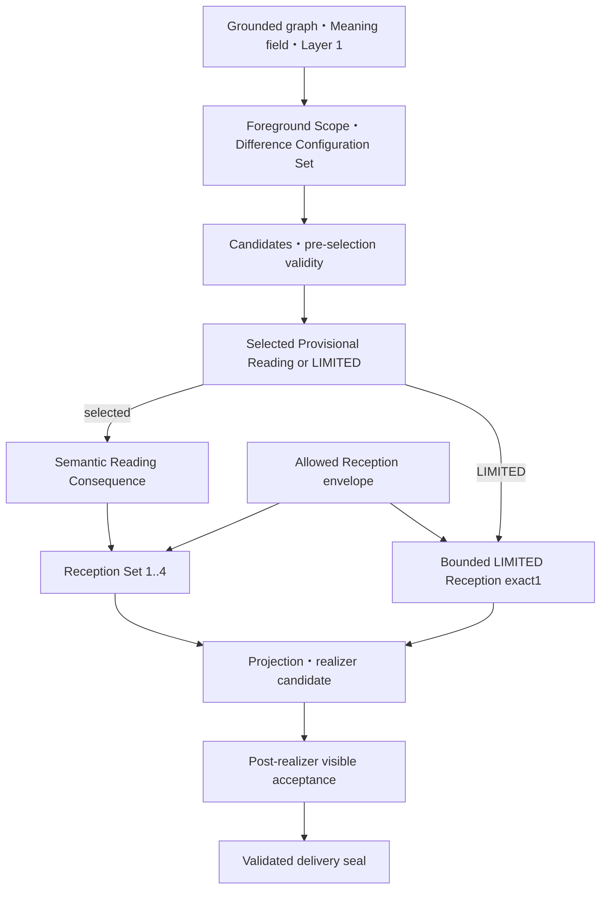

# Cocolon / CMEE Stage1
## Emlis入力差分保持型意味決定 — 華恋最終技術設計・実装順

| 項目 | 値 |
|---|---|
| Document ID | `Cocolon_CMEE_Stage1_Emlis_InputSpecificMeaningDecision_KarenDesigned_FinalTechnicalDesignAndImplementationOrder_20260828` |
| Date | `2026-09-04` |
| Status | `CURRENT_PRODUCT_OWNER_NON_PASS / REALIZABLE_RECEPTION_EXPRESSION_WORK_STAGE1_ACTIVE` |
| Design owner | `Karen` |
| 対象 | CMEE Stage1 Layer 2 / Emlisの入力固有意味決定 |
| Pro review chain | initial exact8 + intermediate exact7 + latest exact13（単一添付内の遅延出力を時系列分離） |
| Latest Pro review source | `Pro華恋レビュー2.txt` SHA-256 `c1101d6ad20c7d9fc3ea6d2e03900667f457e842806348db33b7ae968665e53e` |
| Latest Pro review result | `PASS_WITH_REQUIRED_CORRECTIONS` |
| Required corrections resolution | latest exact13 + earlier non-conflicting unique corrections = `REFLECTED`; stale-preimage RC13は§19.3の同一意図充足で閉包 |
| Canonical adoption | `ADOPTED_BY_MASH_CURRENT_REQUEST` |
| Revision state | `IM00_IM09_IMPLEMENTED / IM10_NON_PASS / §24_CURRENT_CORRECTION` |
| Historical IM00–IM10 technical handoff remaining | `EXACT0` |
| Historical implementation order | `IM00_IM10_EXACT11`; current owner=`§24 / canonical 06 §87` |
| Implementation execution | `REALIZABLE_RECEPTION_EXPRESSION_PHASE1_DESIGN_CHECKPOINT_ACTIVE` |
| 実装・Product Read・activation・I09 | `CURRENT_CORRECTION_NOT_YET_IMPLEMENTED / 0 / 0 / HISTORICAL_COMPLETE` |
| GitHub reflection authority / scope | `FRESH_MASH_LEVEL3_CMEE_WORK_STAGE1_REALIZABLE_RECEPTION_EXPRESSION_CANONICAL_INTEGRATION_AND_HUMAN_RECEPTION_BODY_CLOSURE_20260904` |
| 外部AI・provider・network inference | `EXACT0` |
| Product / technical credit | `0 / 0` |
| Automatic progression | `false` |
| Mashへの追加質問 | `CURRENT_MASH_QUESTION_REQUIRED = FALSE` |
| System Context v1 | `FRESH_OWNER_RESOLVED` — PR #37 start head `20bb1cbbda430205943ea2226e8a0ef331cc9c7b` |
| System Context use | `DIRECT_CANONICAL_ORIGINAL_READ_USED` |
| System Context generated-output dependency | `STALE_FAIL_CLOSED / UNAVAILABLE / EXACT0` |
| Superseded proposal disposition | canonical統合後にcurrent treeから削除。Git履歴だけに保持 |

---

## 0. 結論

必要なのは、まさに **「入力から安全に得られた構造のうち、今回Emlisが何を入力固有の意味として前景化するか」を決めるsole owner** である。

ただし、華恋の構造をそのまま複製するべきではない。華恋が行っている機能上の原則――複数の読みをすぐ一つへ潰さないこと、事実・解釈・不明を分けること、全体の関係を見て重要差分を選ぶこと、その選択に応じて応答姿勢を決めること――を、Emlis向けに **providerless・source-grounded・deterministic・監査可能** な構造へ明示化するのがより理想的である。

本書は、その構造を **Emlis入力差分保持型意味決定**（Difference-Preserving Input Meaning Decision）として設計する。

中心定義は次のとおり。

> 入力固有の意味とは、source-groundedなcomponent・endpoint・relation・direction・predicate・owner・modality・time・aspect・scope・qualifierのうち、識別性、入力全体の読みへの影響、Emlisの応答への影響をすべて持つ、最小十分なsemantic / pragmatic configurationである。

成立条件はexact3である。ただし循環を避けるため、1–2をpre-selection hard validity、3をselected reading後のpost-binding semantic acceptance＋post-realizer visible acceptanceとして段階化する。3が不成立でも別readingを選び直さず、named capability gapへ閉じる。

1. **Discriminative necessity**  
   必要なcomponent・relation・direction・qualifier等を失うと、materialに対照的な入力と区別できなくなる。
2. **Whole-reading consequence**  
   その差分が入力全体の読み方を実際に変える。付随情報だけを拾ったものではない。
3. **Emlis-response consequence**  
   そのreadingのsemantic consequenceが、Emlisが正直に述べられる注意、感情、考え、評価、距離または関係姿勢の少なくとも一つへ入力固有の差分を生む。

materialなrelationがある入力ではrelation propositionを使う。binary relationがなくても、`predicate + owner + modality / time / aspect / scope / qualifier` により対照差分が成立するqualified event / state propositionをprimary reading focusにできる。

意味的に同等な言い換えや、同じ関係構造を同じ限定で述べた入力は、同じoperationや正規化signatureになってよい。「入力固有」とは語句ごとに一意という意味ではなく、sourceが拘束するsemantic / pragmatic conditionを変える対照差分を潰さず、その差分がwhole readingとvisible Receptionを実際に変えるという意味である。

このreading focusを先に選び、その後にだけEmlisのReception、主観命題、日本語表現を導出する。`MATERIAL_WEIGHT`、`PROTECT_USER_AGENCY`、`CONCERN`、`RESPECT`などの一般的な態度を先に選び、そこから意味を逆算してはならない。

current design revisionに必要なMashの追加構造知識はexact0である。既存知識で、理解と事実、意図と出力、履歴・パターン・可能性、連続する変化、自己世界・現実世界・関係世界の必要区別は足りている。現在の残件はMashの思想不足ではなく、華恋側のEmlis technical mappingである。将来、actual product caseで具体的な未解決競合が初めて観測された場合だけ、別のMash判断候補にする。

### 0.1 Proレビュー exact10対応表

| # | Pro必須修正 | 本書の対応 |
|---|---|---|
| 1 | LIMITED通常観測でもLayer 2 exact1 | §4、§8.4、§9.1、§12、§13で`BoundedLimitedReception` exact1を必須化 |
| 2 | source provenanceとEmlis provisional readingの分離 | §2、§6.4、§8.4、§9.1で別field・別lineage化 |
| 3 | selected focus exact1とReception set 1..4の分離 | §2、§8.4、§9.1でprimary focus / supporting facets / Reception setを分離 |
| 4 | qualified event / stateの許容 | §0、§5、§6、§7、§12、§13へrelation以外の成立経路を追加 |
| 5 | compatible connected facetsの統合 | §5.5、§6.3、§8.3でprimary focus＋supporting facetsへ統合 |
| 6 | 入力固有意味の成立条件exact3 | §0、§6.4、§7、§12に識別性・whole-reading・Emlis-responseを固定 |
| 7 | positive subjective contribution exact1以上 | §7、§9.1–§9.2、§12で`AFFIRMATIVE_RECEPTION_CONTRIBUTION` exact1以上を必須化 |
| 8 | `NO_ABSTENTION_SUBSTITUTION` | §7、§12、§13でacceptance invariant化 |
| 9 | System Context表記の補正 | 冒頭metadataと参照節でfresh owner resolution＋canonical original direct readを記録 |
| 10 | Mash知識gap exact0のscope限定 | §0、§14、§18をcurrent design revision限定へ補正 |

### 0.2 Proレビュー列とtechnical closure

前回までのPro商品レビューexact10は反映済みである。その後、同一レビュー処理から遅延して出た複数結果を、単一結果として混ぜずに **initial exact8 → intermediate exact7 → latest exact13** の順で分離した。latest verdictは`PASS_WITH_REQUIRED_CORRECTIONS`である。本書はlatest exact13に加え、earlier outputだけに存在する非競合のmaterial correctionを§19–§22へ統合する。したがって「前回PASSだけを根拠に未修正で進む」状態ではない。

| 閉包項目 | 最終版の処理 | owner |
|---|---|---|
| Foreground Scope derivation | §5.2.1で許可basis exact5、禁止入力、compatible union、material competing、zero-object STOPをclosed contract化 | A. Source-grounded meaning field |
| whole-reading consequence | §6.4–§6.5でclosed code exact7、source＋Foreground Scope＋Required Difference binding、counterfactual発行条件を固定 | candidate evidence / B. ReadingConsequence |
| 型名・status・実装順 | `SubjectiveDepthClass`へ統一し、Pro PASS／Mash判断待ち／IM00–IM10 exact11へ更新 | 本書metadata・§9・§17 |

```text
LATEST_PRO_REVIEW = PASS_WITH_REQUIRED_CORRECTIONS
PREVIOUS_REQUIRED_CORRECTIONS = 10_OF_10_REFLECTED
DELAYED_REVIEW_EFFECTIVE_CORRECTIONS = REFLECTED_IN_SECTIONS_19_THROUGH_22
PRODUCT_PRINCIPLES_CHANGE = 0
CANONICAL_ADOPTION = ADOPTED_BY_MASH_CURRENT_REQUEST
REVISION_STATE = FINALIZED_FOR_IMPLEMENTATION
TECHNICAL_HANDOFF_REMAINING = EXACT0
IMPLEMENTATION_ORDER = IM00_IM10_EXACT11
IMPLEMENTATION_EXECUTION = NOT_STARTED
PRODUCT_READ / ACTIVATION / I09 = 0 / 0 / 0
AUTOMATIC_PROGRESSION = false
```

保持する原則は、Required Difference、A / B / C分離、meaning-before-Reception、hard validity、source-grounded selection、generic fallback禁止、visible causal trace、Route A providerless-onlyである。今回のGitHub effectは本最終設計書＋正典routing exact3の更新と、統合済み修正案exact1の削除からなるchanged path exact5である。runtime source、test、API、DB、RN、private generation、Product Read、activation、I09 effectはすべて0である。

---

## 1. この設計が必要になった確定事実

### 1.1 最新terminal

直近のRoute A v2検証は次で終端している。

| 判定主体 | 結果 |
|---|---|
| machine | `CLEAR` |
| Ultra technical review | `CLEAR` |
| Pro combined early language viability read | `COMMON_DEFECT` |
| Formal Mash Product Read | `NOT_RUN` / `PRODUCT_READ_EVALUATED=false` |
| defect class | `GENERIC_SUBJECTIVE_CONTENT` |
| cause component | `SUBJECTIVE_MEANING_PLANNER` |
| candidate acceptance | `false` |
| I09 | 未実行。次工程ではない |

したがって、今回の問題は日本語の格・活用・接続の失敗ではない。入力のどの意味をEmlisの主観として述べるかを決める上流層の不足である。

### 1.2 現行plannerの実態

現行 `project_subjective_meaning_plan()` は、利用可能なgrounded contributionから概ね次の固定順でfocusを取る。

`generic non-collapse → explicit cause → unfinished → action/change → non-collapse → residue → direction → change → burden → center`

そのfocusを、主として次の一般的なappraisalへ写像する。

- `RELATIONAL_NONCOLLAPSE / PRESERVE_BOTH_ENDPOINTS`
- `UNFINISHED_OPENNESS / LEAVE_UNFINISHED`
- `BOUNDED_CHANGE / RECOGNIZE_AS_BOUNDED`
- `AGENCY_BOUNDARY / RESPECT_CHOICE`
- `MATERIAL_WEIGHT / RECEIVE_AS_MATERIAL`

ここには「この入力の複数要素が、なぜこの組合せで一つの意味になるのか」を作る責務がない。source trace、owner、binding、日本語文法が正しくても、結果は「小さく扱わない」「一つにしない」「急いで決めない」「選択を守る」に寄りやすい。

また、既存 `SubjectiveSpecificity` の `RELATION_BOUND_MULTI_ROLE / MULTI_ROLE / SINGLE_ROLE` はbinding構造のspecificityであり、内容が別入力へ流用できないというsemantic specificityではない。

### 1.3 case-frame v2の責務

Typed Japanese Case-Frame Realizer v2は、既に決定されたtyped meaningを自然な日本語へ実現する下流consumerである。設計上もupstream meaning extractionを変更せず、新しい意味を所有しない。

よって、v2の **下流sole-owner境界とtyped case-frame方式** は保持する。今回の修正をcase frame、predicate key、surface templateだけへ押し込めてはならない。

ただし、現行registry bytesやsense inventoryが新しいreading focusをlosslessに可視化できるとは事前保証しない。既存inventoryへ投影すると `MATERIAL_WEIGHT` 等へ縮退する場合は `MEANING_REALIZATION_CAPABILITY_GAP` とし、fresh authorityなしにsurface inventoryを拡張せず、generic appraisalにもfallbackしない。

---

## 2. 「意味を決める」の境界

ここでEmlisが決めるのは、ユーザーの内面の真実ではない。入力に対する **Emlisの暫定的で訂正可能なreading** である。

責務をexact3へ分ける。

| 層 | 所有するもの | 所有しないもの |
|---|---|---|
| A. Source-grounded meaning field | Foreground Scope、Difference Configuration Set、入力から安全に保持できるnode、relation、qualified event/state、qualifier、unknown、複数候補 | Emlisの最終的なreading選択 |
| B. Selected Emlis Provisional Reading | primary reading focus exact1、supporting facets 0..4、semantic `ReadingConsequence` exact1 | ユーザーの真意、感情・stance、一般的人格推定、助言方針 |
| C. Meaning-bound Emlis Reception Set | BがEmlisの受け取り方へ生むrequest-localな主観命題1..4 | 入力から独立した一般的態度による意味の代用 |

**「決定」と呼ぶのはBのprimary reading focus exact1だけ** とする。Aは暫定構造であり、Bのsupporting facetsはprimaryとsource-connectedで競合しない補助差分、CはBから派生するReception setである。primaryとsupportingの合計は現行Observation上限に合わせて1..5に閉じ、無制限のfacet列挙を禁止する。

provenanceとreading statusは別の軸である。

```text
basis / relation provenance
  = SOURCE_EXPLICIT | RULE_ADMITTED_PROVISIONAL

selected Emlis reading status
  = EMLIS_PROVISIONAL_READING
```

source-explicitなのはbasisまたはrelationであり、Emlisが選ぶ中心readingそのものを `SOURCE_STATED` と呼んではならない。将来の `USER_CONFIRMED` は、ユーザーが明示確認した場合にだけ作る別lineageとし、本contractのstatusへ混ぜない。Bの `ReadingConsequence` はmeaning-sideのsemantic / pragmatic consequenceだけを持ち、affect、stance、allowed envelopeを持たない。

この分離により、次を同時に守る。

- user meaning sovereignty
- source/fact/inference/unknown partition
- Emlisの独立した話者性
- request-locality
- 訂正可能性
- no mind-reading
- no policy-only subjectivity

---

## 3. 華恋の構造から採るもの／採らないもの

### 3.1 採る機能原理

華恋の機能上の構造は、今回の用途では次のように要約できる。

1. 入力を一つの解釈へ直結させず、複数の暫定候補を保つ。
2. 誰の事実か、何が実際に起きたか、何が推測か、何がまだ不明かを分ける。
3. 単語や一文だけでなく、入力全体の対立、継続、変化、制約、未完了を見る。
4. 候補同士を比較し、入力中の差分を最も失わない読みを前景化する。
5. 前景化した意味に応じて、受け取り方と表現を決める。
6. 根拠が薄いときは深さを作らず、限定する。
7. 後続情報により訂正できる形で保持する。

これは華恋の非公開な思考過程や内部重みを複製するものではない。Emlisで必要な機能境界だけを、検証可能なcontractへ変換する。

### 3.2 そのまま複製しない理由

華恋は広い会話文脈、自然言語生成、暗黙の比較能力を持つ。一方、Emlis Stage1には次の制約がある。

- 入力sourceへ完全に辿れること
- request-localであること
- providerlessであること
- deterministicであること
- trace可能であること
- promotionとmind-readingを機械的に抑止できること
- disabled candidate検証とproduction activationを分離すること

したがって、華恋を模倣する曖昧な「考察器」を置くのではなく、華恋の判断原理を **差分、relation path、validity、abstention** として明示する方が理想的である。

---

## 4. 提案アーキテクチャ



現行 `build_subjective_planning_inputs` は、pre-meaningとpost-meaningへ分割する。現状のまま後ろへmeaning decisionを足すだけでは、既に選ばれたReception act、style、temperatureが意味選択へ逆流するためである。parallelな第二meaning ownerは作らない。

概念上の接続は次とする。

```python
semantic_inputs = build_premeaning_grounded_inputs(
    meaning_graph,
    meaning_field,
    layer1_contributions,
    admitted_relations,
    source_qualifiers,
    material_unknowns,
)

allowed_envelope = build_allowed_reception_opportunity_envelope(
    parent_allowed_acts,
    safety_boundaries,
)

grounded_view = derive_grounded_situation_view(semantic_inputs)
scope_derivation = derive_foreground_scope_closed(grounded_view)
outcome = None

if scope_derivation.state == "NO_SAFE_FOREGROUND_OBJECT":
    return STRUCTURE_INSUFFICIENT_STOP
elif scope_derivation.state == "COMPETING_MATERIAL_SCOPES":
    outcome = make_limited_competing_material_readings_outcome(
        scope_derivation.retained_foreground_source_object_refs,
        semantic_inputs.layer1_contributions,
        scope_derivation.unresolved_scope_refs,
    )
elif scope_derivation.state == "FOREGROUND_SCOPE_STRUCTURE_INSUFFICIENT":
    outcome = make_limited_structure_insufficient_outcome(
        semantic_inputs.layer1_contributions,
        scope_derivation.retained_foreground_source_object_refs,
        scope_derivation.missing_structure_refs,
    )
else:
    foreground_scope = scope_derivation.foreground_scope
    configuration_derivation = derive_difference_configuration(
        grounded_view,
        foreground_scope,
    )

    if configuration_derivation.state == "NO_FOREGROUND_OBJECT":
        return STRUCTURE_INSUFFICIENT_STOP
    elif configuration_derivation.state == "UPSTREAM_STRUCTURE_INSUFFICIENT":
        outcome = make_limited_structure_insufficient_outcome(
            foreground_scope,
            semantic_inputs.layer1_contributions,
            configuration_derivation.foreground_source_object_refs,
            configuration_derivation.missing_structure_refs,
        )
    elif configuration_derivation.state == "THIN_NO_SAFE_CONFIGURATION":
        outcome = make_limited_no_safe_configuration_outcome(
            foreground_scope,
            semantic_inputs.layer1_contributions,
            configuration_derivation.foreground_source_object_refs,
        )
    else:
        difference_configuration_set = (
            configuration_derivation.configuration_set
        )
        bundle_derivation = derive_requirement_bundle_set(
            difference_configuration_set,
        )
        if bundle_derivation.state == "UPSTREAM_STRUCTURE_INSUFFICIENT":
            outcome = make_limited_structure_insufficient_outcome(
                foreground_scope,
                semantic_inputs.layer1_contributions,
                configuration_derivation.foreground_source_object_refs,
                bundle_derivation.missing_structure_refs,
            )
        elif bundle_derivation.state == "NO_REQUIRED_DIFFERENCE":
            outcome = make_limited_no_safe_configuration_outcome(
                foreground_scope,
                semantic_inputs.layer1_contributions,
                configuration_derivation.foreground_source_object_refs,
            )
        else:
            requirement_bundle_set = bundle_derivation.bundle_set
            candidate_set = build_input_specific_meaning_candidates(
                difference_configuration_set,
                requirement_bundle_set,
            )
            outcome = select_input_specific_meaning(
                validate_preselection_candidates(candidate_set),
                difference_configuration_set,
                requirement_bundle_set,
            )

if outcome.is_limited:
    limited_reception = derive_bounded_limited_reception(
        outcome,
        semantic_inputs.layer1_contributions,
        allowed_envelope,
    )
    unsealed_inputs = build_unsealed_limited_projection_inputs(
        outcome,
        limited_reception,
    )
    projection_candidate = project_limited_subjective_plan_candidate(
        unsealed_inputs,
    )
    semantic_consequence_contract = None
    reception_contract = limited_reception
else:
    reading_consequence = derive_semantic_reading_consequence(
        outcome.selected_reading,
    )
    reception_set = derive_meaning_bound_reception_set(
        outcome.selected_reading,
        reading_consequence,
        allowed_envelope,
    )
    post_binding_acceptance = validate_response_consequence_binding(
        outcome.selected_reading,
        reading_consequence,
        reception_set,
    )
    if not post_binding_acceptance.accepted:
        return MEANING_RESPONSE_CONSEQUENCE_GAP
    unsealed_inputs = build_unsealed_subjective_projection_inputs(
        semantic_inputs,
        outcome.selected_reading,
        reading_consequence,
        reception_set,
    )
    projection_candidate = project_selected_reading_plan_candidate(
        unsealed_inputs,
    )
    semantic_consequence_contract = reading_consequence
    reception_contract = reception_set

surface_candidate = realize_subjective_surface_candidate(
    projection_candidate,
)
visible_acceptance = validate_postrealizer_visible_acceptance(
    outcome,
    semantic_consequence_contract,
    reception_contract,
    surface_candidate.surface_derivations,
    surface_candidate.visible_units,
)
if not visible_acceptance.accepted:
    return visible_acceptance.named_stop

subjective_plan = seal_validated_delivery_plan(
    projection_candidate,
    surface_candidate,
    visible_acceptance,
)
product_acceptance = derive_product_acceptance_disposition(
    outcome,
    visible_acceptance,
)  # UPSTREAM_STRUCTURE_CAPABILITY_GAP preserves product_acceptance=false
```

`GroundedHumanReceptionPlan`またはparent allowed actsは、最終Receptionではなくallowed opportunity envelopeとしてのみ保持する。このenvelopeは `GroundedSituationView`、Difference Configuration Set、Requirement Bundle Set、candidate builder、selectorの引数型から到達不能にし、selection outcome確定後のbindingへだけ渡す。selected readingへbindしたact subset、style、temperatureを確定した後に `projection_preimage_ref` を作る。

`PreMeaningGroundedInputs` はsemantic source、relation、qualifier、unknownだけを持ち、allowed act、style、temperature、affect、stanceを持たない。`AllowedReceptionOpportunityEnvelope` は逆にmeaning componentを選ぶmethodを持たない。この型分離をReception逆流のmachine invariantとする。

exact3のうちDiscriminative necessityとWhole-reading consequenceはpre-selectionで検証する。Emlis-response consequenceは、post-bindingでsemantic bindingを検証し、post-realizerでvisible差分を最終検証して閉じる。どちらのfailureでも別candidateへreselectしてはならない。`ReadingConsequence` はB側のsemantic / pragmatic consequenceだけを所有し、主観mode、affect、stanceはCまで導入しない。

LIMITED routeはderivation / selection outcomeを先に確定し、その後にだけ `BoundedLimitedReception` exact1をLayer 1 contributionとforeground source objectへbindする。これは深いselected readingの偽装ではなく、薄い入力を薄いまま受け取るfirst-class bounded laneである。正常なLIMITEDと `LIMITED_RECEPTION_CAPABILITY_GAP_STOP` を分け、Layer 2 exact0を正常成果として許容しない。

projection inputは `SelectedReadingProjectionInputs | LimitedProjectionInputs` のtagged unionとし、exhaustive dispatchする。selected laneは `project_selected_reading_plan_candidate`、LIMITED laneは `project_limited_subjective_plan_candidate` だけを呼ぶ。後者はselected reading fieldを受け取らない。既存 `project_subjective_meaning_plan` をorchestrator名として残す場合も、このdispatchだけを所有し、意味を固定優先順で発見しない。

---

## 5. Grounded Situation View

### 5.1 役割

既存の `GroundedMeaningGraph`、`InterpretationCandidatePool`、`EmlisMeaningField`、Layer 1 contributionを、意味候補生成が利用できる一つのrequest-local viewへ正規化する。

新しい事実や心理を追加する層ではない。既存source evidenceへ到達できない内容は一切入れない。

### 5.2 必須partition

| 軸 | 例 | 必須保持条件 |
|---|---|---|
| source world | self/internal、actual output/external、relationship/shared、unknown | world間を暗黙に同一化しない |
| epistemic | source-stated fact、source-stated interpretation、Emlis provisional reading、unknown | provisionalをfactへ昇格しない |
| temporal | before、current、after、continuing、unknown | before/afterと継続方向を反転しない |
| role | wish、intention、action、effort、constraint、change、residue、evaluation | 意図と実行、変化と評価を潰さない |
| relational | contrast、coexistence、cause/result、attempt/block、wish/constraint、action/change、preservation | endpointと方向を保持する |
| modality/polarity | actual、possible、uncertain、negated、not-generalized | 可能性をactualへ、限定を一般化へ変えない |

### 5.2.1 Foreground Scope closed derivation contract

Foreground Scopeは、入力固有meaningの候補を選ぶ第二selectorではない。後段が落としてはならないsource-connected objectのrequest-local unionを所有するだけであり、reading operation、Reception、主観mode、表現を順位付けしない。

scope basisは次のclosed exact5からだけ発行できる。

```python
ForegroundScopeBasisKind = Literal[
    "SOURCE_EXPLICIT_TARGET_TOPIC_OR_SCOPE",
    "LAYER1_REQUIRED_OBSERVATION_OBJECT",
    "EXISTING_REQUIRED_RETENTION_DUTY",
    "SOURCE_CONNECTED_RELATION",
    "MATERIAL_UNKNOWN_OR_REQUIRED_QUALIFIER",
]

class ForegroundScopeBasisRow:
    schema_version: Literal["1.0"]
    basis_kind: ForegroundScopeBasisKind
    scope_object_refs: tuple[str, ...]  # exact1+
    source_object_refs: tuple[str, ...]  # exact1+
    source_evidence_refs: tuple[str, ...]  # exact1+
    layer1_required_object_refs: tuple[str, ...]
    required_retention_duty_refs: tuple[str, ...]
    source_connected_relation_refs: tuple[str, ...]
    material_unknown_refs: tuple[str, ...]
    required_qualifier_refs: tuple[str, ...]
    owner_refs: tuple[str, ...]
    world_refs: tuple[str, ...]
    epistemic_state_refs: tuple[str, ...]
    time_refs: tuple[str, ...]
    aspect_refs: tuple[str, ...]
    modality_refs: tuple[str, ...]
    polarity_refs: tuple[str, ...]
    scope_refs: tuple[str, ...]

class ForegroundScope:
    schema_version: Literal["1.0"]
    scope_id: str
    integrated_scope_object_refs: tuple[str, ...]  # exact1+
    basis_row_refs: tuple[str, ...]  # exact1+
    source_connected_relation_refs: tuple[str, ...]
    required_retention_duty_refs: tuple[str, ...]
    material_unknown_refs: tuple[str, ...]
    required_qualifier_refs: tuple[str, ...]
    source_evidence_refs: tuple[str, ...]  # exact1+

class ForegroundScopeDerivation:
    schema_version: Literal["1.0"]
    state: Literal[
        "FOREGROUND_SCOPE_AVAILABLE",
        "COMPETING_MATERIAL_SCOPES",
        "FOREGROUND_SCOPE_STRUCTURE_INSUFFICIENT",
        "NO_SAFE_FOREGROUND_OBJECT",
    ]
    foreground_scope: ForegroundScope | None
    retained_foreground_source_object_refs: tuple[str, ...]
    unresolved_scope_refs: tuple[str, ...]
    missing_structure_refs: tuple[str, ...]
    derivation_evidence_refs: tuple[str, ...]
```

`SOURCE_CONNECTED_RELATION`に許可するrelation kindは、sourceへ到達するcontrast、coexistence、continuation、correctionのexact4だけである。各basis rowはsource evidence exact1以上へ到達し、許可kindに対応するfieldをexact1以上持つ。optional fieldの多さは順位にならない。

aggregationは自由な`material`判定を置かず、次へ閉じる。scope objectが同一でもこの判定を省略しない。

1. 全admitted basis rowを、owner、world、epistemic、time、aspect、modality、polarity、scope、required qualifier、unknownのtyped compatibility exact10でpairwise比較する。
2. 各axisは、同一typed value、またはcontrast／coexistence／continuation／correction exact4のsource-connected relationが両valueを別値のまま保持する場合だけcompatibleとする。unknownはunknownのまま保持し、knownへpromotionして両立させない。correctionは方向とbefore／afterを保持し、旧値を現値へ上書きして両立させない。
3. distinct objectのrowは、exact10 compatibilityに加えてexact4のsource-connected relationが必要である。同一objectのrowもexact10をすべて満たす必要がある。
4. 全admitted rowがpairwise compatibleなら、全rowを一つの`ForegroundScope`へcanonical set unionする。first-match、score、任意truncate、固定category優先を持たない。
5. owner、world、epistemic、time、aspect、modality、polarity、scope、required qualifier、unknownのexact10いずれかのtyped slotに異なる値があり、exact4 relationで別値の保持を証明できない場合はtyped conflictとする。admitted basisはすべてsource-explicit、Layer 1 `REQUIRED`、既存`REQUIRED` dutyまたは保持必須unknown／qualifierなので、追加scoreなしにmaterial conflictとなり、`COMPETING_MATERIAL_SCOPES`から`LIMITED_COMPETING_MATERIAL_READINGS`へ送る。
6. 安全なsource objectがexact1以上あるが、exact10判定に必要なtyped field、またはdistinct object間のrequired relationが欠ける場合は`FOREGROUND_SCOPE_STRUCTURE_INSUFFICIENT`とし、`LIMITED_STRUCTURE_INSUFFICIENT`へ送る。欠落を競合やthin inputへ変換しない。
7. `NO_SAFE_FOREGROUND_OBJECT`とSTOPは、安全に保持できるforeground source objectがexact0の場合だけ許す。

次はbasis、aggregation、競合解消のいずれにも使用禁止であり、型から到達不能にする。

- Reception act、allowed Reception envelope
- affect、stance、style、temperature、subjective mode
- `unfinished / direction / burden / agency / material`等の固定category priority
- 日本語surface、surface token、raw token position
- fixture ID、case ID、hash、列挙順、request-local/internal ID

IDは参照整合性とtraceにだけ使い、scopeの採否・中心・順序には使わない。Foreground Scopeは`SelectedEmlisProvisionalReading`ではなく、後段のDifference Configurationが必ず保持する対象集合である。

### 5.3 Difference ConfigurationとRequired Difference Row

まずclosed sourceから観測差分を機械的に作り、そのうちclosed invariantを壊すものだけをrequiredへ昇格する。`material`を自由判断するselectorは置かない。binary relationのない入力を一律に捨てないため、configurationはclosed unionにする。

```python
class RelationalConfiguration:
    configuration_id: str
    endpoint_component_refs: tuple[str, ...]  # 2..5
    relation_path_refs: tuple[str, ...]
    direction_rows: tuple[RelationDirectionRow, ...]
    source_qualifier_refs: tuple[str, ...]
    source_evidence_refs: tuple[str, ...]

class QualifiedEventStateConfiguration:
    configuration_id: str
    predicate_ref: str
    owner_ref: str
    modality_refs: tuple[str, ...]
    time_refs: tuple[str, ...]
    aspect_refs: tuple[str, ...]
    scope_refs: tuple[str, ...]
    qualifier_refs: tuple[str, ...]
    source_evidence_refs: tuple[str, ...]

DifferenceConfiguration = (
    RelationalConfiguration | QualifiedEventStateConfiguration
)

class DifferenceConfigurationSet:
    foreground_scope_ref: str
    configuration_refs: tuple[str, ...]  # 1..5
    source_evidence_refs: tuple[str, ...]

class DifferenceConfigurationDerivation:
    state: Literal[
        "CONFIGURATION_SET_AVAILABLE",
        "THIN_NO_SAFE_CONFIGURATION",
        "UPSTREAM_STRUCTURE_INSUFFICIENT",
        "NO_FOREGROUND_OBJECT",
    ]
    configuration_set: DifferenceConfigurationSet | None
    foreground_source_object_refs: tuple[str, ...]
    missing_structure_refs: tuple[str, ...]
    derivation_evidence_refs: tuple[str, ...]

class ObservedDistinctionRow:
    distinction_id: str
    configuration_ref: str
    axis: DifferenceAxis
    contrasted_component_refs: tuple[str, ...]
    source_qualifier_refs: tuple[str, ...]
    source_evidence_refs: tuple[str, ...]

class RequiredDifferenceRow:
    difference_id: str
    observed_distinction_ref: str
    invariant_codes: tuple[DifferenceInvariantCode, ...]
    retention_duty_refs: tuple[str, ...]
    counterfactual_mutation_ref: str  # exact1
```

主なaxisは次とする。

- `INTENTION_VS_OUTPUT`
- `INTERNAL_VS_EXTERNAL`
- `BEFORE_VS_AFTER`
- `HISTORY_VS_PATTERN_VS_POSSIBILITY`
- `WISH_VS_CONSTRAINT`
- `ACTION_VS_RESIDUE`
- `CHANGE_VS_GENERALIZATION`
- `FACT_VS_INTERPRETATION`
- `RESOLVED_VS_UNRESOLVED`
- `ENDPOINT_A_VS_ENDPOINT_B`

このrowが、後段の「何を保持しなければgenericになるか」を入力ごとに定義する。

### 5.4 required rowの導出規則

Observed rowの導出元はexact5に閉じる。

1. admitted binary relationのendpoint＋direction
2. source-boundな `predicate + owner` と、modality／time／aspect／scope／qualifierのexact1以上からなるqualified event / state
3. 同一relation pathまたは同一qualified event / state上で異なるworld／role／temporal／epistemic axis
4. component、relationまたはpredicateへbindしたpolarity／modality／time／scope／non-generalization qualifier
5. component、relationまたはpredicateへbind済みのmaterial unknown

Observed rowを一つずつcounterfactual mutationし、次のclosed invariantのexact1以上を壊す場合だけ `RequiredDifferenceRow` にする。

```text
ENDPOINT_COLLAPSE
DIRECTION_REVERSAL
WORLD_COLLAPSE
ROLE_COLLAPSE
TEMPORAL_COLLAPSE
POLARITY_REVERSAL
MODALITY_PROMOTION
UNKNOWN_ERASURE
EXPLICIT_LIMIT_ERASURE
REQUIRED_RETENTION_ERASURE
```

counterfactual mutationはendpoint削除、左右交換、predicateまたはowner削除、world／role／time置換、modality／aspect／scope／qualifier削除、unknown promotionのclosed setとする。各`RequiredDifferenceRow`は、そのrowをrequiredにしたmutation exact1を`counterfactual_mutation_ref`として所有する。どのinvariantも壊さない差分はrequired rowにしない。source-explicit correction、conclusion、contrast、refusal等の既存retention dutyが`REQUIRED`なら `REQUIRED_RETENTION_ERASURE` で残す。

`REQUIRED_RETENTION_ERASURE` のownerはsource／observation／MeaningField retention dutyのallowlistに限定する。Reception act、style、temperature、affect、value policy由来のretentionはmeaning-side required rowへ入れない。

語の珍しさ、文の長さ、感情強度、Reception opportunity、surface form、自由記述のloss effectは導出根拠にできない。

### 5.5 過剰summaryの防止

全required rowを一つの巨大なmeaningへ詰め込まない。`RequirementBundle` のanchorは、`RelationalConfiguration | QualifiedEventStateConfiguration` exact1である。anchor、そのendpointまたはpredicate＋owner、scoped qualifier、およびclosed invariantを保つために必要なsource-connected pathだけから機械的に作る。

```python
class RequirementBundle:
    bundle_id: str
    foreground_scope_ref: str
    anchor_configuration_ref: str  # exact1
    adjacent_configuration_refs: tuple[str, ...]  # 0..4
    required_difference_refs: tuple[str, ...]  # exact1+
    retention_duty_refs: tuple[str, ...]

class RequirementBundleSet:
    foreground_scope_ref: str
    bundle_refs: tuple[str, ...]  # 1..5

class RequirementBundleDerivation:
    state: Literal[
        "BUNDLE_SET_AVAILABLE",
        "NO_REQUIRED_DIFFERENCE",
        "UPSTREAM_STRUCTURE_INSUFFICIENT",
    ]
    bundle_set: RequirementBundleSet | None
    missing_structure_refs: tuple[str, ...]
    derivation_evidence_refs: tuple[str, ...]
```

`DifferenceConfigurationDerivation` と `RequirementBundleDerivation` はempty setの有無ではなく、closed stateで欠如理由を所有する。

- `*_AVAILABLE`: 対応setは1..5、`missing_structure_refs` はexact0。
- `THIN_NO_SAFE_CONFIGURATION`: configuration setはnone、foreground source object exact1以上、missing structure exact0、relation-rich／qualified／connected retention evidence exact0。
- `NO_REQUIRED_DIFFERENCE`: configuration setは存在するがrequired difference exact0、missing structure exact0。
- `UPSTREAM_STRUCTURE_INSUFFICIENT`: foreground source object exact1以上かつmissing endpoint／relation／predicate／owner／qualifier ref exact1以上。thin inputとして扱わない。
- `NO_FOREGROUND_OBJECT`: foreground source object exact0。accepted LIMITEDへ進めない。

availableな `DifferenceConfigurationSet` からavailableな `RequirementBundleSet` を作り、candidate builderとselectorはこのbounded setをend-to-endで消費する。単数unionは各configurationのvariantを表し、setはcompatible aggregationとactual conflict判定の単位を表す。candidateが成立するlaneではbasis configurationとrequirement bundleを各1..5要求する。unknown state、stateとcardinalityの不一致、欠如理由の自由記述fallbackはvalidator rejectとする。

- candidateのcoverageは全入力のrow総数ではなく、一つのbundle内で比較する。
- source graph上で接続されないbundleを、新しい因果や心理で結合しない。
- optional contributionを加えてもcandidateは優位にならない。
- 同じsource-constrained semantic / pragmatic conditionを保つなら、node・relation・仮定が少ないcandidateを残す。
- compatibleなbundleは、次のexact4をすべて満たす場合だけaggregate exact1へまとめる: 同じforeground scope / center、owner assignmentが一致またはtypedに両立、source-connectedなrelation / temporal path、source-explicitなcontrast・coexistence・continuation・correctionのallowlist関係。
- aggregateはprimary focus exact1＋supporting facets 0..4とし、primaryとsupportingの合計を1..5へ閉じる。power set、任意長path、ID／hash／列挙順によるprimary選択は禁止する。
- pairwise conflictがexact1でもあればaggregateせず、actual competing alternativesとして `LIMITED_COMPETING_MATERIAL_READINGS` とする。

これにより、現行fixed focusを曖昧な`material`判断へ移し替えるだけの再設計を禁止する。

---

## 6. Input-Specific Meaning Candidate

### 6.1 候補はcategoryではなくconfiguration命題

候補は `BURDEN`、`AGENCY`、`UNFINISHED` のような一語categoryでは成立しない。relational configurationまたはqualified event / state configurationとして、少なくとも次を保持する。

- relational laneでは、何と何の関係か、向きは何か。
- qualified event / state laneでは、predicateとownerは何か、どのmodality／time／aspect／scope／qualifierが入力固有差分を作るか。
- どの変化、制約、継続、未完了が重要か。
- どの限定とunknownを残すか。
- どのcomponent・relation・predicate・qualifierを失うとsource-constrained semantic / pragmatic conditionが変わるか。

### 6.2 Reading operation

meaning candidateは、少数の一般operationと入力固有argumentの組合せで構成する。operation単独は意味として認めない。

| operation | 機能 | 成立に必要なもの |
|---|---|---|
| `KEEP_DISTINCT` | 異なるworld、role、epistemic stateを同一化しない | materialな差分exact1以上 |
| `HOLD_RELATION` | 複数endpointとその有向relationを一つの意味単位として保持 | endpoint exact2以上＋admitted relation |
| `TRACK_TRANSITION` | before/current/afterの変化を方向付きで読む | temporal endpoint＋transition |
| `NOTICE_PERSISTENCE` | actionやchange後にも残る意図・感情・constraintを読む | earlier event＋continuing residue |
| `RECOGNIZE_BOUNDED_ACTUALITY` | actualな変化を認めつつ範囲・非一般化を保持 | actual change＋limiting qualifier |
| `HOLD_UNRESOLVED` | 既実行と未解決、複数可能性、unknownを同時保持 | actual component＋material unresolved component |
| `HOLD_QUALIFIED_EVENT_STATE` | binary relationなしでも限定されたevent / stateを入力固有のreading focusとして保持 | source-bound predicate＋owner＋modality／time／aspect／scope／qualifier exact1以上 |

たとえば `HOLD_RELATION` だけならgenericである。`HOLD_RELATION(continuation_intention_ref, uncertain_self_reported_overextension_ref, contrast_ref, current_ref)` のように、必要なendpoint・方向・限定が揃って初めて候補になる。

qualified event / stateも安全に成立せず、単一の無限定nodeしか得られない場合は、`CONTACT`を仮の深い意味にせず、後述の `LIMITED_NO_SAFE_INPUT_SPECIFIC_CONFIGURATION` へ送る。

### 6.3 候補生成

候補は次の順で、providerlessに列挙する。

1. `RequirementBundle`ごと、適用可能operationごと、basis epistemic tierごとにcanonical candidate exact1を作る。
2. relational laneではbefore/after、action/change、wish/constraint、actual/residueなどの既存typed relation pathを保持する。
3. qualified event / state laneではpredicate＋ownerを必須とし、modality／time／aspect／scope／qualifierの入力固有差分を保持する。
4. §5.5のclosed exact4を満たすcompatible connected bundleだけをaggregate exact1へ統合し、primary focus exact1＋supporting facets 0..4にする。
5. source qualifier、negation、modality、unknownを候補へbindingする。
6. nodeとedgeはcandidate内で各exact1回まで使い、同じedgeを再走査しない。
7. canonical semantic signatureでdedupeし、列挙順をselection根拠にしない。
8. disconnected component同士を新しい因果や心理で接続しない。
9. competing alternativesを一つのsummaryへ統合せず `LIMITED` とする。

Reading operationはexact7、basis epistemic tierはexact2なので、candidate cardinality上限は `RequirementBundle count × 7 × 2` とする。bundle当たり最大exact14を超えた場合は `CANDIDATE_CARDINALITY_OVERFLOW` へ閉じる。power setや任意長pathの列挙は禁止する。

同じbundle・operation・tierにmaterialに異なるargument bindingが複数ある場合、列挙順やIDでcanonical exact1を作らない。§5.5のclosed aggregation条件を満たせばprimary＋supportingへ統合し、満たさない場合は `LIMITED_COMPETING_MATERIAL_READINGS` とする。

raw text、fixture ID、case mode、surface token、hash、provider出力をcandidate selectorへ使ってはならない。

### 6.4 契約案

```python
class InputSpecificMeaningCandidate:
    schema_version: Literal["1.0"]
    candidate_id: str
    reading_operation: MeaningReadingOperation
    basis_contribution_refs: tuple[str, ...]
    basis_configuration_refs: tuple[str, ...]  # 1..5
    requirement_bundle_refs: tuple[str, ...]  # 1..5
    primary_component_refs: tuple[str, ...]
    relation_path_refs: tuple[str, ...]
    qualified_event_state_refs: tuple[str, ...]
    basis_provenance_rows: tuple[BasisProvenanceRow, ...]
    basis_epistemic_tier: Literal[
        "SOURCE_EXPLICIT",
        "RULE_ADMITTED_PROVISIONAL",
    ]
    basis_derivation_refs: tuple[str, ...]
    source_qualifier_refs: tuple[str, ...]
    preserved_difference_refs: tuple[str, ...]
    material_unknown_refs: tuple[str, ...]
    forbidden_promotion_codes: tuple[str, ...]
    forbidden_semantic_collapse_refs: tuple[str, ...]
    semantic_loss_codes: tuple[DifferenceInvariantCode, ...]
    input_specificity_evidence_ref: str  # exact1
    emlis_reading_status: Literal["EMLIS_PROVISIONAL_READING"]
    semantic_signature: MeaningSemanticSignature

class InputSpecificityEvidence:
    candidate_ref: str  # exact1
    foreground_scope_ref: str  # exact1
    required_difference_refs: tuple[str, ...]  # exact1+
    discriminative_necessity_refs: tuple[str, ...]  # exact1+
    whole_reading_consequence_refs: tuple[str, ...]  # WholeReadingConsequenceRow refs, exact1+

class ReadingConsequence:
    selected_reading_ref: str
    input_specificity_evidence_ref: str  # exact1
    whole_reading_consequence_refs: tuple[str, ...]  # exact1+
    changed_whole_reading_codes: tuple[WholeReadingConsequenceCode, ...]  # exact1+
    response_consequence_requirement_codes: tuple[str, ...]  # exact1+
    source_constraint_refs: tuple[str, ...]  # exact1+
```

`semantic_signature` は表層文ではなく、operation、component role、relation direction、epistemic state、temporal state、qualifier、および `component_semantic_keys` を正規化した構造値とする。

各 `component_semantic_key` はtyped predicate、semantic kind、owner、scope、roleを保持する。request-local IDやraw textだけには依存しない。content-bearing keyを安全に作れないcomponent同士はsemantic-equivalentとしてdedupeせず、material tieならLIMITEDへ閉じる。

candidateの `requirement_bundle_refs` は、selectorへ渡された同一 `RequirementBundleSet.bundle_refs` のsubsetでなければならない。各 `basis_configuration_ref` は、参照bundleの `anchor_configuration_ref | adjacent_configuration_refs` から到達でき、各参照bundleの全 `required_difference_refs` をcandidateの `preserved_difference_refs` が覆わなければならない。configurationの重なりからbundle IDを後算出してはならない。

candidate contractはReception、affect、stanceを一切持たない。`forbidden_semantic_collapse_refs` は「このendpoint、predicateまたは限定を落とすと別のsource-constrained semantic / pragmatic conditionになる」というmeaning側の制約であり、応答方針ではない。Receptionはexact1 selectionの後にだけ生成する。

`basis_provenance_rows` はcomponentのsource reachabilityとは別に、relation bridgeまたはqualified event / state basisの根拠を一件ずつ持つ。全basisが `SOURCE_EXPLICIT` の場合だけcandidate tierを `SOURCE_EXPLICIT` とし、provisional basisがexact1以上あればcandidate全体を `RULE_ADMITTED_PROVISIONAL` とする。どちらの場合もselected readingはEmlisによる選択なので、`emlis_reading_status=EMLIS_PROVISIONAL_READING` に固定する。source-explicit basisの強さとreading ownershipを一つのfieldに潰さない。

`InputSpecificMeaningCandidate.input_specificity_evidence_ref`はcandidate exact1へback-bindする`InputSpecificityEvidence` exact1だけを参照する。evidenceの`foreground_scope_ref`はcandidateのRequirement Bundle Setと同じscope、`required_difference_refs`はcandidateの`preserved_difference_refs`のsubsetでなければならない。`InputSpecificityEvidence` のexact2はpre-selection hard validityである。

`ReadingConsequence` はselection後にBが作るsemantic / pragmatic consequenceであり、affect、stance、主観modeを持たない。`input_specificity_evidence_ref`はselected candidateの同fieldと完全一致し、`whole_reading_consequence_refs`もそのevidenceの参照setと完全一致する。post-binding validatorはこのconsequenceとCのReception propositionのsemantic bindingを検証し、post-realizer validatorは `SurfaceDerivation` とvisible unitへのmaterialな差分を検証する。この二段で成立条件exact3を閉じ、どちらのFAIL時も別candidateへreselectしない。

### 6.5 Whole-reading consequence closed derivation

`whole_reading_consequence_refs`と`changed_whole_reading_codes`は自由記述や期待Receptionへの参照ではなく、次のclosed exact7だけを使う。

```python
WholeReadingConsequenceCode = Literal[
    "INPUT_CENTER_CHANGED",
    "RELATION_STRUCTURE_CHANGED",
    "TEMPORAL_FLOW_CHANGED",
    "RESOLUTION_TREATMENT_CHANGED",
    "WORLD_OR_OWNER_DISTINCTION_CHANGED",
    "MODALITY_POLARITY_OR_LIMITATION_CHANGED",
    "EPISODICITY_BOUNDARY_CHANGED",
]

class WholeReadingConsequenceRow:
    schema_version: Literal["1.0"]
    consequence_id: str
    consequence_code: WholeReadingConsequenceCode
    foreground_scope_ref: str
    required_difference_ref: str  # exact1
    source_evidence_refs: tuple[str, ...]  # exact1+
    counterfactual_mutation_ref: str  # exact1
    baseline_semantic_signature: MeaningSemanticSignature
    mutated_semantic_signature: MeaningSemanticSignature
```

codeの意味は次へ閉じる。

| code | closed consequence |
|---|---|
| `INPUT_CENTER_CHANGED` | 入力の中心となる対象・命題が別になる |
| `RELATION_STRUCTURE_CHANGED` | endpoint、relation kindまたはdirectionが変わる |
| `TEMPORAL_FLOW_CHANGED` | before／current／after、継続または遷移の読みが変わる |
| `RESOLUTION_TREATMENT_CHANGED` | resolved／unresolvedの扱いが変わる |
| `WORLD_OR_OWNER_DISTINCTION_CHANGED` | internal／external／relationship worldまたはowner区別が変わる |
| `MODALITY_POLARITY_OR_LIMITATION_CHANGED` | possibility、negation、scope、限定または非一般化が変わる |
| `EPISODICITY_BOUNDARY_CHANGED` | one-off eventとgeneral patternの境界が変わる |

発行手順はclosed exact6である。

1. 同じ`ForegroundScope`内で、`RequiredDifferenceRow.counterfactual_mutation_ref` exact1を適用する。
2. `baseline_semantic_signature`は当該candidateの`semantic_signature`と完全一致させる。`mutated_semantic_signature`は、そのbaselineへ参照differenceが所有するmutation exact1だけを適用した結果とし、別mutation、Receptionまたは表現差分を混ぜない。
3. exact7の構造差分がexact1以上ある場合だけ`WholeReadingConsequenceRow`を発行する。
4. 各rowは`ForegroundScope` exact1、`RequiredDifferenceRow` exact1、source evidence exact1以上へbindし、rowの`counterfactual_mutation_ref`は参照differenceのowned refと完全一致する。
5. candidateが参照する`InputSpecificityEvidence.whole_reading_consequence_refs`は、そのcandidateが保持するrequired differenceへbindしたrowだけを参照し、exact1以上を要求する。
6. selected `ReadingConsequence.input_specificity_evidence_ref`はselected candidateのevidence exact1と一致し、`whole_reading_consequence_refs`はそのevidenceの参照setと完全一致する。`changed_whole_reading_codes`は参照rowの`consequence_code`をcanonical dedupeしたsetと完全一致させ、ref／codeの追加・欠落・任意順依存を許さない。

発行根拠として禁止するのは、自由記述、期待Reception、Reception act、allowed envelope、affect、stance、style、temperature、日本語surface／token、fixture／case ID、hash、列挙順、内部IDである。`response_consequence_requirement_codes`はselected reading後のReception binding要求であり、whole-reading rowを逆向きに生成できない。

required differenceのmutationを行ってもclosed codeがexact0の場合、そのdifferenceはwhole-reading consequenceを持たない。候補はpre-selection hard validityでrejectし、一般的な態度や表現差分を後付けして合格させない。

---

## 7. Hard validity

### 7.1 pre-selection hard validity

候補はscore以前に、次をすべて満たさなければならない。

1. **Component reachability**: 全component、predicate、qualifier、unknownが既存evidenceへ到達する。
2. **Basis provenance**: bridgeまたはqualified event / state basis exact1ごとに `SOURCE_EXPLICIT` または許可済みrule derivation refがある。
3. **Owner correctness**: actor、experiencer、speaker、evaluation ownerを入れ替えない。
4. **Configuration completeness**: relational laneは必要endpoint＋directionを、qualified event / state laneはpredicate＋owner＋差分を作るmodality／time／aspect／scope／qualifier exact1以上を保持する。
5. **Direction correctness**: cause/result、attempt/block、wish/constraint、before/afterを反転しない。
6. **Polarity/modality/time correctness**: 否定、可能性、限定、時制を昇格させない。
7. **Bundle satisfaction**: target `RequirementBundle` の全 `RequiredDifferenceRow` を覆う。部分coverageはranking対象にせずrejectする。
8. **No invented bridge**: disconnected component間へ未根拠の因果、人格、動機を作らない。
9. **No policy-only meaning**: agency保護、安全、丁寧さ、結論を急がない等の方針だけで意味成立としない。
10. **No generic affect substitution**: `CONCERN / RESPECT / RELIEF`だけで入力固有性を代用しない。
11. **Discriminative necessity**: required counterfactual mutationで完全semantic signatureがmaterialに変わる。
12. **Whole-reading consequence**: §6.5の`WholeReadingConsequenceRow` exact1以上が、同じForeground Scope、candidateが保持するRequired Difference、source evidenceへbindし、closed counterfactualで入力全体の読みを変える。付随情報の抜き出しや期待Receptionだけではない。

### 7.2 post-binding acceptance

normal selected reading確定後にだけ、次を検証する。

1. **Emlis-response semantic consequence**: `ReadingConsequence` とReception propositionの間にsource-constrainedでmaterialなsemantic bindingがある。
2. **Reception cardinality**: SubjectiveDepthClassに従う1..4である。
3. **AFFIRMATIVE_RECEPTION_CONTRIBUTION exact1+**: attention、feeling、thought、appraisal、distanceまたはrelational stanceとして「Emlisが何として受け取ったか」を述べる主観寄与がexact1以上ある。
4. **Counterposition non-substitution**: `BOUNDED_COUNTERPOSITION` はoptionalであり、単独ではReceptionを完成させない。
5. **No response-to-meaning backflow**: acceptance failureで別readingへreselectしない。

`AFFIRMATIVE` は肯定的な感情価を意味しない。source自体が否定、拒否、迷いを含む場合も、その否定等をEmlisが何として受け取ったかを正に記述するという構造上の名称である。

LIMITEDはselected-laneの `validate_response_consequence_binding` へ入らない。derivation / selection outcome確定後の `BoundedLimitedReception` constructor invariantとしてFOCUSED exact1、affirmative exact1、Layer 1 / foreground source object binding exact1以上を検証し、その後はnormal laneと共通のpost-realizer visible gateへ進む。

### 7.3 post-realizer visible acceptance

projectionとrealizerがcandidate artifactを作った後、seal前に次をすべて検証する。

1. **Surface evidence availability**: `SurfaceDerivation` とvisible unitがvalidatorへ渡されている。
2. **Meaning-side visible contribution**: 全required differenceがreading／Layer 1側のvisible traceへ到達する。
3. **Reception-side visible contribution**: 各Reception propositionが入力固有のLayer 2 visible unitへ到達する。
4. **No trace-only specificity**: private refだけが固有でsurfaceがgeneric appraisalへcollapseしていない。
5. **Many-to-one natural density**: artifact-level coverageを守り、rowごとの過密文を強制しない。

post-realizer failureでも別readingへreselectせず、`MEANING_REALIZATION_CAUSAL_TRACE_GAP`または該当するnamed capability STOPへ閉じる。visible acceptanceを通る前にvalidated delivery sealを作ってはならない。delivery sealとProduct acceptance dispositionは別fieldとし、`UPSTREAM_STRUCTURE_CAPABILITY_GAP`はbounded deliveryが成立してもProduct acceptance falseを保持する。

全laneに `NO_ABSTENTION_SUBSTITUTION` をhard invariantとして課す。relation-rich入力、qualified event / state、compatible connected multi-facet入力を、選択が難しいという理由だけで薄いLIMITED laneへ落としてはならない。thin-input LIMITEDのsource-bound response-object keyを、rich inputの `literal + generic appraisal` 合格へ再利用することも禁止する。

pre-selection hard validityを満たすcandidateがなければ、汎用appraisalへfallbackしない。closed stateがgenuine thinを示す場合だけfirst-class LIMITEDへ進む。upstream構造不足はbounded deliveryを許してもProduct acceptance falseのnamed capability gap、Reception／visible realization不足はnamed STOPへ閉じる。

---

## 8. Deterministic source-grounded selection

### 8.1 固定kind優先を廃止する

`unfinished`が常に`change`より上、`direction`が常に`burden`より上、というglobal priorityは持たない。優先されるのはcategoryではなく、今回の入力で必要な差分を最も失わない候補である。

### 8.2 選択順

hard-valid候補に対し、次を辞書式に適用する。加重scoreは使わない。

まずbasis provenance tierをpartitionする。同じbundleを必要十分に覆う `SOURCE_EXPLICIT` candidateがexact1以上あれば、その集合内だけで選ぶ。`RULE_ADMITTED_PROVISIONAL` は、source-explicit candidateではbundleを成立させられず、全derivation ruleが許可済みの場合だけ候補集合へ入れる。coverage量の多いprovisional candidateが、狭いsource-explicit candidateを追い越してはならない。どちらのtierを選んでも、selected reading statusは `EMLIS_PROVISIONAL_READING` である。

1. **bundle satisfaction**: 全required rowを覆う候補だけを残す。coverage量による加点はしない。
2. **required retention preservation**: source-explicit scopeと既存`REQUIRED` retention dutyを保つ。
3. **bundle connectivity**: required componentを、発明なしで一つのconfigurationへ結ぶ。
4. **epistemic conservatism**: fact、interpretation、unknownを最少promotionで保持する。
5. **contrastive semantic necessity**: required counterfactual mutationにより、candidateの完全なsemantic signatureが変わる。
6. **minimal sufficiency**: 上記が同じなら、provisional edge、不要component、仮定が最少の候補を取る。

### 8.3 tie

- semantic signatureが同値でもfull coreが異なるcandidateは保持し、§20.5のcomponentwise dominanceだけを適用する。canonical stable key、ID、hashで代表exact1を選ばない。
- 同じforeground scope / center、両立するowner、source-connected path、source-explicitなallowlist関係をすべて持つbundleは競合ではない。primary focus exact1＋supporting facets 0..4としてaggregateする。
- primaryはsource-explicit foreground scopeまたは既存`REQUIRED` retention dutyで決める。個別facetに優先根拠がなくてもclosed exact4で結ばれる場合は、source-connected path全体のcanonical aggregate configurationをprimaryとし、個別facetをsupportingにする。actual centerが複数競合する場合はLIMITEDとする。ID、hash、列挙順、facet数で決めない。
- materialに異なるactual competing alternativesが残る場合、巨大summaryへ統合せず `LIMITED_COMPETING_MATERIAL_READINGS` とする。
- 将来、質問能力が正典化された場合だけclarification候補にできる。本Stage1設計では質問を新設しない。

### 8.4 selection contract

```python
class SelectedEmlisProvisionalReading:
    schema_version: Literal["1.1"]
    reading_id: str
    selected_candidate_ref: str
    primary_reading_focus_ref: str  # exact1
    supporting_facet_refs: tuple[str, ...]  # 0..4
    reading_component_refs: tuple[str, ...]
    reading_relation_refs: tuple[str, ...]
    qualified_event_state_refs: tuple[str, ...]
    basis_provenance_rows: tuple[BasisProvenanceRow, ...]
    basis_epistemic_tier: Literal[
        "SOURCE_EXPLICIT",
        "RULE_ADMITTED_PROVISIONAL",
    ]
    reading_status: Literal["EMLIS_PROVISIONAL_READING"]
    unresolved_alternative_refs: tuple[str, ...]
    selection_reason_codes: tuple[str, ...]
    decision_trace: MeaningDecisionTrace

class SealedEmlisProvisionalReading:
    selected_reading_ref: str
    reading_consequence_ref: str  # exact1

class LimitedMeaningOutcome:
    schema_version: Literal["1.1"]
    outcome_state: Literal[
        "LIMITED_NO_SAFE_INPUT_SPECIFIC_CONFIGURATION",
        "LIMITED_STRUCTURE_INSUFFICIENT",
        "LIMITED_COMPETING_MATERIAL_READINGS",
    ]
    retained_layer1_refs: tuple[str, ...]
    foreground_source_object_refs: tuple[str, ...]  # exact1+
    retained_qualifier_refs: tuple[str, ...]
    unresolved_alternative_refs: tuple[str, ...]
    derivation_state_ref: str
    product_acceptance_eligible: bool
    outcome_reason_codes: tuple[str, ...]
    decision_trace: MeaningDecisionTrace

MeaningDecisionOutcome = (
    SelectedEmlisProvisionalReading | LimitedMeaningOutcome
)
```

decision traceには、採用理由だけでなく、近接候補がどのhard validityまたはsource-grounded selection条件で落ちたかを残す。自由記述のhidden reasoningは不要で、body-free reason codeとsource refで十分である。

`SelectedEmlisProvisionalReading` と `SealedEmlisProvisionalReading` はB側のreading componentとsemantic `ReadingConsequence`だけを所有する。visible response objectのsole ownerは後段 `MeaningBoundReceptionProposition.response_object_refs` とする。

`LimitedMeaningOutcome` はselected readingではないが、derivation / selection outcome確定後に専用の `BoundedLimitedReception` exact1を必ず作る。retained Layer 1 contribution、foreground source object、保持可能なqualifierへbindし、深い意味、原因、心理、人格を追加しない。現行projection sealのsubjective claim exact1..4へversioned private dispatchで接続し、正常LIMITEDをLayer 2 exact0にしない。専用Reception exact1を安全に作れなければ `LIMITED_RECEPTION_CAPABILITY_GAP_STOP` であり、accepted LIMITEDではない。public schema effectはexact0とする。

`outcome_state=LIMITED_STRUCTURE_INSUFFICIENT` では `derivation_state_ref=UPSTREAM_STRUCTURE_INSUFFICIENT` と `product_acceptance_eligible=false` を必須にする。`LIMITED_NO_SAFE_INPUT_SPECIFIC_CONFIGURATION` は `THIN_NO_SAFE_CONFIGURATION | NO_REQUIRED_DIFFERENCE` のclosed stateだけから作り、upstream gapをこのlaneへ変換しない。

---

## 9. Meaning-bound Emlis Reception Set

### 9.1 意味を選んだ後にReceptionを決める

Reception actは意味selectorから降格し、選択済みreadingに対するEmlis側の帰結を1..4個の主観命題として表す。selected primary focus exact1とReception exact1を同一視しない。

```python
class MeaningBoundReceptionProposition:
    schema_version: Literal["1.1"]
    reception_id: str
    selected_reading_ref: str
    reception_function: ReceptionFunction
    responsibility_kind: SubjectiveResponsibilityKind
    subjective_mode: SubjectiveMode
    contribution_kind: Literal[
        "AFFIRMATIVE_RECEPTION_CONTRIBUTION",
        "BOUNDED_COUNTERPOSITION",
    ]
    response_object_refs: tuple[str, ...]  # exact1+
    preserved_difference_refs: tuple[str, ...]
    optional_affect: AffectContent | None
    optional_stance: RelationalStance | None
    reading_status: Literal["EMLIS_PROVISIONAL_READING"]
    subjective_assertion_modality: SubjectiveAssertionModality

class MeaningBoundReceptionSet:
    schema_version: Literal["1.1"]
    selected_reading_ref: str
    reading_consequence_ref: str
    subjective_depth: SubjectiveDepthClass
    proposition_refs: tuple[str, ...]  # 1..4
    affirmative_contribution_refs: tuple[str, ...]  # subset, 1..4
    optional_counterposition_refs: tuple[str, ...]  # disjoint subset, 0..3

class BoundedLimitedReception:
    schema_version: Literal["1.1"]
    limited_outcome_ref: str
    bound_layer1_contribution_refs: tuple[str, ...]  # exact1+
    foreground_source_object_refs: tuple[str, ...]  # exact1+
    retained_qualifier_refs: tuple[str, ...]
    subjective_depth: Literal["FOCUSED"]
    proposition_ref: str  # exact1
    contribution_kind: Literal["AFFIRMATIVE_RECEPTION_CONTRIBUTION"]
```

`MeaningBoundReceptionSet` は次のpartition invariantをすべて満たす。

```text
set(affirmative_contribution_refs)
  ∩ set(optional_counterposition_refs) = EMPTY

set(affirmative_contribution_refs)
  ∪ set(optional_counterposition_refs)
  = set(proposition_refs)

len(affirmative_contribution_refs)
  + len(optional_counterposition_refs)
  = len(proposition_refs)
  = SubjectiveDepthClass cardinality
```

したがって、各subsetが独立に上限まで増えて総数4を超えることはない。

`reading_status` はEmlis readingの訂正可能性を所有し、常に `EMLIS_PROVISIONAL_READING` である。basisの強さはBからcarryした別のprovenance fieldで確認する。`subjective_assertion_modality` は `EMLIS_FEELING` 等、Emlisが何として主観命題を述べるかを所有する。これらを一つのenumへ混ぜない。

normal selected laneのReception cardinalityは、現行SubjectiveDepthClass contractに合わせて次へ閉じる。

| SubjectiveDepthClass | Reception proposition数 |
|---|---:|
| `FOCUSED` | exact1 |
| `LAYERED` | 2..3 |
| `DENSE` | 3..4 |

ObservationDepthとSubjectiveDepthClassは独立である。primary／supporting facet数とReception proposition数を1:1対応させず、一つのReceptionが複数facetを受け取っても、一つのfacetから相補的な複数Receptionが生じてもよい。

- semantic-equivalentなReceptionはcanonical dedupeする。
- 異なる責務を担い、互いに矛盾しないReceptionはcomplementaryとして1..4内に共存できる。
- 同じresponsibility roleとresponse objectを奪い合う、またはtyped mutexに抵触するReceptionだけをcompetingとし、`RECEPTION_BINDING_CONFLICT_STOP`へ閉じる。
- allowed envelope内に `AFFIRMATIVE_RECEPTION_CONTRIBUTION` exact1以上を作れなければ `MEANING_RECEPTION_CAPABILITY_GAP` とする。

allowed envelopeとの不一致やpost-binding不合格を理由に、別のmeaning candidateを選び直してはならない。各normal propositionは既存 `SubjectiveResponsibilityKind` / `SubjectivePropositionV2`へversioned private projectionで写す。LIMITEDは別型であり、selected readingを捏造せず、Layer 1 contributionとtyped response objectへbindしたFOCUSED exact1だけを作る。

`MeaningBoundReceptionProposition` では、`subjective_mode=BOUNDED_COUNTERPOSITION` と `contribution_kind=BOUNDED_COUNTERPOSITION` を一致させ、それ以外のhonest reception modeを `AFFIRMATIVE_RECEPTION_CONTRIBUTION` とする。`BoundedLimitedReception.proposition_ref` はsource-permittedなATTENTION等のaffirmative proposition exact1を指し、counterpositionだけにはできない。

### 9.2 Receptionの成立条件

normal Reception setには、`AFFIRMATIVE_RECEPTION_CONTRIBUTION` がexact1以上なければならない。これはpositiveな感情を必須にする規則ではなく、反対命題だけで済ませず、Emlisが対象を何として受け取ったかを主観命題として正に記述する規則である。

Receptionは次の形でなければならない。

> source-groundedなconfigurationがあるため、Emlisは今回のresponse objectを、別の単純化されたobjectとは異なるものとして受け取る。

例:

- 継続意図と不確実な自己評価の併存に対し、**両方が同時に残る緊張として注意を向ける**。optional counterpositionとして「継続意図だけには縮めない」を加えてよいが、それ単独では完成しない。
- 外的な会話行為の完了と内的な残りに対し、**外側の完了後も内側で続く未解決さとして考える**。「解決完了とは受け取らない」だけへ縮めない。
- 散歩後の局所的actual changeと非一般化限定に対し、**限定された変化として評価する**。恒常patternではないというcounterpositionはoptionalである。
- LIMITEDの「朝から雨」では、**朝からの天候というsource-bound objectへ注意が向いたこと**だけをFOCUSED exact1として述べ、感情、原因、人生傾向、関係姿勢を足さない。

太字部分は固定surface fixtureではなく、`AFFIRMATIVE_RECEPTION_CONTRIBUTION` の構造例である。structured configurationとsemantic `ReadingConsequence` はB、Reception propositionはCが所有する。

### 9.3 現行subjective classificationの扱い

現行runtimeの `SubjectiveContentKind` exact4は `AFFECT / APPRAISAL / MATERIAL_VALUE / RELATIONAL_POSITION`、`SubjectiveMode` exact6は `ATTENTION / AFFECTIVE_RESPONSE / PERSONAL_APPRAISAL / VALUE_POSITION / RELATIONAL_STANCE / BOUNDED_COUNTERPOSITION` である。これらは最終投影分類として保持するが、意味選択の起点にはしない。

- まず `SelectedEmlisProvisionalReading` とsemantic `ReadingConsequence` を決める。
- 次に、そのreadingに本当に必要なcontent kind／modeのpropositionを1..4で投影する。
- affectはoptionalとし、既定の`CONCERN / RESPECT / RELIEF`を自動付与しない。
- stanceは意味への応答であり、意味そのものではない。
- `PROTECT_USER_AGENCY`はdownstream stanceとしてのみ許容し、selected readingとしては不成立とする。

`selected_reading_ref`はまずprivate meaning plan、projection trace、sealでcarryする。`SubjectivePropositionV2`へ必須fieldとして追加する必要が生じた場合、V2を無version変更で拡張せず、fresh private schema versionとvalidator dispatchを設ける。public schema effectはexact0である。

### 9.4 visible realization causal trace

trace上だけ入力固有で、visible文が従来と同じgeneric appraisalになることを禁止する。meaning-sideとReception-sideのcausal traceを分離する。

```text
(a) RequiredDifferenceRow
      -> SelectedEmlisProvisionalReading
      -> Layer 1 / meaning visible unit

(b) SelectedEmlisProvisionalReading + ReadingConsequence
      -> MeaningBoundReceptionProposition
      -> private subjective projection field
      -> Layer 2 visible unit

(c) LimitedMeaningOutcome + Layer 1 / source object
      -> BoundedLimitedReception
      -> Layer 2 visible unit exact1
```

normal artifactでは全required differenceが(a)へ、各Reception propositionが(b)へexact1以上到達しなければならない。accepted LIMITED artifactでは(c)を要求し、normalのselected readingを捏造しない。ただしvisible unit exact1が複数differenceをmany-to-oneでcoverしてよく、required rowごとの文生成を要求しない。Reception proposition数と文数も1:1に固定せず、意味を落とさない自然な統合を許す。各Layer 2 `SurfaceDerivation.antecedent_unit_ref` は対応するLayer 1 unitを参照できる。

machine validatorは、required differenceがvisible unitのpredicate argument、relation complement、qualified event/state qualifier、modalityのいずれかへ到達し、各Receptionがattention、feeling、thought、appraisal、distanceまたはstanceの主観差分を加えることを確認する。relation repeatだけをLayer 2 incrementと数えない。source refやsemantic signatureだけが固有で、visible wordingがmaterialに対照的な入力間で同じresponse objectへcollapseする場合は不合格とする。

raw/source literal内にendpointやqualifierが存在するだけではvisible causal coverageと数えない。各required configurationは、matrix predicate sense、typed argument role、relation topology、scoped qualifier／epistemic modalityのいずれかを変えなければならない。`single whole-span quote + generic appraisal` は `MEANING_REALIZATION_CAUSAL_TRACE_GAP` とする。

既存v2 inventoryへlossless projectionできない場合は、`MEANING_REALIZATION_CAPABILITY_GAP` へ閉じる。fresh authorityなしにregistryを拡張せず、genericな既存senseへ縮退しない。

---

## 10. 現行資産の保持・降格・置換

| 対象 | disposition |
|---|---|
| source kernel、evidence、owner denominator | 保持 |
| GroundedMeaningGraph、typed nucleus、admitted relation | 保持 |
| InterpretationCandidatePool | 保持。早期collapse禁止を継続 |
| EmlisMeaningField | 保持。ただし入力viewであり最終meaning ownerではない |
| Layer 1 contribution | 保持 |
| `ReadingConsequence` | 新設。B側のsemantic / pragmatic consequenceのみを所有 |
| `MeaningBoundReceptionSet` | 新設。normal laneの主観命題1..4を所有 |
| `BoundedLimitedReception` | 新設。LIMITED専用FOCUSED exact1。Layer 1/source objectへbind |
| source qualifier、unknown、promotion prevention | 保持 |
| `SubjectivePropositionV2` | 既存V2を無version変更しない。まずprivate plan/traceでcarryし、必要時はfresh private schema version |
| `SubjectiveContentKind` exact4 / `SubjectiveMode` exact6 | 出力分類として保持。意味選択起点から外す |
| Reception act / style / temperature | pre-meaningではallowed envelopeのみ。selected reading後にfinal bind |
| V1–V9 | suppression・promotion防止へ限定 |
| fixed focus priority | 置換 |
| category → generic appraisal写像 | sole reading decisionから除去 |
| default affect / generic stance | 除去またはoptional化 |
| responsibility coverage＋最小claim数だけのselection | 最終意味選択ownerから除去 |
| Typed Japanese case-frame realizer v2 | 下流sole-owner境界とcase-frame方式を保持。inventory無変更は保証しない |
| discourse planner | 選択済み意味を配置する。意味を再選択しない |

---

## 11. 実装境界案

本書は実装承認ではないが、後続設計で責務が再混線しないよう接続点を固定する。

### 11.1 推奨module boundary

`emlis_stage1_composition.py` にさらに判断を積み増さず、同package内に意味決定専用のcore-private moduleを置く。

概念名:

```text
cocolon_meaning_experience_engine/
  emlis_input_specific_meaning.py
```

公開API、DB、RN、persistence、provider interfaceは増やさない。

### 11.2 主な変更候補

| 領域 | 将来の変更内容 |
|---|---|
| `contracts.py` | candidate、selection、ReadingConsequence、Reception set、LIMITED Receptionのcore-private contract |
| 新meaning module | situation view、Difference Configuration Set、Requirement Bundle Set、candidate生成、hard validity、selection |
| `emlis_stage1_composition.py` | fixed focus selectionを外し、selected provisional reading / LIMITEDのtagged inputを専用projectorへdispatch |
| `emlis_stage1_response.py` | **必須**。現行subjective inputsをpre/post meaningへ分割し、Phase Aとdecision seamを接続 |
| reception owner functions | final act／style／temperatureの上流確定をallowed envelope化 |
| private response/discourse contract | `selected_reading_ref`とvisible causal traceの一貫したcarry |
| case-frame inventory | lossless projection gapが実証された場合だけfresh scope候補 |
| tests | property、contrastive pair、visible trace、synthetic Product oracle |

`emlis_ai_grounded_observation_plan.py` を含むupstreamは、必要endpoint／relation／predicate／owner／qualifierの不足、またはfinal Reception actをmeaning前に確定するownerがそこに存在するとfresh inspectionで確認された場合、scope判定対象にする。先に無条件のupstream拡張を正当化してはならないが、「endpoint不足時だけ」とも限定しない。

### 11.3 activation境界

新構造もdisabled candidate chainで先に検証し、production activationとは分離する。現行public facadeや既存production出力を、設計unit内で切り替えない。

---

## 12. Genericityを検出するacceptance properties

### 12.1 必須property

1. **Configuration necessity**  
   relational laneでは必要endpoint／direction、qualified event / state laneではpredicate／owner／差分qualifierを除くと、同じselected readingは成立しない。

2. **Direction necessity**  
   relationを反転すると、selectionまたはReceptionが変わる。

3. **Contrastive substitution**  
   material componentを反対内容へ置換した入力では、同じsemantic signatureを返さない。

4. **INPUT_SPECIFICITY_EXACT3_STAGED**  
   discriminative necessity＋whole-reading consequenceをpre-selection、Emlis-response consequenceのsemantic bindingをpost-binding、visible差分をpost-realizer／pre-sealで満たす。後二者からselectorへの逆流はexact0。

5. **Semantic and subjective increment**  
   meaning unitはconfiguration差分を、Layer 2はattention／feeling／thought／appraisal／distance／stanceの入力固有主観差分を追加する。relation repeatだけではLayer 2 incrementにならない。

6. **Relation preservation**  
   relation入力をsingle whole-span targetへcollapseしない。

7. **PROVENANCE_READING_STATUS_SEPARATION**  
   basis provenanceと `EMLIS_PROVISIONAL_READING` を別fieldでcarryし、selected readingへ `SOURCE_STATED` を設定しない。

8. **QUALIFIED_EVENT_ADMISSION**  
   binary relationがなくても、source-bound predicate＋owner＋限定差分があればcandidateを生成できる。

9. **CONNECTED_FACET_INTEGRATION**  
   §5.5のclosed exact4を満たすbundleはprimary exact1＋supporting 0..4へ統合し、power setや列挙順で選ばない。

10. **COMPLEMENTARY_RECEPTION_1_TO_4**  
    FOCUSED=1、LAYERED=2..3、DENSE=3..4を守り、相補的Receptionを単一化しない。facet数との1:1対応は要求しない。

11. **AFFIRMATIVE_RECEPTION_REQUIRED**  
    normal Reception setに `AFFIRMATIVE_RECEPTION_CONTRIBUTION` exact1以上を要求し、optional counterpositionだけで完成させない。

12. **LIMITED_RECEPTION_EXACT1**  
    accepted LIMITEDはLayer 1/source objectへbindしたFOCUSED Layer 2 exact1を持ち、深い意味は作らない。生成不能はcapability STOPとする。

13. **NO_ABSTENTION_SUBSTITUTION**  
    relation-rich、qualified、connected multi-facet入力を、選択困難だけを理由にthin LIMITEDへ落とさない。`THIN_NO_SAFE_CONFIGURATION` と `UPSTREAM_STRUCTURE_INSUFFICIENT` をclosed derivation stateで分け、後者をProduct合格へ数えない。

14. **Policy-only / generic affect rejection**  
    agency、安全、丁寧さ、未完了尊重、`CONCERN / RESPECT / RELIEF`だけのclaimは入力固有意味の代用としてexact0。

15. **Unknown preservation**  
    material unknownを結論、傾向、人格へpromotionしない。

16. **Set-level non-collapse**  
    materialに対照的な入力が、同じ完全semantic signatureと同じresponse objectへcollapseしない。同じ一般operationが多く使われること自体は不合格にしない。

17. **Semantic-equivalent paraphrase invariance**  
    source-constrained semantic / pragmatic condition、relation direction、qualifierが同じ言い換えでは、同じ正規化semantic signatureを返す。

18. **Non-material adjunct invariance**  
    required rowを増やさないadjunctの追加だけでは、selected reading focusを変更しない。

19. **Basis provenance preservation**  
    componentがsource-boundでも、bridgeまたはqualified basisにsource／admitted rule provenanceがなければcandidateをrejectする。

20. **No trace-only specificity**  
    private traceだけが入力固有で、visible realized unitが同じgeneric appraisalなら不合格とする。

21. **MANY_TO_ONE_VISIBLE_TRACE**  
    artifact-level全required differenceと各Receptionのvisible coverageを守りつつ、一つの自然なvisible unitによる複数differenceのcoverageを許し、rowごとの過密文を作らない。

22. **FOREGROUND_SCOPE_CLOSED_NONSELECTOR**  
    scope basisは§5.2.1のexact5だけで、compatible source-connected scopeをunionし、material competingをLIMITEDへ送る。Reception、affect、style、固定category、surface、fixture、ID／hash／列挙順によるscope選択はexact0で、zero-objectの場合だけSTOPする。

23. **WHOLE_READING_CONSEQUENCE_CLOSED_EXACT7**  
    全`whole_reading_consequence_refs`は§6.5のtyped rowを指し、`changed_whole_reading_codes`は参照rowのclosed code setと完全一致する。各rowはsource＋Foreground Scope＋Required Difference＋counterfactual mutationへbindし、自由記述と期待Receptionからの発行はexact0である。

### 12.2 synthetic Product oracle

以下は設計検証用の合成例であり、production文言の固定fixtureではない。

| 入力 | decision / 必要なreading | 必須Reception | 禁止されるgeneric代用 |
|---|---|---|---|
| 「続けたい気持ちはある。でも、もうかなり無理をしている気もする」 | connected multi-facet。二つのclauseを結ぶcontrast / coexistence aggregate configurationをprimaryとし、継続意図と不確実な自己評価をsupporting facetsとして統合 | 併存する緊張へのattention/thought等の相補的Reception 1..4 | 「二つの気持ちを大切にしたい」「選択を守りたい」だけ |
| 「散歩に出たら少し落ち着いた。ただ、いつもそうなるとは思っていない」 | 散歩後の局所的actual change＋恒常patternへの非一般化限定 | 限定された変化としてのappraisal等 | 「変化を見届けたい」だけ |
| 「相談したい。でも、迷惑かもしれないと思うと切り出せない」 | 可能性評価が相談を切り出せないこととsource-explicitに結び付く | 相談意図とblockの関係へのattention/thought等 | 「agencyを尊重したい」「心配だ」だけ |
| 「仕事の話はした。でも、まだ気持ちが残っていて、どうしたいかは分からない」 | external outputは完了、internal residueとdirection unknownは未完了 | 外側の完了後も内側で続く未解決さへのReception | 「結論づけたくない」だけ |
| 「提出するかは、まだ決めきれていない」 | `HOLD_QUALIFIED_EVENT_STATE`。predicate＋speaker owner＋current／incomplete／unresolved限定 | 現在も未決定である状態へのFOCUSED contribution exact1以上 | relationがないことだけを理由にLIMITED、または一般的「急がない」 |
| 「朝から雨」 | `LIMITED_NO_SAFE_INPUT_SPECIFIC_CONFIGURATION`。Layer 1の朝からの天候だけを保持 | source-boundな天候objectへの `BoundedLimitedReception` FOCUSED exact1 | Layer 2 exact0、深い心情、人生傾向、関係姿勢 |
| 「A案をB案の前に確認して、それを残す」かつ「それ」のantecedentがsource上未解決 | `LIMITED_COMPETING_MATERIAL_READINGS`。A/B両alternativeをLayer 1へ保持 | 未解決のresponse objectを未解決のまま受け取るLIMITED exact1 | ID／文中順でAかBを選択、両方を巨大summaryへ統合 |

Product判定質問は成立条件exact3に対応させる。

1. どのcomponent、relation、predicate、owner、direction、qualifierを失うとmaterialな対照入力と区別できなくなるか。
2. その差分は入力全体の読みを具体的にどう変えるか。
3. そのsemantic consequenceにより、どのaffirmative Receptionとvisible Layer 2 unitがmaterialに変わるか。

`agency / unfinished / material`という一般語しか答えられない、または3の答えがcounterpositionだけなら不合格である。

machine testはsource、contract、determinism、propertyを検証する。Pro early language viability readはformal gate前のprescreen、Mash Product Readはformal gate到達後のProduct評価として分ける。人間のreadでは、内容が本当に入力固有に読めるかを検証する。machine CLEARやPro prescreen CLEARだけでMash Product CLEARを代用しない。

---

## 13. STOP / abstention

次の場合、generic fallbackせずnamed stateへ閉じる。

| 条件 | 結果 |
|---|---|
| `COMPETING_MATERIAL_SCOPES`。materialに異なるforeground scopeをsource-groundedにexact1へ統合不能 | `LIMITED_COMPETING_MATERIAL_READINGS`＋全unresolved scopeをLayer 1へ保持＋LIMITED Reception exact1 |
| `FOREGROUND_SCOPE_STRUCTURE_INSUFFICIENT`。安全なsource object exact1以上、必要owner／relation／qualifier不足 | `LIMITED_STRUCTURE_INSUFFICIENT`＋Reception exact1、Product acceptance false |
| `THIN_NO_SAFE_CONFIGURATION`。missing structure exact0、rich／qualified／connected evidence exact0、foreground source object exact1以上 | `LIMITED_NO_SAFE_INPUT_SPECIFIC_CONFIGURATION`＋`BoundedLimitedReception` exact1 |
| `UPSTREAM_STRUCTURE_INSUFFICIENT`。必要endpoint／predicate／owner／qualifierがないが、foreground source object exact1以上 | bounded deliveryは`LIMITED_STRUCTURE_INSUFFICIENT`＋Reception exact1、評価は`UPSTREAM_STRUCTURE_CAPABILITY_GAP`／Product acceptance false |
| actual competing alternativesが残る | `LIMITED_COMPETING_MATERIAL_READINGS`＋unresolved objectへbindしたLIMITED exact1 |
| `NO_SAFE_FOREGROUND_OBJECT`またはdefensive `NO_FOREGROUND_OBJECT`。foreground source objectを安全にexact1も保持できない | `STRUCTURE_INSUFFICIENT_STOP`。Foreground Scope起因のSTOPはこのzero-object条件だけ |
| configurationを成立させるには未根拠の因果・心理が必要 | candidate reject。安全なthin objectがあればLIMITED exact1、なければSTOP |
| compatible connected bundleを選択困難だけでLIMITEDへ落とす | `NO_ABSTENTION_SUBSTITUTION_VIOLATION` |
| candidateがbundle当たりexact14を超える | `CANDIDATE_CARDINALITY_OVERFLOW` |
| selected readingにaffirmative Reception contributionがexact0 | `MEANING_RECEPTION_CAPABILITY_GAP` |
| Reception同士が同じrole／response objectを奪い合う、またはtyped mutex | `RECEPTION_BINDING_CONFLICT_STOP` |
| accepted LIMITED用Reception exact1を作れない | `LIMITED_RECEPTION_CAPABILITY_GAP_STOP` |
| post-binding Emlis-response consequenceが不成立 | `MEANING_RESPONSE_CONSEQUENCE_GAP`。reselection禁止 |
| selected readingをvisible unitへlossless projectionできない | `MEANING_REALIZATION_CAPABILITY_GAP` |
| whole-span quote＋generic predicateでtraceだけ通る | `MEANING_REALIZATION_CAUSAL_TRACE_GAP` |
| surface token、fixture、case modeでしか選べない | `SELECTOR_CONTAMINATION_STOP` |
| provider・外部AIが必要 | `EXTERNAL_AI_DEPENDENCY_STOP` |
| Layer 2がpolicy-onlyになる | `POLICY_ONLY_MEANING_STOP` |
| 入力固有性をaffectだけで作っている | `GENERIC_AFFECT_SUBSTITUTION_STOP` |

これらは本書が提案する `PROPOSED_PRIVATE_OUTCOME_CODE` であり、現行canonical terminal、exception名、runner resultを変更済みという意味ではない。fresh implementation authorityでprivate result型とrunner translationをversionedに定義する。

`LIMITED_STRUCTURE_INSUFFICIENT` は、foreground source objectとLIMITED Reception exact1だけを安全に返すbounded delivery laneであり、Product acceptanceはfalseのまま `UPSTREAM_STRUCTURE_CAPABILITY_GAP` を返す。rich inputの構造欠落を成功したthin LIMITATIONとしてcreditしない。`STRUCTURE_INSUFFICIENT_STOP` はその最低delivery条件さえないcapability failureである。どちらも失敗を正常なLayer 2 exact0へ偽装せず、実装traceでupstream extraction側へ不足を返す。

low-information LIMITED Receptionはgeneric fallbackではなくfirst-class bounded laneである。thin laneではtyped response-object semantic keyとsource qualifierに基づくATTENTION等を可視固有性として認めるが、その緩和をrich／qualified／connected inputの `literal + generic appraisal` へ再利用しない。

---

## 14. Mash知識のdisposition

今回利用した構造知識と、その扱いを混ぜない。

| 区分 | 内容 | disposition |
|---|---|---|
| Mash explicit knowledge | 理解と事実、意図と出力、履歴・パターン・可能性、連続変化、自己／現実／関係worldの区別 | 既存知識で十分 |
| Karen functional restatement | 複数暫定候補、whole-input relation、差分保持、訂正可能性 | 原則として採用 |
| adopted Cocolon primitive | MeaningGraph、MeaningField、contribution、qualifier、unknown、Layer 1/2 | 再利用 |
| new Karen-designed Emlis mapping | Required Difference、candidate、hard validity、source-grounded selection、bound Reception | 本書で新規設計 |
| System Context v1 | PR #37 fresh ownerをresolveし、generated Contextへ依存せずcanonical originalを直接読んだ | navigation境界のみ利用。generated-output dependency exact0 |

追加質問が必要になるのは、将来の実装で **同じsource evidenceから、同程度に根拠が強く、意味もReceptionもmaterialに異なる候補が複数生じ、product ruleやsafety ruleでも解けない具体例** が初めて見つかった場合だけである。

現時点の判定:

```text
RESIDUAL_MASH_KNOWLEDGE_GAP_FOR_CURRENT_DESIGN_REVISION = EXACT0
CURRENT_MASH_QUESTION_REQUIRED = FALSE
FUTURE_ACTUAL_PRODUCT_DECISION =
  ONLY_IF_CONCRETE_UNRESOLVED_CASE_OBSERVED
CURRENT_FINAL_DESIGN_REVISION = FINALIZED_FOR_IMPLEMENTATION
PREVIOUS_REQUIRED_CORRECTIONS = 10_OF_10_REFLECTED
DELAYED_REVIEW_EFFECTIVE_CORRECTIONS = REFLECTED_IN_SECTIONS_19_THROUGH_22
TECHNICAL_HANDOFF_REMAINING = EXACT0
CANONICAL_ADOPTION = ADOPTED_BY_MASH_CURRENT_REQUEST
ADDITIONAL_PRO_PRODUCT_REVIEW_REQUIRED_FOR_THIS_DOC_FINALIZATION = FALSE
IMPLEMENTATION_EXECUTION = NOT_STARTED
NEXT = PACKET_A_FRESH_PREIMAGE_FREEZE_THEN_IM03_AFTER_EXPLICIT_START
AUTOMATIC_PROGRESSION = false
```

---

## 15. 非対象

本書では次を変更・承認しない。

- external AI / LLM provider / network fallback
- API / DB / RN / persistence
- premium delivery
- Layer 3、Piece、Analysis
- clarification questionの新設
- production activation
- runtime repositoryのsource／test write、merge、branch作成・変更
- current terminalのacceptance書換え
- I09開始

今回の直接effectは、本書＋既存owner routing exact3の更新と統合済み修正案exact1の削除を、Cocolon PR #30のcurrent branchへchanged path exact5で反映することだけである。これは最終正典設計の永続配置であり、runtime source、test、Product acceptance、activation、I09へ効果を持たない。

---

## 16. 次の実装unitに必要なfresh authority

本最終設計の次に実装へ進む場合は、既存I09ではなく、`SUBJECTIVE_MEANING_PLANNER`を対象にしたfresh Level 3 Route A providerless-only implementation authorityが必要である。実装境界、exact paths、effect count、dependency、selector、順序は§21–§22が所有する。

そのunitは少なくとも次を明示する必要がある。

- sole meaning ownerの置換範囲
- touched path exact list
- before/afterの同一入力集合
- machine property suite
- Ultra technical review
- Pro early language viability read / prescreen
- Mash Product Read（formal gate到達時）
- common-defect set-level判定
- failure時はdisabled candidateを非activationのまま保持し、最後にremote postverify済みのproduction preimageを保持／必要時復元するrollback。cleanup対象は明示allowlistのtemporary／private artifactだけとし、body-free evidenceを残してhistory rewriteしない
- repositoryごとのremote postverify
- production activation exact0

ただし、本書と今回のGitHub reflectionはruntime writeの実行ではない。`IMPLEMENTATION_EXECUTION=NOT_STARTED`を保持し、次のimplementation startで§21 Packet Aをfresh preimageへfreezeした後、actual IM03へ入る。

---

## 17. 遅延レビュー前の実装順記録 — §19–§22で置換

この節は、遅延して到着したProレビュー列を統合する前の設計履歴である。商品原則とIM番号の由来を残すため本文を保持するが、実装contract、STOP境界、authority、effect count、選択・identity順には使用しない。矛盾時は§19–§22が必ず優先する。

### 17.1 authorityと単一unit境界

IM00–IM10は、将来Mashがfresh Level 3 Route A providerless-only authorityを与えた場合に使う依存順である。本書の作成・GitHub反映だけでは一つも開始しない。

既存Route A v2 fresh siblingのcommon-defect return counter 2/2とterminalはimmutableである。将来別途承認され得るIM00–IM10は、同じStep 3の第三generic correction、rerun、retry、counter resetではなく、`SUBJECTIVE_MEANING_PLANNER`のowner architectureを置換するfresh Route A product-correction routeである。旧counterまたは旧evidenceを新routeのcredit／run allowanceへ変換しない。

このexact11は、`SUBJECTIVE_MEANING_PLANNER`の入力固有meaningを実際のvisible Emlis出力まで改善し、人間の読感で判定する一つのordered product-correction／acceptance routeである。IM00–IM09は一つのnonseparable bounded implementation unit、IM10はその出力に対するseparate formal human Product Read gateとする。初回Level 3 authorityがIM10までを条件付きで明示的に含めない限り、IM09 CLEARからIM10へ進むにはfresh gate authorityが必要である。各IMはsession復元用checkpointにはできるが、独立した商品成果、別承認済みstage、Product／technical creditまたはterminal completionにはしない。preflight、schema、validator、test、receiptだけをproduct progressとして終端させず、machine GREENを人間の商品判定へ変換しない。

```text
CURRENT_IMPLEMENTATION_AUTHORITY = EXACT0
IMPLEMENTATION_EXECUTION = NOT_STARTED
CURRENT_AUTHORIZED_NEXT_STEP = NONE
ONLY_POSSIBLE_FIRST_STEP_AFTER_FRESH_MASH_LEVEL3_AUTHORITY = IM00
SOLE_ROUTE = ROUTE_A_PROVIDERLESS_ONLY
EXTERNAL_AI / PROVIDER / NETWORK_INFERENCE / FALLBACK / COST = 0 / 0 / 0 / 0 / 0
PUBLIC_API / DB / RN / PERSISTENCE / PRODUCTION_ACTIVATION = 0 / 0 / 0 / 0 / 0
AUTOMATIC_RETRY / AUTOMATIC_PROGRESSION = 0 / 0
```

### 17.2 ordered implementation checkpoints

| IM | 依存 | 同じbounded unitで行うactual delta | checkpoint完了条件 |
|---|---|---|---|
| `IM00` | fresh Mash Level 3 authority exact1 | current heads、actual source／test preimage、変更path allowlist、同一入力BEFORE baselineを固定し、同じcheckpointで`SubjectiveDepthClass`、Foreground Scope basis exact5、WholeReadingConsequence code exact7とrow validatorをcore-private contractへ実装する | permission外path 0、Reception系からscope／whole-reading発行への型到達0、contract focused testがactual sourceへbind。確認だけで終わらない |
| `IM01` | `IM00` | response pipelineをpre-meaning inputsとallowed Reception envelopeへ分離し、Grounded View→`derive_foreground_scope_closed()`を実接続する | compatible source-connected scopeはcanonical union、material competingは`LIMITED_COMPETING_MATERIAL_READINGS`、zero-objectだけSTOP。Reception／affect／style／ID順位の逆流0 |
| `IM02` | `IM01` | Difference Configuration、Observed／Required Difference、Requirement Bundle、counterfactual mutation、WholeReadingConsequence row発行を実装する | closed invariantとclosed consequence exact7がsource＋Foreground Scope＋Required Differenceへbindし、自由記述／期待Reception発行0 |
| `IM03` | `IM02` | candidate exact7 operation、basis tier exact2、pre-selection hard validity、compatible facet aggregation、deterministic selection、qualified event/state、competing LIMITEDを実装する | fixed category priority、ID／hash／列挙順、power set、invented bridge、policy-only meaning 0。selected primary exact1＋supporting 0..4 |
| `IM04` | `IM03` | selected reading後のsemantic `ReadingConsequence`、normal `MeaningBoundReceptionSet` 1..4、`BoundedLimitedReception` FOCUSED exact1、post-binding acceptanceを実装する | normal affirmative exact1+、LIMITED Layer 2 exact1、Reception backflow／abstention substitution／reselection 0 |
| `IM05` | `IM04` | selected／LIMITED tagged projection、case-frame v2 downstream接続、meaning-side／Reception-side visible causal trace、post-realizer acceptance、validated sealを実装する | generic appraisal fallback 0。lossless不可はnamed capability gap。public API／DB／RN／production activation 0 |
| `IM06` | `IM05` | contract、unit、property、contrastive pair、paraphrase、non-material adjunct、synthetic oracleをactual implementationへ対して実行し、defectのclosed cause ownerを特定する | §12の全propertyと§13のnamed STOPを網羅。test-only GREENをcompletionにせず、failureはnamed STOP。補正・再実行はfresh Mash authorityがexact scope＋exact countを明示した場合だけ |
| `IM07` | `IM06` | disabled chainでBEFOREと同一のexact input setを生成し、focused machine suiteとfull public regressionを実行する | focused suite CLEAR＋full public regression CLEAR。既存baseline failureがある場合はfresh same-baseline non-regressionのexact denominator／criteriaを満たす。AFTER artifacts、source／decision／visible traceを固定し、machine結果とProduct qualityを別claimで保持。private bodyはpublic GitHubへ出さない |
| `IM08` | `IM07` focused＋full regression CLEAR | Ultraがactual output全体をtechnical＋body readし、入力固有meaning、Reception、日本語、generic共通欠陥を一体でprescreenする | `CLEAR`またはnamed material defect exact1。defect時は自動修正・自動再実行せず、確認済みcause ownerと必要authorityを固定してSTOP |
| `IM09` | `IM08=CLEAR` | Proがactual same-input outputをearly language viabilityとして全文readし、set-level共通欠陥を判定する | `CLEAR`またはnamed material defect exact1。machine／Ultra CLEARだけで代用せず、defect時はMash Product Readへ進まない |
| `IM10` | `IM09=CLEAR`かつfresh formal gate authority | Mashがformal Product Readを行い、その実結果をbody-free current ownerへ記録し、current structure／implementation ownerを最小同期してremote postverifyする | Mash Product Readの実結果exact1、changed paths allowlist内、remote bytes一致。PASSでもdisabled candidate acceptanceまでで、activation／I09／productionは別のfresh判断 |

### 17.3 transitionと停止

順序を飛ばさない。前IMのconfirmed outputだけを次IMのpreimageにし、同じ証拠を別のfresh runへ暗黙再利用しない。material artifact、review judgment、authority lifecycleまたはnext-actionが変わるたび、new subsystemを増やさず最小の既存current ownerを更新する。checkpointはauthority lifecycle／STOP-PASS、last safe commit、performed／zero effects、reusable／non-reusable evidence、private evidence owner、次のexact IM、changed paths／head、fresh remote bytesをbindする。

各IMをauthority terminalにはしない。実際のauthority terminalではbody-free Receipt exact1とprimary outcome exact1を作る。ResultはReceiptだけでcause／restart条件を復元できない場合、Handoffはactor／environment／session変更時にcurrent owner＋Receiptだけでは安全に再開できない場合だけ作る。sessionが変わる場合は、上記checkpointを最小ownerへremote postverifyしてから再開する。

`IM06`／`IM07`のmachine failure、`IM08`／`IM09`のmaterial defect、`IM10`の非PASS、source／authority／private evidence identity不明、Route A providerless-only違反、permission外path必要のいずれかでnamed STOPする。別candidate選択、generic fallback、counter reset、automatic correction、retry、activationへの進行は行わない。補正・再実行が必要なら、fresh Mash authorityが明示するexact scopeとexact countだけに従う。

STOP時はdisabled candidateを非activationのまま保持し、最後にremote postverify済みのproduction preimageを保持する。今回のfresh authorityが明示的に一時切替を許可していた場合だけ、そのallowlist内でpreimageへ復元する。cleanupは明示allowlistのtemporary／private artifactに限定し、body-free evidence、STOP cause、performed／zero effectsを残す。history rewrite、非allowlist削除、secure erasure claimを行わず、current ownerとremote bytesをpostverifyして終端する。

### 17.4 本docs reflectionの完了記録（historical wording置換）

今回実行するのは上記implementationではなく、遅延Proレビューの必須修正を閉じた最終設計正本とrouting exact3の更新、および統合済み修正案exact1の削除を同一GitHub commitへ反映することだけである。

```text
PRIMARY_OUTCOME = CANONICAL_DESIGN_FINALIZATION
FINAL_DESIGN_ARTIFACT = UPDATED_IN_PLACE
TECHNICAL_HANDOFF_EXACT1 = CLOSED_IN_DESIGN
LATEST_PRO_REVIEW = PASS_WITH_REQUIRED_CORRECTIONS
DELAYED_REVIEW_EFFECTIVE_CORRECTIONS = REFLECTED_IN_SECTIONS_19_THROUGH_22
CANONICAL_ADOPTION = ADOPTED_BY_MASH_CURRENT_REQUEST
IMPLEMENTATION_EXECUTION = NOT_STARTED
PRODUCT_CREDIT / TECHNICAL_CREDIT = 0 / 0
PRODUCT_READ / ACTIVATION / I09 = 0 / 0 / 0
AUTOMATIC_PROGRESSION = false
```

---

## 18. 商品原則の保持判断 — 実装contractは§19–§22が優先

1. 「Emlisから述べる入力固有の意味を決める部分」は、新たに設計する必要がある。
2. 欠けているのは日本語realizerではなく、`SUBJECTIVE_MEANING_PLANNER`内の入力固有meaning ownerである。
3. 華恋の構造をそのままコピーするより、華恋の原則をEmlis向けに明示した本案の方が理想的である。
4. 新構造は **source-grounded meaning field → Foreground Scope / Difference Configuration Set → pre-selection validity → Selected Emlis Provisional Reading → semantic ReadingConsequence → Meaning-bound Reception Set 1..4 → post-binding semantic acceptance → projection / realizer candidate → post-realizer visible acceptance → validated delivery seal＋separate Product disposition** とする。
5. Reception、appraisal、affect、stanceを意味の代用にせず、allowed envelopeからselectorへの逆流を型で禁止する。
6. normal laneではaffirmative Reception exact1以上を必須とし、complementaryなReception 1..4を許容する。selected focus exact1とReception exact1を同一視しない。
7. 意味を安全に作れない入力は、Layer 1/source objectへbindしたLIMITED FOCUSED Layer 2 exact1で薄いまま扱う。正常成果のLayer 2 exact0とgenericな深さへのfallbackを禁止する。
8. basis provenanceと `EMLIS_PROVISIONAL_READING` を分離し、qualified event/stateとcompatible connected facetsを正規経路へ含める。
9. current design revisionについてMashへの追加質問は不要である。将来の具体的unresolved product caseは別判断とする。
10. 本書はProレビュー列のeffective correctionを統合した最終正典設計である。設計採用判断はMashの本requestで完了した。次turnの実装開始は§21のPacket Aをactual headへfreezeする別effectであり、本docs finalizationから自動実行しない。Product Read、activation、I09への自動進行もしない。

---

## 19. 最終規範統合とレビュー閉包

### 19.1 規範優先順位

本書§0–§16の商品設計を保持し、実装・identity・validation・STOP・authorityの閉包は本§19–§22で置換する。§17は遅延レビュー前の履歴であり実装入力にしない。別ファイルの修正案は本書への統合完了後にcurrent treeから削除する。Git履歴は削除しない。

```text
NORMATIVE_PRODUCT_PRINCIPLES = SECTIONS_0_THROUGH_16
NORMATIVE_IMPLEMENTATION_CONTRACT = SECTIONS_19_THROUGH_22
HISTORICAL_IMPLEMENTATION_TEXT = SECTION_17
CONFLICT_PRECEDENCE = 19_THROUGH_22 > 17 > earlier implementation prose
PARALLEL_CANONICAL_ADDENDUM = 0
```

### 19.2 遅延レビュー列の分離

添付`Pro華恋レビュー2.txt`は一つのレビューではなく、処理途中に遅延出力された複数の判定を連結した内容だった。確認順と扱いは次で固定する。

| 順 | 観測された判定 | material correction | 本書での扱い |
|---:|---|---:|---|
| 1 | `PASS_WITH_REQUIRED_CORRECTIONS` | exact8 | 後続と競合しない内容を保持 |
| 2 | `PASS_WITH_REQUIRED_CORRECTIONS` | exact7 | 後続にないmutation closure、material provenance、dominance、合法的all-invalidを保持 |
| 3 | `PASS_WITH_REQUIRED_CORRECTIONS` | latest exact13 | 最終preimageへの主判定として優先 |

物理的な到着順を一つのexact28 unionとして機械適用しない。後のレビューが前のpreimageを前提にした記述と、すでに修正済みpreimageを区別し、同じ意図を二重field・二重ownerへしない。

### 19.3 latest exact13 closure

| RC | 必須意図 | 最終contract |
|---|---|---|
| RC01 | second failureを限定 | 指定修復後の**同一normalized mechanical defect**再発だけがsame-defect terminal。別defect／strictly downstream defectは新obligationとして同じdevelopment unitで継続 |
| RC02 | effect authority明示 | §21 Packet Aにbranch、exact paths、checkpoint write／push上限、runtime materialization、dependency／network、development／pre-admission、formal/private exact0を固定 |
| RC03 | historical counter scope | `HISTORICAL_COMMON_DEFECT_RETURN_COUNT=2/2`は旧routeだけ。revised routeはinherit/reset/reuseすべてfalse |
| RC04 | terminal分離 | 文書分類exact3 `CURRENT_AUTHORITY_TERMINAL_CORRECTABLE` / `DESIGN_OR_SCOPE_TERMINAL` / `PROJECT_CANCELLED` |
| RC05 | physical read count廃止 | review attempt exact1、intra-attempt reread／case compare無制限、verdict seal exact1、post-seal retry 0 |
| RC06 | control identity削減 | `DEVELOPMENT_EXECUTION_ID`、progress lattice、ADMINISTRATIVE_ONLY countをexecution Gateにしない。既存checkpointへ因果差分だけを記録 |
| RC07 | forward carrier単純化 | current runtimeはroot v1.1 required exact12だけ。v1.0 live decode／admit、Optional／default、parallel carrier 0 |
| RC08 | sealed trace完全性 | sealed trace kind exact3。`HARD_INVALID`／HV codeはdevelopment-onlyでidentity-bearing artifactへ入れない |
| RC09 | dedupe full core | recomputed exact19 core完全一致だけdedupe。同じsignatureでprovenance等が異なる候補を保持 |
| RC10 | defect owner別変更範囲 | §21.6のclosed matrix。product assertion failure後のtest-only state change 0 |
| RC11 | GitHub/runtime effect count | Packet Aでstable checkpoint exact4までのwriteと取得・実行ruleを一括承認対象にする。failureごとのpush 0 |
| RC12 | approval burden | Packet B exact1にGate A→必要時Gate B exact1→readiness→zero drift→ID freeze→formal launch exact1を条件付き包含 |
| RC13 | field名と意味の一致 | review対象preimageではfieldがprotected axisを持っていたが、current corrected contractでは`semantic_loss_codes`は**actual lost/collapsed codesだけ**。hard-valid sealed candidateはempty。protected axesはpreserved refsから導出し保存しないため、stale-preimage renameを機械適用せず、名称どおりの意味へ閉じる |

RC13の意図は「field名と値の意味を一致させる」ことである。`protected_difference_invariant_codes`へ改名してactual lossを入れる、またはprotected axesを重複保存すると逆に不一致を作る。本書では次を唯一のcontractとする。

```text
semantic_loss_codes = actual lost/collapsed DifferenceInvariantCode only
hard_valid_sealed_candidate.semantic_loss_codes = ()
protected invariant codes = derive from preserved_difference_refs
stored protected-invariant duplicate field = 0
```

### 19.4 earlier outputだけにあるeffective closure

latest exact13と競合しない次の項目も落とさない。

1. closed exact12 mutationごとに`MUTATION_APPLICATION_SPEC`を持ち、target owner、cardinality、direct delta、derived recomputation、unchanged fields、replacement/deletion rule、consequence codeを§20.6で固定する。
2. `BasisProvenanceRow`は全ref台帳ではなくcandidate成立にmaterialなbasisだけへexact1対応する。非material carried refはrow exact0を許す。
3. same-signature候補はcomponentwise dominanceだけで処理し、incomparableをID／hash／列挙順で一つへ潰さない。
4. 全draft hard-invalidでも、全rejectがsource-groundedかつvalidator-completeでimplementation capability defect exact0の場合だけ、既存LIMITED family内のclosed derivation literalへ到達できる。producer／mutation／evidence／validator欠落が一つでもあればimplementation REDである。
5. dependency projectionをruntime materializationより先に閉じる。`pytest`単体をtarget dependencyとみなさない。
6. pre-admission stateはexclusive classifier exact1であり、同じ事象を複数failure／attemptへ数えない。

### 19.5 final status

```text
PRODUCT_PRINCIPLES_CHANGE = 0
LATEST_PRO_REQUIRED_CORRECTIONS = RESOLVED
EARLIER_NONCONFLICTING_MATERIAL_CORRECTIONS = RESOLVED
TECHNICAL_HANDOFF_REMAINING = EXACT0
CANONICAL_DESIGN = FINAL_CANONICAL_IMPLEMENTATION_READY
IMPLEMENTATION_EXECUTION_THIS_DOC_FINALIZATION = NOT_STARTED
NEXT_IMPLEMENTATION_ENTRY = SECTION_21_PACKET_A_FREEZE
AUTOMATIC_PROGRESSION = false
```

## 20. Final technical contract

### 20.1 sole ownerとsingle derivation

意味決定のsole ownerは既存`emlis_input_specific_meaning.py` exact1である。`emlis_stage1_response.py::build_subjective_planning_inputs()`がそのownerをexact1回呼び、sealed artifactを同一object/refでcarryする。`emlis_stage1_composition.py`はschema、binding、identity、non-mutation、tag dispatchだけを検証し、Grounded View、Foreground Scope、disposition、candidate、winnerを再導出しない。

```text
PreMeaningGroundedInputs
  -> GroundedSituationView
  -> ForegroundScopeDerivation
  -> InputSpecificMeaningStructure v1.1 exact12 sealed once
  -> response carry same object/ref
  -> composition validation only

candidate derive/enumerate/select/reselect in composition = 0/0/0/0
```

### 20.2 current-forward carrier v1.1 exact12

既存root exact9のfield名・宣言順を保持し、additive exact3をrequiredにする。

```text
InputSpecificMeaningStructure v1.1 exact12 = (
  schema_version = "1.1",
  difference_configuration_derivation,
  configurations,
  observed_distinction_rows,
  counterfactual_mutation_rows,
  required_difference_rows,
  requirement_bundle_derivation,
  requirement_bundles,
  whole_reading_consequence_rows,
  candidate_records: tuple[InputSpecificMeaningCandidate, ...],
  input_specificity_evidence_records: tuple[InputSpecificityEvidence, ...],
  meaning_decision_outcome: MeaningDecisionOutcome,
)
```

- root current admissionは`1.1` exact12だけである。additive exact3の`Optional`、default、null、omit branchは0。
- historical root v1.0 exact9はGit履歴・historical receiptで保持し、current runtimeでdecode／validate／admit／serializeしない。
- nested existing contractのschema versionは現行`1.0`を保持し、shared constantをglobalに1.1へ上げない。
- parallel carrier、compatibility registry、別trace root fieldは作らない。
- candidate/evidence/rowのorphan、duplicate、foreign refは0。candidate exact1 ↔ evidence exact1をreverse bindする。
- `WholeReadingConsequenceRow`はclosed exact8 payloadのsemantic fact ownerであり、candidate ownerではない。同一`ForegroundScope`、`RequiredDifferenceRow`、source evidence、mutation、baseline／mutated signatureから同一exact8 payload／IDへ到達した場合、carrierにはrow exact1だけを置き、該当する複数candidateのevidenceから同じrow refを共有参照してよい。この共有は同一exact8 payload／IDの場合だけで、payloadが異なるrowの共有、同一IDのduplicate格納、candidate ID／provenance／hash saltのrow preimageへの追加は0とする。

### 20.3 candidate、evidence、reading identityの非循環順

`InputSpecificMeaningCandidate`は§6.4のexact21、`InputSpecificityEvidence`はexact5を保持する。実装順は一意に次である。

```text
1  draft source refs + material BasisProvenanceRowを列挙
2  candidate preloss source projection exact17
3  actual typed sourceからMeaningSemanticSignature exact13を再構築
4  preserved differencesのtarget cardinalityを解決し、mutation exact12とrow delta/codeを構築
5  protected graphからactual semantic lossを再導出しfull hard validity
6  hard-validだけsemantic_loss_codes=()を確定しfinal source projection exact18
7  final exact18 + recomputed signature exact13 = core preimage exact19 -> CANDIDATE_CORE_ID
8  WholeReadingConsequenceRow preimage exact8 -> row ID
9  evidence declared exact5（candidate_ref = CANDIDATE_CORE_ID）+ resolved full rows -> EVIDENCE_ID
10 same-core groupのderived row/evidence payloadをexact比較し、同一だけdedupe、差があればimplementation RED
11 sealed candidate/evidence back-bind + canonical order
12 selection -> canonical trace -> selected projection -> SELECTED_READING_ID
```

`candidate_id`はevidence refをhashしない。`EVIDENCE_ID`はcore IDへbindし、sealed candidateの`input_specificity_evidence_ref`がそのIDを参照する。mutual hash、stored signatureによる自己正当化、raw text／fixture ID／enumeration order／hash順によるselectionは0。

candidate core preimageは、`candidate_id`、`input_specificity_evidence_ref`、stored `semantic_signature`を除くdeclared source projection exact18と、actual sourceから再構築したsignature exact13のexact19である。`semantic_loss_codes`はactual lossだけを`DifferenceInvariantCode`宣言順で持つ。loss exact1+ draftはseal前にhard-invalid、hard-valid sealed recordはempty exact0である。

identity-bearing tupleのcanonical orderは次だけで閉じる。これらのorderをselection優先度へ使わない。

```text
candidate_records order = stable order by (
  recomputed MeaningSemanticSignature canonical bytes,
  recomputed exact19 core-preimage canonical bytes,
)

input_specificity_evidence_records order =
  candidate_records orderへexact1で追従。独立sort 0

candidate-owned required-difference order = stable union of (
  candidate.requirement_bundle_refs in carrier RequirementBundle order,
  each bundle.required_difference_refs in declared order,
)

whole_reading_consequence_rows order =
  candidate_records order、次にcandidate-owned required-difference order
  （各candidate/differenceのmatching row exact1を解決し、同一exact8
   payload／IDはfirst occurrenceを保持するstable dedupe exact1）

BasisProvenanceRow order =
  material relation_path_refs in candidate declaration order、次に
  material qualified_event_state_refs in candidate declaration order
```

same exact19 coreなのにrow／evidence payloadが異なる場合はsortや代表選択をせずimplementation REDである。row ref tuple、evidence tuple、provenance tupleをID／hash／enumeration orderで並べ替えない。

selection後はsole owner内のpure `project_selected_reading(selected_candidate, canonical_trace)` exact1だけでselected readingを作る。compositionは同じpure projectionのexact equalityを検証するだけで再選択しない。

```text
selected_candidate_ref == selected_candidate.candidate_id
selected_candidate.primary_component_refs cardinality = 1..5
primary_reading_focus_ref == selected_candidate.primary_component_refs[0]
supporting_facet_refs == selected_candidate.primary_component_refs[1:]  # 0..4
reading_component_refs == selected_candidate.primary_component_refs
reading_relation_refs == selected_candidate.relation_path_refs
qualified_event_state_refs == selected_candidate.qualified_event_state_refs
basis_provenance_rows == selected_candidate.basis_provenance_rows
basis_epistemic_tier == selected_candidate.basis_epistemic_tier
reading_status == selected_candidate.emlis_reading_status
unresolved_alternative_refs == selected_candidate.material_unknown_refs
selection_reason_codes == canonical SELECTED trace row reason_codes
decision_trace == canonical_trace
reading_id == SELECTED_READING_ID(recomputed selected-reading payload)
```

### 20.4 material provenanceとsealed trace

```text
BasisProvenanceRow exact6 = (
  schema_version = "1.0",
  basis_kind: RELATION_BRIDGE | QUALIFIED_EVENT_STATE,
  basis_ref,
  basis_epistemic_tier: SOURCE_EXPLICIT | RULE_ADMITTED_PROVISIONAL,
  source_evidence_refs: tuple[str, ...],
  approved_derivation_refs: tuple[str, ...],
)
```

- candidate成立にmaterialな`relation_path_ref`または`qualified_event_state_ref`へrow exact1。materialでないcarried refはrow exact0であり、全ref台帳にしない。
- `basis_ref`はsame Phase-A ownerへexact1解決し、`source_evidence_refs`はexact1+でownerのevidenceとexact一致する。orphan／duplicate／empty evidenceは0。
- `SOURCE_EXPLICIT`はapproved derivation ref 0、`RULE_ADMITTED_PROVISIONAL`はexact1+。
- candidate tierは全material rowの最弱tierであり、strongest rowだけで昇格しない。

```text
MeaningDecisionTrace exact2 = (schema_version = "1.0", rows)
MeaningDecisionTraceRow exact4 = (trace_kind, subject_ref, reason_codes, source_refs)
SEALED_TRACE_KIND = SELECTED | NONSELECTED_VALID | LIMITED_BASIS
```

`SELECTED`／`NONSELECTED_VALID`の`subject_ref`はcarrier candidate IDへexact1解決する。`LIMITED_BASIS`の`subject_ref`はcandidate absent／nullにせず、outcomeが保持する既存`derivation_state_ref`とexact一致させる。これによりtrace exact4を保ち、fake candidate、outcome ID cycle、optional unresolved refを作らない。

sealed traceのcodeは`SEL00..SEL06 + LIM01..LIM03` exact10だけである。`HARD_INVALID`、`HV01..HV12`、free textはdevelopment evidenceに限定し、carrier、selected reading identity、review object identity、formal result identityへ入れない。NORMALはSELECTED exact1、carrier内の各nonselected hard-valid candidateへNONSELECTED_VALID exact1。LIMITEDはbranch summaryのLIMITED_BASIS exact1を必須とする。

traceのcardinalityとcanonical orderは次で閉じる。

```text
TRACE_KIND_ORDER = (SELECTED, NONSELECTED_VALID, LIMITED_BASIS)
MEANING_DECISION_REASON_CODE_ORDER = (SEL00..SEL06, LIM01..LIM03)

SELECTED.reason_codes = nonempty canonical subset of SEL00..SEL06
NONSELECTED_VALID.reason_codes = nonempty canonical subset of SEL00..SEL06
LIMITED_BASIS.reason_codes = exact1 of LIM01 | LIM02 | LIM03

TRACE_SOURCE_OWNER_PRECEDENCE = (
  observation contribution,
  source relation,
  interpretation candidate,
  source qualifier,
  material unknown,
  approved derivation rule,
  grounded graph object/edge,
  foreground derivation/scope source,
  carrier configuration,
  carrier requirement bundle,
  carrier required difference,
  carrier counterfactual mutation,
  carrier whole-reading consequence,
)

canonical source_refs = stable order by (
  TRACE_SOURCE_OWNER_PRECEDENCE index,
  resolved owner's semantic declaration position,
)

TRACE_SUBJECT_RANK =
  carrier candidate order index for SELECTED/NONSELECTED_VALID
  or after-candidate sentinel + closed derivation-state declaration index
     for LIMITED_BASIS

TRACE_ROW_CANONICAL_KEY = (
  TRACE_KIND_ORDER index,
  TRACE_SUBJECT_RANK,
  canonical source_refs rank tuple,
  MEANING_DECISION_REASON_CODE_ORDER tuple,
)

decision_trace.rows == stable_sort(rows, TRACE_ROW_CANONICAL_KEY)
duplicate full row/key = 0
reason_codes/source_refs = exact1+ and canonical order
```

NORMALは`SELECTED` exact1、carrier内のselected以外の各hard-valid candidateへ`NONSELECTED_VALID` exact1、`LIMITED_BASIS` 0であり、`selection_reason_codes`はSELECTED rowとexact一致する。各LIMITED outcomeは対応する`LIM01 | LIM02 | LIM03`の`LIMITED_BASIS` exact1を持ち、`outcome_reason_codes`はそのsummary rowとexact一致する。downstream `LIMITED_COMPETING_MATERIAL_READINGS`だけは、これに加えてcarrier内hard-valid competing candidate exact2+の各々へ`NONSELECTED_VALID` exact1、`SELECTED` 0を要求する。compositionはsealed setとbranch summaryのexact completeness、source resolution、canonical order、identityだけを検証し、hard-invalid draftの列挙／validityを再実行しない。

### 20.5 enumeration、dedupe、dominance、tie

候補生成は各Requirement BundleについてReading operation exact7 × epistemic tier exact2のexact14 laneを持つ。各lane内では、material basisをsource connectivity／compatibilityでoverlapなしのcanonical binding seedへpartitionし、各seedからprimary exact1＋compatible supporting facets 0..4のcandidate最大exact1を作る。各material basisはseed exact1にだけ属し、power set、任意subset、ID代表選択を作らない。

binding seedは「実装者が自然に見えるgroup」を選ぶ処理ではなく、次のclosed graph partitionである。

```text
vertex = each material (basis_kind, basis_ref) exact1 that is reachable from
  the bundle anchor/adjacent configurations

undirected edge(A, B) = true iff §5.5 compatibility exact4 is all true:
  same foreground scope/center
  same or typed-compatible owner assignment
  source-connected relation/temporal path
  source-explicit allowlist relation of contrast/coexistence/continuation/correction
and A/B resolve in the same typed source-owner domain or through that exact
  source-connected typed path

nonempty vertex set:
  seed partition = connected components of this graph in source declaration order
  every vertex belongs to exact1 component
  every distinct pair inside each component must also satisfy edge(A, B)

empty vertex set after a valid nonempty bundle:
  request-local EMPTY_MATERIAL_BASIS_SEED exact1, provenance rows exact0
  serialized field/ref/ID = 0
```

seed partitionはbundleごとにexact1回計算し、Reading operation exact7 × epistemic tier exact2の全laneで同一partitionを使う。§5.5のpairwise contract上、connected component内にedgeでないpairがある非推移的compatibilityは合法なproduct ambiguityではなくpartition invariant違反のimplementation REDである。任意のclique coverへの分割やLIMITEDへの変換は0。component membership、seed order、primary/supportingをID、hash、enumeration timingで決めない。このpartitionが同じなのにproducerが異なるseed集合を返す場合もimplementation REDである。

```text
MATERIAL_BINDING_SEED_COUNT(bundle) = actual finite canonical partition cardinality
CANDIDATE_MAX = sum_over_bundle(7 * 2 * max(1, MATERIAL_BINDING_SEED_COUNT(bundle)))
```

この式を超えた場合だけ`CANDIDATE_CARDINALITY_OVERFLOW`である。§6.3／§13の旧`bundle当たりexact14`固定上限はこの式で置換する。同一bundle/laneでもdistinct source-bound seedから生じたfull coreは保持する。同一seed/laneからdistinct coreが複数出る、またはbasisが複数seedへ重複する場合はproducer非一意性としてimplementation RED。異なるbundle/lane/seedから同じsignatureへ到達したcandidateはfull coreが違う限り保持する。

dedupeはrecomputed exact19完全一致だけである。同じcore groupでrow/evidence payloadまで同一ならexact1へdedupeし、違えば一方を任意に残さずimplementation REDとする。

same semantic signature候補のdominanceは、次のcomponentwise partial orderだけで判定する。

| axis | `A`が`B`以上の条件 |
|---|---|
| epistemic tier | AがSOURCE_EXPLICIT、または同tier |
| required-difference coverage | Aのsource-bound full coverageがBのsupersetで、foreign／unowned ref 0 |
| material unknown | Aがsource unknownを消さず、unresolved material unknown setがBのsubset |
| promotion/collapse | Aのforbidden promotion／collapse violation setがBのsubset |
| material provenance/evidence | 下記`MATERIAL_PROVENANCE_NO_WORSE`がtrue |

全axisでno-worseかつexact1 axis以上でstrictly betterのときだけA dominates Bとする。incomparable candidateは両方を残し、§8.2 selectionで解けなければ`LIMITED_COMPETING_MATERIAL_READINGS`へ送る。hash、ID、tuple order、facet数をtie breakerにしない。§8.3の「semantic signature同値ならstable key exact1」はこのparagraphで置換する。

```text
B_KEYS = tuple[(basis_kind, basis_ref)] from B.material BasisProvenanceRow
A_KEYS = tuple[(basis_kind, basis_ref)] from A.material BasisProvenanceRow

MATERIAL_PROVENANCE_NO_WORSE(A, B) iff:
  A/B foreign/orphan/duplicate row = 0
  for every key in B_KEYS:
    exact1 A row has the same key
    A.source_evidence_refs is a canonical superset of B.source_evidence_refs
    A.approved_derivation_refs is a canonical superset of
      B.approved_derivation_refs
  every key in A_KEYS - B_KEYS is material to an A required-difference ref
    that is not covered by B

MATERIAL_PROVENANCE_STRICTLY_BETTER(A, B) iff:
  MATERIAL_PROVENANCE_NO_WORSE(A, B)
  and at least one same-key evidence/approved-derivation superset is strict

extra material basis alone = not a strict-better provenance axis
unrequired/optional extra basis, missing same-key row, or noncanonical mapping
  = provenance axis incomparable
```

### 20.6 `MUTATION_APPLICATION_SPEC` exact12

各specは次のclosed fieldを持つ。

```text
(mutation_kind, target_owner_domain, target_cardinality,
 directly_changed_signature_fields, derived_recomputed_signature_fields,
 required_unchanged_signature_fields, replacement_or_deletion_rule,
 whole_reading_consequence_code)

required_unchanged_signature_fields =
  MeaningSemanticSignature exact13 fields
  - {schema_version}
  - directly_changed_signature_fields
  - derived_recomputed_signature_fields
```

各`target_component_ref`はownerへexact1解決しなければならない。tuple cardinalityは`SWAP_ENDPOINTS`だけordered target exact2＋ordered replacement exact2、その他exact11はtarget exact1である。DELETE系のreplacement tupleは0、REPLACE／PROMOTE系はreplacement exact1。`directly_changed`はsemantic mutation axis exact1を意味し、同じaxisから複数signature fieldを再構築することを禁止しない。

| kind | target owner / cardinality | direct change | derived recomputation | rule | consequence |
|---|---|---|---|---|---|
| `DELETE_ENDPOINT` | bound endpoint component exact1 | `component_semantic_keys` | `input_center_keys`, `component_role_keys`, `relation_direction_keys`, `epistemic_state_keys`, `temporal_state_keys`, `resolution_treatment_keys`, `world_or_owner_distinction_keys`, `modality_polarity_or_limitation_keys`, `episodicity_boundary_keys`, `qualifier_keys` | target endpointとtarget依存leafをdeleteし全summaryをowner sourceから再構築 | `RELATION_STRUCTURE_CHANGED` |
| `SWAP_ENDPOINTS` | bound endpoint pair exact2 | `component_semantic_keys` | `component_role_keys`, `relation_direction_keys`, `qualifier_keys` | exact2のroleとrole-bound qualifierをatomic swap | `RELATION_STRUCTURE_CHANGED` |
| `DELETE_PREDICATE` | typed predicate-bearing component exact1 | `component_semantic_keys` | `input_center_keys`, `component_role_keys`, `relation_direction_keys`, `epistemic_state_keys`, `temporal_state_keys`, `resolution_treatment_keys`, `world_or_owner_distinction_keys`, `modality_polarity_or_limitation_keys`, `episodicity_boundary_keys`, `qualifier_keys` | target predicate componentをdeleteし全summaryをowner sourceから再構築。sole componentのcounterfactual mutated sideは全content tuple exact0を許可 | `INPUT_CENTER_CHANGED` |
| `DELETE_OWNER` | owner-bearing component exact1 | `component_semantic_keys` | `input_center_keys`, `world_or_owner_distinction_keys`, `qualifier_keys` | ownerをliteral `owner:unknown`へexact1置換 | `WORLD_OR_OWNER_DISTINCTION_CHANGED` |
| `REPLACE_WORLD` | bound world key exact1 | `world_or_owner_distinction_keys` | `component_semantic_keys`, `qualifier_keys` | source rowのclosed replacementへexact1置換 | `WORLD_OR_OWNER_DISTINCTION_CHANGED` |
| `REPLACE_ROLE` | bound role component/binding exact1 | `component_semantic_keys` | `component_role_keys`, `relation_direction_keys`, `temporal_state_keys`, `modality_polarity_or_limitation_keys`, `qualifier_keys` | closed replacement roleへexact1置換 | `RELATION_STRUCTURE_CHANGED` |
| `REPLACE_TIME` | bound time key exact1 | `temporal_state_keys` | `qualifier_keys`, `episodicity_boundary_keys` | closed replacement timeへexact1置換 | `TEMPORAL_FLOW_CHANGED` |
| `DELETE_MODALITY` | bound modality qualifier exact1 | `modality_polarity_or_limitation_keys` | `epistemic_state_keys`, `qualifier_keys` | target modalityと同一owner summaryをdelete | `MODALITY_POLARITY_OR_LIMITATION_CHANGED` |
| `DELETE_ASPECT` | bound aspect qualifier exact1 | `episodicity_boundary_keys` | `temporal_state_keys`, `qualifier_keys` | target aspectと同一owner summaryをdelete | `EPISODICITY_BOUNDARY_CHANGED` |
| `DELETE_SCOPE` | bound scope/limit leaf exact1 | `component_semantic_keys` | `modality_polarity_or_limitation_keys`, `qualifier_keys` | target scope/explicit limitだけをdeleteし、同じcomponentのcounterfactual scope slotをclosed sentinel `scope:absent` exact1へ置換 | `MODALITY_POLARITY_OR_LIMITATION_CHANGED` |
| `DELETE_QUALIFIER` | bound qualifier exact1 | `qualifier_keys` | qualifier axisが所有するtyped summary exact1 set | target exact1をdelete。`qualifier:not_generalized`だけepisodicity lane、その他はtyped namespace lane | typed laneに対応するexact1 code |
| `PROMOTE_UNKNOWN` | `resolution:unresolved` exact1 | `resolution_treatment_keys` | none | `resolution:resolved`へexact1置換 | `RESOLUTION_TREATMENT_CHANGED` |

`DELETE_QUALIFIER`のtarget grammarとaxisは次のexact7 rowだけで閉じる。`role`は`left | right | subject | object | target` exact5、`value`はsource ownerが保持するnonempty normalized valueである。

| target literal grammar | owned axis | direct + derived affected closure | consequence |
|---|---|---|---|
| `polarity:<value>` | POLARITY | `modality_polarity_or_limitation_keys`, `qualifier_keys` | `MODALITY_POLARITY_OR_LIMITATION_CHANGED` |
| `epistemic:<value>` | EPISTEMIC | `epistemic_state_keys`, `qualifier_keys` | `RESOLUTION_TREATMENT_CHANGED` |
| `epistemic-state:<value>` | EPISTEMIC | `epistemic_state_keys`, `qualifier_keys` | `RESOLUTION_TREATMENT_CHANGED` |
| `qualifier:not_generalized` | ASPECT | `episodicity_boundary_keys`, `qualifier_keys` | `EPISODICITY_BOUNDARY_CHANGED` |
| `qualifier:<role>_time_scope=<value>` | TIME | `temporal_state_keys`, `episodicity_boundary_keys`, `qualifier_keys` | `TEMPORAL_FLOW_CHANGED` |
| `qualifier:<role>_modality=<value>` | MODALITY | `epistemic_state_keys`, `modality_polarity_or_limitation_keys`, `qualifier_keys` | `MODALITY_POLARITY_OR_LIMITATION_CHANGED` |
| `qualifier:<role>_polarity=<value>` | POLARITY | `modality_polarity_or_limitation_keys`, `qualifier_keys` | `MODALITY_POLARITY_OR_LIMITATION_CHANGED` |

各rowで`qualifier_keys`がdirect field、同cellの残りがderived recomputed setであり、両setを重複させない。

`actor:`／`world:`はowner/world mutation、`time:`／`time_scope:`はtime mutation、`aspect:`はaspect mutation、`modality:`はmodality mutation、`scope:`はscope mutationが所有し、`DELETE_QUALIFIER`へ混ぜない。上表以外の`qualifier:` target、namespace不明、複数row一致、unlisted field deltaはimplementation REDである。

全mutation後のtuple fieldは、actual source ownerのsemantic declaration positionを唯一のorderとしてstable再構築する。lexical sort、ID、hash、enumeration orderは0。replacement／swap後に同じtyped keyが複数生じた場合はfirst owner positionを保持したstable canonical dedupe exact1を行い、materialに異なるsource leafがcollapseした場合は対応するactual `semantic_loss_codes`を発行してhard-invalidにする。duplicateを残す、last-write-wins、arbitrary representativeは0。

全kind共通で、target exact0はそのcandidate draftのhard-invalid、expected cardinality超過はimplementation RED、target presentなのにsignature delta exact0またはconsequence code exact0もimplementation REDである。direct＋derived以外のfieldが変わればimplementation RED。producerとvalidatorは同じspec exact12を使い、positive exact12、target-absent exact12、ambiguous、no-op、副作用のtestを持つ。現行no-op exact5（`DELETE_PREDICATE`、`DELETE_MODALITY`、`DELETE_ASPECT`、`DELETE_SCOPE`、`DELETE_QUALIFIER`）を閉じる前にfull-coverage validityを有効化しない。

`scope:absent`は`DELETE_SCOPE`後の`mutated_semantic_signature.component_semantic_keys[*].scope_key`だけに許可するcounterfactual closed sentinelである。baseline、candidate stored signature、selected reading、actual source projectionへの出現は0とする。これはscope leaf exact1の不在表現であり、predicate、semantic kind、owner、roleを消さない。`DELETE_PREDICATE`でsole predicate-bearing componentを削除した場合だけ、`mutated_semantic_signature`の`input_center_keys`、`component_role_keys`、`relation_direction_keys`、`epistemic_state_keys`、`temporal_state_keys`、`resolution_treatment_keys`、`world_or_owner_distinction_keys`、`modality_polarity_or_limitation_keys`、`episodicity_boundary_keys`、`qualifier_keys`、`component_semantic_keys`をexact0とする。baseline／candidate stored signatureのcontent-bearing exact1+は維持し、このcounterfactual empty exceptionを他kindへ流用しない。

### 20.7 all-invalidとLIMITEDのclosed boundary

次のexact2を分ける。

```text
ALL_DRAFTS_SOURCE_GROUNDED_HARD_INVALID:
  pool generation complete
  every rejection source-grounded
  every target/row/evidence/validator check complete
  implementation capability defect = 0
  -> LimitedMeaningOutcome.outcome_state
       = LIMITED_NO_SAFE_INPUT_SPECIFIC_CONFIGURATION
  -> derivation_state_ref
       = ALL_DRAFTS_SOURCE_GROUNDED_HARD_INVALID
  -> BoundedLimitedReception exact1
  -> product_acceptance_eligible = true

IMPLEMENTATION_INCOMPLETE_ALL_INVALID:
  producer/mutation/evidence/validator capability defect exact1+
  -> IM03_THROUGH_IM06_IMPLEMENTATION_RED
  -> carrier seal / Reception / visible artifact = 0 / 0 / 0
```

`ALL_DRAFTS_SOURCE_GROUNDED_HARD_INVALID`は既存`LimitedMeaningOutcome.derivation_state_ref` closed tableへ加えるliteral exact1であり、新outcome、field、carrier、serviceを作らない。`LIMITED_NO_SAFE_INPUT_SPECIFIC_CONFIGURATION`の許可derivationは`THIN_NO_SAFE_CONFIGURATION | NO_REQUIRED_DIFFERENCE | ALL_DRAFTS_SOURCE_GROUNDED_HARD_INVALID` exact3となる。upstream構造欠落、capability defect、generic fallbackをこのlaneへ変換しない。

outcome tagだけでcarrier cardinalityを推測せず、`derivation_state_ref`と組で次へexact dispatchする。

| outcome / derivation state | candidate / evidence / consequence rows | trace completeness |
|---|---|---|
| NORMAL selected | candidate/evidence exact1+、各candidateのmatching row ref exact1+。同一exact8 rowは複数evidenceから共有可、carrier格納exact1 | SELECTED exact1、remaining candidateごとNONSELECTED_VALID exact1 |
| `LIMITED_COMPETING_MATERIAL_READINGS` / `COMPETING_MATERIAL_SCOPES` | `0 / 0 / 0`。unresolved refsはscope derivationとexact一致 | `LIMITED_BASIS(LIM03)` exact1、candidate trace 0 |
| `LIMITED_COMPETING_MATERIAL_READINGS` / `LIMITED_COMPETING_MATERIAL_READINGS` | hard-valid candidate/evidence exact2+、各candidateのmatching row ref exact1+、同一exact8 rowの共有可、carrier duplicate 0、winner 0 | `LIMITED_BASIS(LIM03)` exact1＋candidateごとNONSELECTED_VALID exact1、SELECTED 0 |
| `LIMITED_NO_SAFE_INPUT_SPECIFIC_CONFIGURATION` / 許可exact3 | `0 / 0 / 0` | `LIMITED_BASIS(LIM01)` exact1 |
| `LIMITED_STRUCTURE_INSUFFICIENT` / `UPSTREAM_STRUCTURE_INSUFFICIENT` | `0 / 0 / 0` | `LIMITED_BASIS(LIM02)` exact1 |

upstream scope競合へfake candidateを作らず、downstream candidate競合からcandidate／evidence／row／NONSELECTED_VALID traceを落とさない。branch外record、foreign ref、winner捏造はimplementation REDである。

### 20.8 composition validation-only exact set

`emlis_stage1_composition.py::_validate_phase_A`から次のcall/importとfresh-equality assertionを除く。

| remove exact4 | removeする比較 |
|---|---|
| `derive_grounded_situation_view` | carried view vs freshly derived view |
| `derive_foreground_scope_closed` | carried derivation vs freshly derived derivation |
| `foreground_scope_disposition` | carried disposition vs freshly decided disposition |
| `derive_input_specific_meaning_structure` | carried sealed structure vs freshly derived structure |

保持・追加するvalidation-only setは、`_validate_registry_snapshots`、type/schema/version、`validate_premeaning_grounded_inputs`、`validate_allowed_reception_opportunity_envelope`、carried view／scope／disposition／v1.1 carrierのvalidator、ref-resolution、candidate/evidence/outcome cardinality/back-bind、identity/projection recomputation、non-mutation、`_validate_phase_lineage`、contribution closure、`_validate_frozen_semantic_maps`、final tag dispatchである。未定義のvalidation-only boundaryを実装者判断へ残さず、同じ既存module familyへ次のsignatureで閉じる。

```text
validate_grounded_situation_view(
  view, premeaning_inputs, grounded_graph
) -> None

validate_foreground_scope_disposition(
  disposition, foreground_scope_derivation
) -> None

validate_input_specific_meaning_structure(
  structure, grounded_view, foreground_scope_derivation
) -> None
```

最後のvalidatorはcarrierとsealed Phase-A ownersからrequest-local lookupを内部構築するが、derive／enumerate／selectしない。view／scope／disposition invalidは既存`STAGE1_PREMEANING_RECEPTION_SPLIT_STOP`、v1.1 carrier invalidは既存`STAGE1_INPUT_SPECIFIC_MEANING_STRUCTURE_STOP`へtranslateする。`project_subjective_meaning_plan`はNORMAL／LIMITED tagged outcomeをexhaustive dispatchするだけで、legacy meaning再構築、candidate比較、reselection、LIMITED再判断を行わない。

testはresponse builder内sole owner call exact1、same sealed object/ref carry、composition derive call exact0、schema/ref/identity/tamper rejectを要求する。現在の「composition rederive call exact1」assertionは削除ではなく上記4 assertionへ置換する。

### 20.9 IM04 type reuseとderived identity closure

§6.4／§9.1で参照した未定義aliasは新型へ増やさず、現行contractへexactにbindする。

```text
ReceptionFunction = Literal[
  "stay_with_current_burden",
  "honor_concrete_effort",
  "protect_retained_intention",
  "recognize_lived_change",
  "hold_help_seeking",
  "bounded_counter_self_denial",
  "respect_words_placed",
]
# exact CMEE_STAGE1_RECEPTION_ACT_MAPPING_EXACT7.reception_act domain

AffectContent = EmlisAffectContent
RelationalStance = EmlisRelationalPosition

ResponseConsequenceRequirementCode = Literal[
  "AFFIRMATIVE_RECEPTION_REQUIRED",
  "READING_BINDING_REQUIRED",
  "PRESERVED_DIFFERENCE_REQUIRED",
  "VISIBLE_CAUSAL_TRACE_REQUIRED",
]
```

`MeaningDecisionReasonCode`はfree stringではなく次のliteral-valued Enum exact10、`MeaningDecisionTraceKind`はEnum exact3とする。

```text
SEL00 = "SEL00_BASIS_PROVENANCE_TIER"
SEL01 = "SEL01_BUNDLE_SATISFACTION"
SEL02 = "SEL02_REQUIRED_RETENTION_PRESERVATION"
SEL03 = "SEL03_BUNDLE_CONNECTIVITY"
SEL04 = "SEL04_EPISTEMIC_CONSERVATISM"
SEL05 = "SEL05_CONTRASTIVE_SEMANTIC_NECESSITY"
SEL06 = "SEL06_MINIMAL_SUFFICIENCY"
LIM01 = "LIM01_NO_SAFE_INPUT_SPECIFIC_CONFIGURATION"
LIM02 = "LIM02_STRUCTURE_INSUFFICIENT"
LIM03 = "LIM03_COMPETING_MATERIAL_READINGS"

TRACE_KIND = "SELECTED" | "NONSELECTED_VALID" | "LIMITED_BASIS"
```

すべてのderived IDは`stage1_canonical_json_bytes`、lowercase SHA-256 exact64、次のliteral prefix／suffixを使う。stored ID、raw string concatenation、implementation-default serializerをpreimageにしない。

| derived ID | canonical payload | literal domain |
|---|---|---|
| `CANDIDATE_CORE_ID` | §20.3 exact19 | `input-specific-meaning-candidate:{digest}@cocolon.cmee.emlis.input_specific_meaning_candidate.v1` |
| `EVIDENCE_ID` | evidence declared exact5（`candidate_ref == CANDIDATE_CORE_ID`）＋resolved full consequence rows。core IDを別leafとして二重追加しない | `input-specificity-evidence:{digest}@cocolon.cmee.emlis.input_specificity_evidence.v1` |
| `SELECTED_READING_ID` | `reading_id`を除くSelected reading全declared fields。`decision_trace`はcanonical validated formでexact1含む | `selected-emlis-provisional-reading:{digest}@cocolon.cmee.emlis.selected_emlis_provisional_reading.v1` |
| `READING_CONSEQUENCE_ID` | ReadingConsequence declared exact6＋参照するfull rowsをcarrier semantic orderで解決 | `reading-consequence:{digest}@cocolon.cmee.emlis.reading_consequence.v1` |
| `MEANING_BOUND_RECEPTION_ID` | `reception_id`を除くMeaningBoundReceptionProposition全declared fields | `meaning-bound-reception:{digest}@cocolon.cmee.emlis.meaning_bound_reception.v1` |
| `LIMITED_OUTCOME_ID` | LimitedMeaningOutcome全declared fields。traceはcanonical validated formで一度だけ含む | `limited-meaning-outcome:{digest}@cocolon.cmee.emlis.limited_meaning_outcome.v1` |
| `SUBJECTIVE_PROPOSITION_V2_ID` | existing SubjectivePropositionV2全declared fields | `subjective-proposition-v2:{digest}@cocolon.emlis.stage1.subjective_proposition.v2` |

`SealedEmlisProvisionalReading.reading_consequence_ref`と`MeaningBoundReceptionSet.reading_consequence_ref`はderived `READING_CONSEQUENCE_ID` exact1へ解決する。normal proposition `reception_id`は`MEANING_BOUND_RECEPTION_ID`である。`BoundedLimitedReception.limited_outcome_ref`は`LIMITED_OUTCOME_ID`、その`proposition_ref`はsource-boundなexisting `SubjectivePropositionV2` projectionのderived `SUBJECTIVE_PROPOSITION_V2_ID`へ解決する。LIMITEDのためにfake selected readingを作らない。

normal Reception proposition 1..4の各IDはuniqueで、`MeaningBoundReceptionSet.proposition_refs`はcanonical declaration orderの全IDとexact一致する。affirmative／counterposition subsetはdisjoint unionで全setへ一致する。ReadingConsequence、Reception、visible projectionのどこでもcandidateを再選択しない。

### 20.10 post-selection record carrier exact38

root `InputSpecificMeaningStructure v1.1 exact12`はpre-Reception meaning ownerのまま維持する。selection後に作るB／C成果物は、既存private `Stage1SubjectivePlanningInputs`をcurrent exact31からrequired exact38へ一括migrationし、responseからcompositionへ同じrecord objectをcarryする。parallel carrier／registry／composition reconstructionを作らない。

existing `projection_preimage_ref`はfield名とpayloadを保持し、post-selection recordより先に構築する**base binding preimage**へ役割を限定する。existing `projection_preimage_ref`の直後へ次のrequired tuple field exact6、続けてrequired `projection_seal_ref: str` exact1を宣言順どおり加える。tuple field自体はrequired/non-nullで、branch非該当時だけempty tupleを持つ。default、omit branchは0。

```text
reading_consequence_records: tuple[ReadingConsequence, ...]
sealed_emlis_provisional_reading_records:
  tuple[SealedEmlisProvisionalReading, ...]
meaning_bound_reception_proposition_records:
  tuple[MeaningBoundReceptionProposition, ...]
meaning_bound_reception_set_records:
  tuple[MeaningBoundReceptionSet, ...]
bounded_limited_reception_records:
  tuple[BoundedLimitedReception, ...]
bounded_limited_subjective_proposition_records:
  tuple[SubjectivePropositionV2, ...]
projection_seal_ref: str
```

| outcome branch | consequence | sealed reading | normal propositions | normal set | bounded LIMITED | LIMITED SubjectivePropositionV2 |
|---|---:|---:|---:|---:|---:|---:|
| NORMAL selected | exact1 | exact1 | 1..4 | exact1 | 0 | 0 |
| any accepted LIMITED | 0 | 0 | 0 | 0 | exact1 | exact1 |

NORMALでは`ReadingConsequence.selected_reading_ref`、sealed readingのselected／consequence ref、各propositionのselected ref、Reception setのselected／consequence／proposition refsがcarried recordsへexact1で相互解決する。LIMITEDでは`BoundedLimitedReception.limited_outcome_ref`がroot outcomeのderived `LIMITED_OUTCOME_ID`、`proposition_ref`がcarried `SubjectivePropositionV2`のderived IDへexact1解決する。branch外record、orphan、duplicate、foreign refは0。

§20.9のderived identity表へ次を加える。

| derived ID | canonical payload | literal domain |
|---|---|---|
| `SEALED_READING_ID` | SealedEmlisProvisionalReading全declared fields＋resolved selected reading／consequence full records | `sealed-emlis-provisional-reading:{digest}@cocolon.cmee.emlis.sealed_reading.v1` |
| `MEANING_BOUND_RECEPTION_SET_ID` | MeaningBoundReceptionSet全declared fields＋resolved proposition full records | `meaning-bound-reception-set:{digest}@cocolon.cmee.emlis.meaning_bound_reception_set.v1` |
| `BOUNDED_LIMITED_RECEPTION_ID` | BoundedLimitedReception全declared fields＋resolved limited outcome／SubjectivePropositionV2 full records | `bounded-limited-reception:{digest}@cocolon.cmee.emlis.bounded_limited_reception.v1` |
| `PROJECTION_SEAL_ID` | base `projection_preimage_ref`＋branch extension＋resolved full records | `stage1-subjective-projection-seal:{digest}@cocolon.emlis.stage1.subjective_projection_seal.v1` |

identityはbaseとfinalの二段へ分ける。existing `projection_preimage_ref`はcurrent legacy inputsだけから先に導出し、current `project_stage1_subjective_basis_binding_ref`／`project_stage1_source_qualifier_binding_ref`の唯一のbaseにする。post-selection branch identityは、新field `projection_seal_ref = PROJECTION_SEAL_ID`へ次の宣言順で入れる。

```text
NORMAL branch projection identity extension = (
  "NORMAL",
  SELECTED_READING_ID,
  SEALED_READING_ID,
  READING_CONSEQUENCE_ID,
  tuple[MEANING_BOUND_RECEPTION_ID, ...],
  MEANING_BOUND_RECEPTION_SET_ID,
)

LIMITED branch projection identity extension = (
  "LIMITED",
  LIMITED_OUTCOME_ID,
  SUBJECTIVE_PROPOSITION_V2_ID,
  BOUNDED_LIMITED_RECEPTION_ID,
)
```

construction orderは、base `projection_preimage_ref` → existing basis／source-qualifier binding refs → `SubjectivePropositionV2`／normal proposition records → branch record IDs → final `projection_seal_ref`である。`SUBJECTIVE_PROPOSITION_V2_ID`はbase-derived binding refsを含められるがfinal sealを含めず、cycleを作らない。downstream final projection／visible sealは`projection_seal_ref`を使い、base refだけをfinal integrityとして扱わない。

existing retained Reception act、style、temperature、policy fieldsはpost-selection projection inputとして残せるが、carried new Reception recordsとのexact bindingを要求し、meaning／candidate／branch selectorへ逆流させない。どのnew record leafを改変してもrecord IDとfinal `projection_seal_ref`が変わり、base `projection_preimage_ref`は不変である。compositionはexact38のbranch cardinality、base binding、full-record lookup、derived IDs、final seal、non-mutationを検証するだけで、ReadingConsequence／Reception／LIMITED propositionを再構築しない。

## 21. Bounded implementation authority and executable order

### 21.1 actual implementation preimage

本最終設計が確認したmashos-apiのcurrent preimageは次である。実装開始時は同じbranchのfresh head／tree／blobを再取得し、差があればPacket Aをactual preimageへ更新してからwriteする。stale blobへのblind writeは0。

```text
repository = MassyuRed/mashos-api
branch = agent/cmee-v1a-i1sx-source-explicit-20260815
HEAD = 540ed76d9ae39b9fa6eafc4dbc028e50f52dc3df
tree = dd6ad00e6c7d1d575e71ee7f14f5c9264215ea97
production activation = 0
public API / DB / RN / persistence = 0 / 0 / 0 / 0
```

### 21.2 required write allowlist exact6

| owner | exact path | confirmed preimage blob |
|---|---|---|
| contract | `ai/services/ai_inference/cocolon_meaning_experience_engine/contracts.py` | `e7d774f01110c4cd4b8bf8b001af476a57182111` |
| sole meaning owner | `ai/services/ai_inference/cocolon_meaning_experience_engine/emlis_input_specific_meaning.py` | `09da39b1c40b678b1be04c9c68a000e8f11cd5d1` |
| carry / Reception | `ai/services/ai_inference/cocolon_meaning_experience_engine/emlis_stage1_response.py` | `444420361de1dca0272e7d0cbefcd7aff3ec9d95` |
| validation / projection | `ai/services/ai_inference/cocolon_meaning_experience_engine/emlis_stage1_composition.py` | `fc328a0f53c2c4fcb630abe6ef70e05f9a631a2a` |
| focused contract test | `ai/tests/test_cmee_v1a_i1sx_contracts.py` | `88d550bded03530dcaad34af0db1c14d4b2cb598` |
| same-family runner identity | `ai/tools/cmee_v1a_i1sx_candidate_run.py` | `4aeedb530898f2e98fcf6dd5d0dbf29d1b6d0e03` |

write exact0として固定するのは、package `__init__.py`、`emlis_v1a.py`、`engine.py`、`ai/tests/test_cmee_v1a_i1sx_vertical.py`、`ai/tests/test_cocolon_text_generation_core_boundary.py`、`ai/tests/conftest.py`、`ai/tests/helpers/emlis_ai_fb172_migration.py`、requirements、runtime lock／admission fileである。新型はcore-privateで各ownerが`.contracts`から直接importし、package-root public exportを増やさない。既存package-root consumerなしをstatic scanで確認する。allowlist外writeが必要になれば暗黙拡張せず`DESIGN_OR_SCOPE_TERMINAL`である。

### 21.3 Packet A — single IM03–IM06 atomic development authority

実装開始時に次を一つのPacket Aへactual headとともにfreezeする。本書は値と上限を設計済みであり、実装者が途中で新しいpermission keyを作らない。

```text
PACKET_A = IM03_THROUGH_IM06_ATOMIC_DEVELOPMENT_AUTHORITY
BRANCH = exact1 from 21.1, fresh-verified
WRITE_PATHS = exact6 from 21.2
STABLE_CHECKPOINTS = IM03 / IM04 / IM05 / IM06 exact4
GITHUB_COMMIT_MAX = exact4
GITHUB_PUSH_MAX = exact4
FAILURE_ONLY_COMMIT_OR_PUSH = 0
RUNTIME_MATERIALIZATION_MAX = exact1
DEPENDENCY_ACQUISITION_ROUTE = CMEE_LOCKED_WHEELHOUSE_ACQUISITION_COMMAND_V1
DEPENDENCY_NETWORK_ACQUISITION_PLANNED / MAX = exact1 / exact1
EXTERNAL_AI / PROVIDER / NETWORK_INFERENCE = 0 / 0 / 0
DEVELOPMENT_TEST_RULE = exact1 per approved changed state; same-state rerun 0
PRE_ADMISSION_INVOCATION_MAX = exact1 after IM06 GREEN
FORMAL_INVOCATION = 0
PRIVATE_GENERATION = 0
PRODUCTION_ACTIVATION = 0
REMOTE_POSTVERIFY = exact1 after each actual push
```

commit／pushは各stable checkpointがsource＋test＋identityでGREENになった場合だけ行う。中間failureごとの証拠pushを作らず、既存checkpointにprior failure、normalized signature、causal owner、approved paths、actual causal delta、protected criteria、resultだけを記録する。`DEVELOPMENT_EXECUTION_ID`、earliest-invariant lattice、ADMINISTRATIVE_ONLY連続countをpermission Gateにしない。

### 21.4 dependency projectionとruntime exact closure

selectorから先にstatic import chainを投影し、lock mappingを証明してからruntimeを一度だけmaterializeする。

```text
selector roots:
  ai/tests/test_cmee_v1a_i1sx_contracts.py
  ai/tests/test_cmee_v1a_i1sx_vertical.py
  ai/tests/test_cocolon_text_generation_core_boundary.py

collection chain:
  ai/tests/conftest.py
  -> helpers.emlis_ai_fb172_migration
  -> emlis_ai_* / emotion_submit_service imports

root distributions exact5:
  pytest==8.4.1
  fastapi==0.140.0
  firebase-admin==7.5.0
  httpx==0.28.1
  pydantic==2.13.4

root import probes exact6:
  pytest / fastapi / firebase_admin / google / httpx / pydantic
```

target-capable tracked lockは次のfull exact46 closureである。

```text
lock path = ai/configs/emlis_nls_v3_recovery_epoch002_formal_worker_bootstrap_lock_v1.json
Git blob = 0822fcb010985cd0d384f250a9e8a1fe16dc8fd4
raw SHA-256 = 9bb2875541a6d959c1dca47cb5b96de5b0041ccf5288e849c469c15a8b310787
logical SHA-256 = 801ba54efc0f6655238d14e7c153fb70b555801489aa8ba028515fc64d9c05f4
wheel bundle manifest SHA-256 = 63f3915ccf57845dc0c4b5d14762207d23d1cb7a435a9de8411add8491ba6fc8
installed distributions SHA-256 = 0e2e4b5ec3f3b1aef7fad4474af28d8eeea8fa7bec1a57a9cb7180fc81b80e42
runtime = Python 3.12.13 / linux x86_64 / wheel-only
reachable distribution closure = exact46
```

repo内wheelはexact0であり、materializerはcaller-supplied wheel directoryから`--no-index` installするだけなので、acquisitionを暗黙前提にしない。Packet Aは一時workspace内の`CMEE_LOCKED_WHEELHOUSE_ACQUISITION_COMMAND_V1`を次へ固定する。

```text
owner = Packet A dependency acquisition substep
workspace = fresh mktemp directory outside repository
lock input = verified full46 lock path/raw/logical hashes above
requirements output = <workspace>/locked-requirements.txt
wheelhouse output = <workspace>/wheelhouse
network process count = exact1
index = https://pypi.org/simple exact1
extra index / credential / source distribution = 0 / 0 / 0

requirements construction:
  load_recovery_epoch002_dependency_lock_with_raw_sha256(lock_path)
  validate raw hash + logical lock hash
  write lock.pip_require_hashes_lines in stored order, LF terminated,
    to the fresh temporary requirements path exact1

acquisition OS command exact1:
  python3.12 -I -B -m pip --isolated --disable-pip-version-check download
    --no-deps
    --only-binary=:all:
    --require-hashes
    --index-url=https://pypi.org/simple
    --dest=<workspace>/wheelhouse
    --requirement=<workspace>/locked-requirements.txt
```

download後、wheelhouse filename setがlock exact46と完全一致することを確認し、existing `validate_recovery_epoch002_dependency_lock(lock, wheel_directory=...)`でwheel SHA-256、RECORD、metadata、tagを全件検証し、wheel bundle manifest SHA-256 `63f3915ccf57845dc0c4b5d14762207d23d1cb7a435a9de8411add8491ba6fc8`を再計算する。extra／missing／sdist／hash mismatchは0。ここまでGREENの同じdirectoryだけを、既存`ai/tools/emlis_nls_v3_recovery_epoch002_formal_worker_bootstrap_preflight.py`の`materialize_recovery_epoch002_locked_runtime`へexact1渡す。install時networkは0、`--no-index --require-hashes --only-binary=:all:`を保持する。

G4-B exact5 lock、unpinned `requirements.txt`、ad-hoc pip install、system interpreter fallbackを使わない。acquisitionまたはvalidationがnonclearなら別index／version／sdistへfallbackせず§22.1へ送る。一時requirements／wheelhouse／runtimeだけがPacket A cleanup allowlistであり、repo fileへcopy／commitしない。

順序は、static selector/import projection → CMEE root exact5とtransitive exact46の一致 → lock hashes → locked requirements exact1 → wheel acquisition exact1 → wheelhouse exact46 validation → materialize exact1 → import exact6 smoke → conftest/plugin smoke → collect-only denominator freeze → focused development suiteである。既存G4-B admission metadataはlock/hash ownerとして再利用できるが、そのNLS-specific projectionをCMEE target projection evidenceとして流用しない。

### 21.5 closed focused selectorsとdenominator

current headにはIM03–IM06 focused nodeid exact0であるため、本書で既存contract test file内のclass exact1／method exact15を先に閉じる。

```text
ai/tests/test_cmee_v1a_i1sx_contracts.py::
CMEESubjectiveMeaningPlannerIM03ThroughIM06ContractsTest::
  test_im03_forward_carrier_v1_1_required_exact12_and_v1_0_runtime_rejected
  test_im03_candidate_evidence_outcome_closed_types_and_full_core_identity
  test_im03_exact12_mutations_bind_exact_one_target_delta_and_consequence
  test_im03_mutation_target_absent_is_candidate_invalid_and_ambiguous_or_noop_is_implementation_red
  test_im03_material_basis_provenance_exact_cover_and_weakest_tier
  test_im03_full_required_difference_row_coverage_and_evidence_back_binding
  test_im03_full_core_dedupe_preserves_distinct_provenance_tier_unknown_and_qualifier
  test_im03_hard_valid_selection_and_all_invalid_closed_disposition
  test_im03_sealed_trace_exact3_excludes_hard_invalid_and_recomputes_identity
  test_im04_normal_reading_consequence_and_reception_partition_are_post_selection
  test_im04_limited_outcome_builds_focused_affirmative_reception_without_reselection
  test_im05_response_calls_sole_meaning_owner_once_and_carries_same_sealed_artifact
  test_im05_composition_rederives_zero_and_rejects_schema_ref_identity_and_nonmutation_tamper
  test_im05_tagged_projection_preserves_meaning_and_reception_visible_causal_trace
  test_im06_contrastive_paraphrase_adjunct_synthetic_oracle_and_positive_exact_once_order
```

新規focused exact15、historical reconstructed focused exact32、cumulative development denominator expected exact47である。historical exact32は過去receiptを捏造せず、current nodeidから再構築したbaselineと分類する。full regression selectorは上記contract test、unchanged vertical test、unchanged core-boundary testのexact3 files。current static method count exact226へnew exact15を加えたexpected exact241とする。

actual denominatorはfull46 runtime materialization後のcollect-only出力からfreezeし、expected exact47／exact241と一致させる。差があればformal attemptではなくpre-admission REDとして原因を直す。case削除、skip追加、denominator縮小、selectorの失敗case除外で一致させない。

runnerは既存N3 exact16 identityを変更せず、same-family successor working identity exact17として`emlis_input_specific_meaning.py`だけをsource preimageへ追加する。approved exact6のbytes、test nodeids exact47、runtime lock identity、commandをIM06 GREEN時にfreezeする。

### 21.6 defect owner change matrix

| defect owner | required/allowed change | protected exact0 change |
|---|---|---|
| `PRODUCT_SOURCE_DEFECT` | product source exact1+を修正 | expected outcome、assertion、oracle、axes、denominator |
| `TEST_IMPLEMENTATION_DEFECT` | test codeのmechanical defectだけ修正 | oracle、expected semantics、axes、denominator、product source |
| `FIXTURE_COMPATIBILITY_DEFECT` | constructor／shape migrationだけ | semantic input projection、oracle、denominator |
| `RUNTIME_READINESS_DEFECT` | approved full46 runtime closureだけ | source、test、fixture、oracle、selector |
| `SELECTOR_OR_DENOMINATOR_DEFECT` | 本§21.5 approved selectorとのrunner実装不一致だけ | failing case removal、skip、denominator reduction、semantic axes |

product assertion failure後にtest bytesだけを変えてnew working stateとすることは0。新test追加はIM06 freeze前かつ§21.5 exact15内だけ。追加contractが必要ならdesign/scope terminalへ戻し、暗黙にnodeidを増やさない。

same source/test/runtime/command stateかつcause change 0ならrerun 0。approved causal ownerへsubstantive delta exact1+、protected criteria不変ならchanged-state verification exact1を行う。そのdesignated repair後に**同じnormalized mechanical defect**が再発した場合だけcurrent authorityをterminal closeする。異なるdefectまたはstrictly downstream defectはnew obligationとしてIM03–IM06内で継続する。通常development全体へR10.3のnumeric retry capを適用しない。

### 21.7 revised executable order

IM00–IM02はcurrent preimageに存在するhistorical implementationであり、新しいcompletion creditやrun allowanceへ変換しない。actual next implementation checkpointはIM03である。

| IM | actual delta | completion |
|---|---|---|
| `IM03` | v1.1 exact12、candidate/evidence/outcome型、reason/trace、material provenance、mutation exact12、signature/loss/core/row/evidence identity、full coverage、selection/dominance/all-invalidをsole ownerへ実装 | §20 contract＋IM03 focused exact9 GREEN、source/test/runner identity同期 |
| `IM04` | ReadingConsequence、derived IDs、normal Meaning-bound Reception 1..4、LIMITED FOCUSED exact1、private Stage1 additive record exact6＋`projection_seal_ref` exact1を実装 | IM04 focused exact2 GREEN。exact38 branch cardinality、ref closure、Reception backflow／reselection 0 |
| `IM05` | response exact1 derivationとexact38 same-record carry、composition derive exact0、tagged projection identity、meaning／Reception visible traceを実接続 | IM05 focused exact3 GREEN。same records、projection tamper reject、public effect 0 |
| `IM06` | contrastive/paraphrase/adjunct/synthetic oracle、positive exact-once order、runner exact17、cumulative exact47とfull exact241をdevelopment実行 | focused＋full GREEN、actual denominator／working identity／preimage freeze |
| `IM07` | Packet Bのpre-admissionとformal machine evaluation | formal bundle exact1 result |
| `IM08` | Ultra technical＋body prescreen | verdict seal exact1 |
| `IM09` | Pro early language viability review | verdict seal exact1 |
| `IM10` | Mash formal Product Read | verdict seal exact1、activationは別判断 |

### 21.8 Packet B — single conditional IM07 authority

Packet AのIM06 GREEN後、Mashのsingle Level 3 Packet B exact1に次のconditional sequenceを含められる。Gate stateとformal counterは内部で分けるが、承認操作を二重に要求しない。

```text
SINGLE_IM07_CONDITIONAL_AUTHORITY:
  1 Rule 16 Gate A discovery
  2 frozen範囲内で必要な場合だけGate B readiness recovery exact1
  3 readiness PASS
  4 IM06 baseline zero-drift
  5 PRODUCT_IMPLEMENTATION_ID freeze
  6 FORMAL_EVALUATION_BUNDLE_ID freeze
  7 formal OS launch exact1

admission failure:
  formal attempt = 0
  formal substate = not consumed

formal OS launch atomic event:
  launch request
  + formal attempt 0 -> 1
  + bundle FROZEN -> CONSUMED
```

Packet B外のnetwork/dependency、source/test/selector changeが必要ならGate Bでscope STOPする。formal failure後にrunnerだけ、visible bodyだけ、reviewだけを再実行しない。fresh correction authorityはcausal ownerのIM03–IM06 atomic unitから新bundleを作り直す。

### 21.9 IM07 formal identity preimage and visible record

本節は§21.8で未定義だった`PRODUCT_IMPLEMENTATION_ID`、`FORMAL_EVALUATION_BUNDLE_ID`とformal visible recordを閉じる。product source exact4、selector、denominator 47／241、oracle、Product Read axes exact12、meaning／Reception contractは変更しない。

#### 21.9.1 canonical encodingとdomain-separated ID

canonical encodingは既存`contracts.stage1_canonical_json_bytes()` exact1だけを使う。すなわちEnumは`.value`、dataclassは宣言field順のfield map、tuple／listはJSON array、mapping keyはstring、scalarは`None | str | int | bool`とし、`ensure_ascii=false`、key sort、compact separator、`allow_nan=false`、UTF-8、末尾LFなしである。formal record内のactual bytes fieldだけは`{"encoding":"base64","data":<RFC 4648 canonical base64>}`へlossless projectionしてから同じencoderへ渡す。別canonicalizer、Unicode正規化、platform newline変換、default stringificationは0。

```text
DOMAIN_HASH(domain, preimage) =
  lowercase_hex(SHA256(UTF8(domain) + 0x00 + canonical_json(preimage)))

PRODUCT_IMPLEMENTATION_DOMAIN =
  "cocolon.cmee.stage1.product_implementation_id.v1"

FORMAL_EVALUATION_BUNDLE_DOMAIN =
  "cocolon.cmee.stage1.formal_evaluation_bundle_id.v1"

PRODUCT_IMPLEMENTATION_ID =
  "cmee-product-implementation-v1:"
  + DOMAIN_HASH(PRODUCT_IMPLEMENTATION_DOMAIN, PRODUCT_IMPLEMENTATION_PREIMAGE)

FORMAL_EVALUATION_BUNDLE_ID =
  "cmee-formal-evaluation-bundle-v1:"
  + DOMAIN_HASH(FORMAL_EVALUATION_BUNDLE_DOMAIN,
                FORMAL_EVALUATION_BUNDLE_PREIMAGE)
```

arrayは本節のdeclared orderを保持し、path／hash／IDによる再sortは0。timestamp、session／workflow／job ID、一時absolute path、materialized runtime absolute path、branch display nameは両preimageへ入れない。

#### 21.9.2 Product Implementation preimage

```text
PRODUCT_IMPLEMENTATION_PREIMAGE = {
  "schema_version": PRODUCT_IMPLEMENTATION_DOMAIN,
  "repository": "MassyuRed/mashos-api",
  "ordered_product_source_bytes": [
    {"path", "raw_sha256", "byte_count"}
    exact4 in §21.2 order:
      contracts.py
      emlis_input_specific_meaning.py
      emlis_stage1_response.py
      emlis_stage1_composition.py
  ]
}
```

`raw_sha256`と`byte_count`はformal対象checkoutのactual raw bytesから再計算する。product source exact4の一byte変更はnew Product IDである。contract test、runner、design、ops workflowだけの変更はProduct IDを変えず、Formal Bundle IDを変える。

#### 21.9.3 Formal Evaluation Bundle preimage

```text
FORMAL_EVALUATION_BUNDLE_PREIMAGE = {
  "schema_version": FORMAL_EVALUATION_BUNDLE_DOMAIN,
  "product_implementation_id": PRODUCT_IMPLEMENTATION_ID,

  "authority_heads": {
    "mashos_api": <formal target head exact40>,
    "cocolon": <canonical design head exact40>
  },

  "canonical_design": {
    "repository": "MassyuRed/Cocolon",
    "path": <this exact final-design path>,
    "raw_sha256": <actual design raw SHA-256>,
    "byte_count": <actual design byte count>
  },

  "ordered_approved_source_bytes_exact6": [
    {"path", "raw_sha256", "byte_count"} exact6 in §21.2 order
  ],

  "runner_successor_identity_exact17": {
    "language_core_identity": <actual IM03 working identity>,
    "runtime_integration_identity": <actual IM03 working identity>,
    "language_payload_name_sha256_byte_count_exact17": <actual exact17>,
    "runtime_payload_name_sha256_byte_count_exact17": <actual exact17>,
    "runner_raw_sha256": <actual runner SHA-256>,
    "runner_byte_count": <actual runner byte count>
  },

  "focused_selector": {
    "ordered_nodeids_exact47": <unchanged exact47>,
    "expected_denominator": 47,
    "actual_collected_denominator": 47
  },

  "full_regression_selector": {
    "ordered_paths_exact3": <unchanged exact3>,
    "expected_denominator": 241,
    "actual_collected_denominator": 241
  },

  "input_set": {
    "ordered_exact8": <EXACT8 full fields and values in declared order>,
    "case_order": ["SX-01", "SX-02", "SX-03", "SX-04",
                   "SX-05", "SX-06", "SX-07", "SX-08"]
  },

  "runtime_lock_exact46": {
    "path", "git_blob", "raw_sha256", "logical_sha256",
    "wheel_bundle_manifest_sha256", "installed_distributions_sha256",
    "runtime": "Python 3.12.13 / linux x86_64 / wheel-only",
    "distribution_count": 46,
    "ordered_distributions_exact46": <tracked lock array without reorder>
  },

  "formal_command": {
    "working_directory": "ai",
    "runtime_executable": "<CMEE_LOCKED_RUNTIME>/bin/python",
    "environment_exact2": [
      ["PYTHONDONTWRITEBYTECODE", "1"],
      ["PYTEST_DISABLE_PLUGIN_AUTOLOAD", "1"]
    ],
    "argv_template": [
      "tools/cmee_v1a_i1sx_candidate_run.py",
      "--formal-im07",
      "--expected-product-implementation-id", "<PRODUCT_IMPLEMENTATION_ID>",
      "--expected-formal-evaluation-bundle-id",
        "<FORMAL_EVALUATION_BUNDLE_ID>",
      "--design-document-raw-sha256", "<CANONICAL_DESIGN_RAW_SHA256>",
      "--design-document-byte-count", "<CANONICAL_DESIGN_BYTE_COUNT>",
      "--body-full-output",
        "<CMEE_PRIVATE_OUTPUT_ROOT>/IM07_FORMAL_ATTEMPT_01.json",
      "--runtime-repo-head", "<MASHOS_API_AUTHORITY_HEAD>",
      "--design-repo-head", "<COCOLON_AUTHORITY_HEAD>"
    ]
  },

  "product_read_axes_exact12": <unchanged PRODUCT_READ_AXES>,
  "machine_comparator": {
    "schema_version": "cocolon.cmee.stage1.im07_machine_comparator.v1",
    "product_predicate":
      "formal v2 call graph identity and visible trace closure",
    "required_case_count": 8,
    "required_formal_trace_valid_count": 8,
    "semantic_oracle_change": 0
  },
  "visible_record_schema": {
    "private": "cocolon.cmee.stage1.im07_formal_private_record.v1",
    "body_free": "cocolon.cmee.stage1.im07_formal_body_free_receipt.v1",
    "trace": "cocolon.cmee.stage1.im07_visible_trace.v1"
  }
}
```

Bundle ID自身はpreimageへ含めない。actual launchのangle-bracket tokenは同bundleから得たactual IDs、heads、design identity、admitted private pathへexact substitutionするだけで、argument追加／削除／並替え、別executable、別environmentは0。`--im07-pre-admission`は同じactual bytesから両preimageとIDを再導出し、body-free `PASS / formal attempt 0 / bundle FROZEN`だけを返す。

#### 21.9.4 direct-v2 formal executionとprivate visible record

formal exact8は既存runnerのearly materializerと同じcurrent direct-v2 call graphだけを使う。各caseは次をdeclared orderでexact1回ずつ実行する。

```text
raw input -> GenerationRequest -> freeze_text_source
-> build_final_stage1_grounded_observation_plan
-> _planned_visible_source_ids -> _build_graph -> _build_experience_plan
-> build_subjective_planning_inputs = phase_A
-> project_subjective_meaning_plan = subjective_plan
-> seal_stage1_projection = projection
-> build_surface_composition_inputs = phase_B
-> compose_stage1_from_projection = Stage1CompositionResult
-> _adapt_v2_composed_units_to_realized_units
```

`MeaningExperienceEngine.generate()`、legacy `GenerationArtifactBundle`、second generation、meaning／Reception／composition再呼出し、monkeypatch、stored bodyからの再構築は0。formal captureはこのsame executionで得たactual structure／outcome、subjective plan、projection、composition result、selected normalized artifact、realized unitsのsame object／refだけをserializeする。

```text
FORMAL_PRIVATE_RECORD = {
  schema_version = "cocolon.cmee.stage1.im07_formal_private_record.v1",
  product_implementation_id,
  formal_evaluation_bundle_id,
  identity_preimages,
  formal_attempt_count = 1,
  bundle_state = "CONSUMED",
  case_count = 8,
  ordered_case_ids = SX-01..SX-08,
  cases = FORMAL_PRIVATE_CASE exact8 in input order,
  formal_output_set_sha256,
  formal_result_id,
  machine_invariant_clear_count,
  machine_result = CLEAR | NONCLEAR,
  product_read_axes = unchanged exact12,
  product_read_evaluated = false,
  private_body_full = true,
  private_text_published = false,
  production_effect = 0,
  automatic_progression = false
}

FORMAL_PRIVATE_CASE = {
  case_id,
  input_private,
  input_sha256,
  outcome_type = SelectedEmlisProvisionalReading | LimitedMeaningOutcome,
  outcome_identity = current branch-specific derived identity,

  decision = {
    input_specific_meaning_structure_body,
    body_sha256
  },

  projection = {
    subjective_plan_body,
    stage1_projection_body,
    projection_artifact_ref,
    body_sha256
  },

  artifact = {
    selected_rank,
    internal_candidate_count,
    ranked_candidate_count,
    language_core_identity,
    normalized_artifact,
    realized_units,
    candidate_text,
    body_sha256
  },

  visible_trace = {
    schema_version = "cocolon.cmee.stage1.im07_visible_trace.v1",
    projection_id,
    projection_artifact_ref,
    projection_preimage_ref,
    projection_seal_ref,
    projection_branch,
    tagged_projection_ref,
    meaning_visible_causal_trace_rows,
    reception_visible_causal_trace_rows,
    realized_visible_units,
    ordered_visible_unit_ids,
    ordered_visible_text_sha256,
    validated_visible_causal_trace_seal_ref
  },

  visible_trace_body_sha256,
  actual_output_sha256,
  formal_trace_valid,
  machine_invariant,
  case_record_sha256,
  review_axes = unchanged exact12,
  human_product_read = not evaluated
}
```

decision、projection、artifact、visible trace、case、actual output、ordered output set、formal resultはそれぞれ`cocolon.cmee.stage1.im07.formal_*.v1`のclosed domainで§21.9.1の`DOMAIN_HASH`を使う。row／candidate／unitのsort、omit、補完は0。private fileはfresh staging regular file mode `0600`へcomplete bytesを書き、fsync、same-directory no-replace atomic publish、readback一致後だけbody-free receiptをstdoutへ出す。partial file、既存target overwrite、checkout内出力は0。

#### 21.9.5 current-v2 comparatorとbody-free receipt

各caseのmachine CLEARは、actual Japanese reached、Phase-A/B validated、subjective claim exact1+、`internal_candidate_count >= ranked_count`、ranked count 1..2、rank tuple `1..n`、selected rank 1、normal-form phase exact6、correctable defect exact0、normalization idempotent、required-duty exact coverage、current IM03 language/runtime identity一致、formal record identity closureがすべてtrueの場合だけである。旧N3 identity、legacy `_structural_trace_valid(EngineOutcome)`、new semantic oracleをformal comparatorへ使わない。

public durable ownerへ保存できるbody-free receiptは、schema、両ID、attempt `1`、bundle `CONSUMED`、case order／count、各caseのoutcome／projection identity、component digest、trace／unit count、case digest、machine boolean／failure class、output set digest、formal result ID、aggregate resultとzero-effect fieldsだけである。private input、Japanese body、decision／projection／artifact／trace bodyはcommit、PR body、workflow logへ出さない。

`machine_result=CLEAR`はProduct／Bundle ID再導出、private/body-free cross-digest、case exact8 order／cardinality、component／case／set／result digest、case machine invariant exact8の全成立時だけである。pre-launch identity／schema／zero-drift不一致はformal attempt 0。launch後の欠落、identity不一致、partial write、UNKNOWNはattempt 1のformal nonclearであり、same bundleの再launch、bodyだけの再生成、traceだけの補完は0。

## 22. Verification, STOP, review, and final handoff

### 22.1 pre-admission exclusive classifier exact1

IM03–IM06のdevelopment／pre-admission eventは、formal attempt 0のまま次のexactly oneへ分類する。同じeventを二つのfailure、retry、counterへ重複計上しない。

| class | 条件 | disposition |
|---|---|---|
| `DEVELOPMENT_RETURN` | causal ownerがPacket A内、effect known、protected contract／input／oracle／axes／denominator不変 | approved causal ownerを修正しchanged-state verification。numeric attempt cap 0 |
| `DESIGN_OR_SCOPE_TERMINAL` | ownerがallowlist／projection外、新dependency／route／helper family、contract／meaning／oracle／denominator変更、approved effect上限増加が必要 | current workを閉じ、fresh design/scope authority待ち |
| `EFFECT_STATE_TERMINAL` | launch／write／acquisition／irreversible effectがUNKNOWN、duplicate effectを排除不能 | effect再送0、current authority close |

classifier不能または複数一致は`DEVELOPMENT_RETURN`へdefaultせず`DESIGN_OR_SCOPE_TERMINAL`とする。interpreter、import、conftest/plugin、collection 0、selector、denominator、command construction failureはformal attemptを消費しないが、自動的にdevelopmentへ戻すのではなくこのclassifierを通す。

### 22.2 STOPの文書分類exact3

新runtime enumを増やさず、authority terminalを文書上のexact3へ分ける。

```text
CURRENT_AUTHORITY_TERMINAL_CORRECTABLE
  該当するcurrent development/formal/review/Product Read/effect authorityをclose
  corrected implementationにはfresh Mash Level 3 authorityが必要

DESIGN_OR_SCOPE_TERMINAL
  current design/allowlist/effect envelopeでは進行不能
  explicit design or scope changeが必要

PROJECT_CANCELLED
  Mashの明示cancelだけ
```

| event | classification |
|---|---|
| request-local accepted `LIMITED_*` | authority terminalではない。設計済みbounded product outcome |
| hard-invalid candidate | authority terminalではない。§20.7のclosed boundaryで処理 |
| allowlist内development RED | authority terminalではない。causal repairで継続 |
| designated repair後のsame normalized mechanical defect再発 | `CURRENT_AUTHORITY_TERMINAL_CORRECTABLE` |
| different／strictly downstream defect | new obligationとしてdevelopment継続 |
| effect state UNKNOWN／duplicate effect riskを排除不能 | `CURRENT_AUTHORITY_TERMINAL_CORRECTABLE`。effect再送0、current authority close |
| IM07 formal nonclear | `CURRENT_AUTHORITY_TERMINAL_CORRECTABLE` |
| IM08／IM09 material defect | `CURRENT_AUTHORITY_TERMINAL_CORRECTABLE` |
| IM10 non-PASS | `CURRENT_AUTHORITY_TERMINAL_CORRECTABLE` |
| external AI、permission外path、新contract、effect上限超過 | `DESIGN_OR_SCOPE_TERMINAL` |
| Mash explicit cancel | `PROJECT_CANCELLED` |

formal／human defect後はcurrent authorityとresultをimmutable closeし、fresh correction authority → causal ownerのIM03–IM06 atomic unit → full development GREEN → new pre-admission → new IM07 bundle → new IM08／IM09 objectの順へ戻る。IM07だけ、runnerだけ、visible bodyだけ、reviewだけをやり直さない。

```text
HISTORICAL_COMMON_DEFECT_RETURN_COUNT = 2/2
HISTORICAL_COUNTER_SCOPE = PRE_REVISION_STAGE1_COMMON_DEFECT_RETURN_ROUTE
REVISED_IM03_THROUGH_IM10_ROUTE_INHERITS_OLD_COUNTER = false
OLD_COUNTER_RESET = false
OLD_COUNTER_REUSE = false
```

これは旧counterを消す／resetする処理ではなく、materially revised routeへ流用しないscope separationである。revised routeへautomatic correction countを新設しない。

### 22.3 formal attemptとreview one-shot

formal machine attempt消費は、pre-admission PASS後のOS launch request、attempt `0→1`、bundle `FROZEN→CONSUMED`のatomic eventだけである。launch前のNOT READY、collection 0、selector mismatch、runtime failureはattempt 0。launch済み結果がnonclearならattempt 1のままauthorityをcloseし、同じbundleを再送しない。

IM08、IM09、IM10のone-shotはphysical read回数ではなくjudgment lifecycleへ適用する。

```text
REVIEW_ATTEMPT_PER_REVIEWER_PER_REVIEW_OBJECT = exact1
INTRA_ATTEMPT_BODY_ACCESS_COUNT = uncounted
INTRA_ATTEMPT_REREAD = allowed
INTRA_ATTEMPT_CASE_COMPARISON = allowed
INTRA_ATTEMPT_TRACE_RECHECK = allowed
VERDICT_SEAL_COUNT = exact1
POST_SEAL_VERDICT_REOPEN = 0
POST_SEAL_BODY_CHANGE = 0
POST_SEAL_REVIEW_RETRY = 0
```

`REVIEW_OBJECT_ID`はformal bundle ID、actual output set canonical bytes、visible trace、source/test/runtime identity、reviewer roleをdomain-separated hashしたderived identityである。同じbodyでもimplementation／bundleが変わればnew object、bodyやidentityが同じままlabel／sessionだけ変えてnew objectにすることは0。

### 22.4 verification gates

| gate | 必須入力 | PASS/CLEAR条件 | 代用禁止 |
|---|---|---|---|
| Development IM03–IM06 | Packet A、full46 runtime、focused exact47、full expected exact241、visible artifacts | actual collected denominator一致、全GREEN、identity zero drift | import-only、collection-only、test-only denominator shrink |
| IM07 formal machine | Packet B frozen bundle | one OS launchのcomplete result exact1 | development GREENの流用 |
| IM08 Ultra | same output set全文＋trace＋machine result | technical contractとbody viabilityのsealed CLEAR | machine CLEARだけ |
| IM09 Pro | same output set全文 | early language viabilityのsealed CLEAR | Ultra CLEARだけ |
| IM10 Mash | same output set全文 | formal Product Read verdict exact1 | machine／Ultra／Proだけ |

machine testはsource、contract、identity、determinism、property、contrastive pair、paraphrase、non-material adjunct、synthetic oracle、visible causal traceを検証する。human reviewは同一input setの出力全体を読み、「actual specific object」「その差がwhole readingへ与える影響」「visible Emlis Reception」を入力ごとに回答できるかを判定する。`agency / unfinished / material`だけの共通語、quote＋generic predicate、counterpositionだけは不合格である。

formal bundleはsource exact6 bytes、runner successor identity exact17、nodeids／denominator、input set、runtime lock exact46、command、expected axes、comparator、visible artifact schemaをfreezeする。formal後のtest、fixture、selector、denominator、oracle、body変更はsame objectの修正ではなく新correction routeである。

### 22.5 durable checkpointとGitHub verification

各stable checkpointは、authority lifecycle、performed／zero／unknown effects、last safe commit、changed paths、source/test/runtime identity、test denominator/result、remaining exact IM、non-reusable evidenceを既存ownerへbody-freeで記録する。新ledger familyを作らない。sessionが変わってもremote postverify済みcheckpointから再開し、同じeffectを再送しない。

各GitHub writeは直前にbranch HEAD、target blob preimage、allowlistをfresh verifyし、fast-forward commit後にbranch HEAD、remote bytes、changed paths、PR headを再取得する。remote bytesがlocal intended bytesと一致しない、proposal deletionが未反映、permission外pathがある場合は成功と報告しない。history rewrite、force push、counter reset、secure-erasure claimは0。

### 22.6 canonical finalization disposition

本docs unitのcurrent-tree effectは次のexact5だけである。

```text
MODIFY exact4:
  Cocolon_前提資料/designs/cmee/
    Cocolon_CMEE_Stage1_Emlis_InputSpecificMeaningDecision_
    KarenDesigned_FinalTechnicalDesignAndImplementationOrder_20260828.md
  Cocolon_前提資料/designs/cmee/v1/00_read_first.md
  Cocolon_前提資料/designs/cmee/v1/06_implementation_order_migration_and_verification.md
  Cocolon_前提資料/current_structure/04_cmee_current_structure.md

DELETE current-tree exact1 after canonical equality verification:
  Cocolon_前提資料/designs/cmee/
    Cocolon_CMEE_Stage1_Emlis_InputSpecificMeaningDecision_
    ImplementationVerificationBoundaryRevision_
    UltraRequiredCorrectionsApplied_20260829.md

STRUCTURE_MAP_DELTA = CMEE_AUTHORITY_ROUTING_ONLY
RUNTIME_SOURCE_TEST_EFFECT = 0
```

proposalは正規設計書への統合後にcurrent treeから削除するが、Git commit historyで過去提案として復元可能である。parallel proposal、parallel final design、修正案ownerは0。本書のhashとroutingを同期した時点でtechnical handoffはexact0となる。

```text
FINAL_CANONICAL_STATUS = IMPLEMENTATION_READY
CANONICAL_ADOPTION = ADOPTED_BY_MASH_CURRENT_REQUEST
PROPOSAL_CURRENT_TREE = ABSENT_AFTER_COMMIT
IMPLEMENTATION_EXECUTION = NOT_STARTED_IN_THIS_DOCS_UNIT
NEXT_ACTUAL_CHECKPOINT = PACKET_A_FRESH_PREIMAGE_FREEZE_THEN_IM03
PRODUCT_READ / ACTIVATION / I09 = 0 / 0 / 0
AUTOMATIC_PROGRESSION = false
```

## 23. 参照した正典・現行資料

- `Cocolon_前提資料/current_structure/00_three_core_and_cmee_read_first.md`
- `Cocolon_前提資料/current_structure/01_emlis_ai_current_structure.md`
- `Cocolon_前提資料/current_structure/04_cmee_current_structure.md`
- `Cocolon_前提資料/designs/cmee/v1/karen_derived/00_read_first.md`
- `Cocolon_前提資料/designs/cmee/v1/karen_derived/01_emlis_observation_and_reception.md`
- `Cocolon_前提資料/designs/cmee/v1/00_read_first.md`
- `Cocolon_前提資料/designs/cmee/v1/02_emlis_v1a_detailed_design.md`
- `Cocolon_前提資料/designs/cmee/v1/06_implementation_order_migration_and_verification.md`
- `Cocolon_前提資料/designs/cmee/Cocolon_CMEE_Stage1_RouteA_TypedJapaneseCaseFrameRealizerV2_UltraFinalTechnicalDesignAndImplementationOrder_20260827.md`
- `Cocolon_前提資料/work_attitude_rules_for_karen/00_read_first.txt`および同entryが指定するcurrent rules・incident・output gate
- `Cocolon_前提資料/system_context/00_read_first.md`（System Context v1 current owner PR #37から直接参照）
- intermediate Pro-review-applied revision SHA-256 `0bc64a78c2ce092dec1ca86fb91050402745c00ffaf1c2b198d2b83f5f0e1a51`
- earlier formal Pro product review source SHA-256 `7dbaf221244c840f376d49b978df4fdab375f1c4f7f7ff4cbcfc25be712d0cec`
- delayed concatenated Pro review source `Pro華恋レビュー2.txt` SHA-256 `c1101d6ad20c7d9fc3ea6d2e03900667f457e842806348db33b7ae968665e53e`
- Karen-Diary private structural knowledge（機能原理のみ参照。非公開内部過程の複製なし）

Historical repository facts used for the preceding finalization:

```text
Cocolon PR #30 pre-write head = 307eb26c223a90b49b09a561cbd2cd393c680248
mashos-api PR #3 head = 540ed76d9ae39b9fa6eafc4dbc028e50f52dc3df
System Context then-current owner PR #37 head = d5de2bd8945544a44b4ef3d10136010f88ce23ad
System Context canonical original direct read = USED
System Context generated-output dependency = EXACT0
```

## 24. IM10後のsource-grounded realizable Reception expression補正（2026-09-04）

本節はcurrent Work Stage 1のroot cause、contract、owner、実装順について§§19–§22よりfreshである。優先順位は次へ固定する。

```text
CURRENT_REALIZABLE_EXPRESSION_CONTRACT = §24
PREVIOUS_IMPLEMENTATION_CONTRACT = §§19-§22
HISTORICAL_PRE_IM10_DIAGNOSIS = §§1.1-§1.3
HISTORICAL_IM_ROUTE = §21
CONFLICT_PRECEDENCE = §24 > §§19-§22 > §17
```

### 24.1 current evidenceによる診断補正

§§1.1–§1.3が退けたのは、meaning decisionを欠いたまま日本語realizerだけを主因とする設計である。この判断は履歴として保持する。IM00–IM09でmeaning decisionを実装した後、IM10 Product Readおよびrequired Human Reception Move 124件の追跡により、別のdownstream gapが確定した。

```text
CURRENT_COMMON_CAUSE = FINAL_STAGE1_HUMAN_RECEPTION_MOVE_PLAN_CONTENT_FLOW_COLLAPSE
ROOT_CAPABILITY_GAP = SELECTED_MEANING_TO_GRAMMATICALLY_REALIZABLE_HUMAN_RECEPTION_EXPRESSION_CONTRACT_ABSENT
```

selected meaning、MeaningBoundReception、semantic projection、Move dutyは存在する。しかし、それらをactor／predicate／ordered arguments／case／polarity／modality／time／degree／scope／reference／morphologyを持つ発話可能expressionへ閉じ、actual Layer 2 segmentへbindするactive carrierが無い。このため、meaning選択後にもSentence Surfaceのgeneric followへcollapseする。本補正はmeaning ownerを置換せず、その下流を閉じる。

### 24.2 current one-way contract

```text
selected input-specific meaning -> existing MeaningBoundReception
or bounded LIMITED outcome -> existing BoundedLimitedReception
  -> SourceGroundedRealizableReceptionExpressionV1 exact1 per selected plan Move
  -> existing Human Reception Move consumes expression
  -> Human Reception-authored visible Layer 2 segment
  -> Sentence Surface arrangement only
  -> independent Gate / final-body-only inverse / public mapping
```

expressionはrequest-local、Emlis-private、providerless、deterministicである。意味を再選択せず、Move act／style／temperatureからmeaningへ逆流せず、normal／LIMITED、Move family、ontologyを増やさない。第2 actual consumerが実証されるまでshared CMEE schemaへ昇格させない。

### 24.3 expression and visible-binding fields

`SourceGroundedRealizableReceptionExpressionV1`は最低限次をrequiredにする。

- meaning outcome ref exact1、branch-specific reception binding ref exact1（NORMALはMove-function-matched MeaningBoundReceptionProposition exact1でSet refはprovenance only、LIMITEDはBoundedLimitedReception exact1でfake selected reading 0）、final Move ref。
- source evidence refs、actor／subject／experiencer。
- predicate／state／event／wish／relation、lexical head。
- ordered arguments、semantic roles、required／optional、case／direction／relation endpoint、explicit／zero／omitted。
- polarity／negation、modality／wish、time／aspect、degree／quantity、scope／qualifier。
- EXPLICIT／COMPOSITE／ANAPHORIC、antecedent refと成立条件。
- particles、inflection、nominalization、clause links、provenance。

selected final plan Move集合とexpression集合はexact-coverし、その中のrequired Move全数を覆う。plan-owned optional Moveが存在する間はexpression exact1を持ち、許可済みrecoveryでMove自体が除外されるときだけ同時に除外する。missing、duplicate、foreign／unused、argument／morphology／reference／trace gapはnamed failureへfail closedする。成功recordへnullable failureを混ぜない。

Human Receptionは同一realization passでcomplete private binding payloadから導出したbinding ref exact1、Human Reception-local scalar range、segment hash、expression refs、Move refs、ClauseFrame、SurfaceDerivationを持つ`ReceptionVisibleSegmentBindingV1`を発行する。各argumentはrequired／optionalと別にomission permission、zero realization condition refs、omission condition refsをidentity-bearing payloadへ保持し、選択されたrealizationが`EXPLICIT`であっても許可された代替条件を失わず、条件不成立の`ZERO`／`OMITTED`を拒否する。Sentence Surfaceはそれと別のnonserialized request-local placement tupleにbinding ref、line-local／body-global rangeを記録し、placementからHuman Reception bindingへexact1でjoinする。各expressionはsegmentへexact1以上到達する。一つの自然なsegmentが複数expression／Moveを担うmany-to-oneは許可する。

### 24.4 current asset disposition

| asset | disposition |
|---|---|
| input-specific meaning、MeaningBoundReception、BoundedLimitedReception | `ACTIVE_AND_RETAIN` |
| semantic projection、visible trace、Grounded Situation View | `ACTIVE_AND_RETAIN` |
| existing Opportunity／Depth／Move | `ACTIVE_AND_RETAIN` |
| Human Reception clause realization | `ADAPT_AND_INHERIT_AS_SOLE_LAYER2_AUTHOR` |
| Sentence Surface multi-Move layout | `ADAPT_AND_INHERIT_AS_ARRANGEMENT_ONLY` |
| disabled case／argument／morphology／IRのpure field knowledge | `ADAPT_AND_INHERIT_INSIDE_HUMAN_RECEPTION` |
| historical ResponseObjectExpressionのsource／reference field knowledge | `ADAPT_AND_INHERIT_WITHOUT_TYPE_OR_STORAGE_REVIVAL` |
| Gate、body-only inverse、source／unknown／safety、composition validation-only | `ACTIVE_AND_RETAIN` |
| old composer／selector／rank／linearizer、large NLS route、`compose_stage1_from_projection()` | `NOT_ADOPTED_DO_NOT_REVIVE` |
| previous bounded focus selector method | `CONSUMED_TERMINAL_STOP_DO_NOT_RETRY_RENAME_OR_RECREATE` |
| previous failures | `RETAIN_AS_TEST_OR_FAILURE_KNOWLEDGE` |

### 24.5 source clause and privacy

source clauseがpredicate、arguments、degree、relationを欠けなく保持する最小完全単位である場合、expression builderはprivate internal evidenceとして保持できる。ただしfinal本文へraw replay、quote、label replacement、fixed complete sentenceとして出力しない。body-full input、source span、lexical material、actual outputはGitHub、handoff、checkpoint、diagnostic、public metadataへ出さない。

既存response schema、public API、DB、Supabase、RN、persistenceは変更しない。expressionはfinal Move identity／duty key読み取り後からHuman Reception realizationまでdeterministically再構築可能なprivate v1とする。request-local function argument／return valueでHuman ReceptionからSentence Surfaceの配置結果、compiler／adapterまでだけ運び、`GroundedSentencePlan`を含む既存schemaをbumpしない。Gate／body-only inverse／public mappingへexpression、binding、preauthored surfaceを渡さない。body-free metadataへlexical materialや本文を出さない。identity linkageはexisting identity-bearing ClauseFrame／semantic bindingへ置き、identity preimage外のsealだけで封印を主張しない。

### 24.6 exclusive owners and active-path boundary

Human ReceptionだけがLayer 2 semantic clauseとvisible segmentをauthorする。Sentence Surfaceはpreauthored surfaceの配置、結合、句読点、文境界、body parserだけを行い、generic follow、generic empathy、fixed close、Move actからのsemantic content、second Layer 2 bodyを作らない。Human Reception-local rangeはHuman Reception-authored source surfaceの検証に使う。Sentence Surfaceは別のrequest-local placement tupleでbinding ref、line-local／body-global rangeを分離し、actual prefix／separator／line startのscalar数だけ加えてremapし、Human Reception-local／final line-local／body-globalの三coordinateのslice hashを検証する。adapterはplacementのfinal line-local rangeをunit bindingへ使い、Human Reception-local rangeはsource surface、body-global rangeは完成bodyとの一致検証にのみ用い、whole-line bindingを作らない。final pathでpreauthored Human Reception surfaceが無ければfallbackせず停止する。

各recovery candidateはactive Move集合、effective reference mode、argument realizationをexpression発行前に確定し、candidate固有のcomplete payloadからexpression identityをderiveする。同一candidateのsecond compiler validationは同じfinal Move keyとexpression identityを再現し、Human Receptionのplan-only replayは同じsurfaceを再現する。optional Move除外またはEXPLICIT／ZERO／OMITTED変更時はcandidate単位でMove集合とidentityを再deriveし、発行済みexpressionへのlate mutationと別candidate sidecarの混在を禁止する。Human Reception forward入口は`realize_source_grounded_human_reception(...) -> GroundedHumanReceptionSurface`、Sentence Surface入口は`realize_grounded_sentence_plan_with_human_reception(..., human_reception_surface=...) -> (GroundedSurfaceResult, tuple[SentenceSurfacePlacement, ...])`とし、compiler candidate tupleがadapterへsurface／binding／placementを同時に渡す。adapter検証後にそのcarrierを破棄し、Gateとbody-only inverseへ渡さない。Gateの現行`realize_grounded_human_follow_text(...)`はHuman Receptionの`replay_source_grounded_human_reception_from_plan(...)`と同一final authorを通じてactual completed-body lineを独立再現／exact比較する。projection-only値を可視化しplan-only replayで再現できない場合はnamed failureで停止する。forward metadataを正解またはverification oracleにせず、現行Gate／body-only inverseの責任／判定項目／閾値を変更しない。

shared Human Reception／Sentence Surfaceのpublic base routeは不変とし、新挙動をcurrent final Stage 1 grounded projection versionへ限定する。disabled CMEE candidateを`emlis_ai_reply_service.py`、core registry、APIまたはproductionへ接続しない。

### 24.7 execution, success, and STOP

実装順はcanonical 02 §36および06 §87をsole detail ownerとする。Phase 1 designだけでは完了せず、同じunitでactive candidateのactual Layer 2、tests、canonical100、body-full pre-screen、GitHub checkpoint、handoff、System Context final refsまで閉じる。

```text
CANONICAL100_DIRECT = 100/100_REQUIRED
REQUIRED_MOVES = 124/124_REQUIRED
OUTER = GENERATED_68 / UNAVAILABLE_32_REQUIRED_UNCHANGED
HUMAN_RECEPTION_FINAL_LAYER2_AUTHOR = exact1
SENTENCE_SURFACE_LAYER2_CONTENT_AUTHOR = exact0
EXTERNAL_GENERATIVE_AI / PROVIDER / NETWORK_INFERENCE / FALLBACK = 0 / 0 / 0 / 0
```

華恋はMash提示前にcanonical100 actual body全文をprivate boundary内で読む。machine GREEN、schema、trace、test、designはProduct Readを代替しない。成功時も`IMPLEMENTED_NOT_ACCEPTED`、`candidate_ready=false`、product／technical credit 0であり、`MASH_ROUND0_PRODUCT_READ_READY=true`のみを次境界とする。問い、Layer 3、Piece、Analysis、production、merge、cutoverへ自動進行しない。

providerless current routeでlossless realization不能、permission外effect、新public contract、外部AIが必要と確定した場合は、last safe checkpointと残存gapをbody-freeで固定してscope terminal STOPする。同じfocus／template／helper方針をrenameして再試行しない。

### 24.8 Phase 1 checkpoint

```text
CHECKPOINT_ID = CMEE_REALIZABLE_RECEPTION_EXPRESSION_PHASE1_CANONICAL_20260904_V1
AUTHORITY = FRESH_MASH_LEVEL3_CMEE_WORK_STAGE1_REALIZABLE_RECEPTION_EXPRESSION_CANONICAL_INTEGRATION_AND_HUMAN_RECEPTION_BODY_CLOSURE_20260904
PARENT_COCOLON_HEAD = 97b25c146ad41f87d5859e450e48face9de65ea0
PHASE = 1_CANONICAL_INTEGRATION
STATE = DESIGNED_NOT_IMPLEMENTED
COMPLETED = RULES_READ_FRESH_ADMISSION_FIT_GAP_OWNER_CONTRACT
NOT_COMPLETED = RUNTIME_SOURCE_TEST_BODY_PRESCREEN_SYSTEM_CONTEXT_FINAL_REFS
CHANGED_PATHS = EXISTING_CANONICAL_EXACT4
TESTS_RUN = GIT_DIFF_CHECK_AND_AGGREGATE_DESIGN_REVIEW
TESTS_NOT_RUN = RUNTIME_SOURCE_TESTS_CANONICAL100_BODY_PRESCREEN
PRIVATE_BODY_PUBLICATION = 0
PRODUCT / TECHNICAL CREDIT = 0 / 0
NEXT_EXACT_ACTION = FINAL_MOVE_TO_EXPRESSION_EXACT_JOIN_THEN_HUMAN_RECEPTION_SOLE_BODY_AUTHORING
AUTOMATIC_PROGRESSION = false
```

## 25. Work Stage 1 terminal disposition and fresh Mash owner decision（2026-09-04）

本節はcurrent lifecycle、feasibility、product readinessについて§24よりfreshである。§24は採択済みdesign historyとして保持するが、§24.7のsuccess routeおよび§24.8のimplementation next actionはcurrentではない。

canonical100 full-body確認で、Layer 1のprospective actionとLayer 2のperformed／nonfutureが同じaction nucleusを所有し、relation、supportまたはdownstream scopeへ分離できないことが確定した。evidence aggregateはcanonical 02 §37、constraint triangleとruntime restoration receiptはcanonical 06 §88をsole detail ownerとする。

```text
CONFLICT_PRECEDENCE = §25 > §24
CURRENT_ROUTE = SCOPE_TERMINAL_STOP
CURRENT_PRODUCT_OWNER_ADOPTION_STATE = IMPLEMENTED_NOT_ACCEPTED
CANDIDATE_RETAINED = false
CANDIDATE_READY = false
MASH_ROUND0_PRODUCT_READ_READY = false
PRODUCT / TECHNICAL CREDIT = 0 / 0
PUBLIC PRODUCT ROUTE / API / DB / SUPABASE / RN / PERSISTENCE / PRODUCTION / CUTOVER / MERGE EFFECT = 0
NEXT_REQUIRED_ACTION = FRESH_MASH_DECISION_EXACT1
AUTOMATIC_PROGRESSION = false
```

fresh Mash decisionは次のexact2からexact1を選ぶ。

- `RELAX_LAYER1_BYTE_PARITY_AND_ALIGN_SAME_NUCLEUS_STATUS`
- `PRESERVE_LAYER1_BYTE_PARITY_AND_AUTHORIZE_UPSTREAM_SPLIT_OWNER`

前者はLayer 1 visible product conditionの変更を、後者はprospective contentとperformed actionを別nucleusへbindするupstream meaning／plan owner contractの変更を要する。fresh decisionがowner／product conditionを再承認するまで、runtime再実装、Human Reception／Gate局所修正、別method、問い、Layer 3、productionまたはmergeへ進まない。
