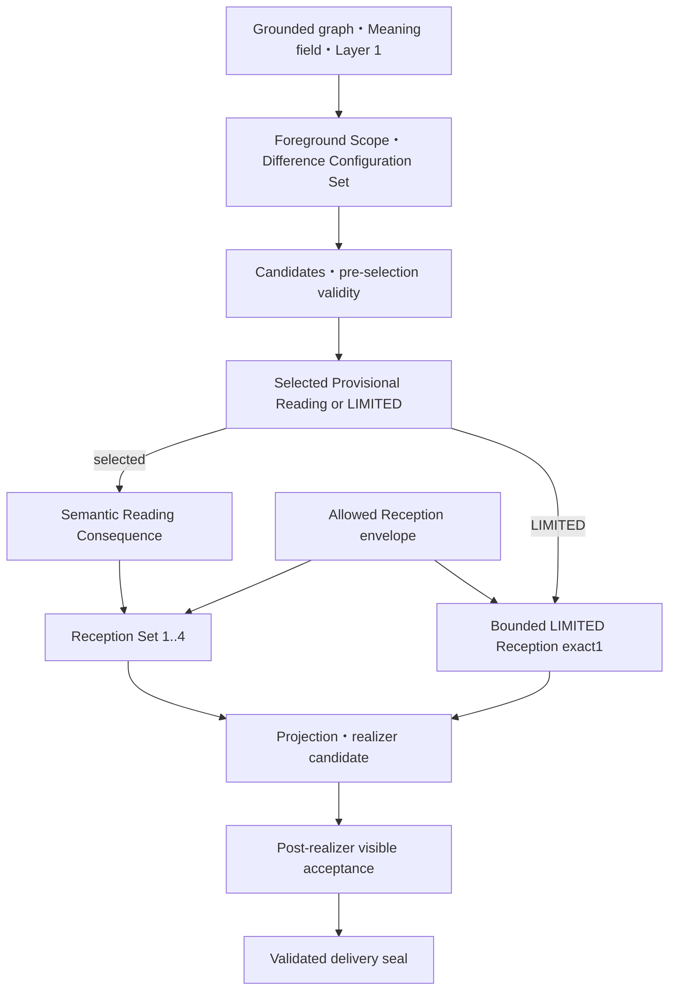

# Cocolon / CMEE Stage1
## Emlis入力差分保持型意味決定 — 華恋最終技術設計・実装順

| 項目 | 値 |
|---|---|
| Document ID | `Cocolon_CMEE_Stage1_Emlis_InputSpecificMeaningDecision_KarenDesigned_FinalTechnicalDesignAndImplementationOrder_20260828` |
| Date | `2026-08-28` |
| Status | `FINAL_CANONICAL_PRODUCT_DESIGN_CANDIDATE` |
| Design owner | `Karen` |
| 対象 | CMEE Stage1 Layer 2 / Emlisの入力固有意味決定 |
| Pro final product review target | intermediate revision SHA-256 `0bc64a78c2ce092dec1ca86fb91050402745c00ffaf1c2b198d2b83f5f0e1a51` |
| Pro final product review source | formal PASS record SHA-256 `7dbaf221244c840f376d49b978df4fdab375f1c4f7f7ff4cbcfc25be712d0cec` |
| Pro review result | `PASS` |
| Previous required corrections | `10 / 10 REFLECTED` |
| Canonical adoption | `READY_FOR_MASH_DECISION` |
| Revision state | `PRO_FINAL_PRODUCT_REVIEW_PASSED` |
| Technical handoff remaining | `EXACT0` |
| Implementation order | `IM00_IM10_EXACT11` |
| Implementation execution | `NOT_STARTED` |
| 実装・Product Read・activation・I09 | `EXACT0` |
| GitHub reflection authority / scope | `MASH_CURRENT_REQUEST_20260828 / COCOLON_DOCS_ONLY_EXACT4` |
| 外部AI・provider・network inference | `EXACT0` |
| Product / technical credit | `0 / 0` |
| Automatic progression | `false` |
| Mashへの追加質問 | `CURRENT_MASH_QUESTION_REQUIRED = FALSE` |
| System Context v1 | `FRESH_OWNER_RESOLVED` — PR #37 head `d5de2bd8945544a44b4ef3d10136010f88ce23ad` |
| System Context use | `DIRECT_CANONICAL_ORIGINAL_READ_USED` |
| System Context generated-output dependency | `EXACT0` |

---

## 0. 結論

必要なのは、まさに **「入力から安全に得られた構造のうち、今回Emlisが何を入力固有の意味として前景化するか」を決めるsole owner** である。

ただし、華恋の構造をそのまま複製するべきではない。華恋が行っている機能上の原則――複数の読みをすぐ一つへ潰さないこと、事実・解釈・不明を分けること、全体の関係を見て重要差分を選ぶこと、その選択に応じて応答姿勢を決めること――を、Emlis向けに **providerless・source-grounded・deterministic・監査可能** な構造へ明示化するのがより理想的である。

本書は、その構造を **Emlis入力差分保持型意味決定**（Difference-Preserving Input Meaning Decision）として設計する。

中心定義は次のとおり。

> 入力固有の意味とは、source-groundedなcomponent・endpoint・relation・direction・predicate・owner・modality・time・aspect・scope・qualifierのうち、識別性、入力全体の読みへの影響、Emlisの応答への影響をすべて持つ、最小十分なsemantic / pragmatic configurationである。

成立条件はexact3である。ただし循環を避けるため、1–2をpre-selection hard validity、3をselected reading後のpost-binding semantic acceptance＋post-realizer visible acceptanceとして段階化する。3が不成立でも別readingを選び直さず、named capability gapへ閉じる。

1. **Discriminative necessity**  
   必要なcomponent・relation・direction・qualifier等を失うと、materialに対照的な入力と区別できなくなる。
2. **Whole-reading consequence**  
   その差分が入力全体の読み方を実際に変える。付随情報だけを拾ったものではない。
3. **Emlis-response consequence**  
   そのreadingのsemantic consequenceが、Emlisが正直に述べられる注意、感情、考え、評価、距離または関係姿勢の少なくとも一つへ入力固有の差分を生む。

materialなrelationがある入力ではrelation propositionを使う。binary relationがなくても、`predicate + owner + modality / time / aspect / scope / qualifier` により対照差分が成立するqualified event / state propositionをprimary reading focusにできる。

意味的に同等な言い換えや、同じ関係構造を同じ限定で述べた入力は、同じoperationや正規化signatureになってよい。「入力固有」とは語句ごとに一意という意味ではなく、sourceが拘束するsemantic / pragmatic conditionを変える対照差分を潰さず、その差分がwhole readingとvisible Receptionを実際に変えるという意味である。

このreading focusを先に選び、その後にだけEmlisのReception、主観命題、日本語表現を導出する。`MATERIAL_WEIGHT`、`PROTECT_USER_AGENCY`、`CONCERN`、`RESPECT`などの一般的な態度を先に選び、そこから意味を逆算してはならない。

current design revisionに必要なMashの追加構造知識はexact0である。既存知識で、理解と事実、意図と出力、履歴・パターン・可能性、連続する変化、自己世界・現実世界・関係世界の必要区別は足りている。現在の残件はMashの思想不足ではなく、華恋側のEmlis technical mappingである。将来、actual product caseで具体的な未解決競合が初めて観測された場合だけ、別のMash判断候補にする。

### 0.1 Proレビュー exact10対応表

| # | Pro必須修正 | 本書の対応 |
|---|---|---|
| 1 | LIMITED通常観測でもLayer 2 exact1 | §4、§8.4、§9.1、§12、§13で`BoundedLimitedReception` exact1を必須化 |
| 2 | source provenanceとEmlis provisional readingの分離 | §2、§6.4、§8.4、§9.1で別field・別lineage化 |
| 3 | selected focus exact1とReception set 1..4の分離 | §2、§8.4、§9.1でprimary focus / supporting facets / Reception setを分離 |
| 4 | qualified event / stateの許容 | §0、§5、§6、§7、§12、§13へrelation以外の成立経路を追加 |
| 5 | compatible connected facetsの統合 | §5.5、§6.3、§8.3でprimary focus＋supporting facetsへ統合 |
| 6 | 入力固有意味の成立条件exact3 | §0、§6.4、§7、§12に識別性・whole-reading・Emlis-responseを固定 |
| 7 | positive subjective contribution exact1以上 | §7、§9.1–§9.2、§12で`AFFIRMATIVE_RECEPTION_CONTRIBUTION` exact1以上を必須化 |
| 8 | `NO_ABSTENTION_SUBSTITUTION` | §7、§12、§13でacceptance invariant化 |
| 9 | System Context表記の補正 | 冒頭metadataと参照節でfresh owner resolution＋canonical original direct readを記録 |
| 10 | Mash知識gap exact0のscope限定 | §0、§14、§18をcurrent design revision限定へ補正 |

### 0.2 Pro最終商品レビューとtechnical exact1の閉包

Pro最終商品レビューは、前回必須修正exact10がすべて反映され、設計方向を変更せず正典候補へ進める状態として`PASS`を返した。残件は設計の全面修正ではなく、technical handoff exact1とstatus更新だけであった。本最終版はそのexact1を次のexact3として閉じ、追加のmaterialな商品設計変更を行わない。

| 閉包項目 | 最終版の処理 | owner |
|---|---|---|
| Foreground Scope derivation | §5.2.1で許可basis exact5、禁止入力、compatible union、material competing、zero-object STOPをclosed contract化 | A. Source-grounded meaning field |
| whole-reading consequence | §6.4–§6.5でclosed code exact7、source＋Foreground Scope＋Required Difference binding、counterfactual発行条件を固定 | candidate evidence / B. ReadingConsequence |
| 型名・status・実装順 | `SubjectiveDepthClass`へ統一し、Pro PASS／Mash判断待ち／IM00–IM10 exact11へ更新 | 本書metadata・§9・§17 |

```text
PRO_FINAL_PRODUCT_REVIEW = PASS
PREVIOUS_REQUIRED_CORRECTIONS = 10_OF_10_REFLECTED
DESIGN_DIRECTION = APPROVED_UNCHANGED
CANONICAL_ADOPTION = READY_FOR_MASH_DECISION
REVISION_STATE = PRO_FINAL_PRODUCT_REVIEW_PASSED
TECHNICAL_HANDOFF_REMAINING = EXACT0
IMPLEMENTATION_ORDER = IM00_IM10_EXACT11
IMPLEMENTATION_EXECUTION = NOT_STARTED
PRODUCT_READ / ACTIVATION / I09 = 0 / 0 / 0
AUTOMATIC_PROGRESSION = false
```

保持する原則は、Required Difference、A / B / C分離、meaning-before-Reception、hard validity、source-grounded selection、generic fallback禁止、visible causal trace、Route A providerless-onlyである。今回のGitHub effectは本最終設計書と正典routingのCocolon docs-only exact4であり、runtime source、test、API、DB、RN、private generation、Product Read、activation、I09 effectはすべて0である。

---

## 1. この設計が必要になった確定事実

### 1.1 最新terminal

直近のRoute A v2検証は次で終端している。

| 判定主体 | 結果 |
|---|---|
| machine | `CLEAR` |
| Ultra technical review | `CLEAR` |
| Pro combined early language viability read | `COMMON_DEFECT` |
| Formal Mash Product Read | `NOT_RUN` / `PRODUCT_READ_EVALUATED=false` |
| defect class | `GENERIC_SUBJECTIVE_CONTENT` |
| cause component | `SUBJECTIVE_MEANING_PLANNER` |
| candidate acceptance | `false` |
| I09 | 未実行。次工程ではない |

したがって、今回の問題は日本語の格・活用・接続の失敗ではない。入力のどの意味をEmlisの主観として述べるかを決める上流層の不足である。

### 1.2 現行plannerの実態

現行 `project_subjective_meaning_plan()` は、利用可能なgrounded contributionから概ね次の固定順でfocusを取る。

`generic non-collapse → explicit cause → unfinished → action/change → non-collapse → residue → direction → change → burden → center`

そのfocusを、主として次の一般的なappraisalへ写像する。

- `RELATIONAL_NONCOLLAPSE / PRESERVE_BOTH_ENDPOINTS`
- `UNFINISHED_OPENNESS / LEAVE_UNFINISHED`
- `BOUNDED_CHANGE / RECOGNIZE_AS_BOUNDED`
- `AGENCY_BOUNDARY / RESPECT_CHOICE`
- `MATERIAL_WEIGHT / RECEIVE_AS_MATERIAL`

ここには「この入力の複数要素が、なぜこの組合せで一つの意味になるのか」を作る責務がない。source trace、owner、binding、日本語文法が正しくても、結果は「小さく扱わない」「一つにしない」「急いで決めない」「選択を守る」に寄りやすい。

また、既存 `SubjectiveSpecificity` の `RELATION_BOUND_MULTI_ROLE / MULTI_ROLE / SINGLE_ROLE` はbinding構造のspecificityであり、内容が別入力へ流用できないというsemantic specificityではない。

### 1.3 case-frame v2の責務

Typed Japanese Case-Frame Realizer v2は、既に決定されたtyped meaningを自然な日本語へ実現する下流consumerである。設計上もupstream meaning extractionを変更せず、新しい意味を所有しない。

よって、v2の **下流sole-owner境界とtyped case-frame方式** は保持する。今回の修正をcase frame、predicate key、surface templateだけへ押し込めてはならない。

ただし、現行registry bytesやsense inventoryが新しいreading focusをlosslessに可視化できるとは事前保証しない。既存inventoryへ投影すると `MATERIAL_WEIGHT` 等へ縮退する場合は `MEANING_REALIZATION_CAPABILITY_GAP` とし、fresh authorityなしにsurface inventoryを拡張せず、generic appraisalにもfallbackしない。

---

## 2. 「意味を決める」の境界

ここでEmlisが決めるのは、ユーザーの内面の真実ではない。入力に対する **Emlisの暫定的で訂正可能なreading** である。

責務をexact3へ分ける。

| 層 | 所有するもの | 所有しないもの |
|---|---|---|
| A. Source-grounded meaning field | Foreground Scope、Difference Configuration Set、入力から安全に保持できるnode、relation、qualified event/state、qualifier、unknown、複数候補 | Emlisの最終的なreading選択 |
| B. Selected Emlis Provisional Reading | primary reading focus exact1、supporting facets 0..4、semantic `ReadingConsequence` exact1 | ユーザーの真意、感情・stance、一般的人格推定、助言方針 |
| C. Meaning-bound Emlis Reception Set | BがEmlisの受け取り方へ生むrequest-localな主観命題1..4 | 入力から独立した一般的態度による意味の代用 |

**「決定」と呼ぶのはBのprimary reading focus exact1だけ** とする。Aは暫定構造であり、Bのsupporting facetsはprimaryとsource-connectedで競合しない補助差分、CはBから派生するReception setである。primaryとsupportingの合計は現行Observation上限に合わせて1..5に閉じ、無制限のfacet列挙を禁止する。

provenanceとreading statusは別の軸である。

```text
basis / relation provenance
  = SOURCE_EXPLICIT | RULE_ADMITTED_PROVISIONAL

selected Emlis reading status
  = EMLIS_PROVISIONAL_READING
```

source-explicitなのはbasisまたはrelationであり、Emlisが選ぶ中心readingそのものを `SOURCE_STATED` と呼んではならない。将来の `USER_CONFIRMED` は、ユーザーが明示確認した場合にだけ作る別lineageとし、本contractのstatusへ混ぜない。Bの `ReadingConsequence` はmeaning-sideのsemantic / pragmatic consequenceだけを持ち、affect、stance、allowed envelopeを持たない。

この分離により、次を同時に守る。

- user meaning sovereignty
- source/fact/inference/unknown partition
- Emlisの独立した話者性
- request-locality
- 訂正可能性
- no mind-reading
- no policy-only subjectivity

---

## 3. 華恋の構造から採るもの／採らないもの

### 3.1 採る機能原理

華恋の機能上の構造は、今回の用途では次のように要約できる。

1. 入力を一つの解釈へ直結させず、複数の暫定候補を保つ。
2. 誰の事実か、何が実際に起きたか、何が推測か、何がまだ不明かを分ける。
3. 単語や一文だけでなく、入力全体の対立、継続、変化、制約、未完了を見る。
4. 候補同士を比較し、入力中の差分を最も失わない読みを前景化する。
5. 前景化した意味に応じて、受け取り方と表現を決める。
6. 根拠が薄いときは深さを作らず、限定する。
7. 後続情報により訂正できる形で保持する。

これは華恋の非公開な思考過程や内部重みを複製するものではない。Emlisで必要な機能境界だけを、検証可能なcontractへ変換する。

### 3.2 そのまま複製しない理由

華恋は広い会話文脈、自然言語生成、暗黙の比較能力を持つ。一方、Emlis Stage1には次の制約がある。

- 入力sourceへ完全に辿れること
- request-localであること
- providerlessであること
- deterministicであること
- trace可能であること
- promotionとmind-readingを機械的に抑止できること
- disabled candidate検証とproduction activationを分離すること

したがって、華恋を模倣する曖昧な「考察器」を置くのではなく、華恋の判断原理を **差分、relation path、validity、abstention** として明示する方が理想的である。

---

## 4. 提案アーキテクチャ



現行 `build_subjective_planning_inputs` は、pre-meaningとpost-meaningへ分割する。現状のまま後ろへmeaning decisionを足すだけでは、既に選ばれたReception act、style、temperatureが意味選択へ逆流するためである。parallelな第二meaning ownerは作らない。

概念上の接続は次とする。

```python
semantic_inputs = build_premeaning_grounded_inputs(
    meaning_graph,
    meaning_field,
    layer1_contributions,
    admitted_relations,
    source_qualifiers,
    material_unknowns,
)

allowed_envelope = build_allowed_reception_opportunity_envelope(
    parent_allowed_acts,
    safety_boundaries,
)

grounded_view = derive_grounded_situation_view(semantic_inputs)
scope_derivation = derive_foreground_scope_closed(grounded_view)
outcome = None

if scope_derivation.state == "NO_SAFE_FOREGROUND_OBJECT":
    return STRUCTURE_INSUFFICIENT_STOP
elif scope_derivation.state == "COMPETING_MATERIAL_SCOPES":
    outcome = make_limited_competing_material_readings_outcome(
        scope_derivation.retained_foreground_source_object_refs,
        semantic_inputs.layer1_contributions,
        scope_derivation.unresolved_scope_refs,
    )
elif scope_derivation.state == "FOREGROUND_SCOPE_STRUCTURE_INSUFFICIENT":
    outcome = make_limited_structure_insufficient_outcome(
        semantic_inputs.layer1_contributions,
        scope_derivation.retained_foreground_source_object_refs,
        scope_derivation.missing_structure_refs,
    )
else:
    foreground_scope = scope_derivation.foreground_scope
    configuration_derivation = derive_difference_configuration(
        grounded_view,
        foreground_scope,
    )

    if configuration_derivation.state == "NO_FOREGROUND_OBJECT":
        return STRUCTURE_INSUFFICIENT_STOP
    elif configuration_derivation.state == "UPSTREAM_STRUCTURE_INSUFFICIENT":
        outcome = make_limited_structure_insufficient_outcome(
            foreground_scope,
            semantic_inputs.layer1_contributions,
            configuration_derivation.foreground_source_object_refs,
            configuration_derivation.missing_structure_refs,
        )
    elif configuration_derivation.state == "THIN_NO_SAFE_CONFIGURATION":
        outcome = make_limited_no_safe_configuration_outcome(
            foreground_scope,
            semantic_inputs.layer1_contributions,
            configuration_derivation.foreground_source_object_refs,
        )
    else:
        difference_configuration_set = (
            configuration_derivation.configuration_set
        )
        bundle_derivation = derive_requirement_bundle_set(
            difference_configuration_set,
        )
        if bundle_derivation.state == "UPSTREAM_STRUCTURE_INSUFFICIENT":
            outcome = make_limited_structure_insufficient_outcome(
                foreground_scope,
                semantic_inputs.layer1_contributions,
                configuration_derivation.foreground_source_object_refs,
                bundle_derivation.missing_structure_refs,
            )
        elif bundle_derivation.state == "NO_REQUIRED_DIFFERENCE":
            outcome = make_limited_no_safe_configuration_outcome(
                foreground_scope,
                semantic_inputs.layer1_contributions,
                configuration_derivation.foreground_source_object_refs,
            )
        else:
            requirement_bundle_set = bundle_derivation.bundle_set
            candidate_set = build_input_specific_meaning_candidates(
                difference_configuration_set,
                requirement_bundle_set,
            )
            outcome = select_input_specific_meaning(
                validate_preselection_candidates(candidate_set),
                difference_configuration_set,
                requirement_bundle_set,
            )

if outcome.is_limited:
    limited_reception = derive_bounded_limited_reception(
        outcome,
        semantic_inputs.layer1_contributions,
        allowed_envelope,
    )
    unsealed_inputs = build_unsealed_limited_projection_inputs(
        outcome,
        limited_reception,
    )
    projection_candidate = project_limited_subjective_plan_candidate(
        unsealed_inputs,
    )
    semantic_consequence_contract = None
    reception_contract = limited_reception
else:
    reading_consequence = derive_semantic_reading_consequence(
        outcome.selected_reading,
    )
    reception_set = derive_meaning_bound_reception_set(
        outcome.selected_reading,
        reading_consequence,
        allowed_envelope,
    )
    post_binding_acceptance = validate_response_consequence_binding(
        outcome.selected_reading,
        reading_consequence,
        reception_set,
    )
    if not post_binding_acceptance.accepted:
        return MEANING_RESPONSE_CONSEQUENCE_GAP
    unsealed_inputs = build_unsealed_subjective_projection_inputs(
        semantic_inputs,
        outcome.selected_reading,
        reading_consequence,
        reception_set,
    )
    projection_candidate = project_selected_reading_plan_candidate(
        unsealed_inputs,
    )
    semantic_consequence_contract = reading_consequence
    reception_contract = reception_set

surface_candidate = realize_subjective_surface_candidate(
    projection_candidate,
)
visible_acceptance = validate_postrealizer_visible_acceptance(
    outcome,
    semantic_consequence_contract,
    reception_contract,
    surface_candidate.surface_derivations,
    surface_candidate.visible_units,
)
if not visible_acceptance.accepted:
    return visible_acceptance.named_stop

subjective_plan = seal_validated_delivery_plan(
    projection_candidate,
    surface_candidate,
    visible_acceptance,
)
product_acceptance = derive_product_acceptance_disposition(
    outcome,
    visible_acceptance,
)  # UPSTREAM_STRUCTURE_CAPABILITY_GAP preserves product_acceptance=false
```

`GroundedHumanReceptionPlan`またはparent allowed actsは、最終Receptionではなくallowed opportunity envelopeとしてのみ保持する。このenvelopeは `GroundedSituationView`、Difference Configuration Set、Requirement Bundle Set、candidate builder、selectorの引数型から到達不能にし、selection outcome確定後のbindingへだけ渡す。selected readingへbindしたact subset、style、temperatureを確定した後に `projection_preimage_ref` を作る。

`PreMeaningGroundedInputs` はsemantic source、relation、qualifier、unknownだけを持ち、allowed act、style、temperature、affect、stanceを持たない。`AllowedReceptionOpportunityEnvelope` は逆にmeaning componentを選ぶmethodを持たない。この型分離をReception逆流のmachine invariantとする。

exact3のうちDiscriminative necessityとWhole-reading consequenceはpre-selectionで検証する。Emlis-response consequenceは、post-bindingでsemantic bindingを検証し、post-realizerでvisible差分を最終検証して閉じる。どちらのfailureでも別candidateへreselectしてはならない。`ReadingConsequence` はB側のsemantic / pragmatic consequenceだけを所有し、主観mode、affect、stanceはCまで導入しない。

LIMITED routeはderivation / selection outcomeを先に確定し、その後にだけ `BoundedLimitedReception` exact1をLayer 1 contributionとforeground source objectへbindする。これは深いselected readingの偽装ではなく、薄い入力を薄いまま受け取るfirst-class bounded laneである。正常なLIMITEDと `LIMITED_RECEPTION_CAPABILITY_GAP_STOP` を分け、Layer 2 exact0を正常成果として許容しない。

projection inputは `SelectedReadingProjectionInputs | LimitedProjectionInputs` のtagged unionとし、exhaustive dispatchする。selected laneは `project_selected_reading_plan_candidate`、LIMITED laneは `project_limited_subjective_plan_candidate` だけを呼ぶ。後者はselected reading fieldを受け取らない。既存 `project_subjective_meaning_plan` をorchestrator名として残す場合も、このdispatchだけを所有し、意味を固定優先順で発見しない。

---

## 5. Grounded Situation View

### 5.1 役割

既存の `GroundedMeaningGraph`、`InterpretationCandidatePool`、`EmlisMeaningField`、Layer 1 contributionを、意味候補生成が利用できる一つのrequest-local viewへ正規化する。

新しい事実や心理を追加する層ではない。既存source evidenceへ到達できない内容は一切入れない。

### 5.2 必須partition

| 軸 | 例 | 必須保持条件 |
|---|---|---|
| source world | self/internal、actual output/external、relationship/shared、unknown | world間を暗黙に同一化しない |
| epistemic | source-stated fact、source-stated interpretation、Emlis provisional reading、unknown | provisionalをfactへ昇格しない |
| temporal | before、current、after、continuing、unknown | before/afterと継続方向を反転しない |
| role | wish、intention、action、effort、constraint、change、residue、evaluation | 意図と実行、変化と評価を潰さない |
| relational | contrast、coexistence、cause/result、attempt/block、wish/constraint、action/change、preservation | endpointと方向を保持する |
| modality/polarity | actual、possible、uncertain、negated、not-generalized | 可能性をactualへ、限定を一般化へ変えない |

### 5.2.1 Foreground Scope closed derivation contract

Foreground Scopeは、入力固有meaningの候補を選ぶ第二selectorではない。後段が落としてはならないsource-connected objectのrequest-local unionを所有するだけであり、reading operation、Reception、主観mode、表現を順位付けしない。

scope basisは次のclosed exact5からだけ発行できる。

```python
ForegroundScopeBasisKind = Literal[
    "SOURCE_EXPLICIT_TARGET_TOPIC_OR_SCOPE",
    "LAYER1_REQUIRED_OBSERVATION_OBJECT",
    "EXISTING_REQUIRED_RETENTION_DUTY",
    "SOURCE_CONNECTED_RELATION",
    "MATERIAL_UNKNOWN_OR_REQUIRED_QUALIFIER",
]

class ForegroundScopeBasisRow:
    schema_version: Literal["1.0"]
    basis_kind: ForegroundScopeBasisKind
    scope_object_refs: tuple[str, ...]  # exact1+
    source_object_refs: tuple[str, ...]  # exact1+
    source_evidence_refs: tuple[str, ...]  # exact1+
    layer1_required_object_refs: tuple[str, ...]
    required_retention_duty_refs: tuple[str, ...]
    source_connected_relation_refs: tuple[str, ...]
    material_unknown_refs: tuple[str, ...]
    required_qualifier_refs: tuple[str, ...]
    owner_refs: tuple[str, ...]
    world_refs: tuple[str, ...]
    epistemic_state_refs: tuple[str, ...]
    time_refs: tuple[str, ...]
    aspect_refs: tuple[str, ...]
    modality_refs: tuple[str, ...]
    polarity_refs: tuple[str, ...]
    scope_refs: tuple[str, ...]

class ForegroundScope:
    schema_version: Literal["1.0"]
    scope_id: str
    integrated_scope_object_refs: tuple[str, ...]  # exact1+
    basis_row_refs: tuple[str, ...]  # exact1+
    source_connected_relation_refs: tuple[str, ...]
    required_retention_duty_refs: tuple[str, ...]
    material_unknown_refs: tuple[str, ...]
    required_qualifier_refs: tuple[str, ...]
    source_evidence_refs: tuple[str, ...]  # exact1+

class ForegroundScopeDerivation:
    schema_version: Literal["1.0"]
    state: Literal[
        "FOREGROUND_SCOPE_AVAILABLE",
        "COMPETING_MATERIAL_SCOPES",
        "FOREGROUND_SCOPE_STRUCTURE_INSUFFICIENT",
        "NO_SAFE_FOREGROUND_OBJECT",
    ]
    foreground_scope: ForegroundScope | None
    retained_foreground_source_object_refs: tuple[str, ...]
    unresolved_scope_refs: tuple[str, ...]
    missing_structure_refs: tuple[str, ...]
    derivation_evidence_refs: tuple[str, ...]
```

`SOURCE_CONNECTED_RELATION`に許可するrelation kindは、sourceへ到達するcontrast、coexistence、continuation、correctionのexact4だけである。各basis rowはsource evidence exact1以上へ到達し、許可kindに対応するfieldをexact1以上持つ。optional fieldの多さは順位にならない。

aggregationは自由な`material`判定を置かず、次へ閉じる。scope objectが同一でもこの判定を省略しない。

1. 全admitted basis rowを、owner、world、epistemic、time、aspect、modality、polarity、scope、required qualifier、unknownのtyped compatibility exact10でpairwise比較する。
2. 各axisは、同一typed value、またはcontrast／coexistence／continuation／correction exact4のsource-connected relationが両valueを別値のまま保持する場合だけcompatibleとする。unknownはunknownのまま保持し、knownへpromotionして両立させない。correctionは方向とbefore／afterを保持し、旧値を現値へ上書きして両立させない。
3. distinct objectのrowは、exact10 compatibilityに加えてexact4のsource-connected relationが必要である。同一objectのrowもexact10をすべて満たす必要がある。
4. 全admitted rowがpairwise compatibleなら、全rowを一つの`ForegroundScope`へcanonical set unionする。first-match、score、任意truncate、固定category優先を持たない。
5. owner、world、epistemic、time、aspect、modality、polarity、scope、required qualifier、unknownのexact10いずれかのtyped slotに異なる値があり、exact4 relationで別値の保持を証明できない場合はtyped conflictとする。admitted basisはすべてsource-explicit、Layer 1 `REQUIRED`、既存`REQUIRED` dutyまたは保持必須unknown／qualifierなので、追加scoreなしにmaterial conflictとなり、`COMPETING_MATERIAL_SCOPES`から`LIMITED_COMPETING_MATERIAL_READINGS`へ送る。
6. 安全なsource objectがexact1以上あるが、exact10判定に必要なtyped field、またはdistinct object間のrequired relationが欠ける場合は`FOREGROUND_SCOPE_STRUCTURE_INSUFFICIENT`とし、`LIMITED_STRUCTURE_INSUFFICIENT`へ送る。欠落を競合やthin inputへ変換しない。
7. `NO_SAFE_FOREGROUND_OBJECT`とSTOPは、安全に保持できるforeground source objectがexact0の場合だけ許す。

次はbasis、aggregation、競合解消のいずれにも使用禁止であり、型から到達不能にする。

- Reception act、allowed Reception envelope
- affect、stance、style、temperature、subjective mode
- `unfinished / direction / burden / agency / material`等の固定category priority
- 日本語surface、surface token、raw token position
- fixture ID、case ID、hash、列挙順、request-local/internal ID

IDは参照整合性とtraceにだけ使い、scopeの採否・中心・順序には使わない。Foreground Scopeは`SelectedEmlisProvisionalReading`ではなく、後段のDifference Configurationが必ず保持する対象集合である。

### 5.3 Difference ConfigurationとRequired Difference Row

まずclosed sourceから観測差分を機械的に作り、そのうちclosed invariantを壊すものだけをrequiredへ昇格する。`material`を自由判断するselectorは置かない。binary relationのない入力を一律に捨てないため、configurationはclosed unionにする。

```python
class RelationalConfiguration:
    configuration_id: str
    endpoint_component_refs: tuple[str, ...]  # 2..5
    relation_path_refs: tuple[str, ...]
    direction_rows: tuple[RelationDirectionRow, ...]
    source_qualifier_refs: tuple[str, ...]
    source_evidence_refs: tuple[str, ...]

class QualifiedEventStateConfiguration:
    configuration_id: str
    predicate_ref: str
    owner_ref: str
    modality_refs: tuple[str, ...]
    time_refs: tuple[str, ...]
    aspect_refs: tuple[str, ...]
    scope_refs: tuple[str, ...]
    qualifier_refs: tuple[str, ...]
    source_evidence_refs: tuple[str, ...]

DifferenceConfiguration = (
    RelationalConfiguration | QualifiedEventStateConfiguration
)

class DifferenceConfigurationSet:
    foreground_scope_ref: str
    configuration_refs: tuple[str, ...]  # 1..5
    source_evidence_refs: tuple[str, ...]

class DifferenceConfigurationDerivation:
    state: Literal[
        "CONFIGURATION_SET_AVAILABLE",
        "THIN_NO_SAFE_CONFIGURATION",
        "UPSTREAM_STRUCTURE_INSUFFICIENT",
        "NO_FOREGROUND_OBJECT",
    ]
    configuration_set: DifferenceConfigurationSet | None
    foreground_source_object_refs: tuple[str, ...]
    missing_structure_refs: tuple[str, ...]
    derivation_evidence_refs: tuple[str, ...]

class ObservedDistinctionRow:
    distinction_id: str
    configuration_ref: str
    axis: DifferenceAxis
    contrasted_component_refs: tuple[str, ...]
    source_qualifier_refs: tuple[str, ...]
    source_evidence_refs: tuple[str, ...]

class RequiredDifferenceRow:
    difference_id: str
    observed_distinction_ref: str
    invariant_codes: tuple[DifferenceInvariantCode, ...]
    retention_duty_refs: tuple[str, ...]
    counterfactual_mutation_ref: str  # exact1
```

主なaxisは次とする。

- `INTENTION_VS_OUTPUT`
- `INTERNAL_VS_EXTERNAL`
- `BEFORE_VS_AFTER`
- `HISTORY_VS_PATTERN_VS_POSSIBILITY`
- `WISH_VS_CONSTRAINT`
- `ACTION_VS_RESIDUE`
- `CHANGE_VS_GENERALIZATION`
- `FACT_VS_INTERPRETATION`
- `RESOLVED_VS_UNRESOLVED`
- `ENDPOINT_A_VS_ENDPOINT_B`

このrowが、後段の「何を保持しなければgenericになるか」を入力ごとに定義する。

### 5.4 required rowの導出規則

Observed rowの導出元はexact5に閉じる。

1. admitted binary relationのendpoint＋direction
2. source-boundな `predicate + owner` と、modality／time／aspect／scope／qualifierのexact1以上からなるqualified event / state
3. 同一relation pathまたは同一qualified event / state上で異なるworld／role／temporal／epistemic axis
4. component、relationまたはpredicateへbindしたpolarity／modality／time／scope／non-generalization qualifier
5. component、relationまたはpredicateへbind済みのmaterial unknown

Observed rowを一つずつcounterfactual mutationし、次のclosed invariantのexact1以上を壊す場合だけ `RequiredDifferenceRow` にする。

```text
ENDPOINT_COLLAPSE
DIRECTION_REVERSAL
WORLD_COLLAPSE
ROLE_COLLAPSE
TEMPORAL_COLLAPSE
POLARITY_REVERSAL
MODALITY_PROMOTION
UNKNOWN_ERASURE
EXPLICIT_LIMIT_ERASURE
REQUIRED_RETENTION_ERASURE
```

counterfactual mutationはendpoint削除、左右交換、predicateまたはowner削除、world／role／time置換、modality／aspect／scope／qualifier削除、unknown promotionのclosed setとする。各`RequiredDifferenceRow`は、そのrowをrequiredにしたmutation exact1を`counterfactual_mutation_ref`として所有する。どのinvariantも壊さない差分はrequired rowにしない。source-explicit correction、conclusion、contrast、refusal等の既存retention dutyが`REQUIRED`なら `REQUIRED_RETENTION_ERASURE` で残す。

`REQUIRED_RETENTION_ERASURE` のownerはsource／observation／MeaningField retention dutyのallowlistに限定する。Reception act、style、temperature、affect、value policy由来のretentionはmeaning-side required rowへ入れない。

語の珍しさ、文の長さ、感情強度、Reception opportunity、surface form、自由記述のloss effectは導出根拠にできない。

### 5.5 過剰summaryの防止

全required rowを一つの巨大なmeaningへ詰め込まない。`RequirementBundle` のanchorは、`RelationalConfiguration | QualifiedEventStateConfiguration` exact1である。anchor、そのendpointまたはpredicate＋owner、scoped qualifier、およびclosed invariantを保つために必要なsource-connected pathだけから機械的に作る。

```python
class RequirementBundle:
    bundle_id: str
    foreground_scope_ref: str
    anchor_configuration_ref: str  # exact1
    adjacent_configuration_refs: tuple[str, ...]  # 0..4
    required_difference_refs: tuple[str, ...]  # exact1+
    retention_duty_refs: tuple[str, ...]

class RequirementBundleSet:
    foreground_scope_ref: str
    bundle_refs: tuple[str, ...]  # 1..5

class RequirementBundleDerivation:
    state: Literal[
        "BUNDLE_SET_AVAILABLE",
        "NO_REQUIRED_DIFFERENCE",
        "UPSTREAM_STRUCTURE_INSUFFICIENT",
    ]
    bundle_set: RequirementBundleSet | None
    missing_structure_refs: tuple[str, ...]
    derivation_evidence_refs: tuple[str, ...]
```

`DifferenceConfigurationDerivation` と `RequirementBundleDerivation` はempty setの有無ではなく、closed stateで欠如理由を所有する。

- `*_AVAILABLE`: 対応setは1..5、`missing_structure_refs` はexact0。
- `THIN_NO_SAFE_CONFIGURATION`: configuration setはnone、foreground source object exact1以上、missing structure exact0、relation-rich／qualified／connected retention evidence exact0。
- `NO_REQUIRED_DIFFERENCE`: configuration setは存在するがrequired difference exact0、missing structure exact0。
- `UPSTREAM_STRUCTURE_INSUFFICIENT`: foreground source object exact1以上かつmissing endpoint／relation／predicate／owner／qualifier ref exact1以上。thin inputとして扱わない。
- `NO_FOREGROUND_OBJECT`: foreground source object exact0。accepted LIMITEDへ進めない。

availableな `DifferenceConfigurationSet` からavailableな `RequirementBundleSet` を作り、candidate builderとselectorはこのbounded setをend-to-endで消費する。単数unionは各configurationのvariantを表し、setはcompatible aggregationとactual conflict判定の単位を表す。candidateが成立するlaneではbasis configurationとrequirement bundleを各1..5要求する。unknown state、stateとcardinalityの不一致、欠如理由の自由記述fallbackはvalidator rejectとする。

- candidateのcoverageは全入力のrow総数ではなく、一つのbundle内で比較する。
- source graph上で接続されないbundleを、新しい因果や心理で結合しない。
- optional contributionを加えてもcandidateは優位にならない。
- 同じsource-constrained semantic / pragmatic conditionを保つなら、node・relation・仮定が少ないcandidateを残す。
- compatibleなbundleは、次のexact4をすべて満たす場合だけaggregate exact1へまとめる: 同じforeground scope / center、owner assignmentが一致またはtypedに両立、source-connectedなrelation / temporal path、source-explicitなcontrast・coexistence・continuation・correctionのallowlist関係。
- aggregateはprimary focus exact1＋supporting facets 0..4とし、primaryとsupportingの合計を1..5へ閉じる。power set、任意長path、ID／hash／列挙順によるprimary選択は禁止する。
- pairwise conflictがexact1でもあればaggregateせず、actual competing alternativesとして `LIMITED_COMPETING_MATERIAL_READINGS` とする。

これにより、現行fixed focusを曖昧な`material`判断へ移し替えるだけの再設計を禁止する。

---

## 6. Input-Specific Meaning Candidate

### 6.1 候補はcategoryではなくconfiguration命題

候補は `BURDEN`、`AGENCY`、`UNFINISHED` のような一語categoryでは成立しない。relational configurationまたはqualified event / state configurationとして、少なくとも次を保持する。

- relational laneでは、何と何の関係か、向きは何か。
- qualified event / state laneでは、predicateとownerは何か、どのmodality／time／aspect／scope／qualifierが入力固有差分を作るか。
- どの変化、制約、継続、未完了が重要か。
- どの限定とunknownを残すか。
- どのcomponent・relation・predicate・qualifierを失うとsource-constrained semantic / pragmatic conditionが変わるか。

### 6.2 Reading operation

meaning candidateは、少数の一般operationと入力固有argumentの組合せで構成する。operation単独は意味として認めない。

| operation | 機能 | 成立に必要なもの |
|---|---|---|
| `KEEP_DISTINCT` | 異なるworld、role、epistemic stateを同一化しない | materialな差分exact1以上 |
| `HOLD_RELATION` | 複数endpointとその有向relationを一つの意味単位として保持 | endpoint exact2以上＋admitted relation |
| `TRACK_TRANSITION` | before/current/afterの変化を方向付きで読む | temporal endpoint＋transition |
| `NOTICE_PERSISTENCE` | actionやchange後にも残る意図・感情・constraintを読む | earlier event＋continuing residue |
| `RECOGNIZE_BOUNDED_ACTUALITY` | actualな変化を認めつつ範囲・非一般化を保持 | actual change＋limiting qualifier |
| `HOLD_UNRESOLVED` | 既実行と未解決、複数可能性、unknownを同時保持 | actual component＋material unresolved component |
| `HOLD_QUALIFIED_EVENT_STATE` | binary relationなしでも限定されたevent / stateを入力固有のreading focusとして保持 | source-bound predicate＋owner＋modality／time／aspect／scope／qualifier exact1以上 |

たとえば `HOLD_RELATION` だけならgenericである。`HOLD_RELATION(continuation_intention_ref, uncertain_self_reported_overextension_ref, contrast_ref, current_ref)` のように、必要なendpoint・方向・限定が揃って初めて候補になる。

qualified event / stateも安全に成立せず、単一の無限定nodeしか得られない場合は、`CONTACT`を仮の深い意味にせず、後述の `LIMITED_NO_SAFE_INPUT_SPECIFIC_CONFIGURATION` へ送る。

### 6.3 候補生成

候補は次の順で、providerlessに列挙する。

1. `RequirementBundle`ごと、適用可能operationごと、basis epistemic tierごとにcanonical candidate exact1を作る。
2. relational laneではbefore/after、action/change、wish/constraint、actual/residueなどの既存typed relation pathを保持する。
3. qualified event / state laneではpredicate＋ownerを必須とし、modality／time／aspect／scope／qualifierの入力固有差分を保持する。
4. §5.5のclosed exact4を満たすcompatible connected bundleだけをaggregate exact1へ統合し、primary focus exact1＋supporting facets 0..4にする。
5. source qualifier、negation、modality、unknownを候補へbindingする。
6. nodeとedgeはcandidate内で各exact1回まで使い、同じedgeを再走査しない。
7. canonical semantic signatureでdedupeし、列挙順をselection根拠にしない。
8. disconnected component同士を新しい因果や心理で接続しない。
9. competing alternativesを一つのsummaryへ統合せず `LIMITED` とする。

Reading operationはexact7、basis epistemic tierはexact2なので、candidate cardinality上限は `RequirementBundle count × 7 × 2` とする。bundle当たり最大exact14を超えた場合は `CANDIDATE_CARDINALITY_OVERFLOW` へ閉じる。power setや任意長pathの列挙は禁止する。

同じbundle・operation・tierにmaterialに異なるargument bindingが複数ある場合、列挙順やIDでcanonical exact1を作らない。§5.5のclosed aggregation条件を満たせばprimary＋supportingへ統合し、満たさない場合は `LIMITED_COMPETING_MATERIAL_READINGS` とする。

raw text、fixture ID、case mode、surface token、hash、provider出力をcandidate selectorへ使ってはならない。

### 6.4 契約案

```python
class InputSpecificMeaningCandidate:
    schema_version: Literal["1.0"]
    candidate_id: str
    reading_operation: MeaningReadingOperation
    basis_contribution_refs: tuple[str, ...]
    basis_configuration_refs: tuple[str, ...]  # 1..5
    requirement_bundle_refs: tuple[str, ...]  # 1..5
    primary_component_refs: tuple[str, ...]
    relation_path_refs: tuple[str, ...]
    qualified_event_state_refs: tuple[str, ...]
    basis_provenance_rows: tuple[BasisProvenanceRow, ...]
    basis_epistemic_tier: Literal[
        "SOURCE_EXPLICIT",
        "RULE_ADMITTED_PROVISIONAL",
    ]
    basis_derivation_refs: tuple[str, ...]
    source_qualifier_refs: tuple[str, ...]
    preserved_difference_refs: tuple[str, ...]
    material_unknown_refs: tuple[str, ...]
    forbidden_promotion_codes: tuple[str, ...]
    forbidden_semantic_collapse_refs: tuple[str, ...]
    semantic_loss_codes: tuple[SemanticLossCode, ...]
    input_specificity_evidence_ref: str  # exact1
    emlis_reading_status: Literal["EMLIS_PROVISIONAL_READING"]
    semantic_signature: MeaningSemanticSignature

class InputSpecificityEvidence:
    candidate_ref: str  # exact1
    foreground_scope_ref: str  # exact1
    required_difference_refs: tuple[str, ...]  # exact1+
    discriminative_necessity_refs: tuple[str, ...]  # exact1+
    whole_reading_consequence_refs: tuple[str, ...]  # WholeReadingConsequenceRow refs, exact1+

class ReadingConsequence:
    selected_reading_ref: str
    input_specificity_evidence_ref: str  # exact1
    whole_reading_consequence_refs: tuple[str, ...]  # exact1+
    changed_whole_reading_codes: tuple[WholeReadingConsequenceCode, ...]  # exact1+
    response_consequence_requirement_codes: tuple[str, ...]  # exact1+
    source_constraint_refs: tuple[str, ...]  # exact1+
```

`semantic_signature` は表層文ではなく、operation、component role、relation direction、epistemic state、temporal state、qualifier、および `component_semantic_keys` を正規化した構造値とする。

各 `component_semantic_key` はtyped predicate、semantic kind、owner、scope、roleを保持する。request-local IDやraw textだけには依存しない。content-bearing keyを安全に作れないcomponent同士はsemantic-equivalentとしてdedupeせず、material tieならLIMITEDへ閉じる。

candidateの `requirement_bundle_refs` は、selectorへ渡された同一 `RequirementBundleSet.bundle_refs` のsubsetでなければならない。各 `basis_configuration_ref` は、参照bundleの `anchor_configuration_ref | adjacent_configuration_refs` から到達でき、各参照bundleの全 `required_difference_refs` をcandidateの `preserved_difference_refs` が覆わなければならない。configurationの重なりからbundle IDを後算出してはならない。

candidate contractはReception、affect、stanceを一切持たない。`forbidden_semantic_collapse_refs` は「このendpoint、predicateまたは限定を落とすと別のsource-constrained semantic / pragmatic conditionになる」というmeaning側の制約であり、応答方針ではない。Receptionはexact1 selectionの後にだけ生成する。

`basis_provenance_rows` はcomponentのsource reachabilityとは別に、relation bridgeまたはqualified event / state basisの根拠を一件ずつ持つ。全basisが `SOURCE_EXPLICIT` の場合だけcandidate tierを `SOURCE_EXPLICIT` とし、provisional basisがexact1以上あればcandidate全体を `RULE_ADMITTED_PROVISIONAL` とする。どちらの場合もselected readingはEmlisによる選択なので、`emlis_reading_status=EMLIS_PROVISIONAL_READING` に固定する。source-explicit basisの強さとreading ownershipを一つのfieldに潰さない。

`InputSpecificMeaningCandidate.input_specificity_evidence_ref`はcandidate exact1へback-bindする`InputSpecificityEvidence` exact1だけを参照する。evidenceの`foreground_scope_ref`はcandidateのRequirement Bundle Setと同じscope、`required_difference_refs`はcandidateの`preserved_difference_refs`のsubsetでなければならない。`InputSpecificityEvidence` のexact2はpre-selection hard validityである。

`ReadingConsequence` はselection後にBが作るsemantic / pragmatic consequenceであり、affect、stance、主観modeを持たない。`input_specificity_evidence_ref`はselected candidateの同fieldと完全一致し、`whole_reading_consequence_refs`もそのevidenceの参照setと完全一致する。post-binding validatorはこのconsequenceとCのReception propositionのsemantic bindingを検証し、post-realizer validatorは `SurfaceDerivation` とvisible unitへのmaterialな差分を検証する。この二段で成立条件exact3を閉じ、どちらのFAIL時も別candidateへreselectしない。

### 6.5 Whole-reading consequence closed derivation

`whole_reading_consequence_refs`と`changed_whole_reading_codes`は自由記述や期待Receptionへの参照ではなく、次のclosed exact7だけを使う。

```python
WholeReadingConsequenceCode = Literal[
    "INPUT_CENTER_CHANGED",
    "RELATION_STRUCTURE_CHANGED",
    "TEMPORAL_FLOW_CHANGED",
    "RESOLUTION_TREATMENT_CHANGED",
    "WORLD_OR_OWNER_DISTINCTION_CHANGED",
    "MODALITY_POLARITY_OR_LIMITATION_CHANGED",
    "EPISODICITY_BOUNDARY_CHANGED",
]

class WholeReadingConsequenceRow:
    schema_version: Literal["1.0"]
    consequence_id: str
    consequence_code: WholeReadingConsequenceCode
    foreground_scope_ref: str
    required_difference_ref: str  # exact1
    source_evidence_refs: tuple[str, ...]  # exact1+
    counterfactual_mutation_ref: str  # exact1
    baseline_semantic_signature: MeaningSemanticSignature
    mutated_semantic_signature: MeaningSemanticSignature
```

codeの意味は次へ閉じる。

| code | closed consequence |
|---|---|
| `INPUT_CENTER_CHANGED` | 入力の中心となる対象・命題が別になる |
| `RELATION_STRUCTURE_CHANGED` | endpoint、relation kindまたはdirectionが変わる |
| `TEMPORAL_FLOW_CHANGED` | before／current／after、継続または遷移の読みが変わる |
| `RESOLUTION_TREATMENT_CHANGED` | resolved／unresolvedの扱いが変わる |
| `WORLD_OR_OWNER_DISTINCTION_CHANGED` | internal／external／relationship worldまたはowner区別が変わる |
| `MODALITY_POLARITY_OR_LIMITATION_CHANGED` | possibility、negation、scope、限定または非一般化が変わる |
| `EPISODICITY_BOUNDARY_CHANGED` | one-off eventとgeneral patternの境界が変わる |

発行手順はclosed exact6である。

1. 同じ`ForegroundScope`内で、`RequiredDifferenceRow.counterfactual_mutation_ref` exact1を適用する。
2. `baseline_semantic_signature`は当該candidateの`semantic_signature`と完全一致させる。`mutated_semantic_signature`は、そのbaselineへ参照differenceが所有するmutation exact1だけを適用した結果とし、別mutation、Receptionまたは表現差分を混ぜない。
3. exact7の構造差分がexact1以上ある場合だけ`WholeReadingConsequenceRow`を発行する。
4. 各rowは`ForegroundScope` exact1、`RequiredDifferenceRow` exact1、source evidence exact1以上へbindし、rowの`counterfactual_mutation_ref`は参照differenceのowned refと完全一致する。
5. candidateが参照する`InputSpecificityEvidence.whole_reading_consequence_refs`は、そのcandidateが保持するrequired differenceへbindしたrowだけを参照し、exact1以上を要求する。
6. selected `ReadingConsequence.input_specificity_evidence_ref`はselected candidateのevidence exact1と一致し、`whole_reading_consequence_refs`はそのevidenceの参照setと完全一致する。`changed_whole_reading_codes`は参照rowの`consequence_code`をcanonical dedupeしたsetと完全一致させ、ref／codeの追加・欠落・任意順依存を許さない。

発行根拠として禁止するのは、自由記述、期待Reception、Reception act、allowed envelope、affect、stance、style、temperature、日本語surface／token、fixture／case ID、hash、列挙順、内部IDである。`response_consequence_requirement_codes`はselected reading後のReception binding要求であり、whole-reading rowを逆向きに生成できない。

required differenceのmutationを行ってもclosed codeがexact0の場合、そのdifferenceはwhole-reading consequenceを持たない。候補はpre-selection hard validityでrejectし、一般的な態度や表現差分を後付けして合格させない。

---

## 7. Hard validity

### 7.1 pre-selection hard validity

候補はscore以前に、次をすべて満たさなければならない。

1. **Component reachability**: 全component、predicate、qualifier、unknownが既存evidenceへ到達する。
2. **Basis provenance**: bridgeまたはqualified event / state basis exact1ごとに `SOURCE_EXPLICIT` または許可済みrule derivation refがある。
3. **Owner correctness**: actor、experiencer、speaker、evaluation ownerを入れ替えない。
4. **Configuration completeness**: relational laneは必要endpoint＋directionを、qualified event / state laneはpredicate＋owner＋差分を作るmodality／time／aspect／scope／qualifier exact1以上を保持する。
5. **Direction correctness**: cause/result、attempt/block、wish/constraint、before/afterを反転しない。
6. **Polarity/modality/time correctness**: 否定、可能性、限定、時制を昇格させない。
7. **Bundle satisfaction**: target `RequirementBundle` の全 `RequiredDifferenceRow` を覆う。部分coverageはranking対象にせずrejectする。
8. **No invented bridge**: disconnected component間へ未根拠の因果、人格、動機を作らない。
9. **No policy-only meaning**: agency保護、安全、丁寧さ、結論を急がない等の方針だけで意味成立としない。
10. **No generic affect substitution**: `CONCERN / RESPECT / RELIEF`だけで入力固有性を代用しない。
11. **Discriminative necessity**: required counterfactual mutationで完全semantic signatureがmaterialに変わる。
12. **Whole-reading consequence**: §6.5の`WholeReadingConsequenceRow` exact1以上が、同じForeground Scope、candidateが保持するRequired Difference、source evidenceへbindし、closed counterfactualで入力全体の読みを変える。付随情報の抜き出しや期待Receptionだけではない。

### 7.2 post-binding acceptance

normal selected reading確定後にだけ、次を検証する。

1. **Emlis-response semantic consequence**: `ReadingConsequence` とReception propositionの間にsource-constrainedでmaterialなsemantic bindingがある。
2. **Reception cardinality**: SubjectiveDepthClassに従う1..4である。
3. **AFFIRMATIVE_RECEPTION_CONTRIBUTION exact1+**: attention、feeling、thought、appraisal、distanceまたはrelational stanceとして「Emlisが何として受け取ったか」を述べる主観寄与がexact1以上ある。
4. **Counterposition non-substitution**: `BOUNDED_COUNTERPOSITION` はoptionalであり、単独ではReceptionを完成させない。
5. **No response-to-meaning backflow**: acceptance failureで別readingへreselectしない。

`AFFIRMATIVE` は肯定的な感情価を意味しない。source自体が否定、拒否、迷いを含む場合も、その否定等をEmlisが何として受け取ったかを正に記述するという構造上の名称である。

LIMITEDはselected-laneの `validate_response_consequence_binding` へ入らない。derivation / selection outcome確定後の `BoundedLimitedReception` constructor invariantとしてFOCUSED exact1、affirmative exact1、Layer 1 / foreground source object binding exact1以上を検証し、その後はnormal laneと共通のpost-realizer visible gateへ進む。

### 7.3 post-realizer visible acceptance

projectionとrealizerがcandidate artifactを作った後、seal前に次をすべて検証する。

1. **Surface evidence availability**: `SurfaceDerivation` とvisible unitがvalidatorへ渡されている。
2. **Meaning-side visible contribution**: 全required differenceがreading／Layer 1側のvisible traceへ到達する。
3. **Reception-side visible contribution**: 各Reception propositionが入力固有のLayer 2 visible unitへ到達する。
4. **No trace-only specificity**: private refだけが固有でsurfaceがgeneric appraisalへcollapseしていない。
5. **Many-to-one natural density**: artifact-level coverageを守り、rowごとの過密文を強制しない。

post-realizer failureでも別readingへreselectせず、`MEANING_REALIZATION_CAUSAL_TRACE_GAP`または該当するnamed capability STOPへ閉じる。visible acceptanceを通る前にvalidated delivery sealを作ってはならない。delivery sealとProduct acceptance dispositionは別fieldとし、`UPSTREAM_STRUCTURE_CAPABILITY_GAP`はbounded deliveryが成立してもProduct acceptance falseを保持する。

全laneに `NO_ABSTENTION_SUBSTITUTION` をhard invariantとして課す。relation-rich入力、qualified event / state、compatible connected multi-facet入力を、選択が難しいという理由だけで薄いLIMITED laneへ落としてはならない。thin-input LIMITEDのsource-bound response-object keyを、rich inputの `literal + generic appraisal` 合格へ再利用することも禁止する。

pre-selection hard validityを満たすcandidateがなければ、汎用appraisalへfallbackしない。closed stateがgenuine thinを示す場合だけfirst-class LIMITEDへ進む。upstream構造不足はbounded deliveryを許してもProduct acceptance falseのnamed capability gap、Reception／visible realization不足はnamed STOPへ閉じる。

---

## 8. Deterministic source-grounded selection

### 8.1 固定kind優先を廃止する

`unfinished`が常に`change`より上、`direction`が常に`burden`より上、というglobal priorityは持たない。優先されるのはcategoryではなく、今回の入力で必要な差分を最も失わない候補である。

### 8.2 選択順

hard-valid候補に対し、次を辞書式に適用する。加重scoreは使わない。

まずbasis provenance tierをpartitionする。同じbundleを必要十分に覆う `SOURCE_EXPLICIT` candidateがexact1以上あれば、その集合内だけで選ぶ。`RULE_ADMITTED_PROVISIONAL` は、source-explicit candidateではbundleを成立させられず、全derivation ruleが許可済みの場合だけ候補集合へ入れる。coverage量の多いprovisional candidateが、狭いsource-explicit candidateを追い越してはならない。どちらのtierを選んでも、selected reading statusは `EMLIS_PROVISIONAL_READING` である。

1. **bundle satisfaction**: 全required rowを覆う候補だけを残す。coverage量による加点はしない。
2. **required retention preservation**: source-explicit scopeと既存`REQUIRED` retention dutyを保つ。
3. **bundle connectivity**: required componentを、発明なしで一つのconfigurationへ結ぶ。
4. **epistemic conservatism**: fact、interpretation、unknownを最少promotionで保持する。
5. **contrastive semantic necessity**: required counterfactual mutationにより、candidateの完全なsemantic signatureが変わる。
6. **minimal sufficiency**: 上記が同じなら、provisional edge、不要component、仮定が最少の候補を取る。

### 8.3 tie

- semantic signatureが同値なtieは、canonical stable keyでexact1へ正規化してよい。
- 同じforeground scope / center、両立するowner、source-connected path、source-explicitなallowlist関係をすべて持つbundleは競合ではない。primary focus exact1＋supporting facets 0..4としてaggregateする。
- primaryはsource-explicit foreground scopeまたは既存`REQUIRED` retention dutyで決める。個別facetに優先根拠がなくてもclosed exact4で結ばれる場合は、source-connected path全体のcanonical aggregate configurationをprimaryとし、個別facetをsupportingにする。actual centerが複数競合する場合はLIMITEDとする。ID、hash、列挙順、facet数で決めない。
- materialに異なるactual competing alternativesが残る場合、巨大summaryへ統合せず `LIMITED_COMPETING_MATERIAL_READINGS` とする。
- 将来、質問能力が正典化された場合だけclarification候補にできる。本Stage1設計では質問を新設しない。

### 8.4 selection contract

```python
class SelectedEmlisProvisionalReading:
    schema_version: Literal["1.1"]
    reading_id: str
    selected_candidate_ref: str
    primary_reading_focus_ref: str  # exact1
    supporting_facet_refs: tuple[str, ...]  # 0..4
    reading_component_refs: tuple[str, ...]
    reading_relation_refs: tuple[str, ...]
    qualified_event_state_refs: tuple[str, ...]
    basis_provenance_rows: tuple[BasisProvenanceRow, ...]
    basis_epistemic_tier: Literal[
        "SOURCE_EXPLICIT",
        "RULE_ADMITTED_PROVISIONAL",
    ]
    reading_status: Literal["EMLIS_PROVISIONAL_READING"]
    unresolved_alternative_refs: tuple[str, ...]
    selection_reason_codes: tuple[str, ...]
    decision_trace: MeaningDecisionTrace

class SealedEmlisProvisionalReading:
    selected_reading_ref: str
    reading_consequence_ref: str  # exact1

class LimitedMeaningOutcome:
    schema_version: Literal["1.1"]
    outcome_state: Literal[
        "LIMITED_NO_SAFE_INPUT_SPECIFIC_CONFIGURATION",
        "LIMITED_STRUCTURE_INSUFFICIENT",
        "LIMITED_COMPETING_MATERIAL_READINGS",
    ]
    retained_layer1_refs: tuple[str, ...]
    foreground_source_object_refs: tuple[str, ...]  # exact1+
    retained_qualifier_refs: tuple[str, ...]
    unresolved_alternative_refs: tuple[str, ...]
    derivation_state_ref: str
    product_acceptance_eligible: bool
    outcome_reason_codes: tuple[str, ...]
    decision_trace: MeaningDecisionTrace

MeaningDecisionOutcome = (
    SelectedEmlisProvisionalReading | LimitedMeaningOutcome
)
```

decision traceには、採用理由だけでなく、近接候補がどのhard validityまたはsource-grounded selection条件で落ちたかを残す。自由記述のhidden reasoningは不要で、body-free reason codeとsource refで十分である。

`SelectedEmlisProvisionalReading` と `SealedEmlisProvisionalReading` はB側のreading componentとsemantic `ReadingConsequence`だけを所有する。visible response objectのsole ownerは後段 `MeaningBoundReceptionProposition.response_object_refs` とする。

`LimitedMeaningOutcome` はselected readingではないが、derivation / selection outcome確定後に専用の `BoundedLimitedReception` exact1を必ず作る。retained Layer 1 contribution、foreground source object、保持可能なqualifierへbindし、深い意味、原因、心理、人格を追加しない。現行projection sealのsubjective claim exact1..4へversioned private dispatchで接続し、正常LIMITEDをLayer 2 exact0にしない。専用Reception exact1を安全に作れなければ `LIMITED_RECEPTION_CAPABILITY_GAP_STOP` であり、accepted LIMITEDではない。public schema effectはexact0とする。

`outcome_state=LIMITED_STRUCTURE_INSUFFICIENT` では `derivation_state_ref=UPSTREAM_STRUCTURE_INSUFFICIENT` と `product_acceptance_eligible=false` を必須にする。`LIMITED_NO_SAFE_INPUT_SPECIFIC_CONFIGURATION` は `THIN_NO_SAFE_CONFIGURATION | NO_REQUIRED_DIFFERENCE` のclosed stateだけから作り、upstream gapをこのlaneへ変換しない。

---

## 9. Meaning-bound Emlis Reception Set

### 9.1 意味を選んだ後にReceptionを決める

Reception actは意味selectorから降格し、選択済みreadingに対するEmlis側の帰結を1..4個の主観命題として表す。selected primary focus exact1とReception exact1を同一視しない。

```python
class MeaningBoundReceptionProposition:
    schema_version: Literal["1.1"]
    reception_id: str
    selected_reading_ref: str
    reception_function: ReceptionFunction
    responsibility_kind: SubjectiveResponsibilityKind
    subjective_mode: SubjectiveMode
    contribution_kind: Literal[
        "AFFIRMATIVE_RECEPTION_CONTRIBUTION",
        "BOUNDED_COUNTERPOSITION",
    ]
    response_object_refs: tuple[str, ...]  # exact1+
    preserved_difference_refs: tuple[str, ...]
    optional_affect: AffectContent | None
    optional_stance: RelationalStance | None
    reading_status: Literal["EMLIS_PROVISIONAL_READING"]
    subjective_assertion_modality: SubjectiveAssertionModality

class MeaningBoundReceptionSet:
    schema_version: Literal["1.1"]
    selected_reading_ref: str
    reading_consequence_ref: str
    subjective_depth: SubjectiveDepthClass
    proposition_refs: tuple[str, ...]  # 1..4
    affirmative_contribution_refs: tuple[str, ...]  # subset, 1..4
    optional_counterposition_refs: tuple[str, ...]  # disjoint subset, 0..3

class BoundedLimitedReception:
    schema_version: Literal["1.1"]
    limited_outcome_ref: str
    bound_layer1_contribution_refs: tuple[str, ...]  # exact1+
    foreground_source_object_refs: tuple[str, ...]  # exact1+
    retained_qualifier_refs: tuple[str, ...]
    subjective_depth: Literal["FOCUSED"]
    proposition_ref: str  # exact1
    contribution_kind: Literal["AFFIRMATIVE_RECEPTION_CONTRIBUTION"]
```

`MeaningBoundReceptionSet` は次のpartition invariantをすべて満たす。

```text
set(affirmative_contribution_refs)
  ∩ set(optional_counterposition_refs) = EMPTY

set(affirmative_contribution_refs)
  ∪ set(optional_counterposition_refs)
  = set(proposition_refs)

len(affirmative_contribution_refs)
  + len(optional_counterposition_refs)
  = len(proposition_refs)
  = SubjectiveDepthClass cardinality
```

したがって、各subsetが独立に上限まで増えて総数4を超えることはない。

`reading_status` はEmlis readingの訂正可能性を所有し、常に `EMLIS_PROVISIONAL_READING` である。basisの強さはBからcarryした別のprovenance fieldで確認する。`subjective_assertion_modality` は `EMLIS_FEELING` 等、Emlisが何として主観命題を述べるかを所有する。これらを一つのenumへ混ぜない。

normal selected laneのReception cardinalityは、現行SubjectiveDepthClass contractに合わせて次へ閉じる。

| SubjectiveDepthClass | Reception proposition数 |
|---|---:|
| `FOCUSED` | exact1 |
| `LAYERED` | 2..3 |
| `DENSE` | 3..4 |

ObservationDepthとSubjectiveDepthClassは独立である。primary／supporting facet数とReception proposition数を1:1対応させず、一つのReceptionが複数facetを受け取っても、一つのfacetから相補的な複数Receptionが生じてもよい。

- semantic-equivalentなReceptionはcanonical dedupeする。
- 異なる責務を担い、互いに矛盾しないReceptionはcomplementaryとして1..4内に共存できる。
- 同じresponsibility roleとresponse objectを奪い合う、またはtyped mutexに抵触するReceptionだけをcompetingとし、`RECEPTION_BINDING_CONFLICT_STOP`へ閉じる。
- allowed envelope内に `AFFIRMATIVE_RECEPTION_CONTRIBUTION` exact1以上を作れなければ `MEANING_RECEPTION_CAPABILITY_GAP` とする。

allowed envelopeとの不一致やpost-binding不合格を理由に、別のmeaning candidateを選び直してはならない。各normal propositionは既存 `SubjectiveResponsibilityKind` / `SubjectivePropositionV2`へversioned private projectionで写す。LIMITEDは別型であり、selected readingを捏造せず、Layer 1 contributionとtyped response objectへbindしたFOCUSED exact1だけを作る。

`MeaningBoundReceptionProposition` では、`subjective_mode=BOUNDED_COUNTERPOSITION` と `contribution_kind=BOUNDED_COUNTERPOSITION` を一致させ、それ以外のhonest reception modeを `AFFIRMATIVE_RECEPTION_CONTRIBUTION` とする。`BoundedLimitedReception.proposition_ref` はsource-permittedなATTENTION等のaffirmative proposition exact1を指し、counterpositionだけにはできない。

### 9.2 Receptionの成立条件

normal Reception setには、`AFFIRMATIVE_RECEPTION_CONTRIBUTION` がexact1以上なければならない。これはpositiveな感情を必須にする規則ではなく、反対命題だけで済ませず、Emlisが対象を何として受け取ったかを主観命題として正に記述する規則である。

Receptionは次の形でなければならない。

> source-groundedなconfigurationがあるため、Emlisは今回のresponse objectを、別の単純化されたobjectとは異なるものとして受け取る。

例:

- 継続意図と不確実な自己評価の併存に対し、**両方が同時に残る緊張として注意を向ける**。optional counterpositionとして「継続意図だけには縮めない」を加えてよいが、それ単独では完成しない。
- 外的な会話行為の完了と内的な残りに対し、**外側の完了後も内側で続く未解決さとして考える**。「解決完了とは受け取らない」だけへ縮めない。
- 散歩後の局所的actual changeと非一般化限定に対し、**限定された変化として評価する**。恒常patternではないというcounterpositionはoptionalである。
- LIMITEDの「朝から雨」では、**朝からの天候というsource-bound objectへ注意が向いたこと**だけをFOCUSED exact1として述べ、感情、原因、人生傾向、関係姿勢を足さない。

太字部分は固定surface fixtureではなく、`AFFIRMATIVE_RECEPTION_CONTRIBUTION` の構造例である。structured configurationとsemantic `ReadingConsequence` はB、Reception propositionはCが所有する。

### 9.3 現行subjective classificationの扱い

現行runtimeの `SubjectiveContentKind` exact4は `AFFECT / APPRAISAL / MATERIAL_VALUE / RELATIONAL_POSITION`、`SubjectiveMode` exact6は `ATTENTION / AFFECTIVE_RESPONSE / PERSONAL_APPRAISAL / VALUE_POSITION / RELATIONAL_STANCE / BOUNDED_COUNTERPOSITION` である。これらは最終投影分類として保持するが、意味選択の起点にはしない。

- まず `SelectedEmlisProvisionalReading` とsemantic `ReadingConsequence` を決める。
- 次に、そのreadingに本当に必要なcontent kind／modeのpropositionを1..4で投影する。
- affectはoptionalとし、既定の`CONCERN / RESPECT / RELIEF`を自動付与しない。
- stanceは意味への応答であり、意味そのものではない。
- `PROTECT_USER_AGENCY`はdownstream stanceとしてのみ許容し、selected readingとしては不成立とする。

`selected_reading_ref`はまずprivate meaning plan、projection trace、sealでcarryする。`SubjectivePropositionV2`へ必須fieldとして追加する必要が生じた場合、V2を無version変更で拡張せず、fresh private schema versionとvalidator dispatchを設ける。public schema effectはexact0である。

### 9.4 visible realization causal trace

trace上だけ入力固有で、visible文が従来と同じgeneric appraisalになることを禁止する。meaning-sideとReception-sideのcausal traceを分離する。

```text
(a) RequiredDifferenceRow
      -> SelectedEmlisProvisionalReading
      -> Layer 1 / meaning visible unit

(b) SelectedEmlisProvisionalReading + ReadingConsequence
      -> MeaningBoundReceptionProposition
      -> private subjective projection field
      -> Layer 2 visible unit

(c) LimitedMeaningOutcome + Layer 1 / source object
      -> BoundedLimitedReception
      -> Layer 2 visible unit exact1
```

normal artifactでは全required differenceが(a)へ、各Reception propositionが(b)へexact1以上到達しなければならない。accepted LIMITED artifactでは(c)を要求し、normalのselected readingを捏造しない。ただしvisible unit exact1が複数differenceをmany-to-oneでcoverしてよく、required rowごとの文生成を要求しない。Reception proposition数と文数も1:1に固定せず、意味を落とさない自然な統合を許す。各Layer 2 `SurfaceDerivation.antecedent_unit_ref` は対応するLayer 1 unitを参照できる。

machine validatorは、required differenceがvisible unitのpredicate argument、relation complement、qualified event/state qualifier、modalityのいずれかへ到達し、各Receptionがattention、feeling、thought、appraisal、distanceまたはstanceの主観差分を加えることを確認する。relation repeatだけをLayer 2 incrementと数えない。source refやsemantic signatureだけが固有で、visible wordingがmaterialに対照的な入力間で同じresponse objectへcollapseする場合は不合格とする。

raw/source literal内にendpointやqualifierが存在するだけではvisible causal coverageと数えない。各required configurationは、matrix predicate sense、typed argument role、relation topology、scoped qualifier／epistemic modalityのいずれかを変えなければならない。`single whole-span quote + generic appraisal` は `MEANING_REALIZATION_CAUSAL_TRACE_GAP` とする。

既存v2 inventoryへlossless projectionできない場合は、`MEANING_REALIZATION_CAPABILITY_GAP` へ閉じる。fresh authorityなしにregistryを拡張せず、genericな既存senseへ縮退しない。

---

## 10. 現行資産の保持・降格・置換

| 対象 | disposition |
|---|---|
| source kernel、evidence、owner denominator | 保持 |
| GroundedMeaningGraph、typed nucleus、admitted relation | 保持 |
| InterpretationCandidatePool | 保持。早期collapse禁止を継続 |
| EmlisMeaningField | 保持。ただし入力viewであり最終meaning ownerではない |
| Layer 1 contribution | 保持 |
| `ReadingConsequence` | 新設。B側のsemantic / pragmatic consequenceのみを所有 |
| `MeaningBoundReceptionSet` | 新設。normal laneの主観命題1..4を所有 |
| `BoundedLimitedReception` | 新設。LIMITED専用FOCUSED exact1。Layer 1/source objectへbind |
| source qualifier、unknown、promotion prevention | 保持 |
| `SubjectivePropositionV2` | 既存V2を無version変更しない。まずprivate plan/traceでcarryし、必要時はfresh private schema version |
| `SubjectiveContentKind` exact4 / `SubjectiveMode` exact6 | 出力分類として保持。意味選択起点から外す |
| Reception act / style / temperature | pre-meaningではallowed envelopeのみ。selected reading後にfinal bind |
| V1–V9 | suppression・promotion防止へ限定 |
| fixed focus priority | 置換 |
| category → generic appraisal写像 | sole reading decisionから除去 |
| default affect / generic stance | 除去またはoptional化 |
| responsibility coverage＋最小claim数だけのselection | 最終意味選択ownerから除去 |
| Typed Japanese case-frame realizer v2 | 下流sole-owner境界とcase-frame方式を保持。inventory無変更は保証しない |
| discourse planner | 選択済み意味を配置する。意味を再選択しない |

---

## 11. 実装境界案

本書は実装承認ではないが、後続設計で責務が再混線しないよう接続点を固定する。

### 11.1 推奨module boundary

`emlis_stage1_composition.py` にさらに判断を積み増さず、同package内に意味決定専用のcore-private moduleを置く。

概念名:

```text
cocolon_meaning_experience_engine/
  emlis_input_specific_meaning.py
```

公開API、DB、RN、persistence、provider interfaceは増やさない。

### 11.2 主な変更候補

| 領域 | 将来の変更内容 |
|---|---|
| `contracts.py` | candidate、selection、ReadingConsequence、Reception set、LIMITED Receptionのcore-private contract |
| 新meaning module | situation view、Difference Configuration Set、Requirement Bundle Set、candidate生成、hard validity、selection |
| `emlis_stage1_composition.py` | fixed focus selectionを外し、selected provisional reading / LIMITEDのtagged inputを専用projectorへdispatch |
| `emlis_stage1_response.py` | **必須**。現行subjective inputsをpre/post meaningへ分割し、Phase Aとdecision seamを接続 |
| reception owner functions | final act／style／temperatureの上流確定をallowed envelope化 |
| private response/discourse contract | `selected_reading_ref`とvisible causal traceの一貫したcarry |
| case-frame inventory | lossless projection gapが実証された場合だけfresh scope候補 |
| tests | property、contrastive pair、visible trace、synthetic Product oracle |

`emlis_ai_grounded_observation_plan.py` を含むupstreamは、必要endpoint／relation／predicate／owner／qualifierの不足、またはfinal Reception actをmeaning前に確定するownerがそこに存在するとfresh inspectionで確認された場合、scope判定対象にする。先に無条件のupstream拡張を正当化してはならないが、「endpoint不足時だけ」とも限定しない。

### 11.3 activation境界

新構造もdisabled candidate chainで先に検証し、production activationとは分離する。現行public facadeや既存production出力を、設計unit内で切り替えない。

---

## 12. Genericityを検出するacceptance properties

### 12.1 必須property

1. **Configuration necessity**  
   relational laneでは必要endpoint／direction、qualified event / state laneではpredicate／owner／差分qualifierを除くと、同じselected readingは成立しない。

2. **Direction necessity**  
   relationを反転すると、selectionまたはReceptionが変わる。

3. **Contrastive substitution**  
   material componentを反対内容へ置換した入力では、同じsemantic signatureを返さない。

4. **INPUT_SPECIFICITY_EXACT3_STAGED**  
   discriminative necessity＋whole-reading consequenceをpre-selection、Emlis-response consequenceのsemantic bindingをpost-binding、visible差分をpost-realizer／pre-sealで満たす。後二者からselectorへの逆流はexact0。

5. **Semantic and subjective increment**  
   meaning unitはconfiguration差分を、Layer 2はattention／feeling／thought／appraisal／distance／stanceの入力固有主観差分を追加する。relation repeatだけではLayer 2 incrementにならない。

6. **Relation preservation**  
   relation入力をsingle whole-span targetへcollapseしない。

7. **PROVENANCE_READING_STATUS_SEPARATION**  
   basis provenanceと `EMLIS_PROVISIONAL_READING` を別fieldでcarryし、selected readingへ `SOURCE_STATED` を設定しない。

8. **QUALIFIED_EVENT_ADMISSION**  
   binary relationがなくても、source-bound predicate＋owner＋限定差分があればcandidateを生成できる。

9. **CONNECTED_FACET_INTEGRATION**  
   §5.5のclosed exact4を満たすbundleはprimary exact1＋supporting 0..4へ統合し、power setや列挙順で選ばない。

10. **COMPLEMENTARY_RECEPTION_1_TO_4**  
    FOCUSED=1、LAYERED=2..3、DENSE=3..4を守り、相補的Receptionを単一化しない。facet数との1:1対応は要求しない。

11. **AFFIRMATIVE_RECEPTION_REQUIRED**  
    normal Reception setに `AFFIRMATIVE_RECEPTION_CONTRIBUTION` exact1以上を要求し、optional counterpositionだけで完成させない。

12. **LIMITED_RECEPTION_EXACT1**  
    accepted LIMITEDはLayer 1/source objectへbindしたFOCUSED Layer 2 exact1を持ち、深い意味は作らない。生成不能はcapability STOPとする。

13. **NO_ABSTENTION_SUBSTITUTION**  
    relation-rich、qualified、connected multi-facet入力を、選択困難だけを理由にthin LIMITEDへ落とさない。`THIN_NO_SAFE_CONFIGURATION` と `UPSTREAM_STRUCTURE_INSUFFICIENT` をclosed derivation stateで分け、後者をProduct合格へ数えない。

14. **Policy-only / generic affect rejection**  
    agency、安全、丁寧さ、未完了尊重、`CONCERN / RESPECT / RELIEF`だけのclaimは入力固有意味の代用としてexact0。

15. **Unknown preservation**  
    material unknownを結論、傾向、人格へpromotionしない。

16. **Set-level non-collapse**  
    materialに対照的な入力が、同じ完全semantic signatureと同じresponse objectへcollapseしない。同じ一般operationが多く使われること自体は不合格にしない。

17. **Semantic-equivalent paraphrase invariance**  
    source-constrained semantic / pragmatic condition、relation direction、qualifierが同じ言い換えでは、同じ正規化semantic signatureを返す。

18. **Non-material adjunct invariance**  
    required rowを増やさないadjunctの追加だけでは、selected reading focusを変更しない。

19. **Basis provenance preservation**  
    componentがsource-boundでも、bridgeまたはqualified basisにsource／admitted rule provenanceがなければcandidateをrejectする。

20. **No trace-only specificity**  
    private traceだけが入力固有で、visible realized unitが同じgeneric appraisalなら不合格とする。

21. **MANY_TO_ONE_VISIBLE_TRACE**  
    artifact-level全required differenceと各Receptionのvisible coverageを守りつつ、一つの自然なvisible unitによる複数differenceのcoverageを許し、rowごとの過密文を作らない。

22. **FOREGROUND_SCOPE_CLOSED_NONSELECTOR**  
    scope basisは§5.2.1のexact5だけで、compatible source-connected scopeをunionし、material competingをLIMITEDへ送る。Reception、affect、style、固定category、surface、fixture、ID／hash／列挙順によるscope選択はexact0で、zero-objectの場合だけSTOPする。

23. **WHOLE_READING_CONSEQUENCE_CLOSED_EXACT7**  
    全`whole_reading_consequence_refs`は§6.5のtyped rowを指し、`changed_whole_reading_codes`は参照rowのclosed code setと完全一致する。各rowはsource＋Foreground Scope＋Required Difference＋counterfactual mutationへbindし、自由記述と期待Receptionからの発行はexact0である。

### 12.2 synthetic Product oracle

以下は設計検証用の合成例であり、production文言の固定fixtureではない。

| 入力 | decision / 必要なreading | 必須Reception | 禁止されるgeneric代用 |
|---|---|---|---|
| 「続けたい気持ちはある。でも、もうかなり無理をしている気もする」 | connected multi-facet。二つのclauseを結ぶcontrast / coexistence aggregate configurationをprimaryとし、継続意図と不確実な自己評価をsupporting facetsとして統合 | 併存する緊張へのattention/thought等の相補的Reception 1..4 | 「二つの気持ちを大切にしたい」「選択を守りたい」だけ |
| 「散歩に出たら少し落ち着いた。ただ、いつもそうなるとは思っていない」 | 散歩後の局所的actual change＋恒常patternへの非一般化限定 | 限定された変化としてのappraisal等 | 「変化を見届けたい」だけ |
| 「相談したい。でも、迷惑かもしれないと思うと切り出せない」 | 可能性評価が相談を切り出せないこととsource-explicitに結び付く | 相談意図とblockの関係へのattention/thought等 | 「agencyを尊重したい」「心配だ」だけ |
| 「仕事の話はした。でも、まだ気持ちが残っていて、どうしたいかは分からない」 | external outputは完了、internal residueとdirection unknownは未完了 | 外側の完了後も内側で続く未解決さへのReception | 「結論づけたくない」だけ |
| 「提出するかは、まだ決めきれていない」 | `HOLD_QUALIFIED_EVENT_STATE`。predicate＋speaker owner＋current／incomplete／unresolved限定 | 現在も未決定である状態へのFOCUSED contribution exact1以上 | relationがないことだけを理由にLIMITED、または一般的「急がない」 |
| 「朝から雨」 | `LIMITED_NO_SAFE_INPUT_SPECIFIC_CONFIGURATION`。Layer 1の朝からの天候だけを保持 | source-boundな天候objectへの `BoundedLimitedReception` FOCUSED exact1 | Layer 2 exact0、深い心情、人生傾向、関係姿勢 |
| 「A案をB案の前に確認して、それを残す」かつ「それ」のantecedentがsource上未解決 | `LIMITED_COMPETING_MATERIAL_READINGS`。A/B両alternativeをLayer 1へ保持 | 未解決のresponse objectを未解決のまま受け取るLIMITED exact1 | ID／文中順でAかBを選択、両方を巨大summaryへ統合 |

Product判定質問は成立条件exact3に対応させる。

1. どのcomponent、relation、predicate、owner、direction、qualifierを失うとmaterialな対照入力と区別できなくなるか。
2. その差分は入力全体の読みを具体的にどう変えるか。
3. そのsemantic consequenceにより、どのaffirmative Receptionとvisible Layer 2 unitがmaterialに変わるか。

`agency / unfinished / material`という一般語しか答えられない、または3の答えがcounterpositionだけなら不合格である。

machine testはsource、contract、determinism、propertyを検証する。Pro early language viability readはformal gate前のprescreen、Mash Product Readはformal gate到達後のProduct評価として分ける。人間のreadでは、内容が本当に入力固有に読めるかを検証する。machine CLEARやPro prescreen CLEARだけでMash Product CLEARを代用しない。

---

## 13. STOP / abstention

次の場合、generic fallbackせずnamed stateへ閉じる。

| 条件 | 結果 |
|---|---|
| `COMPETING_MATERIAL_SCOPES`。materialに異なるforeground scopeをsource-groundedにexact1へ統合不能 | `LIMITED_COMPETING_MATERIAL_READINGS`＋全unresolved scopeをLayer 1へ保持＋LIMITED Reception exact1 |
| `FOREGROUND_SCOPE_STRUCTURE_INSUFFICIENT`。安全なsource object exact1以上、必要owner／relation／qualifier不足 | `LIMITED_STRUCTURE_INSUFFICIENT`＋Reception exact1、Product acceptance false |
| `THIN_NO_SAFE_CONFIGURATION`。missing structure exact0、rich／qualified／connected evidence exact0、foreground source object exact1以上 | `LIMITED_NO_SAFE_INPUT_SPECIFIC_CONFIGURATION`＋`BoundedLimitedReception` exact1 |
| `UPSTREAM_STRUCTURE_INSUFFICIENT`。必要endpoint／predicate／owner／qualifierがないが、foreground source object exact1以上 | bounded deliveryは`LIMITED_STRUCTURE_INSUFFICIENT`＋Reception exact1、評価は`UPSTREAM_STRUCTURE_CAPABILITY_GAP`／Product acceptance false |
| actual competing alternativesが残る | `LIMITED_COMPETING_MATERIAL_READINGS`＋unresolved objectへbindしたLIMITED exact1 |
| `NO_SAFE_FOREGROUND_OBJECT`またはdefensive `NO_FOREGROUND_OBJECT`。foreground source objectを安全にexact1も保持できない | `STRUCTURE_INSUFFICIENT_STOP`。Foreground Scope起因のSTOPはこのzero-object条件だけ |
| configurationを成立させるには未根拠の因果・心理が必要 | candidate reject。安全なthin objectがあればLIMITED exact1、なければSTOP |
| compatible connected bundleを選択困難だけでLIMITEDへ落とす | `NO_ABSTENTION_SUBSTITUTION_VIOLATION` |
| candidateがbundle当たりexact14を超える | `CANDIDATE_CARDINALITY_OVERFLOW` |
| selected readingにaffirmative Reception contributionがexact0 | `MEANING_RECEPTION_CAPABILITY_GAP` |
| Reception同士が同じrole／response objectを奪い合う、またはtyped mutex | `RECEPTION_BINDING_CONFLICT_STOP` |
| accepted LIMITED用Reception exact1を作れない | `LIMITED_RECEPTION_CAPABILITY_GAP_STOP` |
| post-binding Emlis-response consequenceが不成立 | `MEANING_RESPONSE_CONSEQUENCE_GAP`。reselection禁止 |
| selected readingをvisible unitへlossless projectionできない | `MEANING_REALIZATION_CAPABILITY_GAP` |
| whole-span quote＋generic predicateでtraceだけ通る | `MEANING_REALIZATION_CAUSAL_TRACE_GAP` |
| surface token、fixture、case modeでしか選べない | `SELECTOR_CONTAMINATION_STOP` |
| provider・外部AIが必要 | `EXTERNAL_AI_DEPENDENCY_STOP` |
| Layer 2がpolicy-onlyになる | `POLICY_ONLY_MEANING_STOP` |
| 入力固有性をaffectだけで作っている | `GENERIC_AFFECT_SUBSTITUTION_STOP` |

これらは本書が提案する `PROPOSED_PRIVATE_OUTCOME_CODE` であり、現行canonical terminal、exception名、runner resultを変更済みという意味ではない。fresh implementation authorityでprivate result型とrunner translationをversionedに定義する。

`LIMITED_STRUCTURE_INSUFFICIENT` は、foreground source objectとLIMITED Reception exact1だけを安全に返すbounded delivery laneであり、Product acceptanceはfalseのまま `UPSTREAM_STRUCTURE_CAPABILITY_GAP` を返す。rich inputの構造欠落を成功したthin LIMITATIONとしてcreditしない。`STRUCTURE_INSUFFICIENT_STOP` はその最低delivery条件さえないcapability failureである。どちらも失敗を正常なLayer 2 exact0へ偽装せず、実装traceでupstream extraction側へ不足を返す。

low-information LIMITED Receptionはgeneric fallbackではなくfirst-class bounded laneである。thin laneではtyped response-object semantic keyとsource qualifierに基づくATTENTION等を可視固有性として認めるが、その緩和をrich／qualified／connected inputの `literal + generic appraisal` へ再利用しない。

---

## 14. Mash知識のdisposition

今回利用した構造知識と、その扱いを混ぜない。

| 区分 | 内容 | disposition |
|---|---|---|
| Mash explicit knowledge | 理解と事実、意図と出力、履歴・パターン・可能性、連続変化、自己／現実／関係worldの区別 | 既存知識で十分 |
| Karen functional restatement | 複数暫定候補、whole-input relation、差分保持、訂正可能性 | 原則として採用 |
| adopted Cocolon primitive | MeaningGraph、MeaningField、contribution、qualifier、unknown、Layer 1/2 | 再利用 |
| new Karen-designed Emlis mapping | Required Difference、candidate、hard validity、source-grounded selection、bound Reception | 本書で新規設計 |
| System Context v1 | PR #37 fresh ownerをresolveし、generated Contextへ依存せずcanonical originalを直接読んだ | navigation境界のみ利用。generated-output dependency exact0 |

追加質問が必要になるのは、将来の実装で **同じsource evidenceから、同程度に根拠が強く、意味もReceptionもmaterialに異なる候補が複数生じ、product ruleやsafety ruleでも解けない具体例** が初めて見つかった場合だけである。

現時点の判定:

```text
RESIDUAL_MASH_KNOWLEDGE_GAP_FOR_CURRENT_DESIGN_REVISION = EXACT0
CURRENT_MASH_QUESTION_REQUIRED = FALSE
FUTURE_ACTUAL_PRODUCT_DECISION =
  ONLY_IF_CONCRETE_UNRESOLVED_CASE_OBSERVED
CURRENT_FINAL_DESIGN_REVISION = PRO_FINAL_PRODUCT_REVIEW_PASSED
PREVIOUS_REQUIRED_CORRECTIONS = 10_OF_10_REFLECTED
TECHNICAL_HANDOFF_REMAINING = EXACT0
CANONICAL_ADOPTION = READY_FOR_MASH_DECISION
ADDITIONAL_PRO_PRODUCT_REVIEW_REQUIRED_FOR_THIS_CLOSURE = FALSE
IMPLEMENTATION_EXECUTION = NOT_STARTED
NEXT = FRESH_MASH_LEVEL_3_ROUTE_A_ONLY_DESIGN_ADOPTION_AND_IMPLEMENTATION_DECISION
AUTOMATIC_PROGRESSION = false
```

---

## 15. 非対象

本書では次を変更・承認しない。

- external AI / LLM provider / network fallback
- API / DB / RN / persistence
- premium delivery
- Layer 3、Piece、Analysis
- clarification questionの新設
- production activation
- runtime repositoryのsource／test write、merge、branch作成・変更
- current terminalのacceptance書換え
- I09開始

今回の直接effectは、本書と既存owner routingをCocolon PR #30のcurrent branchへdocs-only exact4で反映することだけである。これは最終正典商品設計候補の永続配置であり、実装開始、current runtime挙動、Product acceptance、activation、I09へ効果を持たない。

---

## 16. 将来の実装unitに必要なfresh authority

本最終設計候補を採用して実装へ進む場合は、既存I09ではなく、`SUBJECTIVE_MEANING_PLANNER`を対象にしたfresh Level 3 Route A providerless-only product design／implementation authorityが必要である。実装順は§17のIM00–IM10 exact11が所有する。

そのunitは少なくとも次を明示する必要がある。

- sole meaning ownerの置換範囲
- touched path exact list
- before/afterの同一入力集合
- machine property suite
- Ultra technical review
- Pro early language viability read / prescreen
- Mash Product Read（formal gate到達時）
- common-defect set-level判定
- failure時はdisabled candidateを非activationのまま保持し、最後にremote postverify済みのproduction preimageを保持／必要時復元するrollback。cleanup対象は明示allowlistのtemporary／private artifactだけとし、body-free evidenceを残してhistory rewriteしない
- repositoryごとのremote postverify
- production activation exact0

ただし、本書と今回のGitHub reflectionはその実行承認ではない。`IMPLEMENTATION_EXECUTION=NOT_STARTED`を保持し、fresh Mash Level 3判断なしにIM00へ入らない。

---

## 17. 実装順 — IM00–IM10 exact11

### 17.1 authorityと単一unit境界

IM00–IM10は、将来Mashがfresh Level 3 Route A providerless-only authorityを与えた場合に使う依存順である。本書の作成・GitHub反映だけでは一つも開始しない。

既存Route A v2 fresh siblingのcommon-defect return counter 2/2とterminalはimmutableである。将来別途承認され得るIM00–IM10は、同じStep 3の第三generic correction、rerun、retry、counter resetではなく、`SUBJECTIVE_MEANING_PLANNER`のowner architectureを置換するfresh Route A product-correction routeである。旧counterまたは旧evidenceを新routeのcredit／run allowanceへ変換しない。

このexact11は、`SUBJECTIVE_MEANING_PLANNER`の入力固有meaningを実際のvisible Emlis出力まで改善し、人間の読感で判定する一つのordered product-correction／acceptance routeである。IM00–IM09は一つのnonseparable bounded implementation unit、IM10はその出力に対するseparate formal human Product Read gateとする。初回Level 3 authorityがIM10までを条件付きで明示的に含めない限り、IM09 CLEARからIM10へ進むにはfresh gate authorityが必要である。各IMはsession復元用checkpointにはできるが、独立した商品成果、別承認済みstage、Product／technical creditまたはterminal completionにはしない。preflight、schema、validator、test、receiptだけをproduct progressとして終端させず、machine GREENを人間の商品判定へ変換しない。

```text
CURRENT_IMPLEMENTATION_AUTHORITY = EXACT0
IMPLEMENTATION_EXECUTION = NOT_STARTED
CURRENT_AUTHORIZED_NEXT_STEP = NONE
ONLY_POSSIBLE_FIRST_STEP_AFTER_FRESH_MASH_LEVEL3_AUTHORITY = IM00
SOLE_ROUTE = ROUTE_A_PROVIDERLESS_ONLY
EXTERNAL_AI / PROVIDER / NETWORK_INFERENCE / FALLBACK / COST = 0 / 0 / 0 / 0 / 0
PUBLIC_API / DB / RN / PERSISTENCE / PRODUCTION_ACTIVATION = 0 / 0 / 0 / 0 / 0
AUTOMATIC_RETRY / AUTOMATIC_PROGRESSION = 0 / 0
```

### 17.2 ordered implementation checkpoints

| IM | 依存 | 同じbounded unitで行うactual delta | checkpoint完了条件 |
|---|---|---|---|
| `IM00` | fresh Mash Level 3 authority exact1 | current heads、actual source／test preimage、変更path allowlist、同一入力BEFORE baselineを固定し、同じcheckpointで`SubjectiveDepthClass`、Foreground Scope basis exact5、WholeReadingConsequence code exact7とrow validatorをcore-private contractへ実装する | permission外path 0、Reception系からscope／whole-reading発行への型到達0、contract focused testがactual sourceへbind。確認だけで終わらない |
| `IM01` | `IM00` | response pipelineをpre-meaning inputsとallowed Reception envelopeへ分離し、Grounded View→`derive_foreground_scope_closed()`を実接続する | compatible source-connected scopeはcanonical union、material competingは`LIMITED_COMPETING_MATERIAL_READINGS`、zero-objectだけSTOP。Reception／affect／style／ID順位の逆流0 |
| `IM02` | `IM01` | Difference Configuration、Observed／Required Difference、Requirement Bundle、counterfactual mutation、WholeReadingConsequence row発行を実装する | closed invariantとclosed consequence exact7がsource＋Foreground Scope＋Required Differenceへbindし、自由記述／期待Reception発行0 |
| `IM03` | `IM02` | candidate exact7 operation、basis tier exact2、pre-selection hard validity、compatible facet aggregation、deterministic selection、qualified event/state、competing LIMITEDを実装する | fixed category priority、ID／hash／列挙順、power set、invented bridge、policy-only meaning 0。selected primary exact1＋supporting 0..4 |
| `IM04` | `IM03` | selected reading後のsemantic `ReadingConsequence`、normal `MeaningBoundReceptionSet` 1..4、`BoundedLimitedReception` FOCUSED exact1、post-binding acceptanceを実装する | normal affirmative exact1+、LIMITED Layer 2 exact1、Reception backflow／abstention substitution／reselection 0 |
| `IM05` | `IM04` | selected／LIMITED tagged projection、case-frame v2 downstream接続、meaning-side／Reception-side visible causal trace、post-realizer acceptance、validated sealを実装する | generic appraisal fallback 0。lossless不可はnamed capability gap。public API／DB／RN／production activation 0 |
| `IM06` | `IM05` | contract、unit、property、contrastive pair、paraphrase、non-material adjunct、synthetic oracleをactual implementationへ対して実行し、defectのclosed cause ownerを特定する | §12の全propertyと§13のnamed STOPを網羅。test-only GREENをcompletionにせず、failureはnamed STOP。補正・再実行はfresh Mash authorityがexact scope＋exact countを明示した場合だけ |
| `IM07` | `IM06` | disabled chainでBEFOREと同一のexact input setを生成し、focused machine suiteとfull public regressionを実行する | focused suite CLEAR＋full public regression CLEAR。既存baseline failureがある場合はfresh same-baseline non-regressionのexact denominator／criteriaを満たす。AFTER artifacts、source／decision／visible traceを固定し、machine結果とProduct qualityを別claimで保持。private bodyはpublic GitHubへ出さない |
| `IM08` | `IM07` focused＋full regression CLEAR | Ultraがactual output全体をtechnical＋body readし、入力固有meaning、Reception、日本語、generic共通欠陥を一体でprescreenする | `CLEAR`またはnamed material defect exact1。defect時は自動修正・自動再実行せず、確認済みcause ownerと必要authorityを固定してSTOP |
| `IM09` | `IM08=CLEAR` | Proがactual same-input outputをearly language viabilityとして全文readし、set-level共通欠陥を判定する | `CLEAR`またはnamed material defect exact1。machine／Ultra CLEARだけで代用せず、defect時はMash Product Readへ進まない |
| `IM10` | `IM09=CLEAR`かつfresh formal gate authority | Mashがformal Product Readを行い、その実結果をbody-free current ownerへ記録し、current structure／implementation ownerを最小同期してremote postverifyする | Mash Product Readの実結果exact1、changed paths allowlist内、remote bytes一致。PASSでもdisabled candidate acceptanceまでで、activation／I09／productionは別のfresh判断 |

### 17.3 transitionと停止

順序を飛ばさない。前IMのconfirmed outputだけを次IMのpreimageにし、同じ証拠を別のfresh runへ暗黙再利用しない。material artifact、review judgment、authority lifecycleまたはnext-actionが変わるたび、new subsystemを増やさず最小の既存current ownerを更新する。checkpointはauthority lifecycle／STOP-PASS、last safe commit、performed／zero effects、reusable／non-reusable evidence、private evidence owner、次のexact IM、changed paths／head、fresh remote bytesをbindする。

各IMをauthority terminalにはしない。実際のauthority terminalではbody-free Receipt exact1とprimary outcome exact1を作る。ResultはReceiptだけでcause／restart条件を復元できない場合、Handoffはactor／environment／session変更時にcurrent owner＋Receiptだけでは安全に再開できない場合だけ作る。sessionが変わる場合は、上記checkpointを最小ownerへremote postverifyしてから再開する。

`IM06`／`IM07`のmachine failure、`IM08`／`IM09`のmaterial defect、`IM10`の非PASS、source／authority／private evidence identity不明、Route A providerless-only違反、permission外path必要のいずれかでnamed STOPする。別candidate選択、generic fallback、counter reset、automatic correction、retry、activationへの進行は行わない。補正・再実行が必要なら、fresh Mash authorityが明示するexact scopeとexact countだけに従う。

STOP時はdisabled candidateを非activationのまま保持し、最後にremote postverify済みのproduction preimageを保持する。今回のfresh authorityが明示的に一時切替を許可していた場合だけ、そのallowlist内でpreimageへ復元する。cleanupは明示allowlistのtemporary／private artifactに限定し、body-free evidence、STOP cause、performed／zero effectsを残す。history rewrite、非allowlist削除、secure erasure claimを行わず、current ownerとremote bytesをpostverifyして終端する。

### 17.4 本docs reflectionのterminal

今回実行するのは上記implementationではなく、Pro PASS済み最終設計候補とrouting exact4のGitHub反映だけである。

```text
PRIMARY_OUTCOME = ADMINISTRATIVE_ONLY
FINAL_DESIGN_ARTIFACT = CREATED
TECHNICAL_HANDOFF_EXACT1 = CLOSED_IN_DESIGN
PRO_FINAL_PRODUCT_REVIEW = PASS
CANONICAL_ADOPTION = READY_FOR_MASH_DECISION
IMPLEMENTATION_EXECUTION = NOT_STARTED
PRODUCT_CREDIT / TECHNICAL_CREDIT = 0 / 0
PRODUCT_READ / ACTIVATION / I09 = 0 / 0 / 0
AUTOMATIC_PROGRESSION = false
```

---

## 18. 最終判断

1. 「Emlisから述べる入力固有の意味を決める部分」は、新たに設計する必要がある。
2. 欠けているのは日本語realizerではなく、`SUBJECTIVE_MEANING_PLANNER`内の入力固有meaning ownerである。
3. 華恋の構造をそのままコピーするより、華恋の原則をEmlis向けに明示した本案の方が理想的である。
4. 新構造は **source-grounded meaning field → Foreground Scope / Difference Configuration Set → pre-selection validity → Selected Emlis Provisional Reading → semantic ReadingConsequence → Meaning-bound Reception Set 1..4 → post-binding semantic acceptance → projection / realizer candidate → post-realizer visible acceptance → validated delivery seal＋separate Product disposition** とする。
5. Reception、appraisal、affect、stanceを意味の代用にせず、allowed envelopeからselectorへの逆流を型で禁止する。
6. normal laneではaffirmative Reception exact1以上を必須とし、complementaryなReception 1..4を許容する。selected focus exact1とReception exact1を同一視しない。
7. 意味を安全に作れない入力は、Layer 1/source objectへbindしたLIMITED FOCUSED Layer 2 exact1で薄いまま扱う。正常成果のLayer 2 exact0とgenericな深さへのfallbackを禁止する。
8. basis provenanceと `EMLIS_PROVISIONAL_READING` を分離し、qualified event/stateとcompatible connected facetsを正規経路へ含める。
9. current design revisionについてMashへの追加質問は不要である。将来の具体的unresolved product caseは別判断とする。
10. 本書はPro最終商品レビュー`PASS`とtechnical handoff exact1の閉包を反映した最終正典商品設計候補である。追加Pro商品レビューは、この閉包とstatus更新だけなら不要である。次はfresh Mash Level 3 Route A-onlyの設計採用・実装判断であり、実装、Product Read、activation、I09への自動進行はしない。

---

## 参照した正典・現行資料

- `Cocolon_前提資料/current_structure/00_three_core_and_cmee_read_first.md`
- `Cocolon_前提資料/current_structure/01_emlis_ai_current_structure.md`
- `Cocolon_前提資料/current_structure/04_cmee_current_structure.md`
- `Cocolon_前提資料/designs/cmee/v1/karen_derived/00_read_first.md`
- `Cocolon_前提資料/designs/cmee/v1/karen_derived/01_emlis_observation_and_reception.md`
- `Cocolon_前提資料/designs/cmee/v1/00_read_first.md`
- `Cocolon_前提資料/designs/cmee/v1/02_emlis_v1a_detailed_design.md`
- `Cocolon_前提資料/designs/cmee/v1/06_implementation_order_migration_and_verification.md`
- `Cocolon_前提資料/designs/cmee/Cocolon_CMEE_Stage1_RouteA_TypedJapaneseCaseFrameRealizerV2_UltraFinalTechnicalDesignAndImplementationOrder_20260827.md`
- `Cocolon_前提資料/work_attitude_rules_for_karen/00_read_first.txt`および同entryが指定するcurrent rules・incident・output gate
- `Cocolon_前提資料/system_context/00_read_first.md`（System Context v1 current owner PR #37から直接参照）
- intermediate Pro-review-applied revision SHA-256 `0bc64a78c2ce092dec1ca86fb91050402745c00ffaf1c2b198d2b83f5f0e1a51`
- formal Pro final product review source `Pro華恋レビュー2.txt` SHA-256 `7dbaf221244c840f376d49b978df4fdab375f1c4f7f7ff4cbcfc25be712d0cec`
- Karen-Diary private structural knowledge（機能原理のみ参照。非公開内部過程の複製なし）

Fresh repository facts used for this proposal:

```text
Cocolon PR #30 head = 7343c5534ec2195a97f8cf269f04333088585c57
mashos-api PR #3 head = 4da981d69fe00e2798cf84fb68b10b239dc41c77
System Context current owner PR #37 head = d5de2bd8945544a44b4ef3d10136010f88ce23ad
System Context canonical original direct read = USED
System Context generated-output dependency = EXACT0
```
