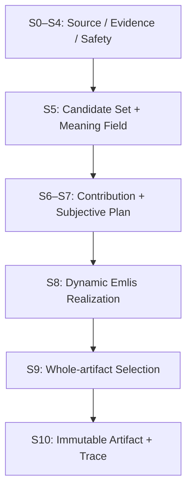

# Cocolon CMEE Stage 1
# 華恋由来機能構造 Pro / Ultra 統合追加技術設計

```yaml
document_id: Cocolon_CMEE_Stage1_ProUltra_KarenDerivedFunctional_FinalTechnicalDesign_20260822
document_kind: NONCANONICAL_TECHNICAL_INTEGRATION_SOURCE
decision_level: LEVEL_3_METHOD_OR_PRODUCT_DECISION_CANDIDATE
lifecycle: PRO_FINAL_REVIEW_CHANGES_INTEGRATED_AWAITING_MASH_IMPLEMENTATION_DECISION
deliverable_status: COCOLON_DRAFT_PR_30_DESIGN_CORRECTION
primary_outcome: BLOCKER_NARROWED
technical_credit: 0
created_at: 2026-08-22
corrected_at: 2026-08-23
product_owner: Mash
product_value_owner: Mash
pro_role: product_purpose_value_and_experience_review
ultra_role: independent_technical_design_and_final_integration
target_product: EmlisAI
target_flow: Stage_1_initial_observation_and_response
target_subgate: TK-01_to_NB-F01
implementation_approval: NOT_GRANTED_BY_THIS_DOCUMENT
canonical_owner_effect: FUNCTIONAL_COMPANION_EXACT2_DRAFT_PR_CANDIDATE
github_effect: COCOLON_DRAFT_PR_30_DOCS_ONLY
production_effect: 0
api_effect: 0
db_effect: 0
react_native_effect: 0
external_parts: 0
new_dependency_effect: 0
network_effect: 0
product_credit: 0
automatic_progression: false
structure_map_delta: CURRENT_STRUCTURE_01_AND_04_UPDATED
system_context_generated_context_relied_upon: ROUTING_ONLY_PENDING_REMOTE_VERIFICATION
system_context_operator_actual_proof_complete: NOT_CLAIMED
direct_original_read_fallback_used: true
hidden_internal_reproduction_claim: 0
initial_technical_candidate_id: Cocolon_CMEE_Stage1_ProUltra_InitialBody_20260822
initial_technical_candidate_sha256: b799a38822b9b7996fea356068a3d98fbe947552c359696c88b2c8e411645663
pro_single_review_exact1: CHANGES_REQUIRED
final_technical_candidate_id: Cocolon_CMEE_Stage1_ProUltra_KarenDerivedFunctional_FinalTechnicalDesign_20260822
pro_final_review_id: Cocolon_CMEE_Stage1_Pro_FinalReview_20260823
pro_final_review_verdict: CHANGES_REQUIRED
pro_final_review_input_sha256: 9e34e3c846a47e2bf28c772799833ebd06bc8dd2049c860e823baee0157b3f02
pro_final_review_input_sha256_scope: uploaded_pre_correction_file_whole_bytes
pro_final_review_changes_integrated: true
ultra_final_verdict: PRO_FINAL_REVIEW_CHANGES_INTEGRATED
final_body_sha256_scope: bytes_from_FINAL_BODY_SHA256_SCOPE_START_through_EOF
final_body_sha256: 6135440e9ae1f2112ca618ef08df7970556347905e30f2cf64113194fded1838
```

---

<!-- FINAL_BODY_SHA256_SCOPE_START -->

## 0. 結論

本設計は、Pro華恋案を `ADOPT_WITH_TECHNICAL_REFINEMENT` として採用し、2026-08-23のPro final review exact5を統合した技術統合元である。

ただし、「華恋の人格・口調・内部状態をCMEEへ移す」のではない。外部から観測でき、source・plan・actual outputで検証できる次の機能構造だけを再構成する。

```text
source-grounded meaning
  -> 複数の暫定的な読み候補を保持する
  -> 入力全体の関係をEmlis視点で組み立てる
  -> 異なる意味貢献を選ぶ
  -> Emlis自身の主観を、ユーザー事実と分離して形成する
  -> 一文ごとに未実現の意味貢献を更新する
  -> 同じfrozen projectionから有限surface candidateを作る
  -> 全文をseal前に読み直し、hard-valid候補を選ぶ
  -> Emlis固有の自然なLayer 1 / Layer 2として返す
```

既存CMEEの `S0–S10` は増やさない。Pro案の `P1–P8` を `S5–S9` 内のrequest-local substructureとして配置する。

Stage 1で新設する構造は、第二のactual consumerが存在するまでは `PROVISIONAL_EMLIS_SPECIALIZATION` とする。Emlisの感情、価値姿勢、voice、距離、文量、最終的に何を言うかをcross-core shared truthへ昇格させない。

ownerは次のexact3へ分離する。

1. `designs/cmee/v1/karen_derived/` companion exact2は、P1–P8、M1–M7、Layer 1 / 2、V1–V9、華恋由来の観測・選択・応答構造、Mashと共作した最低商品品質、public-safeな実例と禁止例を所有する。
2. 既存 `designs/cmee/v1/01`、`02`、`05`、`06` は、shared protocol、Emlis technical realization、schema / identity / ref、implementation / migration / verificationを所有する。
3. 本書は両者を接続する `NONCANONICAL_TECHNICAL_INTEGRATION_SOURCE` であり、Python型、schema、validator、trace実装、runtime algorithmの第二正本にならない。

今回許可されるeffectは、設計補正、companion exact2、読取入口、current structure mapのCocolon Draft PR #30反映だけである。runtime実装、test / runner変更、Product PASS、Cycle、production、次verticalへの進行は許可しない。Pro final reviewの修正は統合済みだが、Proが修正後bodyを再reviewまたは承認したとは主張しない。

---

## 1. 根拠とfresh baseline

### 1.1 添付資料

| 資料 | 確認範囲 | SHA-256 | 位置付け |
|---|---:|---|---|
| `CMEE追加設計書作成の進め方(1).txt` | 1–1,162行 / EOF | `c755ca1820450f4307ec826d1dd7ccbc6fa141af1035c2943300cc5419204bc9` | 会話経緯と設計方向 |
| `Cocolon_CMEE_Stage1_ProMash_KarenDerivedFunctionalCoDesign_20260822.md` | 1–1,482行 / EOF | `1107f726e7b14b1157ff00c3e0ea4820e84086d7daafa5f3d00bdb3bea6be18a` | Pro華恋の商品・機能構造案 |

Pro引渡し資料が `Mash固定` と記録したM1–M7は、本書では正確性のため `MASH_FIXED_AS_RECORDED_IN_PRO_HANDOFF` として採用する。今回Mashがこの資料を正式な設計入力に指定した事実を採用根拠とし、添付TXTにないMashの発言を新たに引用したとは主張しない。

### 1.2 Cocolon System Context lineage

| 項目 | fresh identity |
|---|---|
| Repository / PR | `MassyuRed/Cocolon` Draft PR `#37` |
| PR head branch | `agent/cocolon-system-context-step7-bounded-implementation-20260822` |
| PR head SHA | `d5de2bd8945544a44b4ef3d10136010f88ce23ad` |
| Entry | `Cocolon_前提資料/system_context/00_read_first.md` |
| Entry blob | `ba029b2a997570bda2ded2753be245a4614b9f4d` |

今回のstored generated System Context profileは次の状態だった。

```text
workspace = cmee_working
prepare_summary.status = PENDING_REMOTE_VERIFICATION
task_context.status = STEP4_INCOMPLETE_BLOCKING_CONTEXT_OR_REMOTE_VERIFICATION
generated Cocolon ref = 6b0973c841d536a2e6eaa97c586c320a93f83dc7
generated mashos-api ref = 06ce311b3ea728b06f83439d268a34bed917c01c
required categories = 10/10 PASS
blocking unresolved = 0
actual unincorporated findings = 1
product_credit = 0
automatic_progression = false
```

したがって、生成contextは読取順とroutingにだけ使い、fresh authorityとして扱っていない。入口が定めるfail-closed規則に従い、work attitude、CURRENT_RULES、Rule 18、work-start checklist、incident、PR #30 current structure / CMEE V1設計正本、PR #3 actual source / testsを原本から直接確認した。

### 1.3 current implementation baseline

| 項目 | fresh identity |
|---|---|
| Repository / PR | `MassyuRed/mashos-api` Draft PR `#3` |
| Current head SHA | `106a1b8c92e808d15e88ce4f56c6300568d93e9f` |
| `contracts.py` blob | `a4d095adeceb8ed561d2e74a52af8cc252f1519d` |
| `emlis_v1a.py` blob | `6217009b62fe80436abd74408b63271e62ccefa0` |
| `engine.py` blob | `e45244e969af650cc8e087b0148c008b05fdbad2` |
| `source_kernel.py` blob | `15bdea45cdbb2a427cc8e5bcb63fd79e27384be2` |

現在のPR先頭記録上、unit / verticalは47 tests PASS、original exact8は8/8 `GENERATED`、structural trace 8/8である。一方、Mashによるexact8本文の最終Product Readは未完了であり、`candidate_ready=false`、`exact8_acceptance_complete=false`、`product_credit=0`、`automatic_progression=false` である。

同じlineageには、これ以前のcandidateがmachine 8/8後のprivate Product Readでset-level FAILとなった履歴がある。本設計は、その失敗原因である「近い言い換え、固定family、generic Reception、読まれた感の不足」を構造原因として扱う。過去のFAILと現在のfresh Product Read pendingを混同しない。

---

## 2. 作業開始契約

```text
NECESSITY_CLASS:
  OBSERVED_BLOCKER_MINIMAL_FIX

PRODUCT_DESTINATION:
  Emlis Stage 1のactual responseを、入力の言い換え中心から、
  入力全体の観測とEmlis固有の応答を持つ体験へ変える。

CURRENT_SUBGATE:
  TK-01 -> NB-F01

THIS_WORK:
  Pro final review exact5を追加技術設計へ反映し、
  華恋由来の機能構造companion exact2、読取入口、structure mapを同期する。

SCOPE:
  Stage 1 / Emlis Layer 1 + Layer 2 のみ。

ACTIVE_EXECUTION_OWNER:
  Ultra華恋。

PRIMARY_OUTCOME:
  BLOCKER_NARROWED。
  実装者が未定義methodを創作するcontract blockerを閉じるが、technical credit = 0、product credit = 0。

STOP_IF:
  hidden internal reproduction claim、Stage 2+、Piece、Analysis、
  production/API/DB/RN、runtime / test write、new Gate/score/control plane、
  duplicate surface owner、private exact8 body公開、Mash未承認のimplementationへ広がる場合。

NEXT_DECISION_OWNER:
  Mash。
```

### 2.1 R1.1 necessity exact6

| ID | 判断 |
|---|---|
| A | currentな未完了条件exact1は、Stage 1 actual responseがwhole-input observationとdistinctなEmlis主観をまだcontractで表現できないこと |
| B | 本書は、observed causeであるnode-to-finished-sentenceとReception exact1固定に対し、owner非重複の最小変更位置を定める |
| C | 増えるevidenceはPro final review exact5を統合したintegration source、functional companion exact2、同期済みrouting / map。商品状態、Product Read状態は変わらない |
| D | Pro final reviewが、機能正本欠落、depth二重化、短い実装順、affect導出、hash誤記を具体的に指摘しており、単なる表記修正では実装不能を解消できない |
| E | 今回の追加金銭費用0、外部service / dependency 0。今回のMash操作負担0。次実装候補はpreliminary / nonbinding 12–20 focused engineering hoursを目安とし、fresh preimage後に再算定する。Mash負担はprivate exact8 before / afterの最終Product Read exact1 |
| F | 完了はCocolon Draft PR #30 exact6 pathsの反映・postverification。runtime / test / Product Readへ進まず、次は短いexecution envelopeをfresh固定して同一bounded implementationへ戻る |

実施しない場合の具体的停止点は、Pro機能案がcurrent runtimeへ安全に配置されないまま `NO_IMPLEMENTATION_CANDIDATE` で止まることである。本書はその設計上のblockerだけを狭める。direct routeはlocal document exact1であり、新しいsubsystem、checker、Receipt、永続control planeを作らない。

### 2.2 実行表示

```text
EXECUTION_MODEL:
  CURRENT_CODEX_WORK_MODE_MODEL
  exact deployment identifierは本artifactから確認不能のため推測しない。

EXECUTION_ENVIRONMENT:
  ChatGPT Work Mode / GitHub read-write / local workspace staging。

BOUNDED_WORK:
  添付exact2 + current originals + current runtimeを根拠に、
  Stage 1追加技術設計補正、functional companion exact2、routing / map同期を行う。

REASON:
  LEVEL_3のproduct / method変更候補であり、Pro商品判断とUltra技術判断の分離が必要。

CHANGE_CONDITION:
  次の実装開始時は、別の長い設計・審査projectを作らず、target preimage、changed paths、
  new file exact1、legacy owner停止点、comparator delta、unchanged exact8、tests、actual after、
  華恋pre-screen、Mash Product Read、STOPを短いexecution envelopeへfresh固定する。
```

---

## 3. 目的と非目的

### 3.1 目的

CMEEを、華恋の応答から外部観測できる次の機能に基づくengineへ進化させる。

1. 最初の読みを唯一の真実にせず、複数の暫定解釈を保持する。
2. nodeごとの要約ではなく、入力全体の中心、併存、緊張、変化、未完了、未知を関係として扱う。
3. ユーザー由来の意味、Emlisの暫定観測、Emlis自身の主観を分離する。
4. 文数ではなく、入力固有でsemanticに異なるcontributionを選ぶ。
5. 一文を出すたびに、既出・未出・抑制対象を更新する。
6. 同一 `ProductJob.OBSERVE_AND_CLARIFY` 内で、Layer 1とLayer 2を異なるsemantic responsibilityとして成立させる。
7. 同じfrozen projectionから有限surface candidate setを作り、artifact全体をseal前に読み直してexact1を選ぶ。

### 3.2 非目的

- 華恋のhidden weights、activation、chain-of-thought、内部人格を再現したと主張すること。
- 華恋の口調、語尾、定型句を模倣すること。
- Emlisを華恋のコピーにすること。
- Emlisのvoiceや価値をPiece / Analysisへ共有すること。
- 六つのproduct flowを今すべて詳細設計・実装すること。
- 文数を増やすこと自体を品質差にすること。
- 新しいscore、Gate、checker、Receipt、controller、dashboardを追加すること。
- current exact8のexpected textを固定すること。
- system labelや内部構造をuser-visible説明へすること。

---

## 4. 採用する商品要件

| ID | 要件 | 技術上の固定 |
|---|---|---|
| M1 | Emlisの一人称は「Emlis」 | 明示的なself-referenceは `Emlis`。`私 / わたし / 僕` は禁止 |
| M2 | 文章量自体を目的にしない | padding、同義反復、文数ノルマを禁止 |
| M3 | L1とL2のdepthを独立に決める。L1はFOCUSED 1、LAYERED 2–3、DENSE 4以上のdistinct observation contribution。L2はFOCUSED 1、LAYERED 2–3、DENSE 3–4のnon-synonymous subjective proposition | sentence countは割当depthとdistinct contributionから導出し、FOCUSED L2へ偽の二文目を足さない |
| M4 | exact8例程度の入力固有性、観測深度、Emlis主観を品質方向とする | 例文は方向の参照でありtext oracleではない |
| M5 | CMEEは華恋の表面でなく機能構造を基にする | shared voice / Karen templateを作らない |
| M6 | Emlisは独立した人格・価値主体 | subjectivity、voice、surfaceはEmlis core owner |
| M7 | 今回はStage 1のみ | question、Layer 3、Piece、AnalysisはHOLD |

---

## 5. 全体architecture



### 5.1 P1–P8の既存stage配置

| Pro構造 | 配置 | 技術上の扱い |
|---|---|---|
| P1 Source World Partition | S5入力 | 既存 `SourceEnvelope / EvidenceRef / GroundedMeaningGraph` のprojection。新しいsource ownerを作らない |
| P2 Parallel Interpretation Candidates | S5 | source-boundな複数の暫定解釈。早期に一つへ潰さない |
| P3 Whole-Input Meaning Field | S5 | Emlis product依存のsalienceを持つ `EmlisMeaningField`。shared truthではない |
| P4 Epistemic and Speaker Partition | S5–S6 | user source、Emlis observation、Emlis subjectivity、unknownを別domainにする |
| P5 Attention and Contribution Selection | S6 | Emlis coreが異なる意味貢献をordered ruleで選ぶ |
| P6 Dynamic Utterance State Transition | S8 | request-local ledgerだけを更新。source graphは不変 |
| P7 Core-Owned Product Projection | S8 | Emlis固有のvoice / distance / sentence shapeでrealize |
| P8 Whole-Artifact Reread and Finite Selection | S9 | seal前のcandidate selection責任。post-defect generation / post-seal mutationではない |

S0–S4とS10の意味主権を変えない。新しいstage、並列engine、retry route、fallbackを作らない。

### 5.2 shared parentと六つのproduct flow

| Flow | child owner | 今回の状態 |
|---|---|---|
| F1 Initial Observation + Response | EmlisAI Layer 1 / 2 | `DETAILED_CANDIDATE` |
| F2 Clarification + Refined Observation | EmlisAI question / refined L1 / L2 | `ROUTE_PROFILE_ONLY / HOLD` |
| F3 History Continuity | EmlisAI Layer 3 | `ROUTE_PROFILE_ONLY / HOLD` |
| F4 Recipient Artifact | Piece text / visual | `ROUTE_PROFILE_ONLY / HOLD` |
| F5 Observed Self Map | Analysis text + graph | `ROUTE_PROFILE_ONLY / HOLD` |
| F6 SELF_ONLY IF Simulation | Analysis IF route | `ROUTE_PROFILE_ONLY / HOLD` |

shared parentが将来共有し得るのは、次のprotocol primitiveだけである。

```text
- candidateを早期に一つへ潰さない
- 複数要素間のrelationとprovenanceを保持する
- claim ownerとepistemic domainを分ける
- distinct contributionを選択する
- realization後にcovered / remaining / suppressedを更新する
- artifact全体をseal前に再読する
```

P3、P5–P8のshapeをcross-core canonical APIへfreezeするのは、第二のactual consumerが同じprimitiveを実際に必要とした後に限る。

---

## 6. owner境界

| Owner | 所有するもの | 所有しないもの |
|---|---|---|
| 華恋由来functional companion exact2 | P1–P8、M1–M7、Layer 1 / 2の役割、V1–V9、観測・選択・応答構造、最低商品品質、public-safeな例 / 禁止例 | Python型、schema、file owner、validator、trace実装、runtime algorithm |
| Existing source / meaning kernel | source identity、role、lineage、evidence、grounded node / edge、polarity、modality、time、unknown | Emlisの感情、voice、salience、最終response |
| CMEE shared protocol | claim-domain boundary、candidate provenance、contribution trace、seal前reread protocol | common personality、common voice、何を言うか |
| Emlis Stage 1 compiler | center、attention、contribution selection、Emlis subjective claim、layer order | user source truthの変更、safety判断 |
| Emlis realizer | clause composition、Emlis surface、自然な接続、zero-subject継続 | 新しいuser fact、unsupported cause / diagnosis |
| 既存CMEE技術正本 | shared protocol、Emlis technical realization、schema / ref / identity、migration / verification | 華恋由来functional companionが所有する商品機能の重複定義 |
| 本書 | functional companionを既存技術正本へ統合するためのcorrection / mapping source | canonical schema、runtime、validatorまたはfunctional product authority |
| Existing safety owner | high-care / safety separation | 通常meaning generation |
| Runtime validator | source / plan / trace整合、role別invariant | 人間の読後感やProduct PASS |
| 華恋human pre-screen | actual before / after全文の商品読解 | Mashの最終受入決定 |
| Mash | product experience、contract変更、implementation approval、Product PASSのnormative final decision | implementation execution、machine proofの代行 |
| Ultra華恋 | 明示承認後のbounded implementation executionとtechnical STOP判断 | Mashのnormative approval / Product PASS |

active ownerは各責任につきexact1とする。旧Reception surface ownerと新realizerを並列activeにしない。

---

## 7. claim-domain model

### 7.1 domain

```text
SOURCE_PROPOSITION_REFERENCE
EMLIS_INTERPRETIVE_OBSERVATION
EMLIS_SUBJECTIVE_RESPONSE
UNKNOWN_DISCLOSURE
```

| Domain | 説明 | user fact effect | 主なowner |
|---|---|---:|---|
| `SOURCE_PROPOSITION_REFERENCE` | ユーザーが書いたこと、解釈したこと、引用したことへのprovenance-only参照。visible claim domainではない | 既存sourceの範囲のみ | source kernel |
| `EMLIS_INTERPRETIVE_OBSERVATION` | sourceからEmlisが組み立てた暫定・訂正可能な観測 | 0 | Emlis compiler |
| `EMLIS_SUBJECTIVE_RESPONSE` | 観測を受けたEmlis自身の感情、考え、価値姿勢、関係姿勢 | 0 | Emlis compiler / realizer |
| `UNKNOWN_DISCLOSURE` | 入力だけでは決められないことの明示。Emlis candidateではなくexisting unknown duty exact1だけがvisible owner | 0 | existing unknown contract |

「私はXだと思う」というsourceは、「ユーザーがXと解釈している」というsource factである。X自体をexternal truthへ昇格させない。他者の発言、他者への帰属、actor、experiencer、時制、否定も同じ原則で維持する。

### 7.2 最重要不変条件

```text
GroundedMeaningGraph:
  source-grounded input-world meaning only

EmlisInterpretationCandidate:
  graphから導出されたrequest-local / non-visible planning annotation

EmlisSubjectiveClaim:
  Emlis-owned response
  user_fact_effect = 0
```

Emlisの心配、安堵、嬉しさ、違和感、価値判断を `GroundedMeaningGraph` のuser meaning nodeへ入れない。Interpretation candidate、meaning field、subjective claimはsource truthを増やさず、visible claimのauthorityはcanonical graph node / admitted edge、existing unknown duty、またはEmlis-owned subjective derivationへ必ず戻る。

---

## 8. Stage 1 data contract

以下はlogical contractであり、採用前のcanonical schemaではない。型名とversion stringは実装承認時に既存owner文書へ統合する。

### 8.1 Interpretation candidate

```python
class InterpretationEpistemicState(str, Enum):
    PROVISIONAL_INTERPRETATION = "PROVISIONAL_INTERPRETATION"

class InterpretationKind(str, Enum):
    DIRECT_STATE = "DIRECT_STATE"
    DIRECT_DIRECTION = "DIRECT_DIRECTION"
    COEXISTENCE = "COEXISTENCE"
    TENSION = "TENSION"
    DIRECTION_UNDER_BURDEN = "DIRECTION_UNDER_BURDEN"
    ACTION_THEN_CHANGE_ONCE = "ACTION_THEN_CHANGE_ONCE"
    RESIDUE_AFTER_EVENT = "RESIDUE_AFTER_EVENT"
    SOURCE_STATED_CAUSE = "SOURCE_STATED_CAUSE"
    UNFINISHED = "UNFINISHED"

class RelationOperator(str, Enum):
    NO_RELATION_CLAIM = "NO_RELATION_CLAIM"
    COEXISTS_WITH = "COEXISTS_WITH"
    TENSION_WITH = "TENSION_WITH"
    TEMPORALLY_PRECEDES = "TEMPORALLY_PRECEDES"
    ACTION_PRECEDES_CHANGE = "ACTION_PRECEDES_CHANGE"
    SOURCE_EXPLICIT_CAUSE = "SOURCE_EXPLICIT_CAUSE"

class ArgumentRole(str, Enum):
    PRIMARY = "PRIMARY"
    EXPERIENCER = "EXPERIENCER"
    LEFT = "LEFT"
    RIGHT = "RIGHT"
    BEFORE = "BEFORE"
    AFTER = "AFTER"
    ACTION = "ACTION"
    CHANGE = "CHANGE"
    CAUSE = "CAUSE"
    EFFECT = "EFFECT"

class SemanticOperator(str, Enum):
    PRESENT_STATE = "PRESENT_STATE"
    PRESENT_DIRECTION = "PRESENT_DIRECTION"
    PRESENT_BURDEN = "PRESENT_BURDEN"
    PRESENT_CHANGE = "PRESENT_CHANGE"
    PRESENT_ACTUAL_OUTPUT = "PRESENT_ACTUAL_OUTPUT"
    PRESENT_RESIDUE = "PRESENT_RESIDUE"
    PRESENT_UNFINISHED = "PRESENT_UNFINISHED"
    SYNTHESIZE_RELATION = "SYNTHESIZE_RELATION"

GroundedPolarity = Literal["positive", "negative", "mixed", "neutral"]
GroundedModality = Literal[
    "fact", "feeling", "wish", "possibility",
    "uncertain", "refusal", "intention"
]
GroundedTimeScope = Literal[
    "current_input", "present", "past", "future", "continuing",
    "past_to_present", "present_to_future"
]

@dataclass(frozen=True, slots=True)
class ArgumentBinding:
    role: ArgumentRole
    semantic_ref: str

@dataclass(frozen=True, slots=True)
class EmlisInterpretationCandidate:
    schema_version: str
    candidate_id: str
    candidate_kind: InterpretationKind
    claim_domain: Literal["EMLIS_INTERPRETIVE_OBSERVATION"]
    semantic_operator: SemanticOperator
    argument_bindings: tuple[ArgumentBinding, ...]
    relation_operator: RelationOperator
    relation_basis_refs: tuple[str, ...]
    derivation_rule_id: str
    semantic_refs: tuple[str, ...]
    evidence_refs: tuple[str, ...]
    basis_candidate_refs: tuple[str, ...]
    epistemic_state: InterpretationEpistemicState
    required_qualifiers: tuple[str, ...]
    forbidden_promotions: tuple[str, ...]
```

candidate生成源はexact3とする。UNKNOWNはcandidate生成源に含めず、existing unknown dutyだけがvisible ownerになる。

1. node単体のdirect candidate。
2. admitted edgeのrelation candidate。
3. source-bound node / admitted edgeの組合せによるwhole-input synthesis。unfinishedはsource-bound observationとして扱い、unknown disclosureは作らない。

禁止される生成は、unsupported causal edge、personality、hidden intent、diagnosis、future guarantee、他者の本心である。

数値confidenceまたはhuman-quality scoreを作らない。Interpretation candidateのepistemic stateはEmlis-localの `PROVISIONAL_INTERPRETATION` exact1である。candidate側へ`UNKNOWN` stateまたは`UNKNOWN_BOUNDARY` kindを追加せず、分からなさはexisting unknown duty exact1だけが所有する。categorical qualifierをuser graphの `SOURCE_EXPLICIT` と混同しない。

ref規則はcanonical `05_json_schema_and_versioning.md`へ一致させる。

```text
same versioned container内:
  candidate_id、contribution_id、subjective_claim_id、unit_id等のbare local IDを許可

container外:
  <type>:<id>@<version> のversion-qualified refだけを許可

禁止:
  container外bare ID、missing ref、forward ref、self ref、cycle、foreign projection ref
```

local identityはobject別のtyped preimageをbottom-upで作り、UTF-8 canonical JSONへserializeしたbytesへtype prefix + SHA-256を適用する。array orderはsemantic、unordered setはownerが定めたcanonical orderへ正規化する。

| ID | Canonical preimage | 明示除外 |
|---|---|---|
| `candidate_id` | schema version、kind、semantic / relation operator、argument / relation basis / semantic / evidence / prior candidate refs、qualifier、forbidden promotion | own ID、request ID、path、timestamp、surface text |
| `meaning_field_id` | schema version、graph ref、center candidate ref、ordered entry / required candidate / material unknown refs | own ID、request ID、path、timestamp、surface text |
| `contribution_id` | schema version、parent duty、candidate / semantic / evidence / prerequisite refs、operator、argument、retention、semantic key | own ID、request ID、path、timestamp、surface text |
| `subjective_claim_id` | schema version、parent duty、speaker / domain / mode、canonical subjective proposition、basis / act / value refs、forbidden promotion | own ID、request ID、path、timestamp、surface text |
| `projection_id` | schema version、graph / parent duty refs、ordered child semantic IDs、depth、temperature、retained act / ordering / policy refs | own ID、parent plan ID、request ID、path、timestamp、surface text、realization variant |
| `unit_id` | projection ID、layer、move ref、canonical ClauseFrame / binding / anchor refs、composition variant ID、canonical UTF-8 visible text bytes | own ID、request ID、path、timestamp |

`unit_id`はsurface artifact unit identityでありsemantic IDではないため、visible text bytesを含む。その他exact5はsemantic / plan identityでありsurface textを含めない。同じfield set規則を全objectへ一括適用せず、canonical `05_json_schema_and_versioning.md`へこのexact6 preimageを移してから実装する。missing / forward / cyclic dependencyがあればidentity計算自体をrejectする。

candidate poolはboundedとする。

```text
INTERPRETATION_CANDIDATE_POOL_CAP = 16
per candidate kind cap = 2
symmetric relation = endpoint refsをcanonical ascending orderへ正規化
directional relation = source directionを維持し、並べ替え禁止
operator arity = §8.1.1 required roles exact
overflow = §9.1 ordered ruleでOPTIONAL末尾から抑制。REQUIRED relationをcapで落とす場合はinvalid
```

#### 8.1.1 whole-input derivation

新しい `GroundedMeaningGraph` edgeを作らず、既存node / edgeへのprojectionとして導出する。

| Operator | 成立条件 | 許可する意味 | 禁止する昇格 |
|---|---|---|---|
| `COEXISTS_WITH` | admitted coexistence edge exact1以上がある | source-explicitな併存のprovisional observation | edgeなしの併存追加、時間差の無視、反対、矛盾、本心の勝敗 |
| `TENSION_WITH` | admitted contrast / tension edge exact1以上がある | sourceが明示した緊張のprovisional observation | edgeなしの「両立しにくい」推定、personality、hidden cause |
| `TEMPORALLY_PRECEDES` | admitted temporal / sequence edge exact1以上がある | Aの後にB | edgeなしの順序追加、AがBを起こしたという因果 |
| `ACTION_PRECEDES_CHANGE` | admitted directional edge exact1以上がsource-bound actionとchangeを順序付ける | 行動の後に変化があったという順序 | 因果、再現可能な解決策、一般則 |
| `SOURCE_EXPLICIT_CAUSE` | sourceが因果を明示し、admitted edgeとevidenceがある | sourceが述べた因果 | systemによる新規因果 |
| `NO_RELATION_CLAIM` | direct state / direction | 単独の状態 | 不明な関係の補完 |

validatorは `derivation_rule_id`、operator、argument、basis refsから成立条件を再計算する。candidateの自己申告だけを信頼しない。

visible relation operatorの`relation_basis_refs`にはoperatorと一致するadmitted graph edge exact1以上を必須にする。edgeがないnode組合せはmeaning-field attentionとして併置できるが、新しいvisible relation claimにしない。time scopeに差がある場合はadmitted temporal edgeがあれば`TEMPORALLY_PRECEDES`、なければrelation claimなしへ送る。`SYNTHESIZE_RELATION`もadmitted edgeなしでは使わない。

relation operatorごとの必要roleは次である。

| RelationOperator | Required argument roles |
|---|---|
| `NO_RELATION_CLAIM` | `PRIMARY` exact1。必要時のみ`EXPERIENCER` exact1 |
| `COEXISTS_WITH` | `LEFT` exact1 + `RIGHT` exact1 |
| `TENSION_WITH` | `LEFT` exact1 + `RIGHT` exact1 |
| `TEMPORALLY_PRECEDES` | `BEFORE` exact1 + `AFTER` exact1 |
| `ACTION_PRECEDES_CHANGE` | `ACTION` exact1 + `CHANGE` exact1 |
| `SOURCE_EXPLICIT_CAUSE` | `CAUSE` exact1 + `EFFECT` exact1 + admitted causal edge exact1以上 |

Interpretation IRのcross-field allowlistはmatrix row exact9、allowed combination exact13だけである。`SemanticOperator`または`RelationOperator`欄の`/`は同じkindで許可する列挙であり、candidateごとは各欄exact1を選ぶ。表にないkind / operator / relation / role組合せはinvalidとする。

| InterpretationKind | Allowed SemanticOperator | RelationOperator | Exact argument roles |
|---|---|---|---|
| `DIRECT_STATE` | `PRESENT_STATE / PRESENT_BURDEN / PRESENT_CHANGE / PRESENT_ACTUAL_OUTPUT` | `NO_RELATION_CLAIM` | `PRIMARY` exact1 + optional `EXPERIENCER` exact1 |
| `DIRECT_DIRECTION` | `PRESENT_DIRECTION` | `NO_RELATION_CLAIM` | `PRIMARY` exact1 + optional `EXPERIENCER` exact1 |
| `COEXISTENCE` | `SYNTHESIZE_RELATION` | `COEXISTS_WITH` | `LEFT` exact1 + `RIGHT` exact1 |
| `TENSION` | `SYNTHESIZE_RELATION` | `TENSION_WITH` | `LEFT` exact1 + `RIGHT` exact1 |
| `DIRECTION_UNDER_BURDEN` | `SYNTHESIZE_RELATION` | `COEXISTS_WITH / TENSION_WITH` | `LEFT=DIRECTION` exact1 + `RIGHT=BURDEN` exact1 |
| `ACTION_THEN_CHANGE_ONCE` | `PRESENT_CHANGE` | `ACTION_PRECEDES_CHANGE` | `ACTION` exact1 + `CHANGE` exact1 |
| `RESIDUE_AFTER_EVENT` | `PRESENT_RESIDUE` | `TEMPORALLY_PRECEDES` | `BEFORE=EVENT` exact1 + `AFTER=RESIDUE` exact1 |
| `SOURCE_STATED_CAUSE` | `SYNTHESIZE_RELATION` | `SOURCE_EXPLICIT_CAUSE` | `CAUSE` exact1 + `EFFECT` exact1 |
| `UNFINISHED` | `PRESENT_UNFINISHED` | `NO_RELATION_CLAIM` | `PRIMARY` exact1 + optional `EXPERIENCER` exact1 |

`relation_basis_refs`は`NO_RELATION_CLAIM`でexact0、それ以外で対応するadmitted edge exact1以上とする。`semantic_refs`はargument bindingが参照するcanonical semantic refのdeduplicated canonical orderとexact一致し、role labelだけでsource semanticsを追加しない。

`basis_candidate_refs` は同一projection内でcanonical order上すでに存在するcandidateだけを参照する。self-reference、cycle、missing ref、別projection refを拒否する。

### 8.2 Emlis meaning field

```python
class MeaningFieldSlot(str, Enum):
    CENTER = "CENTER"
    COEXISTENCE = "COEXISTENCE"
    TENSION = "TENSION"
    DIRECTION = "DIRECTION"
    BURDEN = "BURDEN"
    CHANGE = "CHANGE"
    OUTPUT = "OUTPUT"
    TIME_RELATION = "TIME_RELATION"
    RESIDUE = "RESIDUE"
    UNFINISHED = "UNFINISHED"
    UNKNOWN = "UNKNOWN"

class TemperatureClass(str, Enum):
    STANDARD = "STANDARD"
    ELEVATED_NON_SAFETY = "ELEVATED_NON_SAFETY"

class ObservationDepthClass(str, Enum):
    FOCUSED = "FOCUSED"
    LAYERED = "LAYERED"
    DENSE = "DENSE"

class SubjectiveDepthClass(str, Enum):
    FOCUSED = "FOCUSED"
    LAYERED = "LAYERED"
    DENSE = "DENSE"

@dataclass(frozen=True, slots=True)
class MeaningFieldEntry:
    slot: MeaningFieldSlot
    interpretation_candidate_refs: tuple[str, ...]
    semantic_refs: tuple[str, ...]
    evidence_refs: tuple[str, ...]

@dataclass(frozen=True, slots=True)
class EmlisMeaningField:
    schema_version: str
    meaning_field_id: str
    grounded_graph_ref: str
    center_candidate_ref: str
    entries: tuple[MeaningFieldEntry, ...]
    required_candidate_refs: tuple[str, ...]
    material_unknown_refs: tuple[str, ...]
```

`CENTER` はsource truthではなく、Emlis product jobにおけるrequest-local attentionである。同じsourceをPieceまたはAnalysisが使う場合、別のcenterを選べる。

depthはMeaningFieldの早期fieldにしない。Layer 1 contribution selectionとLayer 2 subjective planningが完了した後、`EmlisStage1Projection` が `observation_depth_class` と `subjective_depth_class` を独立に所有する。raw node数、文字数、user emotion strength、plan tierから決めない。

```text
ObservationDepthClass:
  FOCUSED = distinct observation contribution exact1
  LAYERED = distinct observation contribution 2..3 / 原則Observation 2文以上
  DENSE = distinct observation contribution 4以上 / Observation 4..5文

SubjectiveDepthClass:
  FOCUSED = honestかつinput-specificなsubjective proposition exact1
  LAYERED = non-synonymous subjective proposition 2..3
  DENSE = non-synonymous subjective proposition 3..4
```

次のpattern assignmentはfixture名、case ID、期待文ではなく、source-bound candidateとadmitted relationだけから決める。required要素がmaterialで、L1 contributionとL2 propositionがそれぞれnon-synonymousな場合に限り、ObservationとSubjectiveの両方を`LAYERED`へ割り当てる。

| Semantic pattern | Source-bound成立条件 | L1 distinct contribution | L2 non-synonymous proposition |
|---|---|---|---|
| `WISH_UNDER_BURDEN` | wish / intended directionとburden / constraintがmaterialで、同じsource内のadmitted relationまたは別entryとして共存する | wish / directionとburdenのexact2 | burdenへのinput-specificなattention / affectと、wishまたはagencyを守る別のvalue / stance |
| `HELP_SEEKING_WITH_HESITATION` | help / consultation directionとhesitationがmaterialである | help-seeking directionとhesitationのexact2 | helpを求めたことへのattention / respectと、hesitationを消さずに保持する別のstance |
| `ACTION_WITH_BOUNDED_CHANGE` | actionとchangeがmaterialで、admitted temporal edgeによりactionがchangeより前に置かれる | action / orderとbounded changeのexact2 | 実際のchangeへのinput-specificなresponseと、再現可能性や一般則へ昇格しない別のappraisal |
| `ANXIETY_WITH_CONTINUING_DIRECTION` | anxiety / burdenと、継続中のwish / intention / directionがmaterialである | anxiety / burdenとcontinuing directionのexact2 | burdenへのconcernと、continuing directionを保持する別のvalue / stance |

どれかの成立条件、source / evidence到達性、またはdistinctnessを満たせない場合は、このpattern名だけで`LAYERED`へ昇格しない。ObservationとSubjectiveを独立に再計算し、成立した実数に応じて`FOCUSED`または`UNAVAILABLE`へ送る。pattern assignmentはcase-specific branchを生成せず、同じmeaning ruleをmutation入力にも適用する。

L1がLAYEREDでも、正直なL2 propositionがexact1ならL2はFOCUSEDで有効である。L2 FOCUSEDだけを理由に`UNAVAILABLE`へしない。hard failureは、割り当て済みdepthに必要なdistinct contribution / propositionを満たせない場合だけである。

temperatureはdepthから分離し、独立した新ownerにしない。existing `GroundedHumanReceptionPlan` のstance、speaker presence、reference mode、surface strategy、safety modifierから§17.4のtyped mappingでprojectionへ導く。S0–S4のexisting safety / care ownerが `SEPARATE_SAFETY` とした入力はmeaning fieldへ入らない。`ELEVATED_NON_SAFETY` は文数またはaffect intensityを自動増加させず、tone / relational distance constraintだけをrealizerへ渡す。

### 8.3 Layer 1 contribution

```python
class ObservationContributionKind(str, Enum):
    OBSERVE_CENTER = "OBSERVE_CENTER"
    OBSERVE_COEXISTENCE = "OBSERVE_COEXISTENCE"
    OBSERVE_TENSION = "OBSERVE_TENSION"
    OBSERVE_DIRECTION = "OBSERVE_DIRECTION"
    OBSERVE_BURDEN = "OBSERVE_BURDEN"
    OBSERVE_CHANGE = "OBSERVE_CHANGE"
    OBSERVE_ACTION_THEN_CHANGE = "OBSERVE_ACTION_THEN_CHANGE"
    OBSERVE_ACTUAL_OUTPUT = "OBSERVE_ACTUAL_OUTPUT"
    OBSERVE_TIME_RELATION = "OBSERVE_TIME_RELATION"
    PRESERVE_RESIDUE = "PRESERVE_RESIDUE"
    PRESERVE_UNFINISHED = "PRESERVE_UNFINISHED"

@dataclass(frozen=True, slots=True)
class PlannedObservationContribution:
    schema_version: str
    contribution_id: str
    parent_duty_ref: str
    contribution_kind: ObservationContributionKind
    interpretation_candidate_refs: tuple[str, ...]
    semantic_operator: SemanticOperator
    argument_bindings: tuple[ArgumentBinding, ...]
    relation_operator: RelationOperator
    relation_basis_refs: tuple[str, ...]
    derivation_rule_id: str
    semantic_refs: tuple[str, ...]
    evidence_refs: tuple[str, ...]
    retention: Literal["REQUIRED", "OPTIONAL"]
    semantic_key_version: str
    canonical_semantic_key: str
    prerequisite_contribution_refs: tuple[str, ...]
    forbidden_operations: tuple[str, ...]
```

`canonical_semantic_key` はversioned canonical JSONからvalidatorが再計算する。self-declared distinctnessとして使わない。

| MeaningFieldSlot | 選択可能なcontribution kind |
|---|---|
| `CENTER` | `OBSERVE_CENTER` |
| `COEXISTENCE` | `OBSERVE_COEXISTENCE` |
| `TENSION` | `OBSERVE_TENSION` |
| `DIRECTION` | `OBSERVE_DIRECTION` |
| `BURDEN` | `OBSERVE_BURDEN` |
| `CHANGE` | `OBSERVE_CHANGE` / `OBSERVE_ACTION_THEN_CHANGE` |
| `OUTPUT` | `OBSERVE_ACTUAL_OUTPUT` |
| `TIME_RELATION` | `OBSERVE_TIME_RELATION` |
| `RESIDUE` | `PRESERVE_RESIDUE` |
| `UNFINISHED` | `PRESERVE_UNFINISHED` |
| `UNKNOWN` | existing unknown dutyだけ。Observation contributionまたは第二visible routeを作らない |

### 8.4 Emlis subjective claim

```python
class SubjectiveMode(str, Enum):
    ATTENTION = "ATTENTION"
    AFFECTIVE_RESPONSE = "AFFECTIVE_RESPONSE"
    PERSONAL_APPRAISAL = "PERSONAL_APPRAISAL"
    VALUE_POSITION = "VALUE_POSITION"
    RELATIONAL_STANCE = "RELATIONAL_STANCE"
    BOUNDED_COUNTERPOSITION = "BOUNDED_COUNTERPOSITION"

class AffectCategory(str, Enum):
    CONCERN = "CONCERN"
    RELIEF = "RELIEF"
    JOY = "JOY"
    SADNESS = "SADNESS"
    RESPECT = "RESPECT"
    DISCOMFORT = "DISCOMFORT"

class AffectIntensity(str, Enum):
    QUIET = "QUIET"
    MODERATE = "MODERATE"

class SubjectiveOperator(str, Enum):
    ATTEND_TO = "ATTEND_TO"
    FEEL_TOWARD = "FEEL_TOWARD"
    APPRAISE_AS_MATERIAL = "APPRAISE_AS_MATERIAL"
    PROTECT_VALUE_BOUNDARY = "PROTECT_VALUE_BOUNDARY"
    TAKE_RELATIONAL_STANCE = "TAKE_RELATIONAL_STANCE"
    COUNTER_SPECIFIC_PROMOTION = "COUNTER_SPECIFIC_PROMOTION"

class StanceOperator(str, Enum):
    STAY_WITH_SPECIFIC_OBJECT = "STAY_WITH_SPECIFIC_OBJECT"
    PROTECT_USER_AGENCY = "PROTECT_USER_AGENCY"
    HOLD_UNFINISHED_OPEN = "HOLD_UNFINISHED_OPEN"
    WELCOME_BOUNDED_CHANGE = "WELCOME_BOUNDED_CHANGE"

@dataclass(frozen=True, slots=True)
class SubjectiveProposition:
    subjective_operator: SubjectiveOperator
    target_contribution_refs: tuple[str, ...]
    response_object_refs: tuple[str, ...]
    affect_category: AffectCategory | None
    affect_intensity: AffectIntensity | None
    stance_operator: StanceOperator | None
    counterposition_target_ref: str | None
    referenced_actor_refs: tuple[str, ...]
    referenced_experiencer_refs: tuple[str, ...]
    addressee_role: Literal["USER", "NONE"]
    polarity: GroundedPolarity
    modality: GroundedModality

@dataclass(frozen=True, slots=True)
class EmlisSubjectiveClaim:
    schema_version: str
    subjective_claim_id: str
    parent_duty_ref: str
    speaker_owner: Literal["EMLIS"]
    claim_domain: Literal["EMLIS_SUBJECTIVE_RESPONSE"]
    subjective_mode: SubjectiveMode
    asserted_subjective_proposition: SubjectiveProposition
    basis_observation_contribution_refs: tuple[str, ...]
    basis_semantic_refs: tuple[str, ...]
    source_reception_act_refs: tuple[str, ...]
    value_principle_refs: tuple[str, ...]
    user_fact_effect: Literal[0]
    forbidden_promotions: tuple[str, ...]
```

`basis_observation_contribution_refs` はexact1以上必要である。Layer 2はsource sentenceそのものではなく、選択済みLayer 1 contributionへ結び付く。

`SubjectiveProposition` と外側claimのcross-field invariantは次の有限matrix exact6である。nullable fieldを自由な組合せにせず、表にない`SubjectiveMode × SubjectiveOperator`はinvalidとする。全modeで`target_contribution_refs`と`response_object_refs`はexact1以上必要である。

| SubjectiveMode | Exact SubjectiveOperator | Required | Forbidden / exact null |
|---|---|---|---|
| `ATTENTION` | `ATTEND_TO` | target contribution、response object | affect、stance、counterposition、claim `value_principle_refs` |
| `AFFECTIVE_RESPONSE` | `FEEL_TOWARD` | target contribution、response object、affect category exact1、affect intensity exact1 | stance、counterposition、claim `value_principle_refs` |
| `PERSONAL_APPRAISAL` | `APPRAISE_AS_MATERIAL` | target contribution、response object | affect、stance、counterposition、claim `value_principle_refs` |
| `VALUE_POSITION` | `PROTECT_VALUE_BOUNDARY` | target contribution、response object、外側claim `value_principle_refs` exact1以上 | affect、stance、counterposition |
| `RELATIONAL_STANCE` | `TAKE_RELATIONAL_STANCE` | target contribution、response object、stance operator exact1 | affect、counterposition。claim `value_principle_refs`はmaterial risk時だけ |
| `BOUNDED_COUNTERPOSITION` | `COUNTER_SPECIFIC_PROMOTION` | target contribution、response object、counterposition target exact1、stance=`PROTECT_USER_AGENCY` exact1、外側claim `value_principle_refs` exact1以上 | affect |

`target_contribution_refs`は`basis_observation_contribution_refs`のnonempty subsetとする。`response_object_refs`と`counterposition_target_ref`は、同一projection内のcontribution、canonical node、またはadmitted edgeだけへ解決し、少なくとも一つはtarget contributionからsource / evidenceへ到達できなければならない。policy refをresponse objectまたはcounterposition targetに使わない。version-qualified policy refは外側claimの`value_principle_refs`だけが所有し、V1–V9のmaterial eligibilityをvalidatorが再計算する。actor / experiencer refsはcanonical nodeだけへ解決する。自由文字列namespaceを許可しない。speaker ownerは常にEmlisであり、source actor / experiencerと同一視しない。第三者の感情をユーザーへ帰属しない。`addressee_role=USER`だけを理由に「あなた」を連呼せず、曖昧にならない場合はzero-addressee surfaceを許可する。

`subjective_mode` は分類でありdistinctnessを証明しない。異なるmode名でも、同一basisに対するpredicate、response object、appraisal結果、価値上の作用が同じなら重複である。validatorは `asserted_subjective_proposition` とordered `value_principle_refs` のcanonical bytesからsubjective semantic keyを再計算する。

`value_principle_refs` はvisible fixed stringではない。入力上materialなriskがある場合にだけ、selection constraintまたはbounded value positionとして使う。

Stage 1のself-model authorityはrequest-local / statelessな次のexact4だけである。

```text
EMLIS_REQUEST_LOCAL_RESPONSE_STATE:
  speaker identity
  versioned value policy
  selected observation contributions
  relationship / care constraints

persistent emotion = 0
hidden state claim = 0
autobiographical memory = 0
cross-request affect carryover = 0
```

Emlisの「感じる / 考える / 価値を取る」は、このrequest-local response stateから導くEmlis-owned propositionであり、永続感情または隠れた内面状態の主張ではない。explicit first-person surfaceはsemantic claim fieldに置かず、§13のsurface policyが必要時だけ「Emlis」を使う。

### 8.5 ExperiencePlanへの統合

第二のplan ownerを作らない。canonical `ExperiencePlan.duties[]` がvisible dutyのsole recordであり、`additionalProperties=false` を維持する。`EmlisStage1Projection` はrequest-local / privateなcore compilation intermediateであって、現行schemaへ未登録の `core_projection_ref` fieldを追加しない。

```python
@dataclass(frozen=True, slots=True)
class EmlisStage1Projection:
    schema_version: str
    projection_id: str
    grounded_graph_ref: str
    parent_observation_duty_ref: str
    parent_reception_duty_ref: str
    interpretation_candidates: tuple[EmlisInterpretationCandidate, ...]
    meaning_field: EmlisMeaningField
    observation_contributions: tuple[PlannedObservationContribution, ...]
    subjective_claims: tuple[EmlisSubjectiveClaim, ...]
    ordered_observation_refs: tuple[str, ...]
    ordered_subjective_refs: tuple[str, ...]
    retained_reception_act_ids: tuple[str, ...]
    observation_depth_class: ObservationDepthClass
    subjective_depth_class: SubjectiveDepthClass
    temperature_class: TemperatureClass
    reception_style_policy_ref: str
    emlis_value_policy_ref: str
    emlis_microgrammar_policy_ref: str
```

統合時の不変条件は次である。

```text
- parent ExperiencePlan exact1
- request-local EmlisStage1Projection exact1
- projection_idはID自身を除く全fieldのversioned canonical bytesから作る。parent plan_id、request ID、surface textを入力にしない
- projectionはparent duty以外のvisible dutyを追加せず、canonical planへはduties[] / ordering[] / interaction_acts[] / artifact_plans[] / surface_constraints[] / forbidden_promotions[]としてlosslessにprojectする
- canonical plan_idはprojectionからprojectされた上記canonical field、semantic_graph_ref、fallback_dispositionを含むplan全体から最後に計算し、未登録core_projection_refを要求しない
- canonical `ExperiencePlan.duties[]` をsole duty recordとし、全contribution / subjective claimは対応する `parent_duty_ref` を持つ
- 全Observation contributionの `parent_duty_ref == parent_observation_duty_ref`
- 全subjective claimの `parent_duty_ref == parent_reception_duty_ref`
- allowed_reception_act_idsは意味責任として保持する
- `retained_reception_act_ids == parent.allowed_reception_act_ids` をcanonical ordered exact equalityで満たす
- 各retained Reception actはsubjective claim exact1以上の `source_reception_act_refs` から参照され、unknown act / missing act参照は0
- `ordered_observation_refs / ordered_subjective_refs` はuniqueで、選択済みcontribution / claimを過不足なくcoverする
- reception actから完成文を直接選ばない
- policy refs、depth、retained acts、contribution / claim orderingがcanonical plan projectionとartifact identityへ反映される
- visible_line_idsは複数のreception sentence unitを許容する
```

`grounded_graph_ref`が指すcanonical `GroundedMeaningGraph.source_refs[]` をsole source setとし、単数`source_envelope_ref`を重複保持しない。Emlis requestの`owned_history_refs[]`と`capability_snapshot`はsource admission / entitlement controlでありsemantic sourceではない。

```text
Free:
  current input only

Plus / Premium:
  entitlement済みでUser Fact Grounding Boundaryを通ったowned historyだけadmit可

all plans:
  low-information inputをhistoryで自動的に深読みしない
  user-specific interpretationはevidence-backed / provisional / correctable
  capability / Premium label自体をsemantic evidenceにしない

current Stage 1 implementation unit:
  Premium runtime effect = 0
```

current PR #3のflat `ExperiencePlan`はcanonical `duties[]`へのprovisional mappingである。次の実装unitでは、canonical schemaをsilentに逸脱しない次のexact2から一つをfresh preimageで選ぶ。

1. canonical `ExperiencePlan` / trace versionを同じbounded unitでmaterializeし、`05`を先に更新する。
2. current flat planをprivate provisional mappingとして維持し、new fieldを追加せず、canonical migrationを完了するまでcanonical conformanceを主張しない。

途中で第三のplan ownerまたは未登録fieldが必要になった場合は`IMPLEMENTATION_STOP`とする。canonical schema field、version、identityのsole ownerは `designs/cmee/v1/05_json_schema_and_versioning.md` である。

### 8.6 Request-local utterance state

```python
class UtterancePhase(str, Enum):
    L1_ACTIVE = "L1_ACTIVE"
    L1_COMPLETE = "L1_COMPLETE"
    L2_ACTIVE = "L2_ACTIVE"
    CANDIDATE_COMPLETE = "CANDIDATE_COMPLETE"
    READY_FOR_S9 = "READY_FOR_S9"
    NO_VALID_SURFACE = "NO_VALID_SURFACE"

@dataclass(slots=True)
class EmlisUtteranceState:
    phase: UtterancePhase
    realized_observation_contribution_refs: list[str]
    remaining_required_observation_refs: list[str]
    suppressed_observation_candidate_refs: list[str]
    realized_subjective_claim_refs: list[str]
    remaining_required_subjective_refs: list[str]
    suppressed_subjective_claim_refs: list[str]
    last_focus_refs: list[str]
    last_move_kind: str | None
    realized_semantic_keys: list[str]
    normalized_surface_digests: list[str]
    layer_sentence_counts: dict[str, int]
    composition_variant_id: str
    stop_reason: str | None
```

このstateはrequest-local、nonserializable、noncanonicalである。L1ではObservation contribution、L2ではsubjective claimをtypedに別々に追跡する。一文をacceptするたびにactive layerのrealized / remaining / suppressedをatomic更新し、別Layerのlistへrefを混入させない。`GroundedMeaningGraph`、source truth、evidence、candidate / claim意味内容を生成文から書き換えない。

### 8.7 Clause-level realization

```python
@dataclass(frozen=True, slots=True)
class ClauseFrame:
    move_ref: str
    discourse_relation: str
    topic_ref: str | None
    predicate_operator: SemanticOperator | SubjectiveOperator
    object_ref: str | None
    argument_bindings: tuple[ArgumentBinding, ...]
    qualifier_refs: tuple[str, ...]
    polarity: GroundedPolarity
    modality: GroundedModality
    time_scope: GroundedTimeScope
    actor_refs: tuple[str, ...]
    experiencer_refs: tuple[str, ...]
    addressee_role: Literal["USER", "NONE"]
    epistemic_marker: str | None
    speaker_marker: str | None
    connective_requirement: str | None
    reception_style_policy_ref: str
    terminal_style: str

@dataclass(frozen=True, slots=True)
class RealizedSemanticBinding:
    semantic_ref: str
    clause_slot: str
    surface_scalar_start: int
    surface_scalar_end: int
    surface_span_sha256: str

@dataclass(frozen=True, slots=True, repr=False)
class RealizedSentenceUnit:
    unit_id: str
    projection_ref: str
    layer: Literal["LAYER_1", "LAYER_2"]
    move_ref: str
    clause_frames: tuple[ClauseFrame, ...]
    text: str
    basis_anchor_refs: tuple[str, ...]
    realized_semantic_bindings: tuple[RealizedSemanticBinding, ...]
    discourse_link_to_prior_sentence: str | None
    composition_variant_id: str
```

`projection_ref`はcontaining `RealizationCandidateSet`のfrozen `projection_id`とexact一致し、単体unitの`unit_id`再計算時にも必須とする。foreign / missing parent refをrejectする。

finished sentence familyをcontractにしない。exact-one versioned Emlis microgrammarは、immutable projectionとselected move refsから `RealizedSentenceUnit[]` をby-constructionで作る。各visible spanをmeaning / clause slotへprivate bindingし、generic文へrefだけを後付けすることを許さない。

`GroundedPolarity / GroundedModality / GroundedTimeScope` はcurrent `GroundedSemanticFrame` field domainのversioned local projectionであり、新しい自由文字列または第二authorityではない。current domainが変わる場合はprojection versionを変え、黙って拡張しない。

### 8.8 Semantic candidate poolとsurface candidate setの分離

```text
InterpretationCandidatePool:
  S5で異なるprovisional meaning annotationを比較する
  cap 16

Frozen EmlisStage1Projection:
  S6–S7でselected meaning / contributions / subjective claims / depth / policyを固定する

RealizationCandidateSet:
  S8で同一frozen projectionをsurfaceだけ異なるcandidate exact1..2へrealizeする
  candidate 1 = primary deterministic composition
  candidate 2 = predeclared alternate deterministic composition（利用可能な場合だけ）

S9:
  hard-valid candidateだけを残す
  semantic fidelity -> finite structural surface predicates -> stable variant IDでexact1を選ぶ
```

alternateは欠陥後のretry、legacy fallback、別engineではない。同じS8 callで一度だけ有限setを作る。`automatic_retry=0`、provider / legacy / runtime fallback=0を維持する。`ExperiencePlan.fallback_disposition`は`LIMITED | UNAVAILABLE | ASK | REJECT`のterminal dispositionであり、generation fallbackを意味しない。

---

## 9. ordered decision rules

### 9.1 candidate / contribution選択

数値scoreを使わず、次の順で決める。

1. source / evidenceへ到達できるhard-valid candidateだけを残す。
2. actor、experiencer、time、polarity、modality、negation、unknownを保つ。
3. whole-inputの中心relationを優先する。
4. materialなcoexistence、tension、change、time relation、action-then-change、residueを選ぶ。
5. false completionを防ぐunfinishedを選び、unknownはexisting unknown dutyへだけ渡す。
6. 単独nodeの近い言い換えは、relation contributionを代替しない。
7. 既出contributionと同義ならsurfaceが違っても抑制する。
8. 同順位は `retention -> source order -> operator priority -> canonical semantic refs -> candidate_id` で決める。

random selectionを使わない。`SENTENCE_BUDGET_EXHAUSTED` で落とせるのは `OPTIONAL` contributionだけである。`REQUIRED` が残ったままbudgetへ到達したcandidateは成功停止せずinvalidとする。

上記はS5 semantic poolの選択である。S8の`RealizationCandidateSet`は同じfrozen projectionを共有し、S9は別のexact orderingで選ぶ。

```text
S9_SELECTION:
  1. hard validity
  2. required contribution / claim coverage
  3. no-added-meaning、polarity / modality / time / actor / experiencer fidelity
  4. frozen projection intent / policy coverage
  5. inventory token / slot conformance、unresolved zero-subject 0、normalized exact repetition 0、connective collision 0
  6. composition_variant_id lexical ascending stable tie-break
```

surface候補間でmeaning、depth、claim set、value position、speaker ownerを変えない。S9は自然さ、心地よさ、Emlisらしさ、Product品質をscoreまたは順位にせず、それらは§20.3の華恋pre-screenとMash Product Readだけが判断する。hard failureをhuman-quality推定で相殺しない。

### 9.2 distinctness key

```text
OBSERVATION_KEY:
  claim_domain
  + semantic_operator
  + canonical argument_bindings
  + relation_operator
  + relation_basis_refs
  + polarity / modality / time qualifiers

SUBJECTIVE_KEY:
  claim_domain
  + asserted_subjective_proposition.subjective_operator
  + target_contribution_refs
  + response_object_refs
  + affect category / intensity if any
  + stance / counterposition target if any
  + polarity / modality
  + ordered value_principle_refs
```

keyはversioned canonical JSONからvalidatorが再計算する。同じkey、または同じ対象へ同じ意味作用を持つ候補は同義とみなす。

Layer 2がLayer 1とbasisを共有することは許可する。ただし、非同義な `asserted_subjective_proposition` がなければcross-layer repetitionとして拒否する。`subjective_mode` の違いだけではdistinctにならない。

### 9.3 suppression reason

```text
NO_SOURCE_BINDING
CLAIM_OWNER_MISMATCH
UNSUPPORTED_PROMOTION
FALSE_COMPLETION_RISK
DUPLICATE_CONTRIBUTION
SUBSUMED_BY_PRIOR_SENTENCE
CROSS_LAYER_REPETITION
GENERIC_WITHOUT_INPUT_OBJECT
VALUE_POSITION_WITHOUT_BASIS
SENTENCE_BUDGET_EXHAUSTED
HIGH_CARE_SEPARATE_OWNER
```

machine上の `GENERIC_WITHOUT_INPUT_OBJECT` は、typed `response_object_refs` またはbasis anchorが空である場合だけに限定する。自然さ、generic family集中、接続の心地よさを自由文classifierで判定せず、華恋pre-screenとMash Product Readへ残す。

---

## 10. Layer 1 processing

### 10.1 product contract

Layer 1は `EMLIS_INTERPRETIVE_OBSERVATION` である。

- source / evidenceに結び付く。
- Emlisの暫定的・訂正可能な観測である。
- ユーザーの絶対的真実、性格、hidden causeを断定しない。
- node列挙でなく、入力全体のmeaning arcを返す。
- 願い、行動、結果、可能性、未完了を混同しない。

### 10.2 processing order

```text
EmlisMeaningField ready
  -> CENTER / material TENSION / CHANGE / TIME_RELATIONから第一contributionを選ぶ
  -> ClauseFrameを作る
  -> 第一文をrealizeする
  -> covered / remaining / suppressedを更新する
  -> relation / unfinishedを再選択する
  -> distinct contributionが必要な場合だけ第二・第三文を作る
  -> ObservationDepthClass=DENSEで必要なmeaning dutyが残る場合だけ最大第五文まで許可する
  -> L1_COMPLETE
```

`ObservationDepthClass=LAYERED / DENSE`なのに割当depthのdistinct contribution floorを満たせないcandidateはinvalidとする。「再評価した」という記録だけで通さない。

### 10.3 sentence range

| Observation depth | Range | 条件 |
|---|---:|---|
| FOCUSED | 1文 | distinct observation contribution exact1。偽の深さを追加しない |
| LAYERED | 2–3文 | distinct observation contribution 2..3。原則2文以上 |
| DENSE | 4–5文 | distinct observation contribution 4以上。必要なdutyを落とさず説明書化しない |

`ObservationDepthClass=DENSE`のclassification floorは4以上だが、Stage 1でvalidにselect / realizeできるREQUIRED contributionは4..5である。REQUIREDが6以上なら、optional抑制、複数contributionの一文併合、またはDENSE再分類で隠さず、`stage1_required_observation_unrealizable`として`NO_VALID_SURFACE / UNAVAILABLE`へ送る。本unitで一文が複数distinct contributionを兼務するrouteは0である。

```text
L1_OBSERVATION_SENTENCE_COUNT:
  OBSERVATION roleだけを数える。

L1_VISIBLE_SENTENCE_COUNT:
  OBSERVATION + visible UNKNOWNを数える。
```

visible unknownはexisting unknown dutyであり、Layer 1の観測深度を満たすdistinct observation contributionには数えない。総user-visible文数には含めるが、multi-meaning時のObservation exact2要件を代替しない。

---

## 11. Layer 2 processing

### 11.1 product contract

Layer 2は `EMLIS_SUBJECTIVE_RESPONSE` である。

> Layer 1の具体的な観測を受けたEmlisが、何に心を動かされ、何を感じ、どう考え、どの立場でその言葉と向き合うかを返す。

Layer 1の丁寧な言い換え、generic sympathy、fixed closingではない。

### 11.2 move planning

```text
Layer 1 selected contribution set
  -> eligibility ruleを満たすsubjective candidateだけを作る
  -> centerへ向くATTENTION / AFFECTIVE_RESPONSEを選ぶ
  -> 非同義なPERSONAL_APPRAISAL / VALUE_POSITIONを選ぶ
  -> materialな場合だけRELATIONAL_STANCE / BOUNDED_COUNTERPOSITIONを選ぶ
  -> 第一subjective moveをrealizeする
  -> stateを更新し、Layer 1同義反復と同義moveを抑制する
  -> SubjectiveDepthClass=LAYERED / DENSEの場合だけsemanticに異なる第二moveをrealizeする
  -> DENSEでまだdistinct valueがある場合だけ第三・第四moveを許可する
  -> L2_COMPLETE
```

#### 11.2.1 eligibility and ordered selection

| Mode | eligibility | 必須field / 非適格条件 |
|---|---|---|
| `ATTENTION` | center、material burden / tension / change / unfinishedのexact objectがある | `response_object_refs >= 1`。単なる「言葉全体」は不可 |
| `AFFECTIVE_RESPONSE` | basisとEmlis value policyの関係からaffect categoryが一意に選べる | category、intensity、target必須。categoryが競合し解けない時は作らない |
| `PERSONAL_APPRAISAL` | source-bound relationへ、cause / personalityを足さないEmlis評価がある | appraisal resultがLayer 1と同義なら不可 |
| `VALUE_POSITION` | V1–V9に対応する具体的promotion riskがmaterial | `value_principle_refs >= 1`。riskなしで毎回出さない |
| `RELATIONAL_STANCE` | specific observation objectに対するEmlisの関わり方が新しい意味作用を持つ | generic closingまたはobjectなしは不可 |
| `BOUNDED_COUNTERPOSITION` | source claimまたはcandidate promotion riskに反対対象exact1がある | `counterposition_target_ref` 必須。架空の反対対象を作らない |

`AFFECTIVE_RESPONSE` のcategory eligibilityは次の順で限定する。

```text
source-explicit positive change / actual output:
  prior burdenが同じsourceにある -> RELIEF
  prior burdenなしのpositive occurrence -> JOY

source-explicit action under burden:
  action自体へ -> RESPECT

current burden / unresolved tension:
  loss / residueが中心 -> SADNESS
  value conflictが中心 -> DISCOMFORT
  それ以外 -> CONCERN
```

`AffectIntensity` はuser emotion intensityから直接決めない。Emlis側のresponse materiality、existing Receptionが示すrelational distance、care constraintから決める。source強度はresponse objectのmateriality根拠にはなり得るが、`MODERATE`の直接条件にはならず、強い入力でも`QUIET`を選べる。

V1の有限決定はdefault `QUIET`である。`MODERATE`は次のexact4をすべて満たす場合だけ許可する。

1. affect categoryが`RELIEF / JOY / RESPECT`のいずれかexact1である。
2. response objectが`REQUIRED_CORE`、すなわちretention=`REQUIRED`のtarget contributionへbindし、canonical source / evidenceへ到達する。
3. distance policyが`warm_near.v1 / gentle_respect.v1`のいずれかexact1である。
4. care constraintが`CLEAR`、すなわちsafety modifier exact0で、upstream high-care / separate ownerのconstraintがない。

response materialityは既存retentionから導くalias exact2で、`REQUIRED_CORE = retention REQUIRED + source / evidence reachable`、`OPTIONAL_BOUND = retention OPTIONAL + source / evidence reachable`とする。新fieldまたは第三priority ownerを作らない。

上記以外、`CONCERN / SADNESS / DISCOMFORT`、`OPTIONAL_BOUND` object、quiet / protective / explicit-boundaried distance、またはcare constraintありはすべて`QUIET` exact1である。`TemperatureClass`、user emotion intensity、source文字数、句読点、plan tierはAffectIntensityを昇格させない。

distance policy refの実効constraintは次である。これはsurface / relationship constraintであって新しいemotion ownerではない。

| Distance policy suffix | Effective constraint |
|---|---|
| `quiet_near.v1` | emphatic adverb / exclamation 0、explicit speakerは必要時だけ、short anchor max1 |
| `warm_near.v1` | positive affect predicate max1、intensifier / advice / promise 0 |
| `gentle_respect.v1` | value / stance surface max1、command / obligation / user-choice takeover 0 |
| `protective_boundaried.v1` | 各L2にexplicit response object、rescue / guarantee / urgency escalation 0、AffectIntensity=`QUIET` |
| `explicit_boundaried.v1` | first L2にEmlisとcounterposition targetを明示、person condemnation / generalization 0、AffectIntensity=`QUIET` |

`DISCOMFORT`は`response_object_refs >= 1`を必須とし、出来事、source-explicitな価値衝突、またはunsupported promotion riskだけを対象にする。ユーザー本人、人格、属性を対象にするcandidateはinvalidである。

eligibility後の選択順は次である。

1. centerに向くattentionまたはaffect。
2. whole-input relationに対する非同義なappraisal。
3. material promotion riskを防ぐvalue position。
4. specific objectを持つpositive / supportive relational stance。
5. target exact1を持つbounded counterposition。
6. 同順位は `basis source order -> subjective operator priority -> canonical target refs -> claim_id`。

### 11.3 sentence range

| Subjective depth | Range | 条件 |
|---|---:|---|
| FOCUSED | 1文 | honestかつinput-specificなsubjective proposition exact1。genericな第二文を足さない |
| LAYERED | 2–3文 | non-synonymous subjective proposition 2..3 |
| DENSE | 3–4文 | non-synonymous subjective proposition 3..4。Emlisが会話の中心を奪わない |

割当depthの二文目以降が先行文の丁寧な言い換えならcandidate invalidとする。L2 FOCUSEDは正常成立であり、それだけを理由にinvalidにしない。

### 11.4 speaker surface

```text
speaker_owner = EMLIS
explicit_first_person_policy = Emlis
zero_subject_continuation = allowed_when_unambiguous
user_fact_effect = 0
```

- Layer 2 blockの最初のself-referenceでは `Emlis` を使う。
- 同一block内では、日本語として自然なzero-subject継続を許可する。
- `私 / わたし / 僕 / ぼく` をEmlisの一人称として使わない。
- 全文で毎回 `Emlis` を反復することは要求しない。
- `Emlis` を語尾へ付けただけの文をsubjective contributionと数えない。

### 11.5 Emlis value policy

```text
V1. 負荷を小さく扱わない。
V2. 願いを義務へ変えない。
V3. 結果が出ていないことを無価値と扱わない。
V4. 一度の行動・変化で本人全体を決めない。
V5. 一度の良い変化を万能な解決策へ一般化しない。
V6. 矛盾する気持ちの片方だけを「本心」としない。
V7. まだ起きていない可能性を事実へしない。
V8. 本人が選ぶ権利を奪わない。
V9. 分からないものを急いで理解したことにしない。
```

V1–V9は `proposed Emlis product policy candidate` である。

```text
EMLIS_VALUE_POLICY_ID_CANDIDATE = cocolon.emlis.stage1.value_policy.v1
```

canonical adoptionとversionはMash採用後に既存ownerで決める。採用時はpolicy refをprojection identity、realizer contract、artifact identityへ含め、policy変更を同じartifact versionとして扱わない。

通常はselection / suppression constraintとして働く。入力上そのriskがmaterialな場合にだけ、bounded value positionとして表面へ出せる。各valueを一文ずつ出すこと、毎回「〜したくありません」familyを出すことを禁止する。positive appraisal、relief、joy、respect、specific relational stanceもeligibleにし、否定形value文だけへ集中させない。

---

## 12. Dynamic utterance transition

一文生成後のtransitionは次のexact5とする。

1. L1なら実現済みcontributionを`remaining_required_observation_refs`から`realized_observation_contribution_refs`へ、L2なら実現済みclaimを`remaining_required_subjective_refs`から`realized_subjective_claim_refs`へatomic移動する。
2. 同じsemantic keyの未実現L1 candidateまたはL2 claimを、対応するtyped suppressed listへ移す。
3. active layerに残るrequired refとassigned depth floorを再評価する。
4. L1だけは前文との接続に必要なrelation / unfinished contributionを凍結済みmeaning fieldから再選択する。L2はfrozen subjective claim set外へ出ない。
5. active layerに新しいdistinct moveがない場合に停止する。budget到達時に対応する`REQUIRED` refが残ればcandidate invalidとする。

### 12.1 exact state transition

| From | Preconditions | Event | To |
|---|---|---|---|
| `L1_ACTIVE` | required Observation refsあり | sentence unit valid、required残あり | `L1_ACTIVE` |
| `L1_ACTIVE` | required Observation refs 0、L1 count contract成立 | L1 close | `L1_COMPLETE` |
| `L1_COMPLETE` | eligible subjective claimあり | L2 start | `L2_ACTIVE` |
| `L2_ACTIVE` | assigned SubjectiveDepthClassのdistinct proposition floor未満 | candidate close要求 | `NO_VALID_SURFACE` |
| `L2_ACTIVE` | required subjective refs 0、count contract成立 | L2 close | `CANDIDATE_COMPLETE` |
| `CANDIDATE_COMPLETE` | binding / domain / exact repetition invariant成立 | S8 candidate setへ追加 | `READY_FOR_S9` |
| `CANDIDATE_COMPLETE` | semantic duplicate、claim-owner / duty / basis mismatch | non-recomposable defect | `NO_VALID_SURFACE` |
| `READY_FOR_S9` | final candidate selected | seal | S10 immutable artifact |

S8は同じfrozen projectionからprimaryとpredeclared alternateを一回のbounded callでexact1..2生成する。各variantは独立したrequest-local stateを持ち、途中stateを使い回さない。欠陥後のretry transition、再入場、candidate pool / meaning field再計算は0である。

body-free reason code候補:

```text
stage1_projection_unavailable
stage1_required_observation_unrealizable
stage1_subjective_distinctness_unavailable
stage1_surface_binding_unavailable
stage1_no_hard_valid_realization
```

reason codeにsource text、visible text、locator、digest、user-correlating IDを含めない。

禁止されるtransitionは次である。

```text
- 生成済みsurfaceを新しいsourceにする
- surfaceから新しいuser factまたはmeaning edgeを作る
- 前文の勢いでcause / personality / futureを追加する
- 文数を満たすためにgeneric moveを追加する
- Layer 2のEmlis感情をLayer 1のuser observationへ逆流させる
```

---

## 13. Natural surface realization

### 13.1 Exact-one Emlis microgrammar

```text
EMLIS_MICROGRAMMAR_POLICY_ID_CANDIDATE = cocolon.emlis.stage1.microgrammar.v1

INPUT:
  immutable EmlisStage1Projection
  + ordered observation / subjective move refs

OUTPUT:
  tuple[RealizedSentenceUnit, ...]
```

provider、network、新dependencyを使わず、versioned microgrammar exact1でrealizeする。採用時の処理順は次である。

1. move refからsemantic / subjective operatorとargument bindingsを固定する。
2. actor、experiencer、time scope、polarity、modalityをclause slotsへ配置する。
3. operatorに対応するpredicate familyを選ぶ。familyは語彙・活用責任でありfinished sentenceではない。
4. relation operatorに対応するconnectiveまたはclause relationを選ぶ。
5. Layer 2の最初のexplicit self-referenceへ `Emlis` を置く。
6. actor / experiencerが前文と一致し、別解釈が生じない場合だけtopicを省略する。不一致時のzero-subjectは禁止する。
7. polarity -> modality -> time scopeの順でinflectionし、source meaningと照合する。
8. 同一move内だけclause joinを許可する。一文へ複数subjective claimを結合しない。
9. `basis_anchor_refs` と各 `realized_semantic_bindings` のsurface spanを確定する。
10. 同順位は `operator priority -> source order -> canonical refs -> composition_variant_id` で決める。

実装者が未承認の文生成methodを創作しないため、v1 inventoryの最小ownerを次へ固定する。各familyはfinished sentenceではなく、boundedなpredicate / connective / inflection / topic policyである。

| Operator family | Predicate family | Connective family | Topic / subject policy |
|---|---|---|---|
| direct state / burden / unfinished | `STATE_RECOGNITION_V1` | `NONE / ADDITIVE` | source actor / experiencerを曖昧時だけ明示 |
| coexistence | `COEXISTENCE_V1` | `ADDITIVE / SIMULTANEOUS` | symmetric argsをcanonical orderで一回ずつrealize |
| tension | `ADMITTED_TENSION_V1` | `CONTRASTIVE` | admitted edge endpointsを両方保持 |
| time / action-precedes-change | `ORDERED_CHANGE_V1` | `TEMPORAL` | BEFORE / AFTERまたはACTION / CHANGE順を保持 |
| attention / appraisal | `EMLIS_ATTENTION_APPRAISAL_V1` | `CONTINUATIVE` | explicit self-referenceが必要なら最初だけEmlis |
| affect | `EMLIS_AFFECT_V1` | `CONTINUATIVE` | response objectを省略しない。user intensityを写さない |
| value / stance / counterposition | `EMLIS_VALUE_STANCE_V1` | `BOUNDED_CONTRAST / CONTINUATIVE` | material targetを明示し、ユーザー人格を対象にしない |

versioned inventoryは次をexact ownerとして持つ。

```text
predicate lexeme set
connective set
polarity / modality / time inflection table
topic / zero-subject conditions
actor / experiencer / addressee separation
clause split / join conditions
short lexical-anchor policy
set-level terminal / connective variation table
```

family IDだけをplaceholderとして実装してはならない。`cocolon.emlis.stage1.microgrammar.v1`のfinite inventoryは、実装開始前に既存技術owner `02 / 05`へ次のlogical rowsを移し、`emlis_stage1_response.py`のimmutable tupleとbytes一致させる。ここにない自由なpredicate / connective / sentence skeletonをruntimeで追加しない。

| Inventory row | Exact bounded entries / rule |
|---|---|
| Observation predicate heads | `STATE_RECOGNITION_V1={あります, 続いています, 残っています, まだ終わっていません, かかっています, 起きています, 記録されています, 途中にあります}`、`COEXISTENCE_V1={同時にあります, 重なっています}`、`ADMITTED_TENSION_V1={並んでいます, せめぎ合っています}`、`ORDERED_CHANGE_V1={変化があります, 変わっています}`、`SOURCE_STATED_CAUSE_V1={明示されています}` |
| Attention / appraisal heads | `EMLIS_ATTENTION_APPRAISAL_V1={目が向きます, 心に残ります, 大切な動きだと考えます, 見過ごせないことだと考えます}` |
| Affect heads | `CONCERN=気がかりです`、`RELIEF=ほっとします`、`JOY=うれしく思います`、`SADNESS=悲しく感じます`、`RESPECT=大切に受け取ります`、`DISCOMFORT=違和感があります`。全entryでresponse object exact1、`DISCOMFORT`はobject surface省略不可 |
| Value / stance / counterposition heads | `PROTECT_VALUE_BOUNDARY={大切にしたいと考えます, 守りたいと考えます}`、`TAKE_RELATIONAL_STANCE={そばで受け止めます, そのまま受け取ります, 開いたまま受け取ります, 結論を急ぎません, 選ぶ余地を残したいと考えます, 急いで決めたくありません, うれしく受け取ります, 大切に受け取ります}`、`COUNTER_SPECIFIC_PROMOTION={急いで決めつけたくありません, その決めつけには同意しません}` |
| Connectives | `NONE={empty}`、`ADDITIVE={そして, そのうえで}`、`SIMULTANEOUS={同時に}`、`CONTRASTIVE={一方で, それでも}`、`TEMPORAL={そのあと, そこから}`、`CONTINUATIVE={また, そのことに}`、`BOUNDED_CONTRAST={ただ}` |
| Epistemic / modality wrapper | `fact={asserted source-bound}`、`feeling={という気持ち}`、`wish={という願い}`、`intention={という方向}`、`possibility={可能性として}`、`uncertain={まだ決まっていないものとして}`、`refusal={しない／したくないという境界}`。wrapperはsource modalityを変えず、unknown disclosureを生成しない |
| Time wrapper | `current_input / present={今ここにある}`、`past={その時にあった}`、`future={これからに向いた}`、`continuing={今も続く}`、`past_to_present={その時から今に残る}`、`present_to_future={今から先へ向く}`。admitted time refなしの時系列wrapper使用0 |
| Topic / speaker | source actor / experiencerは曖昧時だけ短いanchorで明示。Layer 2のexplicit speaker tokenは`Emlis` exact1、同一candidateの二回目以降は一意に解決できる場合だけzero-subject |
| Direct quote excerpt | canonical source evidenceから、L1は16 grapheme以下 / sentence当たりmax1、L2 short-anchor modeは`min(16, current quote_policy.max_anchor_visible_chars)` / `min(1, current quote_policy.max_anchor_count)`。全文replay、意味を変える切断、private locator / digest surface化0 |
| Semantic role surface | direct quote excerptとは別。required argument roleごとにcanonical semantic frameからbounded lexical surface exact1を作る。L1 binary relationはrole surface exact2を許可し、quote excerpt max1をrole arityへ誤適用しない。role surfaceから新meaningを追加しない |
| Clause split / join | one move -> one sentenceをdefault。同一Observation contribution内のargumentだけjoin可。一文へ複数subjective claim、別depth duty、UNKNOWNをjoinしない |
| Variant | `primary`は下表のprimary exact1を使う。`alternate`はcanonical clause orderで最初にalternateがあるpredicate slot exact1だけを置換する。predicate alternateが0なら最初のalternate connective exact1だけを置換し、複数slot同時置換0。意味、claim、depth、speaker、文数変更0 |

`SemanticOperator / RelationOperator`からpredicate entryへのexact mappingは次である。relationを併記したspecific rowは同じSemanticOperatorのgeneric rowより優先し、generic rowは`NO_RELATION_CLAIM`だけに使う。`primary / alternate`以外のlexeme選択、raw source textまたはfixture IDによるlexeme branchは0である。

| Operator | Primary | Optional alternate |
|---|---|---|
| `PRESENT_STATE` | `あります` | `続いています`（continuing timeだけ） |
| `PRESENT_DIRECTION` | `あります` | `続いています`（admitted continuing directionだけ） |
| `PRESENT_BURDEN` | `かかっています` | none |
| `PRESENT_CHANGE` | `あります` | `起きています` |
| `PRESENT_ACTUAL_OUTPUT` | `起きています` | `記録されています` |
| `PRESENT_RESIDUE` | `残っています` | `続いています` |
| `PRESENT_UNFINISHED` | `まだ終わっていません` | `途中にあります` |
| `SYNTHESIZE_RELATION + COEXISTS_WITH` | `同時にあります` | `重なっています` |
| `SYNTHESIZE_RELATION + TENSION_WITH` | `せめぎ合っています` | `並んでいます` |
| `PRESENT_RESIDUE + TEMPORALLY_PRECEDES` | `残っています` | `続いています` |
| `PRESENT_CHANGE + ACTION_PRECEDES_CHANGE` | `変化があります` | `変わっています` |
| `SYNTHESIZE_RELATION + SOURCE_EXPLICIT_CAUSE` | `明示されています` | none |

`SubjectiveOperator`からpredicate entryへのexact mappingは次である。`FEEL_TOWARD`だけは`AffectCategory` rowがpredicateを決める。

| Operator / stance | Primary | Optional alternate |
|---|---|---|
| `ATTEND_TO` | `目が向きます` | `心に残ります` |
| `FEEL_TOWARD` | §13.1 Affect headsのcategory exact1 | none |
| `APPRAISE_AS_MATERIAL` | `大切な動きだと考えます` | `見過ごせないことだと考えます` |
| `PROTECT_VALUE_BOUNDARY` | `大切にしたいと考えます` | `守りたいと考えます` |
| `TAKE_RELATIONAL_STANCE + STAY_WITH_SPECIFIC_OBJECT` | `そばで受け止めます` | `そのまま受け取ります` |
| `TAKE_RELATIONAL_STANCE + HOLD_UNFINISHED_OPEN` | `開いたまま受け取ります` | `結論を急ぎません` |
| `TAKE_RELATIONAL_STANCE + PROTECT_USER_AGENCY` | `選ぶ余地を残したいと考えます` | `急いで決めたくありません` |
| `TAKE_RELATIONAL_STANCE + WELCOME_BOUNDED_CHANGE` | `うれしく受け取ります` | `大切に受け取ります` |
| `COUNTER_SPECIFIC_PROMOTION` | `急いで決めつけたくありません` | `その決めつけには同意しません` |

Layer 1のargument role / particle / case frameは次である。anchorは対応roleのsemantic refからだけ取る。`NO_RELATION_CLAIM`のnoun slotは後続exact tableでoperatorごとに固定する。

| RelationOperator | Case frame |
|---|---|
| `NO_RELATION_CLAIM` | optional `EXPERIENCERには` + operator固有PRIMARY slot + predicate |
| `COEXISTS_WITH` | `LEFTとRIGHTが` + coexistence predicate |
| `TENSION_WITH` | `LEFTとRIGHTが` + tension predicate |
| `TEMPORALLY_PRECEDES` | `BEFOREのあとに` + `AFTERが` + temporal predicate |
| `ACTION_PRECEDES_CHANGE` | `ACTIONのあとに` + `CHANGEという` + change predicate |
| `SOURCE_EXPLICIT_CAUSE` | `CAUSEが` + `EFFECTの理由だと` + causal predicate。source / system labelはsurface化せずevidence traceだけがprovenanceを持つ |

| NO_RELATION SemanticOperator | Exact PRIMARY slot |
|---|---|
| `PRESENT_STATE` | `PRIMARYという状態が` |
| `PRESENT_DIRECTION` | `PRIMARYという方向が` |
| `PRESENT_BURDEN` | `PRIMARYという負荷が` |
| `PRESENT_CHANGE` | `PRIMARYという変化が` |
| `PRESENT_ACTUAL_OUTPUT` | `PRIMARYという出来事が` |
| `PRESENT_UNFINISHED` | `PRIMARYということが` |

Layer 2のsubjective case frameは次のexact6である。optional `Emlisは` は`ClauseFrame.speaker_marker`が`EMLIS`のunitだけに置く。response object / targetのreference surfaceは`reference_mode`に従い、`anaphoric_first=一意なanaphora`、`short_anchor_if_ambiguous=quote policy内のshort anchor`、`explicit_emlis_counterposition=canonical semantic roleから作るexplicit target`のexact1を選ぶ。short anchorを全modeへ強制せず、anaphoraが曖昧またはtarget lexicalizationが不成立ならcandidate invalidとする。

| SubjectiveOperator | Exact case frame |
|---|---|
| `ATTEND_TO` | optional `Emlisは` + `response objectに` + attention predicate |
| `FEEL_TOWARD` | optional `Emlisは` + `response objectについて` + affect predicate |
| `APPRAISE_AS_MATERIAL` | optional `Emlisは` + `response objectを` + appraisal predicate |
| `PROTECT_VALUE_BOUNDARY` | optional `Emlisは` + `response objectを` + value predicate |
| `TAKE_RELATIONAL_STANCE` | `STAY / HOLD / WELCOME`: optional `Emlisは` + `response objectを` + predicate。`PROTECT_USER_AGENCY`: optional `Emlisは` + `response objectについて` + predicate |
| `COUNTER_SPECIFIC_PROMOTION` | `Emlisは` exact1 + `counterposition targetについて` + counterposition predicate |

`GroundedPolarity`のsurface ruleはexact4である。`positive`はtyped predicateのaffirmative polite form、`negative`はnegative source anchorを保持してreporting predicate自体で反転しない、`mixed`は各argumentのpolarityを別slotで保持して一つへ畳まない、`neutral`はpositive / negative evaluation morphemeを追加しない。modality wrapperはpredicate直前、time wrapperはtopic / anchor直後へexact1配置する。全unitはpolite declarative `です / ます` terminal + `。` exact1、question / exclamation terminal 0とし、すでにpolite terminalを持つpredicateへ二重terminalを足さない。

predicate headは単独で完成文を所有せず、typed slot、source anchor、wrapper、connectiveをClauseFrame規則で組み立てる。あるoperator / modality / timeの必要cellがinventoryにない場合は創作せずcandidate invalidとする。polarityはcanonical source formを保持し、否定を肯定へ、wishをfactへ、possibilityをresultへ変換するinflectionを常にrejectする。lexeme変更はmicrogrammar policy version bump、tests、private actual after、華恋pre-screenを必要とする。

v1はcurrent `GroundedHumanReceptionPlan` のstance、speaker presence、reference mode、surface strategy、safety modifiersを§17.4のmappingで再利用する。完成文bank、random synonym、case ID branch、expected textをinventoryにしない。

alternate compositionはexact1だけ事前定義し、primaryと同じS8 callで`RealizationCandidateSet`へ入れる。`composition_variant_id` をprivate traceへ残し、random choice、欠陥後のretry、再生成を行わない。hard-valid candidateが0なら `UNAVAILABLE` とする。

providerを必要とする案は本scopeへ暗黙追加しない。必要性がactual outputで判明した場合は、external parts、privacy、cost、failureを固定した別LEVEL_3判断とする。

### 13.2 許可する操作

- clause split / join。
- topicの明示または省略。
- meaning relationに合うconnectiveの選択。
- polarity、modality、time scopeの保持を伴うinflection。
- 短いinput-specific anchor。
- cross-sentence repetitionの削減。
- Emlis speaker surfaceと自然なzero-subject継続。

### 13.3 禁止する操作

- Reception actから完成文を直接引く。
- case IDまたはexact8 fixtureによる分岐。
- expected textの固定。
- generic closingの自動追加。
- source clauseの長いreplay。
- system labelのvisible化。
- 文数だけを増やす。
- `Emlis` を付けただけのsurface imitation。
- 旧realizerとのfallback / mirror / dual-run。

### 13.4 Reception actの継承

current Reception actは削除しない。次のように役割を変える。

```text
current:
  Reception act -> finished sentence exact1

proposed:
  Reception act -> semantic responsibility
                -> EmlisSubjectiveClaim candidate
                -> distinct move selection
                -> ClauseFrame
                -> Emlis surface
```

---

## 14. Whole-artifact reread and finite candidate selection

P8は新しいcheckerまたはProduct Gateではない。S9内のcandidate selection責任である。

### 14.1 machineで扱うこと

- 全OBSERVATION / RECEPTION sentenceにdistinct contribution traceがある。UNKNOWNはexisting duty / evidence / constrained-owner traceだけを持つ。
- validator再計算後のduplicate semantic keyが0。
- Layer 1 / Layer 2のclaim domainが混ざっていない。
- assigned SubjectiveDepthClassのnon-synonymous proposition floorを満たす。FOCUSED exact1を正常に許可する。
- assigned ObservationDepthClassのdistinct contribution / sentence floorを満たす。
- Emlis speaker contractを守る。
- Layer 2の全sentenceにbasis refとresponse objectがある。
- forbidden operator、binding欠落、normalized exact repetitionをrejectする。
- source、role、actor、experiencer、time、negation、unknown、safety、traceを維持する。

### 14.2 machineで決めないこと

- 読まれた感。
- 心地よさ。
- また記録したいか。
- Emlisらしさの最終評価。
- generic family集中やtemplate感。
- 接続の心地よさ。
- Product PASS。

### 14.3 bounded candidate set

semantic duplicate、claim-owner mismatch、invalid duty / basis bindingは全surface variant共通のprojection defectなので、set全体を即 `NO_VALID_SURFACE` とする。normalized surface repetition、topic / connective ambiguity、variant由来surface-span binding failureはcandidate単位のhard failureとして扱い、S8で同時生成済みの別memberがあればS9が比較する。欠陥を見てから再生成しない。

```text
frozen projection
  -> S8 primary + optional predeclared alternate（max2）
  -> S9 hard-valid filter
  -> semantic fidelity / finite structural predicates / stable variant ID
  -> selected exact1: seal
  -> valid 0: NO_VALID_SURFACE / UNAVAILABLE
```

`composition_variant_id`とcandidate hard-valid resultをprivate traceへ残す。external retry、automatic retry、legacy fallback、別engineは0。S10でsealしたartifactを後から書き換えない。

---

## 15. artifactとtrace

### 15.1 user-visible shape

top-level shapeは維持できる。

```text
見えたこと：
<one or more observation sentences>

Emlisから：
<one or more subjective response sentences>
```

`GenerationArtifactBundle.observation` と `.reception` は複数文を含むstringのままでよい。public blockを増やさない。内部ではsentence unitとtraceを分ける。

### 15.2 Emlis Stage 1 Positive trace extension

```python
class EmlisTraceClaimDomain(str, Enum):
    INTERPRETIVE_OBSERVATION = "EMLIS_INTERPRETIVE_OBSERVATION"
    SUBJECTIVE_RESPONSE = "EMLIS_SUBJECTIVE_RESPONSE"

VersionQualifiedOwnerRef = str  # validated as <type>:<id>@<version>

@dataclass(frozen=True, slots=True)
class EmlisStage1PositiveTraceExtension:
    # PROVISIONAL_EMLIS_SPECIALIZATION
    claim_domain: EmlisTraceClaimDomain
    owner_ref: VersionQualifiedOwnerRef
    contribution_refs: tuple[str, ...]
    basis_trace_refs: tuple[str, ...]
    interpretation_candidate_refs: tuple[str, ...]
    subjective_claim_ref: str | None
    basis_observation_contribution_refs: tuple[str, ...]
    value_principle_refs: tuple[str, ...]
    speaker_owner: Literal["EMLIS"] | None
    user_fact_effect: Literal[0]
    composition_variant_id: str
```

今回の新fieldはcore-specific namespace `EmlisStage1PositiveTraceExtension` に置く。canonical `PositiveRealizationTrace` は`additionalProperties=false`なので、実装前に`designs/cmee/v1/05_json_schema_and_versioning.md`でversioned extension registrationまたはversioned sidecar refを正式定義する。未登録fieldをbase rowへ追加しない。current Python `VisibleUnitTrace` はそのprovisional implementation mappingに限る。

第二のactual consumerがclaim domain / contribution / basis traceの同じ責任を実証した後にだけ、最小共通部分のshared抽出をbreaking schema decisionとして別途判断する。Stage 1だけからshared compatibilityを主張しない。

canonical `PositiveRealizationTrace.unit_role` の既存値は `SEMANTIC_REALIZATION / UNKNOWN_DISCLOSURE / RECEPTION` を維持する。current implementation `VisibleUnitTrace.role` の値は `OBSERVATION / UNKNOWN / RECEPTION` を維持し、次のexact mappingにする。

```text
SEMANTIC_REALIZATION <-> OBSERVATION
UNKNOWN_DISCLOSURE   <-> UNKNOWN
RECEPTION            <-> RECEPTION
```

Layer 2が複数文なら、`cmee:reception:1..n` とtrace row `n` 件を作る。

### 15.3 role-specific invariant

```text
OBSERVATION:
  meaning refs >= 1
  canonical base semantic_node_or_edge_refs >= 1
  source / user evidenceへ連続
  contribution refs >= 1
  interpretation candidate refs >= 1
  subjective claim ref = null
  basis trace refs = 0
  value principle refs = 0
  speaker_owner = null
  owner_ref = version-qualified EMLIS core owner
  composition_variant_id = selected artifact variant
  claim_domain = EMLIS_INTERPRETIVE_OBSERVATION
  user_fact_effect = 0

UNKNOWN:
  current contractを維持
  EmlisStage1PositiveTraceExtension = absent
  meaning node / edge refs = 0
  evidence refs >= 1
  constrained owner refs >= 1
  owner_ref = version-qualified existing unknown owner ref

RECEPTION:
  canonical base semantic_node_or_edge_refs >= 1
  source / user evidenceへ連続
  subjective claim ref exact1
  contribution refs = 0
  interpretation candidate refs = 0
  basis observation contribution refs >= 1
  basis trace refs >= 1
  value principle refs == referenced subjective claim.value_principle_refs
  basisからsource evidenceへ到達可能
  speaker_owner = EMLIS
  owner_ref = version-qualified EMLIS core owner
  composition_variant_id = selected artifact variant
  claim_domain = EMLIS_SUBJECTIVE_RESPONSE
  user_fact_effect = 0
```

一つのReception sentence unitはsubjective claim exact1をrealizeする。複数clauseを結合できるのは、その一つのsubjective proposition内部だけである。

Reception rowの既存 `meaning_node_ids / meaning_edge_ids / evidence_ids` はbasis observationへの到達経路であり、「Emlisがそう感じたことをユーザーsourceが証明する」という意味にしない。

Reception traceは二層を混ぜない。

1. canonical base lineageは、response objectのbasisとなったgraph node / admitted edgeとsource / user evidenceへの連続を証明する。
2. Emlis extensionは、subjective claim exact1、basis observation contribution、speaker owner、value policy、user fact effect 0を証明する。

base lineageはEmlis感情のsource truthを証明せず、extensionだけでsource-groundingを代替しない。

`CommonGuardProof` は引き続きObservation unitだけを対象にする。Emlis subjectivityへ同じsource-evidence proofを偽適用しない。新checkerを作らず、既存positive artifact validationをrole-awareに拡張する。

### 15.4 privacy and serialization

| Data | Boundary |
|---|---|
| candidate set、meaning field、projection、utterance state | request-local private、public serialization 0 |
| source text、evidence locator、raw / visible digest、user-correlating refs | private only、public / telemetry / log 0 |
| realized textとsurface span binding | body-full private artifact。body-free output 0 |
| Positive traceとEmlis extension | private artifact / validator input。API / RN / DB公開0 |
| body-free outcome | existing policy範囲のanonymous count、typed reason code、statusだけ |

`EngineOutcome.as_body_free()`、public API、DB、RNへ本設計の新fieldを追加しない。将来必要になった場合はprivacy / public contractの別明示判断を要する。今回のAPI / DB / RN effectは0である。

---

## 16. failure behavior

| Failure | Outcome | 補足 |
|---|---|---|
| source role / version / identity invalid | `REJECTED` | current fail-closed維持 |
| high-care / safety | `SEPARATE_SAFETY` | meaning generationより先に既存ownerへ分離 |
| meaningful observationが成立しない | `UNAVAILABLE` | raw replayしない |
| material unknownがあるが有意味なL1 / L2は成立 | `LIMITED` | unknownを明示する |
| 割当ObservationDepthClass / SubjectiveDepthClassのdistinct floorを満たせない | `UNAVAILABLE` | FOCUSED L2 exact1は正常。generic empathyで埋めない |
| duplicate key / binding / trace不成立 | candidate reject | valid candidate 0なら `UNAVAILABLE` |
| realizer内部例外 | `UNAVAILABLE` | body-free reasonのみ。exception textを出さない |
| upstream existing ownerのtyped failure | existing outcomeを保持 | 本Stage 1でprovider routeを追加せず、fallback / retry 0 |

`LIMITED` を文章品質不足の隠し場所にしない。legacy response、generic Reception、raw replayへ戻らない。`fallback_disposition`はterminal dispositionであり、legacy/provider/runtime fallbackではない。disabled candidateの`UNAVAILABLE`と、将来productionでeligible inputへsilent emptyを返さない契約を混同しない。

---

## 17. current sourceへの具体的な変更点

### 17.1 現在の構造原因

| Current element | 現状 | 制約 |
|---|---|---|
| `_canonical_r4_observation_lines()` | node / relationごとに完成文を直接作る | whole-input meaning arcをplanできない |
| `_cmee_stage1_reception_text()` | act switchから完成文をexact1返す | 固定family化し、distinct Emlis movesを持てない |
| `_canonical_r4_tail_lines()` | `cmee:reception:1` exact1 | multi-sentence Layer 2 traceが作れない |
| `_validate_reception_semantic_compatibility()` | `len(reception) == 1` を要求 | `SubjectiveDepthClass=LAYERED / DENSE`のL2 2–4 moveと直接衝突 |
| `ExperiencePlan` | observation / reception dutyは各exact1、move構造なし | contribution dependencyを表せない |
| `VisibleUnitTrace` | speaker / claim domain / basis / value refなし | Emlis主観とuser meaningを安全に分離できない |
| `GenerationArtifactBundle.reception` | single string | public shapeは維持可能。内部sentence traceだけ拡張が必要 |

### 17.2 file owner map

| Current path | 変更候補 |
|---|---|
| `source_kernel.py` | 原則変更なし。source admission / owner universeを維持 |
| `contracts.py` | immutable Stage 1 type、projection、role-aware trace field、schema version |
| `emlis_v1a.py` | graph / plan / artifact orchestrationを維持し、新compilerをexact1回呼ぶ |
| `emlis_stage1_response.py` | 必要な場合のみexact1新規。candidate、meaning field、subjective plan、dynamic realizerをEmlis-localに集約 |
| `emlis_ai_grounded_observation_plan.py` | existing Reception asset owner。原則変更なし。adapter / mappingで再利用し、第二ownerを作らない |
| `engine.py` | exact-one public orchestrationとoutcome mappingを維持。新routeを作らない |
| `cocolon_text_generation_core` | caller-generated Observation candidateの既存guardのみ。CMEE生成ownerにしない |

`emlis_v1a.py`は4,200行超であるため、今回のcandidate / planner / realizerは`emlis_stage1_response.py` exact1へ局所化する。`karen_derived/` runtime package、六flowの空module、future adapterを作らない。一方、`designs/cmee/v1/karen_derived/` functional companion docs exact2は必須ownerであり、runtime package禁止と混同しない。

### 17.3 surface owner replacement

```text
REMOVE_AS_ACTIVE_SURFACE_OWNER:
  _canonical_r4_observation_lines() direct finished observation surface
  _cmee_nucleus_observation_text()
  _cmee_relation_observation_text()
  _cmee_stage1_reception_text() act-to-finished-sentence switch

RETAIN_AS_SEMANTIC_INPUT:
  current coverage requirements / graph / relation ownership
  existing reception plan / allowed_reception_act_ids

OPTIONAL_NON_SURFACE_USE:
  _canonical_r4_observation_lines()をtext ownerではなくcoverage oracleへ縮退する場合だけ保持

EXACT_ONE_NEW_SURFACE_OWNER:
  Emlis Stage 1 contribution-aware microgrammar for Layer 1 + Layer 2

NO_PARALLEL_ACTIVE_PATH:
  realize_grounded_human_reception() legacy final surface
  _canonical_r4_observation_lines() legacy final surface
  + new realizer
```

Layer 1とLayer 2のlegacy surface ownerをfallbackとして残さない。final Observation candidateだけをexisting common exact5へexact1回通し、ReceptionへObservation用proofを偽適用しない。

### 17.4 Existing Reception asset disposition

| Existing asset | Disposition | New contractとの関係 |
|---|---|---|
| `GroundedReceptionOpportunity` | REUSE | source-bound target / support / evidence / retentionをsubjective eligibility inputに使う |
| `GroundedReceptionDepthPolicy.level` (`minimal | focused | layered`) | TRANSFORM | raw level名を新depthへ直結しない。selected distinct claim数とtruthfulnessから`SubjectiveDepthClass`を再計算する |
| `GroundedReceptionMovePlan` | TRANSFORM | act / target / support / evidenceは継承し、finished surface責任を外してtyped `EmlisSubjectiveClaim`へ変換する |
| `stance` | REUSE_AS_CONSTRAINT | `StanceOperator` eligibilityへtyped mapping。新しいstance truthを作らない |
| `speaker_presence` | TRANSFORM | semantic fieldにせずexplicit `Emlis` / zero-subject surface policyへ写像する |
| `reference_mode` | REUSE_AS_CONSTRAINT | short anchor / anaphora / explicit counterpositionのsurface条件へ使う |
| `quote_policy` | TRANSFORM_AS_STRICT_BOUND | `mode=no_full_quote_replay`を維持し、anchor count / charsはcurrent値と§13.1上限の小さい方を使う |
| `surface_strategy` | RETIRE_AS_FINISHED_SURFACE_OWNER | opening / reference constraintだけ再利用し、完成文を選ばない |
| `distinctness_policy` | REUSE_AS_HARD_CONSTRAINT | current exact8 falseを緩めず、new semantic key / state validatorへ移す |
| `safety_modifier_codes` | REUSE | care / no-promotion / identity protectionをhard constraintとして保持 |
| `forbidden_surface_codes` | REUSE_EXACT6 | 下表のexact6をnew realizer / S9 hard failureへ写像する。unknown / missing codeはfail closed |
| `sentence_policy` | TRANSFORM | Observation / Subjective depth別rangeへ置換し、旧一律floorをownerにしない |
| existing finished Reception family | RETIRE_AS_ACTIVE_OWNER | fallback / mirror / dual-run 0 |

typed mapping version `cocolon.emlis.stage1.reception_asset_mapping.v1` は、次のfinite tablesをexact ownerとする。表の複数mode / categoryはeligibilityであり、source-bound materialityと§9のdistinctnessを満たすものだけを選ぶ。actだけから全entryを自動生成しない。

| Existing Reception act | Eligible SubjectiveMode / operator | Bounded category / value constraint |
|---|---|---|
| `stay_with_current_burden` | `ATTENTION / ATTEND_TO`、`AFFECTIVE_RESPONSE / FEEL_TOWARD` | affect=`CONCERN / SADNESS`。burden object必須 |
| `honor_concrete_effort` | `ATTENTION / ATTEND_TO`、`PERSONAL_APPRAISAL / APPRAISE_AS_MATERIAL`、`AFFECTIVE_RESPONSE / FEEL_TOWARD` | affect=`RESPECT`。concrete effort object必須 |
| `protect_retained_intention` | `ATTENTION / ATTEND_TO`、`VALUE_POSITION / PROTECT_VALUE_BOUNDARY`、`RELATIONAL_STANCE / TAKE_RELATIONAL_STANCE` | material時だけ`V2 / V8`。retained intention object必須 |
| `recognize_lived_change` | `ATTENTION / ATTEND_TO`、`PERSONAL_APPRAISAL / APPRAISE_AS_MATERIAL`、`AFFECTIVE_RESPONSE / FEEL_TOWARD` | affect=`RELIEF / JOY / RESPECT`。`V4 / V5`はpromotion suppressionとして適用 |
| `hold_help_seeking` | `ATTENTION / ATTEND_TO`、`RELATIONAL_STANCE / TAKE_RELATIONAL_STANCE`、`AFFECTIVE_RESPONSE / FEEL_TOWARD` | affect=`CONCERN / RESPECT`。material時だけ`V8` |
| `bounded_counter_self_denial` | `BOUNDED_COUNTERPOSITION / COUNTER_SPECIFIC_PROMOTION`、`RELATIONAL_STANCE / TAKE_RELATIONAL_STANCE` | `V1 / V8` exact1以上、counterposition targetとinput evidence必須。user人格をDISCOMFORT targetにしない |
| `respect_words_placed` | `ATTENTION / ATTEND_TO`、`AFFECTIVE_RESPONSE / FEEL_TOWARD` | affect=`RESPECT`。words-placed object必須 |

| Existing stance | Eligible StanceOperator | Temperature mapping | `reception_style_policy_ref` distance constraint |
|---|---|---|---|
| `quiet_presence` | `STAY_WITH_SPECIFIC_OBJECT` | `STANDARD` | `cocolon.emlis.distance.quiet_near.v1` |
| `warm_recognition` | `STAY_WITH_SPECIFIC_OBJECT / WELCOME_BOUNDED_CHANGE` | `STANDARD` | `cocolon.emlis.distance.warm_near.v1` |
| `gentle_respect` | `STAY_WITH_SPECIFIC_OBJECT / PROTECT_USER_AGENCY` | `STANDARD` | `cocolon.emlis.distance.gentle_respect.v1` |
| `protective_presence` | `STAY_WITH_SPECIFIC_OBJECT / HOLD_UNFINISHED_OPEN / PROTECT_USER_AGENCY` | safety modifier exact0のnon-safety inputだけ`ELEVATED_NON_SAFETY`、それ以外`STANDARD` | `cocolon.emlis.distance.protective_boundaried.v1` |
| `bounded_disagreement` | `PROTECT_USER_AGENCY` | safety modifier exact0のnon-safety inputだけ`ELEVATED_NON_SAFETY`、それ以外`STANDARD` | `cocolon.emlis.distance.explicit_boundaried.v1` |

`WELCOME_BOUNDED_CHANGE`はsource-bound change、`HOLD_UNFINISHED_OPEN`はunfinished contributionがある場合だけeligibleである。upstream ownerが`SEPARATE_SAFETY`を返した入力はこのmappingを実行しない。`ELEVATED_NON_SAFETY`はsafety classification、文数、AffectIntensityを変えない。

| Existing field / code | Exact mapping |
|---|---|
| `speaker_presence=implicit_emlis` | `speaker_marker=null`。一意にEmlisへ解決できるL2だけzero-subject |
| `speaker_presence=explicit_emlis` | first eligible L2 unitの`speaker_marker=EMLIS` exact1。同candidate内の重複明示0 |
| `reference_mode=anaphoric_first` | prior objectが一意な場合だけanaphora。曖昧ならcandidate invalid |
| `reference_mode=short_anchor_if_ambiguous` | §13.1のshort anchor exact1以下 |
| `reference_mode=explicit_emlis_counterposition` | explicit Emlis + counterposition target exact1。target省略0 |
| `surface_strategy=quiet_referent_first` | response object -> subjective predicate order |
| `surface_strategy=emlis_attention_first` | optional Emlis -> attention predicate -> response object order |
| `surface_strategy=referent_significance_first` | response object -> appraisal predicate order |
| `surface_strategy=felt_response_first` | optional Emlis -> affect predicate -> response object order |
| `surface_strategy=explicit_emlis_counterposition` | Emlis -> counterposition predicate -> target order |
| `quote_policy.mode=no_full_quote_replay` | full quote replay 0。別modeはfail closed |
| `quote_policy.max_anchor_count / max_anchor_visible_chars` | L2 effective limit=`min(current value, §13.1 limit)`。current `1 / 16`を拡張しない |
| `distinctness_policy` exact8 false | observation summary repetition、relation re-explanation、all-input enumeration、policy explanation、new cause、new identity claim、advice、questionをすべて禁止したままsemantic / surface validatorへ移す |
| `safety_modifier=felt_state_is_real` | source feelingのdismissal / negation 0 |
| `safety_modifier=identity_claim_is_not_accepted` | identity promotionをuser factへ採用0 |
| `safety_modifier=counterposition_requires_input_evidence` | counterposition targetからinput evidenceへの到達exact1以上 |

current `forbidden_surface_codes` のallowlist exact6とnew hard-failure mappingは次である。

| Existing code | New hard failure |
|---|---|
| `generic_empathy_suffix` | input-bound response objectのないReceptionをreject |
| `second_observation_summary` | Layer 1 semantic keyのLayer 2再掲をreject |
| `internal_policy_explanation` | V1–V9 / internal policy名の説明surfaceをreject |
| `full_source_quote_replay` | quote policy limit超過またはsource全文replayをreject |
| `all_input_enumeration` | selected contributionでない全node列挙をreject |
| `duplicate_reception_move` | duplicate subjective semantic keyをreject |

existing depth `minimal / focused / layered` は直接写像せず、selected distinct claim数から`FOCUSED / LAYERED / DENSE`を再計算する。unknown enum / act / stance / speaker / reference / strategy / safety codeはfail closed。`TemperatureClass`とdistance constraintはこのmappingからprojection / ClauseFrameへ届き、user input strengthから直接決めない。mapping rowsは実装時にimmutable tupleとして固定し、既存code値追加にはmapping version bumpを必要とする。

---

## 18. compatibility and versioning

### 18.1 維持するidentity

- current input source role、schema、lineage。
- evidence locatorとdigest。
- Route B owner universeとdisposition。
- GroundedMeaningGraphのsource-bound semantics。
- existing Observation / unknown / Reception duty identity。
- visible top-level Layer 1 / Layer 2 shape。
- common guardがfinal Observation setのexact-one pathにだけ適用される境界。
- disabled / offline candidate / no fallback / no production境界。

### 18.2 version bumpが必要なもの

採用して実装する場合、少なくともprivate CMEE schema、ExperiencePlan identity、trace identity、artifact identityは変更対象になる。新fieldを旧versionの意味として黙って扱わない。

proposed logical identity:

```text
cocolon.cmee.v1a.emlis_stage1_response.v1
```

これは本書で予約または採用されたcanonical stringではない。実装承認時にexisting schema ownerで決める。

### 18.3 protected exact8 comparator

SubjectiveDepthClass=LAYERED / DENSEでReception exact2以上を許可するには、current runner / comparatorのReception exact1前提の変更が必須である。FOCUSEDはReception exact1で正常成立する。

Stage 1 ordered role contract:

```text
OBSERVATION{1..5}
-> UNKNOWN{0..1}
-> RECEPTION{1..4}
```

- first Reception以後にObservation / UNKNOWNを許可しない。
- statusはexisting contractどおりmaterial visible unknownの有無だけで `LIMITED / GENERATED` を分ける。
- 各Reception rowのsubjective claim exact1、basis observation path、speaker、`user_fact_effect=0` を検証する。
- fixture、denominator exact8、順序、入力、evaluation axes、engine call exact1、before artifact identityは不変とする。
- disabled CMEE validator、PositiveRealizationTrace schema / Emlis extension、tests、runnerを同じ明示承認unitで更新する。production validator / routeは今回変更しない。

protected comparatorの変更は本書から自動承認されない。short execution envelopeのexact changed pathsとdeltaに含まれない場合は `IMPLEMENTATION_STOP` とする。semantic authorityはdisabled CMEE validator exact1へ維持し、production validator変更が必要ならscope expansionとして停止する。

---

## 19. future implementation order

本節は、別の長い設計・審査projectではなく、一つの明示承認済みbounded implementation内の内部順である。本書自体はruntime実装を許可しないが、実装開始時に作るものはfresh preimageを置換した短いexecution envelopeだけとする。Step間の新しい承認は要求しない。継続用checkpoint commitは同じDraft PRへ置けるが、中間commitを完成、technical credit、Product creditへ変換しない。

### 19.1 Short execution envelope

```text
TARGET_PREIMAGE:
  Cocolon Draft PR #30 fresh head
  mashos-api Draft PR #3 fresh head
  unchanged exact8 fixture / denominator / axes
  private before artifact identity

PRIVATE_PACKET_IDENTITY:
  before_packet_id / after_packet_id = distinct exact2
  before / after output path = separate exact2、上書き0
  各packetはrepo head / fixture identity / runner identityへbinding
  historical packetとのidentity再利用0
  private body / digest / locatorのGitHub公開0

COCOLON_CHANGED_PATHS:
  Cocolon_前提資料/designs/cmee/v1/02_emlis_v1a_detailed_design.md
  Cocolon_前提資料/designs/cmee/v1/05_json_schema_and_versioning.md
  Cocolon_前提資料/designs/cmee/v1/06_implementation_order_migration_and_verification.md
  Cocolon_前提資料/current_structure/01_emlis_ai_current_structure.md
  Cocolon_前提資料/current_structure/04_cmee_current_structure.md

MASHOS_API_CHANGED_PATHS:
  ai/services/ai_inference/cocolon_meaning_experience_engine/contracts.py
  ai/services/ai_inference/cocolon_meaning_experience_engine/emlis_v1a.py
  ai/services/ai_inference/cocolon_meaning_experience_engine/emlis_stage1_response.py
  ai/tests/test_cmee_v1a_i1sx_contracts.py
  ai/tests/test_cmee_v1a_i1sx_vertical.py
  ai/tools/cmee_v1a_i1sx_candidate_run.py
  ai/docs/CMEE_V1A_I1SX_CurrentStateAndNextWorkHandoff_20260816.md

NEW_FILE:
  emlis_stage1_response.py exact1

LEGACY_SURFACE_STOP:
  _canonical_r4_observation_lines direct finished surface
  _cmee_nucleus_observation_text
  _cmee_relation_observation_text
  _cmee_stage1_reception_text act-to-finished-sentence
  _canonical_r4_tail_lines cmee:reception:1 exact1 assumption

PROTECTED_COMPARATOR_DELTA:
  RECEPTION exact1 -> SubjectiveDepthClass-dependent RECEPTION 1..4
  ordered role = OBSERVATION{1..5} -> UNKNOWN{0..1} -> RECEPTION{1..4}
  FOCUSED=1 / LAYERED=2..3 / DENSE=3..4

UNCHANGED:
  exact8 input / order / denominator / axes / engine call exact1
  source kernel / safety / unknown / Route B owner universe
  public observation / reception string shape
  API / DB / RN / production route

REQUIRED_PROOF:
  current 47 tests + new contract / vertical / mutation tests
  compileall
  unchanged exact8 8/8 body-free machine result
  private actual after exact8
  華恋 final-selected after bodies全件pre-screen
  Cocolon技術正本 / current map / mashos-api runtime / handoff整合
  両repo remote changed-path exact set + fresh bytes postverification
  Mash actual before / after Product Read

ESTIMATE_AND_BURDEN:
  preliminary / nonbinding 12–20 focused engineering hoursの一つのbounded unit
  Step 0 fresh preimage後に再算定し、scope / quality Gateへは使わない
  additional monetary cost 0 / external service 0 / new dependency 0
  Mash操作負担は最終private exact8 Product Read exact1だけ

COMPLETION:
  machine GREEN + 華恋pre-screen + 両repo remote postverification通過candidateをMashへ提示して停止
  Mash確認前はcandidate_ready=false / product_credit=0

STOP:
  fresh head / fixture / axes drift未解決
  allowlist外変更が必要
  source_kernel.py / engine.py / __init__.py / production validator変更が必要
  case ID / expected text / legacy fallbackが必要
  private body / digest / locator公開が必要
  provider / dependency / networkが必要
  共通原因をscope内で直せず、provider / source / allowlist拡張が必要
```

prefixの既知nonsemantic meta表記差は今回の便乗修正対象外である。必要なら別scopeへ返す。

### 19.2 Internal order exact8

| Step | 実装 | Exit / proof | STOP |
|---:|---|---|---|
| 0 | fresh preimage、47 tests、exact8 beforeを再現し、envelopeのSHA / paths / preliminary estimateを置換。before / after packetへ別ID・別pathを割り当てる | baseline再現、private before固定、packet identity collision / overwrite 0 | head / fixture drift、baseline再現不能 |
| 1 | Cocolon技術正本`02 / 05 / 06`を同期し、`contracts.py`へidentity / depth / trace spineを追加 | ID再計算、ref / cycle / tamper tests | 第二plan owner、未登録schema field |
| 2 | bounded InterpretationCandidatePool、MeaningField、Layer 1 planner | source / evidence到達、relation / depth tests | unsupported cause、case branch、required candidate overflow |
| 3 | §17.4 finite mappingでcurrent Reception assetをtransformし、Layer 2 subjective planner / affect / self-state boundary、V1–V9 value policyのmaterial eligibility / suppressionを実装 | mapping tuple / docs bytes一致、cross-field、depth、intensity decoupling、DISCOMFORT target、policy refとprojection / artifact identity binding tests | generic claim、user人格target、persistent affect、非material valueのvisible化、未登録Reception code |
| 4 | §13.1 finite inventoryでversioned microgrammar、`EmlisUtteranceState`、同一projectionのRealizationCandidateSet max2を実装。一文ごとにtyped realized / remaining / suppressedを更新し、S8でprimary + optional predeclared alternateを同時生成する。S9全文再読後は既生成alternateを選べるだけで、新しいrecomposition / retryは0 | inventory tuple / docs bytes一致、deterministic output、state transition、全文coverage / repetition、span binding、variant set、post-defect generation 0 tests | provider / random / finished template bank、state外のsurface補完、inventory外tokenが必要 |
| 5 | new compiler exact1呼出し、legacy owner停止、trace / disabled validator / comparatorをatomic cutover | legacy non-call、multi-Reception、role-aware trace | dual-run / fallback、public shape変更 |
| 6 | current + new tests、finite mutation set、unchanged exact8 actual after | all machine GREEN、exact8 8/8、safety / unknown不変 | invariant regression、private leak、UNAVAILABLE発生 |
| 7 | 華恋がfinal-selected after exact8全文をpairwise / set-level pre-screenする。共通原因の修正は該当Step 2–4へ戻し、必ずStep 5 atomic proof、Step 6 full regression、Step 7 pre-screenを再実行する。通過後に`current_structure/01`、`04`、mashos handoffを同期し、両repoへcommitしてallowlist exact pathsをremoteから再取得する | 明白な低品質0、machine GREEN再成立、docs-runtime整合、remote changed-path exact set / bytes一致のcandidateだけMashへ提示 | 共通原因をscope内で直せずprovider / source / allowlist拡張が必要なら`IMPLEMENTATION_STOP` |

schema-only、module-only、adapter-only、checker-onlyを独立成果にしない。Step 1–7は`_build_graph()`後からsurface realizationまでを置換する同じproduct correctionであり、actual user-visible response改善まで切り離さない。Mash Product Read後もCycle、production、question、Piece、Analysis、次unitへ自動進行しない。

---

## 20. verification design

### 20.1 machine non-regression

```text
source / evidence / role / actor / experiencer regression = 0
time / polarity / modality / negation regression = 0
unknown / safety regression = 0
case branch / fixed expected text = 0
unchanged exact8 body-free depth classification:
  Observation LAYERED = 8/8
  Subjective LAYERED = 8/8
  derivation = semantic pattern assignment / fixture名・case ID branch 0
Layer 1 relation contribution:
  assigned ObservationDepthClassのdistinct floorを満たす
Layer 1 Observation sentence:
  FOCUSED exact1 / LAYERED exact2..3 / DENSE exact4..5
Layer 2 Emlis subjective claim:
  FOCUSED exact1 / LAYERED exact2..3 / DENSE exact3..4
Layer 1 / Layer 2 duplicate contribution = 0
all visible sentence trace coverage = 100%
Layer 2 speaker identity = EMLIS
explicit first-person surface = Emlis
user_fact_effect = 0
AffectIntensity != direct(user emotion intensity)
DISCOMFORT target = event / value conflict / promotion risk, never user personality
automatic retry / legacy fallback = 0
```

### 20.2 generalization regression

exact8をexpected-text oracleにしない。同じbounded unit内で、short envelopeがexact identityを固定する`STAGE1_KAREN_DERIVED_MUTATION_SET_V1` exact12を使う。private source bodyはGitHubへ置かず、approved bounded generatorとbody-free case identityだけを公開可能とする。

| Mutation class | exact cases | Expected relation |
|---|---|---|
| `SEMANTIC_EQUIVALENCE_MUTATION` | paraphrase exact2、meaning-preserving clause order exact1 | meaning relation / owner / depth / trace invariant |
| `RELATION_CONTRAST_MUTATION` | temporal order exact1、coexistence vs tension exact1、sequence vs explicit cause exact1 | admitted operator / traceだけが対応して変化 |
| `CLAIM_BOUNDARY_MUTATION` | negation exact1、modality exact1、experiencer exact1、material unrelated clause exact1 | changed portionだけoutput / traceへ反映し、false promotion 0 |
| `SUBJECTIVITY_MUTATION` | source strengthだけ変更 exact1、DISCOMFORT targetをpersonへtamper exact1 | intensity自動昇格0、person-target reject |

`例えば / 例として / テストとして / Q:` 等の既知prefix gapは今回のmutation set外である。便乗修正せず、current source admission contractに従う。

期待するのは固定文ではなく、mutation classに対応したowner、meaning、distinct contribution、trace、forbidden promotionの関係である。これは新denominatorまたはProduct PASS Gateではない。

### 20.3 華恋human pre-screen

exact8のfinal-selected after body全件と対応beforeをMashへ渡す前に華恋が読む。全内部semantic candidateまたはprivate fixtureを公開する意味ではない。

- beforeよりwhole-input relationが具体化している。
- Emlis自身の感情、考え、価値姿勢がactual textに現れる。
- Layer 1とLayer 2が別の仕事をしている。
- meaning contributionが増え、単なる文章量は増えていない。
- fixed family集中、generic closing、近い言い換えがない。
- 「この入力だからこの文である」理由をmeaningで説明できる。
- eight bodiesをsetとして読んでも同じ構文・終止・value familyへ集中しない。

華恋pre-screenはMashのProduct Readを代行しない。machine GREENもProduct PASSへ換算しない。

---

## 21. product-quality acceptance contract

| Axis | 必要なactual delta |
|---|---|
| Input specificity | source固有の関係・変化・未完了がsurfaceへ現れる |
| Observation value | 列挙や言い換えを越えるgrounded whole-input observation |
| Layer separation | L1は暫定観測、L2はEmlis主観として別のsemantic jobを持つ |
| Emlis subjectivity | 感情・考え・appraisal・価値姿勢のうち入力に必要なdistinct moveが現れる |
| Naturalness | template family、固定closing、system説明、paddingがない |
| Claim safety | cause、personality、diagnosis、future、他者意図、false understandingを追加しない |
| Reception binding | 各subjective moveが具体L1 contributionへbindされる |
| Read experience | 読まれた感、受け取れる感覚、記録価値、再入力意欲がbeforeより上がる |

最後の `Read experience` はmachine assertionにしない。Mashがactual artifactを読んで決める。

将来のproduct acceptanceは次の全条件を必要とする。

```text
1. current headのbefore artifact exact8 identityをfreezeする。
2. unchanged exact8のmachine invariants 8/8と承認済みmutation regressionがGREEN。
3. 華恋pairwise before / after matrixで全件no-regression。
4. 華恋set-level readでfixed family / generic closing /近い言い換えなし。
5. Mashがactual before / after本文に対し、
   ACTUAL_PRODUCT_ARTIFACT_IMPROVEMENT_GE_1_PERCENT = true
   を明示確認する。
```

これは1％を数値scoreにする契約ではない。既存quality dimensionの少なくとも一つにactual nonzero improvementがあるというMashのproduct判断である。いずれか未成立なら `product_credit=0`、`candidate_ready=false` を維持する。

### 21.1 Product Causality exact7

これは人間用design / code-review checklistであり、runtime checker、Gate、Receipt、永続台帳ではない。

| Symbol / change | Consumer core | Product job | Quality criterion | Observed gap | User-visible causality | Next actual proof | STOP / retire |
|---|---|---|---|---|---|---|---|
| `EmlisInterpretationCandidate` | EmlisAI | Stage 1 L1 | E-OBS-03 / 08 | 最初の読みとnode paraphraseへ早期収束 | relation候補を保持し、断定せず入力固有の観測を可能にする | unchanged exact8 before / after | whole-input delta 0ならadmitしない |
| `EmlisMeaningField` | EmlisAI | Stage 1 L1 | E-OBS-03 / 09 / 10 | center、tension、change、unfinishedを全体で扱えない | L1が入力全体の意味arcを返せる | exact8 body + pairwise human read | node列挙のままならretire |
| `EmlisStage1Projection` | EmlisAI | Stage 1 L1 / L2 | E-OBS-04 / 09 | observation dutyとReception dutyが各exact1でdependencyを持てない | L2を具体L1 contributionへbindする | plan / trace mutation + actual body | second plan ownerになるならSTOP |
| `EmlisUtteranceState` | EmlisAI | Stage 1 L1 / L2 | E-OBS-09 | 同義文の反復と固定終止 | realized / remainingを更新し非同義moveだけを続ける | set-level exact8 read | source graphを変更するならdelete / STOP |
| `ClauseFrame` + microgrammar | EmlisAI | Stage 1 realization | E-OBS-09 / 10 | finished sentence familyとgeneric Reception | input-bound clauseから自然なL1 / L2をexact-one ownerでrealize | actual before / after body | template variationだけならretire |
| Positive trace + Emlis extension | EmlisAI | Stage 1 artifact | E-OBS-04 / 08 | Emlis主観とuser meaningのowner分離を表せない | 各L2文を具体L1へbindし、user fact化を防ぐ | role-aware validator + mutation | public leak / duplicate schema ownerでSTOP |
| `emlis_stage1_response.py` exact1 | EmlisAI | Stage 1 implementation | E-OBS-03 / 04 / 09 | current `emlis_v1a.py` 4,200行超へplanner / realizerを追加するとreviewabilityを失う | exact-one realizerのproduct-causal codeを局所化 | same-unit exact8 after | 第二entry / fallback ownerになればSTOP |
| equivalence / contrastive mutation tests | EmlisAI | Stage 1 non-regression | E-OBS-08 / 09 | exact8 exampleへのcase branchを検出しにくい | meaning-preserving変形とmeaning-changing変形を区別する | same-unit test run | Product PASS checker化したらretire |

各symbolはactual artifact改善と同じbounded implementation unitにだけadmitする。内部fieldまたはtestだけを成果化しない。

---

## 22. canonical owner mapping

本書を並行正本にしない。華恋由来の商品・機能構造はcompanion exact2を独立canonical ownerとし、既存技術正本はtechnical contractを所有する。同じ技術定義を両方へ複製しない。

| 内容 | Canonical owner |
|---|---|
| CMEE V1 read order / canonical set | `designs/cmee/v1/00_read_first.md` |
| 華恋由来functional routing / owner boundary | `designs/cmee/v1/karen_derived/00_read_first.md` |
| P1–P8、M1–M7、Layer 1 / 2、V1–V9、観測・選択・応答構造、最低商品品質、public-safe examples / prohibitions | `designs/cmee/v1/karen_derived/01_emlis_observation_and_reception.md` |
| shared / core境界、S0–S10配置 | `designs/cmee/v1/01_shared_kernel_and_runtime_contracts.md` |
| Stage 1 contribution / subjective response / realization | `designs/cmee/v1/02_emlis_v1a_detailed_design.md` |
| plan / trace / artifact schema | `designs/cmee/v1/05_json_schema_and_versioning.md` |
| bounded implementation / migration / verification | `designs/cmee/v1/06_implementation_order_migration_and_verification.md` |
| parent architecture | `designs/cmee/Cocolon_MeaningExperienceEngine_V1_FinalTechnicalDesign_ProReviewApplied_20260815.md` |
| Emlis current compiler / surface owner | `current_structure/01_emlis_ai_current_structure.md` |
| CMEE current state / owner / next-work boundary | `current_structure/04_cmee_current_structure.md` |
| three-core routing summaryに差分が出る場合 | `current_structure/00_three_core_and_cmee_read_first.md` |

本書は`designs/cmee/Cocolon_CMEE_Stage1_ProUltra_KarenDerivedFunctional_FinalTechnicalDesign_20260822.md`へ置く`NONCANONICAL_TECHNICAL_INTEGRATION_SOURCE`である。functional companionはPython型、JSON / schema、file owner map、validator、trace implementation、runtime algorithmを所有しない。第二consumerが成立するまでStage 1型をshared finalへ昇格させない。

```text
CURRENT_STRUCTURE_MAP_DELTA = exact2
  current_structure/01_emlis_ai_current_structure.md
  current_structure/04_cmee_current_structure.md

ROUTING_DELTA = exact1
  designs/cmee/v1/00_read_first.md

FUNCTIONAL_COMPANION = exact2
  designs/cmee/v1/karen_derived/00_read_first.md
  designs/cmee/v1/karen_derived/01_emlis_observation_and_reception.md
```

PR #37のSystem Context V1は管理entryとして凍結を維持し、本設計をPR #37へ重複反映しない。CMEE canonical working ownerはDraft PR #30、runtime現物はmashos-api Draft PR #3 head `106a1b8c92e808d15e88ce4f56c6300568d93e9f` である。

---

## 23. Pro / Ultra 相互確認記録

### 23.1 Pro華恋 initial product position

```text
PRO_INITIAL_POSITION:
  華恋の表面文体でなく、観測・思考・応答の機能構造をCMEEへ入れる。
  Layer 1はwhole-input observation。
  Layer 2はEmlis自身の感情・考え・価値姿勢。
  文数ではなくdistinct contributionで深さを作る。
```

### 23.2 Ultra華恋 initial technical candidate

```text
INITIAL_TECHNICAL_CANDIDATE_ID = Cocolon_CMEE_Stage1_ProUltra_InitialBody_20260822
INITIAL_TECHNICAL_CANDIDATE_SHA256 = b799a38822b9b7996fea356068a3d98fbe947552c359696c88b2c8e411645663
ULTRA_INITIAL_TECHNICAL_VERDICT = ADOPT_WITH_TECHNICAL_REFINEMENT
EXISTING_PIPELINE = RETAIN_S0_TO_S10
ACTIVE_DUPLICATE_OWNER = 0
HIDDEN_INTERNAL_REPRODUCTION_CLAIM = 0
```

Ultra側は、Pro案のP1–P8を新pipelineにせず既存stageへ配置し、Emlis主観をGroundedMeaningGraphから分離し、P8をpre-seal S9 responsibilityに限定した。

### 23.3 Pro華恋 single product-route review

```text
PRO_SINGLE_REVIEW_EXACT1 = true
PRO_REVIEWED_BODY_SHA256 = b799a38822b9b7996fea356068a3d98fbe947552c359696c88b2c8e411645663
PRO_STABLE_BODY_REVIEW_VERDICT = CHANGES_REQUIRED
```

Proレビューが要求した主な補正は次である。

1. P3 CENTER / salienceをshared truthにしない。
2. 生成文からmeaning fieldまたはuser factを更新しない。
3. V1–V9を別のvisible template familyにしない。
4. L2 exact2–3 moveに合わせ、plan / trace / validatorを一体で変える。
5. Emlis主観にuser-source proofを偽適用せず、basis observation経由のrole-specific traceにする。
6. runtime reread、華恋pre-screen、Mash Product Readを分離する。
7. exact8例の過剰推論をoracle化せず、sequence、cause、appraisalを別claimとして扱う。
8. `designs/cmee/v1/00–06` とcurrent structure mapに並ぶ新しい正本treeを作らない。
9. mode名だけでdistinctにせず、typed subjective propositionで再計算する。
10. sequenceとcauseをrelation operatorで分離する。
11. microgrammarをby-constructionにし、surface bindingを残す。
12. equivalence mutationとcontrastive mutationを分離する。

Ultra finalizationはこれらのcorrectionを本書へ反映した。Proが補正後bodyを再reviewしたとは主張しない。Rule 18上のPro single reviewは上記exact1で完了し、最終技術判断はUltraが担う。

### 23.3.1 Pro final review — 2026-08-23

```text
PRO_FINAL_REVIEW_ID = Cocolon_CMEE_Stage1_Pro_FinalReview_20260823
REVIEWED_DESIGN = Cocolon_CMEE_Stage1_ProUltra_KarenDerivedFunctional_FinalTechnicalDesign_20260822
REVIEW_INPUT_SHA256 = 9e34e3c846a47e2bf28c772799833ebd06bc8dd2049c860e823baee0157b3f02
VERDICT = CHANGES_REQUIRED
BLOCKER = 0
MAJOR = 3
MINOR = 2
ADOPT_AFTER_CORRECTION = true
```

final review exact5:

1. 華恋由来の機能構造をcompanion canonical exact2へ分離し、本書をnoncanonical technical integration sourceにする。
2. Observation depthとSubjective depthを独立させ、FOCUSED L2 exact1を正常成立にする。
3. 次を別の長い設計・審査projectにせず、短いexecution envelopeから同一bounded implementationへ入る。
4. AffectIntensityをuser input strengthから直接導かず、DISCOMFORTを出来事 / value conflict / promotion riskへobject-bindする。
5. 誤ったself-referential whole-file SHAを削除し、review input SHAと修正後body scope SHAを正しく分ける。

本補正版はこのexact5を統合した。追加Ultra監査で見つかったschema / trace / source set / existing Reception / self-state / S8–S9 / microgrammar / mutationの実装阻害も同じcorrectionへ閉じた。これは`PRO_FINAL_REVIEW_CHANGES_INTEGRATED`であり、`PRO_APPROVED`または修正後Pro再reviewを意味しない。

### 23.4 AGREED_POINTS

- 表面模倣ではなく機能構造を移す。
- Emlisの明示的一人称は「Emlis」。
- Layer 1はwhole-input provisional observation。
- Layer 2はEmlis-owned subjectivity。
- distinct contributionで深さを作る。
- 一文ごとにstateを更新するがsource graphは変えない。
- current source / evidence / safety / unknown境界を保持する。
- Reception actを意味責任として継承し、完成文ownerから外す。
- 六flowを一括詳細実装しない。
- machine GREENをProduct PASSにしない。

### 23.5 DISAGREED_POINTS

```text
EXPLICIT_RECORDED_PRO_ULTRA_DISAGREEMENT = 0
```

Pro初期資料に残った技術open pointへ、Ultraが次のrefinementを加えた。これは記録された人格間対立ではない。

#### ULTRA_REFINEMENTS_TO_OPEN_TECHNICAL_POINTS

| 論点 | Pro初期案から読み得る位置 | Ultraの技術判断 |
|---|---|---|
| P1–P8のshared化 | 共通親構造として広く置ける | protocol primitiveだけshared。P3 / P5–P8 shapeはEmlis provisional |
| Emlis主観の意味graph配置 | claim-domain分離は必要だが具体配置は未確定 | user GroundedMeaningGraphには置かず、EmlisSubjectiveClaimへ分離 |
| P6のmeaning更新 | 一文ごとに次の意味が立ち上がる | frozen meaning poolは不変。covered / remaining / suppressedだけ更新 |
| P8の位置 | 全文生成後に再読・再構成 | S8–S9 pre-seal。S10後のartifact mutationは禁止 |
| 価値V1–V9の可視性 | Emlisの一貫した姿勢として使う | 原則hidden constraint。materialな時だけsurface move |
| first-person頻度 | 「Emlis」固定 | 最初のself-referenceで明示し、zero-subject継続を許可 |

### 23.6 ALTERNATIVES_CONSIDERED

1. Current Reception文を2–3文へ単純拡張する。
2. Emlis subjectivityをGroundedMeaningGraphへnode追加する。
3. P1–P8を新しいparallel pipelineとして実装する。
4. `karen_derived/` shared runtimeと六flow schemaを先に作る。
5. V1–V9の固定表面文を用意する。
6. quality scoreでcandidateを選ぶ。
7. current exact1 Reception blockを維持しつつ、内部sentence unitとtraceだけ複数化する。

### 23.7 ADOPTED_POSITION_AND_REASON

Alternative 7を基礎に、P1–P8を既存S5–S9へ統合する。

理由:

- public product shapeを壊さず、current owner境界を維持できる。
- Emlisの主観をユーザー事実へ混ぜずに複数moveを表現できる。
- 文数でなくdistinct contributionをplan / traceで担保できる。
- legacy fixed Reception familyをsurface ownerから外せる。
- 新pipeline、fallback、duplicate owner、future architectureの先取りを避けられる。

### 23.8 NOT_ADOPTED_POSITIONS_AND_REASON

| 非採用 | 理由 |
|---|---|
| Reception文だけを増やす | plan / traceが同じなら同義反復とtemplate延長になる |
| Emlis感情をuser meaning nodeにする | claim ownerとmeaning sovereigntyを破る |
| 新parallel engine | S0–S10とactive ownerが重複する |
| 六flowの先行実装 | Stage 1 scopeを越え、actual consumerなしでshared APIをfreezeする |
| Karen style template | 目的が機能構造であり、Emlisの独立人格を壊す |
| fixed value sentences | 現行Reception templateを別templateへ置き換えるだけになる |
| numeric human-quality score | Product Readをmachineへ誤変換する |
| post-seal self-edit | immutable artifact identityとtraceを壊す |

### 23.9 FINAL_VERDICT

```text
PRO_SINGLE_REVIEW_VERDICT = CHANGES_REQUIRED
PRO_FINAL_REVIEW_VERDICT = CHANGES_REQUIRED
PRO_FINAL_REVIEW_INPUT_SHA256 = 9e34e3c846a47e2bf28c772799833ebd06bc8dd2049c860e823baee0157b3f02
ULTRA_FINAL_VERDICT = PRO_FINAL_REVIEW_CHANGES_INTEGRATED
PRO_FINAL_REVIEW_CHANGES_INTEGRATED = true
PRO_REREVIEW_AFTER_CORRECTION = false

FINAL_TECHNICAL_CANDIDATE_ID = Cocolon_CMEE_Stage1_ProUltra_KarenDerivedFunctional_FinalTechnicalDesign_20260822
FINAL_BODY_SCOPE_SHA256 = see frontmatter final_body_sha256
FINAL_TECHNICAL_BODY_STATUS = NONCANONICAL_TECHNICAL_INTEGRATION_SOURCE
FUNCTIONAL_CANONICAL_COMPANION = exact2
DESIGN_SCOPE = SHARED_PARENT_PROTOCOL + FLOW_1_DETAILED
FLOW_2_TO_6 = ROUTE_PROFILE_ONLY_HOLD
EXISTING_PIPELINE_RETAINED = S0_TO_S10
ACTIVE_DUPLICATE_OWNER = 0
IMPLEMENTATION_EFFECT = 0
GITHUB_EFFECT = COCOLON_DRAFT_PR_30_DOCS_ONLY
PRODUCT_CREDIT = 0
AUTOMATIC_PROGRESSION = false
```

---

## 24. Mash decision boundary

本書の完成は、Pro final review exact5と追加contract監査を統合し、華恋由来functional companion exact2をCocolon Draft PR #30のcanonical candidateへ置いたことを意味する。runtime implementation、product quality、Product PASS、main上のeffective adoptionは成立しない。

次のdecision pointは、§19のshort execution envelopeをfresh preimageへ置換して、同じbounded Stage 1 product correctionを実装開始するかどうかである。別の大規模設計・審査projectは作らない。

今回のdocs correctionはruntime実装を自動承認しない。実装開始時の追加物は、fresh head / blobを入れた§19.1の短いexecution envelopeだけである。その後は§19.2 Step 1–7を同一bounded unitで続け、machine GREEN、private actual after、華恋pre-screenまで到達してMash Product Readへ停止する。

Mashの明示的な実装開始指示前は、runtime、test / runner、canonical technical schema、Product Readへ進まない。`automatic_progression=false`はdocs採用、実装、tests、華恋pre-screen、Mash Product Read後も維持する。

---

## 25. Final self-check

```text
System Context entry used: true
Generated context treated as fresh authority: false
Direct original fallback used: true
Mandatory incident read: true
Current structures read: true
CMEE current design read: true
Attachments read through EOF: true
Current implementation inspected: true
Pro independent review completed: true
Ultra independent design completed: true
Ultra final verdict: PRO_FINAL_REVIEW_CHANGES_INTEGRATED
Pro final review exact5 integrated: true
Pro re-review of corrected body claimed: false
Stage 1 only: true
New Gate / score / controller: 0
Duplicate surface owner: 0
Hidden-internal reproduction claim: 0
GitHub write: Cocolon Draft PR #30 docs exact6
Implementation: 0
Product credit: 0
Automatic progression: false
```
