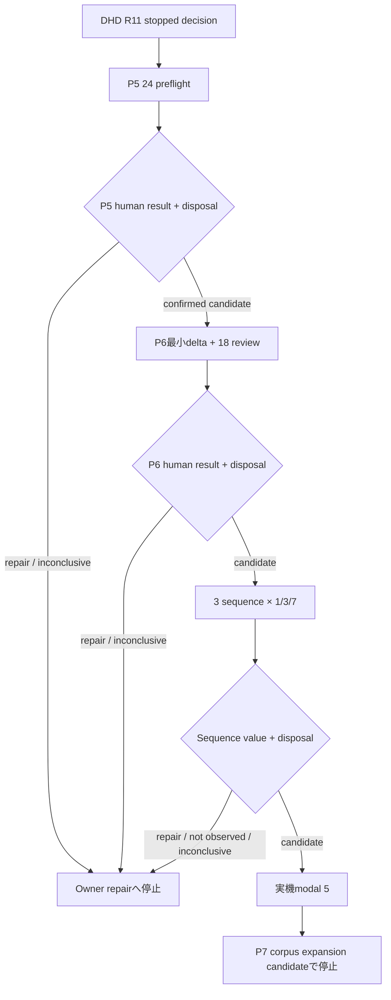

# Cocolon / EmlisAI P7 Post-DHD Readfeel Reconnection / Product QA Return 詳細設計書・実装順

作成日: 2026-07-10 JST  
作成者: 華恋  
作業モード: 共鳴構造モード  
成果物種別: Markdown詳細設計書  
基準検討メモ: `Cocolon_EmlisAI_P7_PostDHD_ReadfeelReconnection_ProductQAReturn_PreDesignMemo_20260710.md`  
対象Phase: P7 Product Quality Runner / Long-run Product Gate  
設計段階ref: `P7-PQR`  
設計名: Post-DHD Readfeel Reconnection / Product QA Return  
GitHub接続確認: Mash様指定により不要。未実施。  
コード変更: なし。  
test変更・実行: なし。  
JSON / schema実ファイル化: なし。本書内の案は実装時に現行実ファイルと再照合して採否を決める。  
actual case生成: なし。  
actual human review: なし。  
API / DB / RN / runtime / public response変更: なし。  
P8 / P9 / release開始: なし。  

---

## 0. この設計書の結論

Post-DHDで進める段階は、次で固定する。

```text
P7-PQR
Post-DHD Readfeel Reconnection / Product QA Return
```

`P7-PQR` は、本書内で設計対象を短く参照するためのprefixである。  
既存のR50〜R55やR54-AHRを置き換える新しいglobal revision、P8開始、production runtime featureを意味しない。

今回の中心判断は、次である。

```text
1. P5 actual reviewのpacket・manual-run・disposal・decision scaffoldは既存R48〜R54を再利用する。
2. P5用scaffoldやR54 wrapperをPost-DHD名で再実装しない。
3. 最初の実行候補は、既存assetを使うP5 24件のactual local review preflightである。
4. P5が人間読感で成立し、body-full disposalまで確認される前にP6実行系を作らない。
5. P5成立後にだけ、P6 actual reviewとcross-lane問い必要性観察に不足する最小差分を実装する。
6. sequenceは3 sequenceを1回目・3回目・7回目で観る。
7. real-device modal 5件は、P5・P6・sequence確認後の最後のlaneとする。
8. actual review、P8、pilot、releaseへ本設計から自動実行しない。
```

設計完了時のstatusは次とする。

```text
P7_PQR_DESIGN_READY_EXISTING_P5_FIRST_P6_MINIMAL_DELTA_LATER_CLOSED_STOPPED
```

これは本書内の設計結果labelであり、production enumや既存R50〜R55 statusの追加を意味しない。

最初の次候補は次とする。

```text
P5_ACTUAL_LOCAL_REVIEW_PREFLIGHT_WITH_EXPLICIT_CURRENT_MATERIAL
```

ただし、現行DHD R11の `current execution allowance = none` を本書が変更することはない。  
actual local reviewを始めるには、別の明示実行指示、current snapshot、local review root、R50 / R51のscoped explicit allow、body source、purge planの全てが必要である。

```text
DHD current execution allowance = none:
  本設計時点のglobal停止状態

supplied user execution instruction ref:
  将来の別指示を示すbody-free ref

R50 scoped body-full allow:
  COCOLON_EMLIS_P7_R50_ALLOW_BODY_FULL_PACKET
  token ref LOCAL_ONLY_REVIEW_CONFIRMED

R51 scoped actual manual-run allow:
  COCOLON_EMLIS_P7_R51_ALLOW_ACTUAL_LOCAL_MANUAL_RUN
  token ref LOCAL_ONLY_ACTUAL_REVIEW_CONFIRMED

R54 scoped local-review result-handoff allow:
  COCOLON_EMLIS_P7_R54_LOCAL_REVIEW_EXPLICIT_ALLOW
  token ref R54_LOCAL_ONLY_ACTUAL_REVIEW_CONFIRMED
```

scoped allow tokenだけでDHDのglobal停止を暗黙解除しない。  
token body / environment valueはbody-free materialへ保存しない。

### 0.1 新規実装必要性の最終判断

本設計時点の判断は、次である。

```text
Post-DHD plan coordinator:
  初手では作らない。

P5 packet / manual-run / disposal helper:
  新規不要。既存R48〜R54を採用する。

P6 actual review helper:
  P5成立後にだけ必要性を再確認する。
  現状ではR47にpolicyはあるが、P6専用actual packet/session ownerは確認できない。

cross-lane question-need observation delta:
  P5 review前に、2026-07-06 roadmap差分を失わないbody-free sidecar formが必要。
  P5ではR49 exact rowを置換せず、同じreview時にsidecarを1件ずつ取得する。
  P6 / sequenceではP5成立後に同じ意味境界のminimal deltaが必要。
  R49 rowはP5 review_kind固定であり、P6 / sequence / modalへそのまま転用できない。

Free向け軽い1問candidate overlay:
  最小差分が必要。
  R49を破壊変更せず、primary reasonとは別のplan candidate refとして扱う。
```

したがって、今すぐ新規production helperを増やすことを実装開始とはしない。  
最初に既存assetでP5のactual human readfeelへ戻り、actual evidenceが次に必要な差分を限定してから実装する。

### 0.2 minimum setの固定値

最初のProduct QA returnで扱うrole-specific review unitは、次の56 unitとする。

| lane | unit数 | 性質 |
|---|---:|---|
| P5 Human Blind QA | 24 | R48既存matrixをexact adoption |
| P6 limited human readfeel | 18 | R47既存minimumをexact adoption |
| continued-input sequence checkpoint | 9 | 3 sequence × 1 / 3 / 7 checkpoint |
| real-device modal | 5 | R47既存minimum。既存sourceにlinkする別review kind |
| 合計 | 56 | unique body source数ではない |

追加の会計を次で固定する。

```text
base local readfeel cases:
  P5 24 + P6 18 = 42

continued-input:
  3 sequence threads
  7 ordered inputs per thread
  human review checkpoints 1 / 3 / 7
  checkpoint review units = 9

real-device:
  linked modal review units = 5

role-specific human review units total:
  42 + 9 + 5 = 56

human readfeel primary rating rows:
  P5 24 + P6 18 + sequence 9 = 51

question-need primary observation rows:
  P5 24 + P6 18 + sequence 9 = 51

P5 roadmap-delta sidecar rows:
  24
  P5 primary rowと1:1で追加review unitには数えない

modal question-need linkage memo rows:
  5

question-need memo units total:
  51 + 5 = 56
```

56は、P7最終corpusの達成数でも、unique input数でも、unique body数でもない。  
P7最終目標のsingle input 150、sequence 30、history-line eligible 30、question-system eligible 30、refined-observation eligible 30は別に残る。

---

## 1. なぜこの作業を行うのか

Cocolonの価値は、境界helperが増えたことでも、testが大量に通ったことでもない。

EmlisAIが目指すのは、入力直後に、ユーザーが次のように感じられる状態である。

```text
置いた言葉が、ただ処理されたのではない。
今の自分に起きている関係が、少し外側から見えた。
勝手に原因や人格を決められず、自分の記録が読まれた形で返った。
またここに残してみたい。
```

DHD target 294 passed、selected regression 865 passed、optional product-readfeel regression 15 passedは、現行snapshotのcontract整合を示す。  
しかし、それらは人間がactual surfaceを読み、`read_feeling` や `wants_more_input_or_accumulation` を確認した証明ではない。

本設計の目的は、内部安全を保ったまま、actual human readfeelへ最短で戻ることである。

そのため、次を両立する。

```text
- body leak、暗黙fallback、synthetic evidence、test greenの誤昇格を許さない。
- 内部境界の追加を目的にせず、P5 24件を本当に人間が読む地点へ戻る。
- P5が成立しなければP6や問いへ逃げず、actual evidenceを基にrepairへ戻る。
- P5が成立した場合だけ、P6・sequence・modalへ小さく進む。
```

`wants_more_input_or_accumulation` は補助指標ではない。  
「ここへ残すと、自分の言葉が意味を持つ」「次もここへ置きたい」というCocolon固有価値の中心として扱う。

---

## 2. 設計対象と停止境界

### 2.1 本設計で決めること

```text
- DHD R11 stopped decisionのexact intake
- 既存R46〜R55 / R54-AHR assetのowner / non-owner境界
- P5 / P6 / sequence / modalのminimum setと数え方
- review laneの一方向順序
- human ratingとmachine metricの分離
- body-full / body-free / retention / disposal境界
- question-need observationのP5 exact adoptionとcross-lane最小差分
- Free / Plus / Premium candidateをprimary reasonと分離する方法
- continued-input valueの1 / 3 / 7 checkpoint設計
- external pilot readinessをcandidate materialに留める方法
- 実装順、actual operation順、validation、停止条件
```

### 2.2 本設計でしないこと

```text
- actual case本文の生成
- body-full packetのmaterialize
- actual human reviewの開始
- reviewer rating / blocker / question rowの実記入
- current DHC-OP08 materialやDHR-OP05 wrapperの推定・合成
- DHR-OP06 / DHR-OP07 / DMD / R52 actual call
- P8問いシステム詳細設計
- question text / answer / refined observation本文生成
- 問い発生ロジック、plan guard、保存schema、販売仕様の確定
- API / DB / RN / runtime / response key変更
- P7 complete、Product Pass、Release Ready、P9 pilot開始、release判断
```

### 2.3 設計と実装の分離

本書内のJSON / schemaは、契約差分を見えるようにする設計案である。  
本書作成だけで次を主張しない。

```text
schema implemented = false
helper implemented = false
test passed = false
actual review prepared = false
actual review started = false
```

---

## 3. 参照・確認範囲

### 3.1 基準資料

```text
Cocolon_EmlisAI_longterm_roadmap_20260608_P7P8_question_need_observation_20260619.md
  最終差分更新: 2026-07-06 JST / 問いシステム正式再配置

Cocolon_EmlisAI_P7_PostDHD_ReadfeelReconnection_ProductQAReturn_PreDesignMemo_20260710.md
```

### 3.2 思想・作業姿勢

```text
Cocolon_前提資料/00_karen_read_first.md
Cocolon_前提資料/07_latest_snapshot_diff.md
Cocolon_前提資料/cocolon_thought_material_for_karen.md
Cocolon_前提資料/emlis_ai_state_answer_human_follow_definition_2026_05_26.md
Cocolon_前提資料/cocolon_environment_state_output_observation_structure_design_2026_05_25.md
Cocolon_前提資料/emlis_ai_correction_policy_withdrawal_retention_redesign_2026_05_31.md
Cocolon_前提資料/work_attitude_rules_for_karen/99_integrated_paste_each_time.txt
```

### 3.3 直接採用する設計・実装owner

```text
P3 Product Read Feel baseline
P5 User Label Connection
P6 Structure Insight
P7 Product Quality Runner / Long-run Product Gate
P7-R46 P5/P6 handoff / real-device checklist
P7-R47 local review packet policy
P7-R48 P5 actual review packet
P7-R49 P5 actual review execution / question-need observation
P7-R50 P5 manual run decision
P7-R51 P5 actual local manual run controller
P7-R52 P6/P8 start decision separation
P7-R53 actual evidence materialization boundary
P7-R54 current-snapshot P5 result handoff
P7-R55 historical evidence reconcile boundary
P7-R54-AHR Post-DHC Direction Decision Boundary / DHD R11
```

### 3.4 直接確認した主な現行実ファイル

```text
mashos-api/ai/services/ai_inference/
  emlis_ai_p7_event_bridge.py
  emlis_ai_p7_blind_qa_material.py
  emlis_ai_p7_long_run_gate_handoff.py
  emlis_ai_product_readfeel_long_run_product_gate.py
  emlis_ai_p7_r46_p5_p6_human_readfeel_handoff_material.py
  emlis_ai_p7_r46_real_device_modal_review_closed_validation.py
  emlis_ai_p7_r47_local_review_packet_policy.py
  emlis_ai_p7_r48_p5_human_blind_qa_actual_review_packet.py
  emlis_ai_p7_r49_p5_human_blind_qa_actual_review_execution.py
  emlis_ai_p7_r50_p5_human_blind_qa_manual_run_decision.py
  emlis_ai_p7_r51_p5_human_blind_qa_actual_local_manual_run.py
  emlis_ai_p7_r52_r51_handoff_p6_p8_start_decision_gate.py
  emlis_ai_p7_r53_r51_actual_local_review_execution_evidence_materialization.py
  emlis_ai_p7_r54_p5_human_blind_qa_actual_local_review_result_handoff.py
  emlis_ai_p7_r55_r54_evidence_reconcile_r52_reintake_decision_materialization.py
  emlis_ai_p7_r54_ahr_post_dhc_direction_decision_boundary_20260709.py
  emlis_ai_user_label_connection_product_quality_qa.py
  emlis_ai_structure_insight_p6_product_quality_review.py
  emlis_ai_structure_insight_p6_quality_rubric.py
```

### 3.5 根拠の優先

```text
実装・現状・実行有無:
  current helper / test / result memo

Phase目的・商品価値:
  current roadmap / Cocolon思想 / EmlisAI正本

既存contract:
  current helperと実装済み詳細設計を照合

actual human value:
  human review resultだけで判断
```

実装済みであることは、商品価値を確認済みにする理由ではない。  
一方、商品価値を急ぐことも、既存のbody safetyを壊す理由にはしない。

---

## 4. 現在地とexact intake

### 4.1 現在地

```text
current phase:
  P7 Product Quality Runner / Long-run Product Gate

DHD direction:
  DHD_DECISION_P7_READFEEL_RECONNECTION_DESIGN_FIRST

selected next design candidate:
  P7_readfeel_reconnection_product_QA_return_detailed_design

DHD stopped closure:
  DHD_OP08_P7_READFEEL_RECONNECTION_DESIGN_CLOSED_STOPPED

current execution allowance:
  none
```

### 4.2 DHD intakeで固定すること

```text
dhd_op08_schema_version_ref:
  cocolon.emlis.p7_r54.ahr.post_dhc.dhd.op08_stopped_next_design_decision_closure.bodyfree.v1

dhd_op08_contract_ref:
  assert_p7_r54_ahr_post_dhc_dhd_op08_stopped_next_design_decision_closure_contract

current production DHC-OP08 material inferred:
  false

current production DHR-OP05 wrapper inferred:
  false

automatic execution:
  false
```

### 4.3 intake禁止事項

次をしてはいけない。

```text
- DHD R11 memoからcurrent DHC resultを合成する。
- default builderで欠けたcurrent materialを埋める。
- R46 summaryの省略引数によるP5/P6 default materialをactual evidence扱いする。
- R48 default 24 slotをcurrent body source解決済みと扱う。
- event bridgeのmissing sequenceをlength=1へ丸め、actual sequence確認済みと扱う。
- validation greenをexecution permissionへ変換する。
```

### 4.4 現在未確認のまま残すこと

```text
- current body source
- current P5 24 case refsの全解決
- current local review root
- explicit body-full generation allow
- actual reviewer
- actual rating / blocker / question observation rows
- P5 / P6 / sequence / modalのhuman verdict
- P7 final corpus coverage
- P9 pilot readiness
```

---

## 5. 既存asset採用と不足差分

### 5.1 adoption matrix

| 必要な責務 | 採用owner | 採用方法 | Post-DHDで再実装しないもの |
|---|---|---|---|
| DHD方向判断・停止 | DHD OP08 / R11 | exact ref + assert | DHC/DHR material推定 |
| P5/P6 family・axis・threshold | R46 | constants / contract exact adoption | family・threshold再定義 |
| local root・export denylist・72h/24h・disposal | R47 | exact policy adoption | storage / retention schema |
| P5 24-case matrix | R48 | exact matrix adoption | P5 slot / blind ID生成の再実装 |
| P5 rating / blocker / question schema・normalizer | R48 / R49 | exact adoption | normalizer複製 |
| P5 question-need row | R49 | P5に限りexact adoption | P6/modalへの暗黙転用 |
| P5 GO/NO_GO / preflight | R50 | exact adoption | 新manual-run decision chain |
| P5 capture / pause / purge / receipt lifecycle boundary | R51 | exact adoption | body writer / controller再実装 |
| P5 evidence materialization connection | R53 | supplied actual evidence時だけ採用 | missing evidenceの合成 |
| sanitized P5 current result handoff | R54 | R53後のsupplied current materialのみ採用 | snapshot wrapper追加連鎖 |
| P6/P8/release分離 | R52 / R55 | decision boundary参照 | actual evidence前の再実行 |
| sequence metadata・scorecard | P7 event bridge | exact schema adoption | missing値のdefault evidence化 |
| 1 / 3 / 7 value comparison | P7 long-run handoff | explicit rowsがある時だけ採用 | machine metricでhuman rating補完 |
| real-device checklist | R46 / R47 | exact 5-family / axis adoption | RN testを実機確認扱い |

### 5.2 既存だけで表現できるもの

```text
- P5 24 caseのfamily配分
- P5 local-only packet / blind review / rating / blocker / disposal contract
- P5 question-need observation
- P5 manual GO / NO_GO / blocked判断
- P6 18 caseのminimumとreadfeel policy
- modal 5 caseのminimumとaxis
- P7 scorecard rowとsequence metadata
- 1 / 3 / 7のbody-free long-run aggregation
- Product Pass候補とreleaseの分離
```

### 5.3 確認できた不足差分

```text
GAP-01:
  R49 question-need rowはreview_kindがP5 history-line readfeelに固定されている。
  P6 / sequence / modalへ同じrow contractをそのまま使えない。

GAP-02:
  R49 plan candidate flagsに、2026-07-06 roadmapのFree向け軽い1問候補refがない。

GAP-03:
  R47にはP6 packet policyはあるが、P5のR48〜R51に相当するP6 actual packet/session ownerは確認できない。

GAP-04:
  3 sequence × 1 / 3 / 7のhuman checkpoint planを所有するactual review manifestは確認できない。
```

### 5.4 不足差分の扱い

GAP-01〜GAP-04を理由に、P5 actual reviewをさらに先送りしない。

```text
P5:
  existing assets first

P6 / sequence / modal:
  P5 human resultがconfirmed candidateになった後にだけ最小deltaを実装

R49:
  破壊変更しない

Post-DHD coordinator:
  初手では作らない
```

P5が不成立なら、GAP-01〜GAP-04の実装へ進まず、actual evidenceに基づくrepairへ戻る。

---

## 6. 全体構造



どの矢印もautomatic executionではない。  
各laneの入口でcurrent material、明示許可、body safety、前laneのdisposalを確認する。

### 6.1 一方向gate

```text
P5未確認:
  P6を開始しない。

P5 repair / inconclusive:
  P6用helperを作らない。

P6未確認:
  sequence / modalへ進まない。

sequence candidate / disposal未確認:
  modalを開始しない。

modal未確認:
  P7 complete / pilot readyを主張しない。
```

### 6.2 repair return

repairへ戻る場合は、actual evidenceから最大1〜2 blockerに絞る。

```text
candidate owner:
  Emlis core readfeel
  P5 history-line surface
  P6 Structure Insight boundary
  Gate boundary
  RN modal layout
```

新しいboundary系列を作って問題を遠ざけない。

---

## 7. minimum setと会計

### 7.1 review unitの定義

`review unit` は、特定のreview kindと評価軸で人間が1回判断する単位である。

同じsource bodyへlinkしても、P5、P6、sequence checkpoint、modalは目的とaxisが異なるため、review unitを相殺しない。

一方、56をunique source body数とは扱わない。

```text
same-source linking:
  allowed

cross-review-kind count deduplication:
  not allowed

unique source body count:
  unresolved until current linkage is fixed

unique source body count inferred from 56:
  false
```

### 7.2 固定会計

| field | 固定値 |
|---|---:|
| `p5_review_unit_count` | 24 |
| `p6_review_unit_count` | 18 |
| `local_readfeel_review_unit_count` | 42 |
| `sequence_thread_count` | 3 |
| `sequence_event_count_per_thread` | 7 |
| `sequence_checkpoint_count_per_thread` | 3 |
| `sequence_checkpoint_review_unit_count` | 9 |
| `modal_review_unit_count` | 5 |
| `total_role_specific_review_unit_count` | 56 |
| `human_readfeel_primary_rating_row_count` | 51 |
| `question_need_primary_observation_row_count` | 51 |
| `p5_question_roadmap_delta_sidecar_count` | 24 |
| `modal_question_linkage_memo_count` | 5 |
| `question_need_memo_unit_count` | 56 |

### 7.3 何を合格扱いしないか

このminimum setを完了しても、次は自動成立しない。

```text
P7 single input 150 achieved:
  false

P7 sequence 30 achieved:
  false

P7 history-line eligible 30 achieved:
  false

question-system eligible 30 achieved:
  actual classified count次第

refined-observation eligible 30 achieved:
  actual classified count次第

P7 complete:
  false

P9 pilot ready:
  false
```

---

## 8. P5 Human Blind QA 24件

### 8.1 case配分

R48既存matrixをexact adoptionする。

| family | 件数 |
|---|---:|
| `history_line_eligible_input` | 4 |
| `standard_state_answer_owned_history` | 4 |
| `self_understanding_owned_history` | 3 |
| `uncertainty_support_owned_history` | 3 |
| `change_future_intention_owned_history` | 3 |
| `relationship_gratitude_recovery_owned_history` | 3 |
| `low_information_history_not_eligible` | 2 |
| `free_tier_history_present_not_allowed` | 2 |
| 合計 | 24 |

### 8.2 P5で確認すること

```text
- current inputが主であり、historyが現在入力を補完・上書きしていない。
- 履歴線が「自分の記録が返ってきた」感につながる。
- 監視感、いつも断定、人格・原因断定がない。
- low informationを履歴で深読みしない。
- Free tierでhistory lineを使わない。
- 自己責めを増幅しない。
- 追記が浅い言い換えではない。
- また残したい感覚がある。
```

### 8.3 P5 rating axesとthreshold

| axis | target |
|---|---:|
| `history_connection_naturalness` | 0.90 |
| `creepy_absence` | 0.95 |
| `overclaim_absence` | 0.95 |
| `self_blame_non_amplification` | 0.95 |
| `wants_more_input_or_accumulation` | 0.85 |
| `non_shallow_repeat` | 0.90 |

thresholdは既存R46/R47の正本を参照し、本書の値で別contractを作らない。

### 8.4 P5 history surface

既存R47境界を維持する。

```text
max history record surfaces:
  3

minimum evidence record count when history line expected:
  2

identifier:
  no DB id / no user id

created_at:
  bucketed or relative only

raw memo full dump:
  forbidden

surface:
  bounded / local-only
```

### 8.5 P5の出口

P5の出口は、次のいずれかである。

```text
P5_CONFIRMED_CANDIDATE_STOPPED
P5_REPAIR_RETURN_STOPPED
P5_REVIEW_INCONCLUSIVE_STOPPED
P5_EXECUTION_BLOCKED_STOPPED
P5_BODY_DISPOSAL_NOT_VERIFIED_STOPPED
```

`P5_CONFIRMED_CANDIDATE_STOPPED` だけが、P6最小差分設計・実装の入口候補になれる。  
confirmed candidateはP5 final、P7 complete、release readyではない。

---

## 9. P6 Structure Insight limited human readfeel 18件

### 9.1 開始条件

P6は次の全条件が成立した場合にだけ開始候補になる。

```text
- P5 24件のactual human reviewが完了している。
- P5 rating / blocker / question observationがbody-free化されている。
- P5 body-full packetとreviewer notesのdisposalがverifiedである。
- P5 RED / REPAIR blockerが0、または全てtriaged済みでP5 confirmed candidateが成立している。
- current P6 source case refsが解決できる。
- P6 actual packet/sessionの最小deltaが実装・target validation済みである。
- explicit local-only allowとpurge planがある。
- supplied user execution instruction refがある。
```

P5のtest green、設計完了、synthetic 24 slotだけでは開始できない。

### 9.2 P6 case配分

R47既存minimumをexact adoptionする。

#### review family

| family | 件数 |
|---|---:|
| `structure_question` | 4 |
| `long_meaning_arc` | 4 |
| `self_understanding_follow` | 4 |
| 小計 | 12 |

#### no-connect audit

| family | 件数 |
|---|---:|
| `daily_unpleasant` | 1 |
| `daily_positive` | 1 |
| `positive_only` | 1 |
| `low_information` | 1 |
| `limited_grounding_insufficient` | 1 |
| `safety_triage_required` | 1 |
| 小計 | 6 |

合計は18件とする。

### 9.3 alias reconciliation

現行P7 event bridgeには、R47表記と異なる広いaliasがある。  
実装時は、case familyを推測置換せず、次のbody-free alias tableを明示的に固定する。

```text
canonical ref:
  R47 first formal review family / no-connect family

source family ref:
  current event / corpus上のref

normalization status:
  EXACT
  EXPLICIT_ALIAS
  UNRESOLVED

UNRESOLVED:
  review preparation blocked
```

`low_information_short` を自動で `low_information`、`limited_grounding` を自動で `limited_grounding_insufficient` と扱わない。  
current caseの意味とGate結果を確認して明示mapする。

### 9.4 P6 rating axesとthreshold

| axis | target |
|---|---:|
| `structure_insight_candidate_quality` | 0.90 |
| `relation_seen_feeling` | 0.85 |
| `overclaim_absence` | 0.95 |
| `diagnosis_absence` | 1.00 |
| `creepy_absence` | 0.95 |
| `advice_pressure_absence` | 0.95 |
| `wants_more_input_or_accumulation` | 0.85 |

### 9.5 P6で確認すること

```text
- 復唱を超えて、入力内の関係が少し外側から見える。
- 原因、人格、診断、相手評価を作っていない。
- 「勝手に見抜かれた」不快さがない。
- current inputの根拠で成立している。
- P5 history lineの代替になっていない。
- no-connect familyへStructure Insightが漏れていない。
- advice pressureがない。
- modalへ出た時に重すぎない。
- また入力したい感覚につながる。
```

### 9.6 P6 actual implementationの最小責務

P5成立後、現行snapshotでP6 ownerが依然不足している場合に限り、次を実装候補とする。

```text
required responsibility:
  - supplied P5 confirmed / disposal verified materialのassert
  - explicit P6 18-case manifestのvalidation
  - blind case IDとsource case refの分離
  - R47 local root / export denylist / retention / disposalの採用
  - P6 reviewer packet protocol
  - P6 rating / blocker / execution blockerのbody-free normalize
  - cross-lane question-need observationへの接続
  - P6 body-free summary / candidate / repair / inconclusive
  - no body / no question text / no promotion guard

forbidden responsibility:
  - P5 R48〜R54の再実装
  - runtime Emlis生成変更
  - default 18-case synthetic evidence
  - body-full export
  - machine scoreからhuman rating生成
  - P8 / pilot / release開始
```

候補file名は設計上の例に留める。

```text
emlis_ai_p7_p6_limited_human_readfeel_actual_review.py
```

実装時にcurrent file collision、既存owner、責務分割を再確認し、実ファイル化するかを決める。

### 9.7 P6の出口

判定を次で固定する。

```text
P6_CANDIDATE_STOPPED:
  P5 confirmed + P5 disposal verified
  18 / 18 rating or no-connect audit rows
  review-family 12 / no-connect 6 exact
  axisごとのapplicable_row_count_observed == expected
  review-family positive axesがR46 target以上
  safety / pressure / wants-more axesがR46 target以上
  no-connect insight_absence_observed = true for 6 / 6
  no-connect insight leak count = 0
  18 / 18 human-provenance question observation rows
  manual reason mapping REQUIRED count = 0
  interrogation / self-blame / immediate-delay unresolved risk count = 0
  open readfeel / gate / execution blocker count = 0
  body leak / export count = 0
  disposal receipt verified

P6_REPAIR_RETURN_STOPPED:
  materialとhuman rowは完備
  1つ以上のtarget未達
  またはno-connect insight leak
  またはdiagnosis / overclaim / creepy / advice pressure blocker

P6_REVIEW_INCONCLUSIVE_STOPPED:
  human reviewerがINCONCLUSIVEを残した
  またはsemantic / plan mappingがUNRESOLVED

P6_EXECUTION_BLOCKED_STOPPED:
  source / alias / authorization / reviewer / validation / scope prerequisite不成立

P6_BODY_DISPOSAL_NOT_VERIFIED_STOPPED:
  body / notes purgeまたはreceipt未確認
```

missing required rowを分母から外してcandidateにしない。  
hard safety failureを平均点で相殺しない。

```text
P6_CANDIDATE_STOPPED
P6_REPAIR_RETURN_STOPPED
P6_REVIEW_INCONCLUSIVE_STOPPED
P6_EXECUTION_BLOCKED_STOPPED
P6_BODY_DISPOSAL_NOT_VERIFIED_STOPPED
```

P6 candidateだけでP7 completeやP8 startを許可しない。

---

## 10. continued-input sequence 3本 × 1 / 3 / 7

### 10.1 sequenceを3本にする理由

1本だけでは、特定caseの偶然を継続価値として一般化しやすい。  
一方、最初からP7最終目標30 sequenceを要求すると、actual readfeelへ戻る前段が重くなる。

最初のminimumでは、既存long-run handoffが扱うhistory-line familyのうち、商品価値の異なる次の3本を選ぶ。

| sequence family | 主に見る価値・リスク |
|---|---|
| `long_meaning_arc` | 内面・意味の連続性、P6 relation、過読 |
| `relationship_gratitude_recovery` | 関係の連続性、creepyさ、相手評価の捏造 |
| `change_future_intention` | 変化・未来意図の連続性、過去による現在の固定 |

この3 familyは、現行event bridge / long-run handoffでhistory-line eligibleとして扱われる。  
3本のcheckpoint 7があるため、既存long-run reportの「length 7 human scoreが3件以上」という候補観察にも接続できる。

これはpassを先に作るための件数選択ではない。  
3つの異なる価値方向を最低限分けるための設計判断である。

### 10.2 sequence構造

各threadは7 ordered input eventを持つ。

```text
sequence thread count:
  3

ordered input event count per thread:
  7

human review checkpoints:
  1, 3, 7

human checkpoint rows:
  3 × 3 = 9
```

checkpoint 7で7件分のraw bodyをreviewer packetへ全dumpしない。  
current inputを主にし、既存P5 policyに従う最大3 recordのbounded history surfaceだけをlocal-onlyで見せる。

3 threadには合計21 input eventが必要だが、人間ratingを付けるのは9 checkpointだけである。  
checkpoint間の12 eventも実在するexplicit local sourceでなければならず、default eventや要約で補わない。  
それらのbodyもlocal-only retention / purge対象とし、body-free成果物にはsafe event refと順序だけを残す。

### 10.3 sequence identity

次を分ける。

```text
sequence_thread_ref:
  同じ仮想user / scenarioの7 eventを束ねるbody-free ref

source_event_ref:
  各ordered eventのsafe ref

checkpoint_ref:
  1 / 3 / 7

scorecard sequence_id:
  existing long-run互換のcheckpoint bucket
  sequence_1 / sequence_3 / sequence_7

sequence_length:
  checkpoint時点の累積長 1 / 3 / 7

sequence_index:
  checkpoint対象eventの位置 1 / 3 / 7
```

現行long-run handoffは `sequence_id` の `sequence_1` / `sequence_3` / `sequence_7` presenceを確認する。  
そのため、scorecardの `sequence_id` をthread固有値へ変えない。

thread identityは `sequence_thread_ref`、row identityは `review_unit_ref` / scorecard `row_id` で保持し、既存 `sequence_id` はcheckpoint compatibility bucketとしてだけ使う。

例:

```text
sequence_thread_ref:
  p7pqr-long-meaning-01

review_unit_ref:
  p7pqr-long-meaning-01-at-1
  p7pqr-long-meaning-01-at-3
  p7pqr-long-meaning-01-at-7

scorecard sequence_id:
  sequence_1
  sequence_3
  sequence_7
```

`sequence_thread_ref` と `scorecard sequence_id` の役割を逆転させない。

### 10.4 sequence human observation

各checkpointでP7 scorecard dimensionsに基づくratingを人間が付ける。  
加えて、前checkpointとの比較をbody-free enumで残す。

```text
value_change_vs_previous_checkpoint:
  NOT_APPLICABLE_FIRST
  CLEARLY_INCREASED
  SLIGHTLY_INCREASED
  MAINTAINED
  DECREASED
  INCONCLUSIVE

history_role_ref:
  NO_HISTORY_LINE
  HISTORY_LINE_HELPED_CURRENT_INPUT
  HISTORY_LINE_NEUTRAL
  HISTORY_LINE_OVERRIDDEN_CURRENT_INPUT
  HISTORY_LINE_CREEPY_OR_OVERREAD
  INCONCLUSIVE

wants_more_input_change_ref:
  INCREASED
  MAINTAINED
  DECREASED
  INCONCLUSIVE
```

checkpoint 1に対して、`value_change_vs_previous_checkpoint` は `NOT_APPLICABLE_FIRST` のみ許可する。

### 10.5 既存long-run handoffへの接続

explicit scorecard rowsが揃った場合だけ、既存 `build_p7_long_run_gate_handoff` へbody-free materialを渡す。

既存集約が見る中心:

```text
- sequence 1 / 3 / 7 coverage
- average score by sequence length
- value increase 1 to 3
- value maintenance / increase 3 to 7
- creepy / overclaim risk
- repetition
- mirror-only
- P6 visible expansion violation
```

machine aggregationはhuman rowを集約してよいが、missing human scoreを補完してはいけない。

### 10.6 sequenceの出口

判定を次で固定する。

| 条件 | 文書内出口label |
|---|---|
| thread / event / checkpoint / rating / question row不足、source unresolved | `SEQUENCE_MATERIAL_INSUFFICIENT_STOPPED` |
| 1件以上のINCONCLUSIVE、かつhard riskなし | `SEQUENCE_INCONCLUSIVE_STOPPED` |
| history override / creepy / overread / repetition / mirror-only / visible-expansion blockerあり | `SEQUENCE_CREEPY_OR_OVERREAD_REPAIR_STOPPED` |
| material完備・hard riskなしだがvalue条件未達 | `SEQUENCE_VALUE_NOT_OBSERVED_STOPPED` |
| 以下のcandidate条件を全て満たす | `SEQUENCE_VALUE_CANDIDATE_OBSERVED_STOPPED` |

candidate条件:

```text
- 3 thread × 1 / 3 / 7が完全。
- checkpoint 3は各threadでCLEARLY_INCREASEDまたはSLIGHTLY_INCREASED。
- checkpoint 7は各threadでCLEARLY_INCREASED / SLIGHTLY_INCREASED / MAINTAINED。
- checkpoint 3 / 7のwants_more_input_changeにDECREASED / INCONCLUSIVEがない。
- history roleにOVERRIDDEN / CREEPY_OR_OVERREAD / INCONCLUSIVEがない。
- existing long-run history_line_value_increase_observed = true。
- existing long-run risk row count = 0。
- open blocker = 0。
- sequence local-only body disposal verified。
```

missing rowを平均分母から外してcandidateにしない。  
existing long-run aggregationだけでも、新しいhuman enumだけでもcandidateにしない。

```text
SEQUENCE_VALUE_CANDIDATE_OBSERVED_STOPPED
SEQUENCE_VALUE_NOT_OBSERVED_STOPPED
SEQUENCE_CREEPY_OR_OVERREAD_REPAIR_STOPPED
SEQUENCE_MATERIAL_INSUFFICIENT_STOPPED
SEQUENCE_INCONCLUSIVE_STOPPED
```

3 sequence完了はP7最終30 sequence達成ではない。

---

## 11. real-device modal 5件

### 11.1 実行位置

modalは次の後にqueueする。

```text
P5 candidate + disposal verified
→ P6 candidate + disposal verified
→ sequence candidate observation
→ modal 5
```

理由は、modalで読むsurfaceの中身がP5 / P6段階で未成立なら、layout readfeelだけを先に通しても商品QAにならないためである。

### 11.2 required family

R47既存minimumをexact adoptionする。

| family | 最低件数 |
|---|---:|
| `free_standard_state_answer_no_history_line` | 1 |
| `plus_history_line_eligible` | 1 |
| `plus_history_line_blocked_low_information` | 1 |
| `p6_structure_question_visible` | 1 |
| `p6_daily_positive_no_connect` | 1 |
| 合計 | 5 |

### 11.3 device context

```text
minimum device contexts:
  1

recommended:
  small_phone
  medium_phone

minimum first review:
  5
```

minimumは1 device contextだが、可能ならsmall / mediumの両方を確認する。  
ただし2 deviceで同じ5 familyを確認した場合、追加5 review unitとして別会計し、first minimum 5を満たしただけで10と推測しない。

### 11.4 modal axes

```text
readable_on_phone
length_pressure_absence
weight_absence
shallow_absence
p5_history_line_creepy_absence
p6_overread_absence
wants_more_input
```

### 11.5 source linkage

modal 5件は、P5 / P6で人間確認済みのsource caseへlinkする。

minimumで許可するlink候補を次とする。

| modal family | linked lane / source family candidate | 追加確認 |
|---|---|---|
| `free_standard_state_answer_no_history_line` | P5 `free_tier_history_present_not_allowed` | actual returned surfaceがhistory lineなしのstandard state answerである |
| `plus_history_line_eligible` | P5 `history_line_eligible_input` | actual history lineがvisibleである |
| `plus_history_line_blocked_low_information` | P5 `low_information_history_not_eligible` | actual history lineがblockedである |
| `p6_structure_question_visible` | P6 `structure_question` | actual P6 surfaceがvisibleである |
| `p6_daily_positive_no_connect` | P6 `daily_positive` | actual no-connectが維持される |

family名だけでlinkを成立させず、actual surface roleをbody-free statusで確認する。

```text
linked_review_unit_ref:
  required

linked_body_source_ref:
  local-only manifest内のみ

body-free summary:
  safe review refのみ

new unique source body allowed in this minimum modal set:
  false

exact linked source unavailable:
  MODAL_SOURCE_LINK_MISMATCH_STOPPED
```

同じsourceへlinkしても、modalは別review kindなので5 unitを維持する。

required familyに合うP5 / P6 sourceがなければ、似たfamilyへ暗黙linkしたり、件数を保つために新bodyを足したりしない。  
material insufficientとして止め、minimum setの再設計を行う。

### 11.6 question-need memo

modalは入力意味のprimary classificationを重複作成しない。  
同じ `linked_review_unit_ref` を持つP5 / P6 question observationだけを参照し、device presentation上の負担を5件それぞれで残す。  
sequence question observationへのlinkは、このminimum modal setでは許可しない。

```text
linked_question_need_observation_ref:
  required

linked question row source identity:
  must equal linked review unit source identity

question_burden_on_device_ref:
  NOT_APPLICABLE_NO_QUESTION_CANDIDATE
  ACCEPTABLE_CANDIDATE
  WOULD_FEEL_HEAVY
  WOULD_DELAY_IMMEDIATE_OBSERVATION
  INCONCLUSIVE
```

これにより、ロードマップの「実機modal各評価caseへbody-free memo」を満たしつつ、同じ意味判断を二重集計しない。

### 11.7 実機とRN testの分離

```text
RN screen contract green:
  code contract evidence

real-device modal reviewed:
  human device evidence

RN green implies real-device readfeel:
  false
```

screenshot、visible modal text、layout noteはlocal-only materialであり、P7 body-free summaryやrelease materialへ入れない。  
screenshotはR47 reviewer packet allowed fieldではなく、packet外のseparate local-only device evidenceとして扱う。

### 11.8 modalの出口

R46 checklistへ次のように接続する。

```text
candidate:
  case_ref_count = 5
  required family exact coverage
  5 modal rating rows complete
  5 question linkage memos complete
  all source identity matches
  result = PASS
  modal contract checks = passed or justified not_applicable
  readfeel checks = passed or justified not_applicable
  real_device_modal_review_confirmed = true
  body_leak_observed = false
  gate_relaxed_observed = false
  disposal verified

repair:
  complete human evidence上でreadfeel / layout check failed

source link mismatch:
  linked review unit / question row / actual surface role不一致

inconclusive:
  NOT_RUN、missing row、missing axis、unknown device context

body safety stop:
  body leak、export、disposal failure
```

missing scoreやNOT_RUNを `not_applicable` へ変換しない。

```text
MODAL_READFEEL_CANDIDATE_STOPPED
MODAL_REPAIR_REQUIRED_STOPPED
MODAL_SOURCE_LINK_MISMATCH_STOPPED
MODAL_BODY_DISPOSAL_NOT_VERIFIED_STOPPED
MODAL_INCONCLUSIVE_STOPPED
```

---

## 12. Human rating設計

### 12.1 P7 scorecard dimensions

現行event bridgeのdimensionを、sequence checkpointとP7集約の正本として採用する。

```text
read_feeling
naturalness
non_template
follow_depth
history_connection_naturalness
creepy_absence
wants_more_input_or_accumulation
structure_insight_candidate_quality
overclaim_absence
self_blame_non_amplification
mirror_only_absence
```

これら11 dimensionを、R48のP5 frozen rating rowやR47のP6 lane-specific axis setへ追加しない。  
P5は既存6 axis、P6は既存7 axisをexact adoptionし、sequence checkpointだけがP7 scorecard dimensionを使う。

cross-lane集約で比較してよいのは、同じ意味と尺度を明示確認できるaxisだけである。  
少なくとも `wants_more_input_or_accumulation`、`creepy_absence`、`overclaim_absence` はP5 / P6に共通するが、review kind別集計を保持する。  
適用不能なaxisを高得点やnullで埋めず、別review kindの平均を一つへ潰さない。

### 12.2 lane-specific human rating対象

```text
P5:
  24 rows

P6:
  18 rows

sequence checkpoints:
  9 rows

human readfeel primary rows total:
  51

modal:
  modal-specific axes 5 rows
```

51 rowsは一つの共通rating schemaを意味しない。

```text
P5 24:
  R48 frozen P5 axis_scores exact

P6 18:
  R47 P6 axis setを基準にしたconditional actual-review row

sequence 9:
  P7 scorecard dimensions + checkpoint comparison
```

### 12.2.1 axis applicabilityと集計分母

N/Aを高得点で埋めないため、lane / role別に次を固定する。

| lane / role | required numeric axes | numeric禁止 / 別field | 集計分母 |
|---|---|---|---|
| P5 24 | R48 frozen 6 axes exactly | それ以外のaxisをR48 rowへ追加しない | axisごと24。missing rowは分母縮小せずblocked |
| P6 review-family 12 | R46/R47 P6 7 axes exactly | none | `structure_insight_candidate_quality` / `relation_seen_feeling` は12 |
| P6 no-connect 6 | `overclaim_absence`, `diagnosis_absence`, `creepy_absence`, `advice_pressure_absence`, `wants_more_input_or_accumulation` | `structure_insight_candidate_quality`, `relation_seen_feeling` を数値化しない。`insight_absence_observed` を別booleanで持つ | safety / pressure / wants-moreは18。positive insight 2 axesは12 |
| sequence 9 | P7 scorecard 11 dimensions exactly | checkpoint comparison enumは別field | axisごと9。thread / checkpoint欠落はblocked |
| modal 5 | R47 modal 7 axes exactly | P5 / P6 numeric rowへ混ぜない | axisごと5 |

P6 no-connect 6件の `insight_absence_observed=false` は、positive axisの低得点ではなくno-connect leak blockerである。  
この分母分離は、R47 minimumとP6 targetを矛盾なくhuman reviewへ接続するための本詳細設計上の判断である。

body-free summaryは各axisに次を残す。

```text
axis_ref
applicable_row_count_expected
applicable_row_count_observed
missing_required_row_count
average_score
target_ref
target_met
```

`missing_required_row_count > 0` の時、平均がthreshold以上でもcandidateにしない。

### 12.3 rating source

```text
human reviewer:
  rating / verdict / blockerを記入できる

machine metric:
  coverage / count / consistency / missing / risk flagを集約できる

machine metric:
  human read feelingを自動記入できない
```

### 12.4 verdict

既存R47〜R51のverdict enumを正本とする。  
cross-lane summaryでは、少なくとも次の意味を失わない。

```text
PASS / candidate
REVIEW_REQUIRED / inconclusive
REPAIR_REQUIRED
BLOCKED
```

異なる既存enum間を自動文字列変換する場合は、実装時にexact mapping tableとnegative testを置く。

### 12.5 blocker

次を分ける。

```text
readfeel blocker:
  実際に読んだsurfaceの商品品質問題

execution blocker:
  material、root、allow、row、disposal等の実行条件問題

gate / safety blocker:
  no-connect leak、body leak、public boundary等
```

execution blockerをreadfeel不合格として数えない。  
逆に、material不足をPASSへ丸めない。

---

## 13. 問いシステム必要性観察

### 13.1 P7での目的

P7では問いシステムを実装しない。

見るのは次である。

```text
- Emlisが問いなしで観測できるcase
- 1問で過読・わかったふりを減らせるcase
- 問いを出すと即時観測が重くなるcase
- 問いではなくEmlis core / P5 / P6 / Gateを直すべきcase
- material不足で判断できないcase
```

問いを出すことを良い結果にしない。  
Emlis本体が読むべきcaseを問いへ逃がさない。

### 13.2 P5 exact adoption

P5 24件はR49をexact adoptionする。

```text
schema:
  cocolon.emlis.p7_r49.question_need_observation_row.bodyfree.v1

review_kind:
  P5 history-line readfeel fixed

rows:
  24

question text:
  forbidden

raw answer:
  forbidden
```

#### 13.2.1 2026-07-06 roadmap差分用P5 sidecar

R49だけでは、Free向け軽い1問candidate、問い前の短い仮観測、問い種類、回答affordance等を保持できない。  
body-fullをpurgeした後に人間判断を復元することはできないため、P5 actual review前に24件分のsidecar formを準備する。

```text
R49 row:
  frozen P5 primary observationの正本

P7-PQR sidecar:
  R49 row ref
  explicit reason-family mapping
  2026-07-06 roadmapの追加body-free観察
  plan candidate overlay
  eligibility

replacement of R49:
  false

additional review unit:
  0

required sidecar count:
  24
```

sidecarのsemantic selectionはR49 selectionと同じhuman review sessionで取得するが、blind ratingより先に見せない。  
本文purge前に次の三passを順序固定する。

```text
Pass A / blind readfeel:
  body-full surfaceを読む
  human rating / verdict / blockerをfreeze
  family / tier / expected / gate / plan candidateは見せない

Pass B / blind semantic question-need:
  rating freeze後にprimary reason、ambiguity、question kind、risk、eligibilityをfreeze
  family / tier / plan candidateはまだ見せない

Pass C / body-free plan overlay:
  Pass A / B freeze後
  safe family / tier metadataとPass Bのbody-free selectionだけを使う
  Free / Plus / Premium normal / Premium deep candidateを別passまたは別担当で記録
  body-full surfaceを再表示しない
  Pass A / Bへ戻って編集しない
```

production helperは初手で不要だが、Pass A / B / Cのform順とbody-free保存先はP5開始前に必要である。

### 13.3 R49をcross-laneへ直接使わない理由

R49 assertは `review_kind == P7_R49_REVIEW_KIND` を要求し、case role / R48 manifest / 24-case summaryへ接続している。

したがって、次をしてはいけない。

```text
- P6 rowのreview_kindだけを書き換えてR49 rowと呼ぶ。
- modal rowをP5 rowとして偽装する。
- R49 24-row summaryへP6 / sequenceを混ぜる。
- R49 primary classからP6 repair targetを暗黙推定する。
```

### 13.4 cross-laneで共通化するsummary family

P5のfrozen primary classを壊さず、集約時だけ次のreason familyへ明示mapする。

```text
EMLIS_OBSERVABLE_WITHOUT_QUESTION
ONE_QUESTION_MAY_REDUCE_OVERREAD
QUESTION_WOULD_BURDEN_IMMEDIATE_OBSERVATION
NOT_QUESTION_REPAIR_OR_BOUNDARY
INSUFFICIENT_MATERIAL
```

mappingはrowごとに明示する。  
特にR49の `plus_single_question_candidate_later` / `premium_deep_dive_candidate_later` をprimary reasonとして持つlegacy rowは自動mapしない。  
未解決時は `manual_reason_family_mapping_status_ref = REQUIRED`、人間が明示mapした後は `COMPLETED` とする。

### 13.5 plan candidate overlay

plan候補はprimary reasonと分ける。

```text
NONE
FREE_LIGHT_SINGLE_QUESTION_CANDIDATE_LATER
PLUS_SINGLE_QUESTION_CANDIDATE_LATER
PREMIUM_SINGLE_QUESTION_CANDIDATE_LATER
PREMIUM_DEEP_DIVE_CANDIDATE_LATER
UNRESOLVED
```

ここで決めないもの:

```text
- Free / Plus / Premiumの販売仕様
- 質問回数
- plan guard
- 発生条件
- API / DB / RN
- answer保存
- refined observation本文
```

### 13.5.1 P7で残す追加body-free観察

2026-07-06 roadmapに合わせ、問い本文なしで次を残す。

```text
preliminary_observation_possible_ref:
  AVAILABLE
  NOT_AVAILABLE
  UNRESOLVED

question_kind_candidate_ref:
  NONE
  EVENT_CONFIRMATION
  CORE_CONFIRMATION
  REASON_OR_TRIGGER_CONFIRMATION
  DISTANCE_OR_CHANGE_CONFIRMATION
  UNRESOLVED

answer_affordance_candidate_refs:
  CHOICES
  DONT_KNOW
  CONTINUE_OBSERVATION
  FREE_TEXT
  NOT_APPLICABLE

interrogation_risk_ref:
  ABSENT
  PRESENT
  UNRESOLVED

self_blame_amplification_risk_ref:
  ABSENT
  PRESENT
  UNRESOLVED

immediate_observation_delay_risk_ref:
  ABSENT
  PRESENT
  UNRESOLVED
```

`preliminary_observation_possible_ref` は仮観測本文を含まない。  
`question_kind_candidate_ref` は質問文を含まない。  
`answer_affordance_candidate_refs` はP8 UI仕様確定ではない。

### 13.5.2 全laneのblind / overlay順

P5、P6、sequenceで次の順を共通にする。

```text
1. blind human rating / verdict / blocker freeze
2. blind semantic question-need observation freeze
3. safe metadataによるplan candidate overlay
```

Pass 1 / 2ではfamily、tier、expected result、gate result、plan candidateをreviewerへ見せない。  
Pass 3はbody-free safe metadataだけを使い、Pass 1 / 2の値を変更できない。  
同一担当者がPass 3を行う場合も、UI / file / workflow上で前passをread-onlyにする。

### 13.6 eligibility

各primary observation rowで、本文なしに次だけを残せる。

```text
question_system_eligibility_ref:
  ELIGIBLE
  NOT_ELIGIBLE
  UNRESOLVED

refined_observation_eligibility_ref:
  ELIGIBLE
  NOT_ELIGIBLE
  UNRESOLVED
```

actual `ELIGIBLE` countだけをP7 target 30へ数える。  
plan candidateやreview unit数をeligible件数へ置き換えない。

### 13.7 row数

```text
P5 R49 exact primary rows:
  24

P5 roadmap-delta sidecar rows:
  24
  primary rowと1:1であり追加memo unitには数えない

P6 cross-lane primary rows:
  18

sequence checkpoint primary rows:
  9

primary observation rows total:
  51

modal linked burden memo rows:
  5

question need memo units total:
  56
```

### 13.8 question observation禁止field

```text
raw_input
raw_answer
comment_text
returned_emlis_surface
current_input_review_surface
bounded_history_surface
question_text
draft_question_text
reviewer_free_text
local_absolute_path
body hash / packet hash / raw text hash
```

sanitized reason IDは許可できるが、本文由来hashをreason IDとして使わない。

---

## 14. JSON / schema案

### 14.1 扱い

以下は設計案であり、今回実ファイルを作らない。

実装時に次を再確認する。

```text
- current schema ownerと重複しないか。
- R47 / R48 / R49のfrozen contractを壊さないか。
- JSON Schemaファイルが本当に必要か、Python contractだけで足りるか。
- local operation artifactとして必要か、result memoだけで足りるか。
- file名・配置・versionをcurrent snapshotに合わせられるか。
```

### 14.2 Post-DHD review plan body-free material案

このmaterialは、manual planを機械可読で残す必要が実装時に確認された場合だけ採用する。  
初手でproduction coordinatorを作る根拠にはしない。

```json
{
  "schema_version": "cocolon.emlis.p7.post_dhd.product_qa_return_plan.bodyfree.v1",
  "phase": "P7",
  "stage_ref": "P7-PQR",
  "material_id": "p7-pqr-current-snapshot-plan",
  "design_status_ref": "P7_PQR_DESIGN_READY_EXISTING_P5_FIRST_P6_MINIMAL_DELTA_LATER_CLOSED_STOPPED",
  "dhd_intake": {
    "direction_decision_ref": "DHD_DECISION_P7_READFEEL_RECONNECTION_DESIGN_FIRST",
    "selected_next_design_candidate_ref": "P7_readfeel_reconnection_product_QA_return_detailed_design",
    "stopped_closure_status_ref": "DHD_OP08_P7_READFEEL_RECONNECTION_DESIGN_CLOSED_STOPPED",
    "current_execution_allowance_ref": "none",
    "current_dhc_op08_material_inferred": false,
    "current_dhr_op05_wrapper_inferred": false
  },
  "lane_order": [
    "P5_HUMAN_BLIND_QA_24",
    "P6_LIMITED_HUMAN_READFEEL_18",
    "CONTINUED_INPUT_3_SEQUENCES_9_CHECKPOINTS",
    "REAL_DEVICE_MODAL_5"
  ],
  "counts": {
    "p5_review_unit_count": 24,
    "p6_review_unit_count": 18,
    "local_readfeel_review_unit_count": 42,
    "sequence_thread_count": 3,
    "sequence_event_count_per_thread": 7,
    "sequence_checkpoint_review_unit_count": 9,
    "modal_review_unit_count": 5,
    "total_role_specific_review_unit_count": 56,
    "human_readfeel_primary_rating_row_count": 51,
    "question_need_primary_observation_row_count": 51,
    "p5_question_roadmap_delta_sidecar_count": 24,
    "modal_question_linkage_memo_count": 5,
    "question_need_memo_unit_count": 56
  },
  "sequence_plan": {
    "family_refs": [
      "long_meaning_arc",
      "relationship_gratitude_recovery",
      "change_future_intention"
    ],
    "checkpoint_refs": [1, 3, 7],
    "scorecard_sequence_id_refs": [
      "sequence_1",
      "sequence_3",
      "sequence_7"
    ],
    "thread_identity_held_outside_scorecard_sequence_id": true,
    "p7_final_sequence_target_met_here": false
  },
  "accounting": {
    "same_source_linking_allowed": true,
    "cross_review_kind_count_deduplication_allowed": false,
    "unique_source_body_count_status_ref": "UNRESOLVED_UNTIL_CURRENT_LINKAGE",
    "total_review_units_are_unique_body_count": false
  },
  "known_gap_refs": [
    "r49_question_observation_review_kind_is_p5_only",
    "roadmap_free_light_question_candidate_ref_missing",
    "p6_actual_packet_session_owner_unconfirmed",
    "sequence_human_checkpoint_manifest_owner_unconfirmed"
  ],
  "next_candidate_ref": "P5_ACTUAL_LOCAL_REVIEW_PREFLIGHT_WITH_EXPLICIT_CURRENT_MATERIAL",
  "automatic_execution": false,
  "actual_review_started": false,
  "p7_complete": false,
  "p8_start_allowed": false,
  "p9_pilot_start_allowed": false,
  "release_allowed": false,
  "body_free": true
}
```

### 14.3 asset adoption row案

```json
{
  "asset_ref": "r48_p5_case_matrix",
  "schema_version_ref": "cocolon.emlis.p7_r48.p5_case_matrix.bodyfree.v1",
  "contract_ref": "assert_p7_r48_p5_first_formal_review_case_matrix_contract",
  "adoption_status_ref": "ADOPT_EXACT_BY_REF",
  "scope_limit_refs": [],
  "gap_refs": [],
  "body_free_required": true
}
```

許可status案:

```text
ADOPT_EXACT_BY_REF
ADOPT_WITH_EXPLICIT_ALIAS_RECONCILIATION
ADOPT_EXACT_WITH_SCOPE_LIMIT
GAP_REQUIRES_MINIMAL_DELTA
MISSING_OR_INVALID
NOT_REQUIRED
```

### 14.4 cross-lane question-need observation schema案

R49本体は変更しない。  
P5 rowをexact refで取り込み、P6 / sequenceに不足するbody-free classificationを表現するadapter / delta案である。

```json
{
  "$schema": "https://json-schema.org/draft/2020-12/schema",
  "$id": "cocolon.emlis.p7.cross_lane_question_need_observation.bodyfree.v1",
  "type": "object",
  "additionalProperties": false,
  "required": [
    "schema_version",
    "review_session_id",
    "review_unit_ref",
    "human_reviewer_ref",
    "reviewed_at",
    "observation_source_ref",
    "linked_human_rating_row_ref",
    "review_lane_ref",
    "family_ref",
    "source_contract_mode_ref",
    "source_question_observation_ref",
    "source_primary_class_ref",
    "reason_family_ref",
    "ambiguity_kind_refs",
    "one_question_fit_ref",
    "plan_candidate_ref",
    "preliminary_observation_possible_ref",
    "question_kind_candidate_ref",
    "answer_affordance_candidate_refs",
    "interrogation_risk_ref",
    "self_blame_amplification_risk_ref",
    "immediate_observation_delay_risk_ref",
    "repair_target_refs",
    "question_system_eligibility_ref",
    "refined_observation_eligibility_ref",
    "legacy_plan_class_primary_present",
    "manual_reason_family_mapping_status_ref",
    "plan_overlay_resolver_ref",
    "plan_overlay_resolved_at",
    "plan_overlay_source_ref",
    "blind_rating_frozen_before_plan_overlay",
    "semantic_observation_frozen_before_plan_overlay",
    "sanitized_reason_ids",
    "question_text_included",
    "draft_question_text_included",
    "raw_answer_included",
    "reviewer_free_text_included",
    "body_removed",
    "body_free"
  ],
  "properties": {
    "schema_version": {
      "const": "cocolon.emlis.p7.cross_lane_question_need_observation.bodyfree.v1"
    },
    "review_session_id": {
      "type": "string",
      "minLength": 1,
      "maxLength": 160
    },
    "review_unit_ref": {
      "type": "string",
      "minLength": 1,
      "maxLength": 160
    },
    "human_reviewer_ref": {
      "type": "string",
      "minLength": 1,
      "maxLength": 160
    },
    "reviewed_at": {
      "type": "string",
      "minLength": 1,
      "maxLength": 80
    },
    "observation_source_ref": {
      "const": "HUMAN_REVIEWER"
    },
    "linked_human_rating_row_ref": {
      "type": "string",
      "minLength": 1,
      "maxLength": 200
    },
    "review_lane_ref": {
      "enum": [
        "P5_HUMAN_BLIND_QA",
        "P6_LIMITED_HUMAN_READFEEL",
        "CONTINUED_INPUT_CHECKPOINT"
      ]
    },
    "family_ref": {
      "type": "string",
      "minLength": 1,
      "maxLength": 160
    },
    "source_contract_mode_ref": {
      "enum": [
        "R49_EXACT_REFERENCE",
        "P7_PQR_MINIMAL_DELTA"
      ]
    },
    "source_question_observation_ref": {
      "type": ["string", "null"],
      "maxLength": 200
    },
    "source_primary_class_ref": {
      "enum": [
        "no_question_needed_emlis_can_observe",
        "question_may_reduce_overread_risk",
        "question_would_make_immediate_observation_heavy",
        "not_question_emlis_readfeel_repair_required",
        "not_question_p5_surface_repair_required",
        "not_question_p6_surface_repair_required",
        "not_question_gate_boundary_required",
        "plus_single_question_candidate_later",
        "premium_deep_dive_candidate_later",
        "insufficient_material_execution_blocker"
      ]
    },
    "reason_family_ref": {
      "enum": [
        "EMLIS_OBSERVABLE_WITHOUT_QUESTION",
        "ONE_QUESTION_MAY_REDUCE_OVERREAD",
        "QUESTION_WOULD_BURDEN_IMMEDIATE_OBSERVATION",
        "NOT_QUESTION_REPAIR_OR_BOUNDARY",
        "INSUFFICIENT_MATERIAL"
      ]
    },
    "ambiguity_kind_refs": {
      "type": "array",
      "items": {
        "type": "string",
        "maxLength": 160
      },
      "uniqueItems": true
    },
    "one_question_fit_ref": {
      "enum": [
        "not_needed",
        "fits_one_question",
        "needs_more_than_one_question_not_p7",
        "would_delay_immediate_observation",
        "unsafe_or_boundary_not_question",
        "repair_required_not_question",
        "insufficient_material"
      ]
    },
    "plan_candidate_ref": {
      "enum": [
        "NONE",
        "FREE_LIGHT_SINGLE_QUESTION_CANDIDATE_LATER",
        "PLUS_SINGLE_QUESTION_CANDIDATE_LATER",
        "PREMIUM_SINGLE_QUESTION_CANDIDATE_LATER",
        "PREMIUM_DEEP_DIVE_CANDIDATE_LATER",
        "UNRESOLVED"
      ]
    },
    "preliminary_observation_possible_ref": {
      "enum": ["AVAILABLE", "NOT_AVAILABLE", "UNRESOLVED"]
    },
    "question_kind_candidate_ref": {
      "enum": [
        "NONE",
        "EVENT_CONFIRMATION",
        "CORE_CONFIRMATION",
        "REASON_OR_TRIGGER_CONFIRMATION",
        "DISTANCE_OR_CHANGE_CONFIRMATION",
        "UNRESOLVED"
      ]
    },
    "answer_affordance_candidate_refs": {
      "type": "array",
      "items": {
        "enum": [
          "CHOICES",
          "DONT_KNOW",
          "CONTINUE_OBSERVATION",
          "FREE_TEXT",
          "NOT_APPLICABLE"
        ]
      },
      "uniqueItems": true
    },
    "interrogation_risk_ref": {
      "enum": ["ABSENT", "PRESENT", "UNRESOLVED"]
    },
    "self_blame_amplification_risk_ref": {
      "enum": ["ABSENT", "PRESENT", "UNRESOLVED"]
    },
    "immediate_observation_delay_risk_ref": {
      "enum": ["ABSENT", "PRESENT", "UNRESOLVED"]
    },
    "repair_target_refs": {
      "type": "array",
      "items": {
        "enum": [
          "emlis_core_readfeel",
          "p5_history_line_surface",
          "p6_structure_insight_surface",
          "gate_boundary"
        ]
      },
      "uniqueItems": true
    },
    "question_system_eligibility_ref": {
      "enum": ["ELIGIBLE", "NOT_ELIGIBLE", "UNRESOLVED"]
    },
    "refined_observation_eligibility_ref": {
      "enum": ["ELIGIBLE", "NOT_ELIGIBLE", "UNRESOLVED"]
    },
    "legacy_plan_class_primary_present": {
      "type": "boolean"
    },
    "manual_reason_family_mapping_status_ref": {
      "enum": ["NOT_REQUIRED", "REQUIRED", "COMPLETED"]
    },
    "plan_overlay_resolver_ref": {
      "type": "string",
      "minLength": 1,
      "maxLength": 160
    },
    "plan_overlay_resolved_at": {
      "type": "string",
      "minLength": 1,
      "maxLength": 80
    },
    "plan_overlay_source_ref": {
      "const": "SAFE_METADATA_POST_BLIND_FREEZE"
    },
    "blind_rating_frozen_before_plan_overlay": {
      "const": true
    },
    "semantic_observation_frozen_before_plan_overlay": {
      "const": true
    },
    "sanitized_reason_ids": {
      "type": "array",
      "items": {
        "type": "string",
        "maxLength": 160
      },
      "uniqueItems": true
    },
    "question_text_included": {
      "const": false
    },
    "draft_question_text_included": {
      "const": false
    },
    "raw_answer_included": {
      "const": false
    },
    "reviewer_free_text_included": {
      "const": false
    },
    "body_removed": {
      "const": true
    },
    "body_free": {
      "const": true
    }
  },
  "allOf": [
    {
      "if": {
        "properties": {
          "source_contract_mode_ref": {
            "const": "R49_EXACT_REFERENCE"
          }
        }
      },
      "then": {
        "properties": {
          "review_lane_ref": {
            "const": "P5_HUMAN_BLIND_QA"
          },
          "source_question_observation_ref": {
            "type": "string",
            "minLength": 1
          }
        }
      }
    },
    {
      "if": {
        "properties": {
          "source_contract_mode_ref": {
            "const": "P7_PQR_MINIMAL_DELTA"
          }
        }
      },
      "then": {
        "properties": {
          "review_lane_ref": {
            "enum": [
              "P6_LIMITED_HUMAN_READFEEL",
              "CONTINUED_INPUT_CHECKPOINT"
            ]
          },
          "source_question_observation_ref": {
            "type": "null"
          }
        }
      }
    }
  ]
}
```

### 14.5 cross-lane question schemaのsemantic guard

JSON Schemaだけでなく、実装assertで次を固定する。

```text
1. R49 exact referenceはP5だけ。
2. P6 / sequenceはR49 rowを名乗らない。
3. R49 exact referenceではsource primary classと参照先R49 rowの値を一致させる。
4. plus / premiumのlegacy plan class primaryはR49 exact reference時だけ許可する。
5. P6 / sequenceのminimal deltaではplan classをprimaryにせず、plan_candidate_refへ置く。
6. legacy_plan_class_primary_presentはcaller入力を信頼せずsource_primary_class_refからderiveする。
7. `legacy_plan_class_primary_present == (source_primary_class_ref in legacy class set)` をiffでassertする。
8. legacy plan class primary=falseならmapping statusはNOT_REQUIREDだけ。
9. legacy plan class primary=trueならmapping statusはREQUIREDまたはCOMPLETEDだけ。
10. mapping status=REQUIREDのrowが1件でもあればsummary / closureを作らない。
11. plan candidateはreason familyを決定しない。
12. FREE / PLUS / PREMIUM candidateをP8仕様確定や販売仕様へ昇格しない。
13. repair targetがあるrowをquestion eligibleだけでPASSにしない。
14. repair targetなしは空arrayで表し、`no_repair_required` をtarget refに混ぜない。
15. insufficient materialをELIGIBLEへしない。
16. NOT_APPLICABLE answer affordanceは単独でだけ許可する。
17. question candidateでは少なくとも1つのnon-NOT_APPLICABLE affordanceを必要とする。
18. interrogation / self-blame / immediate-delay riskがPRESENTならquestion eligibleを拒否する。
19. question eligibleにはpreliminary observation AVAILABLEを必要とする。
20. body / question text / answer / free text / path / hashを拒否する。
21. observation_source_refはHUMAN_REVIEWER固定とし、machine-generated rowを拒否する。
22. linked human rating rowのsession / review_unit / safe source identityを一致させる。
23. plan overlayはblind ratingとsemantic observationのfreeze後にだけ作る。
24. plan overlay resolverはsafe metadataだけを使い、bodyやratingを書き換えない。
25. reviewed_at <= plan_overlay_resolved_atを必要とする。
```

#### 14.5.1 primary classのnormative mapping

| source primary class | lane / mode | reason family | one-question fit | repair target | question eligibility | refined eligibility |
|---|---|---|---|---|---|---|
| `no_question_needed_emlis_can_observe` | all | `EMLIS_OBSERVABLE_WITHOUT_QUESTION` | `not_needed` | empty | `NOT_ELIGIBLE` | `NOT_ELIGIBLE` |
| `question_may_reduce_overread_risk` | all | `ONE_QUESTION_MAY_REDUCE_OVERREAD` | `fits_one_question` | empty | `ELIGIBLE` | `ELIGIBLE` or `UNRESOLVED` |
| `question_would_make_immediate_observation_heavy` | all | `QUESTION_WOULD_BURDEN_IMMEDIATE_OBSERVATION` | `would_delay_immediate_observation` | empty | `NOT_ELIGIBLE` | `NOT_ELIGIBLE` |
| `not_question_emlis_readfeel_repair_required` | all | `NOT_QUESTION_REPAIR_OR_BOUNDARY` | `repair_required_not_question` | `emlis_core_readfeel` | `NOT_ELIGIBLE` | `NOT_ELIGIBLE` |
| `not_question_p5_surface_repair_required` | P5 only | `NOT_QUESTION_REPAIR_OR_BOUNDARY` | `repair_required_not_question` | `p5_history_line_surface` | `NOT_ELIGIBLE` | `NOT_ELIGIBLE` |
| `not_question_p6_surface_repair_required` | P6 / sequence only | `NOT_QUESTION_REPAIR_OR_BOUNDARY` | `repair_required_not_question` | `p6_structure_insight_surface` | `NOT_ELIGIBLE` | `NOT_ELIGIBLE` |
| `not_question_gate_boundary_required` | all | `NOT_QUESTION_REPAIR_OR_BOUNDARY` | `unsafe_or_boundary_not_question` | `gate_boundary` | `NOT_ELIGIBLE` | `NOT_ELIGIBLE` |
| `insufficient_material_execution_blocker` | all | `INSUFFICIENT_MATERIAL` | `insufficient_material` | empty | `UNRESOLVED` | `UNRESOLVED` |
| R49 legacy plan class | P5 / R49 exact only | human explicit mapping | human explicit mapping | human explicit mapping | human explicit mapping | human explicit mapping |

R49 legacy plan classは次の2つである。

```text
plus_single_question_candidate_later
premium_deep_dive_candidate_later
```

これらはsource row上で書き換えない。  
sidecarのplan candidateへ対応refを置き、reason / fit / repair / eligibilityを人間が明示してmapping statusを `COMPLETED` にする。  
`REQUIRED` のままP5 summaryを閉じない。

#### 14.5.2 plan candidateとprimary reasonの排他

```text
new P6 / sequence row:
  plan classをsource primaryに使用不可

FREE / PLUS / PREMIUM plan candidate:
  question_may_reduce_overread_riskを自動設定しない

question eligible:
  interrogation_risk = ABSENT
  self_blame_amplification_risk = ABSENT
  immediate_observation_delay_risk = ABSENT
  preliminary_observation_possible = AVAILABLE

ONE_QUESTION_MAY_REDUCE_OVERREAD:
  question_kind_candidate != NONE / UNRESOLVED
  answer_affordanceにnon-NOT_APPLICABLEを1件以上

EMLIS_OBSERVABLE_WITHOUT_QUESTION / NOT_QUESTION_REPAIR_OR_BOUNDARY:
  question_kind_candidate = NONE
  answer_affordance = [NOT_APPLICABLE]
```

### 14.6 sequence checkpoint observation schema案

```json
{
  "$schema": "https://json-schema.org/draft/2020-12/schema",
  "$id": "cocolon.emlis.p7.continued_input_checkpoint_observation.bodyfree.v1",
  "type": "object",
  "additionalProperties": false,
  "required": [
    "schema_version",
    "review_session_id",
    "review_unit_ref",
    "sequence_thread_ref",
    "family_ref",
    "source_event_count_total",
    "checkpoint_ref",
    "checkpoint_source_event_count",
    "scorecard_sequence_id_ref",
    "scorecard_rating_row_ref",
    "question_need_observation_ref",
    "value_change_vs_previous_checkpoint",
    "history_role_ref",
    "wants_more_input_change_ref",
    "blocker_refs",
    "raw_event_body_included",
    "history_body_included",
    "reviewer_free_text_included",
    "body_removed",
    "body_free"
  ],
  "properties": {
    "schema_version": {
      "const": "cocolon.emlis.p7.continued_input_checkpoint_observation.bodyfree.v1"
    },
    "review_session_id": {
      "type": "string",
      "minLength": 1,
      "maxLength": 160
    },
    "review_unit_ref": {
      "type": "string",
      "minLength": 1,
      "maxLength": 160
    },
    "sequence_thread_ref": {
      "type": "string",
      "minLength": 1,
      "maxLength": 160
    },
    "family_ref": {
      "enum": [
        "long_meaning_arc",
        "relationship_gratitude_recovery",
        "change_future_intention"
      ]
    },
    "source_event_count_total": {
      "const": 7
    },
    "checkpoint_ref": {
      "enum": [1, 3, 7]
    },
    "checkpoint_source_event_count": {
      "enum": [1, 3, 7]
    },
    "scorecard_sequence_id_ref": {
      "enum": ["sequence_1", "sequence_3", "sequence_7"]
    },
    "scorecard_rating_row_ref": {
      "type": "string",
      "minLength": 1,
      "maxLength": 200
    },
    "question_need_observation_ref": {
      "type": "string",
      "minLength": 1,
      "maxLength": 200
    },
    "value_change_vs_previous_checkpoint": {
      "enum": [
        "NOT_APPLICABLE_FIRST",
        "CLEARLY_INCREASED",
        "SLIGHTLY_INCREASED",
        "MAINTAINED",
        "DECREASED",
        "INCONCLUSIVE"
      ]
    },
    "history_role_ref": {
      "enum": [
        "NO_HISTORY_LINE",
        "HISTORY_LINE_HELPED_CURRENT_INPUT",
        "HISTORY_LINE_NEUTRAL",
        "HISTORY_LINE_OVERRIDDEN_CURRENT_INPUT",
        "HISTORY_LINE_CREEPY_OR_OVERREAD",
        "INCONCLUSIVE"
      ]
    },
    "wants_more_input_change_ref": {
      "enum": ["INCREASED", "MAINTAINED", "DECREASED", "INCONCLUSIVE"]
    },
    "blocker_refs": {
      "type": "array",
      "items": {
        "type": "string",
        "maxLength": 160
      },
      "uniqueItems": true
    },
    "raw_event_body_included": {
      "const": false
    },
    "history_body_included": {
      "const": false
    },
    "reviewer_free_text_included": {
      "const": false
    },
    "body_removed": {
      "const": true
    },
    "body_free": {
      "const": true
    }
  }
}
```

追加assert:

```text
- checkpoint_source_event_count == checkpoint_ref
- checkpoint 1 / 3 / 7は、それぞれscorecard sequence_id sequence_1 / sequence_3 / sequence_7に一致
- checkpoint 1ではvalue_change = NOT_APPLICABLE_FIRST
- checkpoint 1ではhistory_role = NO_HISTORY_LINE
- checkpoint 3 / 7ではvalue_change = NOT_APPLICABLE_FIRSTを拒否
- 同じthreadに1 / 3 / 7がちょうど1件ずつある
- 同じthreadのfamilyが途中で変わらない
- missing rating / question refを空文字で通さない
```

### 14.7 modal question linkage memo案

```json
{
  "schema_version": "cocolon.emlis.p7.modal_question_need_linkage_memo.bodyfree.v1",
  "review_session_id": "p7-pqr-modal-session",
  "modal_review_unit_ref": "modal-unit-001",
  "linked_review_unit_ref": "p5-or-p6-unit-ref",
  "linked_question_need_observation_ref": "body-free-question-row-ref",
  "question_burden_on_device_ref": "WOULD_FEEL_HEAVY",
  "sanitized_reason_ids": [
    "modal_length_and_question_candidate_would_compound_weight"
  ],
  "question_text_included": false,
  "visible_modal_text_included": false,
  "screenshot_included": false,
  "body_removed": true,
  "body_free": true
}
```

modal linkage assert:

```text
- modal_review_unit_refは5件でunique。
- 1 modal unitにつきlinkage memoはexactly 1。
- linked review unitはP5またはP6だけ。
- linked question rowのreview_unit_ref == linked_review_unit_ref。
- linked review unit / question row / modal source roleのsafe source identityが一致。
- sequence question rowへのlinkを拒否。
```

### 14.8 pilot-readiness observation案

```json
{
  "schema_version": "cocolon.emlis.p7.product_qa_pilot_readiness_observation.bodyfree.v1",
  "material_id": "p7-pqr-pilot-readiness-observation",
  "minimum_review_unit_count_expected": 56,
  "minimum_review_unit_count_completed": 0,
  "p5_status_ref": "NOT_OBSERVED",
  "p6_status_ref": "NOT_OBSERVED",
  "sequence_status_ref": "NOT_OBSERVED",
  "modal_status_ref": "NOT_OBSERVED",
  "wants_more_input_evidence_status_ref": "NOT_OBSERVED",
  "question_burden_status_ref": "NOT_OBSERVED",
  "all_disposal_receipts_verified": false,
  "open_blocker_refs": [],
  "pilot_readiness_observation_ref": "NOT_OBSERVED",
  "candidate_material_only": true,
  "p9_pilot_start_allowed": false,
  "product_pass_is_release_ready": false,
  "release_allowed": false,
  "body_free": true
}
```

許可するpilot readiness observation:

```text
NOT_OBSERVED
BLOCKED
INCONCLUSIVE
CANDIDATE_MATERIAL_ONLY
```

`READY` や `PILOT_ALLOWED` はP7-PQR schemaに入れない。

---

## 15. body-full / body-free / retention / disposal

### 15.1 local review root

既存R47 contractを採用する。

```text
environment variable:
  COCOLON_EMLIS_LOCAL_REVIEW_ROOT

body-full allowed:
  explicit local review root配下のみ

prohibited:
  repository
  docs
  tests
  services
  premise materials
  implemented materials
  export / release material
```

local rootはbody-free成果物へabsolute pathとして残さない。

### 15.2 body-full packetに入れてよいもの

review kindごとの既存R47 allowed fieldsだけを使う。

```text
P5:
  current input review surface
  returned Emlis surface
  bounded owned history review surface
  review questions / axis form

P6:
  current input review surface
  returned Emlis surface
  Structure Insight surface or position
  review questions / axis form

modal:
  visible modal surface
  local layout note
  device / OS / build safe context

sequence:
  current checkpoint input surface
  returned Emlis surface
  bounded history surface
  checkpoint comparison form
```

modal screenshotは上記packet fieldへ入れず、separate local-only device evidenceとして同じretention / purge境界で管理する。

### 15.3 body-fullに入れてはいけないもの

```text
- user ID / DB ID
- unnecessary raw history dump
- reviewerに見せるfamily / expected result / gate result
- internal diagnostic label
- public meta dump
- unrelated user material
- question textのdraft
- P8用answer body
```

### 15.4 body-freeで残してよいもの

```text
- schema / contract ref
- review session safe ID
- blind case ID / safe case ref
- review kind / family ref
- counts / coverage
- human rating / verdict enum
- sanitized blocker / reason IDs
- question-need classification / eligibility / plan candidate ref
- sequence thread / checkpoint ref
- device / OS / build safe ref
- disposal status / timestamps
- body removed / exported false / hash stored false
```

### 15.5 body-freeで残してはいけないもの

```text
- raw input / raw answer
- comment_text / returned surface
- current input surface / history surface
- screenshot / visible modal text
- reviewer free text / notes
- local absolute path
- stdout / stderr / traceback full output
- body-derived hash
- deleted body preview
```

### 15.6 retention

既存R47値を変更しない。

```text
body-full packet:
  生成から最大72時間
  またはrating / blocker抽出完了後即時
  短い方

reviewer notes:
  rating抽出後最大24時間

body-free disposal receipt:
  required

body-derived content hash:
  forbidden
```

P5 / P6 / modalはR47 packet kindをexact adoptionする。  
sequence checkpointは現行R47 packet kindに存在しないため、R47 schemaで既に所有されていると主張しない。

conditional minimal deltaでは、sequence local-only materialへ次を同じか、より短く適用する。

```text
local root / export denylist:
  R47 exact policy reference

body retention upper bound:
  72hを超えない

notes after extraction:
  24hを超えない

body removed / disposal receipt:
  required

body-derived hash:
  forbidden

R47 frozen packet-kind enum mutation:
  not allowed
```

sequence用packet kind / receipt schemaを別deltaとして本当に要するかはS-M0で決める。

### 15.7 lane間disposal gate

```text
P5 body disposal未確認:
  P6開始禁止

P6 body disposal未確認:
  sequence開始禁止

sequence body disposal未確認:
  modal開始禁止

modal body disposal未確認:
  closure candidate禁止
```

body-full materialを次laneへ引き回さない。  
lane間はbody-free refだけで接続する。

---

## 16. no-default / no-synthetic-evidence設計

### 16.1 required input

actual operation向けbuilderは、次を省略不可にする。

```text
current snapshot ref
current source material ref
supplied user execution instruction ref
explicit case refs
local root preflight material
R50 scoped body-full allow present
R51 scoped actual manual-run allow present
purge plan
prior lane candidate / disposal material
```

### 16.2 禁止するdefault

```text
- Noneからprior handoffをbuildする。
- 空case refsをready扱いする。
- default 24 / 18 slotをactual source resolvedと扱う。
- missing sequenceをlength 1に丸める。
- missing reviewer selectionをneutral / passで埋める。
- missing question classをno-question-neededへする。
- missing disposal receiptをbody removed=trueへする。
```

### 16.3 supplied materialのcurrentness

各supplied materialは少なくとも次を持つ。

```text
snapshot_ref
source_contract_ref
material_id
created_at or run ref
currentness_status_ref
body_free marker
```

許可currentness:

```text
CURRENT_EXPLICIT
```

拒否:

```text
HISTORICAL_REFERENCE_ONLY
DEFAULT_DERIVED
SYNTHETIC_SLOT_ONLY
UNKNOWN
```

R55 historical reconcile materialをcurrent truthへ昇格しない。

---

## 17. 実装順

本章では、設計反映、existing-assets-first preflight、conditional minimal delta、actual operationを混ぜずに分ける。

### 17.1 設計反映段階 D0〜D6

| Step | 内容 | touch | 完了条件 |
|---|---|---|---|
| D0 | DHD R11 exact intake | 本mdのみ | direction / stopped / execution none固定 |
| D1 | R46〜R55 owner / non-owner整理 | 本mdのみ | P5再実装を除外 |
| D2 | 56 review unit会計固定 | 本mdのみ | unique body数と分離 |
| D3 | P5→P6→sequence→modal gate固定 | 本mdのみ | 前lane未成立で進まない |
| D4 | rating / question / body境界固定 | 本mdのみ | human / machine分離、72h / 24h採用 |
| D5 | schema案とminimal delta条件固定 | 本mdのみ | R49破壊変更なし |
| D6 | stopped closure | 本mdのみ | actual executionなし |

本書完成時点でD0〜D6は設計として完了する。  
code、schema file、test、actual reviewは完了しない。

### 17.2 Existing-assets-first 実装・preflight I0〜I6

#### I0: current basis再確認

```text
input:
  current local snapshot
  DHD R11 memo
  DHD OP08 schema / assert

do:
  exact ref / currentness / file presenceを確認

do not:
  DHC / DHR current materialを推定

stop:
  snapshot mismatch
  DHD decision mismatch
```

#### I1: existing contract compatibility dry-run

```text
target:
  R46 / R47 / R48 / R49 / R50 / R51
  R52 / R53 / R54 current dependency compatibility
  P7 event bridge / blind QA / long-run handoff

do:
  current contract testsとimportを確認

touch:
  existing production file no-touch

stop:
  minimum / axis / retention / disposal / review kind mismatch
```

I1のgreenはactual review permissionではない。

#### I2: current body-free plan material

```text
first choice:
  本書の固定値とcurrent safe refsをresult memoへ記録

JSON file:
  current operationで機械検証が必要と判明した場合だけ検討

production helper:
  作らない
```

I2ではbody source本文、absolute path、hashを成果物へ入れない。

#### I3: P5 current manifest / operation preflight候補

既存R48 / R49 / R50 / R51を使う。  
R53 / R54はactual P5 evidenceが出た後のownerであり、I3 preflight inputにはしない。

```text
required:
  explicit current 24 case refs
  body source resolution
  valid local review root
  supplied user execution instruction ref
  R50 / R51 scoped allow status
  purge plan
  reviewer availability

output:
  P5_ACTUAL_LOCAL_REVIEW_PREFLIGHT_CANDIDATE_STOPPED
  またはblocked status

actual packet generated:
  false
```

`READY` やnative GOは、supplied user execution instructionとR50 / R51 scoped allowが実際に揃った将来operationだけが返せる。  
本設計とI3のread-only preflightはglobal allowanceを変更しない。

#### I3-Q: P5 roadmap-delta sidecar form

P5 body-full reviewを始める前に、14.4のcross-lane schemaをP5 `R49_EXACT_REFERENCE` modeで使うsidecar formを固定する。

```text
required rows:
  24

captured together with:
  24 R49 question-need rows

required observations:
  reason family
  plan candidate including Free / Premium normal
  preliminary observation availability
  question kind candidate
  answer affordance candidates
  interrogation / self-blame / immediate-delay risk
  question / refined eligibility

question text / answer body:
  forbidden

production helper:
  not required by default
```

I3-Qが未準備ならP5 reviewを始めない。  
R49だけでreviewを実行してpurgeし、後から2026-07-06差分を推測補完してはいけない。

form orderは `Pass A blind rating → freeze → Pass B blind semantic observation → freeze → Pass C body-free plan overlay` とし、前passへ戻れないことをpreflightで確認する。

#### I4: P5 actual local operation

I4は別の明示実行指示後に行うhuman operationであり、本設計作成時には実行しない。

```text
24 body-full local packets
24 human rating rows
24 R49 question-need rows
24 P7-PQR roadmap-delta sidecars
readfeel / execution blockers
```

body-full writerがexisting owner外で必要になった場合は、勝手に作らず、current R50/R51 responsibilityと不足fieldを示して停止する。

#### I5: P5 disposal / summary / candidate

```text
extract:
  body-free ratings / blockers / question observations

purge:
  packet and notes under R47 policy

verify:
  disposal receipt

decide:
  confirmed candidate / repair / inconclusive / blocked
```

actual body-free evidenceが揃った後に、current R52 / R53 dependency contractを確認し、R53 evidence materialization connectionからR54 current-result handoffへ接続する。  
R53 / R54のdefault builderでmissing actual evidenceを埋めない。

R54 exact pathへ接続する時は、次も必須とする。

```text
R54 scoped allow env:
  COCOLON_EMLIS_P7_R54_LOCAL_REVIEW_EXPLICIT_ALLOW

R54 scoped token ref:
  R54_LOCAL_ONLY_ACTUAL_REVIEW_CONFIRMED

token body stored in body-free material:
  false
```

P5がconfirmed candidateでなければI6へ進まない。

#### I6: P6 minimal delta necessity再確認

```text
if P5 repair / inconclusive / blocked:
  actual evidenceから最大1〜2 blockerへrepair return
  P6 helperを作らない

if P5 confirmed candidate:
  current snapshotでGAP-01〜GAP-04を再確認
  不足する責務だけを実装候補にする
```

### 17.3 P6 conditional minimal delta P6-M0〜P6-M4

P6-M0〜P6-M4はP5 confirmed candidate後にだけ開始する。  
この段階でsequence / modal scaffoldを作らない。

#### P6-M0: owner / collision / fileization decision

```text
confirm:
  P6 actual packet/session owner absence
  R49 P5-only constraint
  P5 sidecar actual result compatibility

decide:
  Python contractだけか
  JSON Schemaも必要か
  current ownerと重複しない最小file構成
```

実ファイル名はP6-M0で決める。  
本書の候補名を自動採用しない。

#### P6-M1: P6 question / rating body-free contract

```text
normalize / assert P6 question-need row
apply normative reason mapping
include Free / Plus / Premium normal / Premium deep plan overlay
fix P6 review-family vs no-connect axis applicability
reject plan class as primary
reject body / question text / answer / path / hash
```

R49 existing normalizerはP5だけで使い、変更しない。

#### P6-M2: start prerequisite / 18-case manifest

```text
assert supplied P5 confirmed + disposal verified
validate explicit 18 case refs
validate 12 review-family + 6 no-connect distribution
validate explicit alias map
separate blind case ID / source case ref
reject default / synthetic / unresolved source
```

#### P6-M3: local packet / session boundary

```text
adopt R47 local root / denylist / retention / disposal
define reviewer-facing fields
normalize human rating / blocker / execution blocker
connect 18 question-need rows
build body-free summary
```

actual packet writerは、existing common ownerが再利用できるかを先に確認する。  
P5固有builderをcopyしてP6名へ変えない。

#### P6-M4: P6 no-body / validation closure

```text
assert no body / no default / no promotion
run P6 delta target tests
run required existing compatibility tests
compile changed files

output:
  READY_FOR_P6_ACTUAL_LOCAL_REVIEW_STOPPED
```

P6 actual reviewとdisposalがcandidateになるまで、次のS-M0へ進まない。

### 17.4 Sequence conditional minimal delta S-M0〜S-M2

#### S-M0: sequence manifest / packet boundary

```text
3 explicit thread refs
7 ordered safe event refs per thread
1 / 3 / 7 scorecard compatibility buckets
sequence local-only packet / retention / disposal boundary
```

#### S-M1: checkpoint observation contract

```text
1 / 3 / 7 P7 scorecard rating rows
1 / 3 / 7 question rows
value-change / history-role / wants-more enum
3-thread completeness assert
existing long-run handoff connection
```

#### S-M2: sequence validation closure

```text
assert no body / no default / no promotion
run sequence target + existing long-run compatibility tests

output:
  READY_FOR_SEQUENCE_ACTUAL_LOCAL_REVIEW_STOPPED
```

S-M0〜S-M2はP6 candidate + disposal verified後にだけ実装する。  
actual sequence valueがcandidateになるまでmodal deltaへ進まない。

### 17.5 Modal conditional delta RD-M0〜RD-M2

#### RD-M0: exact source linkage

```text
5 required families
exact linked P5 / P6 review unit refs
same-source question observation refs
device context
```

#### RD-M1: device evidence / linkage memo

```text
R46 / R47 checklist exact connection
question burden linkage memo
screenshot as separate local-only device evidence
```

#### RD-M2: modal validation closure

```text
assert source identity / no body / no promotion
run RN contract separately

output:
  READY_FOR_REAL_DEVICE_MODAL_REVIEW_STOPPED
```

RD-M0〜RD-M2はsequence candidate + disposal verified後にだけ実装する。

### 17.6 optional Post-DHD coordinatorを許可する条件

初手では作らない。  
I0〜I3で次が実証された場合だけ、1本のbody-free coordinator候補を再検討できる。

```text
- manual result memoではcurrent lineageを再現可能に保持できない。
- snapshotごとにR54-AHR wrapperを追加しないと停止状態を表せない。
- P5→P6→sequence→modalのstateを既存ownerで安全に集約できない。
- field / invariant / negative testとして不足を示せる。
```

許可責務:

```text
- explicit current refsの受領
- existing asset / minimum count照合
- body-free stage candidate / stopped closure
- no-default / no-promotion assert
```

禁止責務:

```text
- R50 / R51 / R54 lifecycle再実装
- body-full read / write
- actual review execution
- rating生成
- P5 / P6 finalization
- P8 / P9 / release開始
```

この条件が成立しなければ、coordinatorは作らない。

---

## 18. actual Product QA operation順

本章は将来のmanual operation設計であり、今回実行しない。

### A0: P5開始前

```text
[ ] current snapshot固定
[ ] current 24 case refs解決
[ ] body sourceとruntime revision一致
[ ] local root妥当
[ ] supplied user execution instruction refあり
[ ] R50 scoped body-full allowあり
[ ] R51 scoped actual manual-run allowあり
[ ] purge planあり
[ ] reviewer instruction固定
[ ] R49 form + P7-PQR sidecar form固定
[ ] export先なし
```

1つでも欠ければ停止する。

### A1: P5 24件 review

```text
reviewer blind:
  family / tier / expected / gate / source IDを見せない

Pass A / blind:
  24 human ratings
  readfeel blockers
  rating / verdict freeze

Pass B / blind semantic:
  24 R49 question observations
  P7-PQR semantic sidecar fields
  semantic observation freeze

Pass C / body-free metadata:
  safe family / tier metadataだけを使うplan overlay
  24 P7-PQR completed sidecars
  Pass A / B mutation forbidden

execution:
  execution blockers
```

reviewer free textはlocal-only notesとして扱い、body-free rowへコピーしない。

### A2: P5 purge / decision

```text
body-free extraction
packet purge
notes purge within 24h
disposal receipt
P5 decision
```

P5不成立ならここで終了する。

R53 evidence connectionからR54 current-result handoffへ進む場合は、R54 scoped allowも別に確認する。  
R50 / R51 allowだけでR54 authorizationを満たしたことにしない。

### B0: P6 minimal delta implementation

P5 confirmed後にP6-M0〜P6-M4を行う。  
P6-M4がgreenでもP6 human valueは未確認である。  
sequence / modal deltaはまだ作らない。

### B1: P6 18件 review

```text
12 review-family rows
6 no-connect rows
18 human ratings
18 cross-lane question observations
blockers
```

no-connectにStructure Insightが出た場合、平均点で相殺せずblockerにする。

### B2: P6 purge / decision

P5と同じR47 retention原則を適用する。  
P6不成立ならsequence / modalへ進まない。

### S0: sequence minimal delta

P6 candidate + disposal verified後に、S-M0〜S-M2を実装・検証する。  
この時点でもactual sequence reviewは未実施である。

### C0: sequence material preflight

```text
3 thread refs unique
各thread 7 ordered events
family固定
checkpoint 1 / 3 / 7
current input primary
bounded history max 3
```

### C1: 9 checkpoint review

```text
3 thread × 3 checkpoint
9 P7 scorecard rating rows
9 question observation rows
9 value-change rows
```

checkpoint間の値をmachineが補完しない。

### C2: sequence purge / long-run aggregation

body-free rowsだけを既存long-run handoffへ渡す。  
value increaseが見えない場合、sequence value not observedで停止する。

### RD0: modal minimal delta

sequence candidate + disposal verified後に、RD-M0〜RD-M2を実装・検証する。  
sequenceがrepair / not observed / inconclusiveならRD0へ進まない。

### D0: modal 5件 source linkage

P5 / P6のconfirmed sourceへ5 familyをlinkする。  
linked source mismatchなら実機review前に停止する。

### D1: real-device modal review

少なくとも1 device contextで5 familyを人間が確認する。

```text
5 modal rating rows
5 question linkage memos
local screenshot / visible text / layout notes
```

### D2: modal purge / closure

screenshot等をlocal-onlyで廃棄し、body-free checklistとreceiptだけを残す。

### E0: minimum Product QA closure

本書で使うP5 / P6 / sequence / modalの大文字labelは、既存owner-native statusを説明する文書内aliasである。  
新しい永続enum、schema field、global revisionとして実ファイル化しない。  
実装時はR48〜R54 / R46のnative statusを保持し、E0集約時に次へ明示mapする。

| lane result | E0 document-local closure |
|---|---|
| 全lane candidate + 全disposal verified | `READY_FOR_P7_CORPUS_EXPANSION_STOPPED` |
| P5 repair | `P5_REPAIR_RETURN_STOPPED` |
| P6 repair | `P6_REPAIR_RETURN_STOPPED` |
| sequence completeだがvalue未観測 | `SEQUENCE_VALUE_NOT_OBSERVED_STOPPED` |
| sequence creepy / overread / override | `SEQUENCE_REPAIR_REQUIRED_STOPPED` |
| modal readfeel / layout repair | `MODAL_REPAIR_REQUIRED_STOPPED` |
| missing source / row / alias / linkage | `MATERIAL_INSUFFICIENT_STOPPED` |
| supplied execution instructionなし / scoped allowなし | `EXECUTION_NOT_AUTHORIZED_STOPPED` |
| invalid local root / reviewer unavailable / validation failure / non-authorization execution blocker | `EXECUTION_BLOCKED_STOPPED` |
| body leak / export / disposal failure / no-touch violation | `BODY_FREE_OR_NO_TOUCH_VIOLATION_STOPPED` |
| complete materialだがhuman判定未確定 | `INCONCLUSIVE_STOPPED` |

P5 / P6 / sequence / modalのcandidate labelは途中継続条件であり、E0 final closureではない。

複数reasonが同時にある場合の優先順位:

```text
BODY_FREE_OR_NO_TOUCH_VIOLATION
→ EXECUTION_NOT_AUTHORIZED
→ EXECUTION_BLOCKED
→ MATERIAL_INSUFFICIENT
→ lane repair / value not observed
→ INCONCLUSIVE
→ all-candidate closure
```

未知のowner-native statusを推測mapせず、`EXECUTION_BLOCKED_STOPPED` とsanitized native status refを残して停止する。

結果は次のいずれかに限定する。

```text
READY_FOR_P7_CORPUS_EXPANSION_STOPPED
P5_REPAIR_RETURN_STOPPED
P6_REPAIR_RETURN_STOPPED
SEQUENCE_VALUE_NOT_OBSERVED_STOPPED
SEQUENCE_REPAIR_REQUIRED_STOPPED
MODAL_REPAIR_REQUIRED_STOPPED
MATERIAL_INSUFFICIENT_STOPPED
EXECUTION_NOT_AUTHORIZED_STOPPED
EXECUTION_BLOCKED_STOPPED
BODY_FREE_OR_NO_TOUCH_VIOLATION_STOPPED
INCONCLUSIVE_STOPPED
```

正常完了でも `READY_FOR_P7_CORPUS_EXPANSION_STOPPED` である。  
P8やP9へ直接渡さない。

---

## 19. file impact設計

### 19.1 今回のactual touch

```text
new Markdown detailed design:
  1

production source:
  0

test:
  0

JSON / schema file:
  0
```

### 19.2 P5 existing-assets-first段階

原則としてexisting sourceを変更しない。

```text
preflight / operation boundary candidate:
  R48 / R49 / R50 / R51

post-result evidence / handoff candidate:
  R52 / R53 / R54

write candidate:
  local-only review artifacts
  body-free result memo / rows / receipt

production code change:
  0を第一判断
```

### 19.3 P5成立後のconditional candidate

実装時に判断する候補:

```text
one responsibility group:
  P6 actual local review contract

one responsibility group:
  cross-lane question / sequence / modal body-free observation
```

1 sourceへ無理に混ぜることも、2 sourceへ機械的に分けることもしない。  
current ownerと循環importを見て最小構成を決める。

候補名の例:

```text
emlis_ai_p7_p6_limited_human_readfeel_actual_review.py
emlis_ai_p7_product_qa_observation_overlay.py
```

これらは実ファイル名の確定ではない。

### 19.4 既存file no-touch

```text
emlis_ai_reply_service.py
emotion_submit_service.py
API route / request / response shape
DB schema / migration / write path
RN InputScreen / InputFeedbackReplyModal visible contract
public top-level response keys
observation_status
Gate threshold
subscription plan guard
production comment_text composition
R47 storage / retention / disposal constants
R48 / R49 frozen P5 schemas
R50 / R51 / R53 / R54 P5 lifecycle / evidence owner
```

actual evidenceから修正が必要になった場合は、該当ownerの別repair designとして扱う。

---

## 20. validation計画

### 20.1 validationの意味

```text
contract test green:
  code / schema整合

human QA pass:
  actual product readfeel evidence

real-device reviewed:
  actual device evidence

contract green == human pass:
  false
```

### 20.2 I0〜I3 target candidate

```text
DHD target 6 files
P7 event bridge target
P7 blind QA material target
P7 long-run gate handoff target
R46 P5/P6 handoff target
R46 real-device checklist target
R47 packet-policy target
R48 P5 packet target
R49 P5 execution/question target
R50 P5 manual decision target
R51 P5 local controller target
R52 current re-intake dependency target
R53 current evidence materialization dependency target
R54 P5 result handoff target
```

対象fileのcurrent namesを実行直前に `rg --files` で確定する。

### 20.3 conditional minimal delta target

少なくとも次をtestする。

```text
- exact 24 / 18 / 9 / 5 / 56 count
- P5 R49 exact reference only
- P5 R49 24 rowsとroadmap-delta sidecar 24 rowsの1:1
- P6 / sequenceがR49 review kindを偽装しない
- Free candidateがprimary reasonにならない
- Premium normal candidateをplan overlayで表現できる
- legacy plan class primaryのmanual mapping required
- manual mapping REQUIREDがsummaryをblockする
- preliminary observation / question kind / affordance / risk fieldsのsemantic guard
- human reviewer provenance / linked rating row / session-source identity consistency
- blind rating freeze前のplan overlayをreject
- 3 sequence families × 1 / 3 / 7 completeness
- checkpoint 1 / 3 / 7 semantic consistency
- modal 5 required family / linkage
- no body / path / hash / question text
- currentness UNKNOWN / DEFAULT_DERIVEDをreject
- prior lane未成立でnext lane blocked
- P7 / P8 / P9 / release false
```

### 20.4 negative tests

```text
missing current DHD material
wrong DHD decision
synthetic P5 slot treated as source
P5 row count 23 / 25
P5 sidecar count 23 / 25
R49 legacy plan class mapping REQUIREDのままsummary
P6 row count 17 / 19
missing no-connect family
unresolved alias
sequence thread duplicate
checkpoint missing / duplicate
checkpoint 1 with history line
checkpoint 7 with all raw history dumped
modal source link mismatch
R49 row used as P6 row
P6 / sequence primaryにplan classを使用
FREE candidate used as plan guard
body-derived hash present
disposal receipt missing
machine-generated human rating
machine-generated question observation
linked rating row / review unit / session identity mismatch
plan overlay timestamp before blind rating freeze
```

### 20.5 selected regression

target後、implementation closureで一度だけ実行する。

```text
R46 handoff / modal / ledger
R47 all packet-policy groups
R48 all P5 packet groups
R49 all P5 execution/question groups
R50 / R51 P5 actual-operation contracts
R53 current evidence materialization dependency groups
R54 P5 current-result handoff groups
R52 / R55 P6/P8/release separation subset
P5 core QA subset
P6 family / quality / no-connect subset
P7 event bridge / blind QA / long-run subset
display / API contract subset
```

R53のうちR54 current-result handoffが要求するcurrent dependency contractはtargetに含める。  
多数のR54-AHR wrapper群は新規deltaのtargetにせず、触っていない境界のselected regression contextとして必要最小のsubsetだけをcurrent test topologyから選ぶ。

### 20.6 RN / device

```text
before modal:
  current RN screen contract test

after RN contract green:
  actual real-device modal review

RN test result:
  real-device evidenceへ昇格しない
```

### 20.7 compileall

conditional sourceを変更した場合だけ、changed Python filesと直接import ownerを対象にする。

### 20.8 validation record

記録する。

```text
command
cwd
target files
passed / failed / skipped count
failure refs
known unrun scope
full backend suite claim false
RN real-device claim false
```

DHD 294とselected 865を足して総数にしない。  
過去結果をcurrent implementation resultとして再掲しない。

---

## 21. acceptance criteria

### 21.1 本詳細設計書の完了条件

```text
[x] 次段階をP7-PQRとして固定した。
[x] P8 / DHR-OP06 / pilotを選ばない理由を維持した。
[x] P5既存assetとP6以降の不足差分を分けた。
[x] P5 scaffold再実装を除外した。
[x] 24 / 18 / 9 / 5、合計56 review unitを固定した。
[x] unique body数とreview unit数を分けた。
[x] sequence familyと1 / 3 / 7 checkpointを固定した。
[x] P5 R49 exact adoptionとcross-lane gapを分けた。
[x] P5 review前に2026-07-06 roadmap差分sidecarを取る順を固定した。
[x] Free candidateをprimary reasonから分離した。
[x] body-full / body-free / 72h / 24h / disposalを固定した。
[x] JSON / schema案を本書内だけに置いた。
[x] existing-assets-first実装順とconditional minimal deltaを分けた。
[x] actual operation順と停止条件を固定した。
[x] API / DB / RN / runtime / release no-touchを固定した。
```

### 21.2 P5 preflight完了条件

```text
[ ] current snapshot明示
[ ] DHD exact basis一致
[ ] explicit current 24 case refs解決
[ ] actual body source解決
[ ] local root妥当
[ ] supplied user execution instruction refあり
[ ] R50 scoped body-full allow present
[ ] R51 scoped actual manual-run allow present
[ ] purge planあり
[ ] reviewer / instruction確認
[ ] 24-row P7-PQR roadmap-delta sidecar form固定
[ ] no export path
[ ] existing R48〜R54 contract validation green
[ ] actual packet未生成のstopped output
```

### 21.3 P5 actual review完了条件

```text
[ ] 24 / 24 human rating rows
[ ] 24 / 24 R49 question observation rows
[ ] 24 / 24 P7-PQR roadmap-delta sidecar rows
[ ] missing / duplicate row 0
[ ] execution blocker triaged
[ ] body-full packet removed
[ ] notes retention satisfied
[ ] disposal receipt verified
[ ] R54 exact handoff使用時はR54 scoped allow present
[ ] body-derived hash stored false
[ ] confirmed / repair / inconclusiveのどれかをbody-freeで確定
```

### 21.4 P6 minimal delta完了条件

```text
[ ] P5 confirmed + disposal verifiedがsupplied materialで確認できる
[ ] 18-case distribution exact
[ ] alias map explicit
[ ] P6 rowがR49 P5 rowを偽装しない
[ ] P6 / sequence question rowがhuman reviewer provenanceとlinked rating rowを持つ
[ ] cross-lane question reason / plan candidate分離
[ ] Free candidate refをbody-freeに表現できる
[ ] P6 packet / session / disposal責務が既存ownerと重複しない
[ ] default / synthetic evidence negative tests green
[ ] P8 / P9 / release false
[ ] READY_FOR_P6_ACTUAL_LOCAL_REVIEW_STOPPED
```

### 21.5 sequence完了条件

```text
[ ] 3 unique thread refs
[ ] family = long_meaning_arc / relationship_gratitude_recovery / change_future_intention
[ ] 各thread 7 ordered events
[ ] 各thread checkpoint 1 / 3 / 7 exactly once
[ ] 9 human rating rows
[ ] 9 question observation rows
[ ] 9 checkpoint observation rows
[ ] current input primary
[ ] bounded history max 3
[ ] missing scoreをmachine補完していない
[ ] value / creepy / overread / repetitionをbody-free集約
```

### 21.6 modal完了条件

```text
[ ] required 5 family
[ ] minimum 1 actual device context
[ ] linked source 5件一致
[ ] modal rating 5件
[ ] question linkage memo 5件
[ ] screenshot / visible text local-only
[ ] disposal verified
[ ] RN testと実機evidenceを分離
```

### 21.7 minimum Product QA closure条件

```text
[ ] 56 / 56 role-specific review units resolved
[ ] 51 / 51 lane-specific human readfeel rows resolved
[ ] 51 / 51 question primary observations resolved
[ ] 24 / 24 P5 roadmap-delta sidecars resolved
[ ] 5 / 5 modal question linkage memos resolved
[ ] all body-full disposals verified
[ ] no open execution / body safety blocker
[ ] actual human resultに基づくclosure status
[ ] P7 final target remaining countsを明示
[ ] P7 complete false
[ ] P8 start false
[ ] P9 pilot start false
[ ] release false
```

正常出口は `READY_FOR_P7_CORPUS_EXPANSION_STOPPED` である。

---

## 22. 主なリスクと対策

### 22.1 新しい内部境界が目的になる

リスク:

```text
Post-DHD coordinatorやschemaを増やし、actual P5 reviewがまた遠のく。
```

対策:

```text
- 初手のproduction helperは0。
- 最初の次候補をP5 actual preflightに固定。
- coordinatorは再現性gapが実証された場合だけ。
- P5不成立ならP6 deltaを作らない。
```

### 22.2 default builderがevidenceを合成する

リスク:

```text
空case refsやdefault slotが、current source解決済みに見える。
```

対策:

```text
- supplied current material必須。
- DEFAULT_DERIVED / SYNTHETIC_SLOT_ONLYをreject。
- zero-argument prior builderをactual pathで呼ばない。
- negative testを置く。
```

### 22.3 56件をunique caseやP7 final corpusにする

リスク:

```text
同じsourceへの別reviewを件数膨張に使う。
```

対策:

```text
- review unit / source body / sequence thread / checkpointを別fieldにする。
- unique source body countはlinkage確定までUNRESOLVED。
- P7 150 / 30 / 30を別に残す。
```

### 22.4 machine metricがhuman readfeelを埋める

リスク:

```text
testやscoreから「読まれた」「また入力したい」を推定する。
```

対策:

```text
- 51 lane-specific human rowsをhuman sourceに限定。
- missing ratingはblock / inconclusive。
- machineはcoverage / consistency / aggregationだけ。
```

### 22.5 P5の弱さを問いで隠す

リスク:

```text
履歴線の不自然さを「1問あれば良い」に変える。
```

対策:

```text
- primary reasonとplan candidateを分離。
- repair targetがあるrowをquestion eligibleだけでPASSにしない。
- P5 repairならP6 / question implementationへ進まない。
```

### 22.6 Free candidateを販売仕様へ早期昇格する

リスク:

```text
body-free candidate refからplan guardや質問回数を確定する。
```

対策:

```text
- suffix LATERを維持。
- API / DB / RN / plan guard全false。
- P8詳細設計材料にだけ使う。
```

### 22.7 sequenceがhistoryによる現在入力上書きになる

リスク:

```text
7回目だから深く読めたふりをし、現在入力の弱さを履歴で埋める。
```

対策:

```text
- current input primary。
- bounded history max 3。
- history_role enumでoverride / creepyを明示。
- checkpoint 1 / 3 / 7をhuman比較。
```

### 22.8 modalをRN testで代替する

リスク:

```text
render contract greenを、phone上の重さ・見切れ・浅さ確認にする。
```

対策:

```text
- RN testとactual device evidenceを別statusにする。
- modal 5件をhuman operationとして残す。
```

### 22.9 body leak

リスク:

```text
本文、screenshot、notes、path、hashがmd / result / release materialへ残る。
```

対策:

```text
- R47 denylist / retention / receipt exact adoption。
- laneごとにpurge gate。
- body-derived hash禁止。
- no-body recursive assert。
```

### 22.10 pilot readinessの誤昇格

リスク:

```text
minimum 56完了をP9 startやreleaseへ変える。
```

対策:

```text
- candidate material only。
- P7 final corpus remainingを明示。
- pilot / release allowed fieldをschemaでfalse固定。
```

---

## 23. 確認済み / 未確認 / 書かれていない / 推測禁止

### 23.1 確認済み

```text
- 現在PhaseはP7継続。
- DHDはP7 readfeel reconnection design-firstを選んだ。
- DHD current execution allowanceはnone。
- P5 minimum 24と配分はR47/R48にある。
- P6 minimum 18と配分はR47にある。
- modal minimum 5とaxisはR46/R47にある。
- R48〜R54にP5 packet / decision / controller / handoffのownerがある。
- それらはactual human reviewを実行済みにしない。
- event bridge / long-run handoffはsequence 1 / 3 / 7を扱える。
- R49 question rowはP5 review kind固定。
- R49にFree light question candidate refはない。
- R47 body-full max 72h、notes 24h、disposal receipt必須、body-derived hash禁止。
```

### 23.2 本設計で決めたこと

```text
- 設計ref P7-PQR。
- initial production helperは0。
- first next candidateはP5 actual preflight。
- P5 24 → P6 18 → sequence 9 → modal 5。
- role-specific review unit total 56。
- sequenceは3 family、各7 event、checkpoint 1 / 3 / 7。
- question primary row 51 + modal linkage memo 5。
- P5成立後にだけP6 / cross-lane deltaを実装。
- all-successでもP7 corpus expansion candidateで停止。
```

### 23.3 未確認

```text
- current 24 P5 source refsの解決状態
- current body source / runtime revision一致
- supplied user execution instruction ref
- current local review root / R50-R51 scoped allow / purge plan
- post-result R54 exact path用scoped allow
- actual reviewer
- actual P5 / P6 / sequence / modal readfeel
- P6 actual packet/session ownerが別fileに存在しないことの全repo断定
- conditional schemaをJSON fileにする必要性
- conditional source file数
- actual eligible 30 / refined eligible 30到達
- P7 final corpus到達
- pilot readiness
```

### 23.4 書かれていない

```text
- DHDにminimum case総数の固定値
- DHDにsequence本数の固定値
- P7-PQRという既存global revision
- Free / Plus / Premiumの確定販売仕様
- question trigger / answer storage / refined body schema
- current actual review permission
```

`P7-PQR`、3 sequence、56 review unitは、本詳細設計で理由を示して固定した新しい設計判断である。  
既存資料に書かれていた事実として扱わない。

### 23.5 推測禁止

```text
- current DHC / DHR material
- current body source
- default slotのactuality
- human rating
- P5 / P6 candidate status
- question eligible status
- disposal verified
- RN real-device result
- P7 / P8 / P9 / release status
```

### 23.6 次に実行すべきこと

別の実行指示を受けた場合、最初に行うのはI0〜I3である。

```text
current snapshot exact basis確認
→ existing contract compatibility
→ explicit P5 24 source / local root / scoped allow / purge preflight
→ P5_ACTUAL_LOCAL_REVIEW_PREFLIGHT_CANDIDATE_STOPPED
```

P6 helper実装から始めない。  
Post-DHD coordinator作成から始めない。  
question system実装から始めない。

---

## 24. 華恋の意見

華恋として、今回いちばん重要な判断は、新しい綺麗なcoordinatorを作ることではなく、既に用意されている安全な器を使って、P5 24件を本当に人間が読む地点へ戻ることだと考える。

R50、R51、R53、R54までには、開始条件、local-only、rating、blocker、disposal、evidence接続、次判断を守るための多くのcontractがある。  
それらをPost-DHDという名前で包み直すだけでは、Cocolonの商品価値は増えない。

一方で、既存assetだけで全て足りると見なすのも正しくない。

```text
R49はP5専用である。
P6 actual packet/sessionはpolicyだけでは実行できない。
Free向け軽い1問候補は現行R49にない。
sequenceのhuman checkpoint manifestも必要である。
```

この差分は、P5が成立した後にだけ、小さく実装するべきである。  
P5が人間読感で成立しなかった場合、問いやP6を増やす前に、Emlis本体またはP5 surfaceへ戻る方がCocolonに誠実である。

sequenceを3本にしたのも、件数を増やすためではない。

```text
内面・意味の継続
関係の継続
変化・未来意図の継続
```

この3方向で、1回目より3回目、3回目より7回目に価値が増えるかを見る。  
ここで見たいのは、AIが過去を多く参照したことではない。

```text
過去があることで、今の言葉がより正確に置かれたか。
それでも今の入力が主であり続けたか。
監視感や決めつけが増えなかったか。
またここへ残したい気持ちが増えたか。
```

Cocolonとして在るべき姿は、ユーザーをわかったふりで閉じないことだと思う。  
問いシステムもそのために必要になり得るが、問いはEmlisが読めないことから逃げる場所ではない。

まずEmlisが、問いなしで返すべきものを返せているかを読む。  
足りない時だけ、1問が本当に過読を減らし、体験を深めるのかを観る。  
その順序を守ることが、Cocolonを雑に作らないことにつながる。

---

## 25. 最終設計判断

```text
current phase:
  P7 Product Quality Runner / Long-run Product Gate

design stage:
  P7-PQR Post-DHD Readfeel Reconnection / Product QA Return

design status:
  P7_PQR_DESIGN_READY_EXISTING_P5_FIRST_P6_MINIMAL_DELTA_LATER_CLOSED_STOPPED

first next candidate:
  P5_ACTUAL_LOCAL_REVIEW_PREFLIGHT_WITH_EXPLICIT_CURRENT_MATERIAL

minimum review units:
  P5 24
  P6 18
  sequence checkpoints 9
  modal 5
  total 56

initial new production helper:
  none

P5 pre-review body-free form delta:
  R49 rowと1:1のP7-PQR roadmap-delta sidecar 24
  production helperではなく、actual review前にlocal form / storage採否を決める

conditional implementation:
  P5 confirmed後のP6 actual review / P6-sequence-modal body-free observation最小差分

actual execution now:
  none

P8 / P9 / release:
  not started
```

本設計は、見ていないhuman valueを見たことにせず、同時に内部境界の中へ留まり続けないための設計である。

次は、current materialを明示してP5 actual local reviewの入口を確認する。  
そこで初めて、Cocolonが「ここに残す意味がある」と人間に届いているかを読み始める。
